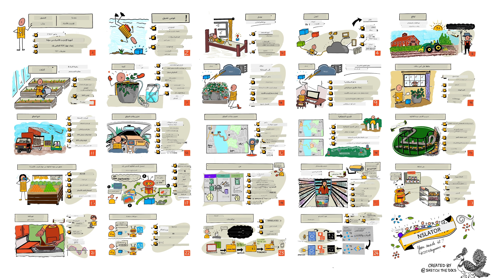

[](https://github.com/microsoft/IoT-For-Beginners/blob/master/LICENSE)
[](https://GitHub.com/microsoft/IoT-For-Beginners/graphs/contributors/)
[](https://GitHub.com/microsoft/IoT-For-Beginners/issues/)
[](https://GitHub.com/microsoft/IoT-For-Beginners/pulls/)
[](http://makeapullrequest.com)

[](https://GitHub.com/microsoft/IoT-For-Beginners/watchers/)
[](https://GitHub.com/microsoft/IoT-For-Beginners/network/)
[](https://GitHub.com/microsoft/IoT-For-Beginners/stargazers/)

### انضم إلى مجتمع Azure AI Foundry

إذا تعثرت أو كان لديك أي أسئلة حول بناء تطبيقات الذكاء الاصطناعي. انضم إلى المتعلمين والمطورين ذوي الخبرة في مناقشات حول MCP. إنه مجتمع داعم حيث تُرحب الأسئلة وتُشارك المعرفة بحرية.

[](https://discord.gg/nTYy5BXMWG)

إذا كان لديك ملاحظات على المنتج أو أخطاء أثناء البناء، قم بزيارة:

[](https://aka.ms/foundry/forum)

اتبع هذه الخطوات للبدء باستخدام هذه الموارد:
1. **استنسخ المستودع**: انقر على [](https://GitHub.com/microsoft/IoT-For-Beginners/fork)
2. **استنسخ المستودع محليًا**: `git clone https://github.com/microsoft/IoT-For-Beginners.git`
3. [**انضم إلى Discord الخاص بـ Microsoft Foundry والتقى بالخبراء والمطورين**](https://discord.com/invite/ByRwuEEgH4)

### 🌐 دعم متعدد اللغات

#### مدعوم عبر GitHub Action (آلي ودائم التحديث)

<!-- CO-OP TRANSLATOR LANGUAGES TABLE START -->
[Arabic](./README.md) | [Bengali](../bn/README.md) | [Bulgarian](../bg/README.md) | [Burmese (Myanmar)](../my/README.md) | [Chinese (Simplified)](../zh-CN/README.md) | [Chinese (Traditional, Hong Kong)](../zh-HK/README.md) | [Chinese (Traditional, Macau)](../zh-MO/README.md) | [Chinese (Traditional, Taiwan)](../zh-TW/README.md) | [Croatian](../hr/README.md) | [Czech](../cs/README.md) | [Danish](../da/README.md) | [Dutch](../nl/README.md) | [Estonian](../et/README.md) | [Finnish](../fi/README.md) | [French](../fr/README.md) | [German](../de/README.md) | [Greek](../el/README.md) | [Hebrew](../he/README.md) | [Hindi](../hi/README.md) | [Hungarian](../hu/README.md) | [Indonesian](../id/README.md) | [Italian](../it/README.md) | [Japanese](../ja/README.md) | [Kannada](../kn/README.md) | [Khmer](../km/README.md) | [Korean](../ko/README.md) | [Lithuanian](../lt/README.md) | [Malay](../ms/README.md) | [Malayalam](../ml/README.md) | [Marathi](../mr/README.md) | [Nepali](../ne/README.md) | [Nigerian Pidgin](../pcm/README.md) | [Norwegian](../no/README.md) | [Persian (Farsi)](../fa/README.md) | [Polish](../pl/README.md) | [Portuguese (Brazil)](../pt-BR/README.md) | [Portuguese (Portugal)](../pt-PT/README.md) | [Punjabi (Gurmukhi)](../pa/README.md) | [Romanian](../ro/README.md) | [Russian](../ru/README.md) | [Serbian (Cyrillic)](../sr/README.md) | [Slovak](../sk/README.md) | [Slovenian](../sl/README.md) | [Spanish](../es/README.md) | [Swahili](../sw/README.md) | [Swedish](../sv/README.md) | [Tagalog (Filipino)](../tl/README.md) | [Tamil](../ta/README.md) | [Telugu](../te/README.md) | [Thai](../th/README.md) | [Turkish](../tr/README.md) | [Ukrainian](../uk/README.md) | [Urdu](../ur/README.md) | [Vietnamese](../vi/README.md)

> **تفضل النسخ محليًا؟**
>
> يشمل هذا المستودع أكثر من 50 ترجمة للغات مما يزيد بشكل كبير من حجم التنزيل. للنسخ بدون الترجمات، استخدم السحب الجزئي:
>
> **Bash / macOS / Linux:**
> ```bash
> git clone --filter=blob:none --sparse https://github.com/microsoft/IoT-For-Beginners.git
> cd IoT-For-Beginners
> git sparse-checkout set --no-cone '/*' '!translations' '!translated_images'
> ```
>
> **CMD (Windows):**
> ```cmd
> git clone --filter=blob:none --sparse https://github.com/microsoft/IoT-For-Beginners.git
> cd IoT-For-Beginners
> git sparse-checkout set --no-cone "/*" "!translations" "!translated_images"
> ```
>
> هذا يمنحك كل ما تحتاجه لإكمال الدورة بسرعة تنزيل أكبر.
<!-- CO-OP TRANSLATOR LANGUAGES TABLE END -->

# إنترنت الأشياء للمبتدئين - منهج دراسي

يسعد مدافعوا Azure Cloud في Microsoft أن يقدموا منهجًا دراسيًا يستمر 12 أسبوعًا ويحتوي على 24 درسًا تدور كلها حول أساسيات إنترنت الأشياء. يتضمن كل درس اختبارات قبل وبعد الدرس، وتعليمات مكتوبة لإكمال الدرس، وحل، ومهمة، والمزيد. تسمح لنا منهجية التعلم المعتمدة على المشاريع بأن تتعلم أثناء البناء، وهي طريقة مثبتة لجعل المهارات الجديدة "تثبت".

تغطي المشاريع رحلة الطعام من المزرعة إلى المائدة. يشمل ذلك الزراعة، واللوجستيات، والتصنيع، والتجزئة، والمستهلك - كل هذه مجالات صناعية شائعة لأجهزة إنترنت الأشياء.



> رسم تخطيطي بواسطة [Nitya Narasimhan](https://github.com/nitya). انقر على الصورة لرؤية نسخة أكبر.

**شكرًا جزيلًا لمؤلفينا [Jen Fox](https://github.com/jenfoxbot)، [Jen Looper](https://github.com/jlooper)، [Jim Bennett](https://github.com/jimbobbennett)، وفنان الرسم التخطيطي لدينا [Nitya Narasimhan](https://github.com/nitya).**

**شكرًا أيضًا لفريقنا من [سفراء طلاب Microsoft Learn](https://studentambassadors.microsoft.com?WT.mc_id=academic-17441-jabenn) الذين قاموا بمراجعة وترجمة هذا المنهج - [Aditya Garg](https://github.com/AdityaGarg00)، [Anurag Sharma](https://github.com/Anurag-0-1-A)، [Arpita Das](https://github.com/Arpiiitaaa)، [Aryan Jain](https://www.linkedin.com/in/aryan-jain-47a4a1145/)، [Bhavesh Suneja](https://github.com/EliteWarrior315)، [Faith Hunja](https://faithhunja.github.io/)، [Lateefah Bello](https://www.linkedin.com/in/lateefah-bello/)، [Manvi Jha](https://github.com/Severus-Matthew)، [Mireille Tan](https://www.linkedin.com/in/mireille-tan-a4834819a/)، [Mohammad Iftekher (Iftu) Ebne Jalal](https://github.com/Iftu119)، [Mohammad Zulfikar](https://github.com/mohzulfikar)، [Priyanshu Srivastav](https://www.linkedin.com/in/priyanshu-srivastav-b067241ba)، [Thanmai Gowducheruvu](https://github.com/innovation-platform)، و[Zina Kamel](https://www.linkedin.com/in/zina-kamel/).**

تعرف على الفريق!

[](https://youtu.be/-wippUJRi5k)

**صورة متحركة بواسطه** [Mohit Jaisal](https://linkedin.com/in/mohitjaisal)

> 🎥 انقر على الصورة أعلاه لمشاهدة فيديو عن المشروع!

> **للمعلمين**، لقد قمنا بـ[تضمين بعض الاقتراحات](for-teachers.md) حول كيفية استخدام هذا المنهج. إذا كنت ترغب في إنشاء دروسك الخاصة، فقد أدرجنا أيضًا [قالب الدرس](lesson-template/README.md).

> **[لطلاب](https://aka.ms/student-page)**، لاستخدام هذا المنهج بمفردكم، استنسخوا المستودع بأكمله وأكملوا التمارين بمفردكم، بدءًا باختبار ما قبل المحاضرة، ثم قراءة المحاضرة وإكمال باقي الأنشطة. حاول إنشاء المشاريع بفهم الدروس بدلاً من نسخ كود الحل؛ ومع ذلك فإن هذا الكود متاح في مجلدات /solutions في كل درس موجه للمشروع. فكرة أخرى هي تشكيل مجموعة دراسة مع الأصدقاء والتعلم معًا. لمزيد من الدراسة، نوصي بـ[Microsoft Learn](https://docs.microsoft.com/users/jimbobbennett/collections/ke2ehd351jopwr?WT.mc_id=academic-17441-jabenn).

لمحة فيديو عن هذه الدورة، شاهد هذا الفيديو:

[](https://youtube.com/watch?v=bccEMm8gRuc "Promo video")

> 🎥 انقر على الصورة أعلاه لمشاهدة فيديو عن المشروع!

## منهجية التدريس

اخترنا مبدئين تربويين أثناء بناء هذا المنهج: ضمان أنه معتمد على المشاريع ويشمل اختبارات متكررة. بحلول نهاية هذه السلسلة، سيكون لدى الطلاب نظام لمراقبة وسقاية النباتات، وتعقب المركبات، وإعداد مصنع ذكي لمراقبة وفحص الطعام، ومؤقت طهي يعمل بالتحكم الصوتي، وسيتعلمون أساسيات إنترنت الأشياء بما في ذلك كيفية كتابة كود الجهاز، والاتصال بالسحابة، وتحليل البيانات التشغيلية، وتشغيل الذكاء الاصطناعي على الحافة.

بضمان توافق المحتوى مع المشاريع، يصبح التعلم أكثر إثارة للطلاب ويزداد احتفاظهم بالمفاهيم.

بالإضافة إلى ذلك، يساعد اختبار منخفض المخاطر قبل الدرس في توجيه نية الطالب نحو تعلم موضوع معين، بينما يضمن اختبار ثانٍ بعد الدرس الاحتفاظ بالمعلومات أكثر. صُمم هذا المنهج ليكون مرنًا وممتعًا، ويمكن أخذه كاملاً أو جزئيًا. تبدأ المشاريع صغيرة وتزداد تعقيدًا تدريجيًا بنهاية دورة الـ 12 أسبوعًا.

كل مشروع مبني حول عتاد متوفر للطلاب والهواة. ينظر كل مشروع في مجال المشروع الخاص به، موفرًا معرفة خلفية ذات صلة. لكي تكون مطورًا ناجحًا، من المفيد فهم المجال الذي تحل فيه المشكلات، وتوفر هذه المعرفة الخلفية للطلاب التفكير في حلول التعلم وإنترنت الأشياء في سياق نوع المشكلة الواقعية التي قد يُطلب منهم حلها كمطور إنترنت الأشياء. يتعلم الطلاب "لماذا" الحلول التي يبنونها، ويحصلون على تقدير للمستخدم النهائي.

## الأجهزة
لدينا خياران من أجهزة إنترنت الأشياء للاستخدام في المشاريع اعتمادًا على التفضيل الشخصي، ومعرفة لغة البرمجة أو التفضيلات، وأهداف التعلم، والتوافر. كما وفرنا أيضًا نسخة "الأجهزة الافتراضية" لأولئك الذين لا يتوفر لديهم الأجهزة، أو يرغبون في التعلم أكثر قبل الالتزام بالشراء. يمكنك القراءة أكثر والعثور على "قائمة التسوق" على [صفحة الأجهزة](./hardware.md)، بما في ذلك روابط لشراء أطقم كاملة من أصدقائنا في Seeed Studio.

> 💁 اعثر على [مدونة السلوك](CODE_OF_CONDUCT.md)، و[الإسهام](CONTRIBUTING.md)، وإرشادات [الترجمات](..). نرحب بتعليقاتكم البناءة!
>
> 🔧 تواجه مشكلة؟ اطلع على [دليل استكشاف الأخطاء وإصلاحها](TROUBLESHOOTING.md) لحلول المشكلات الشائعة.

## كل درس يتضمن:

- ملاحظات مرسومة
- فيديو داعم اختياري
- اختبار إحماء قبل الدرس
- الدرس المكتوب
- للدروس القائمة على المشاريع، أدلة خطوة بخطوة لبناء المشروع
- فحوصات المعرفة
- تحدي
- قراءة داعمة
- واجب
- [اختبار بعد الدرس](https://ff-quizzes.netlify.app/en/)

> **ملاحظة حول الاختبارات:** جميع الاختبارات موجودة في مجلد quiz-app، بواقع 48 اختبارًا، كل اختبار يحتوي على ثلاثة أسئلة. يتم ربطها من داخل الدروس، ولكن يمكن تشغيل تطبيق الاختبار محليًا أو نشره على Azure؛ اتبع التعليمات في مجلد `quiz-app`. يتم تعريبها تدريجيًا.

## الدروس

|       |              اسم المشروع              |                       المفاهيم التي تُدرس                       | أهداف التعلم                                                                                                                                                 |                                                        الدرس المرتبط                                                         |
| :---: | :------------------------------------: | :---------------------------------------------------------: | ------------------------------------------------------------------------------------------------------------------------------------------------------------------- | :--------------------------------------------------------------------------------------------------------------------------: |
|  01   | [البدء](./1-getting-started/README.md) |                     مقدمة إلى إنترنت الأشياء                    | تعلم المبادئ الأساسية لإنترنت الأشياء والعناصر الأساسية لحلول إنترنت الأشياء مثل المستشعرات وخدمات السحابة أثناء إعداد جهاز إنترنت الأشياء الأول الخاص بك |                      [مقدمة إلى إنترنت الأشياء](./1-getting-started/lessons/1-introduction-to-iot/README.md)                      |
|  02   | [البدء](./1-getting-started/README.md) |                   تعمق في إنترنت الأشياء                    | تعلم المزيد عن مكونات نظام إنترنت الأشياء، بالإضافة إلى وحدات التحكم الدقيقة وأجهزة الكمبيوتر ذات اللوحة الواحدة                                                            |                        [تعمق في إنترنت الأشياء](./1-getting-started/lessons/2-deeper-dive/README.md)                         |
|  03   | [البدء](./1-getting-started/README.md) | التفاعل مع العالم المادي باستخدام أجهزة الاستشعار والمشغلات | تعرف على أجهزة الاستشعار لجمع البيانات من العالم المادي، والمشغلات لإرسال ردود الفعل، أثناء بناء ضوء ليلي                                           | [التفاعل مع العالم المادي باستخدام أجهزة الاستشعار والمشغلات](./1-getting-started/lessons/3-sensors-and-actuators/README.md) |
|  04   | [البدء](./1-getting-started/README.md) |             ربط جهازك بالإنترنت             | تعلم كيفية ربط جهاز إنترنت الأشياء بالإنترنت لإرسال واستقبال الرسائل من خلال ربط ضوءك الليلي بوسيط MQTT                               |               [ربط جهازك بالإنترنت](./1-getting-started/lessons/4-connect-internet/README.md)                |
|  05   |            [المزرعة](./2-farm/README.md)            |                    توقع نمو النبات                     | تعلم كيفية توقع نمو النبات باستخدام بيانات درجة الحرارة التي يلتقطها جهاز إنترنت الأشياء                                                                                  |                          [توقع نمو النبات](./2-farm/lessons/1-predict-plant-growth/README.md)                           |
|  06   |            [المزرعة](./2-farm/README.md)            |                    كشف رطوبة التربة                     | تعلم كيفية كشف رطوبة التربة ومعايرة حساس رطوبة التربة                                                                                              |                          [كشف رطوبة التربة](./2-farm/lessons/2-detect-soil-moisture/README.md)                           |
|  07   |            [المزرعة](./2-farm/README.md)            |                  ري النبات الآلي                   | تعلم كيفية أتمتة توقيت الري باستخدام ريلاي و MQTT                                                                                                      |                      [ري النبات الآلي](./2-farm/lessons/3-automated-plant-watering/README.md)                       |
|  08   |            [المزرعة](./2-farm/README.md)            |               نقل بيانات نباتك إلى السحابة               | تعلم عن السحابة وخدمات إنترنت الأشياء المستضافة على السحابة وكيفية ربط نباتك بإحدى هذه الخدمات بدلاً من وسيط MQTT عام                                   |               [نقل بيانات نباتك إلى السحابة](./2-farm/lessons/4-migrate-your-plant-to-the-cloud/README.md)                |
|  09   |            [المزرعة](./2-farm/README.md)            |         نقل منطق تطبيقك إلى السحابة         | تعلم كيفية كتابة منطق التطبيق في السحابة الذي يستجيب لرسائل إنترنت الأشياء                                                                          |         [نقل منطق تطبيقك إلى السحابة](./2-farm/lessons/5-migrate-application-to-the-cloud/README.md)         |
|  10   |            [المزرعة](./2-farm/README.md)            |                   الحفاظ على أمان نباتك                    | تعلم عن الأمان في إنترنت الأشياء وكيفية تأمين نباتك باستخدام المفاتيح والشهادات                                                                          |                        [الحفاظ على أمان نباتك](./2-farm/lessons/6-keep-your-plant-secure/README.md)                         |
|  11   |       [النقل](./3-transport/README.md)       |                      تتبع الموقع                      | تعلم عن تتبع الموقع بواسطة GPS لأجهزة إنترنت الأشياء                                                                                                                   |                           [تتبع الموقع](./3-transport/lessons/1-location-tracking/README.md)                           |
|  12   |       [النقل](./3-transport/README.md)       |                     تخزين بيانات الموقع                     | تعلم كيفية تخزين بيانات إنترنت الأشياء ليتم عرضها أو تحليلها لاحقًا                                                                                                      |                         [تخزين بيانات الموقع](./3-transport/lessons/2-store-location-data/README.md)                         |
|  13   |       [النقل](./3-transport/README.md)       |                   تصور بيانات الموقع                   | تعلم عن تصور بيانات الموقع على خريطة، وكيف تمثل الخرائط العالم الحقيقي ثلاثي الأبعاد في بُعدين                                                            |                     [تصور بيانات الموقع](./3-transport/lessons/3-visualize-location-data/README.md)                     |
|  14   |       [النقل](./3-transport/README.md)       |                          السياجات الجغرافية                          | تعلم عن السياجات الجغرافية وكيف يمكن استخدامها لتنبيه عندما تكون المركبات في سلسلة التوريد قريبة من وجهتها                                           |                                   [السياجات الجغرافية](./3-transport/lessons/4-geofences/README.md)                                   |
|  15   |   [التصنيع](./4-manufacturing/README.md)   |               تدريب كاشف جودة الفواكه                | تعلم عن تدريب مصنف الصور في السحابة لكشف جودة الفواكه                                                                                       |                 [تدريب كاشف جودة الفواكه](./4-manufacturing/lessons/1-train-fruit-detector/README.md)                 |
|  16   |   [التصنيع](./4-manufacturing/README.md)   |           التحقق من جودة الفواكه من جهاز إنترنت الأشياء            | تعلم عن استخدام كاشف جودة الفواكه من جهاز إنترنت الأشياء                                                                                                    |           [التحقق من جودة الفواكه من جهاز إنترنت الأشياء](./4-manufacturing/lessons/2-check-fruit-from-device/README.md)            |
|  17   |   [التصنيع](./4-manufacturing/README.md)   |             تشغيل كاشف الفواكه على الحافة             | تعلم عن تشغيل كاشف الفواكه على جهاز إنترنت الأشياء عند الحافة                                                                                                |             [تشغيل كاشف الفواكه على الحافة](./4-manufacturing/lessons/3-run-fruit-detector-edge/README.md)             |
|  18   |   [التصنيع](./4-manufacturing/README.md)   |        تحفيز كشف جودة الفواكه من مستشعر        | تعلم عن تحفيز كشف جودة الفواكه من مستشعر                                                                                                        |        [تحفيز كشف جودة الفواكه من مستشعر](./4-manufacturing/lessons/4-trigger-fruit-detector/README.md)         |
|  19   |          [التجزئة](./5-retail/README.md)          |                   تدريب كاشف المخزون                    | تعلم كيفية استخدام كشف الكائنات لتدريب كاشف المخزون لحصر المخزون داخل متجر                                                                                |                        [تدريب كاشف المخزون](./5-retail/lessons/1-train-stock-detector/README.md)                         |
|  20   |          [التجزئة](./5-retail/README.md)          |               التحقق من المخزون من جهاز إنترنت الأشياء                | تعلم كيفية فحص المخزون من جهاز إنترنت الأشياء باستخدام نموذج كشف الكائنات                                                                                         |                     [التحقق من المخزون من جهاز إنترنت الأشياء](./5-retail/lessons/2-check-stock-device/README.md)                      |
|  21   |        [المستهلك](./6-consumer/README.md)        |             التعرف على الكلام باستخدام جهاز إنترنت الأشياء             | تعلم كيفية التعرف على الكلام من جهاز إنترنت الأشياء لبناء مؤقت ذكي                                                                                             |                  [التعرف على الكلام باستخدام جهاز إنترنت الأشياء](./6-consumer/lessons/1-speech-recognition/README.md)                  |
|  22   |        [المستهلك](./6-consumer/README.md)        |                     فهم اللغة                     | تعلم كيفية فهم الجمل المنطوقة إلى جهاز إنترنت الأشياء                                                                                                           |                        [فهم اللغة](./6-consumer/lessons/2-language-understanding/README.md)                        |
|  23   |        [المستهلك](./6-consumer/README.md)        |           ضبط مؤقت وتقديم رد صوتي           | تعلم كيفية ضبط مؤقت على جهاز إنترنت الأشياء وتقديم رد صوتي متى تم ضبط المؤقت ومتى ينتهي                                                    |                 [ضبط مؤقت وتقديم رد صوتي](./6-consumer/lessons/3-spoken-feedback/README.md)                  |
|  24   |        [المستهلك](./6-consumer/README.md)        |                 دعم لغات متعددة                  | تعلم كيفية دعم لغات متعددة، سواء في التحدث إلى الجهاز أو الردود من المؤقت الذكي                                                               |                   [دعم لغات متعددة](./6-consumer/lessons/4-multiple-language-support/README.md)                   |

## الوصول دون اتصال

يمكنك تشغيل هذه الوثائق دون اتصال باستخدام [Docsify](https://docsify.js.org/#/). قم باستنساخ هذا المستودع، و[ثبت Docsify](https://docsify.js.org/#/quickstart) على جهازك المحلي، ثم في مجلد الجذر لهذا المستودع، اكتب `docsify serve`. سيتم تشغيل الموقع على المنفذ 3000 على جهاز المضيف المحلي: `localhost:3000`.

## اختبار

شكرًا للمجتمع على استضافة الاختبار التفاعلي الذي يختبر معلوماتك في كل فصل. يمكنك اختبار معلوماتك [هنا](https://ff-quizzes.netlify.app/en/)

### PDF

يمكنك توليد ملف PDF من هذا المحتوى للوصول دون اتصال إذا لزم الأمر. للقيام بذلك، تأكد من تثبيت [npm](https://docs.npmjs.com/downloading-and-installing-node-js-and-npm) وقم بتشغيل الأوامر التالية في المجلد الجذري لهذا المستودع:

```sh
npm i
npm run convert
```

### الشرائح

هناك مجموعات شرائح لبعض الدروس في مجلد [slides](../../slides).

## مناهج أخرى

يقوم فريقنا بإنتاج مناهج أخرى! اطلع على:

<!-- CO-OP TRANSLATOR OTHER COURSES START -->
### LangChain
[](https://aka.ms/langchain4j-for-beginners)
[](https://aka.ms/langchainjs-for-beginners?WT.mc_id=m365-94501-dwahlin)
[](https://github.com/microsoft/langchain-for-beginners?WT.mc_id=m365-94501-dwahlin)
---

### Azure / Edge / MCP / Agents
[](https://github.com/microsoft/AZD-for-beginners?WT.mc_id=academic-105485-koreyst)
[](https://github.com/microsoft/edgeai-for-beginners?WT.mc_id=academic-105485-koreyst)
[](https://github.com/microsoft/mcp-for-beginners?WT.mc_id=academic-105485-koreyst)
[](https://github.com/microsoft/ai-agents-for-beginners?WT.mc_id=academic-105485-koreyst)

---
 
### سلسلة الذكاء الاصطناعي التوليدي
[](https://github.com/microsoft/generative-ai-for-beginners?WT.mc_id=academic-105485-koreyst)
[-9333EA?style=for-the-badge&labelColor=E5E7EB&color=9333EA)](https://github.com/microsoft/Generative-AI-for-beginners-dotnet?WT.mc_id=academic-105485-koreyst)
[-C084FC?style=for-the-badge&labelColor=E5E7EB&color=C084FC)](https://github.com/microsoft/generative-ai-for-beginners-java?WT.mc_id=academic-105485-koreyst)
[-E879F9?style=for-the-badge&labelColor=E5E7EB&color=E879F9)](https://github.com/microsoft/generative-ai-with-javascript?WT.mc_id=academic-105485-koreyst)

---
 
### التعلم الأساسي
[](https://aka.ms/ml-beginners?WT.mc_id=academic-105485-koreyst)
[](https://aka.ms/datascience-beginners?WT.mc_id=academic-105485-koreyst)
[](https://aka.ms/ai-beginners?WT.mc_id=academic-105485-koreyst)
[](https://github.com/microsoft/Security-101?WT.mc_id=academic-96948-sayoung)
[](https://aka.ms/webdev-beginners?WT.mc_id=academic-105485-koreyst)
[](https://aka.ms/iot-beginners?WT.mc_id=academic-105485-koreyst)
[](https://github.com/microsoft/xr-development-for-beginners?WT.mc_id=academic-105485-koreyst)

---
 
### سلسلة Copilot
[](https://aka.ms/GitHubCopilotAI?WT.mc_id=academic-105485-koreyst)
[](https://github.com/microsoft/mastering-github-copilot-for-dotnet-csharp-developers?WT.mc_id=academic-105485-koreyst)
[](https://github.com/microsoft/CopilotAdventures?WT.mc_id=academic-105485-koreyst)
<!-- CO-OP TRANSLATOR OTHER COURSES END -->

## نسب الصور

يمكنك العثور على جميع نسب الصور المستخدمة في هذا المنهج حيثما كان ذلك مطلوبًا في صفحة [النسب](./attributions.md).

---

<!-- CO-OP TRANSLATOR DISCLAIMER START -->
**تنويه**:  
تمت ترجمة هذا المستند باستخدام خدمة الترجمة الآلية [Co-op Translator](https://github.com/Azure/co-op-translator). بينما نسعى لتحقيق الدقة، يرجى العلم أن الترجمات الآلية قد تحتوي على أخطاء أو معلومات غير دقيقة. يجب اعتبار المستند الأصلي بلغته الأصلية المصدر الرسمي والمعتمد. للمعلومات الحرجة، يُنصح بالقيام بترجمة محترفة من قبل بشر متخصصين. نحن غير مسؤولين عن أي سوء فهم أو تفسير خاطئ ناتج عن استخدام هذه الترجمة.
<!-- CO-OP TRANSLATOR DISCLAIMER END -->