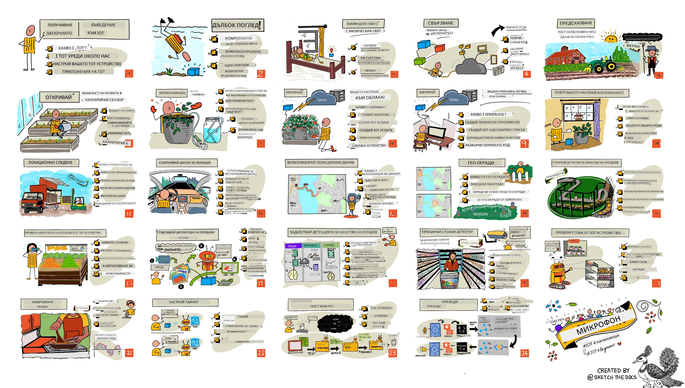

<!--
CO_OP_TRANSLATOR_METADATA:
{
  "original_hash": "6c354ec3487e4f6cfafbe44557996cd9",
  "translation_date": "2026-01-06T15:45:06+00:00",
  "source_file": "README.md",
  "language_code": "bg"
}
-->
[](https://github.com/microsoft/IoT-For-Beginners/blob/master/LICENSE)
[](https://GitHub.com/microsoft/IoT-For-Beginners/graphs/contributors/)
[](https://GitHub.com/microsoft/IoT-For-Beginners/issues/)
[](https://GitHub.com/microsoft/IoT-For-Beginners/pulls/)
[](http://makeapullrequest.com)

[](https://GitHub.com/microsoft/IoT-For-Beginners/watchers/)
[](https://GitHub.com/microsoft/IoT-For-Beginners/network/)
[](https://GitHub.com/microsoft/IoT-For-Beginners/stargazers/)

### Присъединете се към общността Azure AI Foundry

Ако срещнете затруднения или имате въпроси относно създаването на AI приложения. Присъединете се към съмишленици и опитни разработчици в дискусии около MCP. Това е подкрепяща общност, където въпросите са добре дошли и знанието се споделя свободно.

[](https://discord.gg/nTYy5BXMWG)

Ако имате обратна връзка за продукта или грешки по време на създаването, посетете:

[](https://aka.ms/foundry/forum)

Следвайте тези стъпки, за да започнете да използвате тези ресурси:
1. **Форкнете хранилището**: Кликнете [](https://GitHub.com/microsoft/IoT-For-Beginners/fork)
2. **Клонирайте хранилището**:   `git clone https://github.com/microsoft/IoT-For-Beginners.git`
3. [**Присъединете се към Microsoft Foundry Discord и се срещнете с експерти и други разработчици**](https://discord.com/invite/ByRwuEEgH4)


### 🌐 Многоезична поддръжка

#### Поддържа се чрез GitHub Action (Автоматизирано и винаги актуално)

<!-- CO-OP TRANSLATOR LANGUAGES TABLE START -->
[Arabic](../ar/README.md) | [Bengali](../bn/README.md) | [Bulgarian](./README.md) | [Burmese (Myanmar)](../my/README.md) | [Chinese (Simplified)](../zh/README.md) | [Chinese (Traditional, Hong Kong)](../hk/README.md) | [Chinese (Traditional, Macau)](../mo/README.md) | [Chinese (Traditional, Taiwan)](../tw/README.md) | [Croatian](../hr/README.md) | [Czech](../cs/README.md) | [Danish](../da/README.md) | [Dutch](../nl/README.md) | [Estonian](../et/README.md) | [Finnish](../fi/README.md) | [French](../fr/README.md) | [German](../de/README.md) | [Greek](../el/README.md) | [Hebrew](../he/README.md) | [Hindi](../hi/README.md) | [Hungarian](../hu/README.md) | [Indonesian](../id/README.md) | [Italian](../it/README.md) | [Japanese](../ja/README.md) | [Kannada](../kn/README.md) | [Korean](../ko/README.md) | [Lithuanian](../lt/README.md) | [Malay](../ms/README.md) | [Malayalam](../ml/README.md) | [Marathi](../mr/README.md) | [Nepali](../ne/README.md) | [Nigerian Pidgin](../pcm/README.md) | [Norwegian](../no/README.md) | [Persian (Farsi)](../fa/README.md) | [Polish](../pl/README.md) | [Portuguese (Brazil)](../br/README.md) | [Portuguese (Portugal)](../pt/README.md) | [Punjabi (Gurmukhi)](../pa/README.md) | [Romanian](../ro/README.md) | [Russian](../ru/README.md) | [Serbian (Cyrillic)](../sr/README.md) | [Slovak](../sk/README.md) | [Slovenian](../sl/README.md) | [Spanish](../es/README.md) | [Swahili](../sw/README.md) | [Swedish](../sv/README.md) | [Tagalog (Filipino)](../tl/README.md) | [Tamil](../ta/README.md) | [Telugu](../te/README.md) | [Thai](../th/README.md) | [Turkish](../tr/README.md) | [Ukrainian](../uk/README.md) | [Urdu](../ur/README.md) | [Vietnamese](../vi/README.md)

> **Предпочитате да клонирате локално?**

> Това хранилище включва над 50 езикови превода, което значително увеличава размера на изтеглянето. За да клонирате без преводи използвайте sparse checkout:
> ```bash
> git clone --filter=blob:none --sparse https://github.com/microsoft/IoT-For-Beginners.git
> cd IoT-For-Beginners
> git sparse-checkout set --no-cone '/*' '!translations' '!translated_images'
> ```
> Това ви дава всичко необходимо, за да завършите курса с много по-бързо изтегляне.
<!-- CO-OP TRANSLATOR LANGUAGES TABLE END -->

# IoT за начинаещи - Учебна програма

Azure Cloud Advocates в Microsoft с удоволствие предлагат 12-седмична учебна програма с 24 урока, посветени на основите на IoT. Всеки урок включва предварителен и последващ тест, писмени инструкции за изпълнение на урока, решение, задача и още. Нашата проектно-базирана педагогика ви позволява да учите, като изграждате, доказан начин новите умения да се „закрепят“.

Проектите обхващат пътя на храната от фермата до масата. Това включва фермерство, логистика, производство, дребна търговия и потребител - всички популярни индустриални области за IoT устройства.



> Скетчноут от [Nitya Narasimhan](https://github.com/nitya). Кликнете върху изображението за по-голяма версия.

**Сърдечни благодарности на нашите автори [Jen Fox](https://github.com/jenfoxbot), [Jen Looper](https://github.com/jlooper), [Jim Bennett](https://github.com/jimbobbennett) и нашия художник на скетчноути [Nitya Narasimhan](https://github.com/nitya).**

**Благодарности и на нашия екип от [Microsoft Learn Student Ambassadors](https://studentambassadors.microsoft.com?WT.mc_id=academic-17441-jabenn), които преглеждаха и превеждаха тази учебна програма - [Aditya Garg](https://github.com/AdityaGarg00), [Anurag Sharma](https://github.com/Anurag-0-1-A), [Arpita Das](https://github.com/Arpiiitaaa), [Aryan Jain](https://www.linkedin.com/in/aryan-jain-47a4a1145/), [Bhavesh Suneja](https://github.com/EliteWarrior315), [Faith Hunja](https://faithhunja.github.io/), [Lateefah Bello](https://www.linkedin.com/in/lateefah-bello/), [Manvi Jha](https://github.com/Severus-Matthew), [Mireille Tan](https://www.linkedin.com/in/mireille-tan-a4834819a/), [Mohammad Iftekher (Iftu) Ebne Jalal](https://github.com/Iftu119), [Mohammad Zulfikar](https://github.com/mohzulfikar), [Priyanshu Srivastav](https://www.linkedin.com/in/priyanshu-srivastav-b067241ba), [Thanmai Gowducheruvu](https://github.com/innovation-platform) и [Zina Kamel](https://www.linkedin.com/in/zina-kamel/).**

Запознайте се с екипа!

[](https://youtu.be/-wippUJRi5k)

**Gif от** [Mohit Jaisal](https://linkedin.com/in/mohitjaisal)

> 🎥 Кликнете върху изображението по-горе за видео за проекта!

> **Учители**, ние сме включили [някои предложения](for-teachers.md) как да използвате тази учебна програма. Ако желаете да създадете свои собствени уроци, също сме включили [шаблон за урок](lesson-template/README.md).

> **[Студенти](https://aka.ms/student-page)**, за да използвате тази учебна програма самостоятелно, форкнете цялото репо и изпълнете упражненията сами, започвайки с предварителен тест, след това четете лекцията и изпълнете останалата част от активностите. Опитайте се да създадете проектите, като разберете уроците, а не просто копирате кода за решение; въпреки че този код е наличен в папките /solutions във всеки урок, ориентиран към проекти. Друга идея е да формирате учебна група с приятели и да преминете съдържанието заедно. За по-нататъшно учене препоръчваме [Microsoft Learn](https://docs.microsoft.com/users/jimbobbennett/collections/ke2ehd351jopwr?WT.mc_id=academic-17441-jabenn).

За видео преглед на този курс, разгледайте това видео:

[](https://youtube.com/watch?v=bccEMm8gRuc "Рекламен видеоклип")

> 🎥 Кликнете върху изображението по-горе за видео за проекта!

## Педагогика

Избрахме две педагогически принципа при създаването на тази учебна програма: да е проектно-базирана и да включва чести тестове. Към края на тази серия студентите ще са изградили система за наблюдение и поливане на растения, тракер за превозни средства, интелигентна фабрика за проследяване и проверка на храна и гласово управляван таймер за готвене, и ще са научили основите на Интернет на нещата, включително как да пишат код за устройства, да се свързват с облака, анализират телеметрия и изпълняват AI на периферията.

Като гарантираме, че съдържанието е свързано с проекти, процесът става по-ангажиращ за студентите и запомнянето на концепциите се увеличава.

Освен това, тест с нисък залог преди час задава намерението на студента към изучаване на темата, а вторият тест след часа осигурява допълнително затвърждаване. Тази учебна програма е проектирана да бъде гъвкава и забавна и може да бъде преминавана цялостно или частично. Проектите започват малки и завършват с нарастваща сложност до края на 12-седмичния цикъл.

Всеки проект се базира на реален хардуер, достъпен за студенти и хоби ентусиасти. Всеки проект разглежда конкретна домейн област, предлагаща подходящи базови знания. За да бъдете успешен разработчик, помага да разберете домейна, в който решавате проблеми, като предоставянето на тези знания позволява на студентите да мислят за своите IoT решения и учения в контекста на реалния вид проблем, който бихте могли да решавате като IoT разработчик. Студентите научават 'защо' на решенията, които изграждат, и придобиват разбиране за крайния потребител.

## Хардуер

Имаме два варианта за хардуер за IoT за проектите в зависимост от лични предпочитания, познанията или предпочитания към програмен език, учебните цели и наличност. Предложили сме и „виртуален хардуер“ за тези, които нямат достъп до хардуер или искат да научат повече преди да закупят. Можете да прочетете повече и да намерите „списък за пазаруване“ на [страницата за хардуер](./hardware.md), включително връзки за закупуване на комплект от нашите приятели от Seeed Studio.
> 💁 Намерете нашите насоки за [Етичен кодекс](CODE_OF_CONDUCT.md), [Сътрудничество](CONTRIBUTING.md) и [Преводи](TRANSLATIONS.md). Очакваме с нетърпение вашите конструктивни отзиви!
>
> 🔧 Имате проблеми? Вижте нашето [Ръководство за отстраняване на проблеми](TROUBLESHOOTING.md) за решения на често срещани проблеми.

## Всяко урок включва:

- скичнот
- допълнително видео по избор
- предварителен топлинен тест
- писмен урок
- за уроци, базирани на проекти, стъпка по стъпка ръководства как да изградите проекта
- проверки на знания
- предизвикателство
- допълнително четиво
- задание
- [тест след урок](https://ff-quizzes.netlify.app/en/)

> **Бележка относно тестовете**: Всички тестове се съдържат в папката quiz-app, общо 48 теста с по три въпроса всеки. Линковете към тях са в уроците, но приложението за тестове може да се пуска локално или да се разположи в Azure; следвайте инструкциите в папката `quiz-app`. Те постепенно се локализират.

## Уроци

|       |              Име на проект              |                       Обучавани концепции                       | Обучителни цели                                                                                                                                                 |                                                        Свързан урок                                                         |
| :---: | :------------------------------------: | :-------------------------------------------------------------: | -------------------------------------------------------------------------------------------------------------------------------------------------------------- | :--------------------------------------------------------------------------------------------------------------------------: |
|  01   | [Започване](./1-getting-started/README.md) |                     Въведение в IoT                            | Научете основните принципи на IoT и основните градивни елементи на IoT решения като сензори и облачни услуги, докато настройвате първото си IoT устройство |                      [Въведение в IoT](./1-getting-started/lessons/1-introduction-to-iot/README.md)                      |
|  02   | [Започване](./1-getting-started/README.md) |                   По-задълбочен поглед върху IoT              | Научете повече за компонентите на IoT система, както и за микроконтролерите и едноплатковите компютри                                                           |                        [По-задълбочен поглед върху IoT](./1-getting-started/lessons/2-deeper-dive/README.md)                         |
|  03   | [Започване](./1-getting-started/README.md) | Взаимодействие с физическия свят със сензори и изпълнители      | Научете за сензорите за събиране на данни от физическия свят и за изпълнителите за обратна връзка, докато строите нощна лампа                                 | [Взаимодействие с физическия свят със сензори и изпълнители](./1-getting-started/lessons/3-sensors-and-actuators/README.md) |
|  04   | [Започване](./1-getting-started/README.md) |             Свържете устройството си към Интернет             | Научете как да свържете IoT устройство към Интернет, за да изпращате и получавате съобщения чрез свързване на нощната си лампа с MQTT брокер                   |               [Свържете устройството си към Интернет](./1-getting-started/lessons/4-connect-internet/README.md)                |
|  05   |            [Ферма](./2-farm/README.md)            |                    Предсказване на растежа на растенията      | Научете как да предсказвате растежа на растения с помощта на температурни данни, събрани от IoT устройство                                                     |                          [Предсказване на растежа на растенията](./2-farm/lessons/1-predict-plant-growth/README.md)           |
|  06   |            [Ферма](./2-farm/README.md)            |                    Откриване на влага в почвата               | Научете как да откривате влагата в почвата и да калибрирате сензор за влага                                                                                      |                          [Откриване на влага в почвата](./2-farm/lessons/2-detect-soil-moisture/README.md)                     |
|  07   |            [Ферма](./2-farm/README.md)            |                  Автоматизирано поливане на растения          | Научете как да автоматизирате и насрочвате поливане с помощта на реле и MQTT                                                                                     |                      [Автоматизирано поливане на растения](./2-farm/lessons/3-automated-plant-watering/README.md)             |
|  08   |            [Ферма](./2-farm/README.md)            |               Мигрирайте растението си в облака               | Научете за облака и облачните IoT услуги и как да свържете растението си с някоя от тях, вместо с публичен MQTT брокер                                           |               [Мигрирайте растението си в облака](./2-farm/lessons/4-migrate-your-plant-to-the-cloud/README.md)                |
|  09   |            [Ферма](./2-farm/README.md)            |        Мигрирайте логиката на приложението си в облака       | Научете как да пишете логика на приложение в облака, която отговаря на IoT съобщения                                                                             |         [Мигрирайте логиката на приложението си в облака](./2-farm/lessons/5-migrate-application-to-the-cloud/README.md)       |
|  10   |            [Ферма](./2-farm/README.md)            |                   Поддържайте растението си защитено          | Научете за сигурността в IoT и как да пазите растението си защитено с ключове и сертификати                                                                     |                        [Поддържайте растението си защитено](./2-farm/lessons/6-keep-your-plant-secure/README.md)             |
|  11   |       [Транспорт](./3-transport/README.md)       |                      Локализиране на местоположение           | Научете за GPS проследяване на местоположение за IoT устройства                                                                                                 |                           [Локализиране на местоположение](./3-transport/lessons/1-location-tracking/README.md)               |
|  12   |       [Транспорт](./3-transport/README.md)       |                     Записване на данни за местоположение      | Научете как да съхранявате IoT данни, за да бъдат визуализирани или анализирани по-късно                                                                         |                         [Записване на данни за местоположение](./3-transport/lessons/2-store-location-data/README.md)          |
|  13   |       [Транспорт](./3-transport/README.md)       |                   Визуализиране на данни за местоположение    | Научете за визуализиране на данни за местоположение на карта и как картите представят реалния 3D свят в 2 измерения                                              |                     [Визуализиране на данни за местоположение](./3-transport/lessons/3-visualize-location-data/README.md)     |
|  14   |       [Транспорт](./3-transport/README.md)       |                          Геоограждения                        | Научете за геоогражденията и как могат да се използват за предупреждение, когато превозни средства в логистичната верига са близо до местоназначението си         |                                   [Геоограждения](./3-transport/lessons/4-geofences/README.md)                             |
|  15   |   [Производство](./4-manufacturing/README.md)   |               Обучение на детектор за качество на плодове    | Научете за обучението на класификатор за изображения в облака, за да разпознава качеството на плодовете                                                         |                 [Обучение на детектор за качество на плодове](./4-manufacturing/lessons/1-train-fruit-detector/README.md)      |
|  16   |   [Производство](./4-manufacturing/README.md)   |           Проверка на качеството на плодове от IoT устройство | Научете как да използвате детектора за качество на плодове от IoT устройство                                                                                   |           [Проверка на качеството на плодове от IoT устройство](./4-manufacturing/lessons/2-check-fruit-from-device/README.md) |
|  17   |   [Производство](./4-manufacturing/README.md)   |             Стартиране на детектора за плодове на периферията| Научете за стартиране на детектора за плодове на IoT устройство на периферията                                                                                  |             [Стартиране на детектора за плодове на периферията](./4-manufacturing/lessons/3-run-fruit-detector-edge/README.md) |
|  18   |   [Производство](./4-manufacturing/README.md)   |        Активиране на разпознаване на качество на плодове от сензор | Научете за активиране на разпознаване на качество на плодове от сензор                                                                                         |        [Активиране на разпознаване на качество на плодове от сензор](./4-manufacturing/lessons/4-trigger-fruit-detector/README.md) |
|  19   |          [Търговия на дребно](./5-retail/README.md)          |                   Обучение на детектор за наличности          | Научете как да използвате откриване на обекти за обучение на детектор за наличности в магазин                                                                   |                        [Обучение на детектор за наличности](./5-retail/lessons/1-train-stock-detector/README.md)              |
|  20   |          [Търговия на дребно](./5-retail/README.md)          |               Проверка на наличности от IoT устройство         | Научете как да проверявате наличности от IoT устройство с модел за откриване на обекти                                                                          |                     [Проверка на наличности от IoT устройство](./5-retail/lessons/2-check-stock-device/README.md)             |
|  21   |        [Потребителски](./6-consumer/README.md)        |             Разпознаване на реч с IoT устройство              | Научете как да разпознавате реч от IoT устройство за създаване на умен таймер                                                                                   |                  [Разпознаване на реч с IoT устройство](./6-consumer/lessons/1-speech-recognition/README.md)                   |
|  22   |        [Потребителски](./6-consumer/README.md)        |                     Разбиране на език                          | Научете как да разбирате изречения, говорени към IoT устройство                                                                                                |                        [Разбиране на език](./6-consumer/lessons/2-language-understanding/README.md)                           |
|  23   |        [Потребителски](./6-consumer/README.md)        |           Настройка на таймер и даване на устна обратна връзка | Научете как да настройвате таймер на IoT устройство и да давате устна обратна връзка кога таймерът е зададен и кога приключва                                   |                 [Настройка на таймер и устна обратна връзка](./6-consumer/lessons/3-spoken-feedback/README.md)                |
|  24   |        [Потребителски](./6-consumer/README.md)        |                 Поддръжка на няколко езика                     | Научете как да поддържате няколко езика, както за говора, така и за отговорите от умния таймер                                                                   |                   [Поддръжка на няколко езика](./6-consumer/lessons/4-multiple-language-support/README.md)                   |

## Офлайн достъп

Можете да използвате тази документация офлайн с помощта на [Docsify](https://docsify.js.org/#/). Форкнете това хранилище, [инсталирайте Docsify](https://docsify.js.org/#/quickstart) на вашата локална машина и след това в основната папка на това хранилище изпълнете `docsify serve`. Уебсайтът ще бъде достъпен на порт 3000 на вашия localhost: `localhost:3000`.

## Тест

Благодарности на общността за осигуряването на интерактивния тест, който тества знанията ви за всяка от главите. Тествайте знанията си [тук](https://ff-quizzes.netlify.app/en/)

### PDF

Можете да генерирате PDF на това съдържание за офлайн достъп при нужда. За това се уверете, че имате [npm инсталиран](https://docs.npmjs.com/downloading-and-installing-node-js-and-npm) и изпълнете следните команди в основната папка на това хранилище:

```sh
npm i
npm run convert
```

### Слайдове

Има слайдове за някои от уроците в папката [slides](../../slides).


## Други учебни планове

Нашият екип създава и други учебни планове! Вижте:

<!-- CO-OP TRANSLATOR OTHER COURSES START -->
### LangChain
[](https://aka.ms/langchain4j-for-beginners)
[](https://aka.ms/langchainjs-for-beginners?WT.mc_id=m365-94501-dwahlin)

---

### Azure / Edge / MCP / Агенти
[](https://github.com/microsoft/AZD-for-beginners?WT.mc_id=academic-105485-koreyst)
[](https://github.com/microsoft/edgeai-for-beginners?WT.mc_id=academic-105485-koreyst)
[](https://github.com/microsoft/mcp-for-beginners?WT.mc_id=academic-105485-koreyst)
[](https://github.com/microsoft/ai-agents-for-beginners?WT.mc_id=academic-105485-koreyst)

---
 
### Серия за генеративен AI
[](https://github.com/microsoft/generative-ai-for-beginners?WT.mc_id=academic-105485-koreyst)
[-9333EA?style=for-the-badge&labelColor=E5E7EB&color=9333EA)](https://github.com/microsoft/Generative-AI-for-beginners-dotnet?WT.mc_id=academic-105485-koreyst)
[-C084FC?style=for-the-badge&labelColor=E5E7EB&color=C084FC)](https://github.com/microsoft/generative-ai-for-beginners-java?WT.mc_id=academic-105485-koreyst)
[-E879F9?style=for-the-badge&labelColor=E5E7EB&color=E879F9)](https://github.com/microsoft/generative-ai-with-javascript?WT.mc_id=academic-105485-koreyst)

---
 
### Основно обучение
[](https://aka.ms/ml-beginners?WT.mc_id=academic-105485-koreyst)
[](https://aka.ms/datascience-beginners?WT.mc_id=academic-105485-koreyst)
[](https://aka.ms/ai-beginners?WT.mc_id=academic-105485-koreyst)
[](https://github.com/microsoft/Security-101?WT.mc_id=academic-96948-sayoung)
[](https://aka.ms/webdev-beginners?WT.mc_id=academic-105485-koreyst)
[](https://aka.ms/iot-beginners?WT.mc_id=academic-105485-koreyst)
[](https://github.com/microsoft/xr-development-for-beginners?WT.mc_id=academic-105485-koreyst)

---
 
### Серия Copilot
[](https://aka.ms/GitHubCopilotAI?WT.mc_id=academic-105485-koreyst)
[](https://github.com/microsoft/mastering-github-copilot-for-dotnet-csharp-developers?WT.mc_id=academic-105485-koreyst)
[](https://github.com/microsoft/CopilotAdventures?WT.mc_id=academic-105485-koreyst)
<!-- CO-OP TRANSLATOR OTHER COURSES END -->

## Източници на изображения

Можете да намерите всички източници на използваните изображения в тази учебна програма, където е необходимо, в [Източници](./attributions.md).

---

<!-- CO-OP TRANSLATOR DISCLAIMER START -->
**Отказ от отговорност**:
Този документ е преведен с помощта на AI преводаческа услуга [Co-op Translator](https://github.com/Azure/co-op-translator). Въпреки че се стремим към точност, моля, имайте предвид, че автоматичните преводи могат да съдържат грешки или неточности. Оригиналният документ на неговия език трябва да се счита за авторитетен източник. За критична информация се препоръчва професионален човешки превод. Ние не носим отговорност за недоразумения или неправилни тълкувания, произтичащи от използването на този превод.
<!-- CO-OP TRANSLATOR DISCLAIMER END -->