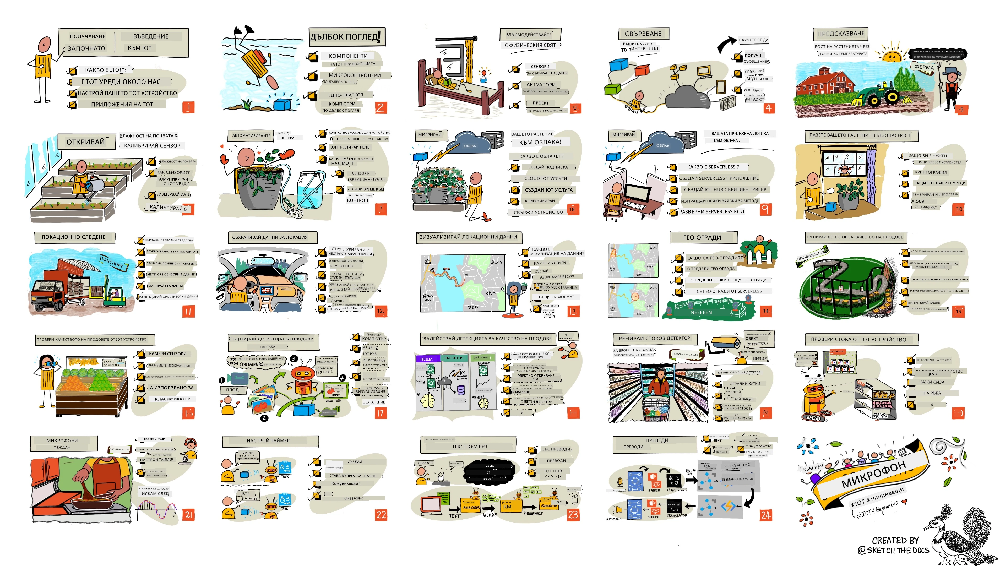

### Присъединете се към общността Azure AI Foundry

Ако сте блокирани или имате въпроси относно изграждането на AI приложения. Присъединете се към други учащи и опитни разработчици в дискусии за MCP. Това е подкрепяща общност, в която въпросите са добре дошли и знанията се споделят свободно.

Ако имате обратна връзка за продукта или грешки по време на изграждане, посетете:

Следвайте тези стъпки, за да започнете да използвате тези ресурси:  
1. **Fork-нете хранилището**: Кликнете [](https://GitHub.com/microsoft/IoT-For-Beginners/fork)  
2. **Клонирайте хранилището**: `git clone https://github.com/microsoft/IoT-For-Beginners.git`  
3. [**Присъединете се към Microsoft Foundry Discord и срещнете експерти и други разработчици**](https://discord.com/invite/ByRwuEEgH4)

### 🌐 Многезична поддръжка

#### Поддържа се чрез GitHub Action (Автоматично и винаги актуално)

> **Предпочитате да клонирате локално?**  
> Това хранилище включва 50+ езикови превода, което значително увеличава размера на изтеглянето. За да клонирате без преводи, използвайте sparse checkout:  
> **Bash / macOS / Linux:**  
> ```bash
> git clone --filter=blob:none --sparse https://github.com/microsoft/IoT-For-Beginners.git
> cd IoT-For-Beginners
> git sparse-checkout set --no-cone '/*' '!translations' '!translated_images'
> ```
>  
> **CMD (Windows):**  
> ```cmd
> git clone --filter=blob:none --sparse https://github.com/microsoft/IoT-For-Beginners.git
> cd IoT-For-Beginners
> git sparse-checkout set --no-cone "/*" "!translations" "!translated_images"
> ```
>  
> Това ви осигурява всичко необходимо за завършване на курса с много по-бързо изтегляне.

# IoT за начинаещи - Учебна програма

Екипът Azure Cloud Advocates от Microsoft с удоволствие предлага 12-седмична учебна програма с 24 урока, посветени изцяло на основите на IoT. Всеки урок включва въпроси преди и след урока, писмени инструкции за изпълнение на урока, решение, домашна работа и още. Нашата проектно-базирана педагогика ви позволява да учите, докато създавате, доказан начин новите умения да се „закрепят“.

Проектите покриват пътя на храната от фермата до трапезата. Това включва земеделие, логистика, производство, търговия на дребно и потребител – всички популярни индустриални области за IoT устройства.



> Скетч нот от [Nitya Narasimhan](https://github.com/nitya). Кликнете на изображението за по-голяма версия.

**Сърдечни благодарности на нашите автори [Jen Fox](https://github.com/jenfoxbot), [Jen Looper](https://github.com/jlooper), [Jim Bennett](https://github.com/jimbobbennett) и нашия художник на скечове [Nitya Narasimhan](https://github.com/nitya).**

**Благодарности и на нашия екип от [Microsoft Learn Student Ambassadors](https://studentambassadors.microsoft.com?WT.mc_id=academic-17441-jabenn), които преглеждаха и превеждаха тази учебна програма - [Aditya Garg](https://github.com/AdityaGarg00), [Anurag Sharma](https://github.com/Anurag-0-1-A), [Arpita Das](https://github.com/Arpiiitaaa), [Aryan Jain](https://www.linkedin.com/in/aryan-jain-47a4a1145/), [Bhavesh Suneja](https://github.com/EliteWarrior315), [Faith Hunja](https://faithhunja.github.io/), [Lateefah Bello](https://www.linkedin.com/in/lateefah-bello/), [Manvi Jha](https://github.com/Severus-Matthew), [Mireille Tan](https://www.linkedin.com/in/mireille-tan-a4834819a/), [Mohammad Iftekher (Iftu) Ebne Jalal](https://github.com/Iftu119), [Mohammad Zulfikar](https://github.com/mohzulfikar), [Priyanshu Srivastav](https://www.linkedin.com/in/priyanshu-srivastav-b067241ba), [Thanmai Gowducheruvu](https://github.com/innovation-platform) и [Zina Kamel](https://www.linkedin.com/in/zina-kamel/).**

Запознайте се с екипа!

**Gif от** [Mohit Jaisal](https://linkedin.com/in/mohitjaisal)

> 🎥 Кликнете на горното изображение за видео за проекта!

> **Учители**, ние включихме някои предложения за това как да използвате тази учебна програма. Ако искате да създадете свои собствени уроци, имаме и шаблон за урок.

> **Студенти**, за да използвате тази учебна програма самостоятелно, форкнете цялото репо и завършете упражненията сами, започвайки с тест преди лекция, след това прочетете лекцията и направете останалите дейности. Опитайте се да създадете проектите, като разбирате уроците, а не просто копирате кода за решения, въпреки че този код е наличен в папките /solutions във всеки проектно-ориентиран урок. Друга идея е да сформирате учебна група с приятели и да преминете през съдържанието заедно. За допълнително учене препоръчваме [Microsoft Learn](https://docs.microsoft.com/users/jimbobbennett/collections/ke2ehd351jopwr?WT.mc_id=academic-17441-jabenn).

За видео обзор на този курс, вижте това видео:

> 🎥 Кликнете на горното изображение за видео за проекта!

## Педагогика

Избрахме две педагогически принципа при изграждането на тази учебна програма: да бъде базирана на проекти и да включва чести тестове. Края на серията ще имате изградена система за наблюдение и поливане на растения, тракер за превозни средства, умна фабрика за проследяване и контрол на храни и гласово управляван таймер за готвене, и ще сте научили основите на Интернет на нещата, включително как да пишете код за устройства, да се свързвате с облака, да анализирате телеметрия и да стартирате AI на ръба.

Като осигурим съдържанието да съответства на проектите, процесът става по-ангажиращ за студентите и задържането на концепциите се увеличава.

Освен това, тест с ниска сложност преди урок насочва вниманието на студента към изучаваната тема, а втори тест след урока осигурява допълнително задържане. Тази учебна програма е проектирана да бъде гъвкава и забавна и може да се премине изцяло или частично. Проектите започват малки и стават все по-сложни към края на 12-седмичния цикъл.

Всеки проект е базиран на реален хардуер, достъпен за студенти и любители. Всеки проект разглежда специфичната проектна област, предоставяйки съответното фоново знание. За да бъдете успешен разработчик, е полезно да разбирате областта, в която решавате проблеми, а предоставянето на това фоново знание позволява на студентите да мислят за своите IoT решения и учения в контекста на реалните проблеми, които могат да бъдат помолени да решат като IoT разработчици. Студентите научават „защо“ на решенията, които изграждат, и получават разбиране за крайния потребител.

## Хардуер
Имаме два варианта за хардуер за IoT, които да използваме за проектите в зависимост от личните предпочитания, знания по програмни езици или предпочитания, цели за учене и наличност. Също така сме предоставили „виртуална хардуерна“ версия за тези, които нямат достъп до хардуер или искат да научат повече преди да предприемат покупка. Можете да прочетете повече и да намерите „списък за пазаруване“ на [страницата за хардуер](./hardware.md), включително връзки за покупка на комплекти от нашите приятели от Seeed Studio.

> 💁 Намерете нашите указания за [Кодекс на поведение](CODE_OF_CONDUCT.md), [Приноси](CONTRIBUTING.md) и [Преводи](..). Очакваме вашата конструктивна обратна връзка!
>
> 🔧 Имате проблеми? Разгледайте нашето [Ръководство за отстраняване на неизправности](TROUBLESHOOTING.md) за решения на често срещани проблеми.

## Всяко упражнение включва:

- скицник
- допълнително видео по избор
- предварителен тест за затопляне преди урока
- писмен урок
- за уроци с проекти — ръководства стъпка по стъпка за изграждане на проекта
- проверки на знанията
- предизвикателство
- допълнително четиво
- задание
- [тест след урок](https://ff-quizzes.netlify.app/en/)

> **Бележка относно тестовете**: Всички тестове са в папката quiz-app, общо 48 теста с по три въпроса всеки. Те са свързани от уроците, но приложението за тестове може да се пуска локално или да се разгръща в Azure; следвайте инструкциите в папката `quiz-app`. Те постепенно се локализират.

## Уроци

|       |              Име на проекта              |                       Обучавани концепции                       | Учебни цели                                                                                                                                                 |                                                        Свързан урок                                                         |
| :---: | :------------------------------------: | :---------------------------------------------------------: | ----------------------------------------------------------------------------------------------------------------------------------------------------------- | :--------------------------------------------------------------------------------------------------------------------------: |
|  01   | [Първи стъпки](./1-getting-started/README.md) |                     Въведение в IoT                     | Научете основните принципи на IoT и основните градивни елементи на IoT решения като сензори и облачни услуги, докато настройвате първото си IoT устройство |                      [Въведение в IoT](./1-getting-started/lessons/1-introduction-to-iot/README.md)                      |
|  02   | [Първи стъпки](./1-getting-started/README.md) |                   По-задълбочено в IoT                    | Научете повече за компонентите на IoT система, микроконтролери и едноплаткови компютри                                                            |                        [По-задълбочено в IoT](./1-getting-started/lessons/2-deeper-dive/README.md)                         |
|  03   | [Първи стъпки](./1-getting-started/README.md) | Взаимодействие с физическия свят чрез сензори и актуатори | Научете за сензорите за събиране на данни от физическия свят и актуаторите за изпращане на обратна връзка, докато изграждате нощна лампа                                           | [Взаимодействие с физическия свят чрез сензори и актуатори](./1-getting-started/lessons/3-sensors-and-actuators/README.md) |
|  04   | [Първи стъпки](./1-getting-started/README.md) |             Свържете устройството си с Интернет             | Научете как да свържете IoT устройство с интернет за изпращане и получаване на съобщения чрез свързване на вашата нощна лампа с MQTT брокер                               |               [Свържете устройството си с Интернет](./1-getting-started/lessons/4-connect-internet/README.md)                |
|  05   |            [Ферма](./2-farm/README.md)            |                    Предсказване на растеж на растения                    | Научете как да предсказвате растежа на растенията чрез данни за температура, засечени от IoT устройство                                                                                  |                          [Предсказване на растеж на растения](./2-farm/lessons/1-predict-plant-growth/README.md)                           |
|  06   |            [Ферма](./2-farm/README.md)            |                    Откриване на влажност на почвата                    | Научете как да откривате влажността на почвата и да калибрирате сензор за влажност на почвата                                                                                              |                          [Откриване на влажност на почвата](./2-farm/lessons/2-detect-soil-moisture/README.md)                           |
|  07   |            [Ферма](./2-farm/README.md)            |                  Автоматизирано напояване                   | Научете как да автоматизирате и таймизирате поливането с помощта на реле и MQTT                                                                                                      |                      [Автоматизирано напояване](./2-farm/lessons/3-automated-plant-watering/README.md)                       |
|  08   |            [Ферма](./2-farm/README.md)            |               Мигрирайте растението си в облака               | Научете за облака и облачните IoT услуги и как да свържете вашето растение с някоя от тях вместо с публичен MQTT брокер                                   |               [Мигрирайте растението си в облака](./2-farm/lessons/4-migrate-your-plant-to-the-cloud/README.md)                |
|  09   |            [Ферма](./2-farm/README.md)            |         Мигрирайте логиката на приложението си в облака         | Научете как можете да пишете логика на приложение в облака, която отговаря на IoT съобщения                                                                          |         [Мигрирайте логиката на приложението си в облака](./2-farm/lessons/5-migrate-application-to-the-cloud/README.md)         |
|  10   |            [Ферма](./2-farm/README.md)            |                   Осигурете защитата на растението си                    | Научете за сигурността в IoT и как да защитите вашето растение с ключове и сертификати                                                                          |                        [Осигурете защитата на растението си](./2-farm/lessons/6-keep-your-plant-secure/README.md)                         |
|  11   |       [Транспорт](./3-transport/README.md)       |                      Проследяване на местоположение                      | Научете за GPS проследяване на местоположение за IoT устройства                                                                                                                   |                           [Проследяване на местоположение](./3-transport/lessons/1-location-tracking/README.md)                           |
|  12   |       [Транспорт](./3-transport/README.md)       |                     Съхранение на данни за местоположение                     | Научете как да съхранявате IoT данни за по-късно визуализиране или анализ                                                                                                      |                         [Съхранение на данни за местоположение](./3-transport/lessons/2-store-location-data/README.md)                         |
|  13   |       [Транспорт](./3-transport/README.md)       |                   Визуализация на данни за местоположение                   | Научете за визуализиране на данни за местоположение върху карта и как картите представят реалния 3D свят в 2 измерения                                                            |                     [Визуализация на данни за местоположение](./3-transport/lessons/3-visualize-location-data/README.md)                     |
|  14   |       [Транспорт](./3-transport/README.md)       |                          Геозони                          | Научете за геозоните и как могат да бъдат използвани за предупреждение, когато превозни средства от веригата на доставки са близко до предназначеното им място                                           |                                   [Геозони](./3-transport/lessons/4-geofences/README.md)                                   |
|  15   |   [Производство](./4-manufacturing/README.md)   |               Обучение на детектор за качество на плодове                | Научете за обучението на класификатор на изображения в облака за откриване на качество на плодове                                                                                       |                 [Обучение на детектор за качество на плодове](./4-manufacturing/lessons/1-train-fruit-detector/README.md)                 |
|  16   |   [Производство](./4-manufacturing/README.md)   |           Проверка на качеството на плодове от IoT устройство            | Научете за използване на вашия детектор за качество на плодове от IoT устройство                                                                                                    |           [Проверка на качеството на плодове от IoT устройство](./4-manufacturing/lessons/2-check-fruit-from-device/README.md)            |
|  17   |   [Производство](./4-manufacturing/README.md)   |             Стартиране на детектора за плодове на ръба             | Научете за стартиране на детектора за плодове на IoT устройство на ръба                                                                                                |             [Стартиране на детектора за плодове на ръба](./4-manufacturing/lessons/3-run-fruit-detector-edge/README.md)             |
|  18   |   [Производство](./4-manufacturing/README.md)   |        Активиране на откриване на качество на плод от сензор        | Научете за активиране на откриване на качество на плодове от сензор                                                                                                        |        [Активиране на откриване на качество на плод от сензор](./4-manufacturing/lessons/4-trigger-fruit-detector/README.md)         |
|  19   |          [Търговия](./5-retail/README.md)          |                   Обучение на детектор за наличности                    | Научете как чрез откриване на обекти да обучите детектор за наличности, който брои наличностите в магазин                                                                                |                        [Обучение на детектор за наличности](./5-retail/lessons/1-train-stock-detector/README.md)                         |
|  20   |          [Търговия](./5-retail/README.md)          |               Проверка на наличност от IoT устройство                | Научете как да проверявате наличности от IoT устройство с помощта на модел за откриване на обекти                                                                                         |                     [Проверка на наличност от IoT устройство](./5-retail/lessons/2-check-stock-device/README.md)                      |
|  21   |        [Потребител](./6-consumer/README.md)        |             Разпознаване на реч с IoT устройство             | Научете как да разпознавате реч от IoT устройство, за да изградите интелигентен таймер                                                                                             |                  [Разпознаване на реч с IoT устройство](./6-consumer/lessons/1-speech-recognition/README.md)                  |
|  22   |        [Потребител](./6-consumer/README.md)        |                     Разбиране на езика                     | Научете как да разбирате изречения, казани на IoT устройство                                                                                                           |                        [Разбиране на езика](./6-consumer/lessons/2-language-understanding/README.md)                        |
|  23   |        [Потребител](./6-consumer/README.md)        |           Настройване на таймер и предоставяне на гласова обратна връзка           | Научете как да настроите таймер на IoT устройство и да дадете гласова обратна връзка за поставяне и приключване на таймера                                                    |                 [Настройване на таймер и предоставяне на гласова обратна връзка](./6-consumer/lessons/3-spoken-feedback/README.md)                  |
|  24   |        [Потребител](./6-consumer/README.md)        |                 Поддръжка на множество езици                  | Научете как да поддържате множество езици, както за говорене към устройството, така и за отговорите от вашия интелигентен таймер                                                               |                   [Поддръжка на множество езици](./6-consumer/lessons/4-multiple-language-support/README.md)                   |

## Офлайн достъп

Можете да ползвате тази документация офлайн чрез [Docsify](https://docsify.js.org/#/). Форкнете това хранилище, [инсталирайте Docsify](https://docsify.js.org/#/quickstart) на локалната си машина и след това в кореновата папка на това хранилище изпълнете `docsify serve`. Уебсайтът ще бъде достъпен на порт 3000 на вашия localhost: `localhost:3000`.

## Тест

Благодарности на общността, която хоства интерактивния тест, който тества знанията ви по всяка глава. Тествайте знанията си [тук](https://ff-quizzes.netlify.app/en/) 

### PDF

Можете да генерирате PDF на това съдържание за офлайн достъп, ако е необходимо. За да го направите, уверете се, че имате [npm инсталиран](https://docs.npmjs.com/downloading-and-installing-node-js-and-npm) и изпълнете следните команди в кореновата папка на това хранилище:

```sh
npm i
npm run convert
```

### Презентации

Има презентации за някои от уроците в папката [slides](../../slides).

## Други учебни планове

Нашият екип създава и други учебни планове! Разгледайте:

<!-- CO-OP TRANSLATOR OTHER COURSES START -->
### LangChain
[](https://aka.ms/langchain4j-for-beginners)
[](https://aka.ms/langchainjs-for-beginners?WT.mc_id=m365-94501-dwahlin)
[](https://github.com/microsoft/langchain-for-beginners?WT.mc_id=m365-94501-dwahlin)
---

### Azure / Edge / MCP / Agents
[](https://github.com/microsoft/AZD-for-beginners?WT.mc_id=academic-105485-koreyst)
[](https://github.com/microsoft/edgeai-for-beginners?WT.mc_id=academic-105485-koreyst)
[](https://github.com/microsoft/mcp-for-beginners?WT.mc_id=academic-105485-koreyst)
[](https://github.com/microsoft/ai-agents-for-beginners?WT.mc_id=academic-105485-koreyst)

---
 
### Поредица за генеративен ИИ
[](https://github.com/microsoft/generative-ai-for-beginners?WT.mc_id=academic-105485-koreyst)
[-9333EA?style=for-the-badge&labelColor=E5E7EB&color=9333EA)](https://github.com/microsoft/Generative-AI-for-beginners-dotnet?WT.mc_id=academic-105485-koreyst)
[-C084FC?style=for-the-badge&labelColor=E5E7EB&color=C084FC)](https://github.com/microsoft/generative-ai-for-beginners-java?WT.mc_id=academic-105485-koreyst)
[-E879F9?style=for-the-badge&labelColor=E5E7EB&color=E879F9)](https://github.com/microsoft/generative-ai-with-javascript?WT.mc_id=academic-105485-koreyst)

---
 
### Основно обучение
[](https://aka.ms/ml-beginners?WT.mc_id=academic-105485-koreyst)
[](https://aka.ms/datascience-beginners?WT.mc_id=academic-105485-koreyst)
[](https://aka.ms/ai-beginners?WT.mc_id=academic-105485-koreyst)
[](https://github.com/microsoft/Security-101?WT.mc_id=academic-96948-sayoung)
[](https://aka.ms/webdev-beginners?WT.mc_id=academic-105485-koreyst)
[](https://aka.ms/iot-beginners?WT.mc_id=academic-105485-koreyst)
[](https://github.com/microsoft/xr-development-for-beginners?WT.mc_id=academic-105485-koreyst)

---
 
### Поредица Copilot
[](https://aka.ms/GitHubCopilotAI?WT.mc_id=academic-105485-koreyst)
[](https://github.com/microsoft/mastering-github-copilot-for-dotnet-csharp-developers?WT.mc_id=academic-105485-koreyst)
[](https://github.com/microsoft/CopilotAdventures?WT.mc_id=academic-105485-koreyst)
<!-- CO-OP TRANSLATOR OTHER COURSES END -->

## Източници на изображения

Можете да намерите всички източници на използваните изображения в тази учебна програма, когато е необходимо, в [Attributions](./attributions.md).

---

<!-- CO-OP TRANSLATOR DISCLAIMER START -->
**Отказ от отговорност**:
Този документ е преведен с помощта на AI преводаческа услуга [Co-op Translator](https://github.com/Azure/co-op-translator). Въпреки че се стремим към точност, моля, имайте предвид, че автоматизираните преводи могат да съдържат грешки или неточности. Оригиналният документ на неговия език трябва да се счита за авторитетен източник. За критична информация се препоръчва професионален човешки превод. Ние не носим отговорност за каквито и да е недоразумения или неправилни тълкувания, произтичащи от използването на този превод.
<!-- CO-OP TRANSLATOR DISCLAIMER END -->