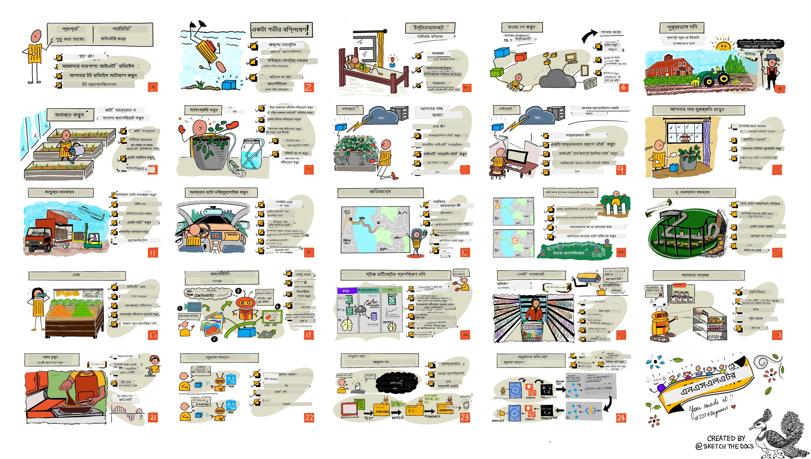

<!--
CO_OP_TRANSLATOR_METADATA:
{
  "original_hash": "6c354ec3487e4f6cfafbe44557996cd9",
  "translation_date": "2026-01-05T21:47:07+00:00",
  "source_file": "README.md",
  "language_code": "bn"
}
-->
[](https://github.com/microsoft/IoT-For-Beginners/blob/master/LICENSE)
[](https://GitHub.com/microsoft/IoT-For-Beginners/graphs/contributors/)
[](https://GitHub.com/microsoft/IoT-For-Beginners/issues/)
[](https://GitHub.com/microsoft/IoT-For-Beginners/pulls/)
[](http://makeapullrequest.com)

[](https://GitHub.com/microsoft/IoT-For-Beginners/watchers/)
[](https://GitHub.com/microsoft/IoT-For-Beginners/network/)
[](https://GitHub.com/microsoft/IoT-For-Beginners/stargazers/)

### Azure AI Foundry কমিউনিটিতে যোগ দিন

যদি আপনি আটকে যান বা AI অ্যাপ তৈরি সম্পর্কে কোনো প্রশ্ন থাকে। MCP বিষয়ে আলোচনা করার জন্য সহপাঠী ও অভিজ্ঞ ডেভেলপারদের সাথে যোগ দিন। এটি একটি সহায়ক কমিউনিটি যেখানে প্রশ্ন歓迎 এবং জ্ঞান মুক্তভাবে ভাগ করা হয়।

[](https://discord.gg/nTYy5BXMWG)

যদি আপনার পণ্য সম্পর্কিত প্রতিক্রিয়া বা ত্রুটি থাকে, তাহলে দেখুন:

[](https://aka.ms/foundry/forum)

এই রিসোর্সগুলো ব্যবহারের জন্য এই ধাপগুলো অনুসরণ করুন:
1. **রিপোজিটরি ফর্ক করুন**: ক্লিক করুন [](https://GitHub.com/microsoft/IoT-For-Beginners/fork)
2. **রিপোজিটরি ক্লোন করুন**:   `git clone https://github.com/microsoft/IoT-For-Beginners.git`
3. [**Microsoft Foundry Discord-এ যোগ দিন এবং বিশেষজ্ঞ ও সহকর্মী ডেভেলপারদের সাথে যোগাযোগ করুন**](https://discord.com/invite/ByRwuEEgH4)


### 🌐 বহুভাষা সমর্থন 

#### GitHub Action এর মাধ্যমে সমর্থিত (স্বয়ংক্রিয় ও সর্বদা আপ-টু-ডেট)

<!-- CO-OP TRANSLATOR LANGUAGES TABLE START -->
[Arabic](../ar/README.md) | [Bengali](./README.md) | [Bulgarian](../bg/README.md) | [Burmese (Myanmar)](../my/README.md) | [Chinese (Simplified)](../zh/README.md) | [Chinese (Traditional, Hong Kong)](../hk/README.md) | [Chinese (Traditional, Macau)](../mo/README.md) | [Chinese (Traditional, Taiwan)](../tw/README.md) | [Croatian](../hr/README.md) | [Czech](../cs/README.md) | [Danish](../da/README.md) | [Dutch](../nl/README.md) | [Estonian](../et/README.md) | [Finnish](../fi/README.md) | [French](../fr/README.md) | [German](../de/README.md) | [Greek](../el/README.md) | [Hebrew](../he/README.md) | [Hindi](../hi/README.md) | [Hungarian](../hu/README.md) | [Indonesian](../id/README.md) | [Italian](../it/README.md) | [Japanese](../ja/README.md) | [Kannada](../kn/README.md) | [Korean](../ko/README.md) | [Lithuanian](../lt/README.md) | [Malay](../ms/README.md) | [Malayalam](../ml/README.md) | [Marathi](../mr/README.md) | [Nepali](../ne/README.md) | [Nigerian Pidgin](../pcm/README.md) | [Norwegian](../no/README.md) | [Persian (Farsi)](../fa/README.md) | [Polish](../pl/README.md) | [Portuguese (Brazil)](../br/README.md) | [Portuguese (Portugal)](../pt/README.md) | [Punjabi (Gurmukhi)](../pa/README.md) | [Romanian](../ro/README.md) | [Russian](../ru/README.md) | [Serbian (Cyrillic)](../sr/README.md) | [Slovak](../sk/README.md) | [Slovenian](../sl/README.md) | [Spanish](../es/README.md) | [Swahili](../sw/README.md) | [Swedish](../sv/README.md) | [Tagalog (Filipino)](../tl/README.md) | [Tamil](../ta/README.md) | [Telugu](../te/README.md) | [Thai](../th/README.md) | [Turkish](../tr/README.md) | [Ukrainian](../uk/README.md) | [Urdu](../ur/README.md) | [Vietnamese](../vi/README.md)

> **স্থানীয়ভাবে ক্লোন করার পছন্দ?**

> এই রিপোজিটরিতে ৫০+ ভাষার অনুবাদ রয়েছে যা ডাউনলোডের আকার উল্লেখযোগ্যভাবে বাড়ায়। অনুবাদ ছাড়া ক্লোন করতে sparse checkout ব্যবহার করুন:
> ```bash
> git clone --filter=blob:none --sparse https://github.com/microsoft/IoT-For-Beginners.git
> cd IoT-For-Beginners
> git sparse-checkout set --no-cone '/*' '!translations' '!translated_images'
> ```
> এটি আপনাকে দ্রুত ডাউনলোডের মাধ্যমে পুরো কোর্স সম্পন্ন করার জন্য প্রয়োজনীয় সবকিছু দেয়।
<!-- CO-OP TRANSLATOR LANGUAGES TABLE END -->

# নতুনদের জন্য IoT - একটি পাঠ্যক্রম

মাইক্রোসফটের Azure Cloud Advocates একটি ১২ সপ্তাহ, ২৪ টি পাঠ নিয়ে গঠিত একটি IoT মূল বিষয়ক পাঠ্যক্রম অফার করতে পেরে খুশি। প্রতিটি পাঠে অন্তর্ভুক্ত রয়েছে পাঠের পূর্বে এবং পরে কুইজ, লেখা নির্দেশনা, সমাধান, একটি অ্যাসাইনমেন্ট এবং আরো অনেক কিছু। আমাদের প্রকল্পভিত্তিক শিক্ষাদান পদ্ধতি আপনাকে শেখার সাথে সাথে তৈরি করার সুযোগ দেয়, যা নতুন দক্ষতা রপ্ত করার একটি প্রমাণিত উপায়।

এই প্রকল্পগুলো খাদ্যের খামার থেকে টেবিলে যাত্রার উপর ভিত্তি করে। এতে রয়েছে খামার করা, লজিস্টিকস, উৎপাদন, খুচরা ও ভোক্তা - সবই IoT ডিভাইসের জনপ্রিয় শিল্প ক্ষেত্র।



> স্কেচ নোট করেছেন [Nitya Narasimhan](https://github.com/nitya)। ছবিতে ক্লিক করলে বড় সংস্করণ দেখা যাবে।

**আমাদের লেখকগণ [Jen Fox](https://github.com/jenfoxbot), [Jen Looper](https://github.com/jlooper), [Jim Bennett](https://github.com/jimbobbennett), এবং আমাদের স্কেচ নোট শিল্পী [Nitya Narasimhan](https://github.com/nitya) কে আন্তরিক ধন্যবাদ।**

**এছাড়াও ধন্যবাদ আমাদের [Microsoft Learn Student Ambassadors](https://studentambassadors.microsoft.com?WT.mc_id=academic-17441-jabenn) টিমকে যারা এই পাঠ্যক্রম পর্যালোচনা ও অনুবাদ করেছেন - [Aditya Garg](https://github.com/AdityaGarg00), [Anurag Sharma](https://github.com/Anurag-0-1-A), [Arpita Das](https://github.com/Arpiiitaaa), [Aryan Jain](https://www.linkedin.com/in/aryan-jain-47a4a1145/), [Bhavesh Suneja](https://github.com/EliteWarrior315), [Faith Hunja](https://faithhunja.github.io/), [Lateefah Bello](https://www.linkedin.com/in/lateefah-bello/), [Manvi Jha](https://github.com/Severus-Matthew), [Mireille Tan](https://www.linkedin.com/in/mireille-tan-a4834819a/), [Mohammad Iftekher (Iftu) Ebne Jalal](https://github.com/Iftu119), [Mohammad Zulfikar](https://github.com/mohzulfikar), [Priyanshu Srivastav](https://www.linkedin.com/in/priyanshu-srivastav-b067241ba), [Thanmai Gowducheruvu](https://github.com/innovation-platform), এবং [Zina Kamel](https://www.linkedin.com/in/zina-kamel/)।**

টিমের সাথে পরিচিত হন!

[](https://youtu.be/-wippUJRi5k)

**গিফ করেছেন** [Mohit Jaisal](https://linkedin.com/in/mohitjaisal)

> 🎥 প্রকল্প সম্পর্কে ভিডিও দেখতে উপরের ছবিতে ক্লিক করুন!

> **শিক্ষকবৃন্দ**, আমরা এই পাঠ্যক্রম ব্যবহারের জন্য [কিছু পরামর্শ](for-teachers.md) অন্তর্ভুক্ত করেছি। আপনি যদি নিজের পাঠ তৈরি করতে চান, তাহলে আমরা একটি [পাঠ্যমালা টেমপ্লেট](lesson-template/README.md) দিয়েছি।

> **[ছাত্র-ছাত্রীরা](https://aka.ms/student-page)**, নিজে থেকে এই পাঠ্যক্রম ব্যবহার করতে, পুরো রিপোটি ফর্ক করে নিজে অনুশীলন সম্পন্ন করুন—প্রথমে প্রাক-লেকচার কুইজ, তারপর লেকচার পড়ুন এবং বাকি কার্যক্রম সম্পন্ন করুন। পাঠগুলো বুঝে প্রকল্প গঠন করার চেষ্টা করুন, সমাধান কোড কপি করার পরিবর্তে; তবে সেই কোড /solutions ফোল্ডারে প্রতিটি প্রকল্পভিত্তিক পাঠে উপলব্ধ। অন্য একটি ধারণা হলো বন্ধুদের সাথে একটি স্টাডি গ্রুপ তৈরি করা এবং একসাথে বিষয়বস্তু পড়া। আরও অধ্যায়নের জন্য আমরা [Microsoft Learn](https://docs.microsoft.com/users/jimbobbennett/collections/ke2ehd351jopwr?WT.mc_id=academic-17441-jabenn) ব্যবহারের পরামর্শ দিই।

এই কোর্সের ভিডিও ওভারভিউ দেখতে এই ভিডিওটি দেখুন:

[](https://youtube.com/watch?v=bccEMm8gRuc "প্রোমো ভিডিও")

> 🎥 প্রকল্প সম্পর্কে ভিডিও দেখতে উপরের ছবিতে ক্লিক করুন!

## শিক্ষাদান পদ্ধতি

আমরা এই পাঠ্যক্রম তৈরিতে দুটি শিক্ষাদান মূলনীতি বেছে নিয়েছি: এটি প্রকল্পভিত্তিক করা এবং এতে ঘন ঘন কুইজ অন্তর্ভুক্ত করা। এই সিরিজ শেষে, ছাত্ররা একটি গাছপালা পর্যবেক্ষণ এবং জল দেওয়ার সিস্টেম, একটি যানবাহন ট্র্যাকার, একটি স্মার্ট ফ্যাক্টরি সেটআপ যা খাদ্য ট্র্যাক ও পরীক্ষা করে, এবং একটি ভয়েস-কন্ট্রোলড রান্নার টাইমার নির্মাণ করবে; এবং ইন্টারনেট অফ থিংসের মূল বিষয়সমূহ যেমন ডিভাইস কোড লেখা, ক্লাউডে সংযোগ, টেলিমেট্রি বিশ্লেষণ এবং এজে AI চালানো শিখবে।

বিষয়বস্তুর প্রকল্পসমূহের সাথে সঙ্গতিপূর্ণ করে, শিক্ষার্থীদের জন্য প্রক্রিয়াটি আরও আকর্ষণীয় হয় এবং ধারণাসমূহ মনে থাকার সম্ভাবনা বাড়ে।

তারপরও, ক্লাসের আগে একটি কম-চাপের কুইজ শিক্ষার্থীকে বিষয় শেখার মনোভাব তৈরি করে, আর ক্লাস শেষে দ্বিতীয় কুইজ আরও ভালো ধারণাসমৃদ্ধির নিশ্চয়তা দেয়। এই পাঠ্যক্রমটি নমনীয় এবং মজাদার হওয়ার জন্য ডিজাইন করা হয়েছে এবং পুরোপুরি অথবা অংশে নেওয়া যেতে পারে। প্রকল্পগুলো ছোট থেকে শুরু করে ১২ সপ্তাহের শেষে ধীরে ধীরে জটিল হয়ে উঠবে।

প্রতিটি প্রকল্প বাস্তব-জগতের হার্ডওয়্যারের উপর ভিত্তি করে, যা শিক্ষার্থী এবং শখিয়ানরা ব্যবহার করতে পারে। প্রতিটি প্রকল্প নির্দিষ্ট ডোমেইন সম্পর্কে প্রাসঙ্গিক পটভূমি জ্ঞান প্রদান করে। সফল ডেভেলপার হতে হলে যে ডোমেইনে আপনি সমস্যা সমাধান করছেন সেই ডোমেইনটি বোঝা জরুরি, এবং এই পটভূমি জ্ঞানের মাধ্যমে শিক্ষার্থীরা তাদের IoT সমাধান ও শেখাকে সেই বাস্তব সমস্যার প্রেক্ষাপটে ভাবতে পারে যা তাদের একজন IoT ডেভেলপার হিসেবে মোকাবিলা করতে হতে পারে। শিক্ষার্থীরা যে সমাধান নির্মাণ করছে তার 'কেন' শিখবে এবং শেষ ব্যবহারকারীর প্রতি সম্মান পাবে।

## হার্ডওয়্যার

আমাদের কাছে দুইটি IoT হার্ডওয়্যারের বিকল্প আছে প্রকল্পগুলোতে ব্যবহারের জন্য, ব্যক্তিগত পছন্দ, প্রোগ্রামিং ভাষার জ্ঞান বা পছন্দ, শেখার লক্ষ্য এবং সুবিধার উপর নির্ভর করে। যাদের কাছে হার্ডওয়্যার না আছে বা যারা কিনতে আগ্রহী হওয়ার আগে বেশি জানতে চান, তাদের জন্য আমরা 'ভার্চুয়াল হার্ডওয়্যার' ভার্সন দিয়েছি। আরো পড়ুন এবং আমাদের বন্ধু Seeed Studio থেকে সম্পূর্ণ কিট কেনার জন্য 'শপিং লিস্ট' দেখতে পারেন [হার্ডওয়্যার পৃষ্ঠা](./hardware.md) তে।
> 💁 আমাদের [আপনার আচরণবিধি](CODE_OF_CONDUCT.md), [অবদান](CONTRIBUTING.md), এবং [অনুবাদ](TRANSLATIONS.md) নির্দেশিকা দেখুন। আমরা আপনার গঠনমূলক প্রতিক্রিয়া স্বাগত জানাই!
>
> 🔧 সমস্যা হচ্ছে? সাধারণ সমস্যাগুলোর সমাধানের জন্য আমাদের [সমস্যা সমাধান গাইড](TROUBLESHOOTING.md) দেখুন।

## প্রত্যেকটি পাঠে রয়েছে:

- স্কেচনোট
- ঐচ্ছিক সহায়ক ভিডিও
- পাঠের পূর্বে ওয়ার্মআপ কুইজ
- লিখিত পাঠ
- প্রকল্প ভিত্তিক পাঠের জন্য, প্রকল্প তৈরির ধাপে ধাপে গাইড
- জ্ঞান যাচাই
- একটি চ্যালেঞ্জ
- সহায়ক পাঠ
- নিয়োগ
- [পাঠের পরে কুইজ](https://ff-quizzes.netlify.app/en/)

> **কুইজ সম্পর্কে একটি নোট**: সব কুইজ quiz-app ফোল্ডারে রয়েছে, মোট ৪৮টি কুইজ এবং প্রতিটিতে তিনটি প্রশ্ন। এগুলো পাঠের মধ্যে লিঙ্ক করা হয়েছে, কিন্তু কুইজ অ্যাপ স্থানীয়ভাবে চালানো বা Azure এ ডিপ্লয় করা যায়; quiz-app ফোল্ডারে নির্দেশনা অনুসরণ করুন। এগুলো ধীরে ধীরে স্থানীয়করণ করা হচ্ছে।

## পাঠসমূহ

|       |              প্রকল্পের নাম               |                       শেখানো বিষয়সমূহ                        | শেখার উদ্দেশ্য                                                                                                                                                        |                                                        লিঙ্ক করা পাঠ                                                         |
| :---: | :------------------------------------: | :------------------------------------------------------------: | -------------------------------------------------------------------------------------------------------------------------------------------------------------------- | :--------------------------------------------------------------------------------------------------------------------------: |
|  01   | [শুরু করা](./1-getting-started/README.md) |                     IoT পরিচিতি                             | আপনার প্রথম IoT ডিভাইস সেট আপ করার সময় IoT-এর মৌলিক নীতিমালা এবং সেন্সর এবং ক্লাউড সেবাসহ IoT সমাধানের মৌলিক অংশগুলি জানুন                                          |                      [IoT পরিচিতি](./1-getting-started/lessons/1-introduction-to-iot/README.md)                      |
|  02   | [শুরু করা](./1-getting-started/README.md) |                   IoT-এর গভীর অনুধাবন                     | IoT সিস্টেমের উপাদানসমূহ, মাইক্রোকন্ট্রোলার এবং সিঙ্গল-বোর্ড কম্পিউটার সম্পর্কে আরও জানুন                                                                             |                        [IoT-এর গভীর অনুধাবন](./1-getting-started/lessons/2-deeper-dive/README.md)                         |
|  03   | [শুরু করা](./1-getting-started/README.md) | সেন্সর ও অ্যাকচুয়েটরের মাধ্যমে বাস্তব জগতের সাথে যোগাযোগ | সেন্সর ব্যবহার করে বাস্তব জগত থেকে তথ্য সংগ্রহ এবং অ্যাকচুয়েটর ব্যবহার করে প্রতিক্রিয়া দেওয়া শিখুন, এবং একটি নাইটলাইট তৈরি করুন                                      | [সেন্সর ও অ্যাকচুয়েটরের মাধ্যমে বাস্তব জগতের সাথে যোগাযোগ](./1-getting-started/lessons/3-sensors-and-actuators/README.md) |
|  04   | [শুরু করা](./1-getting-started/README.md) |             আপনার ডিভাইসকে ইন্টারনেটে সংযোগ করা             | MQTT ব্রোকারের সাথে আপনার নাইটলাইট সংযুক্ত করে ইন্টারনেটে একটি IoT ডিভাইস সংযোগ করার পদ্ধতি জানুন                                                                      |               [আপনার ডিভাইসকে ইন্টারনেটে সংযোগ করা](./1-getting-started/lessons/4-connect-internet/README.md)                |
|  05   |            [ফার্ম](./2-farm/README.md)            |                    উদ্ভিদের বৃদ্ধি পূর্বাভাস                 | একটি IoT ডিভাইস দ্বারা সংগৃহীত তাপমাত্রার ডেটা ব্যবহার করে উদ্ভিদের বৃদ্ধি কীভাবে পূর্বাভাস করা হয় শিখুন                                                                |                          [উদ্ভিদের বৃদ্ধি পূর্বাভাস](./2-farm/lessons/1-predict-plant-growth/README.md)                           |
|  06   |            [ফার্ম](./2-farm/README.md)            |                    মাটি আর্দ্রতা সনাক্তকরণ                  | মাটির আর্দ্রতা কিভাবে সনাক্ত করবেন এবং একটি মাটি আর্দ্রতা সেন্সর ক্যালিব্রেট করবেন শিখুন                                                                             |                          [মাটি আর্দ্রতা সনাক্তকরণ](./2-farm/lessons/2-detect-soil-moisture/README.md)                           |
|  07   |            [ফার্ম](./2-farm/README.md)            |                  স্বয়ংক্রিয় উদ্ভিদ সেচ                     | রিলে এবং MQTT ব্যবহার করে স্বয়ংক্রিয় এবং সময়ভিত্তিক সেচের পদ্ধতি শিখুন                                                                                                |                      [স্বয়ংক্রিয় উদ্ভিদ সেচ](./2-farm/lessons/3-automated-plant-watering/README.md)                       |
|  08   |            [ফার্ম](./2-farm/README.md)            |               আপনার উদ্ভিদকে ক্লাউডে স্থানান্তর করা           | ক্লাউড এবং ক্লাউড-হোস্ট করা IoT সেবা সম্পর্কে জানুন এবং কীভাবে আপনার উদ্ভিদকে একটি পাবলিক MQTT ব্রোকারের পরিবর্তে এসবের সাথে সংযুক্ত করবেন                              |               [আপনার উদ্ভিদকে ক্লাউডে স্থানান্তর করা](./2-farm/lessons/4-migrate-your-plant-to-the-cloud/README.md)                |
|  09   |            [ফার্ম](./2-farm/README.md)            |         আপনার অ্যাপ্লিকেশন লজিক ক্লাউডে স্থানান্তর করা          | কীভাবে ক্লাউডে IoT বার্তাগুলোর প্রতিক্রিয়া স্বরূপ অ্যাপ্লিকেশন লজিক লিখতে পারবেন তা জানুন                                                                             |         [আপনার অ্যাপ্লিকেশন লজিক ক্লাউডে স্থানান্তর করা](./2-farm/lessons/5-migrate-application-to-the-cloud/README.md)         |
|  10   |            [ফার্ম](./2-farm/README.md)            |                   আপনার উদ্ভিদকে সুরক্ষিত রাখা               | IoT সুরক্ষা সম্পর্কে জানুন এবং কী এবং সার্টিফিকেট ব্যবহার করে আপনার উদ্ভিদকে কীভাবে সুরক্ষিত রাখবেন তাও শিখুন                                                               |                        [আপনার উদ্ভিদকে সুরক্ষিত রাখা](./2-farm/lessons/6-keep-your-plant-secure/README.md)                         |
|  11   |       [পরিবহন](./3-transport/README.md)       |                      অবস্থান ট্র্যাকিং                       | IoT ডিভাইসের জন্য GPS অবস্থান ট্র্যাকিং সম্পর্কে জানুন                                                                                                                  |                           [অবস্থান ট্র্যাকিং](./3-transport/lessons/1-location-tracking/README.md)                           |
|  12   |       [পরিবহন](./3-transport/README.md)       |                     অবস্থানের ডেটা সংরক্ষণ                  | পরে ভিজ্যুয়ালাইজ বা বিশ্লেষণ করার জন্য IoT ডেটা কীভাবে সংরক্ষণ করবেন শিখুন                                                                                            |                         [অবস্থানের ডেটা সংরক্ষণ](./3-transport/lessons/2-store-location-data/README.md)                         |
|  13   |       [পরিবহন](./3-transport/README.md)       |                   অবস্থানের ডেটা ভিজ্যুয়ালাইজেশন          | মানচিত্রে অবস্থানের ডেটা প্রদর্শন সম্পর্কে জানুন, এবং মানচিত্র কীভাবে বাস্তব ৩ডি বিশ্বের ২ মাত্রায় উপস্থাপন করে                                                            |                     [অবস্থানের ডেটা ভিজ্যুয়ালাইজেশন](./3-transport/lessons/3-visualize-location-data/README.md)                     |
|  14   |       [পরিবহন](./3-transport/README.md)       |                          জিওফেন্স                         | জিওফেন্স সম্পর্কে জানুন, এবং কীভাবে সেগুলো সরবরাহ চেইনের যানবাহন তাদের গন্তব্যের কাছে আসার সময় সতর্কতা দিতে ব্যবহার করা যায়                                           |                                   [জিওফেন্স](./3-transport/lessons/4-geofences/README.md)                                   |
|  15   |   [উৎপাদন](./4-manufacturing/README.md)   |               ফলের গুণমান সনাক্তকরণের প্রশিক্ষণ           | ক্লাউডে একটি ইমেজ ক্লাসিফায়ার প্রশিক্ষণ দিয়ে ফলের গুণমান সনাক্ত করার পদ্ধতি জানুন                                                                                        |                 [ফলের গুণমান সনাক্তকরণের প্রশিক্ষণ](./4-manufacturing/lessons/1-train-fruit-detector/README.md)                 |
|  16   |   [উৎপাদন](./4-manufacturing/README.md)   |           IoT ডিভাইস থেকে ফলের গুণমান যাচাই                | একটি IoT ডিভাইস থেকে আপনার ফল গুণমান সনাক্তকরণ ব্যবহার করে যাচাই করার পদ্ধতি শিখুন                                                                                        |           [IoT ডিভাইস থেকে ফলের গুণমান যাচাই](./4-manufacturing/lessons/2-check-fruit-from-device/README.md)            |
|  17   |   [উৎপাদন](./4-manufacturing/README.md)   |             এজে আপনার ফল সনাক্তকারী চালানো                 | এজে একটি IoT ডিভাইসে আপনার ফল সনাক্তকারী চালানোর পদ্ধতি জানুন                                                                                                        |             [এজে আপনার ফল সনাক্তকারী চালান](./4-manufacturing/lessons/3-run-fruit-detector-edge/README.md)             |
|  18   |   [উৎপাদন](./4-manufacturing/README.md)   |        সেন্সর থেকে ফল গুণমান সনাক্তকরণ ট্রিগার করা          | সেন্সর থেকে ফল গুণমান সনাক্তকরণ কীভাবে ট্রিগার করবেন তা জানুন                                                                                                        |        [সেন্সর থেকে ফল গুণমান সনাক্তকরণ ট্রিগার করা](./4-manufacturing/lessons/4-trigger-fruit-detector/README.md)         |
|  19   |          [খুচরা](./5-retail/README.md)          |                   স্টক সনাক্তকরণ প্রশিক্ষণ                | অবজেক্ট ডিটেকশন ব্যবহার করে একটি দোকানে স্টক গণনা করার জন্য স্টক সনাক্তকারী কীভাবে প্রশিক্ষিত করবেন শিখুন                                                                  |                        [স্টক সনাক্তকরণ প্রশিক্ষণ](./5-retail/lessons/1-train-stock-detector/README.md)                         |
|  20   |          [খুচরা](./5-retail/README.md)          |               IoT ডিভাইস থেকে স্টক যাচাই                   | একটি অবজেক্ট ডিটেকশন মডেল ব্যবহার করে IoT ডিভাইস থেকে স্টক পরীক্ষা করার পদ্ধতি শিখুন                                                                                         |                     [IoT ডিভাইস থেকে স্টক যাচাই](./5-retail/lessons/2-check-stock-device/README.md)                      |
|  21   |        [ভোক্তা](./6-consumer/README.md)        |             IoT ডিভাইস দিয়ে বক্তৃতা স্বীকৃতি               | একটি স্মার্ট টাইমার তৈরির জন্য IoT ডিভাইস থেকে বক্তৃতা চিনতে শিখুন                                                                                             |                  [IoT ডিভাইস দিয়ে বক্তৃতা স্বীকৃতি](./6-consumer/lessons/1-speech-recognition/README.md)                  |
|  22   |        [ভোক্তা](./6-consumer/README.md)        |                     ভাষা বোঝা                              | IoT ডিভাইসকে বলা বাক্যগুলো কীভাবে বোঝা যায় তা শিখুন                                                                                                           |                        [ভাষা বোঝা](./6-consumer/lessons/2-language-understanding/README.md)                        |
|  23   |        [ভোক্তা](./6-consumer/README.md)        |           টাইমার সেট করা এবং মৌখিক প্রতিক্রিয়া দেওয়া     | একটি IoT ডিভাইসে টাইমার কীভাবে সেট করবেন এবং কখন টাইমার শুরু ও শেষ হয়েছে তা মৌখিকভাবে কীভাবে জানাবেন তা শিখুন                                                    |                 [টাইমার সেট করা এবং মৌখিক প্রতিক্রিয়া দেওয়া](./6-consumer/lessons/3-spoken-feedback/README.md)                  |
|  24   |        [ভোক্তা](./6-consumer/README.md)        |                 একাধিক ভাষা সমর্থন করা                       | আপনার স্মার্ট টাইমারে একাধিক ভাষা কীভাবে সমর্থন করবেন, উভয়ই ভাষা বলা এবং প্রতিক্রিয়া দেওয়ার ক্ষেত্রে শিখুন                                                               |                   [একাধিক ভাষা সমর্থন](./6-consumer/lessons/4-multiple-language-support/README.md)                   |

## অফলাইন প্রবেশাধিকার

আপনি [Docsify](https://docsify.js.org/#/) ব্যবহার করে এই ডকুমেন্টেশন অফলাইনে চালাতে পারেন। এই রিপোজিটরিটি ফরক করুন, আপনার স্থানীয় মেশিনে [Docsify ইনস্টল করুন](https://docsify.js.org/#/quickstart), এবং তারপর এই রিপোর মূল ফোল্ডারে `docsify serve` টাইপ করুন। ওয়েবসাইটটি আপনার লোকালহোস্টে ৩০০০ পোর্টে চালু হবে: `localhost:3000`।

## কুইজ

কমিউনিটিকে ধন্যবাদ, যারা প্রতিটি অধ্যায়ের উপর আপনার জ্ঞান পরীক্ষা করে এমন ইন্টারেক্টিভ কুইজ হোস্ট করেছেন। আপনি এখানে আপনার জ্ঞান পরীক্ষা করতে পারেন [এখানে](https://ff-quizzes.netlify.app/en/) 

### পিডিএফ

আপনি যদি প্রয়োজন মনে করেন, এই বিষয়বস্তুর পিডিএফ তৈরি করে অফলাইনে ব্যবহার করতে পারেন। এর জন্য নিশ্চিত করুন আপনার কাছে [npm ইনস্টল করা আছে](https://docs.npmjs.com/downloading-and-installing-node-js-and-npm) এবং এই রিপোর মূল ফোল্ডারে নিচের কমান্ডগুলি চালান:

```sh
npm i
npm run convert
```

### স্লাইডস

[slides](../../slides) ফোল্ডারে কিছু পাঠের জন্য স্লাইড ডেক রয়েছে।

## অন্যান্য পাঠক্রম

আমাদের দল অন্যান্য পাঠক্রম তৈরি করে! দেখুন:

<!-- CO-OP TRANSLATOR OTHER COURSES START -->
### LangChain
[](https://aka.ms/langchain4j-for-beginners)
[](https://aka.ms/langchainjs-for-beginners?WT.mc_id=m365-94501-dwahlin)

---

### Azure / Edge / MCP / Agents
[](https://github.com/microsoft/AZD-for-beginners?WT.mc_id=academic-105485-koreyst)
[](https://github.com/microsoft/edgeai-for-beginners?WT.mc_id=academic-105485-koreyst)
[](https://github.com/microsoft/mcp-for-beginners?WT.mc_id=academic-105485-koreyst)
[](https://github.com/microsoft/ai-agents-for-beginners?WT.mc_id=academic-105485-koreyst)

---
 
### জেনারেটিভ AI সিরিজ
[](https://github.com/microsoft/generative-ai-for-beginners?WT.mc_id=academic-105485-koreyst)
[-9333EA?style=for-the-badge&labelColor=E5E7EB&color=9333EA)](https://github.com/microsoft/Generative-AI-for-beginners-dotnet?WT.mc_id=academic-105485-koreyst)
[-C084FC?style=for-the-badge&labelColor=E5E7EB&color=C084FC)](https://github.com/microsoft/generative-ai-for-beginners-java?WT.mc_id=academic-105485-koreyst)
[-E879F9?style=for-the-badge&labelColor=E5E7EB&color=E879F9)](https://github.com/microsoft/generative-ai-with-javascript?WT.mc_id=academic-105485-koreyst)

---
 
### মৌলিক শেখা
[](https://aka.ms/ml-beginners?WT.mc_id=academic-105485-koreyst)
[](https://aka.ms/datascience-beginners?WT.mc_id=academic-105485-koreyst)
[](https://aka.ms/ai-beginners?WT.mc_id=academic-105485-koreyst)
[](https://github.com/microsoft/Security-101?WT.mc_id=academic-96948-sayoung)
[](https://aka.ms/webdev-beginners?WT.mc_id=academic-105485-koreyst)
[](https://aka.ms/iot-beginners?WT.mc_id=academic-105485-koreyst)
[](https://github.com/microsoft/xr-development-for-beginners?WT.mc_id=academic-105485-koreyst)

---
 
### কপাইলট সিরিজ
[](https://aka.ms/GitHubCopilotAI?WT.mc_id=academic-105485-koreyst)
[](https://github.com/microsoft/mastering-github-copilot-for-dotnet-csharp-developers?WT.mc_id=academic-105485-koreyst)
[](https://github.com/microsoft/CopilotAdventures?WT.mc_id=academic-105485-koreyst)
<!-- CO-OP TRANSLATOR OTHER COURSES END -->

## ইমেজ গ্রহণসূত্র

এই পাঠক্রমে ব্যবহৃত ছবিগুলির সকল গ্রহণসূত্র আপনি প্রয়োজন অনুযায়ী [Attributions](./attributions.md) এ পেতে পারেন।

---

<!-- CO-OP TRANSLATOR DISCLAIMER START -->
**অস্বীকৃতি**:  
এই নথিটি AI অনুবাদ সেবা [Co-op Translator](https://github.com/Azure/co-op-translator) ব্যবহার করে অনূদিত হয়েছে। আমরা যথাসাধ্য সঠিকতার জন্য চেষ্টা করি, তবে স্বয়ংক্রিয় অনুবাদে ত্রুটি বা অসঙ্গতি থাকতে পারে। মূল নথিটি এর মূল ভাষায়ই সর্বোত্তম উৎস হিসেবে বিবেচনা করা উচিত। গুরুত্বপূর্ণ তথ্যের জন্য পেশাদার মানব অনুবাদের পরামর্শ দেওয়া হয়। এই অনুবাদ ব্যবহারের ফলে হওয়া কোনো ভুল বোঝাবুঝি বা ভুল ব্যাখ্যার জন্য আমরা দায়বদ্ধ নহি।
<!-- CO-OP TRANSLATOR DISCLAIMER END -->