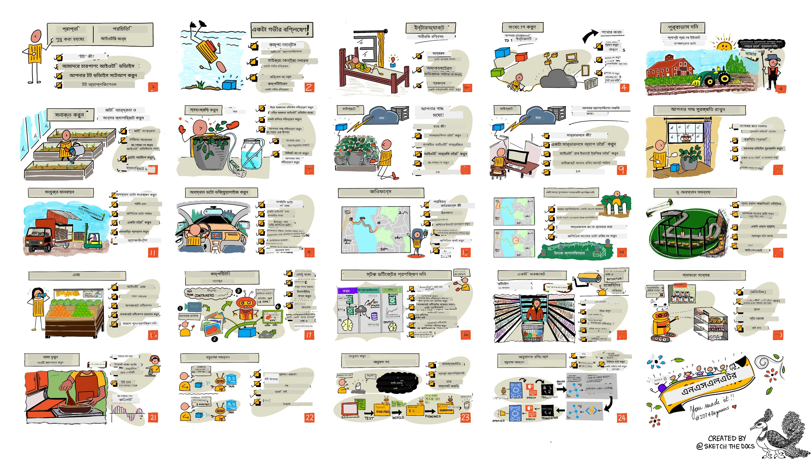

[](https://github.com/microsoft/IoT-For-Beginners/blob/master/LICENSE)
[](https://GitHub.com/microsoft/IoT-For-Beginners/graphs/contributors/)
[](https://GitHub.com/microsoft/IoT-For-Beginners/issues/)
[](https://GitHub.com/microsoft/IoT-For-Beginners/pulls/)
[](http://makeapullrequest.com)

[](https://GitHub.com/microsoft/IoT-For-Beginners/watchers/)
[](https://GitHub.com/microsoft/IoT-For-Beginners/network/)
[](https://GitHub.com/microsoft/IoT-For-Beginners/stargazers/)

### Azure AI Foundry কমিউনিটিতে যোগ দিন

যদি আপনি আটকে যান বা AI অ্যাপ তৈরির বিষয়ে কোনো প্রশ্ন থাকে। MCP সম্পর্কে আলাপ-আলোচনায় সহপাঠী শিক্ষার্থী এবং অভিজ্ঞ ডেভেলপারদের সাথে যোগ দিন। এটি একটি সহায়ক কমিউনিটি যেখানে প্রশ্ন স্বাগত এবং জ্ঞান স্বাধীনভাবে শেয়ার করা হয়।

[](https://discord.gg/nTYy5BXMWG)

যদি আপনার প্রোডাক্ট ফিডব্যাক অথবা নির্মাণের সময় কোনো ভুল থাকে, তাহলে অনুসরণ করুন:

[](https://aka.ms/foundry/forum)

এই রিসোর্সগুলি ব্যবহারের জন্য নিচের ধাপগুলি অনুসরণ করুন:
1. **রিপোজিটোরি ফর্ক করুন**: ক্লিক করুন [](https://GitHub.com/microsoft/IoT-For-Beginners/fork)
2. **রিপোজিটোরি ক্লোন করুন**:   `git clone https://github.com/microsoft/IoT-For-Beginners.git`
3. [**Microsoft Foundry Discord এ যোগ দিন এবং বিশেষজ্ঞ ও অন্যান্য ডেভেলপারদের সঙ্গে পরিচিত হন**](https://discord.com/invite/ByRwuEEgH4)


### 🌐 বহুভাষিক সহায়তা

#### GitHub Action এর মাধ্যমে সমর্থিত (স্বয়ংক্রিয় & সর্বদা আপ টু ডেট)

<!-- CO-OP TRANSLATOR LANGUAGES TABLE START -->
[Arabic](../ar/README.md) | [Bengali](./README.md) | [Bulgarian](../bg/README.md) | [Burmese (Myanmar)](../my/README.md) | [Chinese (Simplified)](../zh-CN/README.md) | [Chinese (Traditional, Hong Kong)](../zh-HK/README.md) | [Chinese (Traditional, Macau)](../zh-MO/README.md) | [Chinese (Traditional, Taiwan)](../zh-TW/README.md) | [Croatian](../hr/README.md) | [Czech](../cs/README.md) | [Danish](../da/README.md) | [Dutch](../nl/README.md) | [Estonian](../et/README.md) | [Finnish](../fi/README.md) | [French](../fr/README.md) | [German](../de/README.md) | [Greek](../el/README.md) | [Hebrew](../he/README.md) | [Hindi](../hi/README.md) | [Hungarian](../hu/README.md) | [Indonesian](../id/README.md) | [Italian](../it/README.md) | [Japanese](../ja/README.md) | [Kannada](../kn/README.md) | [Khmer](../km/README.md) | [Korean](../ko/README.md) | [Lithuanian](../lt/README.md) | [Malay](../ms/README.md) | [Malayalam](../ml/README.md) | [Marathi](../mr/README.md) | [Nepali](../ne/README.md) | [Nigerian Pidgin](../pcm/README.md) | [Norwegian](../no/README.md) | [Persian (Farsi)](../fa/README.md) | [Polish](../pl/README.md) | [Portuguese (Brazil)](../pt-BR/README.md) | [Portuguese (Portugal)](../pt-PT/README.md) | [Punjabi (Gurmukhi)](../pa/README.md) | [Romanian](../ro/README.md) | [Russian](../ru/README.md) | [Serbian (Cyrillic)](../sr/README.md) | [Slovak](../sk/README.md) | [Slovenian](../sl/README.md) | [Spanish](../es/README.md) | [Swahili](../sw/README.md) | [Swedish](../sv/README.md) | [Tagalog (Filipino)](../tl/README.md) | [Tamil](../ta/README.md) | [Telugu](../te/README.md) | [Thai](../th/README.md) | [Turkish](../tr/README.md) | [Ukrainian](../uk/README.md) | [Urdu](../ur/README.md) | [Vietnamese](../vi/README.md)

> **স্থানীয়ভাবে ক্লোন করতে চান?**
>
> এই রিপোজিটোরিতে ৫০+ ভাষার অনুবাদ অন্তর্ভুক্ত রয়েছে যা ডাউনলোডের আকার ব্যাপকভাবে বাড়িয়ে দেয়। অনুবাদ ছাড়াই ক্লোন করার জন্য sparse checkout ব্যবহার করুন:
>
> **Bash / macOS / Linux:**
> ```bash
> git clone --filter=blob:none --sparse https://github.com/microsoft/IoT-For-Beginners.git
> cd IoT-For-Beginners
> git sparse-checkout set --no-cone '/*' '!translations' '!translated_images'
> ```
>
> **CMD (Windows):**
> ```cmd
> git clone --filter=blob:none --sparse https://github.com/microsoft/IoT-For-Beginners.git
> cd IoT-For-Beginners
> git sparse-checkout set --no-cone "/*" "!translations" "!translated_images"
> ```
>
> এটি আপনার জন্য খুব দ্রুত ডাউনলোড তৈরী করে যা কোর্স সম্পন্ন করার জন্য প্রয়োজনীয় সবকিছু দেয়।
<!-- CO-OP TRANSLATOR LANGUAGES TABLE END -->

# নবশিক্ষার্থীদের জন্য IoT - একটি পাঠক্রম

Microsoft এর Azure Cloud Advocates আনন্দিত যে তারা একটি ১২-সপ্তাহের, ২৪-টি পাঠের পাঠক্রম প্রদান করছে যা সম্পূর্ণরূপে IoT এর মৌলিক বিষয় নিয়ে। প্রতিটি পাঠে প্রি-লেসন এবং পোস্ট-লেসন কুইজ রয়েছে, পাঠ সম্পন্ন করার জন্য লিখিত নির্দেশাবলী, সমাধান, একটি অ্যাসাইনমেন্ট এবং আরও অনেক কিছু। আমাদের প্রকল্প-ভিত্তিক শিক্ষাদান পদ্ধতি আপনাকে শেখার সময় নির্মাণ করতে দেয়, যা নতুন দক্ষতা স্থায়ী করার একটি প্রমাণিত উপায়।

এই প্রকল্পগুলি খামার থেকে টেবিল পর্যন্ত খাদ্য যাত্রাকে কভার করে। এর মধ্যে কৃষি, লজিস্টিকস, উৎপাদন, খুচরা এবং ভোক্তা রয়েছে - সবই IoT ডিভাইসের জন্য জনপ্রিয় শিল্পক্ষেত্র।



> স্নেহলেখক [Nitya Narasimhan](https://github.com/nitya) কর্তৃক সৃষ্ট স্কেচনোট। বড় সংস্করণের জন্য ছবিতে ক্লিক করুন।

**আমাদের লেখকগণ [Jen Fox](https://github.com/jenfoxbot), [Jen Looper](https://github.com/jlooper), [Jim Bennett](https://github.com/jimbobbennett), এবং আমাদের স্কেচনোট শিল্পী [Nitya Narasimhan](https://github.com/nitya)কে আন্তরিক ধন্যবাদ।**

**আমাদের দলের [Microsoft Learn Student Ambassadors](https://studentambassadors.microsoft.com?WT.mc_id=academic-17441-jabenn) যারা এই পাঠক্রম পর্যালোচনা ও অনুবাদ করেছেন তাদেরও ধন্যবাদ - [Aditya Garg](https://github.com/AdityaGarg00), [Anurag Sharma](https://github.com/Anurag-0-1-A), [Arpita Das](https://github.com/Arpiiitaaa), [Aryan Jain](https://www.linkedin.com/in/aryan-jain-47a4a1145/), [Bhavesh Suneja](https://github.com/EliteWarrior315), [Faith Hunja](https://faithhunja.github.io/), [Lateefah Bello](https://www.linkedin.com/in/lateefah-bello/), [Manvi Jha](https://github.com/Severus-Matthew), [Mireille Tan](https://www.linkedin.com/in/mireille-tan-a4834819a/), [Mohammad Iftekher (Iftu) Ebne Jalal](https://github.com/Iftu119), [Mohammad Zulfikar](https://github.com/mohzulfikar), [Priyanshu Srivastav](https://www.linkedin.com/in/priyanshu-srivastav-b067241ba), [Thanmai Gowducheruvu](https://github.com/innovation-platform), এবং [Zina Kamel](https://www.linkedin.com/in/zina-kamel/)।**

দলের সাথে পরিচিত হন!

[](https://youtu.be/-wippUJRi5k)

**জিফ তৈরি করেছেন** [Mohit Jaisal](https://linkedin.com/in/mohitjaisal)

> 🎥 প্রকল্প সম্পর্কে ভিডিও দেখার জন্য ছবিতে ক্লিক করুন!

> **শিক্ষকবৃন্দ**, আমরা [এই পাঠক্রম কীভাবে ব্যবহার করবেন তার কিছু সুপারিশ](for-teachers.md) অন্তর্ভুক্ত করেছি। যদি আপনি আপনার নিজস্ব পাঠ তৈরি করতে চান, আমরা একটি [পাঠ টেমপ্লেটও](lesson-template/README.md) অন্তর্ভুক্ত করেছি।

> **[শিক্ষার্থী](https://aka.ms/student-page)**, এই পাঠক্রম নিজে ব্যবহার করতে হলে পুরো রিপোজিটোরি ফর্ক করে নিজে নিজে অনুশীলন সম্পন্ন করুন, প্রথমে একটি প্রি-লেকচার কুইজ দিয়ে শুরু করুন, এরপর লেকচার পড়ুন এবং বাকি কার্যক্রম সম্পন্ন করুন। প্রকল্পগুলো তৈরি করার সময় পাঠগুলো বুঝে কোড কপি করার পরিবর্তে প্রকল্প তৈরি করার চেষ্টা করুন; যাহোক, প্রতিটি প্রকল্প-ভিত্তিক পাঠে /solutions ফোল্ডারে সমাধান কোড পাওয়া যাবে। অন্য একটি ধারণা হলো বন্ধুদের সাথে একটি অধ্যয়ন গ্রুপ গঠন করে একসাথে বিষয়বস্তু পড়া। আরো অধ্যয়নের জন্য, আমরা [Microsoft Learn](https://docs.microsoft.com/users/jimbobbennett/collections/ke2ehd351jopwr?WT.mc_id=academic-17441-jabenn) সুপারিশ করি।

এই কোর্সের একটি ভিডিও ওভারভিউ দেখতে নিচের ভিডিওটি দেখুন:

[](https://youtube.com/watch?v=bccEMm8gRuc "Promo video")

> 🎥 প্রকল্প সম্পর্কে ভিডিও দেখার জন্য ছবিতে ক্লিক করুন!

## শিক্ষাদান পদ্ধতি

এই পাঠক্রম তৈরি করার সময় আমরা দুটি শিক্ষাদান মূলনীতি বেছে নিয়েছি: এটি প্রকল্প-ভিত্তিক হওয়া এবং এতে নিয়মিত কুইজ অন্তর্ভুক্ত থাকা। এই সিরিজের শেষে, শিক্ষার্থীরা একটি উদ্ভিদ পর্যবেক্ষণ ও সেচ ব্যবস্থা, একটি যানবাহন ট্র্যাকার, খাদ্য ট্র্যাক ও পরীক্ষা করার জন্য একটি স্মার্ট ফ্যাক্টরি সেটআপ, এবং একটি ভয়েস-কন্ট্রোলড কুকিং টাইমার তৈরি করবে, এবং IoT এর মৌলিক বিষয়গুলি শিখবে যার মধ্যে ডিভাইস কোড লেখা, ক্লাউডে সংযোগ, টেলিমেট্রি বিশ্লেষণ এবং এজে AI চালানো অন্তর্ভুক্ত।

বিষয়বস্তু প্রকল্পের সাথে মানানসই হওয়ায় শিক্ষার্থীদের জন্য প্রক্রিয়াটি আরো আকর্ষণীয় হয় এবং ধারণাগুলোর ধারণ ক্ষমতা বৃদ্ধি পায়।

অতিরিক্তভাবে, ক্লাসের আগে একটি নিম্ন-মূল্যের কুইজ শিক্ষার্থীর শেখার প্রতি মনোভাব স্থাপন করে, এবং ক্লাস শেষে দ্বিতীয় কুইজ আরও ধারণ বজায় রাখতে সাহায্য করে। এই পাঠক্রমটি নমনীয় এবং মজাদার করার মতো ডিজাইন করা হয়েছে এবং সম্পূর্ণ বা আংশিকভাবে নেওয়া যেতে পারে। প্রকল্পগুলো ছোট থেকে শুরু করে ১২ সপ্তাহের শেষে ক্রমবর্ধমান জটিল হয়ে ওঠে।

প্রতিটি প্রকল্প বাস্তব জগতের হার্ডওয়্যার ভিত্তিক যা শিক্ষার্থী এবং হবি প্রবৃত্তিরা ব্যবহার করতে পারে। প্রতিটি প্রকল্প নির্দিষ্ট প্রকল্প ক্ষেত্রের ওপর নজর দেয়, প্রাসঙ্গিক পটভূমি জ্ঞান প্রদান করে। সফল ডেভেলপার হতে হলে সেই ডোমেইন বুঝতে হতে হয় যেখানে আপনি সমস্যার সমাধান করছেন, এই পটভূমি জ্ঞান শিক্ষার্থীদের তাদের IoT সমাধান এবং শেখার বিষয়ে চিন্তা করতে সাহায্য করে এমন বাস্তব সমস্যার প্রসঙ্গে যেখানে তারা IoT ডেভেলপার হিসেবে সমস্যার সমাধান করতে পারেন। শিক্ষার্থীরা তাদের তৈরি সমাধানের 'কেন' শিখে এবং শেষ ব্যবহারকারীর কদর পায়।

## হার্ডওয়্যার
আমাদের প্রকল্পগুলোর জন্য ব্যবহার করার মতো দুটি IoT হার্ডওয়্যার পছন্দের অপশন আছে, যা ব্যক্তিগত পছন্দ, প্রোগ্রামিং ভাষার জ্ঞান বা পছন্দ, শেখার লক্ষ্য এবং প্রাপ্যতার উপর নির্ভর করে। আমরা যারা হার্ডওয়্যারে অ্যাক্সেস নেই বা কেনার আগে আরও শেখার ইচ্ছা রাখেন তাদের জন্য 'ভার্চুয়াল হার্ডওয়্যার' সংস্করণও সরবরাহ করেছি। আপনি আরও পড়তে পারেন এবং একটি 'শপিং লিস্ট' পেতে পারেন [hardware page](./hardware.md)-এ, যেখানে আমাদের বন্ধু Seeed Studio থেকে সম্পূর্ণ কিট কেনার লিঙ্কও দেওয়া আছে।

> 💁 আমাদের [Code of Conduct](CODE_OF_CONDUCT.md), [Contributing](CONTRIBUTING.md), এবং [Translations](..) গাইডলাইনগুলি খুঁজে বের করুন। আমরা আপনার গঠনমূলক প্রতিক্রিয়াকে স্বাগত জানাই!
>
> 🔧 সমস্যা হচ্ছে? সাধারণ সমস্যাগুলোর সমাধানের জন্য আমাদের [Troubleshooting Guide](TROUBLESHOOTING.md) দেখুন।

## প্রতিটি পাঠের অন্তর্ভুক্তি:

- স্কেচনোট
- ঐচ্ছিক সম্পূরক ভিডিও
- পাঠের পূর্ববর্তী ওয়ার্মআপ কুইজ
- লিখিত পাঠ
- প্রকল্প ভিত্তিক পাঠের জন্য, প্রকল্পটি কীভাবে তৈরি করবেন তার ধাপে ধাপে গাইড
- জ্ঞান যাচাই
- একটি চ্যালেঞ্জ
- সম্পূরক পড়াশোনা
- নিয়োগ
- [পোস্ট-লেসন কুইজ](https://ff-quizzes.netlify.app/en/)

> **কুইজ সম্পর্কে একটি নোট**: সমস্ত কুইজ কুইজ-অ্যাপ ফোল্ডারে থাকে, মোট ৪৮টি কুইজ যার প্রতিটিতে তিনটি প্রশ্ন থাকে। এগুলি পাঠসমূহের মধ্যে থেকে লিঙ্ক করা আছে, তবে কুইজ অ্যাপটি লোকালি চালানো বা Azure-এ ডিপ্লয় করা যেতে পারে; কুইজ-অ্যাপ ফোল্ডারে দেওয়া নির্দেশনা অনুসরণ করুন। এগুলি ধাপে ধাপে স্থানীয়করণ করা হচ্ছে।

## পাঠসমূহ

|       |              প্রকল্প নাম               |                       শেখানো বিষয়গুলি                         | শেখার উদ্দেশ্য                                                                                                                                                |                                                        লিঙ্ক করা পাঠ                                                         |
| :---: | :------------------------------------: | :-------------------------------------------------------------: | ------------------------------------------------------------------------------------------------------------------------------------------------------------- | :--------------------------------------------------------------------------------------------------------------------------: |
|  01   | [Getting started](./1-getting-started/README.md) |                        IoT এর পরিচিতি                         | IoT এর মৌলিক নীতিমালা এবং সেন্সর এবং ক্লাউড সার্ভিসের মতো IoT সমাধানের মৌলিক নির্মাণ ব্লক শেখা, যখন আপনি আপনার প্রথম IoT ডিভাইস সেটআপ করছেন                 |                      [Introduction to IoT](./1-getting-started/lessons/1-introduction-to-iot/README.md)                      |
|  02   | [Getting started](./1-getting-started/README.md) |                      IoT এর গভীরতর আলোচনা                    | IoT সিস্টেমের উপাদানগুলি সম্পর্কে আরও জানুন, যেমন মাইক্রোকন্ট্রোলার এবং সিঙ্গেল-বোর্ড কম্পিউটার                                                                              |                        [A deeper dive into IoT](./1-getting-started/lessons/2-deeper-dive/README.md)                         |
|  03   | [Getting started](./1-getting-started/README.md) | সেন্সর ও অ্যাকচুয়েটর দিয়ে বাস্তব বিশ্বের সাথে ইন্টারঅ্যাক্ট করা | শারীরিক বিশ্বের তথ্য সংগ্রহের জন্য সেন্সর এবং প্রতিক্রিয়া পাঠাতে অ্যাকচুয়েটর সম্পর্কে শেখা, যখন আপনি একটি নাইটলাইট তৈরি করছেন                                             | [Interact with the physical world with sensors and actuators](./1-getting-started/lessons/3-sensors-and-actuators/README.md) |
|  04   | [Getting started](./1-getting-started/README.md) |                   আপনার ডিভাইস ইন্টারনেটে সংযুক্ত করুন          | একটি IoT ডিভাইস ইন্টারনেটে কীভাবে সংযুক্ত করবেন তা শেখা, বার্তা প্রেরণ এবং গ্রহণের জন্য MQTT ব্রোকারের সাথে আপনার নাইটলাইট সংযুক্ত করা                                           |               [Connect your device to the Internet](./1-getting-started/lessons/4-connect-internet/README.md)                |
|  05   |            [Farm](./2-farm/README.md)            |                     উদ্ভিদের বৃদ্ধি পূর্বাভাস                 | IoT ডিভাইস দ্বারা ক্যাপচার করা তাপমাত্রার ডেটা ব্যবহার করে উদ্ভিদের বৃদ্ধি পূর্বাভাস শেখা                                                                                 |                          [Predict plant growth](./2-farm/lessons/1-predict-plant-growth/README.md)                           |
|  06   |            [Farm](./2-farm/README.md)            |                    মাটির আর্দ্রতা শনাক্তকরণ                  | মাটির আর্দ্রতা শনাক্ত করা এবং একটি মাটি আর্দ্রতা সেন্সর ক্যালিব্রেট করা শেখা                                                                                           |                          [Detect soil moisture](./2-farm/lessons/2-detect-soil-moisture/README.md)                           |
|  07   |            [Farm](./2-farm/README.md)            |                    স্বয়ংক্রিয় উদ্ভিদ সেচ                     | একটি রিলে এবং MQTT ব্যবহার করে সেচ স্বয়ংক্রিয় ও সময়ানুক্রম শেখা                                                                                                |                      [Automated plant watering](./2-farm/lessons/3-automated-plant-watering/README.md)                       |
|  08   |            [Farm](./2-farm/README.md)            |                  আপনার উদ্ভিদকে ক্লাউডে স্থানান্তর করুন       | ক্লাউড এবং ক্লাউড-হোস্টেড IoT সার্ভিস সম্পর্কে শেখা এবং পাবলিক MQTT ব্রোকারের পরিবর্তে এগুলোর সাথে আপনার উদ্ভিদ সংযুক্ত করার পদ্ধতি                                  |               [Migrate your plant to the cloud](./2-farm/lessons/4-migrate-your-plant-to-the-cloud/README.md)                |
|  09   |            [Farm](./2-farm/README.md)            |          আপনার অ্যাপ্লিকেশন লজিক ক্লাউডে স্থানান্তর করুন     | ক্লাউডে অ্যাপ্লিকেশন লজিক কীভাবে লিখবেন যা IoT বার্তাগুলোর প্রতি প্রতিক্রিয়া জানাবে তা শেখা                                                                         |         [Migrate your application logic to the cloud](./2-farm/lessons/5-migrate-application-to-the-cloud/README.md)         |
|  10   |            [Farm](./2-farm/README.md)            |                    আপনার উদ্ভিদকে সুরক্ষিত রাখুন             | IoT এর মাধ্যমে নিরাপত্তা এবং কী এবং সার্টিফিকেট দিয়ে আপনার উদ্ভিদকে কীভাবে সুরক্ষিত রাখবেন তা শেখা                                                                    |                        [Keep your plant secure](./2-farm/lessons/6-keep-your-plant-secure/README.md)                         |
|  11   |       [Transport](./3-transport/README.md)       |                    অবস্থান ট্র্যাকিং                         | IoT ডিভাইসের জন্য GPS অবস্থান ট্র্যাকিং সম্পর্কে শেখা                                                                                                               |                           [Location tracking](./3-transport/lessons/1-location-tracking/README.md)                           |
|  12   |       [Transport](./3-transport/README.md)       |                  অবস্থানের তথ্য সংরক্ষণ                     | পরবর্তীতে ভিজ্যুয়ালাইজেশন বা বিশ্লেষণের জন্য IoT ডেটা কীভাবে সংরক্ষণ করবেন তা শেখা                                                                                  |                         [Store location data](./3-transport/lessons/2-store-location-data/README.md)                         |
|  13   |       [Transport](./3-transport/README.md)       |                অবস্থানের তথ্য চিত্রায়ন করা                   | একটি মানচিত্রে অবস্থানের তথ্য চিত্রায়ন এবং কিভাবে মানচিত্র বাস্তব ৩ডি পৃথিবীর ২ মাত্রিক উপস্থাপনা করে তা শেখা                                                        |                     [Visualize location data](./3-transport/lessons/3-visualize-location-data/README.md)                     |
|  14   |       [Transport](./3-transport/README.md)       |                         জিওফেন্সিং                            | জিওফেন্স সম্পর্কে শেখা এবং কিভাবে এগুলি সরবরাহ চেইনের যানবাহন গন্তব্যস্থলের কাছাকাছি আসলে সতর্ক করতে ব্যবহার করা হয় তা শেখা                                         |                                   [Geofences](./3-transport/lessons/4-geofences/README.md)                                   |
|  15   |   [Manufacturing](./4-manufacturing/README.md)   |                ফলের গুণমান সনাক্তকরণ প্রশিক্ষণ             | ক্লাউডে একটি চিত্র শ্রেণীবদ্ধকরণ মডেল প্রশিক্ষণ সম্পর্কে শেখা যা ফলের গুণমান সনাক্ত করে                                                                                 |                 [Train a fruit quality detector](./4-manufacturing/lessons/1-train-fruit-detector/README.md)                 |
|  16   |   [Manufacturing](./4-manufacturing/README.md)   |                IoT ডিভাইস থেকে ফলের গুণমান পরীক্ষা           | আপনার ফলের গুণমান সনাক্তকারী IoT ডিভাইস থেকে কীভাবে ব্যবহার করবেন তা শেখা                                                                                          |           [Check fruit quality from an IoT device](./4-manufacturing/lessons/2-check-fruit-from-device/README.md)            |
|  17   |   [Manufacturing](./4-manufacturing/README.md)   |               এজে আপনার ফলের ডিটেক্টর চালান                  | একটি IoT ডিভাইসে এজে আপনার ফল সনাক্তকারী কীভাবে চালাবেন তা শেখা                                                                                                |             [Run your fruit detector on the edge](./4-manufacturing/lessons/3-run-fruit-detector-edge/README.md)             |
|  18   |   [Manufacturing](./4-manufacturing/README.md)   |                    সেন্সর থেকে ফল গুণমান সনাক্তকরণ ট্রিগার করুন | সেন্সর থেকে ফল গুণমান সনাক্তকরণ ট্রিগার সম্পর্কে শেখা                                                                                                            |        [Trigger fruit quality detection from a sensor](./4-manufacturing/lessons/4-trigger-fruit-detector/README.md)         |
|  19   |          [Retail](./5-retail/README.md)          |                    স্টক সনাক্তকরণ প্রশিক্ষণ                 | একটি দোকানের স্টক গণনা করার জন্য অবজেক্ট ডিটেকশন ব্যবহার করে স্টক সনাক্তকারী প্রশিক্ষণ শেখা                                                                         |                        [Train a stock detector](./5-retail/lessons/1-train-stock-detector/README.md)                         |
|  20   |          [Retail](./5-retail/README.md)          |                 IoT ডিভাইস থেকে স্টক পরীক্ষা                  | অবজেক্ট ডিটেকশন মডেল ব্যবহার করে একটি IoT ডিভাইস থেকে স্টক পরীক্ষা শেখা                                                                                           |                     [Check stock from an IoT device](./5-retail/lessons/2-check-stock-device/README.md)                      |
|  21   |        [Consumer](./6-consumer/README.md)        |                  IoT ডিভাইস দিয়ে ভাষণ শনাক্তকরণ            | একটি স্মার্ট টাইমার তৈরির জন্য এক IoT ডিভাইস থেকে ভাষণ শনাক্ত করা শেখা                                                                                            |                  [Recognize speech with an IoT device](./6-consumer/lessons/1-speech-recognition/README.md)                  |
|  22   |        [Consumer](./6-consumer/README.md)        |                     ভাষা বোঝা                              | একটি IoT ডিভাইসকে বলা বাক্যগুলো বোঝার পদ্ধতি শেখা                                                                                                               |                        [Understand language](./6-consumer/lessons/2-language-understanding/README.md)                        |
|  23   |        [Consumer](./6-consumer/README.md)        |               টাইমার সেট করা এবং কথ্য প্রতিক্রিয়া প্রদান    | একটি IoT ডিভাইসে টাইমার সেট করা এবং কখন টাইমার শুরু এবং শেষ হয় সে সম্পর্কে কথ্য প্রতিক্রিয়া দেওয়ার পদ্ধতি শেখা                                                    |                 [Set a timer and provide spoken feedback](./6-consumer/lessons/3-spoken-feedback/README.md)                  |
|  24   |        [Consumer](./6-consumer/README.md)        |                  একাধিক ভাষা সমর্থন করা                     | একাধিক ভাষা কিভাবে সমর্থন করবেন, উভয়কেই বলা এবং আপনার স্মার্ট টাইমারের কাছ থেকে প্রতিক্রিয়া দেয় মেনে নিয়ে শেখা                                                     |                   [Support multiple languages](./6-consumer/lessons/4-multiple-language-support/README.md)                   |

## অফলাইন অ্যাক্সেস

আপনি এই ডকুমেন্টেশন অফলাইনে চালাতে পারেন [Docsify](https://docsify.js.org/#/) ব্যবহার করে। এই রিপোটি ফর্ক করুন, আপনার লোকাল মেশিনে [Docsify ইনস্টল করুন](https://docsify.js.org/#/quickstart), তারপর এই রিপোর রুট ফোল্ডারে `docsify serve` টাইপ করুন। ওয়েবসাইটটি আপনার লোকালহোস্টে পোর্ট ৩০০০-এ চালু হবে: `localhost:3000`।

## কুইজ

সম্প্রদায়ের প্রতি কৃতজ্ঞ যারা প্রতিটি অধ্যায়ের উপর আপনার জ্ঞান পরীক্ষা করার জন্য ইন্টারেক্টিভ কুইজ হোস্ট করেছেন। আপনি এখানে আপনার জ্ঞান পরীক্ষা করতে পারেন [here](https://ff-quizzes.netlify.app/en/)

### PDF

আপনি প্রয়োজনে অফলাইন অ্যাক্সেসের জন্য এই বিষয়বস্তুর একটি PDF তৈরি করতে পারেন। এটি করার জন্য, নিশ্চিত করুন আপনার কাছে [npm ইনস্টল করা আছে](https://docs.npmjs.com/downloading-and-installing-node-js-and-npm) এবং এই রিপোর রুট ফোল্ডারে নিচের কমান্ডগুলি চালান:

```sh
npm i
npm run convert
```

### স্লাইডস

কিছু পাঠের জন্য স্লাইড ডেক [slides](../../slides) ফোল্ডারে আছে।

## অন্যান্য পাঠক্রম

আমাদের টিম অন্যান্য পাঠক্রমও তৈরি করে! দেখুন:

<!-- CO-OP TRANSLATOR OTHER COURSES START -->
### LangChain
[](https://aka.ms/langchain4j-for-beginners)
[](https://aka.ms/langchainjs-for-beginners?WT.mc_id=m365-94501-dwahlin)
[](https://github.com/microsoft/langchain-for-beginners?WT.mc_id=m365-94501-dwahlin)
---

### Azure / Edge / MCP / Agents
[](https://github.com/microsoft/AZD-for-beginners?WT.mc_id=academic-105485-koreyst)
[](https://github.com/microsoft/edgeai-for-beginners?WT.mc_id=academic-105485-koreyst)
[](https://github.com/microsoft/mcp-for-beginners?WT.mc_id=academic-105485-koreyst)
[](https://github.com/microsoft/ai-agents-for-beginners?WT.mc_id=academic-105485-koreyst)

---
 
### জেনারেটিভ এআই সিরিজ
[](https://github.com/microsoft/generative-ai-for-beginners?WT.mc_id=academic-105485-koreyst)
[-9333EA?style=for-the-badge&labelColor=E5E7EB&color=9333EA)](https://github.com/microsoft/Generative-AI-for-beginners-dotnet?WT.mc_id=academic-105485-koreyst)
[-C084FC?style=for-the-badge&labelColor=E5E7EB&color=C084FC)](https://github.com/microsoft/generative-ai-for-beginners-java?WT.mc_id=academic-105485-koreyst)
[-E879F9?style=for-the-badge&labelColor=E5E7EB&color=E879F9)](https://github.com/microsoft/generative-ai-with-javascript?WT.mc_id=academic-105485-koreyst)

---
 
### মূল শেখা
[](https://aka.ms/ml-beginners?WT.mc_id=academic-105485-koreyst)
[](https://aka.ms/datascience-beginners?WT.mc_id=academic-105485-koreyst)
[](https://aka.ms/ai-beginners?WT.mc_id=academic-105485-koreyst)
[](https://github.com/microsoft/Security-101?WT.mc_id=academic-96948-sayoung)
[](https://aka.ms/webdev-beginners?WT.mc_id=academic-105485-koreyst)
[](https://aka.ms/iot-beginners?WT.mc_id=academic-105485-koreyst)
[](https://github.com/microsoft/xr-development-for-beginners?WT.mc_id=academic-105485-koreyst)

---
 
### কোপাইলট সিরিজ
[](https://aka.ms/GitHubCopilotAI?WT.mc_id=academic-105485-koreyst)
[](https://github.com/microsoft/mastering-github-copilot-for-dotnet-csharp-developers?WT.mc_id=academic-105485-koreyst)
[](https://github.com/microsoft/CopilotAdventures?WT.mc_id=academic-105485-koreyst)
<!-- CO-OP TRANSLATOR OTHER COURSES END -->

## ইমেজ সংশ্লিষ্টিকারক

আপনি এই পাঠ্যক্রমে ব্যবহৃত সকল ছবির সংশ্লিষ্টিকারক প্রয়োজন অনুযায়ী [Attributions](./attributions.md) এ পেতে পারেন।

---

<!-- CO-OP TRANSLATOR DISCLAIMER START -->
**অস্বীকারোক্তি**:  
এই নথিটি AI অনুবাদ সেবা [Co-op Translator](https://github.com/Azure/co-op-translator) ব্যবহার করে অনুবাদ করা হয়েছে। আমরা যথাসাধ্য সঠিকতার জন্য চেষ্টা করি, তবে অনুগ্রহ করে জেনে রাখুন যে স্বয়ংক্রিয় অনুবাদে ভুল বা অশুদ্ধি থাকতে পারে। মূল নথি তার মাতৃভাষায়ই কর্তৃপক্ষের উৎস হিসেবে বিবেচিত হওয়া উচিত। গুরুত্বপূর্ণ তথ্যের জন্য পেশাদার মানব অনুবাদের সুপারিশ করা হয়। এই অনুবাদের ব্যবহারে সৃষ্ট কোনো ভুল ব্যাখ্যা বা ভুল বোঝাবুঝির জন্য আমরা দায়িত্ব স্বীকার করব না।
<!-- CO-OP TRANSLATOR DISCLAIMER END -->