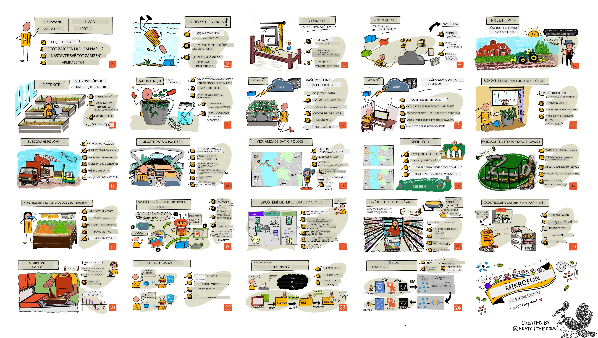

<!--
CO_OP_TRANSLATOR_METADATA:
{
  "original_hash": "6c354ec3487e4f6cfafbe44557996cd9",
  "translation_date": "2026-01-06T15:39:32+00:00",
  "source_file": "README.md",
  "language_code": "cs"
}
-->
[](https://github.com/microsoft/IoT-For-Beginners/blob/master/LICENSE)
[](https://GitHub.com/microsoft/IoT-For-Beginners/graphs/contributors/)
[](https://GitHub.com/microsoft/IoT-For-Beginners/issues/)
[](https://GitHub.com/microsoft/IoT-For-Beginners/pulls/)
[](http://makeapullrequest.com)

[](https://GitHub.com/microsoft/IoT-For-Beginners/watchers/)
[](https://GitHub.com/microsoft/IoT-For-Beginners/network/)
[](https://GitHub.com/microsoft/IoT-For-Beginners/stargazers/)

### Připojte se ke komunitě Azure AI Foundry

Pokud uvíznete nebo máte jakékoli dotazy ohledně vytváření AI aplikací. Přidejte se k ostatním studentům a zkušeným vývojářům v diskuzích o MCP. Je to podpůrná komunita, kde jsou otázky vítány a znalosti jsou volně sdíleny.

[](https://discord.gg/nTYy5BXMWG)

Pokud máte zpětnou vazbu k produktu nebo chyby při vývoji, navštivte:

[](https://aka.ms/foundry/forum)

Postupujte podle těchto kroků, abyste mohli začít používat tyto zdroje:
1. **Vytvořte Fork repozitáře**: Klikněte [](https://GitHub.com/microsoft/IoT-For-Beginners/fork)
2. **Naklonujte repozitář**:   `git clone https://github.com/microsoft/IoT-For-Beginners.git`
3. [**Přidejte se na Microsot Foundry Discord a setkejte se s odborníky a dalšími vývojáři**](https://discord.com/invite/ByRwuEEgH4)


### 🌐 Podpora více jazyků

#### Podporováno pomocí GitHub Action (automatizováno a vždy aktuální)

<!-- CO-OP TRANSLATOR LANGUAGES TABLE START -->
[Arabic](../ar/README.md) | [Bengali](../bn/README.md) | [Bulgarian](../bg/README.md) | [Burmese (Myanmar)](../my/README.md) | [Chinese (Simplified)](../zh/README.md) | [Chinese (Traditional, Hong Kong)](../hk/README.md) | [Chinese (Traditional, Macau)](../mo/README.md) | [Chinese (Traditional, Taiwan)](../tw/README.md) | [Croatian](../hr/README.md) | [Czech](./README.md) | [Danish](../da/README.md) | [Dutch](../nl/README.md) | [Estonian](../et/README.md) | [Finnish](../fi/README.md) | [French](../fr/README.md) | [German](../de/README.md) | [Greek](../el/README.md) | [Hebrew](../he/README.md) | [Hindi](../hi/README.md) | [Hungarian](../hu/README.md) | [Indonesian](../id/README.md) | [Italian](../it/README.md) | [Japanese](../ja/README.md) | [Kannada](../kn/README.md) | [Korean](../ko/README.md) | [Lithuanian](../lt/README.md) | [Malay](../ms/README.md) | [Malayalam](../ml/README.md) | [Marathi](../mr/README.md) | [Nepali](../ne/README.md) | [Nigerian Pidgin](../pcm/README.md) | [Norwegian](../no/README.md) | [Persian (Farsi)](../fa/README.md) | [Polish](../pl/README.md) | [Portuguese (Brazil)](../br/README.md) | [Portuguese (Portugal)](../pt/README.md) | [Punjabi (Gurmukhi)](../pa/README.md) | [Romanian](../ro/README.md) | [Russian](../ru/README.md) | [Serbian (Cyrillic)](../sr/README.md) | [Slovak](../sk/README.md) | [Slovenian](../sl/README.md) | [Spanish](../es/README.md) | [Swahili](../sw/README.md) | [Swedish](../sv/README.md) | [Tagalog (Filipino)](../tl/README.md) | [Tamil](../ta/README.md) | [Telugu](../te/README.md) | [Thai](../th/README.md) | [Turkish](../tr/README.md) | [Ukrainian](../uk/README.md) | [Urdu](../ur/README.md) | [Vietnamese](../vi/README.md)

> **Dáváte přednost lokálnímu klonování?**

> Tento repozitář obsahuje přes 50 jazykových překladů, což výrazně zvětšuje velikost stahování. Pro klonování bez překladů použijte sparse checkout:
> ```bash
> git clone --filter=blob:none --sparse https://github.com/microsoft/IoT-For-Beginners.git
> cd IoT-For-Beginners
> git sparse-checkout set --no-cone '/*' '!translations' '!translated_images'
> ```
> Tento způsob vám poskytne vše, co potřebujete ke splnění kurzu s mnohem rychlejším stažením.
<!-- CO-OP TRANSLATOR LANGUAGES TABLE END -->

# IoT pro začátečníky - Učební plán

Advokáti Azure Cloud ve společnosti Microsoft jsou potěšeni, že mohou nabídnout 12týdenní, 24-lekční učební plán zaměřený na základy IoT. Každá lekce obsahuje před a po lekci kvízy, psané instrukce k dokončení lekce, řešení, úkol a další. Naše pedagogika založená na projektech vám umožňuje učit se během tvorby, což je osvědčený způsob, jak si nové dovednosti skutečně zapamatovat.

Projekty pokrývají cestu potravin od farmy až na stůl. To zahrnuje zemědělství, logistiku, výrobu, maloobchod a spotřebitele - všechny populární oblasti průmyslu pro IoT zařízení.



> Sketchnote od [Nitya Narasimhan](https://github.com/nitya). Klikněte na obrázek pro větší verzi.

**Upřímné díky našim autorům [Jen Fox](https://github.com/jenfoxbot), [Jen Looper](https://github.com/jlooper), [Jim Bennett](https://github.com/jimbobbennett), a našemu ilustrátorovi sketchnot [Nitya Narasimhan](https://github.com/nitya).**

**Díky také našemu týmu [Microsoft Learn Student Ambassadors](https://studentambassadors.microsoft.com?WT.mc_id=academic-17441-jabenn), kteří kontrolovali a překládali tento učební plán - [Aditya Garg](https://github.com/AdityaGarg00), [Anurag Sharma](https://github.com/Anurag-0-1-A), [Arpita Das](https://github.com/Arpiiitaaa), [Aryan Jain](https://www.linkedin.com/in/aryan-jain-47a4a1145/), [Bhavesh Suneja](https://github.com/EliteWarrior315), [Faith Hunja](https://faithhunja.github.io/), [Lateefah Bello](https://www.linkedin.com/in/lateefah-bello/), [Manvi Jha](https://github.com/Severus-Matthew), [Mireille Tan](https://www.linkedin.com/in/mireille-tan-a4834819a/), [Mohammad Iftekher (Iftu) Ebne Jalal](https://github.com/Iftu119), [Mohammad Zulfikar](https://github.com/mohzulfikar), [Priyanshu Srivastav](https://www.linkedin.com/in/priyanshu-srivastav-b067241ba), [Thanmai Gowducheruvu](https://github.com/innovation-platform) a [Zina Kamel](https://www.linkedin.com/in/zina-kamel/).**

Seznamte se s týmem!

[](https://youtu.be/-wippUJRi5k)

**Gif od** [Mohit Jaisal](https://linkedin.com/in/mohitjaisal)

> 🎥 Klikněte na obrázek výše pro video o projektu!

> **Učitelé**, zařadili jsme [některé návrhy](for-teachers.md), jak tento učební plán používat. Pokud byste chtěli vytvořit své vlastní lekce, máme také připravenou [šablonu lekce](lesson-template/README.md).

> **Studenti** [https://aka.ms/student-page], chcete-li tento učební plán využít sami, vytvořte fork celého repozitáře a postupujte podle cvičení sami, začněte přednáškovým kvízem, poté si přečtěte přednášku a dokončete zbytek aktivit. Snažte se vytvářet projekty pochopením lekcí, místo pouhého kopírování kódu řešení; nicméně tento kód je k dispozici ve složkách /solutions v každé projektově orientované lekci. Další nápad je vytvořit studijní skupinu s přáteli a projít obsah společně. Pro další studium doporučujeme [Microsoft Learn](https://docs.microsoft.com/users/jimbobbennett/collections/ke2ehd351jopwr?WT.mc_id=academic-17441-jabenn).

Pro video přehled tohoto kurzu se podívejte na toto video:

[](https://youtube.com/watch?v=bccEMm8gRuc "Promo video")

> 🎥 Klikněte na obrázek výše pro video o projektu!

## Pedagogika

Při tvorbě tohoto učebního plánu jsme zvolili dva pedagogické principy: zajistit, že je založen na projektech a že obsahuje časté kvízy. Na konci této série studenti vytvoří systém monitorování a zalévání rostlin, sledování vozidla, chytrou tovární sestavu pro sledování a kontrolu potravin a hlasem ovládaný časovač vaření a naučí se základy Internetu věcí včetně psaní kódu pro zařízení, připojení do cloudu, analýzy telemetrie a provozu AI na okraji sítě.

Tím, že obsah odpovídá projektům, je proces pro studenty zajímavější a dochází k lepšímu zapamatování konceptů.

Navíc nízkorizikový kvíz před hodinou nastavuje záměr studenta naučit se téma, zatímco druhý kvíz po hodině zajišťuje další zapamatování. Tento učební plán je navržen tak, aby byl flexibilní a zábavný a lze ho absolvovat celý nebo část. Projekty začínají malé a postupně se komplikují až do konce 12týdenního cyklu.

Každý projekt je založen na skutečném hardwaru dostupném studentům a nadšencům. Každý projekt se zaměřuje na specifickou oblast, poskytuje relevantní základní znalosti. Aby byl vývojář úspěšný, pomáhá pochopit oblast, ve které řeší problémy, a tímto způsobem se studenti učí uvažovat o svých IoT řešeních a poznatcích v kontextu reálného problému, který by mohli jako IoT vývojáři řešit. Studenti se učí „proč“ řešení, která vytvářejí, a získávají ocenění uživatele.

## Hardware

Máme na výběr dva typy IoT hardwaru pro projekty, podle osobních preferencí, znalostí programovacích jazyků, cílů učení a dostupnosti. Také jsme poskytli „virtuální hardware“ pro ty, kteří hardware nemají nebo chtějí nejprve získat více znalostí před koupí. Další informace a „nákupní seznam“ najdete na [hardware stránce](./hardware.md), včetně odkazů na koupi kompletních sad od našich přátel z Seeed Studio.
> 💁 Najděte naše [Kodex chování](CODE_OF_CONDUCT.md), [Příspěvky](CONTRIBUTING.md) a [Překladatelské](TRANSLATIONS.md) pokyny. Těšíme se na vaše konstruktivní připomínky!
>
> 🔧 Máte problémy? Podívejte se na náš [Průvodce řešením problémů](TROUBLESHOOTING.md) pro řešení běžných problémů.

## Každá lekce obsahuje:

- sketchnote
- volitelné doplňkové video
- rozcvičku před lekcí
- psanou lekci
- u lekcí založených na projektu, krok za krokem průvodce, jak projekt sestavit
- kontroly znalostí
- výzvu
- doplňující čtení
- úkol
- [kvíz po lekci](https://ff-quizzes.netlify.app/en/)

> **Poznámka o kvízech**: Všechny kvízy jsou obsaženy ve složce quiz-app, je jich celkem 48, každý se třemi otázkami. Jsou propojeny přímo z lekcí, ale aplikaci kvízů lze spustit lokálně nebo nasadit do Azure; postupujte podle instrukcí ve složce `quiz-app`. Postupně se lokalizují.

## Lekce

|       |              Název projektu              |                       Učené koncepty                       | Výukové cíle                                                                                                                                                        |                                                        Propojená lekce                                                         |
| :---: | :------------------------------------: | :--------------------------------------------------------: | ----------------------------------------------------------------------------------------------------------------------------------------------------------------- | :-------------------------------------------------------------------------------------------------------------------------------: |
|  01   | [Začínáme](./1-getting-started/README.md) |                     Úvod do IoT                            | Naučte se základní principy IoT a základní stavební kameny IoT řešení, jako jsou senzory a cloudové služby, zatímco nastavujete své první IoT zařízení              |                      [Úvod do IoT](./1-getting-started/lessons/1-introduction-to-iot/README.md)                      |
|  02   | [Začínáme](./1-getting-started/README.md) |                   Hlubší pohled na IoT                     | Naučte se více o součástech IoT systému, mikrokontrolérech a jednodeskových počítačích                                                                            |                        [Hlubší pohled na IoT](./1-getting-started/lessons/2-deeper-dive/README.md)                         |
|  03   | [Začínáme](./1-getting-started/README.md) | Interakce s fyzickým světem pomocí senzorů a akčních členů | Naučte se o senzorech pro sběr dat z fyzického světa a akčních členech pro zpětnou vazbu, zatímco stavíte noční světlo                                             | [Interakce s fyzickým světem pomocí senzorů a akčních členů](./1-getting-started/lessons/3-sensors-and-actuators/README.md) |
|  04   | [Začínáme](./1-getting-started/README.md) |             Připojení vašeho zařízení na internet         | Naučte se, jak připojit IoT zařízení k internetu pro odesílání a přijímání zpráv připojením nočního světla k MQTT brokeru                                         |               [Připojení vašeho zařízení na internet](./1-getting-started/lessons/4-connect-internet/README.md)                |
|  05   |            [Farmářství](./2-farm/README.md)            |                    Predikce růstu rostlin                  | Naučte se předpovídat růst rostlin pomocí dat o teplotě zachycených IoT zařízením                                                                                  |                          [Predikce růstu rostlin](./2-farm/lessons/1-predict-plant-growth/README.md)                           |
|  06   |            [Farmářství](./2-farm/README.md)            |                    Detekce vlhkosti půdy                   | Naučte se detekovat vlhkost půdy a kalibrovat senzor vlhkosti půdy                                                                                                |                          [Detekce vlhkosti půdy](./2-farm/lessons/2-detect-soil-moisture/README.md)                           |
|  07   |            [Farmářství](./2-farm/README.md)            |                  Automatizované zalévání rostlin           | Naučte se automatizovat a časovat zavlažování pomocí relé a MQTT                                                                                                  |                      [Automatizované zalévání rostlin](./2-farm/lessons/3-automated-plant-watering/README.md)                 |
|  08   |            [Farmářství](./2-farm/README.md)            |               Migrace vaší rostliny do cloudu              | Naučte se o cloudu a cloud-hostovaných IoT službách a jak připojit vaši rostlinu k některé z nich namísto veřejného MQTT brokeru                                   |               [Migrace vaší rostliny do cloudu](./2-farm/lessons/4-migrate-your-plant-to-the-cloud/README.md)                |
|  09   |            [Farmářství](./2-farm/README.md)            |        Migrace aplikační logiky do cloudového prostředí    | Naučte se, jak psát aplikační logiku v cloudu, která reaguje na IoT zprávy                                                                                        |         [Migrace aplikační logiky do cloudového prostředí](./2-farm/lessons/5-migrate-application-to-the-cloud/README.md)         |
|  10   |            [Farmářství](./2-farm/README.md)            |                  Bezpečnost vaší rostliny                  | Naučte se o bezpečnosti v IoT a jak chránit vaši rostlinu pomocí klíčů a certifikátů                                                                              |                        [Bezpečnost vaší rostliny](./2-farm/lessons/6-keep-your-plant-secure/README.md)                         |
|  11   |       [Doprava](./3-transport/README.md)       |                      Sledování polohy                       | Naučte se o GPS sledování polohy IoT zařízení                                                                                                                     |                           [Sledování polohy](./3-transport/lessons/1-location-tracking/README.md)                           |
|  12   |       [Doprava](./3-transport/README.md)       |                     Uložení dat o poloze                    | Naučte se, jak ukládat IoT data pro pozdější vizualizaci nebo analýzu                                                                                            |                         [Uložení dat o poloze](./3-transport/lessons/2-store-location-data/README.md)                         |
|  13   |       [Doprava](./3-transport/README.md)       |                   Vizualizace dat o poloze                  | Naučte se vizualizovat data o poloze na mapě a jak mapy reprezentují skutečný 3D svět ve 2 dimenzích                                                              |                     [Vizualizace dat o poloze](./3-transport/lessons/3-visualize-location-data/README.md)                     |
|  14   |       [Doprava](./3-transport/README.md)       |                          Geofence                           | Naučte se o geofence a jak je lze využít k upozornění, když jsou vozidla v dodavatelském řetězci blízko cíle                                                     |                                   [Geofence](./3-transport/lessons/4-geofences/README.md)                                   |
|  15   |   [Výroba](./4-manufacturing/README.md)   |               Trénink detektoru kvality ovoce              | Naučte se o tréninku klasifikátoru obrázků v cloudu pro detekci kvality ovoce                                                                                   |                 [Trénink detektoru kvality ovoce](./4-manufacturing/lessons/1-train-fruit-detector/README.md)                 |
|  16   |   [Výroba](./4-manufacturing/README.md)   |           Kontrola kvality ovoce z IoT zařízení            | Naučte se, jak používat váš detektor kvality ovoce z IoT zařízení                                                                                                |           [Kontrola kvality ovoce z IoT zařízení](./4-manufacturing/lessons/2-check-fruit-from-device/README.md)            |
|  17   |   [Výroba](./4-manufacturing/README.md)   |             Spusťte detektor ovoce na zařízení Edge        | Naučte se, jak provozovat detektor ovoce na IoT zařízení na okraji sítě                                                                                        |             [Spusťte detektor ovoce na zařízení Edge](./4-manufacturing/lessons/3-run-fruit-detector-edge/README.md)             |
|  18   |   [Výroba](./4-manufacturing/README.md)   |        Spouštění detekce kvality ovoce ze senzoru          | Naučte se, jak spustit detekci kvality ovoce ze senzoru                                                                                                        |        [Spouštění detekce kvality ovoce ze senzoru](./4-manufacturing/lessons/4-trigger-fruit-detector/README.md)         |
|  19   |          [Maloobchod](./5-retail/README.md)          |                   Trénink detektoru zásob                   | Naučte se, jak použít detekci objektů k výcviku detektoru zásob ke spočítání zásob v obchodě                                                                   |                        [Trénink detektoru zásob](./5-retail/lessons/1-train-stock-detector/README.md)                         |
|  20   |          [Maloobchod](./5-retail/README.md)          |               Kontrola zásob z IoT zařízení                 | Naučte se, jak kontrolovat zásoby z IoT zařízení pomocí modelu detekce objektů                                                                                  |                     [Kontrola zásob z IoT zařízení](./5-retail/lessons/2-check-stock-device/README.md)                      |
|  21   |        [Spotřebitel](./6-consumer/README.md)        |             Rozpoznávání řeči IoT zařízením                | Naučte se, jak rozpoznat řeč z IoT zařízení pro vytvoření chytrého časovače                                                                                     |                  [Rozpoznávání řeči IoT zařízením](./6-consumer/lessons/1-speech-recognition/README.md)                  |
|  22   |        [Spotřebitel](./6-consumer/README.md)        |                     Porozumění jazyku                       | Naučte se porozumění větám mluveným k IoT zařízení                                                                                                              |                        [Porozumění jazyku](./6-consumer/lessons/2-language-understanding/README.md)                        |
|  23   |        [Spotřebitel](./6-consumer/README.md)        |           Nastavení časovače a hlasová zpětná vazba        | Naučte se, jak nastavit časovač na IoT zařízení a poskytnout hlasovou zpětnou vazbu o nastavení a ukončení časovače                                            |                 [Nastavení časovače a hlasová zpětná vazba](./6-consumer/lessons/3-spoken-feedback/README.md)                  |
|  24   |        [Spotřebitel](./6-consumer/README.md)        |                 Podpora vícejazyčnosti                      | Naučte se podporovat více jazyků, jak mluvených k zařízení, tak odpovědí z vašeho chytrého časovače                                                               |                   [Podpora vícejazyčnosti](./6-consumer/lessons/4-multiple-language-support/README.md)                   |

## Offline přístup

Tuto dokumentaci můžete spustit offline pomocí [Docsify](https://docsify.js.org/#/). Forkněte tento repozitář, [nainstalujte Docsify](https://docsify.js.org/#/quickstart) na svůj lokální počítač a poté v kořenové složce tohoto repozitáře zadejte `docsify serve`. Web bude k dispozici na portu 3000 na vašem localhostu: `localhost:3000`.

## Kvíz

Díky komunitě za hostování interaktivního kvízu, který testuje vaše znalosti z každé kapitoly. Svůj vědomosti můžete vyzkoušet [zde](https://ff-quizzes.netlify.app/en/) 

### PDF

Pokud potřebujete přístup offline, můžete si vygenerovat PDF tohoto obsahu. Ujistěte se, že máte [nainstalovaný npm](https://docs.npmjs.com/downloading-and-installing-node-js-and-npm) a spusťte následující příkazy v kořenové složce tohoto repozitáře:

```sh
npm i
npm run convert
```

### Prezentace

Některé lekce mají k dispozici prezentační sady ve složce [slides](../../slides).


## Další kurzy

Náš tým vytváří další kurzy! Podívejte se na:

<!-- CO-OP TRANSLATOR OTHER COURSES START -->
### LangChain
[](https://aka.ms/langchain4j-for-beginners)
[](https://aka.ms/langchainjs-for-beginners?WT.mc_id=m365-94501-dwahlin)

---

### Azure / Edge / MCP / Agents
[](https://github.com/microsoft/AZD-for-beginners?WT.mc_id=academic-105485-koreyst)
[](https://github.com/microsoft/edgeai-for-beginners?WT.mc_id=academic-105485-koreyst)
[](https://github.com/microsoft/mcp-for-beginners?WT.mc_id=academic-105485-koreyst)
[](https://github.com/microsoft/ai-agents-for-beginners?WT.mc_id=academic-105485-koreyst)

---
 
### Série Generativní AI
[](https://github.com/microsoft/generative-ai-for-beginners?WT.mc_id=academic-105485-koreyst)
[-9333EA?style=for-the-badge&labelColor=E5E7EB&color=9333EA)](https://github.com/microsoft/Generative-AI-for-beginners-dotnet?WT.mc_id=academic-105485-koreyst)
[-C084FC?style=for-the-badge&labelColor=E5E7EB&color=C084FC)](https://github.com/microsoft/generative-ai-for-beginners-java?WT.mc_id=academic-105485-koreyst)
[-E879F9?style=for-the-badge&labelColor=E5E7EB&color=E879F9)](https://github.com/microsoft/generative-ai-with-javascript?WT.mc_id=academic-105485-koreyst)

---
 
### Základní učení
[](https://aka.ms/ml-beginners?WT.mc_id=academic-105485-koreyst)
[](https://aka.ms/datascience-beginners?WT.mc_id=academic-105485-koreyst)
[](https://aka.ms/ai-beginners?WT.mc_id=academic-105485-koreyst)
[](https://github.com/microsoft/Security-101?WT.mc_id=academic-96948-sayoung)
[](https://aka.ms/webdev-beginners?WT.mc_id=academic-105485-koreyst)
[](https://aka.ms/iot-beginners?WT.mc_id=academic-105485-koreyst)
[](https://github.com/microsoft/xr-development-for-beginners?WT.mc_id=academic-105485-koreyst)

---
 
### Série Copilot
[](https://aka.ms/GitHubCopilotAI?WT.mc_id=academic-105485-koreyst)
[](https://github.com/microsoft/mastering-github-copilot-for-dotnet-csharp-developers?WT.mc_id=academic-105485-koreyst)
[](https://github.com/microsoft/CopilotAdventures?WT.mc_id=academic-105485-koreyst)
<!-- CO-OP TRANSLATOR OTHER COURSES END -->

## Kreditace obrázků

Všechny kreditace pro obrázky použité v tomto kurikulu, kde je to potřeba, naleznete v [Kreditace](./attributions.md).

---

<!-- CO-OP TRANSLATOR DISCLAIMER START -->
**Prohlášení o vyloučení odpovědnosti**:
Tento dokument byl přeložen pomocí AI překladatelské služby [Co-op Translator](https://github.com/Azure/co-op-translator). Přestože usilujeme o přesnost, mějte prosím na paměti, že automatizované překlady mohou obsahovat chyby nebo nepřesnosti. Původní dokument v jeho rodném jazyce by měl být považován za závazný zdroj. Pro důležité informace se doporučuje profesionální lidský překlad. Nejsme odpovědní za jakákoli nedorozumění nebo chybné výklady vzniklé použitím tohoto překladu.
<!-- CO-OP TRANSLATOR DISCLAIMER END -->