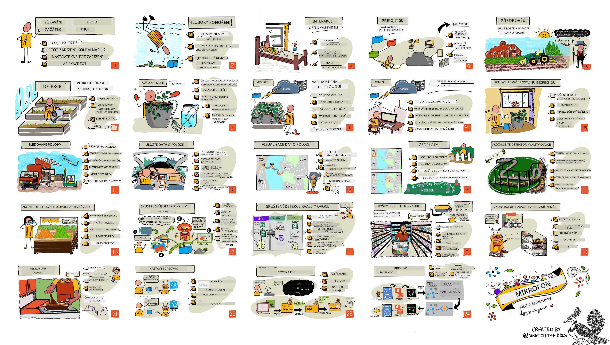

[](https://github.com/microsoft/IoT-For-Beginners/blob/master/LICENSE)
[](https://GitHub.com/microsoft/IoT-For-Beginners/graphs/contributors/)
[](https://GitHub.com/microsoft/IoT-For-Beginners/issues/)
[](https://GitHub.com/microsoft/IoT-For-Beginners/pulls/)
[](http://makeapullrequest.com)

[](https://GitHub.com/microsoft/IoT-For-Beginners/watchers/)
[](https://GitHub.com/microsoft/IoT-For-Beginners/network/)
[](https://GitHub.com/microsoft/IoT-For-Beginners/stargazers/)

### Připojte se ke komunitě Azure AI Foundry

Pokud se zaseknete nebo budete mít jakékoli otázky ohledně vytváření AI aplikací. Připojte se k ostatním studentům a zkušeným vývojářům v diskuzích o MCP. Je to podpůrná komunita, kde jsou dotazy vítány a znalosti jsou volně sdíleny.

[](https://discord.gg/nTYy5BXMWG)

Pokud máte zpětnou vazbu k produktu nebo narazíte na chyby během vývoje, navštivte:

[](https://aka.ms/foundry/forum)

Postupujte podle těchto kroků, jak začít využívat tyto zdroje:
1. **Vytvořte Fork repozitáře**: Klikněte na [](https://GitHub.com/microsoft/IoT-For-Beginners/fork)
2. **Naklonujte repozitář**:   `git clone https://github.com/microsoft/IoT-For-Beginners.git`
3. [**Připojte se k Microsot Foundry Discord a potkejte odborníky a další vývojáře**](https://discord.com/invite/ByRwuEEgH4)


### 🌐 Podpora více jazyků

#### Podporováno přes GitHub Action (automatizované & vždy aktuální)

<!-- CO-OP TRANSLATOR LANGUAGES TABLE START -->
[Arabic](../ar/README.md) | [Bengali](../bn/README.md) | [Bulgarian](../bg/README.md) | [Burmese (Myanmar)](../my/README.md) | [Chinese (Simplified)](../zh-CN/README.md) | [Chinese (Traditional, Hong Kong)](../zh-HK/README.md) | [Chinese (Traditional, Macau)](../zh-MO/README.md) | [Chinese (Traditional, Taiwan)](../zh-TW/README.md) | [Croatian](../hr/README.md) | [Czech](./README.md) | [Danish](../da/README.md) | [Dutch](../nl/README.md) | [Estonian](../et/README.md) | [Finnish](../fi/README.md) | [French](../fr/README.md) | [German](../de/README.md) | [Greek](../el/README.md) | [Hebrew](../he/README.md) | [Hindi](../hi/README.md) | [Hungarian](../hu/README.md) | [Indonesian](../id/README.md) | [Italian](../it/README.md) | [Japanese](../ja/README.md) | [Kannada](../kn/README.md) | [Khmer](../km/README.md) | [Korean](../ko/README.md) | [Lithuanian](../lt/README.md) | [Malay](../ms/README.md) | [Malayalam](../ml/README.md) | [Marathi](../mr/README.md) | [Nepali](../ne/README.md) | [Nigerian Pidgin](../pcm/README.md) | [Norwegian](../no/README.md) | [Persian (Farsi)](../fa/README.md) | [Polish](../pl/README.md) | [Portuguese (Brazil)](../pt-BR/README.md) | [Portuguese (Portugal)](../pt-PT/README.md) | [Punjabi (Gurmukhi)](../pa/README.md) | [Romanian](../ro/README.md) | [Russian](../ru/README.md) | [Serbian (Cyrillic)](../sr/README.md) | [Slovak](../sk/README.md) | [Slovenian](../sl/README.md) | [Spanish](../es/README.md) | [Swahili](../sw/README.md) | [Swedish](../sv/README.md) | [Tagalog (Filipino)](../tl/README.md) | [Tamil](../ta/README.md) | [Telugu](../te/README.md) | [Thai](../th/README.md) | [Turkish](../tr/README.md) | [Ukrainian](../uk/README.md) | [Urdu](../ur/README.md) | [Vietnamese](../vi/README.md)

> **Preferujete klonovat lokálně?**
>
> Tento repozitář obsahuje přeložené verze do více než 50 jazyků, což výrazně zvětšuje velikost stažení. Pokud chcete klonovat bez překladů, použijte sparse checkout:
>
> **Bash / macOS / Linux:**
> ```bash
> git clone --filter=blob:none --sparse https://github.com/microsoft/IoT-For-Beginners.git
> cd IoT-For-Beginners
> git sparse-checkout set --no-cone '/*' '!translations' '!translated_images'
> ```
>
> **CMD (Windows):**
> ```cmd
> git clone --filter=blob:none --sparse https://github.com/microsoft/IoT-For-Beginners.git
> cd IoT-For-Beginners
> git sparse-checkout set --no-cone "/*" "!translations" "!translated_images"
> ```
>
> To vám poskytne vše potřebné k dokončení kurzu s mnohem rychlejším stažením.
<!-- CO-OP TRANSLATOR LANGUAGES TABLE END -->

# IoT pro začátečníky - kurikulum

Cloudoví obhájci Azure ve společnosti Microsoft s radostí nabízejí 12týdenní kurikulum se 24 lekcemi, které se zabývá základy IoT. Každá lekce obsahuje kvízy před a po lekci, psané instrukce k dokončení lekce, řešení, úkol a další. Naše projektově orientovaná pedagogika vám umožní učit se při stavění, což je osvědčený způsob, jak si nové dovednosti dobře osvojit.

Projekty pokrývají cestu potravin od farmy až na stůl. Zahrnuje to zemědělství, logistiku, výrobu, maloobchod a spotřebitele – všechny populární průmyslové oblasti pro IoT zařízení.



> Sketchnote od [Nitya Narasimhan](https://github.com/nitya). Kliknutím na obrázek zobrazíte větší verzi.

**Srdce děkujeme našim autorům [Jen Fox](https://github.com/jenfoxbot), [Jen Looper](https://github.com/jlooper), [Jim Bennett](https://github.com/jimbobbennett) a našemu umělci sketchnotů [Nityi Narasimhanovi](https://github.com/nitya).**

**Také děkujeme našemu týmu [Microsoft Learn Student Ambassadors](https://studentambassadors.microsoft.com?WT.mc_id=academic-17441-jabenn), kteří kurikulum revidovali a překládali – [Aditya Garg](https://github.com/AdityaGarg00), [Anurag Sharma](https://github.com/Anurag-0-1-A), [Arpita Das](https://github.com/Arpiiitaaa), [Aryan Jain](https://www.linkedin.com/in/aryan-jain-47a4a1145/), [Bhavesh Suneja](https://github.com/EliteWarrior315), [Faith Hunja](https://faithhunja.github.io/), [Lateefah Bello](https://www.linkedin.com/in/lateefah-bello/), [Manvi Jha](https://github.com/Severus-Matthew), [Mireille Tan](https://www.linkedin.com/in/mireille-tan-a4834819a/), [Mohammad Iftekher (Iftu) Ebne Jalal](https://github.com/Iftu119), [Mohammad Zulfikar](https://github.com/mohzulfikar), [Priyanshu Srivastav](https://www.linkedin.com/in/priyanshu-srivastav-b067241ba), [Thanmai Gowducheruvu](https://github.com/innovation-platform) a [Zina Kamel](https://www.linkedin.com/in/zina-kamel/).**

Seznamte se s týmem!

[](https://youtu.be/-wippUJRi5k)

**Gif od** [Mohit Jaisal](https://linkedin.com/in/mohitjaisal)

> 🎥 Klikněte na obrázek výše pro video o projektu!

> **Učitelé**, do kurikula jsme [zařadili pár doporučení](for-teachers.md), jak kurikulum využít. Pokud byste chtěli vytvořit vlastní lekce, máme také zařazenou [šablonu lekce](lesson-template/README.md).

> **Studenti** [https://aka.ms/student-page](https://aka.ms/student-page), používáte-li toto kurikulum sami, vytvořte si fork celého repozitáře a plňte úkoly sami, začněte kvízem před přednáškou, pak si přečtěte přednášku a dokončete ostatní aktivity. Snažte se projekty vytvářet pochopením lekcí, nikoli kopírováním kódu řešení; přesto je tento kód k dispozici ve složkách /solutions v každé projektově orientované lekci. Další možností je vytvořit studijní skupinu s přáteli a projít obsah společně. Pro hlubší studium doporučujeme [Microsoft Learn](https://docs.microsoft.com/users/jimbobbennett/collections/ke2ehd351jopwr?WT.mc_id=academic-17441-jabenn).

Pro video přehled tohoto kurzu podívejte se na toto video:

[](https://youtube.com/watch?v=bccEMm8gRuc "Promo video")

> 🎥 Klikněte na obrázek výše pro video o projektu!

## Pedagogika

Při vytváření tohoto kurikula jsme zvolili dva pedagogické principy: zajistit, že je založeno na projektech, a že se vyskytují časté kvízy. Na konci této série studenti vytvoří systém pro monitorování a zalévání rostlin, sledovač vozidel, nastavení chytré továrny pro sledování a kontrolu potravin a hlasem ovládaný časovač na vaření, a naučí se základy Internetu věcí včetně psaní kódu pro zařízení, připojení ke cloudu, analýzy telemetrie a provozování AI na okraji sítě.

Zajištěním návaznosti obsahu na projekty je proces pro studenty poutavější a koncepty se lépe uchovávají.

Navíc kvíz s nízkou náročností před hodinou nastavuje studentovi záměr učit se dané téma, zatímco druhý kvíz po hodině zajišťuje další zapamatování. Toto kurikulum je navrženo tak, aby bylo flexibilní a zábavné a může být absolvováno jako celek nebo částečně. Projekty začínají malé a ke konci 12týdenního cyklu se stávají postupně složitějšími.

Každý projekt je založen na skutečném hardwaru dostupném studentům a nadšencům. Každý projekt se zabývá konkrétní oblastí projektu a poskytuje relevantní základní znalosti. Aby byl vývojář úspěšný, pomáhá porozumět doméně, ve které řeší problémy, poskytnutí těchto základních znalostí umožňuje studentům přemýšlet o svých IoT řešeních a získaných poznatcích v kontextu reálných problémů, které by mohli jako IoT vývojáři muset řešit. Studenti tak chápou „proč“ řešení, která vytvářejí, a získávají ocenení pro koncového uživatele.

## Hardware
Máme na výběr dva typy IoT hardwaru pro projekty v závislosti na osobních preferencích, znalostech programovacích jazyků, cílech učení a dostupnosti. Pro ty, kteří nemají přístup k hardwaru nebo se chtějí před zakoupením více naučit, jsme také připravili verzi „virtuálního hardwaru“. Více informací a „nákupní seznam“ najdete na [hardware stránce](./hardware.md), včetně odkazů na nákup kompletních sad od našich přátel ze Seeed Studio.

> 💁 Najdete u nás [Kodex chování](CODE_OF_CONDUCT.md), [Pravidla přispívání](CONTRIBUTING.md) a [Pokyny k překladům](..). Vítáme vaše konstruktivní připomínky!
>
> 🔧 Máte problém? Podívejte se na náš [Průvodce řešením problémů](TROUBLESHOOTING.md) pro běžná řešení.

## Každá lekce obsahuje:

- sketchnote
- volitelné doplňkové video
- rozcvičkový kvíz před lekcí
- psanou lekci
- u projektových lekcí podrobné návody jak projekt sestavit
- kontrolu znalostí
- výzvu
- doplňující čtení
- úkol
- [kvíz po lekci](https://ff-quizzes.netlify.app/en/)

> **Poznámka ke kvízům**: Všechny kvízy jsou obsaženy ve složce quiz-app, celkem je zde 48 kvízů se třemi otázkami v každém. Jsou propojeny z lekcí, ale aplikaci kvízu lze spustit lokálně nebo nasadit na Azure; postupujte podle návodu ve složce `quiz-app`. Postupně se lokalizují.

## Lekce

|       |               Název projektu               |                           Vyučované koncepty                            | Výukové cíle                                                                                                                                                     |                                                     Propojená lekce                                                      |
| :---: | :----------------------------------------: | :---------------------------------------------------------------------: | ---------------------------------------------------------------------------------------------------------------------------------------------------------------- | :---------------------------------------------------------------------------------------------------------------------: |
|  01   | [Začínáme](./1-getting-started/README.md) |                          Úvod do IoT                                  | Naučte se základní principy IoT a základní stavební kameny IoT řešení, jako jsou senzory a cloudové služby, při nastavování prvního IoT zařízení                     |                      [Úvod do IoT](./1-getting-started/lessons/1-introduction-to-iot/README.md)                           |
|  02   | [Začínáme](./1-getting-started/README.md) |                       Hlouběji do IoT                                | Naučte se více o komponentách IoT systému, stejně jako o mikrokontrolérech a jednodeskových počítačích                                                             |                        [Hlouběji do IoT](./1-getting-started/lessons/2-deeper-dive/README.md)                            |
|  03   | [Začínáme](./1-getting-started/README.md) |     Interakce s fyzickým světem pomocí senzorů a akčních členů       | Naučte se o senzorech pro sběr dat z fyzického světa a akčních členech pro zasílání zpětné vazby při stavbě nočního světla                                         | [Interakce s fyzickým světem pomocí senzorů a akčních členů](./1-getting-started/lessons/3-sensors-and-actuators/README.md) |
|  04   | [Začínáme](./1-getting-started/README.md) |                     Připojte zařízení k Internetu                    | Naučte se připojit IoT zařízení k internetu pro odesílání a přijímání zpráv připojením vašeho nočního světla k MQTT brokeru                                        |               [Připojení zařízení k internetu](./1-getting-started/lessons/4-connect-internet/README.md)                |
|  05   |              [Farmářství](./2-farm/README.md)              |                        Predikce růstu rostlin                         | Naučte se predikovat růst rostlin pomocí teplotních dat získaných IoT zařízením                                                                                    |                          [Predikce růstu rostlin](./2-farm/lessons/1-predict-plant-growth/README.md)                     |
|  06   |              [Farmářství](./2-farm/README.md)              |                        Detekce vlhkosti půdy                         | Naučte se detekovat vlhkost půdy a kalibrovat senzor vlhkosti půdy                                                                                                |                          [Detekce vlhkosti půdy](./2-farm/lessons/2-detect-soil-moisture/README.md)                     |
|  07   |              [Farmářství](./2-farm/README.md)              |               Automatizované zalévání rostlin                        | Naučte se automatizovat a časovat zavlažování pomocí relé a MQTT                                                                                                  |                      [Automatizované zalévání rostlin](./2-farm/lessons/3-automated-plant-watering/README.md)             |
|  08   |              [Farmářství](./2-farm/README.md)              |                 Přeneste rostlinu do cloudu                          | Naučte se o cloudu a cloudových IoT službách a jak připojit rostlinu k jedné z těchto služeb místo veřejného MQTT brokeru                                          |                   [Přeneste rostlinu do cloudu](./2-farm/lessons/4-migrate-your-plant-to-the-cloud/README.md)             |
|  09   |              [Farmářství](./2-farm/README.md)              |            Přesuňte logiku aplikace do cloudu                        | Naučte se, jak můžete psát aplikační logiku v cloudu, která reaguje na IoT zprávy                                                                                 |             [Přesuňte logiku vaší aplikace do cloudu](./2-farm/lessons/5-migrate-application-to-the-cloud/README.md)      |
|  10   |              [Farmářství](./2-farm/README.md)              |                     Zajistěte bezpečnost rostliny                    | Naučte se o bezpečnosti IoT a jak ochránit rostlinu pomocí klíčů a certifikátů                                                                                     |                         [Zajistěte bezpečnost rostliny](./2-farm/lessons/6-keep-your-plant-secure/README.md)              |
|  11   |           [Doprava](./3-transport/README.md)           |                          Sledování polohy                             | Naučte se o sledování GPS polohy pro IoT zařízení                                                                                                                 |                           [Sledování polohy](./3-transport/lessons/1-location-tracking/README.md)                          |
|  12   |           [Doprava](./3-transport/README.md)           |                          Ukládání polohových dat                     | Naučte se ukládat IoT data pro pozdější vizualizaci nebo analýzu                                                                                                  |                          [Ukládání polohových dat](./3-transport/lessons/2-store-location-data/README.md)                  |
|  13   |           [Doprava](./3-transport/README.md)           |                     Vizualizace polohových dat                      | Naučte se o vizualizaci polohových dat na mapě a o tom, jak mapy reprezentují reálný 3D svět ve 2D                                                                   |                      [Vizualizace polohových dat](./3-transport/lessons/3-visualize-location-data/README.md)               |
|  14   |           [Doprava](./3-transport/README.md)           |                             Geofencing                                | Naučte se o geofencech a jak je využít k upozornění, když jsou vozidla v dodavatelském řetězci blízko svého cíle                                                  |                                  [Geofencing](./3-transport/lessons/4-geofences/README.md)                                 |
|  15   |      [Výroba](./4-manufacturing/README.md)      |                 Vyškolte detektor kvality ovoce                      | Naučte se o trénování obrazového klasifikátoru v cloudu pro detekci kvality ovoce                                                                                  |               [Vyškolte detektor kvality ovoce](./4-manufacturing/lessons/1-train-fruit-detector/README.md)               |
|  16   |      [Výroba](./4-manufacturing/README.md)      |                 Kontrola kvality ovoce pomocí IoT zařízení          | Naučte se používat detektor kvality ovoce z IoT zařízení                                                                                                          |            [Kontrola kvality ovoce pomocí IoT zařízení](./4-manufacturing/lessons/2-check-fruit-from-device/README.md)      |
|  17   |      [Výroba](./4-manufacturing/README.md)      |                   Spouštění detektoru ovoce na okraji                | Naučte se spouštět detektor ovoce na IoT zařízení na okraji sítě                                                                                                  |                   [Spuštění detektoru ovoce na okraji](./4-manufacturing/lessons/3-run-fruit-detector-edge/README.md)       |
|  18   |      [Výroba](./4-manufacturing/README.md)      |                Spouštění detekce kvality ovoce ze senzoru            | Naučte se, jak spustit detekci kvality ovoce ze senzoru                                                                                                          |              [Spuštění detekce kvality ovoce ze senzoru](./4-manufacturing/lessons/4-trigger-fruit-detector/README.md)     |
|  19   |          [Prodej](./5-retail/README.md)          |                  Vyškolte detektor zásob                              | Naučte se používat detekci objektů k vytrénování detektoru zásob pro počítání zásob v obchodě                                                                     |                          [Vyškolte detektor zásob](./5-retail/lessons/1-train-stock-detector/README.md)                    |
|  20   |          [Prodej](./5-retail/README.md)          |               Kontrola zásob pomocí IoT zařízení                      | Naučte se ověřovat zásoby pomocí IoT zařízení s modelem detekce objektů                                                                                            |                       [Kontrola zásob pomocí IoT zařízení](./5-retail/lessons/2-check-stock-device/README.md)              |
|  21   |        [Spotřebitel](./6-consumer/README.md)        |               Rozpoznávání řeči IoT zařízením                        | Naučte se rozpoznávat řeč z IoT zařízení pro stavbu chytrého časovače                                                                                              |                    [Rozpoznávání řeči IoT zařízením](./6-consumer/lessons/1-speech-recognition/README.md)                   |
|  22   |        [Spotřebitel](./6-consumer/README.md)        |                    Porozumění jazyku                                | Naučte se rozumět větám mluveným k IoT zařízení                                                                                                                    |                         [Porozumění jazyku](./6-consumer/lessons/2-language-understanding/README.md)                       |
|  23   |        [Spotřebitel](./6-consumer/README.md)        |              Nastavení časovače a hlasová zpětná vazba              | Naučte se nastavit časovač na IoT zařízení a poskytovat mluvenou zpětnou vazbu o nastavení a skončení časovače                                                    |                 [Nastavte časovač a poskytujte hlasovou zpětnou vazbu](./6-consumer/lessons/3-spoken-feedback/README.md)    |
|  24   |        [Spotřebitel](./6-consumer/README.md)        |                     Podpora více jazyků                             | Naučte se podporovat více jazyků, jak při mluvení k zařízení, tak i ve zpětných reakcích vašeho chytrého časovače                                               |                    [Podpora více jazyků](./6-consumer/lessons/4-multiple-language-support/README.md)                       |

## Offline přístup

Tuto dokumentaci můžete spustit offline pomocí [Docsify](https://docsify.js.org/#/). Vytvořte fork tohoto repozitáře, [nainstalujte Docsify](https://docsify.js.org/#/quickstart) na svém počítači a pak v hlavní složce repozitáře napište `docsify serve`. Web bude služen na portu 3000 na vašem localhostu: `localhost:3000`.

## Kvíz

Díky komunitě za hostování interaktivního kvízu, kde si můžete otestovat své znalosti z každé kapitoly. Testujte své znalosti [zde](https://ff-quizzes.netlify.app/en/)

### PDF

Pokud potřebujete, můžete si vytvořit PDF této dokumentace pro offline přístup. Ujistěte se, že máte [npm nainstalovaný](https://docs.npmjs.com/downloading-and-installing-node-js-and-npm) a spusťte následující příkazy v hlavní složce tohoto repozitáře:

```sh
npm i
npm run convert
```

### Prezentace

Pro některé lekce jsou připravené prezentace ve složce [slides](../../slides).

## Další kurikula

Náš tým vytváří i další kurikula! Podívejte se na:

<!-- CO-OP TRANSLATOR OTHER COURSES START -->
### LangChain
[](https://aka.ms/langchain4j-for-beginners)
[](https://aka.ms/langchainjs-for-beginners?WT.mc_id=m365-94501-dwahlin)
[](https://github.com/microsoft/langchain-for-beginners?WT.mc_id=m365-94501-dwahlin)
---

### Azure / Edge / MCP / Agents
[](https://github.com/microsoft/AZD-for-beginners?WT.mc_id=academic-105485-koreyst)
[](https://github.com/microsoft/edgeai-for-beginners?WT.mc_id=academic-105485-koreyst)
[](https://github.com/microsoft/mcp-for-beginners?WT.mc_id=academic-105485-koreyst)
[](https://github.com/microsoft/ai-agents-for-beginners?WT.mc_id=academic-105485-koreyst)

---
 
### Série Generativní AI
[](https://github.com/microsoft/generative-ai-for-beginners?WT.mc_id=academic-105485-koreyst)
[-9333EA?style=for-the-badge&labelColor=E5E7EB&color=9333EA)](https://github.com/microsoft/Generative-AI-for-beginners-dotnet?WT.mc_id=academic-105485-koreyst)
[-C084FC?style=for-the-badge&labelColor=E5E7EB&color=C084FC)](https://github.com/microsoft/generative-ai-for-beginners-java?WT.mc_id=academic-105485-koreyst)
[-E879F9?style=for-the-badge&labelColor=E5E7EB&color=E879F9)](https://github.com/microsoft/generative-ai-with-javascript?WT.mc_id=academic-105485-koreyst)

---
 
### Základní učení
[](https://aka.ms/ml-beginners?WT.mc_id=academic-105485-koreyst)
[](https://aka.ms/datascience-beginners?WT.mc_id=academic-105485-koreyst)
[](https://aka.ms/ai-beginners?WT.mc_id=academic-105485-koreyst)
[](https://github.com/microsoft/Security-101?WT.mc_id=academic-96948-sayoung)
[](https://aka.ms/webdev-beginners?WT.mc_id=academic-105485-koreyst)
[](https://aka.ms/iot-beginners?WT.mc_id=academic-105485-koreyst)
[](https://github.com/microsoft/xr-development-for-beginners?WT.mc_id=academic-105485-koreyst)

---
 
### Série Copilot
[](https://aka.ms/GitHubCopilotAI?WT.mc_id=academic-105485-koreyst)
[](https://github.com/microsoft/mastering-github-copilot-for-dotnet-csharp-developers?WT.mc_id=academic-105485-koreyst)
[](https://github.com/microsoft/CopilotAdventures?WT.mc_id=academic-105485-koreyst)
<!-- CO-OP TRANSLATOR OTHER COURSES END -->

## Atribuce obrázků

Všechny atribuce k obrázkům použitým v tomto kurikulu můžete najít v případě potřeby v souboru [Attributions](./attributions.md).

---

<!-- CO-OP TRANSLATOR DISCLAIMER START -->
**Prohlášení o vyloučení odpovědnosti**:
Tento dokument byl přeložen pomocí AI překladatelské služby [Co-op Translator](https://github.com/Azure/co-op-translator). Přestože se snažíme o přesnost, mějte prosím na paměti, že automatizované překlady mohou obsahovat chyby nebo nepřesnosti. Původní dokument v jeho mateřském jazyce by měl být považován za autoritativní zdroj. Pro kritické informace se doporučuje profesionální lidský překlad. Nejsme odpovědní za jakékoli nedorozumění nebo nesprávné interpretace vyplývající z použití tohoto překladu.
<!-- CO-OP TRANSLATOR DISCLAIMER END -->