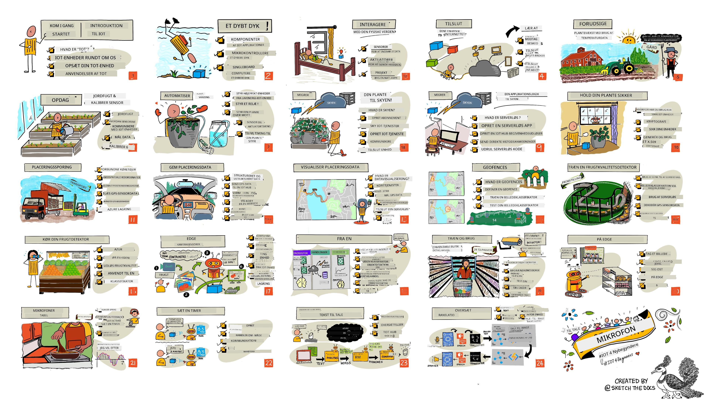

<!--
CO_OP_TRANSLATOR_METADATA:
{
  "original_hash": "6c354ec3487e4f6cfafbe44557996cd9",
  "translation_date": "2026-01-06T06:25:11+00:00",
  "source_file": "README.md",
  "language_code": "da"
}
-->
[](https://github.com/microsoft/IoT-For-Beginners/blob/master/LICENSE)
[](https://GitHub.com/microsoft/IoT-For-Beginners/graphs/contributors/)
[](https://GitHub.com/microsoft/IoT-For-Beginners/issues/)
[](https://GitHub.com/microsoft/IoT-For-Beginners/pulls/)
[](http://makeapullrequest.com)

[](https://GitHub.com/microsoft/IoT-For-Beginners/watchers/)
[](https://GitHub.com/microsoft/IoT-For-Beginners/network/)
[](https://GitHub.com/microsoft/IoT-For-Beginners/stargazers/)

### Deltag i Azure AI Foundry Community

Hvis du sidder fast eller har spørgsmål om at bygge AI-apps, kan du deltage med andre lærende og erfarne udviklere i diskussioner om MCP. Det er et støttende fællesskab, hvor spørgsmål er velkomne, og viden deles frit.

[](https://discord.gg/nTYy5BXMWG)

Hvis du har feedback på produktet eller fejl under byggeriet, besøg:

[](https://aka.ms/foundry/forum)

Følg disse trin for at komme i gang med at bruge disse ressourcer:
1. **Fork repositoryet**: Klik på [](https://GitHub.com/microsoft/IoT-For-Beginners/fork)
2. **Klon repositoryet**:   `git clone https://github.com/microsoft/IoT-For-Beginners.git`
3. [**Deltag i Microsoft Foundry Discord og mød eksperter og medudviklere**](https://discord.com/invite/ByRwuEEgH4)


### 🌐 Flersproget support

#### Understøttet via GitHub Action (Automatisk & Altid Opdateret)

<!-- CO-OP TRANSLATOR LANGUAGES TABLE START -->
[Arabisk](../ar/README.md) | [Bengali](../bn/README.md) | [Bulgarsk](../bg/README.md) | [Burmesisk (Myanmar)](../my/README.md) | [Kinesisk (Forenklet)](../zh/README.md) | [Kinesisk (Traditionelt, Hong Kong)](../hk/README.md) | [Kinesisk (Traditionelt, Macau)](../mo/README.md) | [Kinesisk (Traditionelt, Taiwan)](../tw/README.md) | [Kroatisk](../hr/README.md) | [Tjekkisk](../cs/README.md) | [Dansk](./README.md) | [Hollandsk](../nl/README.md) | [Estisk](../et/README.md) | [Finsk](../fi/README.md) | [Fransk](../fr/README.md) | [Tysk](../de/README.md) | [Gresk](../el/README.md) | [Hebraisk](../he/README.md) | [Hindi](../hi/README.md) | [Ungarsk](../hu/README.md) | [Indonesisk](../id/README.md) | [Italiensk](../it/README.md) | [Japansk](../ja/README.md) | [Kannada](../kn/README.md) | [Koreansk](../ko/README.md) | [Litauisk](../lt/README.md) | [Malaysisk](../ms/README.md) | [Malayalam](../ml/README.md) | [Marathi](../mr/README.md) | [Nepalesisk](../ne/README.md) | [Nigeriansk Pidgin](../pcm/README.md) | [Norsk](../no/README.md) | [Persisk (Farsi)](../fa/README.md) | [Polsk](../pl/README.md) | [Portugisisk (Brasilien)](../br/README.md) | [Portugisisk (Portugal)](../pt/README.md) | [Punjabi (Gurmukhi)](../pa/README.md) | [Rumænsk](../ro/README.md) | [Russisk](../ru/README.md) | [Serbisk (Cyrillisk)](../sr/README.md) | [Slovakisk](../sk/README.md) | [Slovensk](../sl/README.md) | [Spansk](../es/README.md) | [Swahili](../sw/README.md) | [Svensk](../sv/README.md) | [Tagalog (Filippinsk)](../tl/README.md) | [Tamil](../ta/README.md) | [Telugu](../te/README.md) | [Thai](../th/README.md) | [Tyrkisk](../tr/README.md) | [Ukrainsk](../uk/README.md) | [Urdu](../ur/README.md) | [Vietnamesisk](../vi/README.md)

> **Foretrækker du at klone lokalt?**

> Dette repository inkluderer 50+ sprogoversættelser, som betydeligt øger størrelsen på downloadet. For at klone uden oversættelser, brug sparse checkout:
> ```bash
> git clone --filter=blob:none --sparse https://github.com/microsoft/IoT-For-Beginners.git
> cd IoT-For-Beginners
> git sparse-checkout set --no-cone '/*' '!translations' '!translated_images'
> ```
> Dette giver dig alt, hvad du behøver for at gennemføre kurset med en meget hurtigere download.
<!-- CO-OP TRANSLATOR LANGUAGES TABLE END -->

# IoT for begyndere - Et pensum

Azure Cloud Advocates hos Microsoft er glade for at kunne tilbyde et 12-ugers, 24-lektioners pensum om IoT-grundlæggende. Hver lektion inkluderer quizzer før og efter lektionen, skriftlige instruktioner til gennemførelse af lektionen, en løsning, en opgave og mere. Vores projektbaserede pædagogik giver dig mulighed for at lære ved at bygge, en dokumenteret metode til at få nye færdigheder til at 'sætte sig fast'.

Projekterne dækker fødevarens rejse fra gård til bord. Det inkluderer landbrug, logistik, produktion, detailhandel og forbruger - alle populære industrisektorer for IoT-enheder.



> Sketchnote af [Nitya Narasimhan](https://github.com/nitya). Klik på billedet for en større version.

**Hjertevarm tak til vores forfattere [Jen Fox](https://github.com/jenfoxbot), [Jen Looper](https://github.com/jlooper), [Jim Bennett](https://github.com/jimbobbennett) og vores sketchnote-kunstner [Nitya Narasimhan](https://github.com/nitya).**

**Tak også til vores team af [Microsoft Learn Student Ambassadors](https://studentambassadors.microsoft.com?WT.mc_id=academic-17441-jabenn), som har gennemgået og oversat dette pensum - [Aditya Garg](https://github.com/AdityaGarg00), [Anurag Sharma](https://github.com/Anurag-0-1-A), [Arpita Das](https://github.com/Arpiiitaaa), [Aryan Jain](https://www.linkedin.com/in/aryan-jain-47a4a1145/), [Bhavesh Suneja](https://github.com/EliteWarrior315), [Faith Hunja](https://faithhunja.github.io/), [Lateefah Bello](https://www.linkedin.com/in/lateefah-bello/), [Manvi Jha](https://github.com/Severus-Matthew), [Mireille Tan](https://www.linkedin.com/in/mireille-tan-a4834819a/), [Mohammad Iftekher (Iftu) Ebne Jalal](https://github.com/Iftu119), [Mohammad Zulfikar](https://github.com/mohzulfikar), [Priyanshu Srivastav](https://www.linkedin.com/in/priyanshu-srivastav-b067241ba), [Thanmai Gowducheruvu](https://github.com/innovation-platform) og [Zina Kamel](https://www.linkedin.com/in/zina-kamel/).**

Mød teamet!

[](https://youtu.be/-wippUJRi5k)

**Gif af** [Mohit Jaisal](https://linkedin.com/in/mohitjaisal)

> 🎥 Klik på billedet ovenfor for en video om projektet!

> **Lærere**, vi har [inkluderet nogle forslag](for-teachers.md) til, hvordan dette pensum kan bruges. Hvis du ønsker at lave dine egne lektioner, har vi også inkluderet en [lektionsskabelon](lesson-template/README.md).

> **[Studerende](https://aka.ms/student-page)**, for at bruge dette pensum på egen hånd, fork hele repoet og fuldfør opgaverne alene, startende med en quiz før forelæsningen, derefter læse forelæsningen og fuldføre resten af aktiviteterne. Prøv at skabe projekterne ved at forstå lektionerne i stedet for at kopiere løsningskoden; denne kode er dog tilgængelig i /solutions-mapper i hver projektorienteret lektion. En anden idé kunne være at danne en studiekreds med venner og gennemgå indholdet sammen. Til yderligere studier anbefaler vi [Microsoft Learn](https://docs.microsoft.com/users/jimbobbennett/collections/ke2ehd351jopwr?WT.mc_id=academic-17441-jabenn).

For en videooversigt over dette kursus, se denne video:

[](https://youtube.com/watch?v=bccEMm8gRuc "Promo video")

> 🎥 Klik på billedet ovenfor for en video om projektet!

## Pædagogik

Vi har valgt to pædagogiske principper, mens vi byggede dette pensum: at sikre, at det er projektbaseret og at det indeholder hyppige quizzer. Ved slutningen af denne serie vil studerende have bygget et planteovervågnings- og vandingssystem, en køretøjstracker, en smart fabriksopsætning til overvågning og kontrol af mad og en stemmestyret madlavningstimer og vil have lært det grundlæggende om Internet of Things, herunder hvordan man skriver enhedskode, forbinder til skyen, analyserer telemetri og kører AI på kanten.

Ved at sikre at indholdet er knyttet til projekter, bliver processen mere engagerende for studerende, og fastholdelse af begreber bliver forbedret.

Derudover sætter en lavrisiko quiz før en klasse studentens intention om at lære et emne, mens en anden quiz efter klassen sikrer yderligere fastholdelse. Dette pensum er designet til at være fleksibelt og sjovt og kan tages helt eller delvist. Projekterne starter småt og bliver gradvist mere komplekse ved slutningen af den 12-ugers cyklus.

Hvert projekt er baseret på hardware fra den virkelige verden, tilgængelig for studerende og hobbyister. Hvert projekt undersøger det specifikke projektdomæne og giver relevant baggrundsviden. For at være en succesfuld udvikler hjælper det at forstå den domæne, hvor man løser problemer – denne baggrundsviden giver studerende mulighed for at tænke over deres IoT-løsninger og læring i konteksten af den slags virkelige problemer, de kunne blive bedt om at løse som IoT-udvikler. Studerende lærer 'hvorfor' bag de løsninger, de bygger, og får en forståelse for slutbrugeren.

## Hardware

Vi har to valg af IoT-hardware til brug for projekterne afhængig af personlige præferencer, programmeringssprogskendskab eller præferencer, læringsmål og tilgængelighed. Vi har også lavet en 'virtuel hardware'-version til dem, der ikke har adgang til hardware, eller ønsker at lære mere, før de køber. Du kan læse mere og finde en 'indkøbsliste' på [hardware-siden](./hardware.md), inklusive links til køb af komplette kits hos vores venner hos Seeed Studio.
> 💁 Find vores [Code of Conduct](CODE_OF_CONDUCT.md), [Contributing](CONTRIBUTING.md), og [Translation](TRANSLATIONS.md) retningslinjer. Vi byder din konstruktive feedback velkommen!
>
> 🔧 Har du problemer? Tjek vores [Troubleshooting Guide](TROUBLESHOOTING.md) for løsninger på almindelige problemer.

## Hver lektion inkluderer:

- sketchnote
- valgfri supplerende video
- opvarmningsquiz før lektionen
- skriftlig lektion
- for projektbaserede lektioner, trin-for-trin guider til at bygge projektet
- videnscheck
- en udfordring
- supplerende læsning
- opgave
- [quiz efter lektionen](https://ff-quizzes.netlify.app/en/)

> **En note om quizzer**: Alle quizzer findes i quiz-app mappen, i alt 48 quizzer med tre spørgsmål hver. De er linket til fra lektionerne, men quiz-appen kan køres lokalt eller udgives på Azure; følg instruktionen i `quiz-app` mappen. De bliver løbende lokaliseret.

## Lektioner

|       |              Projektnavn              |                       Underviste begreber                       | Læringsmål                                                                                                                                                 |                                                        Linket lektion                                                         |
| :---: | :----------------------------------: | :---------------------------------------------------------------: | ---------------------------------------------------------------------------------------------------------------------------------------------------------- | :----------------------------------------------------------------------------------------------------------------------------: |
|  01   | [Getting started](./1-getting-started/README.md) |                     Introduktion til IoT                     | Lær de grundlæggende principper for IoT og de grundlæggende byggesten i IoT-løsninger som sensorer og cloud-tjenester, mens du opsætter din første IoT-enhed |                      [Introduktion til IoT](./1-getting-started/lessons/1-introduction-to-iot/README.md)                      |
|  02   | [Getting started](./1-getting-started/README.md) |                   Et dybere dyk i IoT                    | Lær mere om komponenterne i et IoT-system, samt mikrocontrollere og single-board computere                                                                |                        [Et dybere dyk i IoT](./1-getting-started/lessons/2-deeper-dive/README.md)                         |
|  03   | [Getting started](./1-getting-started/README.md) | Interagér med den fysiske verden med sensorer og aktuatorer | Lær om sensorer til at indsamle data fra den fysiske verden og aktuatorer til at sende feedback, mens du bygger en natlampe                               | [Interagér med den fysiske verden med sensorer og aktuatorer](./1-getting-started/lessons/3-sensors-and-actuators/README.md) |
|  04   | [Getting started](./1-getting-started/README.md) |             Forbind din enhed til internettet             | Lær om hvordan du forbinder en IoT-enhed til internettet for at sende og modtage beskeder ved at forbinde din natlampe til en MQTT broker                 |               [Forbind din enhed til internettet](./1-getting-started/lessons/4-connect-internet/README.md)                |
|  05   |            [Farm](./2-farm/README.md)            |                    Forudsig plantevækst                     | Lær hvordan du forudsiger plantevækst ved hjælp af temperaturdata indsamlet af en IoT-enhed                                                               |                          [Forudsig plantevækst](./2-farm/lessons/1-predict-plant-growth/README.md)                           |
|  06   |            [Farm](./2-farm/README.md)            |                    Registrer jordfugtighed                    | Lær hvordan du registrerer jordfugtighed og kalibrerer en jordfugtighedssensor                                                                             |                          [Registrer jordfugtighed](./2-farm/lessons/2-detect-soil-moisture/README.md)                           |
|  07   |            [Farm](./2-farm/README.md)            |                 Automatiseret plantevanding                   | Lær hvordan du automatiserer og tidsindstiller vanding ved hjælp af et relæ og MQTT                                                                        |                      [Automatiseret plantevanding](./2-farm/lessons/3-automated-plant-watering/README.md)                       |
|  08   |            [Farm](./2-farm/README.md)            |               Migrer din plante til skyen                      | Lær om cloud og cloud-hostede IoT-tjenester og hvordan du forbinder din plante til en af disse i stedet for en offentlig MQTT broker                       |              [Migrer din plante til skyen](./2-farm/lessons/4-migrate-your-plant-to-the-cloud/README.md)                 |
|  09   |            [Farm](./2-farm/README.md)            |         Migrer din applikationslogik til skyen                  | Lær hvordan du kan skrive applikationslogik i skyen, der reagerer på IoT-beskeder                                                                         |          [Migrer din applikationslogik til skyen](./2-farm/lessons/5-migrate-application-to-the-cloud/README.md)          |
|  10   |            [Farm](./2-farm/README.md)            |                   Hold din plante sikker                          | Lær om sikkerhed med IoT og hvordan du holder din plante sikker med nøgler og certifikater                                                                |                        [Hold din plante sikker](./2-farm/lessons/6-keep-your-plant-secure/README.md)                         |
|  11   |       [Transport](./3-transport/README.md)       |                      Positionssporing                        | Lær om GPS-positionssporing for IoT-enheder                                                                                                               |                           [Positionssporing](./3-transport/lessons/1-location-tracking/README.md)                           |
|  12   |       [Transport](./3-transport/README.md)       |                     Gem positionsdata                        | Lær hvordan du gemmer IoT-data til visualisering eller analyse senere                                                                                      |                         [Gem positionsdata](./3-transport/lessons/2-store-location-data/README.md)                         |
|  13   |       [Transport](./3-transport/README.md)       |                   Visualiser positionsdata                    | Lær om visualisering af positionsdata på et kort og hvordan kort repræsenterer den virkelige 3D-verden i 2 dimensioner                                    |                     [Visualiser positionsdata](./3-transport/lessons/3-visualize-location-data/README.md)                     |
|  14   |       [Transport](./3-transport/README.md)       |                          Geofence                             | Lær om geofence og hvordan de kan bruges til at advare, når køretøjer i forsyningskæden er tæt på deres destination                                      |                                   [Geofence](./3-transport/lessons/4-geofences/README.md)                                   |
|  15   |   [Manufacturing](./4-manufacturing/README.md)   |              Træn en frugtkvalitetsdetektor                   | Lær om at træne en billedklassifikator i skyen til at registrere frugtkvalitet                                                                             |                 [Træn en frugtkvalitetsdetektor](./4-manufacturing/lessons/1-train-fruit-detector/README.md)                 |
|  16   |   [Manufacturing](./4-manufacturing/README.md)   |           Tjek frugtkvalitet fra en IoT-enhed                 | Lær om at bruge din frugtkvalitetsdetektor fra en IoT-enhed                                                                                                |           [Tjek frugtkvalitet fra en IoT-enhed](./4-manufacturing/lessons/2-check-fruit-from-device/README.md)            |
|  17   |   [Manufacturing](./4-manufacturing/README.md)   |             Kør din frugtdetektor på kanten                   | Lær om at køre din frugtdetektor på en IoT-enhed på kanten                                                                                                |             [Kør din frugtdetektor på kanten](./4-manufacturing/lessons/3-run-fruit-detector-edge/README.md)             |
|  18   |   [Manufacturing](./4-manufacturing/README.md)   |        Udløs frugtkvalitetsdetektion fra en sensor           | Lær om at udløse frugtkvalitetsdetektion fra en sensor                                                                                                     |        [Udløs frugtkvalitetsdetektion fra en sensor](./4-manufacturing/lessons/4-trigger-fruit-detector/README.md)         |
|  19   |          [Retail](./5-retail/README.md)          |                   Træn en lagerdetektor                       | Lær hvordan du bruger objektgenkendelse til at træne en lagerdetektor til at tælle varelagret i en butik                                                  |                        [Træn en lagerdetektor](./5-retail/lessons/1-train-stock-detector/README.md)                         |
|  20   |          [Retail](./5-retail/README.md)          |               Tjek lager fra en IoT-enhed                     | Lær hvordan du tjekker lager fra en IoT-enhed ved hjælp af en objektgenkendelsesmodel                                                                      |                     [Tjek lager fra en IoT-enhed](./5-retail/lessons/2-check-stock-device/README.md)                      |
|  21   |        [Consumer](./6-consumer/README.md)        |             Genkend tale med en IoT-enhed                     | Lær hvordan du genkender tale fra en IoT-enhed for at bygge en smart timer                                                                                  |                  [Genkend tale med en IoT-enhed](./6-consumer/lessons/1-speech-recognition/README.md)                  |
|  22   |        [Consumer](./6-consumer/README.md)        |                    Forstå sprog                                | Lær hvordan du forstår sætninger talt til en IoT-enhed                                                                                                   |                        [Forstå sprog](./6-consumer/lessons/2-language-understanding/README.md)                        |
|  23   |        [Consumer](./6-consumer/README.md)        |          Sæt en timer og giv mundtlig feedback                | Lær hvordan du sætter en timer på en IoT-enhed og giver mundtlig feedback om hvornår timeren er sat og når den slutter                                   |                 [Sæt en timer og giv mundtlig feedback](./6-consumer/lessons/3-spoken-feedback/README.md)                  |
|  24   |        [Consumer](./6-consumer/README.md)        |                 Understøt flere sprog                          | Lær hvordan du understøtter flere sprog, både ved at blive talt til og ved svarene fra din smart timer                                                   |                   [Understøt flere sprog](./6-consumer/lessons/4-multiple-language-support/README.md)                   |

## Offline adgang

Du kan køre denne dokumentation offline ved at bruge [Docsify](https://docsify.js.org/#/). Fork dette repo, [installer Docsify](https://docsify.js.org/#/quickstart) på din lokale maskine, og skriv så i rodmappen af dette repo `docsify serve`. Websitet vil blive serveret på port 3000 på din localhost: `localhost:3000`.

## Quiz

Tak til fællesskabet for at hoste den interaktive quiz, som tester din viden om hvert kapitel. Du kan teste din viden [her](https://ff-quizzes.netlify.app/en/) 

### PDF

Du kan generere en PDF af dette indhold til offline adgang, hvis nødvendigt. For at gøre dette, skal du sikre dig, at du har [npm installeret](https://docs.npmjs.com/downloading-and-installing-node-js-and-npm) og kør følgende kommandoer i rodmappen af dette repo:

```sh
npm i
npm run convert
```

### Slides

Der er slide-decks til nogle af lektionerne i [slides](../../slides) mappen.


## Andre Læreplaner

Vores team producerer andre læreplaner! Tjek:

<!-- CO-OP TRANSLATOR OTHER COURSES START -->
### LangChain
[](https://aka.ms/langchain4j-for-beginners)
[](https://aka.ms/langchainjs-for-beginners?WT.mc_id=m365-94501-dwahlin)

---

### Azure / Edge / MCP / Agents
[](https://github.com/microsoft/AZD-for-beginners?WT.mc_id=academic-105485-koreyst)
[](https://github.com/microsoft/edgeai-for-beginners?WT.mc_id=academic-105485-koreyst)
[](https://github.com/microsoft/mcp-for-beginners?WT.mc_id=academic-105485-koreyst)
[](https://github.com/microsoft/ai-agents-for-beginners?WT.mc_id=academic-105485-koreyst)

---
 
### Generativ AI-serie
[](https://github.com/microsoft/generative-ai-for-beginners?WT.mc_id=academic-105485-koreyst)
[-9333EA?style=for-the-badge&labelColor=E5E7EB&color=9333EA)](https://github.com/microsoft/Generative-AI-for-beginners-dotnet?WT.mc_id=academic-105485-koreyst)
[-C084FC?style=for-the-badge&labelColor=E5E7EB&color=C084FC)](https://github.com/microsoft/generative-ai-for-beginners-java?WT.mc_id=academic-105485-koreyst)
[-E879F9?style=for-the-badge&labelColor=E5E7EB&color=E879F9)](https://github.com/microsoft/generative-ai-with-javascript?WT.mc_id=academic-105485-koreyst)

---
 
### Kerne-læring
[](https://aka.ms/ml-beginners?WT.mc_id=academic-105485-koreyst)
[](https://aka.ms/datascience-beginners?WT.mc_id=academic-105485-koreyst)
[](https://aka.ms/ai-beginners?WT.mc_id=academic-105485-koreyst)
[](https://github.com/microsoft/Security-101?WT.mc_id=academic-96948-sayoung)
[](https://aka.ms/webdev-beginners?WT.mc_id=academic-105485-koreyst)
[](https://aka.ms/iot-beginners?WT.mc_id=academic-105485-koreyst)
[](https://github.com/microsoft/xr-development-for-beginners?WT.mc_id=academic-105485-koreyst)

---
 
### Copilot-serie
[](https://aka.ms/GitHubCopilotAI?WT.mc_id=academic-105485-koreyst)
[](https://github.com/microsoft/mastering-github-copilot-for-dotnet-csharp-developers?WT.mc_id=academic-105485-koreyst)
[](https://github.com/microsoft/CopilotAdventures?WT.mc_id=academic-105485-koreyst)
<!-- CO-OP TRANSLATOR OTHER COURSES END -->

## Billedhenvisninger

Du kan finde alle henvisninger for de billeder, der bruges i denne læseplan, hvor det er nødvendigt, i [Henvisninger](./attributions.md).

---

<!-- CO-OP TRANSLATOR DISCLAIMER START -->
**Ansvarsfraskrivelse**:
Dette dokument er blevet oversat ved hjælp af AI-oversættelsestjenesten [Co-op Translator](https://github.com/Azure/co-op-translator). Selvom vi bestræber os på nøjagtighed, skal du være opmærksom på, at automatiske oversættelser kan indeholde fejl eller unøjagtigheder. Det originale dokument på dets oprindelige sprog betragtes som den autoritative kilde. For vigtig information anbefales professionel menneskelig oversættelse. Vi påtager os intet ansvar for eventuelle misforståelser eller fejltolkninger, der måtte opstå ved brug af denne oversættelse.
<!-- CO-OP TRANSLATOR DISCLAIMER END -->