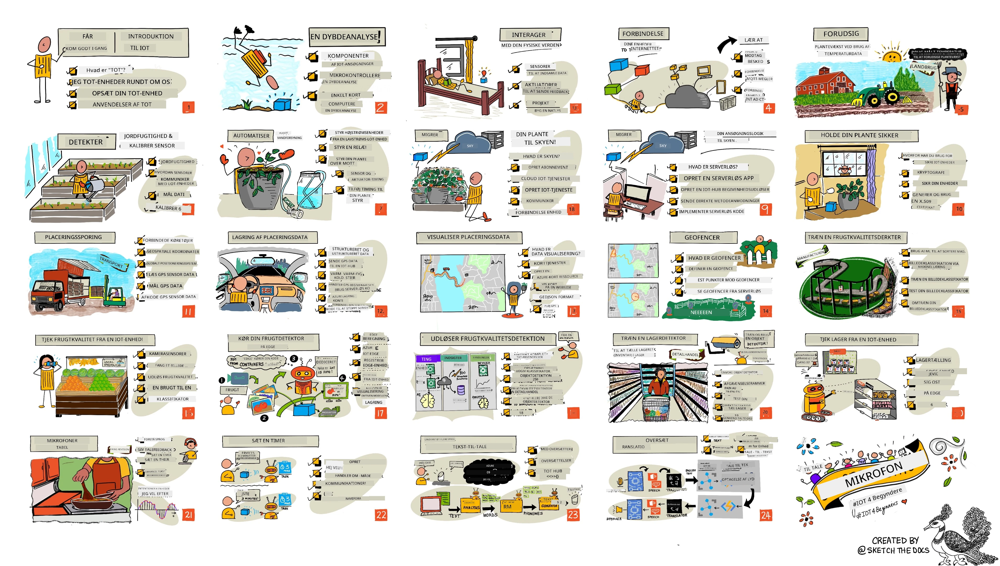

[](https://github.com/microsoft/IoT-For-Beginners/blob/master/LICENSE)
[](https://GitHub.com/microsoft/IoT-For-Beginners/graphs/contributors/)
[](https://GitHub.com/microsoft/IoT-For-Beginners/issues/)
[](https://GitHub.com/microsoft/IoT-For-Beginners/pulls/)
[](http://makeapullrequest.com)

[](https://GitHub.com/microsoft/IoT-For-Beginners/watchers/)
[](https://GitHub.com/microsoft/IoT-For-Beginners/network/)
[](https://GitHub.com/microsoft/IoT-For-Beginners/stargazers/)

### Deltag i Azure AI Foundry-fællesskabet

Hvis du går i stå eller har spørgsmål om at bygge AI-apps. Deltag med medlærende og erfarne udviklere i diskussioner om MCP. Det er et støttende fællesskab, hvor spørgsmål er velkomne, og viden deles frit.

[](https://discord.gg/nTYy5BXMWG)

Hvis du har produktfeedback eller fejl under udvikling, besøg:

[](https://aka.ms/foundry/forum)

Følg disse trin for at komme i gang med at bruge disse ressourcer:
1. **Fork repositoryet**: Klik på [](https://GitHub.com/microsoft/IoT-For-Beginners/fork)
2. **Klon repositoryet**:   `git clone https://github.com/microsoft/IoT-For-Beginners.git`
3. [**Deltag i Microsot Foundry Discord og mød eksperter og andre udviklere**](https://discord.com/invite/ByRwuEEgH4)


### 🌐 Understøttelse af flere sprog

#### Understøttet via GitHub Action (Automatiseret & Altid Opdateret)

<!-- CO-OP TRANSLATOR LANGUAGES TABLE START -->
[Arabic](../ar/README.md) | [Bengali](../bn/README.md) | [Bulgarian](../bg/README.md) | [Burmese (Myanmar)](../my/README.md) | [Chinese (Simplified)](../zh-CN/README.md) | [Chinese (Traditional, Hong Kong)](../zh-HK/README.md) | [Chinese (Traditional, Macau)](../zh-MO/README.md) | [Chinese (Traditional, Taiwan)](../zh-TW/README.md) | [Croatian](../hr/README.md) | [Czech](../cs/README.md) | [Danish](./README.md) | [Dutch](../nl/README.md) | [Estonian](../et/README.md) | [Finnish](../fi/README.md) | [French](../fr/README.md) | [German](../de/README.md) | [Greek](../el/README.md) | [Hebrew](../he/README.md) | [Hindi](../hi/README.md) | [Hungarian](../hu/README.md) | [Indonesian](../id/README.md) | [Italian](../it/README.md) | [Japanese](../ja/README.md) | [Kannada](../kn/README.md) | [Khmer](../km/README.md) | [Korean](../ko/README.md) | [Lithuanian](../lt/README.md) | [Malay](../ms/README.md) | [Malayalam](../ml/README.md) | [Marathi](../mr/README.md) | [Nepali](../ne/README.md) | [Nigerian Pidgin](../pcm/README.md) | [Norwegian](../no/README.md) | [Persian (Farsi)](../fa/README.md) | [Polish](../pl/README.md) | [Portuguese (Brazil)](../pt-BR/README.md) | [Portuguese (Portugal)](../pt-PT/README.md) | [Punjabi (Gurmukhi)](../pa/README.md) | [Romanian](../ro/README.md) | [Russian](../ru/README.md) | [Serbian (Cyrillic)](../sr/README.md) | [Slovak](../sk/README.md) | [Slovenian](../sl/README.md) | [Spanish](../es/README.md) | [Swahili](../sw/README.md) | [Swedish](../sv/README.md) | [Tagalog (Filipino)](../tl/README.md) | [Tamil](../ta/README.md) | [Telugu](../te/README.md) | [Thai](../th/README.md) | [Turkish](../tr/README.md) | [Ukrainian](../uk/README.md) | [Urdu](../ur/README.md) | [Vietnamese](../vi/README.md)

> **Foretrækker du at klone lokalt?**
>
> Dette repository inkluderer 50+ sprogoversættelser, hvilket øger downloadstørrelsen markant. For at klone uden oversættelser, brug sparse checkout:
>
> **Bash / macOS / Linux:**
> ```bash
> git clone --filter=blob:none --sparse https://github.com/microsoft/IoT-For-Beginners.git
> cd IoT-For-Beginners
> git sparse-checkout set --no-cone '/*' '!translations' '!translated_images'
> ```
>
> **CMD (Windows):**
> ```cmd
> git clone --filter=blob:none --sparse https://github.com/microsoft/IoT-For-Beginners.git
> cd IoT-For-Beginners
> git sparse-checkout set --no-cone "/*" "!translations" "!translated_images"
> ```
>
> Dette giver dig alt, hvad du behøver for at gennemføre kurset med en langt hurtigere download.
<!-- CO-OP TRANSLATOR LANGUAGES TABLE END -->

# IoT for begyndere - Et læseplan

Azure Cloud Advocates hos Microsoft er glade for at tilbyde en 12-ugers, 24-lektioners læseplan alt om grundlæggende IoT. Hver lektion inkluderer quizzer før og efter lektionen, skriftlige instruktioner til lektionen, en løsning, en opgave og mere. Vores projektbaserede pædagogik gør det muligt for dig at lære ved at bygge, en bevist metode til at nye færdigheder "sætter sig fast".

Projekterne dækker rejsen for mad fra mark til bord. Dette inkluderer landbrug, logistik, fremstilling, detailhandel og forbruger - alle populære brancher for IoT-enheder.



> Sketchnote af [Nitya Narasimhan](https://github.com/nitya). Klik på billedet for en større version.

**Et varmt tak til vores forfattere [Jen Fox](https://github.com/jenfoxbot), [Jen Looper](https://github.com/jlooper), [Jim Bennett](https://github.com/jimbobbennett), og vores sketchnote-kunstner [Nitya Narasimhan](https://github.com/nitya).**

**Tak også til vores team af [Microsoft Learn Student Ambassadors](https://studentambassadors.microsoft.com?WT.mc_id=academic-17441-jabenn), der har gennemset og oversat dette læseplan - [Aditya Garg](https://github.com/AdityaGarg00), [Anurag Sharma](https://github.com/Anurag-0-1-A), [Arpita Das](https://github.com/Arpiiitaaa), [Aryan Jain](https://www.linkedin.com/in/aryan-jain-47a4a1145/), [Bhavesh Suneja](https://github.com/EliteWarrior315), [Faith Hunja](https://faithhunja.github.io/), [Lateefah Bello](https://www.linkedin.com/in/lateefah-bello/), [Manvi Jha](https://github.com/Severus-Matthew), [Mireille Tan](https://www.linkedin.com/in/mireille-tan-a4834819a/), [Mohammad Iftekher (Iftu) Ebne Jalal](https://github.com/Iftu119), [Mohammad Zulfikar](https://github.com/mohzulfikar), [Priyanshu Srivastav](https://www.linkedin.com/in/priyanshu-srivastav-b067241ba), [Thanmai Gowducheruvu](https://github.com/innovation-platform), og [Zina Kamel](https://www.linkedin.com/in/zina-kamel/).**

Mød teamet!

[](https://youtu.be/-wippUJRi5k)

**Gif af** [Mohit Jaisal](https://linkedin.com/in/mohitjaisal)

> 🎥 Klik på billedet ovenfor for en video om projektet!

> **Lærere**, vi har [inkluderet nogle forslag](for-teachers.md) til, hvordan I kan bruge denne læseplan. Hvis I ønsker at skabe jeres egne lektioner, har vi også inkluderet en [lektion skabelon](lesson-template/README.md).

> **[Studerende](https://aka.ms/student-page)**, for at bruge denne læseplan på egen hånd, forker hele repoet og gennemfør øvelserne selv, startende med en quiz før forelæsning, dernæst læser forelæsningen og fuldfører resten af aktiviteterne. Prøv at skabe projekterne ved at forstå lektionerne frem for blot at kopiere løsningskoden; dog er koden tilgængelig i /solutions-mapperne i hver projektorienteret lektion. En anden idé er at danne en studiegruppe med venner og gennemgå indholdet sammen. For yderligere studier anbefaler vi [Microsoft Learn](https://docs.microsoft.com/users/jimbobbennett/collections/ke2ehd351jopwr?WT.mc_id=academic-17441-jabenn).

For en videooversigt over dette kursus, se denne video:

[](https://youtube.com/watch?v=bccEMm8gRuc "Promo video")

> 🎥 Klik på billedet ovenfor for en video om projektet!

## Pædagogik

Vi har valgt to pædagogiske principper, mens vi byggede dette læseplan: sikre, at det er projektbaseret, og at det inkluderer hyppige quizzer. Ved afslutningen af denne serie vil studerende have bygget et overvågnings- og vandingssystem til planter, en køretøjssporing, en smart fabrik opsætning til at spore og kontrollere mad samt en stemmestyret madlavningstimer, og vil have lært det grundlæggende i Internet of Things inklusive hvordan man skriver enhedskode, forbinder til skyen, analyserer telemetri og kører AI på kanten.

Ved at sikre, at indholdet stemmer overens med projekterne, gøres processen mere engagerende for de studerende, og fastholdelse af koncepter vil blive forbedret.

Derudover sætter en quiz med lav indsats før en klasse elevens intention mod at lære et emne, mens en anden quiz efter klassen sikrer yderligere fastholdelse. Dette læseplan er designet til at være fleksibelt og sjovt og kan tages helt eller delvist. Projekterne starter små og bliver gradvist mere komplekse ved slutningen af den 12-ugers cyklus.

Hvert projekt er baseret på virkelig hardware, som er tilgængelig for studerende og hobbyister. Hvert projekt undersøger det specifikke projektområde og giver relevant baggrundsviden. For at blive en succesfuld udvikler hjælper det at forstå det domæne, hvor du løser problemer, og ved at give denne baggrundsviden kan studerende tænke over deres IoT-løsninger og læring i konteksten af den slags reelle problem, som de kan blive bedt om at løse som IoT-udvikler. Studerende lærer ’hvorfor’ bag de løsninger, de bygger, og får en forståelse for slutbrugeren.

## Hardware
Vi har to valgmuligheder for IoT-hardware til brug i projekterne afhængigt af personlig præference, kendskab til programmeringssprog eller præferencer, læringsmål og tilgængelighed. Vi har også lavet en 'virtuel hardware'-version for dem, der ikke har adgang til hardware, eller som ønsker at lære mere, før de beslutter sig for et køb. Du kan læse mere og finde en 'indkøbsliste' på [hardware siden](./hardware.md), inklusive links til at købe komplette sæt fra vores venner hos Seeed Studio.

> 💁 Find vores [Adfærdskodeks](CODE_OF_CONDUCT.md), [Bidrag](CONTRIBUTING.md) og [Oversættelser](..) retningslinjer. Vi byder din konstruktive feedback velkommen!
>
> 🔧 Har du problemer? Se vores [Fejlfinding Guide](TROUBLESHOOTING.md) for løsninger på almindelige problemer.

## Hver lektion inkluderer:

- sketchnote
- valgfri supplerende video
- varmetjenestequiz før lektionen
- skriftlig lektion
- for projektbaserede lektioner, trin-for-trin vejledninger til at bygge projektet
- videnskontrol
- en udfordring
- supplerende læsning
- opgave
- [quiz efter lektion](https://ff-quizzes.netlify.app/en/)

> **En note om quizzer**: Alle quizzer findes i quiz-app mappen, i alt 48 quizzer med tre spørgsmål hver. De er linket til i lektionerne, men quizappen kan køres lokalt eller implementeres til Azure; følg instruktionerne i `quiz-app` mappen. De lokaliseres gradvist.

## Lektioner

|       |              Projekt Navn               |                       Underviste Koncepter                      | Læringsmål                                                                                                                                                         |                                                        Linket Lektion                                                         |
| :---: | :----------------------------------: | :--------------------------------------------------------------: | ----------------------------------------------------------------------------------------------------------------------------------------------------------------- | :----------------------------------------------------------------------------------------------------------------------------: |
|  01   | [Kom godt i gang](./1-getting-started/README.md) |                     Introduktion til IoT                        | Lær grundprincipperne for IoT og grundlæggende byggesten i IoT-løsninger som sensorer og cloud-tjenester, mens du opretter din første IoT-enhed                      |                      [Introduktion til IoT](./1-getting-started/lessons/1-introduction-to-iot/README.md)                        |
|  02   | [Kom godt i gang](./1-getting-started/README.md) |                   Et dybere dyk i IoT                          | Lær mere om komponenterne i et IoT-system, samt mikrocontrollere og enkeltkort-computere                                                                           |                        [Et dybere dyk i IoT](./1-getting-started/lessons/2-deeper-dive/README.md)                             |
|  03   | [Kom godt i gang](./1-getting-started/README.md) | Interagér med den fysiske verden med sensorer og aktuatorer    | Lær om sensorer til at indsamle data fra den fysiske verden, og aktuatorer til at sende feedback, mens du bygger en natlampe                                       | [Interagér med den fysiske verden med sensorer og aktuatorer](./1-getting-started/lessons/3-sensors-and-actuators/README.md) |
|  04   | [Kom godt i gang](./1-getting-started/README.md) |             Forbind din enhed til internettet                   | Lær, hvordan du forbinder en IoT-enhed til internettet for at sende og modtage beskeder ved at forbinde din natlampe til en MQTT-broker                            |               [Forbind din enhed til internettet](./1-getting-started/lessons/4-connect-internet/README.md)                   |
|  05   |            [Farm](./2-farm/README.md)            |                     Forudse plantevækst                        | Lær at forudsige plantevækst ved hjælp af temperaturdata indsamlet af en IoT-enhed                                                                               |                          [Forudse plantevækst](./2-farm/lessons/1-predict-plant-growth/README.md)                             |
|  06   |            [Farm](./2-farm/README.md)            |                     Registrer jordfugtighed                    | Lær at registrere jordfugtighed og kalibrere en jordfugtighedssensor                                                                                             |                          [Registrer jordfugtighed](./2-farm/lessons/2-detect-soil-moisture/README.md)                         |
|  07   |            [Farm](./2-farm/README.md)            |                  Automatiseret plantevanding                   | Lær at automatisere og tidsindstille vanding ved hjælp af et relæ og MQTT                                                                                         |                      [Automatiseret plantevanding](./2-farm/lessons/3-automated-plant-watering/README.md)                     |
|  08   |            [Farm](./2-farm/README.md)            |               Migrer din plante til skyen                      | Lær om skyen og cloud-hostede IoT-tjenester og hvordan du forbinder din plante til en af disse i stedet for en offentlig MQTT-broker                              |               [Migrer din plante til skyen](./2-farm/lessons/4-migrate-your-plant-to-the-cloud/README.md)                    |
|  09   |            [Farm](./2-farm/README.md)            |         Migrer din applikationslogik til skyen                 | Lær om, hvordan du kan skrive applikationslogik i skyen, der reagerer på IoT-beskeder                                                                            |         [Migrer din applikationslogik til skyen](./2-farm/lessons/5-migrate-application-to-the-cloud/README.md)             |
|  10   |            [Farm](./2-farm/README.md)            |                    Hold din plante sikker                        | Lær om sikkerhed i IoT og hvordan du holder din plante sikker med nøgler og certifikater                                                                         |                        [Hold din plante sikker](./2-farm/lessons/6-keep-your-plant-secure/README.md)                          |
|  11   |       [Transport](./3-transport/README.md)       |                      Positionssporing                           | Lær om GPS-positionssporing for IoT-enheder                                                                                                                     |                           [Positionssporing](./3-transport/lessons/1-location-tracking/README.md)                            |
|  12   |       [Transport](./3-transport/README.md)       |                     Gem positionsdata                           | Lær hvordan man gemmer IoT-data, så de kan visualiseres eller analyseres senere                                                                                   |                         [Gem positionsdata](./3-transport/lessons/2-store-location-data/README.md)                           |
|  13   |       [Transport](./3-transport/README.md)       |                   Visualiser positionsdata                      | Lær om visualisering af positionsdata på et kort, og hvordan kort repræsenterer den virkelige 3D-verden i 2 dimensioner                                           |                     [Visualiser positionsdata](./3-transport/lessons/3-visualize-location-data/README.md)                   |
|  14   |       [Transport](./3-transport/README.md)       |                           Geofences                             | Lær om geofences, og hvordan de kan bruges til at advare, når køretøjer i forsyningskæden nærmer sig deres destination                                           |                                   [Geofences](./3-transport/lessons/4-geofences/README.md)                                  |
|  15   |   [Manufacturing](./4-manufacturing/README.md)   |               Træn en detektor for frugtkvalitet               | Lær om træning af en billedklassificerer i skyen til at opdage frugtkvalitet                                                                                     |                 [Træn en detektor for frugtkvalitet](./4-manufacturing/lessons/1-train-fruit-detector/README.md)             |
|  16   |   [Manufacturing](./4-manufacturing/README.md)   |           Tjek frugtkvalitet fra en IoT-enhed                  | Lær om at bruge din frugtkvalitetsdetektor fra en IoT-enhed                                                                                                    |           [Tjek frugtkvalitet fra en IoT-enhed](./4-manufacturing/lessons/2-check-fruit-from-device/README.md)              |
|  17   |   [Manufacturing](./4-manufacturing/README.md)   |             Kør din frugtdetektor på kanten                    | Lær om at køre din frugtdetektor på en IoT-enhed ved kanten                                                                                                     |             [Kør din frugtdetektor på kanten](./4-manufacturing/lessons/3-run-fruit-detector-edge/README.md)                 |
|  18   |   [Manufacturing](./4-manufacturing/README.md)   |        Udløs frugtkvalitetsdetektion fra en sensor             | Lær om at udløse frugtkvalitetsdetektion fra en sensor                                                                                                          |        [Udløs frugtkvalitetsdetektion fra en sensor](./4-manufacturing/lessons/4-trigger-fruit-detector/README.md)           |
|  19   |          [Retail](./5-retail/README.md)          |                   Træn en lagerdetektor                        | Lær at bruge objekt-genkendelse til at træne en lagerdetektor til at tælle lager i en butik                                                                      |                        [Træn en lagerdetektor](./5-retail/lessons/1-train-stock-detector/README.md)                        |
|  20   |          [Retail](./5-retail/README.md)          |               Tjek lager fra en IoT-enhed                      | Lær hvordan du tjekker lager fra en IoT-enhed ved hjælp af en objektgenkendelsesmodel                                                                            |                     [Tjek lager fra en IoT-enhed](./5-retail/lessons/2-check-stock-device/README.md)                        |
|  21   |        [Consumer](./6-consumer/README.md)        |             Genkend tale med en IoT-enhed                      | Lær at genkende tale fra en IoT-enhed for at bygge en smart timer                                                                                                |                  [Genkend tale med en IoT-enhed](./6-consumer/lessons/1-speech-recognition/README.md)                      |
|  22   |        [Consumer](./6-consumer/README.md)        |                     Forstå sprog                               | Lær at forstå sætninger talt til en IoT-enhed                                                                                                                   |                        [Forstå sprog](./6-consumer/lessons/2-language-understanding/README.md)                              |
|  23   |        [Consumer](./6-consumer/README.md)        |           Indstil en timer og giv talt feedback               | Lær at sætte en timer på en IoT-enhed og give talt feedback på, hvornår timeren sættes og når den slutter                                                      |                 [Indstil en timer og giv talt feedback](./6-consumer/lessons/3-spoken-feedback/README.md)                   |
|  24   |        [Consumer](./6-consumer/README.md)        |                 Understøt flere sprog                          | Lær at understøtte flere sprog, både for at blive talt til og for svarene fra din smarte timer                                                                   |                   [Understøt flere sprog](./6-consumer/lessons/4-multiple-language-support/README.md)                      |

## Offline adgang

Du kan køre denne dokumentation offline ved at bruge [Docsify](https://docsify.js.org/#/). Fork dette repo, [installer Docsify](https://docsify.js.org/#/quickstart) på din lokale maskine, og skriv derefter i rodmappen af dette repo `docsify serve`. Websitet vil blive serveret på port 3000 på din localhost: `localhost:3000`.

## Quiz

Tak til fællesskabet for at hoste den interaktive quiz, som tester din viden om hvert af kapitlerne. Du kan teste din viden [her](https://ff-quizzes.netlify.app/en/)

### PDF

Du kan generere en PDF af dette indhold til offline brug, hvis nødvendigt. For at gøre dette, skal du sikre dig, at du har [npm installeret](https://docs.npmjs.com/downloading-and-installing-node-js-and-npm) og køre følgende kommandoer i rodmappen af dette repo:

```sh
npm i
npm run convert
```

### Slides

Der findes slide-decks for nogle af lektionerne i [slides](../../slides) mappen.

## Andre Læreplaner

Vores team producerer andre læreplaner! Se:

<!-- CO-OP TRANSLATOR OTHER COURSES START -->
### LangChain
[](https://aka.ms/langchain4j-for-beginners)
[](https://aka.ms/langchainjs-for-beginners?WT.mc_id=m365-94501-dwahlin)
[](https://github.com/microsoft/langchain-for-beginners?WT.mc_id=m365-94501-dwahlin)
---

### Azure / Edge / MCP / Agenter
[](https://github.com/microsoft/AZD-for-beginners?WT.mc_id=academic-105485-koreyst)
[](https://github.com/microsoft/edgeai-for-beginners?WT.mc_id=academic-105485-koreyst)
[](https://github.com/microsoft/mcp-for-beginners?WT.mc_id=academic-105485-koreyst)
[](https://github.com/microsoft/ai-agents-for-beginners?WT.mc_id=academic-105485-koreyst)

---
 
### Generativ AI Serie
[](https://github.com/microsoft/generative-ai-for-beginners?WT.mc_id=academic-105485-koreyst)
[-9333EA?style=for-the-badge&labelColor=E5E7EB&color=9333EA)](https://github.com/microsoft/Generative-AI-for-beginners-dotnet?WT.mc_id=academic-105485-koreyst)
[-C084FC?style=for-the-badge&labelColor=E5E7EB&color=C084FC)](https://github.com/microsoft/generative-ai-for-beginners-java?WT.mc_id=academic-105485-koreyst)
[-E879F9?style=for-the-badge&labelColor=E5E7EB&color=E879F9)](https://github.com/microsoft/generative-ai-with-javascript?WT.mc_id=academic-105485-koreyst)

---
 
### Kernelæring
[](https://aka.ms/ml-beginners?WT.mc_id=academic-105485-koreyst)
[](https://aka.ms/datascience-beginners?WT.mc_id=academic-105485-koreyst)
[](https://aka.ms/ai-beginners?WT.mc_id=academic-105485-koreyst)
[](https://github.com/microsoft/Security-101?WT.mc_id=academic-96948-sayoung)
[](https://aka.ms/webdev-beginners?WT.mc_id=academic-105485-koreyst)
[](https://aka.ms/iot-beginners?WT.mc_id=academic-105485-koreyst)
[](https://github.com/microsoft/xr-development-for-beginners?WT.mc_id=academic-105485-koreyst)

---
 
### Copilot Serie
[](https://aka.ms/GitHubCopilotAI?WT.mc_id=academic-105485-koreyst)
[](https://github.com/microsoft/mastering-github-copilot-for-dotnet-csharp-developers?WT.mc_id=academic-105485-koreyst)
[](https://github.com/microsoft/CopilotAdventures?WT.mc_id=academic-105485-koreyst)
<!-- CO-OP TRANSLATOR OTHER COURSES END -->

## Billedhenvisninger

Du kan finde alle henvisninger for billederne brugt i dette pensum, hvor det er nødvendigt, i [Attributions](./attributions.md).

---

<!-- CO-OP TRANSLATOR DISCLAIMER START -->
**Ansvarsfraskrivelse**:  
Dette dokument er oversat ved hjælp af AI-oversættelsestjenesten [Co-op Translator](https://github.com/Azure/co-op-translator). Selvom vi bestræber os på nøjagtighed, bedes du være opmærksom på, at automatiske oversættelser kan indeholde fejl eller unøjagtigheder. Det oprindelige dokument på dets modersmål bør betragtes som den autoritative kilde. For kritisk information anbefales professionel menneskelig oversættelse. Vi påtager os intet ansvar for misforståelser eller fejltolkninger som følge af brugen af denne oversættelse.
<!-- CO-OP TRANSLATOR DISCLAIMER END -->