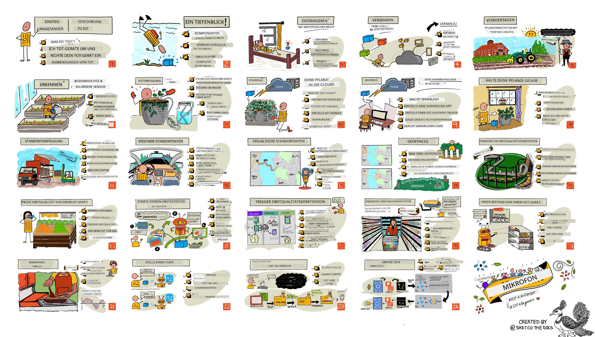

[](https://github.com/microsoft/IoT-For-Beginners/blob/master/LICENSE)
[](https://GitHub.com/microsoft/IoT-For-Beginners/graphs/contributors/)
[](https://GitHub.com/microsoft/IoT-For-Beginners/issues/)
[](https://GitHub.com/microsoft/IoT-For-Beginners/pulls/)
[](http://makeapullrequest.com)

[](https://GitHub.com/microsoft/IoT-For-Beginners/watchers/)
[](https://GitHub.com/microsoft/IoT-For-Beginners/network/)
[](https://GitHub.com/microsoft/IoT-For-Beginners/stargazers/)

### Trete der Azure AI Foundry Community bei

Wenn du stecken bleibst oder Fragen zum Erstellen von KI-Anwendungen hast, trete Gleichgesinnten und erfahrenen Entwicklern in Diskussionen über MCP bei. Es ist eine unterstützende Community, in der Fragen willkommen sind und Wissen frei geteilt wird.

[](https://discord.gg/nTYy5BXMWG)

Wenn du Produktfeedback hast oder Fehler beim Erstellen auftreten, besuche:

[](https://aka.ms/foundry/forum)

Folge diesen Schritten, um mit diesen Ressourcen zu beginnen:
1. **Forke das Repository**: Klicke auf [](https://GitHub.com/microsoft/IoT-For-Beginners/fork)
2. **Klone das Repository**:   `git clone https://github.com/microsoft/IoT-For-Beginners.git`
3. [**Tritt dem Microsoft Foundry Discord bei und triff Experten und andere Entwickler**](https://discord.com/invite/ByRwuEEgH4)


### 🌐 Mehrsprachige Unterstützung

#### Unterstützt über GitHub Action (automatisch & immer aktuell)

<!-- CO-OP TRANSLATOR LANGUAGES TABLE START -->
[Arabisch](../ar/README.md) | [Bengalisch](../bn/README.md) | [Bulgarisch](../bg/README.md) | [Birmanisch (Myanmar)](../my/README.md) | [Chinesisch (Vereinfacht)](../zh-CN/README.md) | [Chinesisch (Traditionell, Hongkong)](../zh-HK/README.md) | [Chinesisch (Traditionell, Macau)](../zh-MO/README.md) | [Chinesisch (Traditionell, Taiwan)](../zh-TW/README.md) | [Kroatisch](../hr/README.md) | [Tschechisch](../cs/README.md) | [Dänisch](../da/README.md) | [Niederländisch](../nl/README.md) | [Estnisch](../et/README.md) | [Finnisch](../fi/README.md) | [Französisch](../fr/README.md) | [Deutsch](./README.md) | [Griechisch](../el/README.md) | [Hebräisch](../he/README.md) | [Hindi](../hi/README.md) | [Ungarisch](../hu/README.md) | [Indonesisch](../id/README.md) | [Italienisch](../it/README.md) | [Japanisch](../ja/README.md) | [Kannada](../kn/README.md) | [Khmer](../km/README.md) | [Koreanisch](../ko/README.md) | [Litauisch](../lt/README.md) | [Malaiisch](../ms/README.md) | [Malayalam](../ml/README.md) | [Marathi](../mr/README.md) | [Nepalesisch](../ne/README.md) | [Nigerianisches Pidgin](../pcm/README.md) | [Norwegisch](../no/README.md) | [Persisch (Farsi)](../fa/README.md) | [Polnisch](../pl/README.md) | [Portugiesisch (Brasilien)](../pt-BR/README.md) | [Portugiesisch (Portugal)](../pt-PT/README.md) | [Punjabi (Gurmukhi)](../pa/README.md) | [Rumänisch](../ro/README.md) | [Russisch](../ru/README.md) | [Serbisch (Kyrillisch)](../sr/README.md) | [Slowakisch](../sk/README.md) | [Slowenisch](../sl/README.md) | [Spanisch](../es/README.md) | [Suaheli](../sw/README.md) | [Schwedisch](../sv/README.md) | [Tagalog (Filipino)](../tl/README.md) | [Tamil](../ta/README.md) | [Telugu](../te/README.md) | [Thailändisch](../th/README.md) | [Türkisch](../tr/README.md) | [Ukrainisch](../uk/README.md) | [Urdu](../ur/README.md) | [Vietnamesisch](../vi/README.md)

> **Bevorzugst du das lokale Klonen?**
>
> Dieses Repository enthält über 50 Sprachübersetzungen, was die Downloadgröße erheblich erhöht. Um ohne Übersetzungen zu klonen, verwende Sparse Checkout:
>
> **Bash / macOS / Linux:**
> ```bash
> git clone --filter=blob:none --sparse https://github.com/microsoft/IoT-For-Beginners.git
> cd IoT-For-Beginners
> git sparse-checkout set --no-cone '/*' '!translations' '!translated_images'
> ```
>
> **CMD (Windows):**
> ```cmd
> git clone --filter=blob:none --sparse https://github.com/microsoft/IoT-For-Beginners.git
> cd IoT-For-Beginners
> git sparse-checkout set --no-cone "/*" "!translations" "!translated_images"
> ```
>
> So erhältst du alles, was du brauchst, um den Kurs abzuschließen, mit einem viel schnelleren Download.
<!-- CO-OP TRANSLATOR LANGUAGES TABLE END -->

# IoT für Anfänger - Ein Lehrplan

Die Azure Cloud Advocates bei Microsoft freuen sich, einen 12-wöchigen Lehrplan mit 24 Lektionen zum Thema IoT-Grundlagen anzubieten. Jede Lektion enthält Vor- und Nachquizze, schriftliche Anweisungen zur Durchführung der Lektion, eine Lösung, eine Hausaufgabe und mehr. Unsere projektbasierte Pädagogik ermöglicht es dir, beim Bauen zu lernen – eine bewährte Methode, damit neue Fähigkeiten „haften bleiben“.

Die Projekte decken die Reise von Lebensmitteln vom Bauernhof bis zum Tisch ab. Dies umfasst Landwirtschaft, Logistik, Fertigung, Einzelhandel und Verbraucher – alles beliebte Branchenbereiche für IoT-Geräte.



> Sketchnote von [Nitya Narasimhan](https://github.com/nitya). Klicke auf das Bild für eine größere Version.

**Herzlichen Dank an unsere Autoren [Jen Fox](https://github.com/jenfoxbot), [Jen Looper](https://github.com/jlooper), [Jim Bennett](https://github.com/jimbobbennett) und unsere Sketchnote-Künstlerin [Nitya Narasimhan](https://github.com/nitya).**

**Vielen Dank auch an unser Team der [Microsoft Learn Student Ambassadors](https://studentambassadors.microsoft.com?WT.mc_id=academic-17441-jabenn), die diesen Lehrplan überprüft und übersetzt haben – [Aditya Garg](https://github.com/AdityaGarg00), [Anurag Sharma](https://github.com/Anurag-0-1-A), [Arpita Das](https://github.com/Arpiiitaaa), [Aryan Jain](https://www.linkedin.com/in/aryan-jain-47a4a1145/), [Bhavesh Suneja](https://github.com/EliteWarrior315), [Faith Hunja](https://faithhunja.github.io/), [Lateefah Bello](https://www.linkedin.com/in/lateefah-bello/), [Manvi Jha](https://github.com/Severus-Matthew), [Mireille Tan](https://www.linkedin.com/in/mireille-tan-a4834819a/), [Mohammad Iftekher (Iftu) Ebne Jalal](https://github.com/Iftu119), [Mohammad Zulfikar](https://github.com/mohzulfikar), [Priyanshu Srivastav](https://www.linkedin.com/in/priyanshu-srivastav-b067241ba), [Thanmai Gowducheruvu](https://github.com/innovation-platform) und [Zina Kamel](https://www.linkedin.com/in/zina-kamel/).**

Treffe das Team!

[](https://youtu.be/-wippUJRi5k)

**Gif von** [Mohit Jaisal](https://linkedin.com/in/mohitjaisal)

> 🎥 Klicke auf das Bild oben für ein Video zum Projekt!

> **Lehrer**, wir haben [einige Vorschläge](for-teachers.md) aufgenommen, wie dieser Lehrplan verwendet werden kann. Wenn du eigene Lektionen erstellen möchtest, haben wir auch eine [Lektionsvorlage](lesson-template/README.md) beigefügt.

> **[Schüler](https://aka.ms/student-page)**, um diesen Lehrplan selbst zu verwenden, forke das gesamte Repository und bearbeite die Übungen eigenständig, beginnend mit einem Vor-Quiz, dann Lektüre der Lektion und Abschluss der restlichen Aktivitäten. Versuche, die Projekte durch Verständnis der Lektionen zu erstellen und nicht nur den Lösungscode zu kopieren; dieser Code ist jedoch in den /solutions-Ordnern jeder projektorientierten Lektion verfügbar. Eine andere Idee ist es, mit Freunden eine Lerngruppe zu bilden und den Inhalt gemeinsam zu durchlaufen. Für weiterführendes Lernen empfehlen wir [Microsoft Learn](https://docs.microsoft.com/users/jimbobbennett/collections/ke2ehd351jopwr?WT.mc_id=academic-17441-jabenn).

Für einen Videoüberblick dieses Kurses schau dir dieses Video an:

[](https://youtube.com/watch?v=bccEMm8gRuc "Promo video")

> 🎥 Klicke auf das Bild oben für ein Video zum Projekt!

## Pädagogik

Wir haben bei der Entwicklung dieses Lehrplans zwei pädagogische Grundsätze gewählt: Sicherstellen, dass er projektbasiert ist und dass häufige Quizze enthalten sind. Am Ende dieser Reihe haben die Schüler ein System zur Pflanzenüberwachung und -bewässerung, einen Fahrzeugtracker, eine intelligente Fabrikumgebung zur Verfolgung und Prüfung von Lebensmitteln sowie einen sprachgesteuerten Küchentimer gebaut und die Grundlagen des Internets der Dinge gelernt, einschließlich Schreiben von Gerätcode, Verbindung mit der Cloud, Analyse von Telemetriedaten und Ausführung von KI am Edge.

Indem sichergestellt wird, dass die Inhalte mit Projekten verknüpft sind, wird der Prozess für die Schüler ansprechender und die Behaltensquote der Konzepte erhöht.

Außerdem setzt ein Quiz mit geringem Druck vor einer Lektion die Lernmotivation der Schüler, während ein zweites Quiz nach der Lektion für weitere Festigung sorgt. Dieser Lehrplan wurde so gestaltet, dass er flexibel und unterhaltsam ist und vollständig oder teilweise absolviert werden kann. Die Projekte starten klein und werden bis zum Ende des 12-wöchigen Zyklus immer komplexer.

Jedes Projekt basiert auf realer Hardware, die Schülern und Bastlern zur Verfügung steht. Jedes Projekt betrachtet den spezifischen Projektbereich und vermittelt relevantes Hintergrundwissen. Um ein erfolgreicher Entwickler zu sein, hilft es, den Bereich zu verstehen, in dem man Probleme löst. Dieses Hintergrundwissen ermöglicht es den Schülern, über ihre IoT-Lösungen und -Lerninhalte im Kontext der realen Probleme nachzudenken, die sie als IoT-Entwickler möglicherweise lösen müssen. Die Schüler lernen das „Warum“ der Lösungen, die sie bauen, und gewinnen Wertschätzung für die Endnutzer.

## Hardware
Wir haben je nach persönlicher Vorliebe, Programmierkenntnissen, Lernzielen und Verfügbarkeit zwei IoT-Hardware-Optionen für die Projekte. Für diejenigen, die keinen Zugang zu Hardware haben oder sich vor einem Kauf weiter informieren möchten, haben wir auch eine „virtuelle Hardware“-Version bereitgestellt. Mehr Informationen und eine „Einkaufsliste“ finden Sie auf der [Hardware-Seite](./hardware.md), einschließlich Links zum Kauf kompletter Kits von unseren Freunden bei Seeed Studio.

> 💁 Finden Sie unseren [Verhaltenskodex](CODE_OF_CONDUCT.md), [Beitragsrichtlinien](CONTRIBUTING.md) und [Übersetzungsrichtlinien](..). Wir freuen uns über Ihr konstruktives Feedback!
>
> 🔧 Probleme? Schauen Sie in unserem [Fehlerbehebungsleitfaden](TROUBLESHOOTING.md) nach Lösungen für häufige Probleme.

## Jede Lektion beinhaltet:

- Sketchnote
- optionale ergänzende Videos
- Aufwärmquiz vor der Lektion
- schriftliche Lektion
- bei projektbasierten Lektionen schrittweise Anleitungen zum Bau des Projekts
- Wissensüberprüfungen
- eine Herausforderung
- ergänzende Lektüre
- Aufgabe
- [Quiz nach der Lektion](https://ff-quizzes.netlify.app/en/)

> **Ein Hinweis zu den Quizzen**: Alle Quizze sind im Quiz-App-Ordner enthalten, insgesamt 48 Quizze mit jeweils drei Fragen. Sie sind aus den Lektionen verlinkt, die Quiz-App kann lokal ausgeführt oder auf Azure bereitgestellt werden; folgen Sie den Anweisungen im `quiz-app`-Ordner. Sie werden nach und nach lokalisiert.

## Lektionen

|       |              Projektname               |                       Vermittelte Konzepte                      | Lernziele                                                                                                                                                          |                                                        Verlinkte Lektion                                                         |
| :---: | :------------------------------------: | :-------------------------------------------------------------: | ------------------------------------------------------------------------------------------------------------------------------------------------------------------ | :--------------------------------------------------------------------------------------------------------------------------: |
|  01   | [Erste Schritte](./1-getting-started/README.md) |                     Einführung in IoT                     | Die Grundprinzipien von IoT und die Basiselemente von IoT-Lösungen wie Sensoren und Cloud-Dienste kennenlernen, während Sie Ihr erstes IoT-Gerät einrichten        |                      [Einführung in IoT](./1-getting-started/lessons/1-introduction-to-iot/README.md)                      |
|  02   | [Erste Schritte](./1-getting-started/README.md) |                   Ein tieferer Einblick in IoT                    | Mehr über die Komponenten eines IoT-Systems sowie Mikrocontroller und Einplatinencomputer erfahren                                                                 |                        [Ein tieferer Einblick in IoT](./1-getting-started/lessons/2-deeper-dive/README.md)                         |
|  03   | [Erste Schritte](./1-getting-started/README.md) | Interaktion mit der physischen Welt durch Sensoren und Aktoren | Lernen, wie man Daten aus der physischen Welt mit Sensoren erfasst und mit Aktoren eine Rückmeldung gibt, während Sie eine Nachtlampe bauen                       | [Interaktion mit der physischen Welt durch Sensoren und Aktoren](./1-getting-started/lessons/3-sensors-and-actuators/README.md) |
|  04   | [Erste Schritte](./1-getting-started/README.md) |             Verbinden Sie Ihr Gerät mit dem Internet             | Lernen, wie Sie ein IoT-Gerät mit dem Internet verbinden, um Nachrichten zu senden und zu empfangen, indem Sie Ihre Nachtlampe mit einem MQTT-Broker verbinden   |               [Verbinden Sie Ihr Gerät mit dem Internet](./1-getting-started/lessons/4-connect-internet/README.md)                |
|  05   |            [Farm](./2-farm/README.md)            |                    Pflanzenwachstum vorhersagen                     | Erfahren, wie man das Pflanzenwachstum anhand von Temperaturdaten eines IoT-Geräts vorhersagt                                                                       |                          [Pflanzenwachstum vorhersagen](./2-farm/lessons/1-predict-plant-growth/README.md)                           |
|  06   |            [Farm](./2-farm/README.md)            |                    Bodennässe erkennen                     | Lernen, wie man den Feuchtigkeitsgehalt des Bodens erkennt und einen Bodenfeuchtesensor kalibriert                                                      |                          [Bodennässe erkennen](./2-farm/lessons/2-detect-soil-moisture/README.md)                           |
|  07   |            [Farm](./2-farm/README.md)            |                  Automatisierte Pflanzenbewässerung                   | Lernen, wie man die Bewässerung mit einem Relais und MQTT automatisiert und zeitlich steuert                                                                       |                      [Automatisierte Pflanzenbewässerung](./2-farm/lessons/3-automated-plant-watering/README.md)                       |
|  08   |            [Farm](./2-farm/README.md)            |               Ihre Pflanze in die Cloud migrieren               | Lernen, was die Cloud und cloudbasierte IoT-Dienste sind und wie Sie Ihre Pflanze anstelle eines öffentlichen MQTT-Brokers mit einem dieser Dienste verbinden       |               [Ihre Pflanze in die Cloud migrieren](./2-farm/lessons/4-migrate-your-plant-to-the-cloud/README.md)                |
|  09   |            [Farm](./2-farm/README.md)            |         Ihre Anwendungslogik in die Cloud migrieren         | Lernen, wie Sie Anwendungslogik in der Cloud schreiben, die auf IoT-Nachrichten reagiert                                                                            |         [Ihre Anwendungslogik in die Cloud migrieren](./2-farm/lessons/5-migrate-application-to-the-cloud/README.md)         |
|  10   |            [Farm](./2-farm/README.md)            |                   Halten Sie Ihre Pflanze sicher                    | Erfahren, wie IoT-Sicherheit funktioniert und wie Sie Ihre Pflanze mit Schlüsseln und Zertifikaten schützen                                                      |                        [Halten Sie Ihre Pflanze sicher](./2-farm/lessons/6-keep-your-plant-secure/README.md)                         |
|  11   |       [Transport](./3-transport/README.md)       |                      Standortverfolgung                      | Lernen, wie GPS-Standortverfolgung für IoT-Geräte funktioniert                                                                                                     |                           [Standortverfolgung](./3-transport/lessons/1-location-tracking/README.md)                           |
|  12   |       [Transport](./3-transport/README.md)       |                     Speicher von Standortdaten                     | Lernen, wie IoT-Daten gespeichert werden, um später visualisiert oder analysiert zu werden                                                                        |                         [Speicher von Standortdaten](./3-transport/lessons/2-store-location-data/README.md)                         |
|  13   |       [Transport](./3-transport/README.md)       |                   Visualisierung von Standortdaten                   | Lernen, wie Standortdaten auf einer Karte visualisiert werden und wie Karten die reale 3D-Welt in 2 Dimensionen abbilden                                         |                     [Visualisierung von Standortdaten](./3-transport/lessons/3-visualize-location-data/README.md)                     |
|  14   |       [Transport](./3-transport/README.md)       |                          Geofences                          | Lernen, was Geofences sind und wie sie verwendet werden, um Warnungen zu geben, wenn Fahrzeuge in der Lieferkette ihrem Zielbereich nahe sind                    |                                   [Geofences](./3-transport/lessons/4-geofences/README.md)                                   |
|  15   |   [Fertigung](./4-manufacturing/README.md)   |               Einen Früchtequalitätsdetektor trainieren                | Lernen, wie man in der Cloud einen Bildklassifikator trainiert, um die Qualität von Früchten zu erkennen                                                         |                 [Einen Früchtequalitätsdetektor trainieren](./4-manufacturing/lessons/1-train-fruit-detector/README.md)                 |
|  16   |   [Fertigung](./4-manufacturing/README.md)   |           Früchtequalität mit einem IoT-Gerät prüfen            | Lernen, wie Sie Ihren Früchtequalitätsdetektor mit einem IoT-Gerät nutzen                                                                                         |           [Früchtequalität mit einem IoT-Gerät prüfen](./4-manufacturing/lessons/2-check-fruit-from-device/README.md)            |
|  17   |   [Fertigung](./4-manufacturing/README.md)   |             Ihren Früchtequalitätsdetektor am Edge ausführen             | Lernen, wie Sie Ihren Früchtequalitätsdetektor auf einem IoT-Gerät am Edge ausführen                                                                              |             [Ihren Früchtequalitätsdetektor am Edge ausführen](./4-manufacturing/lessons/3-run-fruit-detector-edge/README.md)             |
|  18   |   [Fertigung](./4-manufacturing/README.md)   |        Auslösen der Früchtequalitätsdetektion von einem Sensor        | Lernen, wie die Früchtequalitätsdetektion von einem Sensor ausgelöst wird                                                                                         |        [Auslösen der Früchtequalitätsdetektion von einem Sensor](./4-manufacturing/lessons/4-trigger-fruit-detector/README.md)         |
|  19   |          [Einzelhandel](./5-retail/README.md)          |                   Einen Lagerdetektor trainieren                    | Lernen, wie man Objekterkennung einsetzt, um einen Lagerdetektor zum Zählen von Produkten in einem Geschäft zu trainieren                                        |                        [Einen Lagerdetektor trainieren](./5-retail/lessons/1-train-stock-detector/README.md)                         |
|  20   |          [Einzelhandel](./5-retail/README.md)          |               Lagerbestand mit IoT-Gerät prüfen                | Lernen, wie man mit einem IoT-Gerät den Lagerbestand mithilfe eines Objekterkennungsmodells überprüft                                                             |                     [Lagerbestand mit IoT-Gerät prüfen](./5-retail/lessons/2-check-stock-device/README.md)                      |
|  21   |        [Konsumgüter](./6-consumer/README.md)        |             Spracherkennung mit einem IoT-Gerät             | Lernen, wie man Sprache von einem IoT-Gerät erkennt, um einen intelligenten Timer zu bauen                                                                         |                  [Spracherkennung mit einem IoT-Gerät](./6-consumer/lessons/1-speech-recognition/README.md)                  |
|  22   |        [Konsumgüter](./6-consumer/README.md)        |                     Sprache verstehen                     | Lernen, wie man Sprachsätze erkennt, die an ein IoT-Gerät gerichtet sind                                                                                           |                        [Sprache verstehen](./6-consumer/lessons/2-language-understanding/README.md)                        |
|  23   |        [Konsumgüter](./6-consumer/README.md)        |           Timer setzen und gesprochene Rückmeldung geben           | Lernen, wie man einen Timer auf einem IoT-Gerät setzt und gesprochene Rückmeldungen darüber gibt, wann der Timer gesetzt und beendet ist                         |                 [Timer setzen und gesprochene Rückmeldung geben](./6-consumer/lessons/3-spoken-feedback/README.md)                  |
|  24   |        [Konsumgüter](./6-consumer/README.md)        |                 Mehrsprachigkeit unterstützen                  | Lernen, wie man mehrere Sprachen unterstützt – sowohl im Verständnis als auch in den Antworten Ihres intelligenten Timers                                       |                   [Mehrsprachigkeit unterstützen](./6-consumer/lessons/4-multiple-language-support/README.md)                   |

## Offline-Zugriff

Sie können diese Dokumentation offline mit [Docsify](https://docsify.js.org/#/) nutzen. Forken Sie dieses Repository, [installieren Sie Docsify](https://docsify.js.org/#/quickstart) auf Ihrem lokalen Rechner und geben Sie dann im Stammordner dieses Repos `docsify serve` ein. Die Website wird auf Port 3000 auf Ihrem lokalen Rechner bereitgestellt: `localhost:3000`.

## Quiz

Dank der Community gibt es ein interaktives Quiz, das Ihr Wissen zu jedem Kapitel überprüft. Testen Sie Ihr Wissen [hier](https://ff-quizzes.netlify.app/en/)

### PDF

Sie können bei Bedarf eine PDF-Version dieses Inhalts für den Offline-Zugriff erzeugen. Stellen Sie dafür sicher, dass Sie [npm installiert haben](https://docs.npmjs.com/downloading-and-installing-node-js-and-npm) und führen Sie die folgenden Befehle im Stammverzeichnis dieses Repos aus:

```sh
npm i
npm run convert
```

### Folien

Für einige Lektionen gibt es Präsentationsfolien im Ordner [slides](../../slides).


## Weitere Lehrpläne

Unser Team entwickelt weitere Lehrpläne! Schauen Sie sich an:

<!-- CO-OP TRANSLATOR OTHER COURSES START -->
### LangChain
[](https://aka.ms/langchain4j-for-beginners)
[](https://aka.ms/langchainjs-for-beginners?WT.mc_id=m365-94501-dwahlin)
[](https://github.com/microsoft/langchain-for-beginners?WT.mc_id=m365-94501-dwahlin)
---

### Azure / Edge / MCP / Agents
[](https://github.com/microsoft/AZD-for-beginners?WT.mc_id=academic-105485-koreyst)
[](https://github.com/microsoft/edgeai-for-beginners?WT.mc_id=academic-105485-koreyst)
[](https://github.com/microsoft/mcp-for-beginners?WT.mc_id=academic-105485-koreyst)
[](https://github.com/microsoft/ai-agents-for-beginners?WT.mc_id=academic-105485-koreyst)

---
 
### Generative KI-Serie
[](https://github.com/microsoft/generative-ai-for-beginners?WT.mc_id=academic-105485-koreyst)
[-9333EA?style=for-the-badge&labelColor=E5E7EB&color=9333EA)](https://github.com/microsoft/Generative-AI-for-beginners-dotnet?WT.mc_id=academic-105485-koreyst)
[-C084FC?style=for-the-badge&labelColor=E5E7EB&color=C084FC)](https://github.com/microsoft/generative-ai-for-beginners-java?WT.mc_id=academic-105485-koreyst)
[-E879F9?style=for-the-badge&labelColor=E5E7EB&color=E879F9)](https://github.com/microsoft/generative-ai-with-javascript?WT.mc_id=academic-105485-koreyst)

---
 
### Kernlernen
[](https://aka.ms/ml-beginners?WT.mc_id=academic-105485-koreyst)
[](https://aka.ms/datascience-beginners?WT.mc_id=academic-105485-koreyst)
[](https://aka.ms/ai-beginners?WT.mc_id=academic-105485-koreyst)
[](https://github.com/microsoft/Security-101?WT.mc_id=academic-96948-sayoung)
[](https://aka.ms/webdev-beginners?WT.mc_id=academic-105485-koreyst)
[](https://aka.ms/iot-beginners?WT.mc_id=academic-105485-koreyst)
[](https://github.com/microsoft/xr-development-for-beginners?WT.mc_id=academic-105485-koreyst)

---
 
### Copilot-Serie
[](https://aka.ms/GitHubCopilotAI?WT.mc_id=academic-105485-koreyst)
[](https://github.com/microsoft/mastering-github-copilot-for-dotnet-csharp-developers?WT.mc_id=academic-105485-koreyst)
[](https://github.com/microsoft/CopilotAdventures?WT.mc_id=academic-105485-koreyst)
<!-- CO-OP TRANSLATOR OTHER COURSES END -->

## Bildnachweise

Sie finden alle Bildnachweise für die in diesem Lehrplan verwendeten Bilder, soweit erforderlich, in den [Bildnachweisen](./attributions.md).

---

<!-- CO-OP TRANSLATOR DISCLAIMER START -->
**Haftungsausschluss**:  
Dieses Dokument wurde mit dem KI-Übersetzungsdienst [Co-op Translator](https://github.com/Azure/co-op-translator) übersetzt. Obwohl wir auf Genauigkeit achten, beachten Sie bitte, dass automatisierte Übersetzungen Fehler oder Ungenauigkeiten enthalten können. Das Originaldokument in seiner ursprünglichen Sprache ist als maßgebliche Quelle zu betrachten. Für wichtige Informationen wird eine professionelle menschliche Übersetzung empfohlen. Wir übernehmen keine Haftung für Missverständnisse oder Fehlinterpretationen, die durch die Verwendung dieser Übersetzung entstehen.
<!-- CO-OP TRANSLATOR DISCLAIMER END -->