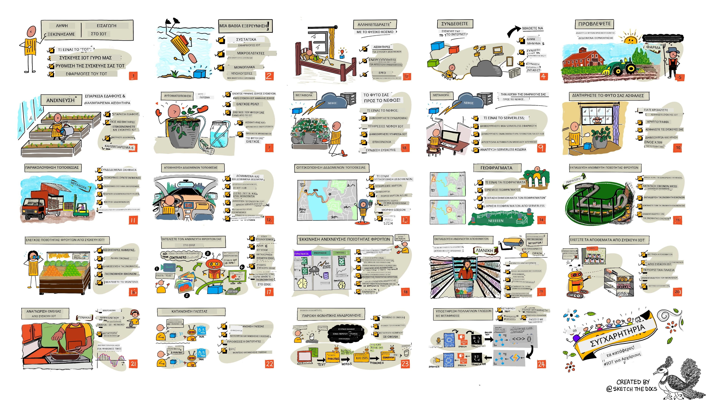

<!--
CO_OP_TRANSLATOR_METADATA:
{
  "original_hash": "6c354ec3487e4f6cfafbe44557996cd9",
  "translation_date": "2026-01-06T06:20:51+00:00",
  "source_file": "README.md",
  "language_code": "el"
}
-->
[](https://github.com/microsoft/IoT-For-Beginners/blob/master/LICENSE)
[](https://GitHub.com/microsoft/IoT-For-Beginners/graphs/contributors/)
[](https://GitHub.com/microsoft/IoT-For-Beginners/issues/)
[](https://GitHub.com/microsoft/IoT-For-Beginners/pulls/)
[](http://makeapullrequest.com)

[](https://GitHub.com/microsoft/IoT-For-Beginners/watchers/)
[](https://GitHub.com/microsoft/IoT-For-Beginners/network/)
[](https://GitHub.com/microsoft/IoT-For-Beginners/stargazers/)

### Ενταχθείτε στην Κοινότητα Azure AI Foundry 

Αν κολλήσετε ή έχετε οποιεσδήποτε ερωτήσεις σχετικά με την κατασκευή εφαρμογών AI. Ενταχθείτε με άλλους μαθητές και έμπειρους προγραμματιστές σε συζητήσεις για το MCP. Είναι μια υποστηρικτική κοινότητα όπου οι ερωτήσεις είναι ευπρόσδεκτες και η γνώση μοιράζεται ελεύθερα.

[](https://discord.gg/nTYy5BXMWG)

Εάν έχετε σχόλια για το προϊόν ή λάθη κατά την κατασκευή επισκεφτείτε:

[](https://aka.ms/foundry/forum)

Ακολουθήστε τα βήματα για να ξεκινήσετε χρησιμοποιώντας αυτούς τους πόρους:
1. **Δημιουργήστε Fork το Αποθετήριο**: Κάντε κλικ στο [](https://GitHub.com/microsoft/IoT-For-Beginners/fork)
2. **Κλωνοποιήστε το Αποθετήριο**:   `git clone https://github.com/microsoft/IoT-For-Beginners.git`
3. [**Ενταχθείτε στον Discord του Microsot Foundry και συναντήστε ειδικούς και άλλους προγραμματιστές**](https://discord.com/invite/ByRwuEEgH4)


### 🌐 Υποστήριξη Πολλαπλών Γλωσσών

#### Υποστηρίζεται μέσω GitHub Action (Αυτοματοποιημένο & Πάντα Ενημερωμένο)

<!-- CO-OP TRANSLATOR LANGUAGES TABLE START -->
[Arabic](../ar/README.md) | [Bengali](../bn/README.md) | [Bulgarian](../bg/README.md) | [Burmese (Myanmar)](../my/README.md) | [Chinese (Simplified)](../zh/README.md) | [Chinese (Traditional, Hong Kong)](../hk/README.md) | [Chinese (Traditional, Macau)](../mo/README.md) | [Chinese (Traditional, Taiwan)](../tw/README.md) | [Croatian](../hr/README.md) | [Czech](../cs/README.md) | [Danish](../da/README.md) | [Dutch](../nl/README.md) | [Estonian](../et/README.md) | [Finnish](../fi/README.md) | [French](../fr/README.md) | [German](../de/README.md) | [Greek](./README.md) | [Hebrew](../he/README.md) | [Hindi](../hi/README.md) | [Hungarian](../hu/README.md) | [Indonesian](../id/README.md) | [Italian](../it/README.md) | [Japanese](../ja/README.md) | [Kannada](../kn/README.md) | [Korean](../ko/README.md) | [Lithuanian](../lt/README.md) | [Malay](../ms/README.md) | [Malayalam](../ml/README.md) | [Marathi](../mr/README.md) | [Nepali](../ne/README.md) | [Nigerian Pidgin](../pcm/README.md) | [Norwegian](../no/README.md) | [Persian (Farsi)](../fa/README.md) | [Polish](../pl/README.md) | [Portuguese (Brazil)](../br/README.md) | [Portuguese (Portugal)](../pt/README.md) | [Punjabi (Gurmukhi)](../pa/README.md) | [Romanian](../ro/README.md) | [Russian](../ru/README.md) | [Serbian (Cyrillic)](../sr/README.md) | [Slovak](../sk/README.md) | [Slovenian](../sl/README.md) | [Spanish](../es/README.md) | [Swahili](../sw/README.md) | [Swedish](../sv/README.md) | [Tagalog (Filipino)](../tl/README.md) | [Tamil](../ta/README.md) | [Telugu](../te/README.md) | [Thai](../th/README.md) | [Turkish](../tr/README.md) | [Ukrainian](../uk/README.md) | [Urdu](../ur/README.md) | [Vietnamese](../vi/README.md)

> **Προτιμάτε να Κλωνοποιήσετε τοπικά;**

> Αυτό το αποθετήριο περιλαμβάνει περισσότερες από 50 μεταφράσεις γλωσσών που αυξάνουν σημαντικά το μέγεθος λήψης. Για να κάνετε κλωνοποίηση χωρίς μεταφράσεις, χρησιμοποιήστε sparse checkout:
> ```bash
> git clone --filter=blob:none --sparse https://github.com/microsoft/IoT-For-Beginners.git
> cd IoT-For-Beginners
> git sparse-checkout set --no-cone '/*' '!translations' '!translated_images'
> ```
> Αυτό σας δίνει όλα όσα χρειάζεστε για να ολοκληρώσετε το μάθημα με πολύ πιο γρήγορη λήψη.
<!-- CO-OP TRANSLATOR LANGUAGES TABLE END -->

# IoT για Αρχάριους - Ένα Αναλυτικό Πρόγραμμα

Οι Υποστηρικτές Cloud Azure στη Microsoft είναι στην ευχάριστη θέση να προσφέρουν ένα 12-εβδομαδιαίο, 24-μαθημάτων αναλυτικό πρόγραμμα που αφορά τα βασικά του IoT. Κάθε μάθημα περιλαμβάνει προ- και μετά-μάθημα κουίζ, γραπτές οδηγίες για την ολοκλήρωση του μαθήματος, μια λύση, μια άσκηση και περισσότερα. Η παιδαγωγική μας που βασίζεται σε έργα σας επιτρέπει να μαθαίνετε ενώ χτίζετε, έναν αποδεδειγμένο τρόπο για να "εγκαθίστανται" οι νέες δεξιότητες.

Τα έργα καλύπτουν το ταξίδι του φαγητού από το αγρόκτημα στο τραπέζι. Αυτό περιλαμβάνει τη γεωργία, τη λογιστική, την κατασκευή, το λιανικό εμπόριο και τον καταναλωτή - όλοι δημοφιλείς τομείς της βιομηχανίας για συσκευές IoT.



> Σχεδιογράφημα από την [Nitya Narasimhan](https://github.com/nitya). Κάντε κλικ στην εικόνα για μια μεγαλύτερη έκδοση.

**Ειλικρινείς ευχαριστίες στους συγγραφείς μας [Jen Fox](https://github.com/jenfoxbot), [Jen Looper](https://github.com/jlooper), [Jim Bennett](https://github.com/jimbobbennett), και την καλλιτέχνη σχεδιαγραμμάτων μας [Nitya Narasimhan](https://github.com/nitya).**

**Ευχαριστούμε επίσης την ομάδα μας από [Microsoft Learn Student Ambassadors](https://studentambassadors.microsoft.com?WT.mc_id=academic-17441-jabenn) που έχουν αναθεωρήσει και μεταφράσει αυτό το πρόγραμμα - [Aditya Garg](https://github.com/AdityaGarg00), [Anurag Sharma](https://github.com/Anurag-0-1-A), [Arpita Das](https://github.com/Arpiiitaaa), [Aryan Jain](https://www.linkedin.com/in/aryan-jain-47a4a1145/), [Bhavesh Suneja](https://github.com/EliteWarrior315), [Faith Hunja](https://faithhunja.github.io/), [Lateefah Bello](https://www.linkedin.com/in/lateefah-bello/), [Manvi Jha](https://github.com/Severus-Matthew), [Mireille Tan](https://www.linkedin.com/in/mireille-tan-a4834819a/), [Mohammad Iftekher (Iftu) Ebne Jalal](https://github.com/Iftu119), [Mohammad Zulfikar](https://github.com/mohzulfikar), [Priyanshu Srivastav](https://www.linkedin.com/in/priyanshu-srivastav-b067241ba), [Thanmai Gowducheruvu](https://github.com/innovation-platform), και [Zina Kamel](https://www.linkedin.com/in/zina-kamel/).**

Γνωρίστε την ομάδα!

[](https://youtu.be/-wippUJRi5k)

**Gif από** [Mohit Jaisal](https://linkedin.com/in/mohitjaisal)

> 🎥 Κάντε κλικ στην παραπάνω εικόνα για ένα βίντεο σχετικά με το έργο!

> **Καθηγητές**, έχουμε [συμπεριλάβει μερικές προτάσεις](for-teachers.md) για το πώς να χρησιμοποιήσετε αυτό το πρόγραμμα. Αν θέλετε να δημιουργήσετε τα δικά σας μαθήματα, έχουμε επίσης συμπεριλάβει ένα [πρότυπο μαθήματος](lesson-template/README.md).

> **[Φοιτητές](https://aka.ms/student-page)**, για να χρησιμοποιήσετε αυτό το πρόγραμμα μόνοι σας, κάντε fork ολόκληρο το αποθετήριο και ολοκληρώστε τις ασκήσεις μόνοι σας, ξεκινώντας με ένα προ-διάλεξης κουίζ, στη συνέχεια διαβάζοντας το μάθημα και ολοκληρώνοντας τις υπόλοιπες δραστηριότητες. Προσπαθήστε να δημιουργήσετε τα έργα κατανοώντας τα μαθήματα αντί να αντιγράφετε τον κώδικα λύσης· ωστόσο, ο κώδικας αυτός είναι διαθέσιμος στους φακέλους /solutions σε κάθε μάθημα προσανατολισμένο σε έργο. Μια άλλη ιδέα είναι να σχηματίσετε μια ομάδα μελέτης με φίλους και να περάσετε το περιεχόμενο μαζί. Για περαιτέρω μελέτη, προτείνουμε το [Microsoft Learn](https://docs.microsoft.com/users/jimbobbennett/collections/ke2ehd351jopwr?WT.mc_id=academic-17441-jabenn).

Για μια επισκόπηση βίντεο αυτού του μαθήματος, δείτε αυτό το βίντεο:

[](https://youtube.com/watch?v=bccEMm8gRuc "Promo video")

> 🎥 Κάντε κλικ στην παραπάνω εικόνα για ένα βίντεο σχετικά με το έργο!

## Παιδαγωγική

Έχουμε επιλέξει δύο παιδαγωγικές αρχές κατά την κατασκευή αυτού του προγράμματος: να είναι βασισμένο σε έργα και να περιλαμβάνει συχνά κουίζ. Μέχρι το τέλος αυτής της σειράς, οι φοιτητές θα έχουν κατασκευάσει ένα σύστημα παρακολούθησης και ποτίσματος φυτών, έναν ιχνηλάτη οχήματος, μια έξυπνη εργοστασιακή εγκατάσταση για την παρακολούθηση και έλεγχο τροφίμων, και έναν χρονόμετρο μαγειρέματος με φωνητικό έλεγχο, και θα έχουν μάθει τα βασικά του Διαδικτύου των Πραγμάτων, συμπεριλαμβανομένου του πώς να γράφουν κώδικα συσκευής, να συνδέονται στο cloud, να αναλύουν τηλεμετρία και να τρέχουν AI στην άκρη.

Εξασφαλίζοντας ότι το περιεχόμενο ευθυγραμμίζεται με τα έργα, η διαδικασία γίνεται πιο ελκυστική για τους φοιτητές και η διατήρηση των εννοιών αυξάνεται.

Επιπλέον, ένα κουίζ χαμηλού κινδύνου πριν από την τάξη θέτει την πρόθεση του φοιτητή προς την εκμάθηση ενός θέματος, ενώ ένα δεύτερο κουίζ μετά την τάξη εξασφαλίζει περαιτέρω διατήρηση. Αυτό το πρόγραμμα σχεδιάστηκε να είναι ευέλικτο και ευχάριστο και μπορεί να ακολουθηθεί ολόκληρο ή τμηματικά. Τα έργα ξεκινούν μικρά και γίνονται ολοένα και πιο περίπλοκα στο τέλος του 12-εβδομαδιαίου κύκλου.

Κάθε έργο βασίζεται σε πραγματικό υλικό διαθέσιμο σε φοιτητές και ερασιτέχνες. Κάθε έργο εξετάζει τον συγκεκριμένο τομέα έργου, παρέχοντας σχετικές γνώσεις υποβάθρου. Για να είναι κάποιος επιτυχημένος προγραμματιστής, βοηθά να κατανοεί τον τομέα στον οποίο επιλύει προβλήματα, παρέχοντας αυτή τη γνώση υποβάθρου επιτρέπει στους φοιτητές να σκέφτονται τις λύσεις και τα μαθήματά τους στο πλαίσιο του είδους του πραγματικού προβλήματος που μπορεί να τους ζητηθεί να λύσουν ως προγραμματιστές IoT. Οι φοιτητές μαθαίνουν το «γιατί» των λύσεων που κατασκευάζουν, και αποκτούν εκτίμηση για τον τελικό χρήστη.

## Υλικό

Έχουμε δύο επιλογές υλικού IoT για τα έργα ανάλογα με τις προσωπικές προτιμήσεις, τη γνώση ή τις προτιμήσεις γλώσσας προγραμματισμού, τους στόχους εκμάθησης και τη διαθεσιμότητα. Έχουμε επίσης παράσχει μια έκδοση «εικονικού υλικού» για όσους δεν έχουν πρόσβαση σε υλικό ή θέλουν να μάθουν περισσότερα πριν δεσμευτούν σε αγορά. Μπορείτε να διαβάσετε περισσότερα και να βρείτε μια «λίστα αγορών» στη [σελίδα υλικού](./hardware.md), συμπεριλαμβανομένων συνδέσμων για αγορά ολοκληρωμένων κιτ από τους φίλους μας στο Seeed Studio.
> 💁 Βρείτε τον [Κώδικα Δεοντολογίας](CODE_OF_CONDUCT.md), τις οδηγίες [Συμβολής](CONTRIBUTING.md) και [Μετάφρασης](TRANSLATIONS.md). Καλωσορίζουμε τα εποικοδομητικά σας σχόλια!
>
> 🔧 Αν αντιμετωπίζετε προβλήματα, δείτε τον [Οδηγό Αντιμετώπισης Προβλημάτων](TROUBLESHOOTING.md) για λύσεις σε κοινά ζητήματα.

## Κάθε μάθημα περιλαμβάνει:

- σκέτς
- προαιρετικό συμπληρωματικό βίντεο
- προ-μάθημα ζέσταμα κουίζ
- γραπτό μάθημα
- για μαθήματα που βασίζονται σε έργα, οδηγίες βήμα προς βήμα για το πώς να δημιουργήσετε το έργο
- έλεγχοι γνώσεων
- μια πρόκληση
- συμπληρωματική ανάγνωση
- εργασία
- [μετα-μάθημα κουίζ](https://ff-quizzes.netlify.app/en/)

> **Σημείωση για τα κουίζ**: Όλα τα κουίζ περιέχονται στον φάκελο quiz-app, με συνολικά 48 κουίζ των τριών ερωτήσεων το καθένα. Συνδέονται μέσα από τα μαθήματα, αλλά η εφαρμογή κουίζ μπορεί να τρέξει τοπικά ή να αναπτυχθεί στο Azure∙ ακολουθήστε τις οδηγίες στον φάκελο `quiz-app`. Σταδιακά μεταφράζονται.

## Μαθήματα

|       |              Όνομα Έργου              |                       Έννοιες που Διδάσκονται                       | Εκπαιδευτικοί Στόχοι                                                                                                                                                 |                                                        Συνδεδεμένο Μάθημα                                                         |
| :---: | :------------------------------------: | :---------------------------------------------------------: | ------------------------------------------------------------------------------------------------------------------------------------------------------------------- | :--------------------------------------------------------------------------------------------------------------------------: |
|  01   | [Ξεκινώντας](./1-getting-started/README.md) |                     Εισαγωγή στο IoT                     | Μάθετε τις βασικές αρχές του IoT και τα βασικά δομικά στοιχεία λύσεων IoT όπως αισθητήρες και υπηρεσίες cloud ενώ ρυθμίζετε την πρώτη σας συσκευή IoT |                      [Εισαγωγή στο IoT](./1-getting-started/lessons/1-introduction-to-iot/README.md)                      |
|  02   | [Ξεκινώντας](./1-getting-started/README.md) |                   Βαθύτερη εμβάθυνση στο IoT                    | Μάθετε περισσότερα για τα συστατικά μέρη ενός συστήματος IoT, καθώς και για μικροελεγκτές και μονάδες υπολογιστών με μια πλακέτα                                                            |                        [Βαθύτερη εμβάθυνση στο IoT](./1-getting-started/lessons/2-deeper-dive/README.md)                         |
|  03   | [Ξεκινώντας](./1-getting-started/README.md) | Αλληλεπίδραση με τον φυσικό κόσμο μέσω αισθητήρων και ενεργοποιητών | Μάθετε για τους αισθητήρες για τη συλλογή δεδομένων από τον φυσικό κόσμο, και τους ενεργοποιητές για αποστολή ανατροφοδότησης, ενώ κατασκευάζετε μια νυχτερινή λάμπα                                           | [Αλληλεπίδραση με τον φυσικό κόσμο μέσω αισθητήρων και ενεργοποιητών](./1-getting-started/lessons/3-sensors-and-actuators/README.md) |
|  04   | [Ξεκινώντας](./1-getting-started/README.md) |             Συνδέστε τη συσκευή σας στο Διαδίκτυο             | Μάθετε πώς να συνδέετε μια συσκευή IoT στο Διαδίκτυο για να στέλνετε και να λαμβάνετε μηνύματα συνδέοντας τη νυχτερινή λάμπα σε έναν MQTT broker                               |               [Συνδέστε τη συσκευή σας στο Διαδίκτυο](./1-getting-started/lessons/4-connect-internet/README.md)                |
|  05   |            [Φάρμα](./2-farm/README.md)            |                    Πρόβλεψη ανάπτυξης φυτών                     | Μάθετε πώς να προβλέπετε την ανάπτυξη φυτών χρησιμοποιώντας δεδομένα θερμοκρασίας που συλλέγονται από μια συσκευή IoT                                                                                  |                          [Πρόβλεψη ανάπτυξης φυτών](./2-farm/lessons/1-predict-plant-growth/README.md)                           |
|  06   |            [Φάρμα](./2-farm/README.md)            |                    Ανίχνευση υγρασίας εδάφους                     | Μάθετε πώς να ανιχνεύετε την υγρασία του εδάφους και να βαθμονομήσετε έναν αισθητήρα υγρασίας εδάφους                                                                                              |                          [Ανίχνευση υγρασίας εδάφους](./2-farm/lessons/2-detect-soil-moisture/README.md)                           |
|  07   |            [Φάρμα](./2-farm/README.md)            |                  Αυτόματο πότισμα φυτών                   | Μάθετε πώς να αυτοματοποιείτε και να προγραμματίζετε το πότισμα χρησιμοποιώντας ένα ρελέ και MQTT                                                                                                      |                      [Αυτόματο πότισμα φυτών](./2-farm/lessons/3-automated-plant-watering/README.md)                       |
|  08   |            [Φάρμα](./2-farm/README.md)            |               Μετακίνηση του φυτού σας στο cloud               | Μάθετε για το cloud και τις υπηρεσίες IoT που φιλοξενούνται στο cloud, και πώς να συνδέετε το φυτό σας σε μία από αυτές αντί για δημόσιο MQTT broker                                   |               [Μετακίνηση του φυτού σας στο cloud](./2-farm/lessons/4-migrate-your-plant-to-the-cloud/README.md)                |
|  09   |            [Φάρμα](./2-farm/README.md)            |         Μεταφορά της λογικής της εφαρμογής σας στο cloud         | Μάθετε πώς μπορείτε να γράψετε λογική εφαρμογής στο cloud που ανταποκρίνεται σε μηνύματα IoT                                                                          |         [Μεταφορά της λογικής της εφαρμογής σας στο cloud](./2-farm/lessons/5-migrate-application-to-the-cloud/README.md)         |
|  10   |            [Φάρμα](./2-farm/README.md)            |                   Κρατήστε το φυτό σας ασφαλές                    | Μάθετε για την ασφάλεια με το IoT και πώς να κρατάτε το φυτό σας ασφαλές με κλειδιά και πιστοποιητικά                                                                          |                        [Κρατήστε το φυτό σας ασφαλές](./2-farm/lessons/6-keep-your-plant-secure/README.md)                         |
|  11   |       [Μεταφορές](./3-transport/README.md)       |                      Παρακολούθηση θέσης                      | Μάθετε για την παρακολούθηση θέσης μέσω GPS για συσκευές IoT                                                                                                                   |                           [Παρακολούθηση θέσης](./3-transport/lessons/1-location-tracking/README.md)                           |
|  12   |       [Μεταφορές](./3-transport/README.md)       |                     Αποθήκευση δεδομένων τοποθεσίας                     | Μάθετε πώς να αποθηκεύετε δεδομένα IoT για να απεικονιστούν ή να αναλυθούν αργότερα                                                                                                      |                         [Αποθήκευση δεδομένων τοποθεσίας](./3-transport/lessons/2-store-location-data/README.md)                         |
|  13   |       [Μεταφορές](./3-transport/README.md)       |                   Οπτικοποίηση δεδομένων τοποθεσίας                   | Μάθετε για την οπτικοποίηση δεδομένων τοποθεσίας σε χάρτη, και πώς οι χάρτες αναπαριστούν τον πραγματικό τρισδιάστατο κόσμο σε 2 διαστάσεις                                                            |                     [Οπτικοποίηση δεδομένων τοποθεσίας](./3-transport/lessons/3-visualize-location-data/README.md)                     |
|  14   |       [Μεταφορές](./3-transport/README.md)       |                          Γεωφράγματα                          | Μάθετε για τα γεωφράγματα, και πώς μπορούν να χρησιμοποιηθούν για ειδοποίηση όταν οχήματα στην εφοδιαστική αλυσίδα βρίσκονται κοντά στον προορισμό τους                                           |                                   [Γεωφράγματα](./3-transport/lessons/4-geofences/README.md)                                   |
|  15   |   [Κατασκευή](./4-manufacturing/README.md)   |               Εκπαίδευση ανιχνευτή ποιότητας φρούτων                | Μάθετε πώς να εκπαιδεύσετε έναν ταξινομητή εικόνων στο cloud για να ανιχνεύει την ποιότητα των φρούτων                                                                                       |                 [Εκπαίδευση ανιχνευτή ποιότητας φρούτων](./4-manufacturing/lessons/1-train-fruit-detector/README.md)                 |
|  16   |   [Κατασκευή](./4-manufacturing/README.md)   |           Έλεγχος ποιότητας φρούτων από συσκευή IoT            | Μάθετε πώς να χρησιμοποιείτε τον ανιχνευτή ποιότητας φρούτων από μια συσκευή IoT                                                                                                    |           [Έλεγχος ποιότητας φρούτων από συσκευή IoT](./4-manufacturing/lessons/2-check-fruit-from-device/README.md)            |
|  17   |   [Κατασκευή](./4-manufacturing/README.md)   |             Λειτουργία του ανιχνευτή φρούτων στην άκρη             | Μάθετε πώς να τρέχετε τον ανιχνευτή φρούτων σε μια συσκευή IoT στην άκρη                                                                                                |             [Λειτουργία του ανιχνευτή φρούτων στην άκρη](./4-manufacturing/lessons/3-run-fruit-detector-edge/README.md)             |
|  18   |   [Κατασκευή](./4-manufacturing/README.md)   |        Εκκίνηση ανίχνευσης ποιότητας φρούτων από αισθητήρα        | Μάθετε για την εκκίνηση ανίχνευσης ποιότητας φρούτων από έναν αισθητήρα                                                                                                        |        [Εκκίνηση ανίχνευσης ποιότητας φρούτων από αισθητήρα](./4-manufacturing/lessons/4-trigger-fruit-detector/README.md)         |
|  19   |          [Λιανική](./5-retail/README.md)          |                   Εκπαίδευση ανιχνευτή αποθεμάτων                    | Μάθετε πώς να χρησιμοποιείτε την ανίχνευση αντικειμένων για εκπαίδευση ανιχνευτή αποθεμάτων για την καταμέτρηση αποθεμάτων σε ένα κατάστημα                                                                                |                        [Εκπαίδευση ανιχνευτή αποθεμάτων](./5-retail/lessons/1-train-stock-detector/README.md)                         |
|  20   |          [Λιανική](./5-retail/README.md)          |               Έλεγχος αποθεμάτων από συσκευή IoT                | Μάθετε πώς να ελέγχετε τα αποθέματα από μια συσκευή IoT χρησιμοποιώντας μοντέλο ανίχνευσης αντικειμένων                                                                                         |                     [Έλεγχος αποθεμάτων από συσκευή IoT](./5-retail/lessons/2-check-stock-device/README.md)                      |
|  21   |        [Καταναλωτής](./6-consumer/README.md)        |             Αναγνώριση ομιλίας με συσκευή IoT             | Μάθετε πώς να αναγνωρίζετε ομιλία από μια συσκευή IoT για να δημιουργήσετε έναν έξυπνο χρονοδιακόπτη                                                                                             |                  [Αναγνώριση ομιλίας με συσκευή IoT](./6-consumer/lessons/1-speech-recognition/README.md)                  |
|  22   |        [Καταναλωτής](./6-consumer/README.md)        |                     Κατανόηση γλώσσας                     | Μάθετε πώς να κατανοείτε προτάσεις που απευθύνονται σε μια συσκευή IoT                                                                                                           |                        [Κατανόηση γλώσσας](./6-consumer/lessons/2-language-understanding/README.md)                        |
|  23   |        [Καταναλωτής](./6-consumer/README.md)        |           Ορισμός χρονοδιακόπτη και παροχή προφορικής ανατροφοδότησης           | Μάθετε πώς να ορίζετε έναν χρονοδιακόπτη σε μια συσκευή IoT και να παρέχετε προφορική ανατροφοδότηση για το πότε ο χρονοδιακόπτης έχει τεθεί και πότε τελειώνει                                                    |                 [Ορισμός χρονοδιακόπτη και παροχή προφορικής ανατροφοδότησης](./6-consumer/lessons/3-spoken-feedback/README.md)                  |
|  24   |        [Καταναλωτής](./6-consumer/README.md)        |                 Υποστήριξη πολλαπλών γλωσσών                  | Μάθετε πώς να υποστηρίζετε πολλαπλές γλώσσες, τόσο κατά την ομιλία προς τη συσκευή όσο και στις απαντήσεις από τον έξυπνο χρονοδιακόπτη                                                               |                   [Υποστήριξη πολλαπλών γλωσσών](./6-consumer/lessons/4-multiple-language-support/README.md)                   |

## Πρόσβαση εκτός σύνδεσης

Μπορείτε να τρέξετε αυτή την τεκμηρίωση εκτός σύνδεσης χρησιμοποιώντας το [Docsify](https://docsify.js.org/#/). Φορκάρετε αυτό το αποθετήριο, [εγκαταστήστε το Docsify](https://docsify.js.org/#/quickstart) στον τοπικό σας υπολογιστή και στη συνέχεια, στον ριζικό φάκελο αυτού του αποθετηρίου, πληκτρολογήστε `docsify serve`. Η ιστοσελίδα θα σερβιριστεί στην θύρα 3000 στον localhost σας: `localhost:3000`.

## Κουίζ

Ευχαριστούμε την κοινότητα για τη φιλοξενία του διαδραστικού κουίζ που ελέγχει τις γνώσεις σας για κάθε κεφάλαιο. Μπορείτε να ελέγξετε τις γνώσεις σας [εδώ](https://ff-quizzes.netlify.app/en/) 

### PDF

Μπορείτε να δημιουργήσετε ένα PDF αυτού του περιεχομένου για πρόσβαση εκτός σύνδεσης αν χρειαστεί. Για να το κάνετε αυτό, βεβαιωθείτε ότι έχετε [εγκαταστήσει το npm](https://docs.npmjs.com/downloading-and-installing-node-js-and-npm) και τρέξτε τις ακόλουθες εντολές στον ριζικό φάκελο αυτού του αποθετηρίου:

```sh
npm i
npm run convert
```

### Διαφάνειες

Υπάρχουν διαφάνειες για μερικά από τα μαθήματα στον φάκελο [slides](../../slides).


## Άλλα Προγράμματα Σπουδών

Η ομάδα μας παράγει και άλλα προγράμματα σπουδών! Δείτε:

<!-- CO-OP TRANSLATOR OTHER COURSES START -->
### LangChain
[](https://aka.ms/langchain4j-for-beginners)
[](https://aka.ms/langchainjs-for-beginners?WT.mc_id=m365-94501-dwahlin)

---

### Azure / Edge / MCP / Agents
[](https://github.com/microsoft/AZD-for-beginners?WT.mc_id=academic-105485-koreyst)
[](https://github.com/microsoft/edgeai-for-beginners?WT.mc_id=academic-105485-koreyst)
[](https://github.com/microsoft/mcp-for-beginners?WT.mc_id=academic-105485-koreyst)
[](https://github.com/microsoft/ai-agents-for-beginners?WT.mc_id=academic-105485-koreyst)

---
 
### Σειρά Γενετικής Τεχνητής Νοημοσύνης
[](https://github.com/microsoft/generative-ai-for-beginners?WT.mc_id=academic-105485-koreyst)
[-9333EA?style=for-the-badge&labelColor=E5E7EB&color=9333EA)](https://github.com/microsoft/Generative-AI-for-beginners-dotnet?WT.mc_id=academic-105485-koreyst)
[-C084FC?style=for-the-badge&labelColor=E5E7EB&color=C084FC)](https://github.com/microsoft/generative-ai-for-beginners-java?WT.mc_id=academic-105485-koreyst)
[-E879F9?style=for-the-badge&labelColor=E5E7EB&color=E879F9)](https://github.com/microsoft/generative-ai-with-javascript?WT.mc_id=academic-105485-koreyst)

---
 
### Βασική Μάθηση
[](https://aka.ms/ml-beginners?WT.mc_id=academic-105485-koreyst)
[](https://aka.ms/datascience-beginners?WT.mc_id=academic-105485-koreyst)
[](https://aka.ms/ai-beginners?WT.mc_id=academic-105485-koreyst)
[](https://github.com/microsoft/Security-101?WT.mc_id=academic-96948-sayoung)
[](https://aka.ms/webdev-beginners?WT.mc_id=academic-105485-koreyst)
[](https://aka.ms/iot-beginners?WT.mc_id=academic-105485-koreyst)
[](https://github.com/microsoft/xr-development-for-beginners?WT.mc_id=academic-105485-koreyst)

---
 
### Σειρά Copilot
[](https://aka.ms/GitHubCopilotAI?WT.mc_id=academic-105485-koreyst)
[](https://github.com/microsoft/mastering-github-copilot-for-dotnet-csharp-developers?WT.mc_id=academic-105485-koreyst)
[](https://github.com/microsoft/CopilotAdventures?WT.mc_id=academic-105485-koreyst)
<!-- CO-OP TRANSLATOR OTHER COURSES END -->

## Αναφορές εικόνων

Μπορείτε να βρείτε όλες τις αναφορές για τις εικόνες που χρησιμοποιούνται σε αυτό το πρόγραμμα όπου απαιτείται στα [Attributions](./attributions.md).

---

<!-- CO-OP TRANSLATOR DISCLAIMER START -->
**Αποποίηση ευθυνών**:  
Αυτό το έγγραφο έχει μεταφραστεί χρησιμοποιώντας την υπηρεσία αυτόματης μετάφρασης AI [Co-op Translator](https://github.com/Azure/co-op-translator). Ενώ προσπαθούμε για ακρίβεια, παρακαλώ λάβετε υπόψη ότι οι αυτόματες μεταφράσεις μπορεί να περιέχουν λάθη ή ανακρίβειες. Το πρωτότυπο έγγραφο στη γλώσσα του θεωρείται η αυθεντική πηγή. Για κρίσιμες πληροφορίες συνιστάται επαγγελματική ανθρώπινη μετάφραση. Δεν φέρουμε ευθύνη για τυχόν παρεξηγήσεις ή λανθασμένες ερμηνείες που προκύπτουν από τη χρήση αυτής της μετάφρασης.
<!-- CO-OP TRANSLATOR DISCLAIMER END -->