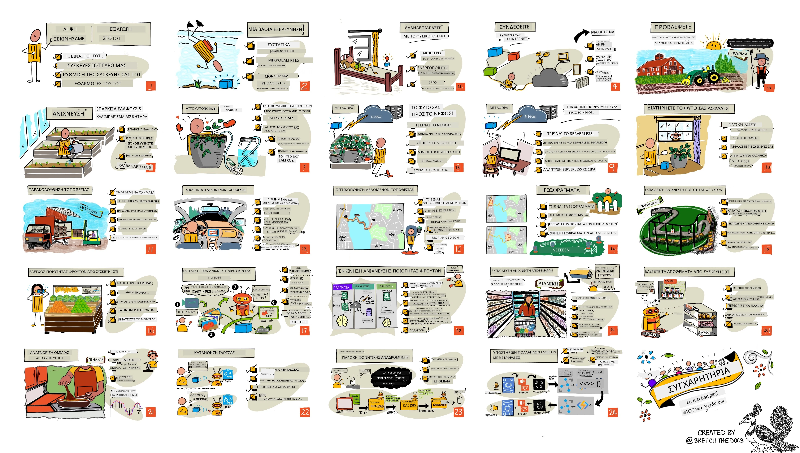

[](https://github.com/microsoft/IoT-For-Beginners/blob/master/LICENSE)
[](https://GitHub.com/microsoft/IoT-For-Beginners/graphs/contributors/)
[](https://GitHub.com/microsoft/IoT-For-Beginners/issues/)
[](https://GitHub.com/microsoft/IoT-For-Beginners/pulls/)
[](http://makeapullrequest.com)

[](https://GitHub.com/microsoft/IoT-For-Beginners/watchers/)
[](https://GitHub.com/microsoft/IoT-For-Beginners/network/)
[](https://GitHub.com/microsoft/IoT-For-Beginners/stargazers/)

### Γίνετε μέλος της κοινότητας Azure AI Foundry

Αν κολλήσετε ή έχετε οποιεσδήποτε ερωτήσεις σχετικά με την κατασκευή εφαρμογών AI. Ενταχθείτε σε συζητήσεις με άλλους μαθητές και έμπειρους προγραμματιστές σχετικά με το MCP. Είναι μια υποστηρικτική κοινότητα όπου οι ερωτήσεις είναι ευπρόσδεκτες και η γνώση μοιράζεται ελεύθερα.

[](https://discord.gg/nTYy5BXMWG)

Αν έχετε σχόλια για προϊόντα ή λάθη κατά την κατασκευή, επισκεφθείτε:

[](https://aka.ms/foundry/forum)

Ακολουθήστε αυτά τα βήματα για να ξεκινήσετε χρησιμοποιώντας αυτούς τους πόρους:
1. **Κάντε Fork το Αποθετήριο**: Κλικ στο [](https://GitHub.com/microsoft/IoT-For-Beginners/fork)
2. **Κλωνοποιήστε το Αποθετήριο**:   `git clone https://github.com/microsoft/IoT-For-Beginners.git`
3. [**Εγγραφείτε στο Microsoft Foundry Discord και γνωρίστε ειδικούς και άλλους προγραμματιστές**](https://discord.com/invite/ByRwuEEgH4)


### 🌐 Πολυγλωσσική Υποστήριξη

#### Υποστηρίζεται μέσω GitHub Action (Αυτοματοποιημένη & Πάντα Ενημερωμένη)

<!-- CO-OP TRANSLATOR LANGUAGES TABLE START -->
[Arabic](../ar/README.md) | [Bengali](../bn/README.md) | [Bulgarian](../bg/README.md) | [Burmese (Myanmar)](../my/README.md) | [Chinese (Simplified)](../zh-CN/README.md) | [Chinese (Traditional, Hong Kong)](../zh-HK/README.md) | [Chinese (Traditional, Macau)](../zh-MO/README.md) | [Chinese (Traditional, Taiwan)](../zh-TW/README.md) | [Croatian](../hr/README.md) | [Czech](../cs/README.md) | [Danish](../da/README.md) | [Dutch](../nl/README.md) | [Estonian](../et/README.md) | [Finnish](../fi/README.md) | [French](../fr/README.md) | [German](../de/README.md) | [Greek](./README.md) | [Hebrew](../he/README.md) | [Hindi](../hi/README.md) | [Hungarian](../hu/README.md) | [Indonesian](../id/README.md) | [Italian](../it/README.md) | [Japanese](../ja/README.md) | [Kannada](../kn/README.md) | [Khmer](../km/README.md) | [Korean](../ko/README.md) | [Lithuanian](../lt/README.md) | [Malay](../ms/README.md) | [Malayalam](../ml/README.md) | [Marathi](../mr/README.md) | [Nepali](../ne/README.md) | [Nigerian Pidgin](../pcm/README.md) | [Norwegian](../no/README.md) | [Persian (Farsi)](../fa/README.md) | [Polish](../pl/README.md) | [Portuguese (Brazil)](../pt-BR/README.md) | [Portuguese (Portugal)](../pt-PT/README.md) | [Punjabi (Gurmukhi)](../pa/README.md) | [Romanian](../ro/README.md) | [Russian](../ru/README.md) | [Serbian (Cyrillic)](../sr/README.md) | [Slovak](../sk/README.md) | [Slovenian](../sl/README.md) | [Spanish](../es/README.md) | [Swahili](../sw/README.md) | [Swedish](../sv/README.md) | [Tagalog (Filipino)](../tl/README.md) | [Tamil](../ta/README.md) | [Telugu](../te/README.md) | [Thai](../th/README.md) | [Turkish](../tr/README.md) | [Ukrainian](../uk/README.md) | [Urdu](../ur/README.md) | [Vietnamese](../vi/README.md)

> **Προτιμάτε να κλωνοποιήσετε τοπικά;**
>
> Αυτό το αποθετήριο περιλαμβάνει πάνω από 50 μεταφράσεις, κάτι που αυξάνει σημαντικά το μέγεθος λήψης. Για να κλωνοποιήσετε χωρίς μεταφράσεις, χρησιμοποιήστε sparse checkout:
>
> **Bash / macOS / Linux:**
> ```bash
> git clone --filter=blob:none --sparse https://github.com/microsoft/IoT-For-Beginners.git
> cd IoT-For-Beginners
> git sparse-checkout set --no-cone '/*' '!translations' '!translated_images'
> ```
>
> **CMD (Windows):**
> ```cmd
> git clone --filter=blob:none --sparse https://github.com/microsoft/IoT-For-Beginners.git
> cd IoT-For-Beginners
> git sparse-checkout set --no-cone "/*" "!translations" "!translated_images"
> ```
>
> Αυτό σας δίνει όλα όσα χρειάζεστε για να ολοκληρώσετε το μάθημα με πολύ πιο γρήγορη λήψη.
<!-- CO-OP TRANSLATOR LANGUAGES TABLE END -->

# IoT για Αρχάριους - Ένα Αναλυτικό Πρόγραμμα Σπουδών

Οι υποστηρικτές του Azure Cloud στη Microsoft είναι στην ευχάριστη θέση να προσφέρουν ένα πρόγραμμα σπουδών 12 εβδομάδων, 24 μαθημάτων για τα βασικά του IoT. Κάθε μάθημα περιλαμβάνει κουίζ πριν και μετά το μάθημα, γραπτές οδηγίες για την ολοκλήρωση του μαθήματος, μια λύση, μια ανάθεση και άλλα. Η παιδαγωγική μας που βασίζεται σε έργα επιτρέπει να μαθαίνετε ενώ κατασκευάζετε, ένας αποδεδειγμένος τρόπος ώστε οι νέες δεξιότητες να «εδραιώνονται».

Τα έργα καλύπτουν το ταξίδι του φαγητού από το αγρόκτημα στο τραπέζι. Αυτό περιλαμβάνει αγροτική παραγωγή, logistics, κατασκευή, λιανική και καταναλωτές - όλα δημοφιλείς τομείς της βιομηχανίας για συσκευές IoT.



> Σχεδιαστικό σημείωμα από [Nitya Narasimhan](https://github.com/nitya). Κάντε κλικ στην εικόνα για μεγαλύτερη έκδοση.

**Θερμές ευχαριστίες στους συγγραφείς μας [Jen Fox](https://github.com/jenfoxbot), [Jen Looper](https://github.com/jlooper), [Jim Bennett](https://github.com/jimbobbennett) και στον καλλιτέχνη σχεδιαστικών σημειωμάτων μας [Nitya Narasimhan](https://github.com/nitya).**

**Ευχαριστίες επίσης στην ομάδα μας από [Μαθητές Πρεσβευτές της Microsoft Learn](https://studentambassadors.microsoft.com?WT.mc_id=academic-17441-jabenn) που έχουν αναθεωρήσει και μεταφράσει αυτό το πρόγραμμα σπουδών - [Aditya Garg](https://github.com/AdityaGarg00), [Anurag Sharma](https://github.com/Anurag-0-1-A), [Arpita Das](https://github.com/Arpiiitaaa), [Aryan Jain](https://www.linkedin.com/in/aryan-jain-47a4a1145/), [Bhavesh Suneja](https://github.com/EliteWarrior315), [Faith Hunja](https://faithhunja.github.io/), [Lateefah Bello](https://www.linkedin.com/in/lateefah-bello/), [Manvi Jha](https://github.com/Severus-Matthew), [Mireille Tan](https://www.linkedin.com/in/mireille-tan-a4834819a/), [Mohammad Iftekher (Iftu) Ebne Jalal](https://github.com/Iftu119), [Mohammad Zulfikar](https://github.com/mohzulfikar), [Priyanshu Srivastav](https://www.linkedin.com/in/priyanshu-srivastav-b067241ba), [Thanmai Gowducheruvu](https://github.com/innovation-platform), και [Zina Kamel](https://www.linkedin.com/in/zina-kamel/).**

Γνωρίστε την ομάδα!

[](https://youtu.be/-wippUJRi5k)

**Gif από** [Mohit Jaisal](https://linkedin.com/in/mohitjaisal)

> 🎥 Κάντε κλικ στην παραπάνω εικόνα για ένα βίντεο σχετικά με το έργο!

> **Καθηγητές**, έχουμε [συμπεριλάβει μερικές προτάσεις](for-teachers.md) για το πώς να χρησιμοποιήσετε αυτό το πρόγραμμα σπουδών. Αν θέλετε να δημιουργήσετε τα δικά σας μαθήματα, έχουμε επίσης συμπεριλάβει ένα [πρότυπο μαθήματος](lesson-template/README.md).

> **[Φοιτητές](https://aka.ms/student-page)**, για να χρησιμοποιήσετε αυτό το πρόγραμμα σπουδών μόνοι σας, κάντε fork ολόκληρο το αποθετήριο και ολοκληρώστε τις ασκήσεις μόνοι σας, ξεκινώντας με ένα κουίζ πριν τη διάλεξη, μετά διαβάζοντας τη διάλεξη και ολοκληρώνοντας τις υπόλοιπες δραστηριότητες. Προσπαθήστε να δημιουργήσετε τα έργα κατανοώντας τα μαθήματα αντί να αντιγράφετε τον κώδικα λύσης. Ωστόσο, αυτός ο κώδικας είναι διαθέσιμος στους φακέλους /solutions σε κάθε μάθημα που σχετίζεται με έργα. Μια άλλη ιδέα θα ήταν να σχηματίσετε μια ομάδα μελέτης με φίλους και να μελετήσετε το περιεχόμενο μαζί. Για περαιτέρω μελέτη, συνιστούμε το [Microsoft Learn](https://docs.microsoft.com/users/jimbobbennett/collections/ke2ehd351jopwr?WT.mc_id=academic-17441-jabenn).

Για μια επισκόπηση βίντεο αυτού του μαθήματος, δείτε αυτό το βίντεο:

[](https://youtube.com/watch?v=bccEMm8gRuc "Προωθητικό βίντεο")

> 🎥 Κάντε κλικ στην παραπάνω εικόνα για ένα βίντεο σχετικά με το έργο!

## Παιδαγωγική

Έχουμε επιλέξει δύο παιδαγωγικές αρχές κατά την κατασκευή αυτού του προγράμματος σπουδών: να είναι βασισμένο σε έργα και να περιλαμβάνει συχνά κουίζ. Μέχρι το τέλος αυτής της σειράς, οι μαθητές θα έχουν φτιάξει ένα σύστημα παρακολούθησης και ποτίσματος φυτών, μια συσκευή εντοπισμού οχημάτων, μια έξυπνη εγκατάσταση κατασκευής για την παρακολούθηση και τον έλεγχο φαγητού, και έναν χρονοδιακόπτη μαγειρικής που ελέγχεται φωνητικά, ενώ θα έχουν μάθει τα βασικά του Διαδικτύου των Πραγμάτων, συμπεριλαμβανομένου του πώς να γράφουν κώδικα για συσκευές, να συνδέονται στο cloud, να αναλύουν τηλεμετρία και να τρέχουν AI στην άκρη.

Με το να ευθυγραμμιστεί το περιεχόμενο με έργα, η διαδικασία γίνεται πιο ελκυστική για τους μαθητές και η διατήρηση των εννοιών θα ενισχυθεί.

Επιπλέον, ένα κουίζ χαμηλής πίεσης πριν από το μάθημα θέτει την πρόθεση του μαθητή να μάθει ένα θέμα, ενώ ένα δεύτερο κουίζ μετά το μάθημα εξασφαλίζει περαιτέρω διατήρηση. Αυτό το πρόγραμμα σπουδών σχεδιάστηκε για να είναι ευέλικτο και διασκεδαστικό και μπορεί να γίνει ολόκληρο ή μερικώς. Τα έργα ξεκινούν μικρά και γίνονται όλο και πιο σύνθετα μέχρι το τέλος του δωδεκάμηνου κύκλου.

Κάθε έργο βασίζεται σε πραγματικό υλικό διαθέσιμο σε μαθητές και χομπίστες. Κάθε έργο εξετάζει τον συγκεκριμένο τομέα του έργου, παρέχοντας σχετική βασική γνώση. Για να γίνει κάποιος επιτυχημένος προγραμματιστής, βοηθάει να κατανοεί τον τομέα στον οποίο επιλύει προβλήματα, και αυτή η βασική γνώση επιτρέπει στους μαθητές να σκέφτονται τις λύσεις και τις γνώσεις τους για το IoT στο πλαίσιο του είδους του πραγματικού προβλήματος που μπορεί να κληθούν να λύσουν ως προγραμματιστές IoT. Οι μαθητές μαθαίνουν το «γιατί» των λύσεων που κατασκευάζουν και αποκτούν εκτίμηση για τον τελικό χρήστη.

## Υλικό (Hardware)
Έχουμε δύο επιλογές υλικού IoT για χρήση στα έργα, ανάλογα με τις προσωπικές προτιμήσεις, τη γνώση της γλώσσας προγραμματισμού ή τις προτιμήσεις, τους στόχους μάθησης και τη διαθεσιμότητα. Έχουμε επίσης παράσχει μια έκδοση 'εικονικού υλικού' για όσους δεν έχουν πρόσβαση σε υλικό ή θέλουν να μάθουν περισσότερα πριν δεσμευτούν σε μια αγορά. Μπορείτε να διαβάσετε περισσότερα και να βρείτε μια 'λίστα αγορών' στη [σελίδα υλικού](./hardware.md), συμπεριλαμβανομένων συνδέσμων για να αγοράσετε ολοκληρωμένα κιτ από τους φίλους μας στο Seeed Studio.

> 💁 Βρείτε τους [Κανόνες Συμπεριφοράς](CODE_OF_CONDUCT.md), τις οδηγίες [Συμμετοχής](CONTRIBUTING.md) και [Μεταφράσεων](..). Καλωσορίζουμε την εποικοδομητική σας ανατροφοδότηση!
>
> 🔧 Αν έχετε προβλήματα, ρίξτε μια ματιά στον [Οδηγό Επίλυσης Προβλημάτων](TROUBLESHOOTING.md) για λύσεις σε κοινά ζητήματα.

## Κάθε μάθημα περιλαμβάνει:

- σημειώσεις σκίτσου
- προαιρετικό συμπληρωματικό βίντεο
- quiz προθέρμανσης πριν το μάθημα
- γραπτό μάθημα
- για μαθήματα βασισμένα σε έργα, οδηγίες βήμα προς βήμα για την κατασκευή του έργου
- ελέγχους γνώσης
- μια πρόκληση
- συμπληρωματική ανάγνωση
- εργασία
- [quiz μετά το μάθημα](https://ff-quizzes.netlify.app/en/)

> **Μια σημείωση σχετικά με τα κουίζ**: Όλα τα κουίζ περιέχονται στον φάκελο quiz-app, για συνολικά 48 κουίζ των τριών ερωτήσεων το καθένα. Συνδέονται από τα μαθήματα, αλλά η εφαρμογή κουίζ μπορεί να τρέξει τοπικά ή να αναπτυχθεί στο Azure· ακολουθήστε τις οδηγίες στο φάκελο `quiz-app`. Σταδιακά μεταφράζονται.

## Μαθήματα

|       |               Όνομα Έργου               |                         Εννοιες που διδάσκονται                         | Μαθησιακοί Στόχοι                                                                                                                                                   |                                                        Συνδεδεμένο Μάθημα                                                         |
| :---: | :------------------------------------: | :---------------------------------------------------------------------: | ------------------------------------------------------------------------------------------------------------------------------------------------------------------- | :---------------------------------------------------------------------------------------------------------------------------: |
|  01   | [Ξεκινώντας](./1-getting-started/README.md) |                      Εισαγωγή στο IoT                                   | Μάθετε τις βασικές αρχές του IoT και τα βασικά δομικά στοιχεία των λύσεων IoT όπως αισθητήρες και υπηρεσίες νέφους ενώ ρυθμίζετε τη συσκευή IoT σας                  |                      [Εισαγωγή στο IoT](./1-getting-started/lessons/1-introduction-to-iot/README.md)                              |
|  02   | [Ξεκινώντας](./1-getting-started/README.md) |                    Πιο βαθιά ματιά στο IoT                              | Μάθετε περισσότερα για τα συστατικά ενός συστήματος IoT, καθώς και μικροελεγκτές και υπολογιστές μονού πίνακα                                                        |                        [Πιο βαθιά ματιά στο IoT](./1-getting-started/lessons/2-deeper-dive/README.md)                           |
|  03   | [Ξεκινώντας](./1-getting-started/README.md) | Αλληλεπίδραση με τον φυσικό κόσμο μέσω αισθητήρων και ενεργοποιητών    | Μάθετε για αισθητήρες για συλλογή δεδομένων από τον φυσικό κόσμο, και ενεργοποιητές για αποστολή ανατροφοδότησης, ενώ κατασκευάζετε ένα νυχτερινό φως               | [Αλληλεπίδραση με τον φυσικό κόσμο μέσω αισθητήρων και ενεργοποιητών](./1-getting-started/lessons/3-sensors-and-actuators/README.md) |
|  04   | [Ξεκινώντας](./1-getting-started/README.md) |                   Συνδέστε τη συσκευή σας στο Διαδίκτυο                 | Μάθετε πώς να συνδέσετε μια συσκευή IoT στο Διαδίκτυο για αποστολή και λήψη μηνυμάτων συνδέοντας το νυχτερινό σας φως σε έναν broker MQTT                           |                [Συνδέστε τη συσκευή σας στο Διαδίκτυο](./1-getting-started/lessons/4-connect-internet/README.md)                 |
|  05   |            [Φάρμα](./2-farm/README.md)           |                    Πρόβλεψη ανάπτυξης φυτών                           | Μάθετε πώς να προβλέψετε την ανάπτυξη φυτών χρησιμοποιώντας δεδομένα θερμοκρασίας που συλλέγονται από μια συσκευή IoT                                              |                          [Πρόβλεψη ανάπτυξης φυτών](./2-farm/lessons/1-predict-plant-growth/README.md)                         |
|  06   |            [Φάρμα](./2-farm/README.md)           |                     Ανίχνευση υγρασίας εδάφους                        | Μάθετε πώς να ανιχνεύετε την υγρασία του εδάφους και να βαθμονομήσετε έναν αισθητήρα υγρασίας εδάφους                                                             |                          [Ανίχνευση υγρασίας εδάφους](./2-farm/lessons/2-detect-soil-moisture/README.md)                         |
|  07   |            [Φάρμα](./2-farm/README.md)           |                    Αυτοματοποιημένο πότισμα φυτών                      | Μάθετε πώς να αυτοματοποιήσετε και να συγχρονίσετε το πότισμα χρησιμοποιώντας ρελέ και MQTT                                                                          |                      [Αυτοματοποιημένο πότισμα φυτών](./2-farm/lessons/3-automated-plant-watering/README.md)                    |
|  08   |            [Φάρμα](./2-farm/README.md)           |                 Μεταφέρετε το φυτό σας στο νέφος                       | Μάθετε για το νέφος και τις υπηρεσίες IoT που φιλοξενούνται στο νέφος και πώς να συνδέσετε το φυτό σας σε ένα από αυτά αντί για δημόσιο broker MQTT                 |               [Μεταφέρετε το φυτό σας στο νέφος](./2-farm/lessons/4-migrate-your-plant-to-the-cloud/README.md)                 |
|  09   |            [Φάρμα](./2-farm/README.md)           |           Μεταφέρετε τη λογική εφαρμογής σας στο νέφος                | Μάθετε πώς μπορείτε να γράψετε λογική εφαρμογής στο νέφος που ανταποκρίνεται σε μηνύματα IoT                                                                        |         [Μεταφέρετε τη λογική εφαρμογής σας στο νέφος](./2-farm/lessons/5-migrate-application-to-the-cloud/README.md)          |
|  10   |            [Φάρμα](./2-farm/README.md)           |                     Κρατήστε το φυτό σας ασφαλές                      | Μάθετε για την ασφάλεια στο IoT και πώς να διατηρήσετε το φυτό σας ασφαλές με κλειδιά και πιστοποιητικά                                                            |                        [Κρατήστε το φυτό σας ασφαλές](./2-farm/lessons/6-keep-your-plant-secure/README.md)                      |
|  11   |       [Μεταφορές](./3-transport/README.md)       |                  Παρακολούθηση τοποθεσίας                              | Μάθετε για την παρακολούθηση τοποθεσίας GPS για συσκευές IoT                                                                                                      |                          [Παρακολούθηση τοποθεσίας](./3-transport/lessons/1-location-tracking/README.md)                       |
|  12   |       [Μεταφορές](./3-transport/README.md)       |                   Αποθήκευση δεδομένων τοποθεσίας                      | Μάθετε πώς να αποθηκεύσετε δεδομένα IoT για μετέπειτα οπτικοποίηση ή ανάλυση                                                                                       |                            [Αποθήκευση δεδομένων τοποθεσίας](./3-transport/lessons/2-store-location-data/README.md)           |
|  13   |       [Μεταφορές](./3-transport/README.md)       |                 Οπτικοποίηση δεδομένων τοποθεσίας                      | Μάθετε για την οπτικοποίηση δεδομένων τοποθεσίας σε χάρτη, και πώς οι χάρτες αναπαριστούν τον πραγματικό 3D κόσμο σε 2 διαστάσεις                                  |                       [Οπτικοποίηση δεδομένων τοποθεσίας](./3-transport/lessons/3-visualize-location-data/README.md)           |
|  14   |       [Μεταφορές](./3-transport/README.md)       |                        Γεωφράγματα                                     | Μάθετε για τα γεωφράγματα, και πώς μπορούν να χρησιμοποιηθούν για ειδοποίηση όταν οχήματα στην εφοδιαστική αλυσίδα πλησιάζουν στον προορισμό τους                      |                                   [Γεωφράγματα](./3-transport/lessons/4-geofences/README.md)                                  |
|  15   |   [Βιομηχανία](./4-manufacturing/README.md)     |                    Εκπαίδευση ανιχνευτή ποιότητας φρούτου            | Μάθετε για την εκπαίδευση ενός ταξινομητή εικόνων στο νέφος για ανίχνευση ποιότητας φρούτων                                                                        |                [Εκπαίδευση ανιχνευτή ποιότητας φρούτου](./4-manufacturing/lessons/1-train-fruit-detector/README.md)            |
|  16   |   [Βιομηχανία](./4-manufacturing/README.md)     |                Έλεγχος ποιότητας φρούτων από συσκευή IoT             | Μάθετε πώς να χρησιμοποιείτε τον ανιχνευτή ποιότητας φρούτων από μια συσκευή IoT                                                                                   |              [Έλεγχος ποιότητας φρούτων από συσκευή IoT](./4-manufacturing/lessons/2-check-fruit-from-device/README.md)        |
|  17   |   [Βιομηχανία](./4-manufacturing/README.md)     |               Εκτέλεση ανιχνευτή φρούτων στο edge                     | Μάθετε για την εκτέλεση του ανιχνευτή φρούτων σε μια συσκευή IoT στην άκρη                                                                                            |                [Εκτέλεση ανιχνευτή φρούτων στο edge](./4-manufacturing/lessons/3-run-fruit-detector-edge/README.md)            |
|  18   |   [Βιομηχανία](./4-manufacturing/README.md)     |           Έναρξη ανίχνευσης ποιότητας φρούτων από αισθητήρα           | Μάθετε για την ενεργοποίηση ανίχνευσης ποιότητας φρούτων από έναν αισθητήρα                                                                                        |         [Έναρξη ανίχνευσης ποιότητας φρούτων από αισθητήρα](./4-manufacturing/lessons/4-trigger-fruit-detector/README.md)       |
|  19   |          [Λιανική](./5-retail/README.md)          |                    Εκπαίδευση ανιχνευτή αποθεμάτων                   | Μάθετε πώς να χρησιμοποιήσετε την ανίχνευση αντικειμένων για να εκπαιδεύσετε έναν ανιχνευτή αποθεμάτων να μετράει αποθέματα σε ένα κατάστημα                         |                       [Εκπαίδευση ανιχνευτή αποθεμάτων](./5-retail/lessons/1-train-stock-detector/README.md)                    |
|  20   |          [Λιανική](./5-retail/README.md)          |                  Έλεγχος αποθεμάτων από συσκευή IoT                  | Μάθετε πώς να ελέγχετε αποθέματα από μια συσκευή IoT χρησιμοποιώντας ένα μοντέλο ανίχνευσης αντικειμένων                                                            |                      [Έλεγχος αποθεμάτων από συσκευή IoT](./5-retail/lessons/2-check-stock-device/README.md)                   |
|  21   |        [Καταναλωτής](./6-consumer/README.md)       |               Αναγνώριση ομιλίας με συσκευή IoT                      | Μάθετε πώς να αναγνωρίζετε ομιλία από μια συσκευή IoT για να φτιάξετε ένα έξυπνο χρονόμετρο                                                                             |                [Αναγνώριση ομιλίας με συσκευή IoT](./6-consumer/lessons/1-speech-recognition/README.md)                       |
|  22   |        [Καταναλωτής](./6-consumer/README.md)       |                  Κατανόηση γλώσσας                                   | Μάθετε πώς να κατανοείτε προτάσεις που λέγονται σε μια συσκευή IoT                                                                                                  |                       [Κατανόηση γλώσσας](./6-consumer/lessons/2-language-understanding/README.md)                             |
|  23   |        [Καταναλωτής](./6-consumer/README.md)       |            Ορισμός χρονομέτρου και παροχή προφορικής ανατροφοδότησης | Μάθετε πώς να ορίσετε χρονομέτρη σε μια συσκευή IoT και να δώσετε προφορική ανατροφοδότηση για το πότε ο χρονομέτρης ξεκινά και τελειώνει                           |              [Ορισμός χρονομέτρου και παροχή προφορικής ανατροφοδότησης](./6-consumer/lessons/3-spoken-feedback/README.md)     |
|  24   |        [Καταναλωτής](./6-consumer/README.md)       |                Υποστήριξη πολλαπλών γλωσσών                          | Μάθετε πώς να υποστηρίζετε πολλές γλώσσες, τόσο στην ομιλία προς τη συσκευή, όσο και στις απαντήσεις από τον έξυπνο χρονομέτρη σας                                  |                    [Υποστήριξη πολλαπλών γλωσσών](./6-consumer/lessons/4-multiple-language-support/README.md)                   |

## Πρόσβαση εκτός σύνδεσης

Μπορείτε να τρέξετε αυτή την τεκμηρίωση εκτός σύνδεσης χρησιμοποιώντας το [Docsify](https://docsify.js.org/#/). Φτιάξτε ένα fork αυτού του αποθετηρίου, [εγκαταστήστε το Docsify](https://docsify.js.org/#/quickstart) στον τοπικό σας υπολογιστή και στη συνέχεια στον βασικό φάκελο του αποθετηρίου πληκτρολογήστε `docsify serve`. Η ιστοσελίδα θα σερβιριστεί στην πόρτα 3000 στον localhost σας: `localhost:3000`.

## Κουίζ

Ευχαριστούμε την κοινότητα για τη φιλοξενία του διαδραστικού κουίζ που ελέγχει τις γνώσεις σας σε κάθε κεφάλαιο. Δοκιμάστε τις γνώσεις σας [εδώ](https://ff-quizzes.netlify.app/en/)

### PDF

Μπορείτε να δημιουργήσετε ένα PDF αυτού του περιεχομένου για πρόσβαση εκτός σύνδεσης αν χρειάζεται. Για να το κάνετε αυτό, βεβαιωθείτε ότι έχετε [εγκατεστημένο το npm](https://docs.npmjs.com/downloading-and-installing-node-js-and-npm) και εκτελέστε τις ακόλουθες εντολές στον βασικό φάκελο αυτού του αποθετηρίου:

```sh
npm i
npm run convert
```

### Διαφάνειες

Υπάρχουν πακέτα διαφανειών για μερικά από τα μαθήματα στον φάκελο [slides](../../slides).

## Άλλες Διδασκαλίες

Η ομάδα μας παράγει και άλλα προγράμματα μαθημάτων! Δείτε:

<!-- CO-OP TRANSLATOR OTHER COURSES START -->
### LangChain
[](https://aka.ms/langchain4j-for-beginners)
[](https://aka.ms/langchainjs-for-beginners?WT.mc_id=m365-94501-dwahlin)
[](https://github.com/microsoft/langchain-for-beginners?WT.mc_id=m365-94501-dwahlin)
---

### Azure / Edge / MCP / Agents
[](https://github.com/microsoft/AZD-for-beginners?WT.mc_id=academic-105485-koreyst)
[](https://github.com/microsoft/edgeai-for-beginners?WT.mc_id=academic-105485-koreyst)
[](https://github.com/microsoft/mcp-for-beginners?WT.mc_id=academic-105485-koreyst)
[](https://github.com/microsoft/ai-agents-for-beginners?WT.mc_id=academic-105485-koreyst)

---
 
### Σειρά Γενετικής Τεχνητής Νοημοσύνης
[](https://github.com/microsoft/generative-ai-for-beginners?WT.mc_id=academic-105485-koreyst)
[-9333EA?style=for-the-badge&labelColor=E5E7EB&color=9333EA)](https://github.com/microsoft/Generative-AI-for-beginners-dotnet?WT.mc_id=academic-105485-koreyst)
[-C084FC?style=for-the-badge&labelColor=E5E7EB&color=C084FC)](https://github.com/microsoft/generative-ai-for-beginners-java?WT.mc_id=academic-105485-koreyst)
[-E879F9?style=for-the-badge&labelColor=E5E7EB&color=E879F9)](https://github.com/microsoft/generative-ai-with-javascript?WT.mc_id=academic-105485-koreyst)

---
 
### Βασική Μάθηση
[](https://aka.ms/ml-beginners?WT.mc_id=academic-105485-koreyst)
[](https://aka.ms/datascience-beginners?WT.mc_id=academic-105485-koreyst)
[](https://aka.ms/ai-beginners?WT.mc_id=academic-105485-koreyst)
[](https://github.com/microsoft/Security-101?WT.mc_id=academic-96948-sayoung)
[](https://aka.ms/webdev-beginners?WT.mc_id=academic-105485-koreyst)
[](https://aka.ms/iot-beginners?WT.mc_id=academic-105485-koreyst)
[](https://github.com/microsoft/xr-development-for-beginners?WT.mc_id=academic-105485-koreyst)

---
 
### Σειρά Συν-πιλότου
[](https://aka.ms/GitHubCopilotAI?WT.mc_id=academic-105485-koreyst)
[](https://github.com/microsoft/mastering-github-copilot-for-dotnet-csharp-developers?WT.mc_id=academic-105485-koreyst)
[](https://github.com/microsoft/CopilotAdventures?WT.mc_id=academic-105485-koreyst)
<!-- CO-OP TRANSLATOR OTHER COURSES END -->

## Αποδόσεις εικόνων

Μπορείτε να βρείτε όλες τις αποδόσεις για τις εικόνες που χρησιμοποιούνται σε αυτό το πρόγραμμα σπουδών όπου απαιτείται στο [Αποδόσεις](./attributions.md).

---

<!-- CO-OP TRANSLATOR DISCLAIMER START -->
**Απόποιηση ευθυνών**:
Αυτό το έγγραφο έχει μεταφραστεί χρησιμοποιώντας την υπηρεσία αυτόματης μετάφρασης AI [Co-op Translator](https://github.com/Azure/co-op-translator). Παρόλο που επιδιώκουμε την ακρίβεια, παρακαλούμε να έχετε υπόψη σας ότι οι αυτόματες μεταφράσεις μπορεί να περιέχουν λάθη ή ανακρίβειες. Το πρωτότυπο έγγραφο στη μητρική του γλώσσα θεωρείται η αυθεντική πηγή. Για κρίσιμες πληροφορίες συνιστάται επαγγελματική ανθρώπινη μετάφραση. Δεν φέρουμε ευθύνη για οποιεσδήποτε παρεξηγήσεις ή λανθασμένες ερμηνείες που προκύπτουν από τη χρήση αυτής της μετάφρασης.
<!-- CO-OP TRANSLATOR DISCLAIMER END -->