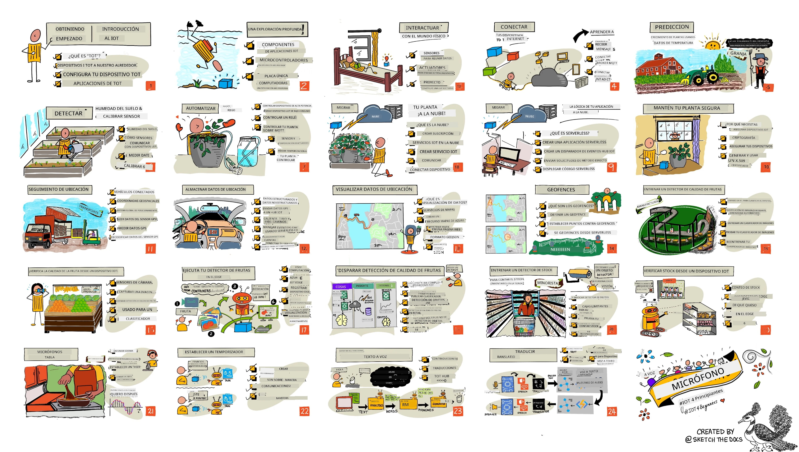

[](https://github.com/microsoft/IoT-For-Beginners/blob/master/LICENSE)
[](https://GitHub.com/microsoft/IoT-For-Beginners/graphs/contributors/)
[](https://GitHub.com/microsoft/IoT-For-Beginners/issues/)
[](https://GitHub.com/microsoft/IoT-For-Beginners/pulls/)
[](http://makeapullrequest.com)

[](https://GitHub.com/microsoft/IoT-For-Beginners/watchers/)
[](https://GitHub.com/microsoft/IoT-For-Beginners/network/)
[](https://GitHub.com/microsoft/IoT-For-Beginners/stargazers/)

### Únete a la Comunidad Azure AI Foundry

Si te quedas atascado o tienes alguna pregunta sobre cómo construir aplicaciones de IA. Únete a otros aprendices y desarrolladores experimentados en discusiones sobre MCP. Es una comunidad de apoyo donde las preguntas son bienvenidas y el conocimiento se comparte libremente.

[](https://discord.gg/nTYy5BXMWG)

Si tienes comentarios sobre el producto o errores mientras construyes, visita:

[](https://aka.ms/foundry/forum)

Sigue estos pasos para comenzar a usar estos recursos:
1. **Haz un Fork del Repositorio**: Haz clic en [](https://GitHub.com/microsoft/IoT-For-Beginners/fork)
2. **Clona el Repositorio**:   `git clone https://github.com/microsoft/IoT-For-Beginners.git`
3. [**Únete al Discord de Microsoft Foundry y conoce a expertos y otros desarrolladores**](https://discord.com/invite/ByRwuEEgH4)


### 🌐 Soporte Multilingüe

#### Compatible mediante GitHub Action (Automatizado y Siempre Actualizado)

<!-- CO-OP TRANSLATOR LANGUAGES TABLE START -->
[Arabic](../ar/README.md) | [Bengali](../bn/README.md) | [Bulgarian](../bg/README.md) | [Burmese (Myanmar)](../my/README.md) | [Chinese (Simplified)](../zh-CN/README.md) | [Chinese (Traditional, Hong Kong)](../zh-HK/README.md) | [Chinese (Traditional, Macau)](../zh-MO/README.md) | [Chinese (Traditional, Taiwan)](../zh-TW/README.md) | [Croatian](../hr/README.md) | [Czech](../cs/README.md) | [Danish](../da/README.md) | [Dutch](../nl/README.md) | [Estonian](../et/README.md) | [Finnish](../fi/README.md) | [French](../fr/README.md) | [German](../de/README.md) | [Greek](../el/README.md) | [Hebrew](../he/README.md) | [Hindi](../hi/README.md) | [Hungarian](../hu/README.md) | [Indonesian](../id/README.md) | [Italian](../it/README.md) | [Japanese](../ja/README.md) | [Kannada](../kn/README.md) | [Khmer](../km/README.md) | [Korean](../ko/README.md) | [Lithuanian](../lt/README.md) | [Malay](../ms/README.md) | [Malayalam](../ml/README.md) | [Marathi](../mr/README.md) | [Nepali](../ne/README.md) | [Nigerian Pidgin](../pcm/README.md) | [Norwegian](../no/README.md) | [Persian (Farsi)](../fa/README.md) | [Polish](../pl/README.md) | [Portuguese (Brazil)](../pt-BR/README.md) | [Portuguese (Portugal)](../pt-PT/README.md) | [Punjabi (Gurmukhi)](../pa/README.md) | [Romanian](../ro/README.md) | [Russian](../ru/README.md) | [Serbian (Cyrillic)](../sr/README.md) | [Slovak](../sk/README.md) | [Slovenian](../sl/README.md) | [Spanish](./README.md) | [Swahili](../sw/README.md) | [Swedish](../sv/README.md) | [Tagalog (Filipino)](../tl/README.md) | [Tamil](../ta/README.md) | [Telugu](../te/README.md) | [Thai](../th/README.md) | [Turkish](../tr/README.md) | [Ukrainian](../uk/README.md) | [Urdu](../ur/README.md) | [Vietnamese](../vi/README.md)

> **¿Prefieres Clonar Localmente?**
>
> Este repositorio incluye traducciones a más de 50 idiomas, lo que aumenta significativamente el tamaño de la descarga. Para clonar sin traducciones, usa sparse checkout:
>
> **Bash / macOS / Linux:**
> ```bash
> git clone --filter=blob:none --sparse https://github.com/microsoft/IoT-For-Beginners.git
> cd IoT-For-Beginners
> git sparse-checkout set --no-cone '/*' '!translations' '!translated_images'
> ```
>
> **CMD (Windows):**
> ```cmd
> git clone --filter=blob:none --sparse https://github.com/microsoft/IoT-For-Beginners.git
> cd IoT-For-Beginners
> git sparse-checkout set --no-cone "/*" "!translations" "!translated_images"
> ```
>
> Esto te brinda todo lo necesario para completar el curso con una descarga mucho más rápida.
<!-- CO-OP TRANSLATOR LANGUAGES TABLE END -->

# IoT para Principiantes - Un Currículo

Los Azure Cloud Advocates de Microsoft tienen el placer de ofrecer un currículo de 12 semanas y 24 lecciones sobre los fundamentos del IoT. Cada lección incluye cuestionarios antes y después de la lección, instrucciones escritas para completar la lección, una solución, una tarea y más. Nuestra pedagogía basada en proyectos te permite aprender mientras construyes, una forma comprobada para que las nuevas habilidades se consoliden.

Los proyectos abarcan el recorrido de los alimentos desde la granja hasta la mesa. Esto incluye agricultura, logística, manufactura, venta minorista y consumidor, todos áreas industriales populares para dispositivos IoT.



> Sketchnote por [Nitya Narasimhan](https://github.com/nitya). Haz clic en la imagen para una versión más grande.

**Un gran agradecimiento a nuestros autores [Jen Fox](https://github.com/jenfoxbot), [Jen Looper](https://github.com/jlooper), [Jim Bennett](https://github.com/jimbobbennett), y nuestro artista de sketchnotes [Nitya Narasimhan](https://github.com/nitya).**

**Gracias también a nuestro equipo de [Microsoft Learn Student Ambassadors](https://studentambassadors.microsoft.com?WT.mc_id=academic-17441-jabenn) que han estado revisando y traduciendo este currículo - [Aditya Garg](https://github.com/AdityaGarg00), [Anurag Sharma](https://github.com/Anurag-0-1-A), [Arpita Das](https://github.com/Arpiiitaaa), [Aryan Jain](https://www.linkedin.com/in/aryan-jain-47a4a1145/), [Bhavesh Suneja](https://github.com/EliteWarrior315), [Faith Hunja](https://faithhunja.github.io/), [Lateefah Bello](https://www.linkedin.com/in/lateefah-bello/), [Manvi Jha](https://github.com/Severus-Matthew), [Mireille Tan](https://www.linkedin.com/in/mireille-tan-a4834819a/), [Mohammad Iftekher (Iftu) Ebne Jalal](https://github.com/Iftu119), [Mohammad Zulfikar](https://github.com/mohzulfikar), [Priyanshu Srivastav](https://www.linkedin.com/in/priyanshu-srivastav-b067241ba), [Thanmai Gowducheruvu](https://github.com/innovation-platform), y [Zina Kamel](https://www.linkedin.com/in/zina-kamel/).**

¡Conoce al equipo!

[](https://youtu.be/-wippUJRi5k)

**Gif por** [Mohit Jaisal](https://linkedin.com/in/mohitjaisal)

> 🎥 Haz clic en la imagen de arriba para un video sobre el proyecto!

> **Profesores**, hemos [incluido algunas sugerencias](for-teachers.md) sobre cómo usar este currículo. Si deseas crear tus propias lecciones, también hemos incluido una [plantilla de lección](lesson-template/README.md).

> **[Estudiantes](https://aka.ms/student-page)**, para usar este currículo por tu cuenta, haz un fork del repo completo y completa los ejercicios por tu cuenta, comenzando con un cuestionario previo a la lección, luego leyendo la clase y completando el resto de las actividades. Trata de crear los proyectos comprendiendo las lecciones en lugar de copiar el código solución; sin embargo, ese código está disponible en las carpetas /solutions en cada lección orientada a proyectos. Otra idea sería formar un grupo de estudio con amigos y revisar el contenido juntos. Para estudios adicionales, recomendamos [Microsoft Learn](https://docs.microsoft.com/users/jimbobbennett/collections/ke2ehd351jopwr?WT.mc_id=academic-17441-jabenn).

Para una descripción en video de este curso, mira este video:

[](https://youtube.com/watch?v=bccEMm8gRuc "Promo video")

> 🎥 Haz clic en la imagen de arriba para un video sobre el proyecto!

## Pedagogía

Hemos elegido dos principios pedagógicos al construir este currículo: asegurar que sea basado en proyectos y que incluya cuestionarios frecuentes. Al final de esta serie, los estudiantes habrán construido un sistema de monitoreo y riego de plantas, un rastreador de vehículos, una configuración de fábrica inteligente para rastrear y verificar alimentos, y un temporizador de cocina controlado por voz, y habrán aprendido los fundamentos del Internet de las Cosas, incluyendo cómo escribir código para dispositivos, conectarse a la nube, analizar telemetría y ejecutar IA en el borde.

Al asegurar que el contenido se alinea con proyectos, el proceso se vuelve más atractivo para los estudiantes y se mejora la retención de conceptos.

Además, un cuestionario de bajo riesgo antes de una clase establece la intención del estudiante hacia el aprendizaje del tema, mientras que un segundo cuestionario después de la clase asegura una retención adicional. Este currículo fue diseñado para ser flexible y divertido y puede tomarse en su totalidad o en parte. Los proyectos comienzan pequeños y se vuelven cada vez más complejos al final del ciclo de 12 semanas.

Cada proyecto se basa en hardware del mundo real disponible para estudiantes y aficionados. Cada proyecto estudia el dominio específico del proyecto, proporcionando conocimiento de fondo relevante. Para ser un desarrollador exitoso, ayuda entender el dominio en el que resuelves problemas, y proporcionar este conocimiento permite a los estudiantes pensar en sus soluciones y aprendizajes de IoT en el contexto del tipo de problema del mundo real que podrían tener que resolver como desarrolladores de IoT. Los estudiantes aprenden el 'por qué' de las soluciones que construyen y adquieren una apreciación por el usuario final.

## Hardware
Tenemos dos opciones de hardware IoT para usar en los proyectos dependiendo de la preferencia personal, conocimiento o preferencias del lenguaje de programación, objetivos de aprendizaje y disponibilidad. También hemos proporcionado una versión de 'hardware virtual' para aquellos que no tienen acceso a hardware, o quieren aprender más antes de comprometerse a una compra. Puedes leer más y encontrar una 'lista de compras' en la [página de hardware](./hardware.md), incluyendo enlaces para comprar kits completos de nuestros amigos en Seeed Studio.

> 💁 Encuentra nuestras directrices de [Código de Conducta](CODE_OF_CONDUCT.md), [Contribuciones](CONTRIBUTING.md) y [Traducciones](..). ¡Esperamos tus comentarios constructivos!
>
> 🔧 ¿Tienes problemas? Consulta nuestra [Guía de Solución de Problemas](TROUBLESHOOTING.md) para soluciones a problemas comunes.

## Cada lección incluye:

- sketchnote
- video complementario opcional
- cuestionario previo a la lección
- lección escrita
- para lecciones basadas en proyectos, guías paso a paso para construir el proyecto
- chequeos de conocimiento
- un desafío
- lectura complementaria
- tarea
- [cuestionario posterior a la lección](https://ff-quizzes.netlify.app/en/)

> **Una nota sobre los cuestionarios**: Todos los cuestionarios están contenidos en la carpeta quiz-app, con 48 cuestionarios en total de tres preguntas cada uno. Están enlazados dentro de las lecciones pero la aplicación de cuestionarios puede ejecutarse localmente o desplegarse en Azure; sigue las instrucciones en la carpeta `quiz-app`. Están siendo localizados gradualmente.

## Lecciones

|       |              Nombre del proyecto             |                       Conceptos enseñados                      | Objetivos de aprendizaje                                                                                                                                              |                                                       Lección enlazada                                                        |
| :---: | :-----------------------------------------: | :-------------------------------------------------------------: | -------------------------------------------------------------------------------------------------------------------------------------------------------------------- | :----------------------------------------------------------------------------------------------------------------------------: |
|  01   | [Primeros pasos](./1-getting-started/README.md) |                     Introducción al IoT                        | Aprende los principios básicos del IoT y los bloques básicos de soluciones IoT, como sensores y servicios en la nube mientras configuras tu primer dispositivo IoT   |                      [Introducción al IoT](./1-getting-started/lessons/1-introduction-to-iot/README.md)                      |
|  02   | [Primeros pasos](./1-getting-started/README.md) |                   Una inmersión más profunda en IoT            | Aprende más sobre los componentes de un sistema IoT, así como microcontroladores y computadoras de placa única                                                      |                        [Una inmersión más profunda en IoT](./1-getting-started/lessons/2-deeper-dive/README.md)                   |
|  03   | [Primeros pasos](./1-getting-started/README.md) | Interactuar con el mundo físico con sensores y actuadores      | Aprende sobre sensores para recopilar datos del mundo físico y actuadores para enviar retroalimentación, mientras construyes una luz nocturna                       | [Interactuar con el mundo físico con sensores y actuadores](./1-getting-started/lessons/3-sensors-and-actuators/README.md)      |
|  04   | [Primeros pasos](./1-getting-started/README.md) |             Conecta tu dispositivo a Internet                   | Aprende cómo conectar un dispositivo IoT a Internet para enviar y recibir mensajes conectando tu luz nocturna a un broker MQTT                                      |               [Conecta tu dispositivo a Internet](./1-getting-started/lessons/4-connect-internet/README.md)                     |
|  05   |            [Granja](./2-farm/README.md)            |                  Predecir el crecimiento de plantas            | Aprende cómo predecir el crecimiento de plantas usando datos de temperatura capturados por un dispositivo IoT                                                       |                          [Predecir crecimiento de plantas](./2-farm/lessons/1-predict-plant-growth/README.md)                   |
|  06   |            [Granja](./2-farm/README.md)            |                  Detectar humedad del suelo                     | Aprende cómo detectar la humedad del suelo y calibrar un sensor de humedad del suelo                                                                                 |                          [Detectar humedad del suelo](./2-farm/lessons/2-detect-soil-moisture/README.md)                         |
|  07   |            [Granja](./2-farm/README.md)            |                Riego automático de plantas                      | Aprende a automatizar y programar el riego usando un relé y MQTT                                                                                                     |                      [Riego automático de plantas](./2-farm/lessons/3-automated-plant-watering/README.md)                       |
|  08   |            [Granja](./2-farm/README.md)            |           Migra tu planta a la nube                             | Aprende sobre la nube y servicios IoT alojados en la nube y cómo conectar tu planta a uno de estos en lugar de a un broker MQTT público                             |               [Migra tu planta a la nube](./2-farm/lessons/4-migrate-your-plant-to-the-cloud/README.md)                         |
|  09   |            [Granja](./2-farm/README.md)            |          Migra la lógica de tu aplicación a la nube             | Aprende cómo escribir lógica de aplicación en la nube que responda a mensajes IoT                                                                                     |         [Migra la lógica de tu aplicación a la nube](./2-farm/lessons/5-migrate-application-to-the-cloud/README.md)             |
|  10   |            [Granja](./2-farm/README.md)            |                   Mantén tu planta segura                        | Aprende sobre seguridad en IoT y cómo mantener segura tu planta con llaves y certificados                                                                           |                        [Mantén tu planta segura](./2-farm/lessons/6-keep-your-plant-secure/README.md)                            |
|  11   |       [Transporte](./3-transport/README.md)       |                      Seguimiento de ubicación                    | Aprende sobre seguimiento de ubicación GPS para dispositivos IoT                                                                                                     |                           [Seguimiento de ubicación](./3-transport/lessons/1-location-tracking/README.md)                        |
|  12   |       [Transporte](./3-transport/README.md)       |                     Almacenar datos de ubicación                 | Aprende cómo almacenar datos IoT para ser visualizados o analizados posteriormente                                                                                   |                         [Almacenar datos de ubicación](./3-transport/lessons/2-store-location-data/README.md)                    |
|  13   |       [Transporte](./3-transport/README.md)       |                   Visualizar datos de ubicación                  | Aprende sobre visualizar datos de ubicación en un mapa, y cómo los mapas representan el mundo 3D real en 2 dimensiones                                               |                     [Visualizar datos de ubicación](./3-transport/lessons/3-visualize-location-data/README.md)                  |
|  14   |       [Transporte](./3-transport/README.md)       |                          Geocercas                              | Aprende sobre geocercas, y cómo pueden usarse para alertar cuando vehículos en la cadena de suministro están cerca de su destino                                   |                                   [Geocercas](./3-transport/lessons/4-geofences/README.md)                                     |
|  15   |   [Manufactura](./4-manufacturing/README.md)   |               Entrenar un detector de calidad de frutas         | Aprende a entrenar un clasificador de imágenes en la nube para detectar la calidad de fruta                                                                           |                 [Entrenar un detector de calidad de fruta](./4-manufacturing/lessons/1-train-fruit-detector/README.md)          |
|  16   |   [Manufactura](./4-manufacturing/README.md)   |           Comprobar la calidad de fruta desde un dispositivo IoT | Aprende a usar tu detector de calidad de fruta desde un dispositivo IoT                                                                                              |           [Comprobar calidad de fruta desde un dispositivo IoT](./4-manufacturing/lessons/2-check-fruit-from-device/README.md)  |
|  17   |   [Manufactura](./4-manufacturing/README.md)   |             Ejecuta tu detector de fruta en el edge             | Aprende sobre ejecutar tu detector de fruta en un dispositivo IoT en el edge                                                                                        |             [Ejecuta tu detector de fruta en el edge](./4-manufacturing/lessons/3-run-fruit-detector-edge/README.md)           |
|  18   |   [Manufactura](./4-manufacturing/README.md)   |        Activar detección de calidad de fruta desde un sensor    | Aprende a activar la detección de calidad de fruta desde un sensor                                                                                                  |        [Activar detección de calidad de fruta desde un sensor](./4-manufacturing/lessons/4-trigger-fruit-detector/README.md)    |
|  19   |          [Retail](./5-retail/README.md)          |                   Entrenar un detector de stock                 | Aprende cómo usar detección de objetos para entrenar un detector de stock para contar inventario en una tienda                                                     |                        [Entrenar un detector de stock](./5-retail/lessons/1-train-stock-detector/README.md)                      |
|  20   |          [Retail](./5-retail/README.md)          |               Comprobar inventario desde un dispositivo IoT     | Aprende a comprobar inventario desde un dispositivo IoT usando un modelo de detección de objetos                                                                     |                     [Comprobar inventario desde un dispositivo IoT](./5-retail/lessons/2-check-stock-device/README.md)          |
|  21   |        [Consumidor](./6-consumer/README.md)        |             Reconocer voz con un dispositivo IoT                | Aprende a reconocer voz desde un dispositivo IoT para construir un temporizador inteligente                                                                         |                  [Reconocer voz con un dispositivo IoT](./6-consumer/lessons/1-speech-recognition/README.md)                    |
|  22   |        [Consumidor](./6-consumer/README.md)        |                     Entender el lenguaje                         | Aprende a entender frases habladas a un dispositivo IoT                                                                                                             |                        [Entender el lenguaje](./6-consumer/lessons/2-language-understanding/README.md)                          |
|  23   |        [Consumidor](./6-consumer/README.md)        |           Configurar un temporizador y proporcionar feedback hablado | Aprende a configurar un temporizador en un dispositivo IoT y dar feedback hablado cuando el temporizador está activo y cuando termina                             |                 [Configurar temporizador y proporcionar feedback hablado](./6-consumer/lessons/3-spoken-feedback/README.md)     |
|  24   |        [Consumidor](./6-consumer/README.md)        |                 Soportar múltiples idiomas                      | Aprende a soportar múltiples idiomas, tanto para ser escuchado como para las respuestas de tu temporizador inteligente                                              |                   [Soportar múltiples idiomas](./6-consumer/lessons/4-multiple-language-support/README.md)                      |

## Acceso sin conexión

Puedes ejecutar esta documentación sin conexión usando [Docsify](https://docsify.js.org/#/). Haz un fork de este repositorio, [instala Docsify](https://docsify.js.org/#/quickstart) en tu máquina local, y luego en la carpeta raíz de este repositorio, escribe `docsify serve`. El sitio web se servirá en el puerto 3000 en tu localhost: `localhost:3000`.

## Cuestionario

Gracias a la comunidad por alojar el cuestionario interactivo que pone a prueba tu conocimiento en cada uno de los capítulos. Puedes poner a prueba tu conocimiento [aquí](https://ff-quizzes.netlify.app/en/)

### PDF

Puedes generar un PDF de este contenido para acceder sin conexión si es necesario. Para ello, asegúrate de tener [npm instalado](https://docs.npmjs.com/downloading-and-installing-node-js-and-npm) y ejecuta los siguientes comandos en la carpeta raíz de este repositorio:

```sh
npm i
npm run convert
```

### Diapositivas

Hay presentaciones para algunas de las lecciones en la carpeta [slides](../../slides).


## Otros Currículos

¡Nuestro equipo produce otros currículos! Consulta:

<!-- CO-OP TRANSLATOR OTHER COURSES START -->
### LangChain
[](https://aka.ms/langchain4j-for-beginners)
[](https://aka.ms/langchainjs-for-beginners?WT.mc_id=m365-94501-dwahlin)
[](https://github.com/microsoft/langchain-for-beginners?WT.mc_id=m365-94501-dwahlin)
---

### Azure / Edge / MCP / Agents
[](https://github.com/microsoft/AZD-for-beginners?WT.mc_id=academic-105485-koreyst)
[](https://github.com/microsoft/edgeai-for-beginners?WT.mc_id=academic-105485-koreyst)
[](https://github.com/microsoft/mcp-for-beginners?WT.mc_id=academic-105485-koreyst)
[](https://github.com/microsoft/ai-agents-for-beginners?WT.mc_id=academic-105485-koreyst)

---
 
### Serie de IA Generativa
[](https://github.com/microsoft/generative-ai-for-beginners?WT.mc_id=academic-105485-koreyst)
[-9333EA?style=for-the-badge&labelColor=E5E7EB&color=9333EA)](https://github.com/microsoft/Generative-AI-for-beginners-dotnet?WT.mc_id=academic-105485-koreyst)
[-C084FC?style=for-the-badge&labelColor=E5E7EB&color=C084FC)](https://github.com/microsoft/generative-ai-for-beginners-java?WT.mc_id=academic-105485-koreyst)
[-E879F9?style=for-the-badge&labelColor=E5E7EB&color=E879F9)](https://github.com/microsoft/generative-ai-with-javascript?WT.mc_id=academic-105485-koreyst)

---
 
### Aprendizaje Básico
[](https://aka.ms/ml-beginners?WT.mc_id=academic-105485-koreyst)
[](https://aka.ms/datascience-beginners?WT.mc_id=academic-105485-koreyst)
[](https://aka.ms/ai-beginners?WT.mc_id=academic-105485-koreyst)
[](https://github.com/microsoft/Security-101?WT.mc_id=academic-96948-sayoung)
[](https://aka.ms/webdev-beginners?WT.mc_id=academic-105485-koreyst)
[](https://aka.ms/iot-beginners?WT.mc_id=academic-105485-koreyst)
[](https://github.com/microsoft/xr-development-for-beginners?WT.mc_id=academic-105485-koreyst)

---
 
### Serie Copilot
[](https://aka.ms/GitHubCopilotAI?WT.mc_id=academic-105485-koreyst)
[](https://github.com/microsoft/mastering-github-copilot-for-dotnet-csharp-developers?WT.mc_id=academic-105485-koreyst)
[](https://github.com/microsoft/CopilotAdventures?WT.mc_id=academic-105485-koreyst)
<!-- CO-OP TRANSLATOR OTHER COURSES END -->

## Atribuciones de imágenes

Puedes encontrar todas las atribuciones para las imágenes usadas en este currículo donde se requiera en el [Atribuciones](./attributions.md).

---

<!-- CO-OP TRANSLATOR DISCLAIMER START -->
**Descargo de responsabilidad**:  
Este documento ha sido traducido utilizando el servicio de traducción automática [Co-op Translator](https://github.com/Azure/co-op-translator). Aunque nos esforzamos por la precisión, tenga en cuenta que las traducciones automáticas pueden contener errores o inexactitudes. El documento original en su idioma nativo debe considerarse la fuente autorizada. Para información crítica, se recomienda la traducción profesional humana. No nos hacemos responsables de ningún malentendido o interpretación errónea derivada del uso de esta traducción.
<!-- CO-OP TRANSLATOR DISCLAIMER END -->