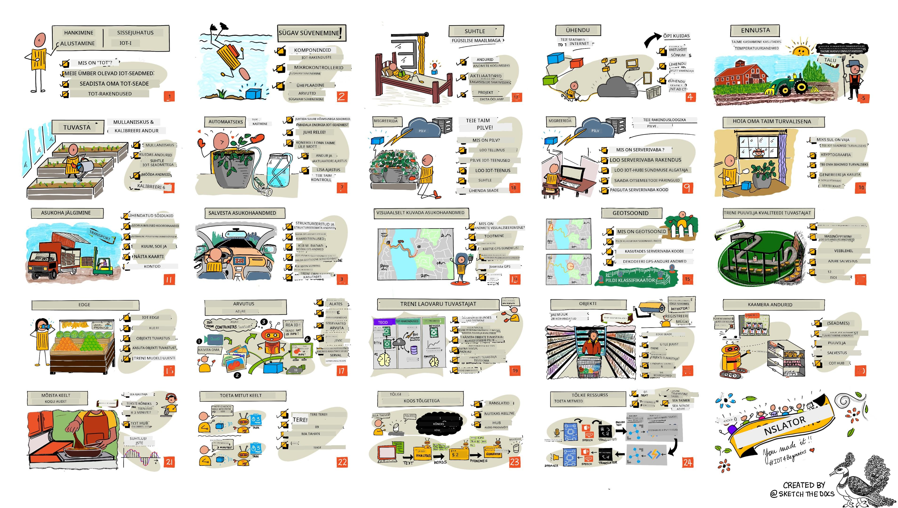

<!--
CO_OP_TRANSLATOR_METADATA:
{
  "original_hash": "6c354ec3487e4f6cfafbe44557996cd9",
  "translation_date": "2026-01-07T00:58:03+00:00",
  "source_file": "README.md",
  "language_code": "et"
}
-->
[](https://github.com/microsoft/IoT-For-Beginners/blob/master/LICENSE)
[](https://GitHub.com/microsoft/IoT-For-Beginners/graphs/contributors/)
[](https://GitHub.com/microsoft/IoT-For-Beginners/issues/)
[](https://GitHub.com/microsoft/IoT-For-Beginners/pulls/)
[](http://makeapullrequest.com)

[](https://GitHub.com/microsoft/IoT-For-Beginners/watchers/)
[](https://GitHub.com/microsoft/IoT-For-Beginners/network/)
[](https://GitHub.com/microsoft/IoT-For-Beginners/stargazers/)

### Liitu Azure AI Foundry kogukonnaga 

Kui sul tekib takistusi või küsimusi AI-rakenduste arendamisel, liitu teiste õppijate ja kogenud arendajatega MCP aruteludes. See on toetav kogukond, kus küsimused on oodatud ja teadmisi jagatakse vabalt.

[](https://discord.gg/nTYy5BXMWG)

Kui sul on tootearendus- või veateateid, külasta:

[](https://aka.ms/foundry/forum)

Järgi neid samme, et alustada nende ressursside kasutamist:
1. **Forka hoidla**: Klõpsa [](https://GitHub.com/microsoft/IoT-For-Beginners/fork)
2. **Klooni hoidla**:   `git clone https://github.com/microsoft/IoT-For-Beginners.git`
3. [**Liitu Microsoft Foundry Discordiga ja kohtuda ekspertide ning teiste arendajatega**](https://discord.com/invite/ByRwuEEgH4)


### 🌐 Mitmekeelne tugi

#### Toetatud GitHub Actioni kaudu (Automaatne ja alati ajakohane)

<!-- CO-OP TRANSLATOR LANGUAGES TABLE START -->
[Arabic](../ar/README.md) | [Bengali](../bn/README.md) | [Bulgarian](../bg/README.md) | [Burmese (Myanmar)](../my/README.md) | [Chinese (Simplified)](../zh/README.md) | [Chinese (Traditional, Hong Kong)](../hk/README.md) | [Chinese (Traditional, Macau)](../mo/README.md) | [Chinese (Traditional, Taiwan)](../tw/README.md) | [Croatian](../hr/README.md) | [Czech](../cs/README.md) | [Danish](../da/README.md) | [Dutch](../nl/README.md) | [Estonian](./README.md) | [Finnish](../fi/README.md) | [French](../fr/README.md) | [German](../de/README.md) | [Greek](../el/README.md) | [Hebrew](../he/README.md) | [Hindi](../hi/README.md) | [Hungarian](../hu/README.md) | [Indonesian](../id/README.md) | [Italian](../it/README.md) | [Japanese](../ja/README.md) | [Kannada](../kn/README.md) | [Korean](../ko/README.md) | [Lithuanian](../lt/README.md) | [Malay](../ms/README.md) | [Malayalam](../ml/README.md) | [Marathi](../mr/README.md) | [Nepali](../ne/README.md) | [Nigerian Pidgin](../pcm/README.md) | [Norwegian](../no/README.md) | [Persian (Farsi)](../fa/README.md) | [Polish](../pl/README.md) | [Portuguese (Brazil)](../br/README.md) | [Portuguese (Portugal)](../pt/README.md) | [Punjabi (Gurmukhi)](../pa/README.md) | [Romanian](../ro/README.md) | [Russian](../ru/README.md) | [Serbian (Cyrillic)](../sr/README.md) | [Slovak](../sk/README.md) | [Slovenian](../sl/README.md) | [Spanish](../es/README.md) | [Swahili](../sw/README.md) | [Swedish](../sv/README.md) | [Tagalog (Filipino)](../tl/README.md) | [Tamil](../ta/README.md) | [Telugu](../te/README.md) | [Thai](../th/README.md) | [Turkish](../tr/README.md) | [Ukrainian](../uk/README.md) | [Urdu](../ur/README.md) | [Vietnamese](../vi/README.md)

> **Eelistad kohalikku kloonimist?**

> See hoidla sisaldab üle 50 keele tõlkeid, mis suurendab oluliselt allalaadimise mahtu. Tõlgeteta kloonimiseks kasuta vähendatud koopiat:
> ```bash
> git clone --filter=blob:none --sparse https://github.com/microsoft/IoT-For-Beginners.git
> cd IoT-For-Beginners
> git sparse-checkout set --no-cone '/*' '!translations' '!translated_images'
> ```
> See annab sulle kõik vajaliku kursuse lõpuleviimiseks palju kiiremalt.
<!-- CO-OP TRANSLATOR LANGUAGES TABLE END -->

# IoT algajatele – Õppekava

Microsofti Azure Cloud Advocatesil on hea meel pakkuda 12-nädalast, 24-loengut koosnevat õppekava IoT põhitõdedest. Igas loengus on eelloengu ja järel-küsimustikud, kirjalikud juhised loengu läbimiseks, lahendus, ülesanne ja palju muud. Meie projektipõhine lähenemine võimaldab õppida praktiliselt, mis on tõestatud viis uute oskuste kinnistamiseks.

Projektid katavad toidu teekonda põllult lauale. See hõlmab põllumajandust, logistikat, tootmist, jaemüüki ning tarbijat – kõik populaarsed tööstusharud IoT seadmete jaoks.



> Sketchnote autor [Nitya Narasimhan](https://github.com/nitya). Vajuta pildile suurema versiooni jaoks.

**Suur tänu meie autoritele [Jen Fox](https://github.com/jenfoxbot), [Jen Looper](https://github.com/jlooper), [Jim Bennett](https://github.com/jimbobbennett) ja meie sketchnote artistile [Nitya Narasimhan](https://github.com/nitya).**

**Tänud ka meie [Microsoft Learn Student Ambassadors](https://studentambassadors.microsoft.com?WT.mc_id=academic-17441-jabenn) meeskonnale, kes on seda õppekava üle vaadanud ja tõlkinud – [Aditya Garg](https://github.com/AdityaGarg00), [Anurag Sharma](https://github.com/Anurag-0-1-A), [Arpita Das](https://github.com/Arpiiitaaa), [Aryan Jain](https://www.linkedin.com/in/aryan-jain-47a4a1145/), [Bhavesh Suneja](https://github.com/EliteWarrior315), [Faith Hunja](https://faithhunja.github.io/), [Lateefah Bello](https://www.linkedin.com/in/lateefah-bello/), [Manvi Jha](https://github.com/Severus-Matthew), [Mireille Tan](https://www.linkedin.com/in/mireille-tan-a4834819a/), [Mohammad Iftekher (Iftu) Ebne Jalal](https://github.com/Iftu119), [Mohammad Zulfikar](https://github.com/mohzulfikar), [Priyanshu Srivastav](https://www.linkedin.com/in/priyanshu-srivastav-b067241ba), [Thanmai Gowducheruvu](https://github.com/innovation-platform) ja [Zina Kamel](https://www.linkedin.com/in/zina-kamel/).**

Tutvu meeskonnaga!

[](https://youtu.be/-wippUJRi5k)

**Gif autor** [Mohit Jaisal](https://linkedin.com/in/mohitjaisal)

> 🎥 Vajuta ülalolevale pildile, et vaadata videot projektist!

> **Õpetajad**, oleme [lisanud mõned soovitused](for-teachers.md), kuidas seda õppekava kasutada. Kui soovid ise lektioone luua, oleme lisanud ka [loengumalli](lesson-template/README.md).

> **Õpilased** [https://aka.ms/student-page](https://aka.ms/student-page), et seda õppekava omapead kasutada, forkige kogu hoidla ja lahendage harjutused üksi, alustades eelloenguküsimustikuga, seejärel lugege loeng ning tehke ülejäänud tegevused. Püüdke projekte teha mõistes loenguid, mitte ainult kopeerides lahenduse koodi; see kood on ka kättesaadav /solutions kaustades igas projektipõhises loengus. Teine idee on moodustada sõpradega õpperühm ja sisuga koos tutvuda. Edasiseks õppimiseks soovitame [Microsoft Learn](https://docs.microsoft.com/users/jimbobbennett/collections/ke2ehd351jopwr?WT.mc_id=academic-17441-jabenn).

Selle kursuse videokokkuvõtte leiad siit:

[](https://youtube.com/watch?v=bccEMm8gRuc "Promo video")

> 🎥 Vajuta ülalolevale pildile, et vaadata videot projektist!

## Pedagoogika

Me oleme seda õppekava ehitades valinud kaks pedagoogilist põhimõtet: tagada, et see on projektipõhine ning sisaldab sagedasi testiküsimusi. Selle sarja lõpuks on õpilased loonud taime jälgimise ja kastmise süsteemi, sõiduki jälgija, nutika tehase ülesseadistuse toidu jälgimiseks ja kontrollimiseks ning hääljuhtimisega toiduvalmistamise taimeri. Samuti on nad omandanud asjatundmist asjade interneti põhitõdedes nagu seadme koodi kirjutamine, pilveühenduse loomine, telemeetria analüüs ja tehisintellekti kasutamine ääre seadmetes.

Sisuga projektide sobitamine muudab õpilaste jaoks protsessi kaasahaaravamaks ja aitab kontseptsioonide omandamist tugevdada.

Lisaks seab madalate panustega eelloengutest test õpilasele õppeesmärgi teemast aru saamiseks ning loengu järgse testiga tagatakse täiendav teadmiste kinnistamine. See õppekava on paindlik ja lõbus ning seda saab läbida tervikuna või osadena. Projektid algavad väikesest ja kasvavad järjest keerukamaks 12-nädalase tsükli lõpuks.

Iga projekt põhineb reaalsel riistvaral, mis on saadaval õpilastele ja harrastajatele. Iga projekt vaatleb konkreetset valdkonda, pakkudes asjakohast taustateavet. Eduka arendajana aitab valdkonna mõistmine, milles probleemi lahendad; taustateabe pakkumine võimaldab õppijatel mõelda oma IoT lahenduste ja õpingute üle reaalse maailma probleemide kontekstis, mida nad võivad IoT arendajana lahendada. Õpilased mõistavad, miks nad lahendusi ehitavad, ja saavad aru lõppkasutajast.

## Riistvara

Projektide jaoks on meil kaks IoT riistvara valikut, mis sõltuvad isiklikest eelistustest, programmeerimiskeele teadmistest või eelistustest, õppimiseesmärkidest ja kättesaadavusest. Samuti oleme pakkunud 'virtuaalse riistvara' versiooni neile, kellel riistvara pole, või kes soovivad enne ostu rohkem õppida. Rohkem infot ja 'ostunimekirja' leiad [riistvara leheküljelt](./hardware.md), sealhulgas lingid meie sõprade Seeed Studio poolt komplektide ostmiseks.
> 💁 Leia meie [käitumiskoodeks](CODE_OF_CONDUCT.md), [panustamise](CONTRIBUTING.md) ja [tõlkimise](TRANSLATIONS.md) juhendid. Ootame sinu konstruktiivset tagasisidet!
>
> 🔧 Kas sul on probleeme? Vaata meie [probleemide lahendamise juhendit](TROUBLESHOOTING.md), kust leiad lahendusi sagedastele probleemidele.

## Igas õppetükis on:

- pliiatsisketš
- valikuline lisavideo
- enne tundi soojendusküsimustik
- kirjalik õppetükk
- projektipõhiste tundide puhul samm-sammult juhendid projekti ehitamiseks
- teadmiste kontroll
- väljakutse
- täiendav lugemine
- ülesanne
- [pärastundi viktoriin](https://ff-quizzes.netlify.app/en/)

> **Märkused viktoriinide kohta**: Kõik viktoriinid asuvad quiz-app kaustas, kokku on 48 viktoriini, igaühes kolm küsimust. Neile viidatakse tundide sees, kuid viktoriinirakendust saab käivitada lokaalselt või juurutada Azure'i; järgi juhiseid `quiz-app` kaustas. Neid lokaliseeritakse järk-järgult.

## Õppetükid

|       |              Projekti nimi               |                        Õpitavad kontseptsioonid                        | Õpieesmärgid                                                                                                                                                       |                                                         Seotud õppetükk                                                         |
| :---: | :-------------------------------------: | :---------------------------------------------------------------------: | ----------------------------------------------------------------------------------------------------------------------------------------------------------------- | :------------------------------------------------------------------------------------------------------------------------------: |
|  01   | [Alustamine](./1-getting-started/README.md) |                       Sissejuhatus asjade internetti                      | Õpi IoT põhialuseid ja IoT lahenduste põhilisi komponente nagu andurid ja pilveteenused, samal ajal kui seadistad oma esimest IoT seadet                             |                       [Sissejuhatus asjade internetti](./1-getting-started/lessons/1-introduction-to-iot/README.md)                      |
|  02   | [Alustamine](./1-getting-started/README.md) |                          Sügavam pilguheit IoT-le                         | Õpi IoT süsteemi komponente, mikrokontrollereid ja üksikplaadilisi arvuteid paremini tundma                                                                         |                         [Sügavam pilguheit IoT-le](./1-getting-started/lessons/2-deeper-dive/README.md)                          |
|  03   | [Alustamine](./1-getting-started/README.md) |       Suhtlus füüsilise maailmaga andurite ja aktuaatoritega             | Õpi tundma andureid andmete kogumiseks füüsilisest maailmast ja aktuaatoreid tagasiside andmiseks, samal ajal kui ehitad öölampi                                          | [Suhtlus füüsilise maailmaga andurite ja aktuaatoritega](./1-getting-started/lessons/3-sensors-and-actuators/README.md) |
|  04   | [Alustamine](./1-getting-started/README.md) |                  Ühenda oma seade internetiga                          | Õpi, kuidas ühendada IoT seade internetiga sõnumite saatmiseks ja vastuvõtmiseks, ühendades öölambi MQTT vahendajaga                                                |                  [Ühenda oma seade internetiga](./1-getting-started/lessons/4-connect-internet/README.md)                  |
|  05   |            [Talu](./2-farm/README.md)             |                      Prognoosi taimede kasvu                            | Õpi, kuidas ennustada taimede kasvu IoT seadme jäädvustatud temperatuurandmete abil                                                                                  |                         [Prognoosi taimede kasvu](./2-farm/lessons/1-predict-plant-growth/README.md)                          |
|  06   |            [Talu](./2-farm/README.md)             |                      Tuvasta mulla niiskus                             | Õpi, kuidas tuvastada mulla niiskust ja kalibreerida mulla niiskuseandurit                                                                                         |                         [Tuvasta mulla niiskus](./2-farm/lessons/2-detect-soil-moisture/README.md)                          |
|  07   |            [Talu](./2-farm/README.md)             |                      Automaatne taimede kastmine                        | Õpi, kuidas automaatselt kastmist ajastada, kasutades releed ja MQTT-d                                                                                              |                      [Automaatne taimede kastmine](./2-farm/lessons/3-automated-plant-watering/README.md)                       |
|  08   |            [Talu](./2-farm/README.md)             |                      Migreeri taim pilve                               | Õpi pilve ja pilvepõhiste IoT teenuste kohta ning kuidas ühendada taimed sellesse avaliku MQTT võrgustiku asemel                                                    |                      [Migreeri taim pilve](./2-farm/lessons/4-migrate-your-plant-to-the-cloud/README.md)                       |
|  09   |            [Talu](./2-farm/README.md)             |                   Migreeri rakendusloogika pilve                       | Õpi, kuidas kirjutada rakendusloogikat pilves, mis reageerib IoT sõnumitele                                                                                        |               [Migreeri rakendusloogika pilve](./2-farm/lessons/5-migrate-application-to-the-cloud/README.md)                |
|  10   |            [Talu](./2-farm/README.md)             |                    Hoia oma taim turvalisena                          | Õpi IoT turvalisuse kohta ja kuidas hoida oma taime turvalisena võtmete ja sertifikaatidega                                                                        |                     [Hoia oma taim turvalisena](./2-farm/lessons/6-keep-your-plant-secure/README.md)                       |
|  11   |       [Transport](./3-transport/README.md)        |                      Asukoha jälgimine                               | Õpi GPS asukohajälgimise kohta IoT seadmete jaoks                                                                                                                 |                       [Asukoha jälgimine](./3-transport/lessons/1-location-tracking/README.md)                          |
|  12   |       [Transport](./3-transport/README.md)        |                      Salvesta asukoha andmed                         | Õpi, kuidas salvestada IoT andmeid hiljem visualiseerimiseks või analüüsimiseks                                                                                   |                        [Salvesta asukoha andmed](./3-transport/lessons/2-store-location-data/README.md)                     |
|  13   |       [Transport](./3-transport/README.md)        |                      Visualiseeri asukoha andmed                      | Õpi, kuidas kuvada asukohaandmeid kaardil ja kuidas kaardid esindavad reaalset 3D maailma 2 mõõtmelises ruumis                                                      |                        [Visualiseeri asukoha andmed](./3-transport/lessons/3-visualize-location-data/README.md)             |
|  14   |       [Transport](./3-transport/README.md)        |                          Geopiirid                                   | Õpi geopiiride kohta ja kuidas neid kasutada, et hoiatada, kui tarneahela sõidukid on oma sihtkoha lähedal                                                       |                                 [Geopiirid](./3-transport/lessons/4-geofences/README.md)                                  |
|  15   |   [Tootmine](./4-manufacturing/README.md)         |                   Treeni puuviljakvaliteedi tuvastajat              | Õpi pildiklassifikaatori treenimist pilves puuviljakvaliteedi tuvastamiseks                                                                                       |                   [Treeni puuviljakvaliteedi tuvastajat](./4-manufacturing/lessons/1-train-fruit-detector/README.md)          |
|  16   |   [Tootmine](./4-manufacturing/README.md)         |                Kontrolli puuviljakvaliteeti IoT seadme abil          | Õpi oma puuviljakvaliteedi tuvastajat kasutama IoT seadme kaudu                                                                                                   |                [Kontrolli puuviljakvaliteeti IoT seadme abil](./4-manufacturing/lessons/2-check-fruit-from-device/README.md)  |
|  17   |   [Tootmine](./4-manufacturing/README.md)         |                  Käivita oma puuviljatuvastaja servas                | Õpi oma puuviljakvaliteedi tuvastajat jooksutama IoT seadmes lähedal ehk servas                                                                                     |                  [Käivita oma puuviljatuvastaja servas](./4-manufacturing/lessons/3-run-fruit-detector-edge/README.md)         |
|  18   |   [Tootmine](./4-manufacturing/README.md)         |                 Käivita puuviljakvaliteedi tuvastus andurist          | Õpi, kuidas käivitada puuviljakvaliteedi tuvastus anduri abil                                                                                                    |               [Käivita puuviljakvaliteedi tuvastus andurist](./4-manufacturing/lessons/4-trigger-fruit-detector/README.md)      |
|  19   |          [Jaemüük](./5-retail/README.md)          |                      Treeni laoseisu tuvastajat                     | Õpi objektituvastust kasutades laoseisu tuvastajale treeningu andmist poe laoseisu lugemiseks                                                                     |                     [Treeni laoseisu tuvastajat](./5-retail/lessons/1-train-stock-detector/README.md)                       |
|  20   |          [Jaemüük](./5-retail/README.md)          |                     Kontrolli laoseisu IoT seadme abil              | Õpi kontrollima laoseisu IoT seadme abil, kasutades objektituvastusmudelit                                                                                         |                    [Kontrolli laoseisu IoT seadme abil](./5-retail/lessons/2-check-stock-device/README.md)                    |
|  21   |        [Kokatarbija](./6-consumer/README.md)        |                  Tuvasta kõne IoT seadme abil                        | Õpi tuvastama kõnet IoT seadmesse, et ehitada nutikas taimer                                                                                                     |                  [Tuvasta kõne IoT seadme abil](./6-consumer/lessons/1-speech-recognition/README.md)                         |
|  22   |        [Kokatarbija](./6-consumer/README.md)        |                      Mõista keelt                                      | Õpi mõistma IoT seadmele suunatud lauseid                                                                                                                        |                     [Mõista keelt](./6-consumer/lessons/2-language-understanding/README.md)                                 |
|  23   |        [Kokatarbija](./6-consumer/README.md)        |                  Sea taimer ja anna suuline tagasiside                 | Õpi seadistama taimerit IoT seadmes ja andma suulist tagasisidet timeri käivitamisel ja lõppemisel                                                                |               [Sea taimer ja anna suuline tagasiside](./6-consumer/lessons/3-spoken-feedback/README.md)                     |
|  24   |        [Kokatarbija](./6-consumer/README.md)        |                    Toeta mitut keelt                                 | Õpi toetama mitut keelt, nii kõnekeelt kui ka nutika taimeri vastuseid                                                                                            |                  [Toeta mitut keelt](./6-consumer/lessons/4-multiple-language-support/README.md)                            |

## Võrguühenduseta juurdepääs

Seda dokumentatsiooni saab kasutada võrguühenduseta, kasutades [Docsify](https://docsify.js.org/#/). Tee selle reposse fork, [paigalda Docsify](https://docsify.js.org/#/quickstart) oma kohalikku masinasse ja seejärel käivita selle repo juurkaustas käsk `docsify serve`. Veebileht teenindatakse pordil 3000 sinu localhostis: `localhost:3000`.

## Viktoriin

Tänu kogukonnale interaktiivse viktoriini korraldamise eest, mis testib sinu teadmisi iga peatüki kohta. Oma teadmisi saad testi panna [siin](https://ff-quizzes.netlify.app/en/). 

### PDF

Vajadusel saad sellest sisust võrguühenduseta juurdepääsuks genereerida PDF-faili. Selleks veendu, et sul oleks [npm paigaldatud](https://docs.npmjs.com/downloading-and-installing-node-js-and-npm) ning käivita järgnevad käsud selle repo juurkaustas:

```sh
npm i
npm run convert
```

### Esitlused

Mõne õppetüki kohta on saadaval slaidiesitlused kaustas [slides](../../slides).


## Muud õppekavad

Meie meeskond toodab ka teisi õppekavu! Vaata lähemalt:

<!-- CO-OP TRANSLATOR OTHER COURSES START -->
### LangChain
[](https://aka.ms/langchain4j-for-beginners)
[](https://aka.ms/langchainjs-for-beginners?WT.mc_id=m365-94501-dwahlin)

---

### Azure / Serva / MCP / Agendid
[](https://github.com/microsoft/AZD-for-beginners?WT.mc_id=academic-105485-koreyst)
[](https://github.com/microsoft/edgeai-for-beginners?WT.mc_id=academic-105485-koreyst)
[](https://github.com/microsoft/mcp-for-beginners?WT.mc_id=academic-105485-koreyst)
[](https://github.com/microsoft/ai-agents-for-beginners?WT.mc_id=academic-105485-koreyst)

---
 
### Generatiivse tehisintellekti sari
[](https://github.com/microsoft/generative-ai-for-beginners?WT.mc_id=academic-105485-koreyst)
[-9333EA?style=for-the-badge&labelColor=E5E7EB&color=9333EA)](https://github.com/microsoft/Generative-AI-for-beginners-dotnet?WT.mc_id=academic-105485-koreyst)
[-C084FC?style=for-the-badge&labelColor=E5E7EB&color=C084FC)](https://github.com/microsoft/generative-ai-for-beginners-java?WT.mc_id=academic-105485-koreyst)
[-E879F9?style=for-the-badge&labelColor=E5E7EB&color=E879F9)](https://github.com/microsoft/generative-ai-with-javascript?WT.mc_id=academic-105485-koreyst)

---
 
### Põhioskused
[](https://aka.ms/ml-beginners?WT.mc_id=academic-105485-koreyst)
[](https://aka.ms/datascience-beginners?WT.mc_id=academic-105485-koreyst)
[](https://aka.ms/ai-beginners?WT.mc_id=academic-105485-koreyst)
[](https://github.com/microsoft/Security-101?WT.mc_id=academic-96948-sayoung)
[](https://aka.ms/webdev-beginners?WT.mc_id=academic-105485-koreyst)
[](https://aka.ms/iot-beginners?WT.mc_id=academic-105485-koreyst)
[](https://github.com/microsoft/xr-development-for-beginners?WT.mc_id=academic-105485-koreyst)

---
 
### CoPiloti sari
[](https://aka.ms/GitHubCopilotAI?WT.mc_id=academic-105485-koreyst)
[](https://github.com/microsoft/mastering-github-copilot-for-dotnet-csharp-developers?WT.mc_id=academic-105485-koreyst)
[](https://github.com/microsoft/CopilotAdventures?WT.mc_id=academic-105485-koreyst)
<!-- CO-OP TRANSLATOR OTHER COURSES END -->

## Piltide autorid

Kõik selle õppekava kasutatavate piltide autorid leiate vajadusel [Attributions](./attributions.md) failist.

---

<!-- CO-OP TRANSLATOR DISCLAIMER START -->
**Vastutusest loobumine**:  
See dokument on tõlgitud kasutades AI tõlketeenust [Co-op Translator](https://github.com/Azure/co-op-translator). Kuigi püüame tagada täpsust, palun arvestage, et automaatsed tõlked võivad sisaldada vigu või ebatäpsusi. Originaaldokument selle algkeeles tuleks pidada autoriteetseks allikaks. Tähtsa teabe puhul soovitatakse kasutada professionaalset inimtõlget. Me ei vastuta selle tõlke kasutamisest tulenevate arusaamatuste ega valesti mõistmiste eest.
<!-- CO-OP TRANSLATOR DISCLAIMER END -->