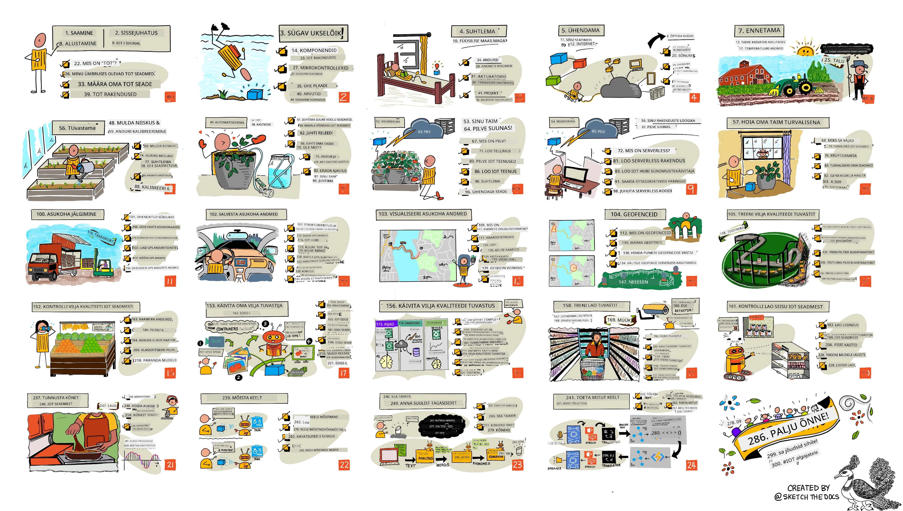

[](https://github.com/microsoft/IoT-For-Beginners/blob/master/LICENSE)
[](https://GitHub.com/microsoft/IoT-For-Beginners/graphs/contributors/)
[](https://GitHub.com/microsoft/IoT-For-Beginners/issues/)
[](https://GitHub.com/microsoft/IoT-For-Beginners/pulls/)
[](http://makeapullrequest.com)

[](https://GitHub.com/microsoft/IoT-For-Beginners/watchers/)
[](https://GitHub.com/microsoft/IoT-For-Beginners/network/)
[](https://GitHub.com/microsoft/IoT-For-Beginners/stargazers/)

### Liitu Azure AI Foundry kogukonnaga

Kui sa jääd hätta või sul on küsimusi AI rakenduste loomise kohta. Liitu kaasõppurite ja kogenud arendajatega MCP arutelufoorumis. See on toetav kogukond, kus küsimused on oodatud ja teadmisi jagatakse vabalt.

[](https://discord.gg/nTYy5BXMWG)

Kui sul on tootearenduse tagasisidet või ehitamisel esineb vigu, külasta:

[](https://aka.ms/foundry/forum)

Järgi neid samme, et alustada nende ressursside kasutamist:
1. **Tee hoidlast fordikloon**: Klõpsa [](https://GitHub.com/microsoft/IoT-For-Beginners/fork)
2. **Loo hoidla kloon arvutisse**:   `git clone https://github.com/microsoft/IoT-For-Beginners.git`
3. [**Liitu Microsoft Foundry Discordiga ja kohtusid ekspertide ning teiste arendajatega**](https://discord.com/invite/ByRwuEEgH4)


### 🌐 Mitmekeelne tugi

#### GitHub Actioni abil toetatud (Automaatne ja alati ajakohane)

<!-- CO-OP TRANSLATOR LANGUAGES TABLE START -->
[Arabic](../ar/README.md) | [Bengali](../bn/README.md) | [Bulgarian](../bg/README.md) | [Burmese (Myanmar)](../my/README.md) | [Chinese (Simplified)](../zh-CN/README.md) | [Chinese (Traditional, Hong Kong)](../zh-HK/README.md) | [Chinese (Traditional, Macau)](../zh-MO/README.md) | [Chinese (Traditional, Taiwan)](../zh-TW/README.md) | [Croatian](../hr/README.md) | [Czech](../cs/README.md) | [Danish](../da/README.md) | [Dutch](../nl/README.md) | [Estonian](./README.md) | [Finnish](../fi/README.md) | [French](../fr/README.md) | [German](../de/README.md) | [Greek](../el/README.md) | [Hebrew](../he/README.md) | [Hindi](../hi/README.md) | [Hungarian](../hu/README.md) | [Indonesian](../id/README.md) | [Italian](../it/README.md) | [Japanese](../ja/README.md) | [Kannada](../kn/README.md) | [Khmer](../km/README.md) | [Korean](../ko/README.md) | [Lithuanian](../lt/README.md) | [Malay](../ms/README.md) | [Malayalam](../ml/README.md) | [Marathi](../mr/README.md) | [Nepali](../ne/README.md) | [Nigerian Pidgin](../pcm/README.md) | [Norwegian](../no/README.md) | [Persian (Farsi)](../fa/README.md) | [Polish](../pl/README.md) | [Portuguese (Brazil)](../pt-BR/README.md) | [Portuguese (Portugal)](../pt-PT/README.md) | [Punjabi (Gurmukhi)](../pa/README.md) | [Romanian](../ro/README.md) | [Russian](../ru/README.md) | [Serbian (Cyrillic)](../sr/README.md) | [Slovak](../sk/README.md) | [Slovenian](../sl/README.md) | [Spanish](../es/README.md) | [Swahili](../sw/README.md) | [Swedish](../sv/README.md) | [Tagalog (Filipino)](../tl/README.md) | [Tamil](../ta/README.md) | [Telugu](../te/README.md) | [Thai](../th/README.md) | [Turkish](../tr/README.md) | [Ukrainian](../uk/README.md) | [Urdu](../ur/README.md) | [Vietnamese](../vi/README.md)

> **Eelistad kloonida kohalikult?**
>
> See hoidla sisaldab 50+ keele tõlget, mis suurendab oluliselt allalaaditava faili suurust. Keeletõlgeteta kloonimiseks kasuta sparsi valikut:
>
> **Bash / macOS / Linux:**
> ```bash
> git clone --filter=blob:none --sparse https://github.com/microsoft/IoT-For-Beginners.git
> cd IoT-For-Beginners
> git sparse-checkout set --no-cone '/*' '!translations' '!translated_images'
> ```
>
> **CMD (Windows):**
> ```cmd
> git clone --filter=blob:none --sparse https://github.com/microsoft/IoT-For-Beginners.git
> cd IoT-For-Beginners
> git sparse-checkout set --no-cone "/*" "!translations" "!translated_images"
> ```
>
> See annab sulle kõik, mida vajad kursuse lõpetamiseks kiiremini.
<!-- CO-OP TRANSLATOR LANGUAGES TABLE END -->

# IoT algajatele - õppekava

Microsofti Azure Cloud Advocates pakuvad rõõmuga 12-nädalast, 24-õpet loengut käsitlevat õppekava, mis on täielikult pühendatud IoT põhialustele. Igas õppetükis on eelkoolituse ja järeltööna viktoriinid, kirjalikud juhised ülesande lõpetamiseks, lahendus, kodutöö ja muud materiaalid. Meie projektipõhine pedagoogika võimaldab sul õppida, ehitades, mis on tõhus viis uute oskuste kinnistamiseks.

Projektid käsitlevad toidu teekonda talust lauale. See hõlmab põllumajandust, logistikat, tootmist, jaemüüki ja tarbijaid - kõik populaarsed IoT seadmete tööstusharud.



> Sketchnote autoriks on [Nitya Narasimhan](https://github.com/nitya). Klõpsa pildil suurema versiooni saamiseks.

**Südamlikud tänud meie autoritele [Jen Fox](https://github.com/jenfoxbot), [Jen Looper](https://github.com/jlooper), [Jim Bennett](https://github.com/jimbobbennett) ning meie sketchnote kunstnikule [Nitya Narasimhan](https://github.com/nitya).**

**Tänud ka meie [Microsoft Learn tudengisaatjate](https://studentambassadors.microsoft.com?WT.mc_id=academic-17441-jabenn) meeskonnale, kes on seda õppekava üle vaadanud ja tõlkinud - [Aditya Garg](https://github.com/AdityaGarg00), [Anurag Sharma](https://github.com/Anurag-0-1-A), [Arpita Das](https://github.com/Arpiiitaaa), [Aryan Jain](https://www.linkedin.com/in/aryan-jain-47a4a1145/), [Bhavesh Suneja](https://github.com/EliteWarrior315), [Faith Hunja](https://faithhunja.github.io/), [Lateefah Bello](https://www.linkedin.com/in/lateefah-bello/), [Manvi Jha](https://github.com/Severus-Matthew), [Mireille Tan](https://www.linkedin.com/in/mireille-tan-a4834819a/), [Mohammad Iftekher (Iftu) Ebne Jalal](https://github.com/Iftu119), [Mohammad Zulfikar](https://github.com/mohzulfikar), [Priyanshu Srivastav](https://www.linkedin.com/in/priyanshu-srivastav-b067241ba), [Thanmai Gowducheruvu](https://github.com/innovation-platform) ja [Zina Kamel](https://www.linkedin.com/in/zina-kamel/).**

Tutvu meeskonnaga!

[](https://youtu.be/-wippUJRi5k)

**Gif autor:** [Mohit Jaisal](https://linkedin.com/in/mohitjaisal)

> 🎥 Klõpsa ülaltoodud pildil, et vaadata projekti videot!

> **Õpetajad**, me oleme lisanud [mõningaid soovitusi](for-teachers.md), kuidas seda õppekava kasutada. Kui soovite luua omaenda õppetükke, oleme lisanud ka [õppetüki malli](lesson-template/README.md).

> **Õpilased** ([vaata siit](https://aka.ms/student-page)), selle õppekava enda jaoks kasutamiseks tee kogu hoidlast ford ja vii harjutused läbi iseseisvalt, alates eelloengu viktoriinist, siis loe loeng ja lõpeta ülejäänud tegevused. Proovi projekte luua õppetükkide mõistmisel, mitte kopeerides lahenduse koodi; selle koodiga saab tuttavaks iga projektipõhise õppetüki lahenduste kaustas. Teine võimalus on moodustada sõpradega õpperühm ja sisuga koos edasi liikuda. Täiendavaks õppimiseks soovitame [Microsoft Learnit](https://docs.microsoft.com/users/jimbobbennett/collections/ke2ehd351jopwr?WT.mc_id=academic-17441-jabenn).

Selle kursuse videoülevaate jaoks vaata seda videot:

[](https://youtube.com/watch?v=bccEMm8gRuc "Promo video")

> 🎥 Klõpsa ülaltoodud pildil, et vaadata projekti videot!

## Pedagoogika

Meie õppekava koostamisel valisime kaks pedagoogilist põhimõtet: tagada, et see on projektipõhine ja sisaldab sagedasi viktoriine. Selle sarja lõpuks on õppijad ehitanud taime jälgimise ja kastmisesüsteemi, sõiduki jälgija, nutika tehase ülesseadmise toidu jälgimiseks ja kontrollimiseks ning hääljuhtimisega kokkamisaja taimeri ning õppinud IoT põhialused, sealhulgas seadmekoodi kirjutamise, pilveühenduse loomise, telemeetria analüüsi ja tehisintellekti kasutamise ääres.

Sisuga projektide kooskõlastamine muudab õppeprotsessi õppijate jaoks kaasahaaravamaks ja suurendab kontseptsioonide omandamist.

Lisaks seab madala panusega viktoriin enne tundi õppija mõtteviisi selle teema õppimiseks, samas kui teine viktoriin pärast tundi tagab edasise omandamise. See õppekava on paindlik ja lõbus ning seda saab võtta terviklikult või osadena. Projektid algavad väikestena ja muutuvad 12-nädalase tsükli lõpuks järjest keerukamaks.

Iga projekt põhineb reaalse maailma riistvaral, mis on kättesaadav õppijatele ja harrastajatele. Iga projekt keskendub konkreetsele domeenile, pakkudes asjakohast taustainfot. Edukaks arendajaks olemiseks on kasulik mõista domeeni, milles probleeme lahendad, võimaldades õppijatel mõelda nende IoT lahenduste ja õppetükkide kontekstis just sellise reaalse maailma probleemi seisukohalt, mida neilt IoT arendajana võidakse nõuda. Õppijad saavad aru lahenduste „miks“-st ning hindavad lõppkasutajat.

## Riistvara
Meil on projekti jaoks valida kaks IoT riistvara võimalust, sõltuvalt isiklikest eelistustest, programmeerimiskeele teadmistest või eelistustest, õpieesmärkidest ja saadavusest. Oleme pakkunud ka 'virtuaalse riistvara' versiooni neile, kellel pole juurdepääsu riistvarale või kes soovivad enne ostu sooritamist rohkem õppida. Rohkem infot ja 'ostunimekirja' leiate [riistvara lehelt](./hardware.md), sealhulgas lingid komplektide ostmiseks meie sõpradelt Seeed Studio-st.

> 💁 Leidke meie [Käitumiskoodeks](CODE_OF_CONDUCT.md), [Panustamise](CONTRIBUTING.md) ja [Tõlke](..) juhised. Ootame teie konstruktiivset tagasisidet!
>
> 🔧 Kas teil on probleeme? Vaadake meie [Tõrkeotsingu juhendit](TROUBLESHOOTING.md), et leida lahendusi levinud probleemidele.

## Iga õppetund sisaldab:

- sketšimärkmeid
- valikulist lisa videot
- enne õppetundi soojendusküsimustikku
- kirjalikku õppetundi
- projektipõhiste õppetundide korral samm-sammult juhendeid projekti ehitamiseks
- teadmiste kontrolli
- väljakutset
- lisa lugemist
- ülesannet
- [järgnev quiz õppetunni lõpus](https://ff-quizzes.netlify.app/en/)

> **Märkus kvizzide kohta**: Kõik quizzid asuvad quiz-app kaustas, kokku 48 kvizzi, igaühes kolm küsimust. Neile viidatakse õppetundide sees, kuid quiz rakendust saab käivitada lokaalselt või paigutada Azure-sse; järgige juhiseid `quiz-app` kaustas. Neid lokaliseeritakse järk-järgult.

## Õppetunnid

|       |              Projekti nimi               |                         Õpiväljundid                          | Õpieesmärgid                                                                                                                                                       |                                                        Lingitud õppetund                                                        |
| :---: | :-------------------------------------: | :------------------------------------------------------------: | ----------------------------------------------------------------------------------------------------------------------------------------------------------------- | :--------------------------------------------------------------------------------------------------------------------------------: |
|  01   | [Alustamine](./1-getting-started/README.md) |                      Sissejuhatus IoT-sse                      | Õppige IoT põhimõtteid ja IoT lahenduste põhielemente nagu andurid ja pilveteenused, samal ajal kui seadistate oma esimest IoT seadet                              |                      [Sissejuhatus IoT-sse](./1-getting-started/lessons/1-introduction-to-iot/README.md)                       |
|  02   | [Alustamine](./1-getting-started/README.md) |                     Parem ülevaade IoT-st                      | Õppige rohkem IoT süsteemi komponentide kohta, samuti mikrojuhtplokkide ja üheplaadiliste arvutite kohta                                                           |                        [Paremat ülevaadet IoT-sse](./1-getting-started/lessons/2-deeper-dive/README.md)                        |
|  03   | [Alustamine](./1-getting-started/README.md) | Suhtlemine füüsilise maailmaga andurite ja aktuaatoritega     | Õppige tundma andureid andmete kogumiseks füüsilisest maailmast ja aktuaatoreid tagasiside saatmiseks, ehitades öövalgustit                                         | [Suhtlemine füüsilise maailmaga andurite ja aktuaatoritega](./1-getting-started/lessons/3-sensors-and-actuators/README.md) |
|  04   | [Alustamine](./1-getting-started/README.md) |                   Ühendamine seadmega internetti               | Õppige, kuidas ühendada IoT seade internetti sõnumite saatmiseks ja vastuvõtmiseks, ühendades oma öövalgusti MQTT vahendajaga                                      |                 [Ühendamine seadmega internetti](./1-getting-started/lessons/4-connect-internet/README.md)                   |
|  05   |            [Talu](./2-farm/README.md)            |                      Taimede kasvu ennustamine                 | Õppige taimede kasvu ennustamist temperatuuriandmete põhjal, mida kogub IoT seade                                                                                   |                          [Taimede kasvu ennustamine](./2-farm/lessons/1-predict-plant-growth/README.md)                        |
|  06   |            [Talu](./2-farm/README.md)            |                Mulla niiskuse tuvastamine                      | Õppige mulla niiskuse tuvastamist ja mulla niiskuse anduri kalibreerimist                                                                                          |                          [Mulla niiskuse tuvastamine](./2-farm/lessons/2-detect-soil-moisture/README.md)                       |
|  07   |            [Talu](./2-farm/README.md)            |                     Automaatne taimede kastmine                | Õppige, kuidas automatiseerida ja ajastada kastmist relee ja MQTT abil                                                                                             |                     [Automaatne taimede kastmine](./2-farm/lessons/3-automated-plant-watering/README.md)                       |
|  08   |            [Talu](./2-farm/README.md)            |                  Taime migreerimine pilve                      | Õppige pilvest ja pilve IoT teenustest ning kuidas ühendada oma taim mõne sellise teenusega avaliku MQTT vahendaja asemel                                          |                [Taime migreerimine pilve](./2-farm/lessons/4-migrate-your-plant-to-the-cloud/README.md)                      |
|  09   |            [Talu](./2-farm/README.md)            |           Rakenduse loogika migreerimine pilve                 | Õppige, kuidas kirjutada pilves rakenduse loogikat, mis reageerib IoT sõnumitele                                                                                   |          [Rakenduse loogika migreerimine pilve](./2-farm/lessons/5-migrate-application-to-the-cloud/README.md)               |
|  10   |            [Talu](./2-farm/README.md)            |                       Taimede turvalisus                        | Õppige IoT turvalisust ja kuidas hoida oma taime turvalisena võtmete ja sertifikaatidega                                                                            |                         [Taimede turvalisus](./2-farm/lessons/6-keep-your-plant-secure/README.md)                             |
|  11   |       [Transport](./3-transport/README.md)       |                       Asukoha jälgimine                         | Õppige GPS asukoha jälgimist IoT seadmetes                                                                                                                        |                          [Asukoha jälgimine](./3-transport/lessons/1-location-tracking/README.md)                             |
|  12   |       [Transport](./3-transport/README.md)       |                       Asukoha andmete salvestamine             | Õppige, kuidas salvestada IoT andmeid hilisemaks visualiseerimiseks või analüüsiks                                                                                 |                        [Asukoha andmete salvestamine](./3-transport/lessons/2-store-location-data/README.md)                  |
|  13   |       [Transport](./3-transport/README.md)       |                      Asukoha andmete visualiseerimine          | Õppige, kuidas visualiseerida asukoha andmeid kaardil ning kuidas kaardid esindavad reaalse 3D maailma 2 dimentsioonis                                             |                    [Asukoha andmete visualiseerimine](./3-transport/lessons/3-visualize-location-data/README.md)             |
|  14   |       [Transport](./3-transport/README.md)       |                           Geopiirid                            | Õppige geopiiride kohta ja kuidas neid kasutada, et hoiatada, kui tarneahela sõidukid on sihtkoha lähedal                                                         |                                 [Geopiirid](./3-transport/lessons/4-geofences/README.md)                                       |
|  15   |   [Tootmine](./4-manufacturing/README.md)   |                 Puu kvaliteedi detektori koolitus               | Õppige pilves pildiklassifikaatori koolitamist puu kvaliteedi tuvastamiseks                                                                                        |                  [Puu kvaliteedi detektori koolitus](./4-manufacturing/lessons/1-train-fruit-detector/README.md)               |
|  16   |   [Tootmine](./4-manufacturing/README.md)   |              Puukvaliteedi kontroll IoT seadmest                | Õppige puukvaliteedi detektori kasutamist IoT seadme kaudu                                                                                                        |               [Puukvaliteedi kontroll IoT seadmest](./4-manufacturing/lessons/2-check-fruit-from-device/README.md)             |
|  17   |   [Tootmine](./4-manufacturing/README.md)   |                 Käivitage puukvaliteedi tuvastus ääres          | Õppige puukvaliteedi detektori käivitamist IoT seadmel ääre seadmena                                                                                              |                 [Käivitage puukvaliteedi tuvastus ääres](./4-manufacturing/lessons/3-run-fruit-detector-edge/README.md)        |
|  18   |   [Tootmine](./4-manufacturing/README.md)   |                Käivitamine puukvaliteedi tuvastuseks andurilt  | Õppige puukvaliteedi tuvastuse käivitamist anduri abil                                                                                                           |            [Käivitage puukvaliteedi tuvastus andurilt](./4-manufacturing/lessons/4-trigger-fruit-detector/README.md)           |
|  19   |          [Jaemüük](./5-retail/README.md)          |                   Laoseisu tuvastamise koolitus                | Õppige objektituvastuse kasutamist laoseisu lugemiseks poes                                                                                                       |                       [Laoseisu tuvastamise koolitus](./5-retail/lessons/1-train-stock-detector/README.md)                     |
|  20   |          [Jaemüük](./5-retail/README.md)          |                 Laoseisu kontroll IoT seadmest                  | Õppige laoseisu kontrollimist IoT seadme kaudu kasutades objektituvastusmuda                                                                                     |                    [Laoseisu kontroll IoT seadmest](./5-retail/lessons/2-check-stock-device/README.md)                         |
|  21   |        [Tarbijale](./6-consumer/README.md)        |                Kõnetuvastus IoT seadmega                        | Õppige kõnetuvastust IoT seadme abil, et ehitada nutikas taimer                                                                                                  |                  [Kõnetuvastus IoT seadmega](./6-consumer/lessons/1-speech-recognition/README.md)                               |
|  22   |        [Tarbijale](./6-consumer/README.md)        |                  Keele mõistmine                               | Õppige, kuidas mõista IoT seadmele öeldud lauseid                                                                                                                |                         [Keele mõistmine](./6-consumer/lessons/2-language-understanding/README.md)                             |
|  23   |        [Tarbijale](./6-consumer/README.md)        |             Ajastaja seadmine ja suuline tagasiside            | Õppige, kuidas seadistada IoT seadmel ajastajat ning anda suuline tagasiside selle käivitumise ja lõpetamise kohta                                                 |                [Ajastaja seadmine ja suuline tagasiside](./6-consumer/lessons/3-spoken-feedback/README.md)                      |
|  24   |        [Tarbijale](./6-consumer/README.md)        |                Mitme keele toe pakkumine                        | Õppige, kuidas toetada mitut keelt – nii kõnelemisel kui nutika ajastaja vastustes                                                                                |                  [Mitme keele toe pakkumine](./6-consumer/lessons/4-multiple-language-support/README.md)                       |

## Offline ligipääs

Seda dokumentatsiooni saate kasutada ka võrguühenduseta, kasutades [Docsify](https://docsify.js.org/#/). Forkige see repo, [paigaldage Docsify](https://docsify.js.org/#/quickstart) oma kohalikule masinale, seejärel selle repo juurkaustas tippige `docsify serve`. Veebisait saab kättesaadavaks pordil 3000 aadressil `localhost:3000`.

## Kvizz

Tänu kogukonnale interaktiivse kvizzi majutamise eest, mis testib teie teadmisi iga peatüki kohta. Testige oma teadmisi [siin](https://ff-quizzes.netlify.app/en/)

### PDF

Selle sisu PDF-i saate luua võrguühenduseta kasutamiseks, kui vaja. Selleks veenduge, et teil on [npm paigaldatud](https://docs.npmjs.com/downloading-and-installing-node-js-and-npm) ja käivitage järgmised käsud selle repo juurkaustas:

```sh
npm i
npm run convert
```

### Slaidid

Mõne õppetunni slaidid asuvad [slides](../../slides) kaustas.


## Muud õppekavad

Meie meeskond toodab ka muid õppekavu! Vaadake:

<!-- CO-OP TRANSLATOR OTHER COURSES START -->
### LangChain
[](https://aka.ms/langchain4j-for-beginners)
[](https://aka.ms/langchainjs-for-beginners?WT.mc_id=m365-94501-dwahlin)
[](https://github.com/microsoft/langchain-for-beginners?WT.mc_id=m365-94501-dwahlin)
---

### Azure / Edge / MCP / Agendid
[](https://github.com/microsoft/AZD-for-beginners?WT.mc_id=academic-105485-koreyst)
[](https://github.com/microsoft/edgeai-for-beginners?WT.mc_id=academic-105485-koreyst)
[](https://github.com/microsoft/mcp-for-beginners?WT.mc_id=academic-105485-koreyst)
[](https://github.com/microsoft/ai-agents-for-beginners?WT.mc_id=academic-105485-koreyst)

---
 
### Generatiivse tehisintellekti seeria
[](https://github.com/microsoft/generative-ai-for-beginners?WT.mc_id=academic-105485-koreyst)
[-9333EA?style=for-the-badge&labelColor=E5E7EB&color=9333EA)](https://github.com/microsoft/Generative-AI-for-beginners-dotnet?WT.mc_id=academic-105485-koreyst)
[-C084FC?style=for-the-badge&labelColor=E5E7EB&color=C084FC)](https://github.com/microsoft/generative-ai-for-beginners-java?WT.mc_id=academic-105485-koreyst)
[-E879F9?style=for-the-badge&labelColor=E5E7EB&color=E879F9)](https://github.com/microsoft/generative-ai-with-javascript?WT.mc_id=academic-105485-koreyst)

---
 
### Põhialused
[](https://aka.ms/ml-beginners?WT.mc_id=academic-105485-koreyst)
[](https://aka.ms/datascience-beginners?WT.mc_id=academic-105485-koreyst)
[](https://aka.ms/ai-beginners?WT.mc_id=academic-105485-koreyst)
[](https://github.com/microsoft/Security-101?WT.mc_id=academic-96948-sayoung)
[](https://aka.ms/webdev-beginners?WT.mc_id=academic-105485-koreyst)
[](https://aka.ms/iot-beginners?WT.mc_id=academic-105485-koreyst)
[](https://github.com/microsoft/xr-development-for-beginners?WT.mc_id=academic-105485-koreyst)

---
 
### Co-piloodi seeria
[](https://aka.ms/GitHubCopilotAI?WT.mc_id=academic-105485-koreyst)
[](https://github.com/microsoft/mastering-github-copilot-for-dotnet-csharp-developers?WT.mc_id=academic-105485-koreyst)
[](https://github.com/microsoft/CopilotAdventures?WT.mc_id=academic-105485-koreyst)
<!-- CO-OP TRANSLATOR OTHER COURSES END -->

## Piltide autorlus

Kõiki selle õppekava piltide autorlusi, kus see on vajalik, leiate [Attribuutidest](./attributions.md).

---

<!-- CO-OP TRANSLATOR DISCLAIMER START -->
**Vastutusest loobumine**:  
See dokument on tõlgitud kasutades AI tõlketeenust [Co-op Translator](https://github.com/Azure/co-op-translator). Kuigi püüame täpsust, tuleb arvestada, et automatiseeritud tõlked võivad sisaldada vigu või ebatäpsusi. Originaaldokument selles emakeeles tuleb pidada autoriteetseks allikaks. Olulise info puhul soovitatakse kasutada professionaalset inimtõlget. Me ei vastuta selle tõlke kasutamisest tulenevate arusaamatuste või valesti mõistmiste eest.
<!-- CO-OP TRANSLATOR DISCLAIMER END -->