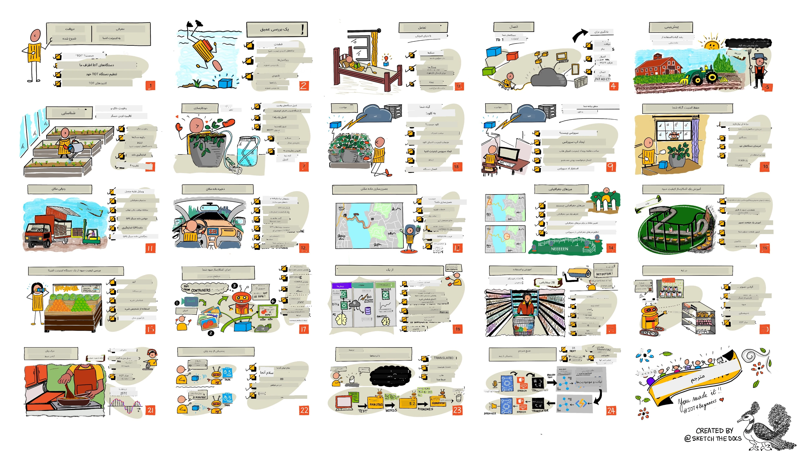

<!--
CO_OP_TRANSLATOR_METADATA:
{
  "original_hash": "6c354ec3487e4f6cfafbe44557996cd9",
  "translation_date": "2026-01-05T17:20:51+00:00",
  "source_file": "README.md",
  "language_code": "fa"
}
-->
[](https://github.com/microsoft/IoT-For-Beginners/blob/master/LICENSE)
[](https://GitHub.com/microsoft/IoT-For-Beginners/graphs/contributors/)
[](https://GitHub.com/microsoft/IoT-For-Beginners/issues/)
[](https://GitHub.com/microsoft/IoT-For-Beginners/pulls/)
[](http://makeapullrequest.com)

[](https://GitHub.com/microsoft/IoT-For-Beginners/watchers/)
[](https://GitHub.com/microsoft/IoT-For-Beginners/network/)
[](https://GitHub.com/microsoft/IoT-For-Beginners/stargazers/)

### به جامعه Azure AI Foundry بپیوندید

اگر در ساخت برنامه‌های هوش مصنوعی گیر کرده‌اید یا سوالی دارید، به همراه یادگیرندگان دیگر و توسعه‌دهندگان باتجربه در بحث‌ها درباره MCP شرکت کنید. این یک جامعه حمایتی است که در آن سوالات مورد استقبال قرار می‌گیرند و دانش به‌صورت رایگان به اشتراک گذاشته می‌شود.

[](https://discord.gg/nTYy5BXMWG)

اگر بازخورد محصول یا خطاهایی در هنگام ساخت دارید، به اینجا مراجعه کنید:

[](https://aka.ms/foundry/forum)

مراحل زیر را برای شروع استفاده از این منابع دنبال کنید:
1. **شعبه‌برداری مخزن**: کلیک کنید [](https://GitHub.com/microsoft/IoT-For-Beginners/fork)
2. **کلون کردن مخزن**:   `git clone https://github.com/microsoft/IoT-For-Beginners.git`
3. [**به Discord جامعه Microsoft Foundry بپیوندید و با کارشناسان و توسعه‌دهندگان آشنا شوید**](https://discord.com/invite/ByRwuEEgH4)

### 🌐 پشتیبانی چندزبانه

#### پشتیبانی شده با GitHub Action (خودکار و همیشه به‌روز)

<!-- CO-OP TRANSLATOR LANGUAGES TABLE START -->
[عربی](../ar/README.md) | [بنگالی](../bn/README.md) | [بلغاری](../bg/README.md) | [برمه‌ای (میانمار)](../my/README.md) | [چینی (ساده‌شده)](../zh/README.md) | [چینی (سنتی، هنگ‌کنگ)](../hk/README.md) | [چینی (سنتی، ماکائو)](../mo/README.md) | [چینی (سنتی، تایوان)](../tw/README.md) | [کرواسی](../hr/README.md) | [چکی](../cs/README.md) | [دانمارکی](../da/README.md) | [هلندی](../nl/README.md) | [استونیایی](../et/README.md) | [فنلاندی](../fi/README.md) | [فرانسوی](../fr/README.md) | [آلمانی](../de/README.md) | [یونانی](../el/README.md) | [عبری](../he/README.md) | [هندی](../hi/README.md) | [مجارستانی](../hu/README.md) | [اندونزیایی](../id/README.md) | [ایتالیایی](../it/README.md) | [ژاپنی](../ja/README.md) | [کانادا](../kn/README.md) | [کره‌ای](../ko/README.md) | [لیتوانیایی](../lt/README.md) | [مالایی](../ms/README.md) | [مالیالامی](../ml/README.md) | [مراتی](../mr/README.md) | [نفالی](../ne/README.md) | [پیدجین نیجریه‌ای](../pcm/README.md) | [نروژی](../no/README.md) | [فارسی (دری)](./README.md) | [لهستانی](../pl/README.md) | [پرتغالی (برزیل)](../br/README.md) | [پرتغالی (پرتغال)](../pt/README.md) | [پنجابی (گورمخی)](../pa/README.md) | [رومانیایی](../ro/README.md) | [روسی](../ru/README.md) | [صربی (سیریلیک)](../sr/README.md) | [اسلواک](../sk/README.md) | [اسلونی](../sl/README.md) | [اسپانیایی](../es/README.md) | [سواحیلی](../sw/README.md) | [سوئدی](../sv/README.md) | [تاگالوگ (فیلیپینی)](../tl/README.md) | [تامیل](../ta/README.md) | [تلوگو](../te/README.md) | [تایلندی](../th/README.md) | [ترکی](../tr/README.md) | [اوکراینی](../uk/README.md) | [اردو](../ur/README.md) | [ویتنامی](../vi/README.md)

> **ترجیح می‌دهید محلی کلون کنید؟**

> این مخزن شامل بیش از ۵۰ ترجمه زبانی است که اندازه دانلود را به طور قابل توجهی افزایش می‌دهد. برای کلون کردن بدون ترجمه‌ها، از sparse checkout استفاده کنید:
> ```bash
> git clone --filter=blob:none --sparse https://github.com/microsoft/IoT-For-Beginners.git
> cd IoT-For-Beginners
> git sparse-checkout set --no-cone '/*' '!translations' '!translated_images'
> ```
> این به شما همه چیز لازم برای کامل کردن دوره با دانلود بسیار سریع‌تر را می‌دهد.
<!-- CO-OP TRANSLATOR LANGUAGES TABLE END -->

# اینترنت اشیا برای مبتدیان - یک برنامه آموزشی

حمایت‌کنندگان ابر آژور مایکروسافت خوشحالند تا یک برنامه آموزشی ۱۲ هفته‌ای با ۲۴ درس در خصوص اصول اینترنت اشیا ارائه دهند. هر درس شامل آزمون‌های قبل و بعد از درس، دستورالعمل‌های مکتوب برای انجام درس، راه‌حل، تمرین و بیشتر است. روش آموزش مبتنی بر پروژه ما این امکان را می‌دهد که در حین ساخت یاد بگیرید، روشی اثبات شده برای تثبیت مهارت‌های جدید.

پروژه‌ها مسیر غذایی از مزرعه تا سفره را پوشش می‌دهند. این شامل کشاورزی، لجستیک، تولید، خرده‌فروشی و مصرف‌کننده است – همه حوزه‌های صنعتی محبوب برای دستگاه‌های اینترنت اشیا.



> اسکچ‌نوت توسط [نیتیا ناراسیمان](https://github.com/nitya). برای نسخه بزرگ‌تر روی تصویر کلیک کنید.

**تشکر صمیمانه از نویسندگان ما [جن فاکس](https://github.com/jenfoxbot)، [جن لوپر](https://github.com/jlooper)، [جیم بنت](https://github.com/jimbobbennett) و هنرمند اسکچ‌نوت ما [نیتیا ناراسیمان](https://github.com/nitya).**

**همچنین از تیم [دانشجویان سفیر مایکروسافت](https://studentambassadors.microsoft.com?WT.mc_id=academic-17441-jabenn) که این برنامه آموزشی را بررسی و ترجمه کرده‌اند، تشکر می‌کنیم - [آدیتیا گارگ](https://github.com/AdityaGarg00)، [آنورگ شارما](https://github.com/Anurag-0-1-A)، [آرپیتا داس](https://github.com/Arpiiitaaa)، [آریان جین](https://www.linkedin.com/in/aryan-jain-47a4a1145/)، [باوش سونجا](https://github.com/EliteWarrior315)، [فیت هانجا](https://faithhunja.github.io/)، [لطیفه بلو](https://www.linkedin.com/in/lateefah-bello/)، [مانوی جا](https://github.com/Severus-Matthew)، [میرئیل تان](https://www.linkedin.com/in/mireille-tan-a4834819a/)، [محمد افتخر (ایفتو) ابن جلال](https://github.com/Iftu119)، [محمد ظلفیکار](https://github.com/mohzulfikar)، [پریانشو سریواستاو](https://www.linkedin.com/in/priyanshu-srivastav-b067241ba)، [تانمای گودوچرووو](https://github.com/innovation-platform)، و [زینا کامل](https://www.linkedin.com/in/zina-kamel/).**

تیم را ببینید!

[](https://youtu.be/-wippUJRi5k)

**گیف از** [محیت جیسال](https://linkedin.com/in/mohitjaisal)

> 🎥 برای دیدن ویدئوی مربوط به پروژه روی تصویر بالا کلیک کنید!

> **معلمان عزیز**، ما [چند پیشنهاد](for-teachers.md) برای استفاده از این برنامه آموزشی ارائه کرده‌ایم. اگر می‌خواهید درس‌های خودتان را بسازید، [الگوی درس](lesson-template/README.md) را نیز قرار داده‌ایم.

> **[دانش‌آموزان](https://aka.ms/student-page)**، برای استفاده از این برنامه آموزشی به صورت مستقل، کل مخزن را شعبه‌برداری کنید و تمرین‌ها را خودتان انجام دهید، با یک آزمون قبل از کلاس شروع کنید، سپس درس را بخوانید و بقیه فعالیت‌ها را انجام دهید. سعی کنید پروژه‌ها را با فهم درس‌ها ایجاد کنید نه با کپی کردن کد راه‌حل؛ البته کد در فولدر /solutions هر درس پروژه‌محور موجود است. ایده دیگر تشکیل گروه مطالعه با دوستان است و محتوای دوره را با هم مرور کنید. برای مطالعه بیشتر، [Microsoft Learn](https://docs.microsoft.com/users/jimbobbennett/collections/ke2ehd351jopwr?WT.mc_id=academic-17441-jabenn) را توصیه می‌کنیم.

برای مرور ویدیویی این دوره، این ویدئو را ببینید:

[](https://youtube.com/watch?v=bccEMm8gRuc "ویدئوی تبلیغاتی")

> 🎥 برای دیدن ویدئوی مربوط به پروژه روی تصویر بالا کلیک کنید!

## روش آموزش

ما دو اصل آموزشی هنگام ساخت این برنامه آموزشی انتخاب کرده‌ایم: اطمینان از پروژه‌محور بودن آن و گنجاندن آزمون‌های مکرر. تا پایان این سری، دانش‌آموزان یک سیستم مانیتورینگ و آبیاری گیاه، یک ردیاب وسیله نقلیه، راه‌اندازی کارخانه هوشمند برای ردیابی و بررسی مواد غذایی و یک تایمر آشپزی با کنترل صوتی ساخته‌اند، و اصول اینترنت اشیا از جمله نوشتن کد دستگاه، اتصال به ابر، تحلیل تلِمتری و اجرای هوش مصنوعی در لبه را آموخته‌اند.

با اطمینان از مطابقت محتوا با پروژه‌ها، فرآیند برای دانش‌آموزان جذاب‌تر شده و حفظ مفاهیم افزایش می‌یابد.

علاوه بر این، یک آزمون کم‌ریسک قبل از کلاس نیت یادگیری دانش‌آموز را تنظیم می‌کند و آزمون دوم پس از کلاس یادگیری بیشتر را تضمین می‌کند. این برنامه آموزشی برای انعطاف‌پذیری و سرگرمی طراحی شده و می‌توان آن را به طور کامل یا بخشی از آن را گذراند. پروژه‌ها از ابتدا ساده هستند و تا پایان چرخه ۱۲ هفته‌ای به تدریج پیچیده می‌شوند.

هر پروژه بر اساس سخت‌افزار واقعی در دسترس دانش‌آموزان و علاقه‌مندان است. هر پروژه به حوزه خاص پروژه می‌پردازد و دانش زمینه‌ای مرتبط را فراهم می‌کند. برای موفقیت در توسعه، فهم حوزه‌ای که در آن مشکلات را حل می‌کنید مفید است؛ ارائه این دانش زمینه‌ای به دانش‌آموزان اجازه می‌دهد راه‌حل‌ها و یادگیری‌های اینترنت اشیا خود را در چارچوب نوع مشکلی که ممکن است به عنوان یک توسعه‌دهنده اینترنت اشیا با آن مواجه شوند، بیندیشند. دانش‌آموزان «چرایی» راه‌حل‌هایی که می‌سازند را می‌آموزند و تقدیر خود را نسبت به کاربر نهایی افزایش می‌دهند.

## سخت‌افزار

دو گزینه سخت‌افزاری اینترنت اشیا داریم که می‌توان برای پروژه‌ها استفاده کرد، بسته به ترجیح شخصی، دانش زبان برنامه‌نویسی یا ترجیحات، اهداف یادگیری و دسترسی. همچنین نسخه‌ای «سخت‌افزار مجازی» ارائه کرده‌ایم برای کسانی که به سخت‌افزار دسترسی ندارند یا می‌خواهند قبل از خرید بیشتر یاد بگیرند. می‌توانید بیشتر بخوانید و لیست خرید را در [صفحه سخت‌افزار](./hardware.md) بیابید، شامل لینک‌های خرید کیت‌های کامل از دوستانمان در Seeed Studio.
> 💁 راهنمای [قانون رفتاری](CODE_OF_CONDUCT.md)، [مشارکت](CONTRIBUTING.md) و [ترجمه](TRANSLATIONS.md) ما را بیابید. ما از بازخورد سازنده شما استقبال می‌کنیم!
>
> 🔧 مشکل دارید؟ راهنمای [عیب‌یابی](TROUBLESHOOTING.md) ما را برای حل مشکلات رایج بررسی کنید.

## هر درس شامل موارد زیر است:

- نکات ترسیمی
- ویدئوی تکمیلی اختیاری
- آزمون گرم‌کننده پیش از درس
- درس مکتوب
- برای درس‌های پروژه‌محور، راهنماهای گام‌به‌گام برای ساخت پروژه
- بررسی‌های دانش
- یک چالش
- خواندن تکمیلی
- تکلیف
- [آزمون پس از درس](https://ff-quizzes.netlify.app/en/)

> **یک نکته درباره آزمون‌ها**: تمام آزمون‌ها در پوشه quiz-app قرار دارند، در مجموع ۴۸ آزمون هرکدام با سه سوال. این آزمون‌ها از داخل درس‌ها لینک شده‌اند ولی برنامه آزمون را می‌توان به‌صورت محلی اجرا یا در Azure مستقر کرد؛ دستورالعمل داخل پوشه `quiz-app` را دنبال کنید. این آزمون‌ها به تدریج بومی‌سازی می‌شوند.

## دروس

|       |                نام پروژه                 |                       مفاهیم آموزش داده شده                        | اهداف آموزشی                                                                                                                                                     |                                                         درس مرتبط                                                          |
| :---: | :------------------------------------: | :-----------------------------------------------------------------: | --------------------------------------------------------------------------------------------------------------------------------------------------------------- | :-------------------------------------------------------------------------------------------------------------------------: |
|  ۰۱   | [شروع به کار](./1-getting-started/README.md) |                     مقدمه‌ای بر اینترنت اشیا                      | اصول پایه اینترنت اشیا و اجزای اصلی راهکارهای اینترنت اشیا مانند حسگرها و خدمات ابری را هنگام راه‌اندازی اولین دستگاه اینترنت اشیای خود بیاموزید            |                    [مقدمه‌ای بر اینترنت اشیا](./1-getting-started/lessons/1-introduction-to-iot/README.md)                   |
|  ۰۲   | [شروع به کار](./1-getting-started/README.md) |                  بررسی عمیق‌تر اینترنت اشیا                      | درباره اجزای یک سیستم اینترنت اشیا و همچنین میکروکنترلرها و کامپیوترهای تک‌برد بیشتر بیاموزید                                                                   |                      [بررسی عمیق‌تر اینترنت اشیا](./1-getting-started/lessons/2-deeper-dive/README.md)                       |
|  ۰۳   | [شروع به کار](./1-getting-started/README.md) | با حسگرها و عملگرها با دنیای فیزیکی تعامل کنید                     | با حسگرها برای جمع‌آوری داده از دنیای فیزیکی و عملگرها برای ارسال بازخورد آشنا شوید، در حالی که چراغ خواب می‌سازید                                             | [تعامل با دنیای فیزیکی با حسگرها و عملگرها](./1-getting-started/lessons/3-sensors-and-actuators/README.md)                    |
|  ۰۴   | [شروع به کار](./1-getting-started/README.md) |             اتصال دستگاه خود به اینترنت                            | درباره نحوه اتصال دستگاه اینترنت اشیا به اینترنت برای ارسال و دریافت پیام‌ها با اتصال چراغ خواب خود به یک کارگزار MQTT بیاموزید                             |                   [دستگاه خود را به اینترنت متصل کنید](./1-getting-started/lessons/4-connect-internet/README.md)            |
|  ۰۵   |            [کشاورزی](./2-farm/README.md)             |                     پیش‌بینی رشد گیاه                              | یاد بگیرید چگونه رشد گیاه را با استفاده از داده‌های دمایی جمع‌آوری شده توسط دستگاه اینترنت اشیا پیش‌بینی کنید                                                |                         [پیش‌بینی رشد گیاه](./2-farm/lessons/1-predict-plant-growth/README.md)                             |
|  ۰۶   |            [کشاورزی](./2-farm/README.md)             |                     تشخیص رطوبت خاک                                | یاد بگیرید چگونه رطوبت خاک را تشخیص دهید و یک حسگر رطوبت خاک را کالیبره کنید                                                                                     |                         [تشخیص رطوبت خاک](./2-farm/lessons/2-detect-soil-moisture/README.md)                               |
|  ۰۷   |            [کشاورزی](./2-farm/README.md)             |                   آبیاری خودکار گیاهان                             | یاد بگیرید چگونه آبیاری را با استفاده از رله و MQTT خودکار و زمان‌بندی کنید                                                                                       |                         [آبیاری خودکار گیاهان](./2-farm/lessons/3-automated-plant-watering/README.md)                      |
|  ۰۸   |            [کشاورزی](./2-farm/README.md)             |              انتقال گیاه خود به فضای ابری                           | درباره فضای ابری و خدمات اینترنت اشیا میزبانی شده در فضای ابری و نحوه اتصال گیاه خود به یکی از این‌ها به جای کارگزار عمومی MQTT بیاموزید                        |                       [انتقال گیاه خود به فضای ابری](./2-farm/lessons/4-migrate-your-plant-to-the-cloud/README.md)           |
|  ۰۹   |            [کشاورزی](./2-farm/README.md)             |           انتقال منطق برنامه کاربردی به فضای ابری                  | درباره نحوه نوشتن منطق برنامه کاربردی در فضای ابری که به پیام‌های اینترنت اشیا پاسخ می‌دهد یاد بگیرید                                                                |             [انتقال منطق برنامه کاربردی خود به فضای ابری](./2-farm/lessons/5-migrate-application-to-the-cloud/README.md)   |
|  ۱۰   |            [کشاورزی](./2-farm/README.md)             |                   ایمن نگه داشتن گیاه                              | درباره امنیت در اینترنت اشیا و نحوه ایمن نگه داشتن گیاه خود با کلیدها و گواهی‌ها بیاموزید                                                                         |                       [گیاه خود را ایمن نگه دارید](./2-farm/lessons/6-keep-your-plant-secure/README.md)                    |
|  ۱۱   |        [حمل و نقل](./3-transport/README.md)           |                     ردیابی موقعیت                                  | درباره ردیابی موقعیت GPS برای دستگاه‌های اینترنت اشیا بیاموزید                                                                                                  |                        [ردیابی موقعیت](./3-transport/lessons/1-location-tracking/README.md)                                 |
|  ۱۲   |        [حمل و نقل](./3-transport/README.md)           |                  ذخیره داده موقعیت                                 | یاد بگیرید چگونه داده‌های اینترنت اشیا را ذخیره کنید تا بعداً بصری‌سازی یا تحلیل شوند                                                                              |                     [ذخیره داده موقعیت](./3-transport/lessons/2-store-location-data/README.md)                              |
|  ۱۳   |        [حمل و نقل](./3-transport/README.md)           |                بصری‌سازی داده‌های موقعیت                          | درباره بصری‌سازی داده‌های موقعیت روی نقشه و نحوه نمایش جهان واقعی سه‌بعدی در دو بعد روی نقشه بیاموزید                                                           |                    [بصری‌سازی داده‌های موقعیت](./3-transport/lessons/3-visualize-location-data/README.md)                 |
|  ۱۴   |        [حمل و نقل](./3-transport/README.md)           |                          حصارهای جغرافیایی                         | درباره حصارهای جغرافیایی و چگونگی استفاده از آنها برای هشدار هنگام نزدیک شدن وسایل نقلیه زنجیره تامین به مقصدشان بیاموزید                                      |                               [حصارهای جغرافیایی](./3-transport/lessons/4-geofences/README.md)                             |
|  ۱۵   |     [تولید](./4-manufacturing/README.md)              |               آموزش تشخیص کیفیت میوه                              | درباره آموزش یک طبقه‌بند تصویر در ابر برای تشخیص کیفیت میوه بیاموزید                                                                                            |                  [آموزش تشخیص کیفیت میوه](./4-manufacturing/lessons/1-train-fruit-detector/README.md)                     |
|  ۱۶   |     [تولید](./4-manufacturing/README.md)              |                   بررسی کیفیت میوه از یک دستگاه اینترنت اشیا     | درباره استفاده از دستگاه تشخیص کیفیت میوه از طریق یک دستگاه اینترنت اشیا بیاموزید                                                                                 |           [بررسی کیفیت میوه از دستگاه اینترنت اشیا](./4-manufacturing/lessons/2-check-fruit-from-device/README.md)          |
|  ۱۷   |     [تولید](./4-manufacturing/README.md)              |                 اجرای دستگاه تشخیص میوه روی لبه                   | درباره اجرای دستگاه تشخیص میوه خود روی دستگاه اینترنت اشیا در لبه بیاموزید                                                                                       |                [اجرای دستگاه تشخیص میوه روی لبه](./4-manufacturing/lessons/3-run-fruit-detector-edge/README.md)             |
|  ۱۸   |     [تولید](./4-manufacturing/README.md)              |             فعال‌سازی تشخیص کیفیت میوه از یک حسگر                 | درباره فعال‌سازی تشخیص کیفیت میوه از طریق یک حسگر بیاموزید                                                                                                       |              [فعال‌سازی تشخیص کیفیت میوه از حسگر](./4-manufacturing/lessons/4-trigger-fruit-detector/README.md)             |
|  ۱۹   |         [خرده‌فروشی](./5-retail/README.md)            |                       آموزش تشخیص موجودی                          | یاد بگیرید چگونه از تشخیص اشیاء برای آموزش یک دستگاه شمارش موجودی در فروشگاه استفاده کنید                                                                       |                           [آموزش تشخیص موجودی](./5-retail/lessons/1-train-stock-detector/README.md)                        |
|  ۲۰   |         [خرده‌فروشی](./5-retail/README.md)            |                     بررسی موجودی از دستگاه اینترنت اشیا          | یاد بگیرید چگونه موجودی را از دستگاه اینترنت اشیا با استفاده از مدل تشخیص شی بررسی کنید                                                                          |                        [بررسی موجودی از دستگاه اینترنت اشیا](./5-retail/lessons/2-check-stock-device/README.md)             |
|  ۲۱   |       [مصرف‌کننده](./6-consumer/README.md)            |                 تشخیص گفتار با دستگاه اینترنت اشیا               | بیاموزید چگونه گفتار را از دستگاه اینترنت اشیا تشخیص دهید تا یک تایمر هوشمند بسازید                                                                             |                   [تشخیص گفتار با دستگاه اینترنت اشیا](./6-consumer/lessons/1-speech-recognition/README.md)                |
|  ۲۲   |       [مصرف‌کننده](./6-consumer/README.md)            |                   درک زبان                                        | یاد بگیرید چگونه جملات گفته شده به یک دستگاه اینترنت اشیا را درک کنید                                                                                            |                        [درک زبان](./6-consumer/lessons/2-language-understanding/README.md)                                 |
|  ۲۳   |       [مصرف‌کننده](./6-consumer/README.md)            |               تنظیم تایمر و ارائه بازخورد گفتاری                   | یاد بگیرید چگونه تایمر را روی دستگاه اینترنت اشیا تنظیم کرده و بازخورد گفتاری در مورد زمان تنظیم و پایان تایمر ارائه دهید                                    |                    [تنظیم تایمر و ارائه بازخورد گفتاری](./6-consumer/lessons/3-spoken-feedback/README.md)                  |
|  ۲۴   |       [مصرف‌کننده](./6-consumer/README.md)            |                   پشتیبانی از چند زبان                              | یاد بگیرید چگونه از چند زبان، هم در دریافت و هم در پاسخ‌های تایمر هوشمند خود پشتیبانی کنید                                                                         |                    [پشتیبانی از چند زبان](./6-consumer/lessons/4-multiple-language-support/README.md)                      |

## دسترسی آفلاین

می‌توانید این مستندات را به‌صورت آفلاین با استفاده از [Docsify](https://docsify.js.org/#/) اجرا کنید. ریپوی خود را فورک کرده، [Docsify را نصب کنید](https://docsify.js.org/#/quickstart) روی دستگاه محلی خود، سپس در پوشه ریشه این ریپو فرمان `docsify serve` را اجرا کنید. وب‌سایت روی پورت ۳۰۰۰ روی localhost شما ارائه خواهد شد: `localhost:3000`.

## آزمون

از جامعه بابت میزبانی آزمون تعاملی که دانش شما را در هر فصل می‌سنجد تشکر می‌کنیم. دانش خود را [در اینجا](https://ff-quizzes.netlify.app/en/) بسنجید.

### PDF

در صورت نیاز می‌توانید یک فایل PDF از این محتوا برای دسترسی آفلاین تولید کنید. برای این کار، اطمینان حاصل کنید که [npm نصب شده](https://docs.npmjs.com/downloading-and-installing-node-js-and-npm) باشد و دستورات زیر را در پوشه ریشه این ریپو اجرا کنید:

```sh
npm i
npm run convert
```

### اسلایدها

برای برخی از درس‌ها مجموعه اسلایدهایی در پوشه [slides](../../slides) وجود دارد.


## برنامه‌های درسی دیگر

تیم ما برنامه‌های درسی دیگری هم تولید می‌کند! بررسی کنید:

<!-- CO-OP TRANSLATOR OTHER COURSES START -->
### LangChain
[](https://aka.ms/langchain4j-for-beginners)
[](https://aka.ms/langchainjs-for-beginners?WT.mc_id=m365-94501-dwahlin)

---

### Azure / Edge / MCP / Agents
[](https://github.com/microsoft/AZD-for-beginners?WT.mc_id=academic-105485-koreyst)
[](https://github.com/microsoft/edgeai-for-beginners?WT.mc_id=academic-105485-koreyst)
[](https://github.com/microsoft/mcp-for-beginners?WT.mc_id=academic-105485-koreyst)
[](https://github.com/microsoft/ai-agents-for-beginners?WT.mc_id=academic-105485-koreyst)

---
 
### سری هوش مصنوعی مولد
[](https://github.com/microsoft/generative-ai-for-beginners?WT.mc_id=academic-105485-koreyst)
[-9333EA?style=for-the-badge&labelColor=E5E7EB&color=9333EA)](https://github.com/microsoft/Generative-AI-for-beginners-dotnet?WT.mc_id=academic-105485-koreyst)
[-C084FC?style=for-the-badge&labelColor=E5E7EB&color=C084FC)](https://github.com/microsoft/generative-ai-for-beginners-java?WT.mc_id=academic-105485-koreyst)
[-E879F9?style=for-the-badge&labelColor=E5E7EB&color=E879F9)](https://github.com/microsoft/generative-ai-with-javascript?WT.mc_id=academic-105485-koreyst)

---
 
### یادگیری پایه
[](https://aka.ms/ml-beginners?WT.mc_id=academic-105485-koreyst)
[](https://aka.ms/datascience-beginners?WT.mc_id=academic-105485-koreyst)
[](https://aka.ms/ai-beginners?WT.mc_id=academic-105485-koreyst)
[](https://github.com/microsoft/Security-101?WT.mc_id=academic-96948-sayoung)
[](https://aka.ms/webdev-beginners?WT.mc_id=academic-105485-koreyst)
[](https://aka.ms/iot-beginners?WT.mc_id=academic-105485-koreyst)
[](https://github.com/microsoft/xr-development-for-beginners?WT.mc_id=academic-105485-koreyst)

---
 
### سری کوپایلوت
[](https://aka.ms/GitHubCopilotAI?WT.mc_id=academic-105485-koreyst)
[](https://github.com/microsoft/mastering-github-copilot-for-dotnet-csharp-developers?WT.mc_id=academic-105485-koreyst)
[](https://github.com/microsoft/CopilotAdventures?WT.mc_id=academic-105485-koreyst)
<!-- CO-OP TRANSLATOR OTHER COURSES END -->

## نسبت دادن تصاویر

شما می‌توانید تمام نسبت‌های تصاویر استفاده شده در این برنامه درسی را در صورت نیاز در [نسبت‌ها](./attributions.md) بیابید.

---

<!-- CO-OP TRANSLATOR DISCLAIMER START -->
**سلب مسئولیت**:
این سند با استفاده از سرویس ترجمه هوش مصنوعی [Co-op Translator](https://github.com/Azure/co-op-translator) ترجمه شده است. در حالی که ما برای دقت تلاش می‌کنیم، لطفاً توجه داشته باشید که ترجمه‌های خودکار ممکن است حاوی خطاها یا نادرستی‌هایی باشند. سند اصلی به زبان بومی خود باید به عنوان منبع معتبر در نظر گرفته شود. برای اطلاعات حیاتی، ترجمه انسانی حرفه‌ای توصیه می‌شود. ما مسئول هرگونه سوءتفاهم یا تفسیر نادرست ناشی از استفاده از این ترجمه نیستیم.
<!-- CO-OP TRANSLATOR DISCLAIMER END -->