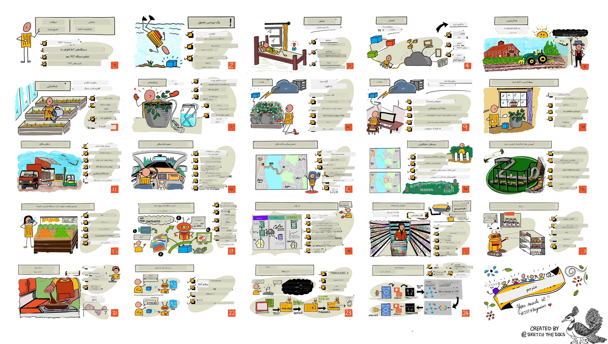

[](https://github.com/microsoft/IoT-For-Beginners/blob/master/LICENSE)
[](https://GitHub.com/microsoft/IoT-For-Beginners/graphs/contributors/)
[](https://GitHub.com/microsoft/IoT-For-Beginners/issues/)
[](https://GitHub.com/microsoft/IoT-For-Beginners/pulls/)
[](http://makeapullrequest.com)

[](https://GitHub.com/microsoft/IoT-For-Beginners/watchers/)
[](https://GitHub.com/microsoft/IoT-For-Beginners/network/)
[](https://GitHub.com/microsoft/IoT-For-Beginners/stargazers/)

### به جامعه Azure AI Foundry بپیوندید

اگر گیر کردید یا سوالی درباره ساخت برنامه‌های هوش مصنوعی دارید، به همراه یادگیرندگان و توسعه‌دهندگان با تجربه در بحث‌ها درباره MCP بپیوندید. این یک جامعه پشتیبان است که سوالات خوش‌آمد گفته شده و دانش به صورت آزاد به اشتراک گذاشته می‌شود.

[](https://discord.gg/nTYy5BXMWG)

اگر بازخورد محصول یا خطاهایی هنگام ساخت داشتید، به اینجا مراجعه کنید:

[](https://aka.ms/foundry/forum)

مراحل زیر را برای شروع استفاده از این منابع دنبال کنید:
1. **انتشار مخزن (Fork)**: کلیک کنید روی [](https://GitHub.com/microsoft/IoT-For-Beginners/fork)
2. **کلون کردن مخزن**:   `git clone https://github.com/microsoft/IoT-For-Beginners.git`
3. [**به Discord Microsoft Foundry بپیوندید و با کارشناسان و توسعه‌دهندگان دیگر ملاقات کنید**](https://discord.com/invite/ByRwuEEgH4)


### 🌐 پشتیبانی چندزبانه

#### پشتیبانی شده توسط GitHub Action (خودکار و همواره به‌روز)

<!-- CO-OP TRANSLATOR LANGUAGES TABLE START -->
[Arabic](../ar/README.md) | [Bengali](../bn/README.md) | [Bulgarian](../bg/README.md) | [Burmese (Myanmar)](../my/README.md) | [Chinese (Simplified)](../zh-CN/README.md) | [Chinese (Traditional, Hong Kong)](../zh-HK/README.md) | [Chinese (Traditional, Macau)](../zh-MO/README.md) | [Chinese (Traditional, Taiwan)](../zh-TW/README.md) | [Croatian](../hr/README.md) | [Czech](../cs/README.md) | [Danish](../da/README.md) | [Dutch](../nl/README.md) | [Estonian](../et/README.md) | [Finnish](../fi/README.md) | [French](../fr/README.md) | [German](../de/README.md) | [Greek](../el/README.md) | [Hebrew](../he/README.md) | [Hindi](../hi/README.md) | [Hungarian](../hu/README.md) | [Indonesian](../id/README.md) | [Italian](../it/README.md) | [Japanese](../ja/README.md) | [Kannada](../kn/README.md) | [Khmer](../km/README.md) | [Korean](../ko/README.md) | [Lithuanian](../lt/README.md) | [Malay](../ms/README.md) | [Malayalam](../ml/README.md) | [Marathi](../mr/README.md) | [Nepali](../ne/README.md) | [Nigerian Pidgin](../pcm/README.md) | [Norwegian](../no/README.md) | [Persian (Farsi)](./README.md) | [Polish](../pl/README.md) | [Portuguese (Brazil)](../pt-BR/README.md) | [Portuguese (Portugal)](../pt-PT/README.md) | [Punjabi (Gurmukhi)](../pa/README.md) | [Romanian](../ro/README.md) | [Russian](../ru/README.md) | [Serbian (Cyrillic)](../sr/README.md) | [Slovak](../sk/README.md) | [Slovenian](../sl/README.md) | [Spanish](../es/README.md) | [Swahili](../sw/README.md) | [Swedish](../sv/README.md) | [Tagalog (Filipino)](../tl/README.md) | [Tamil](../ta/README.md) | [Telugu](../te/README.md) | [Thai](../th/README.md) | [Turkish](../tr/README.md) | [Ukrainian](../uk/README.md) | [Urdu](../ur/README.md) | [Vietnamese](../vi/README.md)

> **ترجیح می‌دهید به‌صورت محلی کلون کنید؟**
>
> این مخزن شامل بیش از ۵۰ ترجمه به زبان‌های مختلف است که اندازه دانلود را به‌طور قابل توجهی افزایش می‌دهد. برای کلون کردن بدون ترجمه‌ها، از sparse checkout استفاده کنید:
>
> **Bash / macOS / Linux:**
> ```bash
> git clone --filter=blob:none --sparse https://github.com/microsoft/IoT-For-Beginners.git
> cd IoT-For-Beginners
> git sparse-checkout set --no-cone '/*' '!translations' '!translated_images'
> ```
>
> **CMD (ویندوز):**
> ```cmd
> git clone --filter=blob:none --sparse https://github.com/microsoft/IoT-For-Beginners.git
> cd IoT-For-Beginners
> git sparse-checkout set --no-cone "/*" "!translations" "!translated_images"
> ```
>
> این به شما همه چیز مورد نیاز برای تکمیل دوره را با دانلودی بسیار سریع‌تر می‌دهد.
<!-- CO-OP TRANSLATOR LANGUAGES TABLE END -->

# اینترنت اشیا برای مبتدیان - یک برنامه درسی

مدافعان ابر Azure در مایکروسافت خوشحالند که یک برنامه ۱۲ هفته‌ای شامل ۲۴ درس را در مورد مبانی اینترنت اشیا ارائه دهند. هر درس شامل آزمون‌های قبل و بعد از درس، دستورالعمل‌های مکتوب برای تکمیل درس، راه‌حل، تکلیف و موارد دیگر است. روش آموزش مبتنی بر پروژه ما اجازه می‌دهد در حین ساختن یاد بگیرید، روشی اثبات شده برای تثبیت مهارت‌های جدید.

پروژه‌ها سفر غذا از مزرعه تا سفره را پوشش می‌دهند. این شامل کشاورزی، لجستیک، تولید، خرده‌فروشی و مصرف‌کننده است – همه زمینه‌های محبوب صنعتی برای دستگاه‌های اینترنت اشیا.



> طرح یادداشت توسط [Nitya Narasimhan](https://github.com/nitya). برای دریافت نسخه بزرگ‌تر روی تصویر کلیک کنید.

**سپاس صمیمانه از نویسندگان ما [Jen Fox](https://github.com/jenfoxbot)، [Jen Looper](https://github.com/jlooper)، [Jim Bennett](https://github.com/jimbobbennett)، و هنرمند طرح یادداشت ما [Nitya Narasimhan](https://github.com/nitya).**

**همچنین از تیم ما از [دانشجویان سفیر مایکروسافت](https://studentambassadors.microsoft.com?WT.mc_id=academic-17441-jabenn) که این برنامه درسی را بررسی و ترجمه کرده‌اند تشکر می‌کنیم – [Aditya Garg](https://github.com/AdityaGarg00), [Anurag Sharma](https://github.com/Anurag-0-1-A), [Arpita Das](https://github.com/Arpiiitaaa), [Aryan Jain](https://www.linkedin.com/in/aryan-jain-47a4a1145/), [Bhavesh Suneja](https://github.com/EliteWarrior315), [Faith Hunja](https://faithhunja.github.io/), [Lateefah Bello](https://www.linkedin.com/in/lateefah-bello/), [Manvi Jha](https://github.com/Severus-Matthew), [Mireille Tan](https://www.linkedin.com/in/mireille-tan-a4834819a/), [Mohammad Iftekher (Iftu) Ebne Jalal](https://github.com/Iftu119), [Mohammad Zulfikar](https://github.com/mohzulfikar), [Priyanshu Srivastav](https://www.linkedin.com/in/priyanshu-srivastav-b067241ba), [Thanmai Gowducheruvu](https://github.com/innovation-platform), و [Zina Kamel](https://www.linkedin.com/in/zina-kamel/).**

با تیم ملاقات کنید!

[](https://youtu.be/-wippUJRi5k)

**گیف توسط** [Mohit Jaisal](https://linkedin.com/in/mohitjaisal)

> 🎥 برای ویدئویی درباره پروژه روی تصویر بالا کلیک کنید!

> **معلمان**، ما [چند پیشنهاد](for-teachers.md) درباره نحوه استفاده از این برنامه درسی ارائه داده‌ایم. اگر مایل به ایجاد درس‌های خود هستید، همچنین یک [قالب درس](lesson-template/README.md) ارائه کرده‌ایم.

> **[دانشجویان](https://aka.ms/student-page)**، برای استفاده انفرادی از این برنامه درسی، کل مخزن را منتشر (fork) کرده و تمرین‌ها را به صورت مستقل انجام دهید، شروع از آزمون قبل از کلاس، سپس خواندن درس و تکمیل سایر فعالیت‌ها. سعی کنید پروژه‌ها را با درک درس‌ها بسازید نه فقط کپی کردن کد راه‌حل؛ البته کد آن در پوشه‌های /solutions در هر درس مبتنی بر پروژه موجود است. ایده دیگر تشکیل گروه مطالعه با دوستان و مطالعه همزمان محتوا است. برای مطالعه بیشتر، ما [Microsoft Learn](https://docs.microsoft.com/users/jimbobbennett/collections/ke2ehd351jopwr?WT.mc_id=academic-17441-jabenn) را پیشنهاد می‌کنیم.

برای یک نمای کلی ویدیویی از این دوره، این ویدئو را ببینید:

[](https://youtube.com/watch?v=bccEMm8gRuc "Promo video")

> 🎥 برای ویدئویی درباره پروژه روی تصویر بالا کلیک کنید!

## روش آموزش

ما در ایجاد این برنامه درسی دو اصل آموزشی را انتخاب کرده‌ایم: اطمینان از اینکه مبتنی بر پروژه باشد و آزمون‌های مکرر را شامل شود. تا پایان این دوره، دانش‌آموزان یک سیستم پایش و آبیاری گیاهان، یک ره‌گیر وسایل نقلیه، یک تنظیم کارخانه هوشمند برای ردیابی و بررسی غذا، و یک تایمر آشپزی کنترل‌شده با صدا ساخته‌اند و مبانی اینترنت اشیا شامل نحوه برنامه‌نویسی دستگاه، اتصال به ابر، تحلیل داده‌های تله‌متری و اجرای هوش مصنوعی در لبه را یاد گرفته‌اند.

با اطمینان از تطابق محتوا با پروژه‌ها، فرایند برای دانش‌آموزان جذاب‌تر شده و حفظ مفاهیم بهبود می‌یابد.

علاوه بر این، یک آزمون کم ریسک قبل از کلاس قصد دانش‌آموز را برای یادگیری موضوع مشخص می‌کند، و آزمون دوم پس از کلاس حفظ بیشتر را تضمین می‌کند. این برنامه درسی انعطاف‌پذیر و سرگرم‌کننده طراحی شده و می‌توان آن را به طور کامل یا جزئی گذراند. پروژه‌ها از ساده شروع شده و تا پایان دوره ۱۲ هفته‌ای به تدریج پیچیده‌تر می‌شوند.

هر پروژه بر اساس سخت‌افزار واقعی در دسترس دانش‌آموزان و علاقه‌مندان استوار است. هر پروژه به حوزه تخصصی پروژه نگاه می‌کند و دانش زمینه‌ای مرتبط را فراهم می‌آورد. برای موفقیت در توسعه، فهمیدن حوزه‌ای که در آن مسئله حل می‌کنید کمک می‌کند، فراهم کردن این دانش زمینه‌ای اجازه می‌دهد دانش‌آموزان درباره راه‌حل‌ها و یادگیری‌های اینترنت اشیای خود در زمینه نوع مسئله دنیای واقعی که ممکن است به عنوان یک توسعه‌دهنده بخواهند حل کنند، فکر کنند. دانش‌آموزان 'چرایی' راه‌حل‌هایشان را می‌آموزند و قدردانی از کاربر نهایی پیدا می‌کنند.

## سخت‌افزار
ما دو انتخاب برای سخت‌افزار اینترنت اشیا (IoT) برای استفاده در پروژه‌ها داریم که بسته به ترجیح شخصی، دانش یا ترجیحات زبان برنامه‌نویسی، اهداف یادگیری و دسترسی تعیین می‌شود. همچنین نسخه‌ای از «سخت‌افزار مجازی» را برای کسانی که به سخت‌افزار دسترسی ندارند یا می‌خواهند قبل از خرید بیشتر یاد بگیرند فراهم کرده‌ایم. شما می‌توانید اطلاعات بیشتر و «فهرست خرید» را در [صفحه سخت‌افزار](./hardware.md) بخوانید، از جمله لینک‌هایی برای خرید کیت‌های کامل از دوستان ما در Seeed Studio.

> 💁 راهنمای [رفتار حرفه‌ای](CODE_OF_CONDUCT.md)، [مشارکت](CONTRIBUTING.md) و [ترجمه‌ها](..) را بیابید. بازخورد سازنده شما را استقبال می‌کنیم!
>
> 🔧 مشکل دارید؟ به [راهنمای عیب‌یابی](TROUBLESHOOTING.md) ما مراجعه کنید برای راه‌حل‌های مشکلات رایج.

## هر درس شامل:

- یادداشت تصویری
- ویدئوی تکمیلی اختیاری
- آزمون گرم کردن پیش از درس
- درس کتبی
- برای درس‌های مبتنی بر پروژه، راهنمای گام‌به‌گام ساخت پروژه
- بررسی‌های دانش
- یک چالش
- مطالعه تکمیلی
- تمرین
- [آزمون پس از درس](https://ff-quizzes.netlify.app/en/)

> **نکته‌ای درباره آزمون‌ها**: همه آزمون‌ها در پوشه quiz-app قرار دارند، در مجموع ۴۸ آزمون هرکدام شامل سه سوال. این آزمون‌ها از داخل درس‌ها لینک شده‌اند اما می‌توان برنامه آزمون را به طور محلی اجرا کرد یا در Azure مستقر نمود؛ دستورالعمل‌ها در پوشه `quiz-app` موجود است. آن‌ها به تدریج بومی‌سازی می‌شوند.

## درس‌ها

|       |            نام پروژه             |                 مفاهیم آموزش داده شده                 | اهداف یادگیری                                                                                                                                               |                                                     درس مرتبط                                                     |
| :---: | :-----------------------------: | :--------------------------------------------------: | ---------------------------------------------------------------------------------------------------------------------------------------------------------- | :--------------------------------------------------------------------------------------------------------------: |
|  ۰۱   | [شروع کار](./1-getting-started/README.md) |                معرفی اینترنت اشیا                    | اصول پایه اینترنت اشیا و اجزای اصلی راه‌حل‌های اینترنت اشیا مانند حسگرها و خدمات ابری را در حین راه‌اندازی اولین دستگاه IoT خود بیاموزید               |                    [معرفی اینترنت اشیا](./1-getting-started/lessons/1-introduction-to-iot/README.md)                |
|  ۰۲   | [شروع کار](./1-getting-started/README.md) |              بررسی عمیق‌تر اینترنت اشیا            | درباره اجزای سیستم اینترنت اشیا و همچنین میکروکنترلرها و کامپیوترهای تک برد بیشتر بدانید                                                                 |                      [بررسی عمیق‌تر اینترنت اشیا](./1-getting-started/lessons/2-deeper-dive/README.md)              |
|  ۰۳   | [شروع کار](./1-getting-started/README.md) | تعامل با دنیای فیزیکی با حسگرها و عملگرها (اکچویتورها) | درباره حسگرها برای جمع‌آوری داده از دنیای فیزیکی و عملگرها برای ارسال بازخورد بیاموزید، در حالی که یک چراغ شبانه می‌سازید                                 | [تعامل با دنیای فیزیکی با حسگرها و عملگرها](./1-getting-started/lessons/3-sensors-and-actuators/README.md)       |
|  ۰۴   | [شروع کار](./1-getting-started/README.md) |      اتصال دستگاه خود به اینترنت                   | درباره نحوه اتصال یک دستگاه IoT به اینترنت برای ارسال و دریافت پیام‌ها با اتصال چراغ شبانه خود به بروکر MQTT بیاموزید                                   |             [اتصال دستگاه خود به اینترنت](./1-getting-started/lessons/4-connect-internet/README.md)                |
|  ۰۵   |       [کشاورزی](./2-farm/README.md)        |           پیش‌بینی رشد گیاه                        | چگونه با استفاده از داده‌های دمایی که توسط دستگاه IoT جمع‌آوری شده رشد گیاه را پیش‌بینی کنیم                                                                 |                      [پیش‌بینی رشد گیاه](./2-farm/lessons/1-predict-plant-growth/README.md)                         |
|  ۰۶   |       [کشاورزی](./2-farm/README.md)        |           تشخیص رطوبت خاک                           | چگونه رطوبت خاک را تشخیص داده و حسگر رطوبت خاک را کالیبره کنیم                                                                                             |                      [تشخیص رطوبت خاک](./2-farm/lessons/2-detect-soil-moisture/README.md)                             |
|  ۰۷   |       [کشاورزی](./2-farm/README.md)        |          آبیاری خودکار گیاه                         | چگونه آبیاری را با استفاده از رله و MQTT خودکار و زمانبندی کنیم                                                                                            |                    [آبیاری خودکار گیاه](./2-farm/lessons/3-automated-plant-watering/README.md)                        |
|  ۰۸   |       [کشاورزی](./2-farm/README.md)        |        مهاجرت گیاه خود به فضای ابری                | درباره فضای ابری و خدمات اینترنت اشیا میزبانی شده در ابر و چگونگی اتصال گیاه خود به یکی از این سرویس‌ها به جای بروکر عمومی MQTT بیاموزید                    |                [مهاجرت گیاه خود به فضای ابری](./2-farm/lessons/4-migrate-your-plant-to-the-cloud/README.md)          |
|  ۰۹   |       [کشاورزی](./2-farm/README.md)        |      مهاجرت منطق برنامه کاربردی به فضای ابری       | درباره نحوه نوشتن منطق برنامه در فضای ابری که به پیام‌های اینترنت اشیا پاسخ می‌دهد بیاموزید                                                                 |            [مهاجرت منطق برنامه کاربردی به فضای ابری](./2-farm/lessons/5-migrate-application-to-the-cloud/README.md)  |
|  ۱۰   |       [کشاورزی](./2-farm/README.md)        |          محافظت از امنیت گیاه خود                   | درباره امنیت در اینترنت اشیا و چگونگی محافظت از گیاه خود با کلیدها و گواهینامه‌ها بیاموزید                                                                  |                        [محافظت از امنیت گیاه](./2-farm/lessons/6-keep-your-plant-secure/README.md)                   |
|  ۱۱   |      [حمل‌ونقل](./3-transport/README.md)   |              ردیابی موقعیت مکانی                    | درباره ردیابی موقعیت مکانی GPS برای دستگاه‌های IoT بیاموزید                                                                                                |                           [ردیابی موقعیت](./3-transport/lessons/1-location-tracking/README.md)                        |
|  ۱۲   |      [حمل‌ونقل](./3-transport/README.md)   |            ذخیره داده موقعیت مکانی                   | چگونه داده‌های IoT را ذخیره کنیم تا بعداً بتوان آن‌ها را به صورت تصویری یا تحلیلی مشاهده کرد                                                               |                         [ذخیره داده موقعیت](./3-transport/lessons/2-store-location-data/README.md)                     |
|  ۱۳   |      [حمل‌ونقل](./3-transport/README.md)   |            تجسم داده موقعیت مکانی                    | درباره تجسم داده‌ی موقعیت مکانی روی نقشه و چگونگی نمایش جهان سه‌بعدی واقعی در دو بعد بیاموزید                                                              |                      [تجسم داده موقعیت](./3-transport/lessons/3-visualize-location-data/README.md)                    |
|  ۱۴   |      [حمل‌ونقل](./3-transport/README.md)   |                  حصارهای جغرافیایی                   | درباره حصارهای جغرافیایی (جئوفنس) و اینکه چطور می‌توانند برای هشدار دادن هنگام نزدیکی وسایل نقلیه در زنجیره تأمین به مقصد استفاده شوند بیاموزید           |                           [حصارهای جغرافیایی](./3-transport/lessons/4-geofences/README.md)                            |
|  ۱۵   |   [تولید](./4-manufacturing/README.md)      |       آموزش یک شناسگر کیفیت میوه                     | درباره آموزش دسته‌بند تصاویر در فضای ابری برای تشخیص کیفیت میوه بیاموزید                                                                                   |                  [آموزش شناسگر کیفیت میوه](./4-manufacturing/lessons/1-train-fruit-detector/README.md)               |
|  ۱۶   |   [تولید](./4-manufacturing/README.md)      |        بررسی کیفیت میوه با دستگاه IoT               | درباره استفاده از شناسگر کیفیت میوه خود از طریق دستگاه IoT بیاموزید                                                                                        |           [بررسی کیفیت میوه با دستگاه IoT](./4-manufacturing/lessons/2-check-fruit-from-device/README.md)              |
|  ۱۷   |   [تولید](./4-manufacturing/README.md)      |         اجرای شناسگر میوه روی Edge IoT               | درباره اجرای شناسگر میوه روی دستگاه IoT در Edge بیاموزید                                                                                                  |             [اجرای شناسگر میوه روی Edge](./4-manufacturing/lessons/3-run-fruit-detector-edge/README.md)                |
|  ۱۸   |   [تولید](./4-manufacturing/README.md)      |          راه‌اندازی تشخیص کیفیت میوه از طریق حسگر    | درباره راه‌اندازی تشخیص کیفیت میوه توسط حسگر بیاموزید                                                                                                     |          [راه‌اندازی تشخیص کیفیت میوه از حسگر](./4-manufacturing/lessons/4-trigger-fruit-detector/README.md)           |
|  ۱۹   |     [خرده‌فروشی](./5-retail/README.md)      |            آموزش شناسگر موجودی کالا                  | چگونه از تشخیص اشیاء استفاده کنیم تا یک شناسگر موجودی کالا برای شمارش موجودی در فروشگاه آموزش دهیم                                                        |                     [آموزش شناسگر موجودی](./5-retail/lessons/1-train-stock-detector/README.md)                        |
|  ۲۰   |     [خرده‌فروشی](./5-retail/README.md)      |            بررسی موجودی با دستگاه IoT                | چگونه موجودی کالا را با استفاده از دستگاه IoT و مدل تشخیص شیء بررسی کنیم                                                                                 |                    [بررسی موجودی با دستگاه IoT](./5-retail/lessons/2-check-stock-device/README.md)                     |
|  ۲۱   |      [مصرف‌کننده](./6-consumer/README.md)   |            شناسایی گفتار با دستگاه IoT               | چگونه گفتار را از دستگاه IoT شناسایی کنیم تا تایمر هوشمند بسازیم                                                                                        |                  [شناسایی گفتار با دستگاه IoT](./6-consumer/lessons/1-speech-recognition/README.md)                   |
|  ۲۲   |      [مصرف‌کننده](./6-consumer/README.md)   |               درک زبان                                | چگونه جملات گفته شده به دستگاه IoT را درک کنیم                                                                                                           |                        [درک زبان](./6-consumer/lessons/2-language-understanding/README.md)                               |
|  ۲۳   |      [مصرف‌کننده](./6-consumer/README.md)   |       تنظیم تایمر و ارائه بازخورد گفتاری              | چگونه تایمر را روی دستگاه IoT تنظیم کنیم و بازخورد صوتی درباره زمان تنظیم و پایان تایمر بدهیم                                                             |                [تنظیم تایمر و بازخورد صوتی](./6-consumer/lessons/3-spoken-feedback/README.md)                           |
|  ۲۴   |      [مصرف‌کننده](./6-consumer/README.md)   |            پشتیبانی از چند زبان                         | چگونه از چند زبان پشتیبانی کنیم، هم هنگام صحبت با دستگاه و هم پاسخ‌های تایمر هوشمند                                                                         |                    [پشتیبانی از چند زبان](./6-consumer/lessons/4-multiple-language-support/README.md)                   |

## دسترسی آفلاین

می‌توانید این مستندات را به صورت آفلاین با استفاده از [Docsify](https://docsify.js.org/#/) اجرا کنید. این مخزن را فورک کنید، [Docsify را نصب کنید](https://docsify.js.org/#/quickstart) روی سیستم محلی خود، سپس در پوشه ریشه این مخزن، دستور `docsify serve` را تایپ کنید. وب‌سایت در پورت ۳۰۰۰ روی لوکال‌هاست شما اجرا می‌شود: `localhost:3000`.

## آزمون

از جامعه به خاطر ارائه آزمون تعاملی که دانش شما را در هر فصل آزمایش می‌کند تشکر می‌کنیم. دانش خود را [اینجا](https://ff-quizzes.netlify.app/en/) بسنجید.

### PDF

می‌توانید در صورت نیاز یک فایل PDF از این محتوا برای دسترسی آفلاین تولید کنید. برای این کار مطمئن شوید که [npm نصب شده](https://docs.npmjs.com/downloading-and-installing-node-js-and-npm) است و دستورات زیر را در پوشه ریشه این مخزن اجرا کنید:

```sh
npm i
npm run convert
```

### اسلایدها

برای برخی درس‌ها، دک‌های اسلایدی در پوشه [slides](../../slides) وجود دارد.

## دوره‌های دیگر

تیم ما دوره‌های دیگری نیز تولید می‌کند! ببینید:

<!-- CO-OP TRANSLATOR OTHER COURSES START -->
### LangChain
[](https://aka.ms/langchain4j-for-beginners)
[](https://aka.ms/langchainjs-for-beginners?WT.mc_id=m365-94501-dwahlin)
[](https://github.com/microsoft/langchain-for-beginners?WT.mc_id=m365-94501-dwahlin)
---

### Azure / Edge / MCP / Agents
[](https://github.com/microsoft/AZD-for-beginners?WT.mc_id=academic-105485-koreyst)
[](https://github.com/microsoft/edgeai-for-beginners?WT.mc_id=academic-105485-koreyst)
[](https://github.com/microsoft/mcp-for-beginners?WT.mc_id=academic-105485-koreyst)
[](https://github.com/microsoft/ai-agents-for-beginners?WT.mc_id=academic-105485-koreyst)

---
 
### سری هوش مصنوعی مولد
[](https://github.com/microsoft/generative-ai-for-beginners?WT.mc_id=academic-105485-koreyst)
[-9333EA?style=for-the-badge&labelColor=E5E7EB&color=9333EA)](https://github.com/microsoft/Generative-AI-for-beginners-dotnet?WT.mc_id=academic-105485-koreyst)
[-C084FC?style=for-the-badge&labelColor=E5E7EB&color=C084FC)](https://github.com/microsoft/generative-ai-for-beginners-java?WT.mc_id=academic-105485-koreyst)
[-E879F9?style=for-the-badge&labelColor=E5E7EB&color=E879F9)](https://github.com/microsoft/generative-ai-with-javascript?WT.mc_id=academic-105485-koreyst)

---
 
### یادگیری اصلی
[](https://aka.ms/ml-beginners?WT.mc_id=academic-105485-koreyst)
[](https://aka.ms/datascience-beginners?WT.mc_id=academic-105485-koreyst)
[](https://aka.ms/ai-beginners?WT.mc_id=academic-105485-koreyst)
[](https://github.com/microsoft/Security-101?WT.mc_id=academic-96948-sayoung)
[](https://aka.ms/webdev-beginners?WT.mc_id=academic-105485-koreyst)
[](https://aka.ms/iot-beginners?WT.mc_id=academic-105485-koreyst)
[](https://github.com/microsoft/xr-development-for-beginners?WT.mc_id=academic-105485-koreyst)

---
 
### سری کاپیلوت
[](https://aka.ms/GitHubCopilotAI?WT.mc_id=academic-105485-koreyst)
[](https://github.com/microsoft/mastering-github-copilot-for-dotnet-csharp-developers?WT.mc_id=academic-105485-koreyst)
[](https://github.com/microsoft/CopilotAdventures?WT.mc_id=academic-105485-koreyst)
<!-- CO-OP TRANSLATOR OTHER COURSES END -->

## نسبت دادن تصاویر

شما می‌توانید همه نسبت‌ها برای تصاویر استفاده شده در این برنامه درسی را که در آن‌ها لازم است در [نسبت‌ها](./attributions.md) بیابید.

---

<!-- CO-OP TRANSLATOR DISCLAIMER START -->
**سلب مسئولیت**:  
این سند با استفاده از سرویس ترجمه ماشینی [Co-op Translator](https://github.com/Azure/co-op-translator) ترجمه شده است. در حالی که ما برای دقت تلاش می‌کنیم، لطفاً توجه داشته باشید که ترجمه‌های خودکار ممکن است حاوی اشتباهات یا نادرستی‌هایی باشند. سند اصلی به زبان بومی خود، باید به عنوان منبع معتبر در نظر گرفته شود. برای اطلاعات حیاتی، توصیه می‌شود از ترجمه حرفه‌ای انسانی استفاده شود. ما مسئول هیچ گونه سوءتفاهم یا تفسیر نادرستی که ناشی از استفاده از این ترجمه باشد، نیستیم.
<!-- CO-OP TRANSLATOR DISCLAIMER END -->