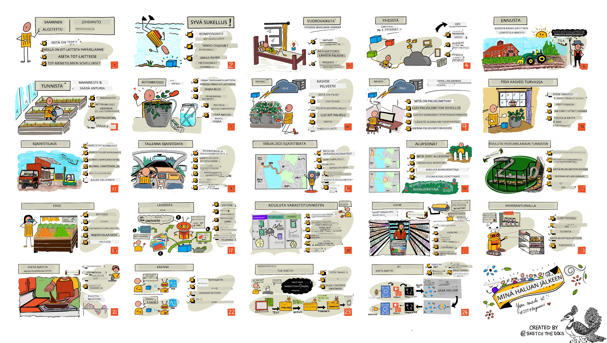

<!--
CO_OP_TRANSLATOR_METADATA:
{
  "original_hash": "6c354ec3487e4f6cfafbe44557996cd9",
  "translation_date": "2026-01-06T06:27:47+00:00",
  "source_file": "README.md",
  "language_code": "fi"
}
-->
[](https://github.com/microsoft/IoT-For-Beginners/blob/master/LICENSE)
[](https://GitHub.com/microsoft/IoT-For-Beginners/graphs/contributors/)
[](https://GitHub.com/microsoft/IoT-For-Beginners/issues/)
[](https://GitHub.com/microsoft/IoT-For-Beginners/pulls/)
[](http://makeapullrequest.com)

[](https://GitHub.com/microsoft/IoT-For-Beginners/watchers/)
[](https://GitHub.com/microsoft/IoT-For-Beginners/network/)
[](https://GitHub.com/microsoft/IoT-For-Beginners/stargazers/)

### Liity Azure AI Foundry -yhteisöön

Jos jumitut tai sinulla on kysyttävää tekoälysovellusten rakentamisesta. Liity oppijoiden ja kokeneiden kehittäjien seuraan keskustelemaan MCP:stä. Tämä on kannustava yhteisö, jossa kysymykset ovat tervetulleita ja tieto jaetaan vapaasti.

[](https://discord.gg/nTYy5BXMWG)

Jos sinulla on palautetta tuotteesta tai kohtaat virheitä rakentaessasi, käy:

[](https://aka.ms/foundry/forum)

Noudata seuraavia vaiheita aloittaaksesi näiden resurssien käytön:
1. **Forkkaa repositorio**: Klikkaa [](https://GitHub.com/microsoft/IoT-For-Beginners/fork)
2. **Kloonaa repositorio**: `git clone https://github.com/microsoft/IoT-For-Beginners.git`
3. [**Liity Microsoft Foundryn Discordiin ja tapaa asiantuntijoita ja muita kehittäjiä**](https://discord.com/invite/ByRwuEEgH4)


### 🌐 Monikielinen tuki

#### Tuettu GitHub Actionin kautta (automaattinen ja aina ajan tasalla)

<!-- CO-OP TRANSLATOR LANGUAGES TABLE START -->
[Arabic](../ar/README.md) | [Bengali](../bn/README.md) | [Bulgarian](../bg/README.md) | [Burmese (Myanmar)](../my/README.md) | [Chinese (Simplified)](../zh/README.md) | [Chinese (Traditional, Hong Kong)](../hk/README.md) | [Chinese (Traditional, Macau)](../mo/README.md) | [Chinese (Traditional, Taiwan)](../tw/README.md) | [Croatian](../hr/README.md) | [Czech](../cs/README.md) | [Danish](../da/README.md) | [Dutch](../nl/README.md) | [Estonian](../et/README.md) | [Finnish](./README.md) | [French](../fr/README.md) | [German](../de/README.md) | [Greek](../el/README.md) | [Hebrew](../he/README.md) | [Hindi](../hi/README.md) | [Hungarian](../hu/README.md) | [Indonesian](../id/README.md) | [Italian](../it/README.md) | [Japanese](../ja/README.md) | [Kannada](../kn/README.md) | [Korean](../ko/README.md) | [Lithuanian](../lt/README.md) | [Malay](../ms/README.md) | [Malayalam](../ml/README.md) | [Marathi](../mr/README.md) | [Nepali](../ne/README.md) | [Nigerian Pidgin](../pcm/README.md) | [Norwegian](../no/README.md) | [Persian (Farsi)](../fa/README.md) | [Polish](../pl/README.md) | [Portuguese (Brazil)](../br/README.md) | [Portuguese (Portugal)](../pt/README.md) | [Punjabi (Gurmukhi)](../pa/README.md) | [Romanian](../ro/README.md) | [Russian](../ru/README.md) | [Serbian (Cyrillic)](../sr/README.md) | [Slovak](../sk/README.md) | [Slovenian](../sl/README.md) | [Spanish](../es/README.md) | [Swahili](../sw/README.md) | [Swedish](../sv/README.md) | [Tagalog (Filipino)](../tl/README.md) | [Tamil](../ta/README.md) | [Telugu](../te/README.md) | [Thai](../th/README.md) | [Turkish](../tr/README.md) | [Ukrainian](../uk/README.md) | [Urdu](../ur/README.md) | [Vietnamese](../vi/README.md)

> **Haluatko kloonata paikallisesti?**

> Tämä repositorio sisältää yli 50 kielen käännöksiä, mikä lisää merkittävästi latauskoon. Kloonaa ilman käännöksiä käyttämällä sparse checkout -toimintoa:
> ```bash
> git clone --filter=blob:none --sparse https://github.com/microsoft/IoT-For-Beginners.git
> cd IoT-For-Beginners
> git sparse-checkout set --no-cone '/*' '!translations' '!translated_images'
> ```
> Tämä antaa sinulle kaiken tarvittavan kurssin suorittamiseen paljon nopeammin.
<!-- CO-OP TRANSLATOR LANGUAGES TABLE END -->

# IoT aloittelijoille - Opetussuunnitelma

Microsoftin Azure Cloud Advocates tarjoaa mielellään 12 viikon, 24 oppitunnin opetussuunnitelman, joka kattaa IoT:n perusteet. Jokainen oppitunti sisältää ennakko- ja jälkitestit, kirjalliset ohjeet tehtävän suorittamiseen, ratkaisun, kotitehtävän ja muuta. Projektipohjainen opetustapamme mahdollistaa oppimisen rakennettaessa, mikä on todistettu tapa uuden taidon omaksumiseen.

Projektit kattavat ruoan matkan tilalta pöytään. Tämä sisältää viljelyn, logistiikan, valmistuksen, vähittäiskaupan ja kuluttajan - kaikki suosittuja teollisuudenaloja IoT-laitteille.



> Sketchnote [Nitya Narasimhanilta](https://github.com/nitya). Klikkaa kuvaa nähdäksesi suuremman version.

**Lämpimät kiitokset kirjoittajillemme [Jen Fox](https://github.com/jenfoxbot), [Jen Looper](https://github.com/jlooper), [Jim Bennett](https://github.com/jimbobbennett) sekä sketchnote-taiteilijallemme [Nitya Narasimhanille](https://github.com/nitya).**

**Kiitos myös [Microsoft Learn Student Ambassadors](https://studentambassadors.microsoft.com?WT.mc_id=academic-17441-jabenn) -ryhmällemme, jotka ovat tarkistaneet ja kääntäneet tätä opetussuunnitelmaa - [Aditya Garg](https://github.com/AdityaGarg00), [Anurag Sharma](https://github.com/Anurag-0-1-A), [Arpita Das](https://github.com/Arpiiitaaa), [Aryan Jain](https://www.linkedin.com/in/aryan-jain-47a4a1145/), [Bhavesh Suneja](https://github.com/EliteWarrior315), [Faith Hunja](https://faithhunja.github.io/), [Lateefah Bello](https://www.linkedin.com/in/lateefah-bello/), [Manvi Jha](https://github.com/Severus-Matthew), [Mireille Tan](https://www.linkedin.com/in/mireille-tan-a4834819a/), [Mohammad Iftekher (Iftu) Ebne Jalal](https://github.com/Iftu119), [Mohammad Zulfikar](https://github.com/mohzulfikar), [Priyanshu Srivastav](https://www.linkedin.com/in/priyanshu-srivastav-b067241ba), [Thanmai Gowducheruvu](https://github.com/innovation-platform) ja [Zina Kamel](https://www.linkedin.com/in/zina-kamel/).**

Tutustu tiimiin!

[](https://youtu.be/-wippUJRi5k)

**Gif [Mohit Jaisalilta](https://linkedin.com/in/mohitjaisal)**

> 🎥 Klikkaa yllä olevaa kuvaa nähdäksesi videon projektista!

> **Opettajat**, olemme [sisällyttäneet joitain ehdotuksia](for-teachers.md) tämän opetussuunnitelman käyttöön. Jos haluat luoda omia oppitunteja, olemme myös lisänneet [oppituntipohjan](lesson-template/README.md).

> **[Opiskelijat](https://aka.ms/student-page)**, käyttääksesi tätä opetussuunnitelmaa itse, forkkaa koko repo ja suorita harjoitukset itse aloittaen ennakkomonisteella, sitten luennoiden lukemisella ja jatka lopuilla tehtävillä. Yritä luoda projektit oppimalla oppitunnit sen sijaan, että kopioit ratkaisukoodin; kuitenkin koodi löytyy /solutions-kansioista jokaisessa projektilähtöisessä oppitunnissa. Toinen idea on muodostaa opiskeluryhmä ystävien kanssa ja käydä sisältö yhdessä läpi. Lisäopiskelua varten suosittelemme [Microsoft Learnia](https://docs.microsoft.com/users/jimbobbennett/collections/ke2ehd351jopwr?WT.mc_id=academic-17441-jabenn).

Tässä kurssin videoesittely:

[](https://youtube.com/watch?v=bccEMm8gRuc "Promo video")

> 🎥 Klikkaa yllä olevaa kuvaa nähdäksesi videon projektista!

## Opetustapa

Olemme valinneet kaksi pedagogista periaatetta tämän opetussuunnitelman rakentamiseen: varmistaa, että se on projektipohjainen ja että se sisältää usein testejä. Sarjan lopussa opiskelijat ovat rakentaneet kasvien seurantaja kastelujärjestelmän, ajoneuvoseurannan, älytehtaan elintarvikkeiden seurantalaitteineen, ääniohjatun keittoajastimen ja oppineet IoT:n perusteet, mukaan lukien laitteen koodin kirjoittamisen, pilveen yhdistämisen, telemetrian analysoinnin ja tekoälyn ajamisen reunalla.

Sisällön sovittaminen projekteihin tekee oppimisprosessista opiskelijalle kiinnostavamman ja lisää käsitteiden muistamista.

Lisäksi ennen tuntia tehtävä matalariskinen testi suuntaa opiskelijan mielen oppimiseen, ja tunnin jälkeinen testi varmistaa aiempaa paremman muistamisen. Tämä opetussuunnitelma on suunniteltu joustavaksi ja hauskaksi ja sen voi suorittaa kokonaan tai osittain. Projektit alkavat pienistä ja muuttuvat yhä monimutkaisemmiksi 12 viikon aikana.

Jokainen projekti perustuu opiskelijoiden ja harrastajien saatavilla olevaan oikean maailman laitteistoon. Projektit käsittelevät kyseisen projektialueen taustatietoa. Onnistuneena kehittäjänä auttaa ymmärtää se ala, jolla ongelmia ratkotaan; tämä taustatieto antaa opiskelijoille mahdollisuuden ajatella IoT-ratkaisujaan ja oppimistaan todellisen maailman ongelmien kontekstissa, joita heitä mahdollisesti pyydetään ratkaisemaan IoT-kehittäjänä. Opiskelijat oppivat rakentamiensa ratkaisujen "miksi"-syyt ja saavat arvostusta loppukäyttäjää kohtaan.

## Laitteisto

Meillä on kaksi IoT-laitteistovaihtoehtoa projekteihin henkilökohtaisten mieltymysten, ohjelmointikielen tuntemuksen, oppimistavoitteiden ja saatavuuden mukaan. Olemme myös laatineet 'virtuaalisen laitteiston' version niille, joilla ei ole laitteistoa tai jotka haluavat oppia lisää ennen ostamista. Voit lukea lisää ja löytää 'ostoslistan' [laitteistosivulta](./hardware.md), mukaan lukien linkit hankkia kokonaiset paketit ystäviltämme Seeed Studion kautta.
> 💁 Löydät meidän [käyttäytymissääntömme](CODE_OF_CONDUCT.md), [osallistumisohjeet](CONTRIBUTING.md) ja [käännösohjeet](TRANSLATIONS.md). Otamme mielellämme vastaan rakentavaa palautettasi!
>
> 🔧 Ongelmia? Tutustu [vianmääritysohjeeseemme](TROUBLESHOOTING.md) yleisten ongelmien ratkaisua varten.

## Jokainen oppitunti sisältää:

- sketchnoten
- valinnaisen lisävideon
- lämmittelymonisteen ennen oppituntia
- kirjallisen oppitunnin
- projektipohjaisissa oppitunneissa vaiheittaiset ohjeet projektin rakentamiseen
- tieto- ja ymmärrystarkistuksia
- haasteen
- lisälukemista
- tehtävän
- [oppitunnin jälkeisen monisteen](https://ff-quizzes.netlify.app/en/)

> **Huomautus monisteista**: Kaikki monisteet ovat quiz-app-kansiossa, yhteensä 48 monistetta, joissa jokaisessa on kolme kysymystä. Niihin viitataan oppituntien sisällä, mutta monisteohjelmaa voi suorittaa paikallisesti tai ottaa käyttöön Azureen; noudata ohjeita `quiz-app`-kansiossa. Ne ovat vähitellen lokalisoitumassa.

## Oppitunnit

|       |              Projektin nimi             |                          Opitut käsitteet                          | Oppimistavoitteet                                                                                                                                                   |                                                         Linkitetty oppitunti                                                        |
| :---: | :------------------------------------: | :-----------------------------------------------------------------: | ----------------------------------------------------------------------------------------------------------------------------------------------------------------- | :------------------------------------------------------------------------------------------------------------------------------: |
|  01   | [Aloitus](./1-getting-started/README.md)        |                       Johdanto IoT:hen                            | Opi IoT:n perusperiaatteet ja IoT-ratkaisujen peruselementit, kuten anturit ja pilvipalvelut, kun pystytät ensimmäisen IoT-laitteesi                              |                    [Johdanto IoT:hen](./1-getting-started/lessons/1-introduction-to-iot/README.md)                    |
|  02   | [Aloitus](./1-getting-started/README.md)        |                    Syventävää tietoa IoT:stä                       | Opi lisää IoT-järjestelmän komponenteista, mikrokontrollereista ja yksittäisistä tietokoneista                                                                    |                      [Syventävää tietoa IoT:stä](./1-getting-started/lessons/2-deeper-dive/README.md)                      |
|  03   | [Aloitus](./1-getting-started/README.md)        | Vuorovaikutus fyysisen maailman kanssa antureilla ja toimilaitteilla | Opi antureista tiedon keräämiseksi fyysisestä maailmasta ja toimilaitteista palautteen antamiseksi, kun rakennat yölampun                                           | [Vuorovaikutus fyysisen maailman kanssa antureilla ja toimilaitteilla](./1-getting-started/lessons/3-sensors-and-actuators/README.md) |
|  04   | [Aloitus](./1-getting-started/README.md)        | Laitteen yhdistäminen Internetiin                                  | Opi yhdistämään IoT-laite Internetiin lähettämään ja vastaanottamaan viestejä yhdistämällä yölampun MQTT-välittäjään                                               |               [Laitteen yhdistäminen Internetiin](./1-getting-started/lessons/4-connect-internet/README.md)               |
|  05   |            [Maatila](./2-farm/README.md)        | Kasvun ennustaminen                                              | Opi ennustamaan kasvien kasvua IoT-laitteen keräämän lämpötilatiedon avulla                                                                                        |                            [Kasvun ennustaminen](./2-farm/lessons/1-predict-plant-growth/README.md)                            |
|  06   |            [Maatila](./2-farm/README.md)        | Maan kosteuden havaitseminen                                     | Opi havaitsemaan maan kosteus ja kalibroimaan maankosteusanturi                                                                                                   |                            [Maan kosteuden havaitseminen](./2-farm/lessons/2-detect-soil-moisture/README.md)                            |
|  07   |            [Maatila](./2-farm/README.md)        | Kasvien automaattinen kastelu                                    | Opi automatisoimaan ja ajoittamaan kastelua releen ja MQTT:n avulla                                                                                               |                        [Kasvien automaattinen kastelu](./2-farm/lessons/3-automated-plant-watering/README.md)                        |
|  08   |            [Maatila](./2-farm/README.md)        | Kasvin siirtäminen pilveen                                       | Opi pilvestä ja pilvipohjaisista IoT-palveluista sekä siitä, miten yhdistät kasvisi näihin julkisen MQTT-välittäjän sijaan                                         |                [Kasvin siirtäminen pilveen](./2-farm/lessons/4-migrate-your-plant-to-the-cloud/README.md)                |
|  09   |            [Maatila](./2-farm/README.md)        | Sovelluslogiikan siirtäminen pilveen                             | Opi kirjoittamaan pilvessä sovelluslogiikkaa, joka reagoi IoT-viesteihin                                                                                           |          [Sovelluslogiikan siirtäminen pilveen](./2-farm/lessons/5-migrate-application-to-the-cloud/README.md)           |
|  10   |            [Maatila](./2-farm/README.md)        | Kasvin suojaaminen                                              | Opi IoT:n turvallisuudesta ja kasvisi suojaamisesta avainten ja sertifikaattien avulla                                                                              |                     [Kasvin suojaaminen](./2-farm/lessons/6-keep-your-plant-secure/README.md)                     |
|  11   |        [Liikenne](./3-transport/README.md)      | Sijainnin seuranta                                             | Opi GPS-sijainnin seurannasta IoT-laitteille                                                                                                                      |                         [Sijainnin seuranta](./3-transport/lessons/1-location-tracking/README.md)                         |
|  12   |        [Liikenne](./3-transport/README.md)      | Sijaintitietojen tallentaminen                                 | Opi tallentamaan IoT-dataa, joka voidaan myöhemmin visualisoida tai analysoida                                                                                     |                      [Sijaintitietojen tallentaminen](./3-transport/lessons/2-store-location-data/README.md)                      |
|  13   |        [Liikenne](./3-transport/README.md)      | Sijaintitietojen visualisointi                                | Opi visualisoimaan sijaintitietoja kartalla ja miten kartat esittävät todellisen 3D-maailman kaksiulotteisina                                                        |                   [Sijaintitietojen visualisointi](./3-transport/lessons/3-visualize-location-data/README.md)                   |
|  14   |        [Liikenne](./3-transport/README.md)      | Geofence-alueet                                               | Opi geofence-alueista ja siitä, miten ne voivat hälyttää, kun toimitusketjun ajoneuvot lähestyvät kohdettaan                                                       |                                      [Geofence-alueet](./3-transport/lessons/4-geofences/README.md)                                      |
|  15   |    [Valmistus](./4-manufacturing/README.md)      | Omenalaadun tunnistimen kouluttaminen                         | Opi kouluttamaan kuvantunnistin pilvessä omenan laadun tunnistamiseksi                                                                                            |                 [Omenalaadun tunnistimen kouluttaminen](./4-manufacturing/lessons/1-train-fruit-detector/README.md)                 |
|  16   |    [Valmistus](./4-manufacturing/README.md)      | Omenan laadun tarkistaminen IoT-laitteella                    | Opi käyttämään omenalaadun tunnistinta IoT-laitteesta käsin                                                                                                      |                  [Omenan laadun tarkistaminen IoT-laitteella](./4-manufacturing/lessons/2-check-fruit-from-device/README.md)                  |
|  17   |    [Valmistus](./4-manufacturing/README.md)      | Omenatunnistimen ajaminen reunalaitteella                     | Opi ajamaan omenatunnistin IoT-laitteella reunalaitteella                                                                                                        |                 [Omenatunnistimen ajaminen reunalaitteella](./4-manufacturing/lessons/3-run-fruit-detector-edge/README.md)                 |
|  18   |    [Valmistus](./4-manufacturing/README.md)      | Omenan laadun tunnistuksen laukaisu anturista                 | Opi laukaista omenatunnistuksen anturista käsin                                                                                                                  |                  [Omenan laadun tunnistuksen laukaisu anturista](./4-manufacturing/lessons/4-trigger-fruit-detector/README.md)                  |
|  19   |           [Vähittäiskauppa](./5-retail/README.md)| Varaston tunnistimen kouluttaminen                            | Opi käyttämään objektintunnistusta varaston laskemiseen kaupassa                                                                                                |                        [Varaston tunnistimen kouluttaminen](./5-retail/lessons/1-train-stock-detector/README.md)                         |
|  20   |           [Vähittäiskauppa](./5-retail/README.md)| Varaston tarkistaminen IoT-laitteesta                         | Opi tarkistamaan varaston tila IoT-laitteella objektintunnistusmallin avulla                                                                                    |                       [Varaston tarkistaminen IoT-laitteesta](./5-retail/lessons/2-check-stock-device/README.md)                       |
|  21   |         [Kuluttaja](./6-consumer/README.md)       | Puheen tunnistaminen IoT-laitteella                           | Opi tunnistamaan puhe IoT-laitteella älyajastimen rakentamiseksi                                                                                                |                  [Puheen tunnistaminen IoT-laitteella](./6-consumer/lessons/1-speech-recognition/README.md)                  |
|  22   |         [Kuluttaja](./6-consumer/README.md)       | Kielen ymmärtäminen                                          | Opi ymmärtämään IoT-laitteelle puhuttuja lauseita                                                                                                               |                        [Kielen ymmärtäminen](./6-consumer/lessons/2-language-understanding/README.md)                        |
|  23   |         [Kuluttaja](./6-consumer/README.md)       | Ajastimen asettaminen ja puhutun palautteen antaminen       | Opi asettamaan ajastin IoT-laitteeseen ja antamaan puhutun palautteen siitä, milloin ajastin asetetaan ja milloin se päättyy                                   |                 [Ajastimen asettaminen ja puhutun palautteen antaminen](./6-consumer/lessons/3-spoken-feedback/README.md)                  |
|  24   |         [Kuluttaja](./6-consumer/README.md)       | Monikielisyyden tukeminen                                   | Opi tukemaan useita kieliä sekä puhutun kielen vastaanottaa että älyajastimen vastauksissa                                                                                       |                   [Monikielisyyden tukeminen](./6-consumer/lessons/4-multiple-language-support/README.md)                   |

## Offline-käyttö

Voit käyttää tätä dokumentaatiota offline-tilassa käyttämällä [Docsifyä](https://docsify.js.org/#/). Haarauta tämä repo, [asenna Docsify](https://docsify.js.org/#/quickstart) paikalliselle koneellesi, ja kirjoita tämän repohakemiston juureen `docsify serve`. Sivusto avautuu portissa 3000 paikallisessa koneessasi: `localhost:3000`.

## Moniste

Kiitos yhteisölle interaktiivisen monisteen isännöinnistä, joka testaa tietosi jokaisesta kappaleesta. Testaa tietosi [tästä](https://ff-quizzes.netlify.app/en/)

### PDF

Voit luoda tästä sisällöstä PDF-tiedoston offline-käyttöä varten tarvittaessa. Varmista, että sinulla on [npm asennettuna](https://docs.npmjs.com/downloading-and-installing-node-js-and-npm) ja aja seuraavat komennot tämän repohakemiston juuresta:

```sh
npm i
npm run convert
```

### Dioja

Joistakin oppitunneista on diaesityksiä [slides](../../slides) kansiossa.


## Muut opetussuunnitelmat

Tiimimme tuottaa myös muita opetussuunnitelmia! Tutustu:

<!-- CO-OP TRANSLATOR OTHER COURSES START -->
### LangChain
[](https://aka.ms/langchain4j-for-beginners)
[](https://aka.ms/langchainjs-for-beginners?WT.mc_id=m365-94501-dwahlin)

---

### Azure / Edge / MCP / Agents
[](https://github.com/microsoft/AZD-for-beginners?WT.mc_id=academic-105485-koreyst)
[](https://github.com/microsoft/edgeai-for-beginners?WT.mc_id=academic-105485-koreyst)
[](https://github.com/microsoft/mcp-for-beginners?WT.mc_id=academic-105485-koreyst)
[](https://github.com/microsoft/ai-agents-for-beginners?WT.mc_id=academic-105485-koreyst)

---
 
### Generatiivisen tekoälyn sarja
[](https://github.com/microsoft/generative-ai-for-beginners?WT.mc_id=academic-105485-koreyst)
[-9333EA?style=for-the-badge&labelColor=E5E7EB&color=9333EA)](https://github.com/microsoft/Generative-AI-for-beginners-dotnet?WT.mc_id=academic-105485-koreyst)
[-C084FC?style=for-the-badge&labelColor=E5E7EB&color=C084FC)](https://github.com/microsoft/generative-ai-for-beginners-java?WT.mc_id=academic-105485-koreyst)
[-E879F9?style=for-the-badge&labelColor=E5E7EB&color=E879F9)](https://github.com/microsoft/generative-ai-with-javascript?WT.mc_id=academic-105485-koreyst)

---
 
### Keskeinen oppiminen
[](https://aka.ms/ml-beginners?WT.mc_id=academic-105485-koreyst)
[](https://aka.ms/datascience-beginners?WT.mc_id=academic-105485-koreyst)
[](https://aka.ms/ai-beginners?WT.mc_id=academic-105485-koreyst)
[](https://github.com/microsoft/Security-101?WT.mc_id=academic-96948-sayoung)
[](https://aka.ms/webdev-beginners?WT.mc_id=academic-105485-koreyst)
[](https://aka.ms/iot-beginners?WT.mc_id=academic-105485-koreyst)
[](https://github.com/microsoft/xr-development-for-beginners?WT.mc_id=academic-105485-koreyst)

---
 
### Copilot-sarja
[](https://aka.ms/GitHubCopilotAI?WT.mc_id=academic-105485-koreyst)
[](https://github.com/microsoft/mastering-github-copilot-for-dotnet-csharp-developers?WT.mc_id=academic-105485-koreyst)
[](https://github.com/microsoft/CopilotAdventures?WT.mc_id=academic-105485-koreyst)
<!-- CO-OP TRANSLATOR OTHER COURSES END -->

## Kuvien lähteet

Saat kaikki tämän opetussuunnitelman käyttöön otettujen kuvien lähdetiedot tarvittaessa [Attributions](./attributions.md) -tiedostosta.

---

<!-- CO-OP TRANSLATOR DISCLAIMER START -->
**Vastuuvapauslauseke**:  
Tämä asiakirja on käännetty tekoälykäännöspalvelulla [Co-op Translator](https://github.com/Azure/co-op-translator). Pyrimme tarkkuuteen, mutta huomioithan, että automaattinen käännös saattaa sisältää virheitä tai epätarkkuuksia. Alkuperäistä asiakirjaa sen alkuperäisellä kielellä tulee pitää virallisena lähteenä. Olennaista tietoa varten suositellaan ammattimaista ihmiskäännöstä. Emme ole vastuussa tämän käännöksen käytöstä aiheutuvista väärinymmärryksistä tai tulkinnoista.
<!-- CO-OP TRANSLATOR DISCLAIMER END -->