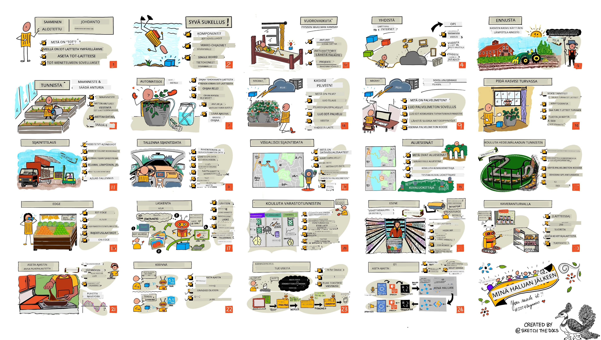

[](https://github.com/microsoft/IoT-For-Beginners/blob/master/LICENSE)
[](https://GitHub.com/microsoft/IoT-For-Beginners/graphs/contributors/)
[](https://GitHub.com/microsoft/IoT-For-Beginners/issues/)
[](https://GitHub.com/microsoft/IoT-For-Beginners/pulls/)
[](http://makeapullrequest.com)

[](https://GitHub.com/microsoft/IoT-For-Beginners/watchers/)
[](https://GitHub.com/microsoft/IoT-For-Beginners/network/)
[](https://GitHub.com/microsoft/IoT-For-Beginners/stargazers/)

### Liity Azure AI Foundry -yhteisöön

Jos jumitut tai sinulla on kysymyksiä tekoälysovellusten rakentamisesta, liity oppijoiden ja kokeneiden kehittäjien keskusteluihin MCP:stä. Se on kannustava yhteisö, jossa kysymyksiä otetaan vastaan ja tietoa jaetaan vapaasti.

[](https://discord.gg/nTYy5BXMWG)

Jos sinulla on palautetta tuotteesta tai kohtaat virheitä rakennusprosessissa, käy:

[](https://aka.ms/foundry/forum)

Seuraa näitä vaiheita aloittaaksesi näiden resurssien käytön:
1. **Tee haarukka**: Klikkaa [](https://GitHub.com/microsoft/IoT-For-Beginners/fork)
2. **Kloonaa repositorio**:   `git clone https://github.com/microsoft/IoT-For-Beginners.git`
3. [**Liity Microsoft Foundry Discordiin ja tapaa asiantuntijat ja muut kehittäjät**](https://discord.com/invite/ByRwuEEgH4)


### 🌐 Monikielinen tuki

#### Tuettu GitHub Actionin kautta (automaattinen ja aina ajan tasalla)

<!-- CO-OP TRANSLATOR LANGUAGES TABLE START -->
[Arabia](../ar/README.md) | [Bengali](../bn/README.md) | [Bulgaria](../bg/README.md) | [Burma (Myanmar)](../my/README.md) | [Kiina (yksinkertaistettu)](../zh-CN/README.md) | [Kiina (perinteinen, Hongkong)](../zh-HK/README.md) | [Kiina (perinteinen, Makao)](../zh-MO/README.md) | [Kiina (perinteinen, Taiwan)](../zh-TW/README.md) | [Kroatia](../hr/README.md) | [Tsekki](../cs/README.md) | [Tanska](../da/README.md) | [Hollanti](../nl/README.md) | [Viro](../et/README.md) | [Suomi](./README.md) | [Ranska](../fr/README.md) | [Saksa](../de/README.md) | [Kreikka](../el/README.md) | [Heprea](../he/README.md) | [Hindi](../hi/README.md) | [Unkari](../hu/README.md) | [Indonesia](../id/README.md) | [Italia](../it/README.md) | [Japani](../ja/README.md) | [Kannada](../kn/README.md) | [Khmer](../km/README.md) | [Korea](../ko/README.md) | [Liettua](../lt/README.md) | [Malaiji](../ms/README.md) | [Malayalam](../ml/README.md) | [Marathi](../mr/README.md) | [Nepali](../ne/README.md) | [Nigerian Pidgin](../pcm/README.md) | [Norja](../no/README.md) | [Persia (Farsi)](../fa/README.md) | [Puola](../pl/README.md) | [Portugali (Brasilia)](../pt-BR/README.md) | [Portugali (Portugali)](../pt-PT/README.md) | [Punjabi (Gurmukhi)](../pa/README.md) | [Romania](../ro/README.md) | [Venäjä](../ru/README.md) | [Serbia (kyrillinen)](../sr/README.md) | [Slovakki](../sk/README.md) | [Sloveeni](../sl/README.md) | [Espanja](../es/README.md) | [Swahili](../sw/README.md) | [Ruotsi](../sv/README.md) | [Tagalog (Filipino)](../tl/README.md) | [Tamili](../ta/README.md) | [Telugu](../te/README.md) | [Thai](../th/README.md) | [Turkki](../tr/README.md) | [Ukraina](../uk/README.md) | [Urdu](../ur/README.md) | [Vietnam](../vi/README.md)

> **Haluatko mieluummin kloonata paikallisesti?**
>
> Tämä repositorio sisältää yli 50 käännöstä, mikä lisää latauksen kokoa merkittävästi. Voit kloonata ilman käännöksiä käyttämällä sparse check-out -toimintoa:
>
> **Bash / macOS / Linux:**
> ```bash
> git clone --filter=blob:none --sparse https://github.com/microsoft/IoT-For-Beginners.git
> cd IoT-For-Beginners
> git sparse-checkout set --no-cone '/*' '!translations' '!translated_images'
> ```
>
> **CMD (Windows):**
> ```cmd
> git clone --filter=blob:none --sparse https://github.com/microsoft/IoT-For-Beginners.git
> cd IoT-For-Beginners
> git sparse-checkout set --no-cone "/*" "!translations" "!translated_images"
> ```
>
> Näin saat kaiken, mitä tarvitset kurssin suorittamiseen, huomattavasti nopeammalla latauksella.
<!-- CO-OP TRANSLATOR LANGUAGES TABLE END -->

# IoT aloittelijoille – Opintokokonaisuus

Microsoftin Azure Cloud Advocates tarjoaa 12 viikon, 24 oppitunnin opintokokonaisuuden, joka kattaa IoT:n perusteet. Jokaisessa oppitunnissa on esikurssi- ja jälkikurssitentit, kirjalliset ohjeet oppitunnin suorittamiseen, ratkaisut, tehtäviä ja muuta. Projektipohjainen opetusmenetelmämme mahdollistaa oppimisen rakentamisen ohessa, mikä on todettu tehokkaaksi tavaksi uuden taidon omaksumisessa.

Projektit seuraavat ruoan matkaa tilalta pöytään. Tämä sisältää viljelyn, logistiikan, valmistuksen, vähittäiskaupan ja kuluttajan – kaikki suosittuja IoT-laitteiden teollisuusalueita.



> Sketchnote: [Nitya Narasimhan](https://github.com/nitya). Klikkaa kuvaa suuremmaksi versioksi.

**Sydämellinen kiitos kirjoittajillemme [Jen Fox](https://github.com/jenfoxbot), [Jen Looper](https://github.com/jlooper), [Jim Bennett](https://github.com/jimbobbennett) sekä sketchnote-taiteilijallemme [Nitya Narasimhan](https://github.com/nitya).**

**Kiitos myös [Microsoft Learn Student Ambassadors](https://studentambassadors.microsoft.com?WT.mc_id=academic-17441-jabenn) -tiimillemme, jotka ovat tarkistaneet ja kääntäneet tämän opintokokonaisuuden – [Aditya Garg](https://github.com/AdityaGarg00), [Anurag Sharma](https://github.com/Anurag-0-1-A), [Arpita Das](https://github.com/Arpiiitaaa), [Aryan Jain](https://www.linkedin.com/in/aryan-jain-47a4a1145/), [Bhavesh Suneja](https://github.com/EliteWarrior315), [Faith Hunja](https://faithhunja.github.io/), [Lateefah Bello](https://www.linkedin.com/in/lateefah-bello/), [Manvi Jha](https://github.com/Severus-Matthew), [Mireille Tan](https://www.linkedin.com/in/mireille-tan-a4834819a/), [Mohammad Iftekher (Iftu) Ebne Jalal](https://github.com/Iftu119), [Mohammad Zulfikar](https://github.com/mohzulfikar), [Priyanshu Srivastav](https://www.linkedin.com/in/priyanshu-srivastav-b067241ba), [Thanmai Gowducheruvu](https://github.com/innovation-platform) ja [Zina Kamel](https://www.linkedin.com/in/zina-kamel/).**

Tutustu tiimiin!

[](https://youtu.be/-wippUJRi5k)

**Gif: [Mohit Jaisal](https://linkedin.com/in/mohitjaisal)**

> 🎥 Klikkaa yllä olevaa kuvaa nähdäksesi videon projektista!

> **Opettajat**, olemme [lisänneet joitain ehdotuksia](for-teachers.md) tämän oppimateriaalin käyttämiseen. Jos haluat luoda omia oppituntejasi, olemme myös liittäneet [oppituntipohjan](lesson-template/README.md).

> **[Opiskelijat](https://aka.ms/student-page)**, käyttääksesi tätä opintokokonaisuutta itsenäisesti, tee koko repositorion haarukka ja suorita tehtävät itse, aloittaen ennakkotentillä, lukemalla luentomateriaalin ja suorittamalla loput aktiviteeteista. Yritä rakentaa projektit ymmärtämällä oppitunnit sen sijaan, että kopioisit ratkaisukoodin; koodi on kuitenkin saatavilla /solutions -kansioissa kussakin projektilähtöisessä oppitunnissa. Toinen idea on muodostaa opiskeluryhmä ystävien kanssa ja käydä sisältö yhdessä läpi. Lisäopiskeluun suosittelemme [Microsoft Learn](https://docs.microsoft.com/users/jimbobbennett/collections/ke2ehd351jopwr?WT.mc_id=academic-17441-jabenn).

Katso kurssin yleiskatsausvideo täältä:

[](https://youtube.com/watch?v=bccEMm8gRuc "Promo video")

> 🎥 Klikkaa yllä olevaa kuvaa nähdäksesi videon projektista!

## Opetustapa

Olemme valinneet kaksi opetuksen periaatetta tämän opintokokonaisuuden rakentamisessa: varmistaa, että se on projektipohjainen ja että siihen sisältyy usein quiz-tilanteita. Sarjan lopussa opiskelijat ovat rakentaneet kasvien seuranta- ja kastelujärjestelmän, ajoneuvoseurannan, älytehtaan ruoan seuranta- ja tarkastusjärjestelmän sekä ääniohjatun kokkausajanottimen, ja he ovat oppineet esineiden internetin perusteet, mukaan lukien laitteen koodin kirjoittamisen, pilveen yhdistämisen, telemetrian analysoinnin ja tekoälyn käytön reunalla.

Varmistamalla, että sisältö liittyy suoraan projekteihin, prosessi on opiskelijoille kiinnostavampi ja käsitteiden muistaminen paranee.

Lisäksi matalan kynnyksen ennakkotentti ennen luentoa asettaa opiskelijan oppimishalukkuuden aiheeseen, ja jälkitentti luennon jälkeen varmistaa paremman sisäistämisen. Tämä opintokokonaisuus on suunniteltu joustavaksi ja hauskaksi, ja sen voi suorittaa kokonaan tai osittain. Projektit alkavat pienestä ja monimutkaistuvat vähitellen 12 viikon aikana.

Jokainen projekti perustuu opiskelijoiden ja harrastajien saatavilla olevaan todelliseen laitteistoon. Kukin projekti käsittelee omaa toimialaa, tarjoten asiaankuuluvaa taustatietoa. Onnistunut kehittäjä ymmärtää ongelmaratkaisualansa, ja tämä taustatieto auttaa opiskelijoita ajattelemaan IoT-ratkaisujaan ja oppejaan siitä näkökulmasta, millaisia todellisen maailman ongelmia he voivat IoT-kehittäjinä joutua ratkomaan. Opiskelijat oppivat rakentamiensa ratkaisujen "miksi" ja saavat ymmärryksen loppukäyttäjästä.

## Laitteisto
Meillä on kaksi IoT-laitteistovaihtoehtoa projekteihin henkilökohtaisten mieltymysten, ohjelmointikielitietämyksen, oppimistavoitteiden ja saatavuuden mukaan. Olemme myös tarjanneet 'virtuaalilaitteiston' version niille, joilla ei ole pääsyä laitteistoon tai jotka haluavat oppia lisää ennen ostopäätöstä. Voit lukea lisää ja löytää 'ostospäiväkirjan' [laitteistosivulta](./hardware.md), mukaan lukien linkkejä täydellisten sarjojen ostamiseen ystäviltämme Seeed Studiolta.

> 💁 Löydä [käyttäytymissääntömme](CODE_OF_CONDUCT.md), [osallistumisohjeet](CONTRIBUTING.md) ja [käännösohjeet](..). Otamme mielellämme vastaan rakentavaa palautettasi!
>
> 🔧 Ongelmia? Tarkista [vianetsintäoppaamme](TROUBLESHOOTING.md) yleisten ongelmien ratkaisuihin.

## Jokainen oppitunti sisältää:

- muistiinpanot
- valinnainen lisävideo
- ennakkolämmittelykysely
- kirjallinen oppitunti
- projektiin perustuvissa oppitunneissa askel-askeleelta ohjeet projektin rakentamiseen
- tietovisat
- haasteen
- lisälukemista
- tehtävän
- [jälkivisailun](https://ff-quizzes.netlify.app/en/)

> **Huomautus visoista**: Kaikki visat löytyvät quiz-app-kansiosta, yhteensä 48 visaa, joissa jokaisessa on kolme kysymystä. Ne linkitetään oppituntien sisällä, mutta visasovellus voidaan ajaa paikallisesti tai ottaa käyttöön Azureen; seuraa ohjeita `quiz-app`-kansiossa. Ne ovat vähitellen lokalisoitumassa.

## Oppitunnit

|       |              Projektin nimi              |                       Opetettavat käsitteet                       | Oppimistavoitteet                                                                                                                                                 |                                                        Linkitetty oppitunti                                                         |
| :---: | :------------------------------------: | :---------------------------------------------------------: | ------------------------------------------------------------------------------------------------------------------------------------------------------------------- | :--------------------------------------------------------------------------------------------------------------------------: |
|  01   | [Aloittaminen](./1-getting-started/README.md) |                     Johdatus IoT:hen                     | Opettele IoT:n periaatteet ja IoT-ratkaisujen perusrakenteet, kuten sensorit ja pilvipalvelut, kun asennat ensimmäisen IoT-laitteesi |                      [Johdatus IoT:hen](./1-getting-started/lessons/1-introduction-to-iot/README.md)                      |
|  02   | [Aloittaminen](./1-getting-started/README.md) |                   Syvempää IoT:stä                    | Opettele lisää IoT-järjestelmän komponenteista sekä mikrokontrollereista ja yksikorteista                                                                |                        [Syvempää IoT:stä](./1-getting-started/lessons/2-deeper-dive/README.md)                         |
|  03   | [Aloittaminen](./1-getting-started/README.md) | Vuorovaikutus fyysisen maailman kanssa sensoreilla ja toimilaitteilla | Opettele sensoreista kerätäksesi dataa fyysisestä maailmasta ja toimilaitteista palautteen antamiseksi rakentaessasi yövalon                                           | [Vuorovaikutus fyysisen maailman kanssa sensoreilla ja toimilaitteilla](./1-getting-started/lessons/3-sensors-and-actuators/README.md) |
|  04   | [Aloittaminen](./1-getting-started/README.md) |             Yhdistä laitteesi internetiin             | Opettele yhdistämään IoT-laite internetiin lähettääksesi ja vastaanottaaksesi viestejä kytkemällä yövalosi MQTT-välittäjään                               |               [Yhdistä laitteesi internetiin](./1-getting-started/lessons/4-connect-internet/README.md)                |
|  05   |            [Maatila](./2-farm/README.md)            |                    Ennusta kasvin kasvu                     | Opettele ennustamaan kasvin kasvua IoT-laitteella kerätyn lämpötiladatan avulla                                                                                  |                          [Ennusta kasvin kasvu](./2-farm/lessons/1-predict-plant-growth/README.md)                           |
|  06   |            [Maatila](./2-farm/README.md)            |                    Tunnista maaperän kosteus                     | Opettele tunnistamaan maaperän kosteus ja kalibroi maaperäkosteussensori                                                                                              |                          [Tunnista maaperän kosteus](./2-farm/lessons/2-detect-soil-moisture/README.md)                           |
|  07   |            [Maatila](./2-farm/README.md)            |                  Automaattinen kasvien kastelu                   | Opettele automatisoimaan ja ajoittamaan kastelu releellä ja MQTT:llä                                                                                                      |                      [Automaattinen kasvien kastelu](./2-farm/lessons/3-automated-plant-watering/README.md)                       |
|  08   |            [Maatila](./2-farm/README.md)            |               Siirrä kasvisi pilveen               | Opettele pilvestä ja pilvipohjaisista IoT-palveluista sekä miten yhdistää kasvisi johonkin näistä julkisen MQTT-välittäjän sijaan                                   |               [Siirrä kasvisi pilveen](./2-farm/lessons/4-migrate-your-plant-to-the-cloud/README.md)                |
|  09   |            [Maatila](./2-farm/README.md)            |         Siirrä sovelluslogiikkasi pilveen         | Opettele, miten voit kirjoittaa sovelluslogiikkaa pilvessä, joka reagoi IoT-viesteihin                                                                          |         [Siirrä sovelluslogiikkasi pilveen](./2-farm/lessons/5-migrate-application-to-the-cloud/README.md)         |
|  10   |            [Maatila](./2-farm/README.md)            |                   Pidä kasvisi turvassa                    | Opettele tietoturvasta IoT:n kanssa ja miten pidät kasvisi turvassa avainten ja sertifikaattien avulla                                                                              |                        [Pidä kasvisi turvassa](./2-farm/lessons/6-keep-your-plant-secure/README.md)                         |
|  11   |       [Kuljetus](./3-transport/README.md)       |                      Sijainnin seuranta                      | Opettele GPS-sijainnin seurannasta IoT-laitteille                                                                                                                   |                           [Sijainnin seuranta](./3-transport/lessons/1-location-tracking/README.md)                           |
|  12   |       [Kuljetus](./3-transport/README.md)       |                     Tallenna sijaintitiedot                     | Opettele tallentamaan IoT-dataa myöhempää visualisointia tai analysointia varten                                                                                                      |                         [Tallenna sijaintitiedot](./3-transport/lessons/2-store-location-data/README.md)                         |
|  13   |       [Kuljetus](./3-transport/README.md)       |                   Visualisoi sijaintidata                   | Opettele visualisoimaan sijaintitietoja kartalla, ja miten kartat kuvaavat todellista 3D-maailmaa 2-ulotteisesti                                                            |                     [Visualisoi sijaintidata](./3-transport/lessons/3-visualize-location-data/README.md)                     |
|  14   |       [Kuljetus](./3-transport/README.md)       |                          Alueaidat                          | Opettele geofences-alueista ja miten niitä voidaan käyttää ilmoittamaan, kun kuljetusketjun ajoneuvot ovat lähellä määränpäätään                                           |                                   [Alueaidat](./3-transport/lessons/4-geofences/README.md)                                   |
|  15   |   [Valmistus](./4-manufacturing/README.md)   |               Kouluta hedelmien laadun tunnistin                | Opettele kouluttamaan pilvessä kuvatunnistinta hedelmien laadun havaitsemiseksi                                                                                       |                 [Kouluta hedelmien laadun tunnistin](./4-manufacturing/lessons/1-train-fruit-detector/README.md)                 |
|  16   |   [Valmistus](./4-manufacturing/README.md)   |           Tarkista hedelmien laatu IoT-laitteesta            | Opettele käyttämään hedelmien laatu -tunnistinta IoT-laitteesta                                                                                                    |           [Tarkista hedelmien laatu IoT-laitteesta](./4-manufacturing/lessons/2-check-fruit-from-device/README.md)            |
|  17   |   [Valmistus](./4-manufacturing/README.md)   |             Suorita hedelmien tunnistin reunalaitteella             | Opettele suorittamaan hedelmien tunnistin IoT-laitteessa reunalla                                                                                                |             [Suorita hedelmien tunnistin reunalaitteella](./4-manufacturing/lessons/3-run-fruit-detector-edge/README.md)             |
|  18   |   [Valmistus](./4-manufacturing/README.md)   |        Käynnistä hedelmien laadun tunnistus sensorista        | Opettele käynnistämään hedelmien laadun tunnistus sensorista                                                                                                        |        [Käynnistä hedelmien laadun tunnistus sensorista](./4-manufacturing/lessons/4-trigger-fruit-detector/README.md)         |
|  19   |          [Vähittäiskauppa](./5-retail/README.md)          |                   Kouluta varaston tunnistin                    | Opettele käyttämään kohdetunnistusta varaston laskuun kaupassa                                                                                |                        [Kouluta varaston tunnistin](./5-retail/lessons/1-train-stock-detector/README.md)                         |
|  20   |          [Vähittäiskauppa](./5-retail/README.md)          |               Tarkista varasto IoT-laitteesta                | Opettele tarkistamaan varasto IoT-laitteella käyttämällä kohdetunnistusmallia                                                                                         |                     [Tarkista varasto IoT-laitteesta](./5-retail/lessons/2-check-stock-device/README.md)                      |
|  21   |        [Kuluttaja](./6-consumer/README.md)        |             Tunnista puhe IoT-laitteella             | Opettele tunnistamaan puhe IoT-laitteelta rakentaaksesi älykkään ajastimen                                                                                             |                  [Tunnista puhe IoT-laitteella](./6-consumer/lessons/1-speech-recognition/README.md)                  |
|  22   |        [Kuluttaja](./6-consumer/README.md)        |                     Ymmärrä kieli                     | Opettele ymmärtämään IoT-laitteelle puhutut lauseet                                                                                                           |                        [Ymmärrä kieli](./6-consumer/lessons/2-language-understanding/README.md)                        |
|  23   |        [Kuluttaja](./6-consumer/README.md)        |           Aseta ajastin ja anna puhepalautetta           | Opettele asettamaan ajastin IoT-laitteessa ja antamaan puhepalautetta ajastimen asettamisesta ja päättymisestä                                                    |                 [Aseta ajastin ja anna puhepalautetta](./6-consumer/lessons/3-spoken-feedback/README.md)                  |
|  24   |        [Kuluttaja](./6-consumer/README.md)        |                 Tue useaa kieltä                  | Opettele tukemaan useita kieliä sekä puhuttuna että älykkään ajastimesi vastauksissa                                                               |                   [Tue useaa kieltä](./6-consumer/lessons/4-multiple-language-support/README.md)                   |

## Offline-käyttö

Voit käyttää tätä dokumentaatiota offline-tilassa käyttämällä [Docsify](https://docsify.js.org/#/). Haarauta tämä repo, [asenna Docsify](https://docsify.js.org/#/quickstart) paikalliselle koneellesi ja kirjoita sitten tämän repohakemiston juurikansiossa `docsify serve`. Verkkosivusto palvelee portissa 3000 paikallisessa koneessasi: `localhost:3000`.

## Visa

Kiitos yhteisölle interaktiivisen visan ylläpidosta, joka testaa tietosi jokaisesta kappaleesta. Testaa tietosi [täältä](https://ff-quizzes.netlify.app/en/).

### PDF

Voit luoda PDF-tiedoston tästä sisällöstä offline-käyttöä varten tarvittaessa. Tee tämä varmistaen, että sinulla on [npm asennettuna](https://docs.npmjs.com/downloading-and-installing-node-js-and-npm) ja aja seuraavat komennot tämän repohakemiston juuressa:

```sh
npm i
npm run convert
```

### Esitykset

Joistakin oppitunneista on esityskalvot [slides](../../slides)-kansiossa.

## Muut opetussuunnitelmat

Tiimimme tuottaa muitakin opetussuunnitelmia! Tutustu:

<!-- CO-OP TRANSLATOR OTHER COURSES START -->
### LangChain
[](https://aka.ms/langchain4j-for-beginners)
[](https://aka.ms/langchainjs-for-beginners?WT.mc_id=m365-94501-dwahlin)
[](https://github.com/microsoft/langchain-for-beginners?WT.mc_id=m365-94501-dwahlin)
---

### Azure / Edge / MCP / Agentit
[](https://github.com/microsoft/AZD-for-beginners?WT.mc_id=academic-105485-koreyst)
[](https://github.com/microsoft/edgeai-for-beginners?WT.mc_id=academic-105485-koreyst)
[](https://github.com/microsoft/mcp-for-beginners?WT.mc_id=academic-105485-koreyst)
[](https://github.com/microsoft/ai-agents-for-beginners?WT.mc_id=academic-105485-koreyst)

---
 
### Generatiivisen tekoälyn sarja
[](https://github.com/microsoft/generative-ai-for-beginners?WT.mc_id=academic-105485-koreyst)
[-9333EA?style=for-the-badge&labelColor=E5E7EB&color=9333EA)](https://github.com/microsoft/Generative-AI-for-beginners-dotnet?WT.mc_id=academic-105485-koreyst)
[-C084FC?style=for-the-badge&labelColor=E5E7EB&color=C084FC)](https://github.com/microsoft/generative-ai-for-beginners-java?WT.mc_id=academic-105485-koreyst)
[-E879F9?style=for-the-badge&labelColor=E5E7EB&color=E879F9)](https://github.com/microsoft/generative-ai-with-javascript?WT.mc_id=academic-105485-koreyst)

---
 
### Perusoppiminen
[](https://aka.ms/ml-beginners?WT.mc_id=academic-105485-koreyst)
[](https://aka.ms/datascience-beginners?WT.mc_id=academic-105485-koreyst)
[](https://aka.ms/ai-beginners?WT.mc_id=academic-105485-koreyst)
[](https://github.com/microsoft/Security-101?WT.mc_id=academic-96948-sayoung)
[](https://aka.ms/webdev-beginners?WT.mc_id=academic-105485-koreyst)
[](https://aka.ms/iot-beginners?WT.mc_id=academic-105485-koreyst)
[](https://github.com/microsoft/xr-development-for-beginners?WT.mc_id=academic-105485-koreyst)

---
 
### Copilot-sarja
[](https://aka.ms/GitHubCopilotAI?WT.mc_id=academic-105485-koreyst)
[](https://github.com/microsoft/mastering-github-copilot-for-dotnet-csharp-developers?WT.mc_id=academic-105485-koreyst)
[](https://github.com/microsoft/CopilotAdventures?WT.mc_id=academic-105485-koreyst)
<!-- CO-OP TRANSLATOR OTHER COURSES END -->

## Kuvien tekijänoikeudet

Kaikki tässä opetussuunnitelmassa käytettyjen kuvien tekijänoikeudet löydät tarvittaessa kohdasta [Attributions](./attributions.md).

---

<!-- CO-OP TRANSLATOR DISCLAIMER START -->
**Vastuuvapauslauseke**:  
Tämä asiakirja on käännetty tekoälypohjaisella käännöspalvelulla [Co-op Translator](https://github.com/Azure/co-op-translator). Vaikka pyrimme tarkkuuteen, automaattiset käännökset saattavat sisältää virheitä tai epätarkkuuksia. Alkuperäistä asiakirjaa sen omalla kielellä tulee pitää virallisena lähteenä. Tärkeiden tietojen osalta suositellaan ammattimaista ihmiskäännöstä. Emme ole vastuussa tästä käännöksestä aiheutuvista väärinymmärryksistä tai tulkinnoista.
<!-- CO-OP TRANSLATOR DISCLAIMER END -->