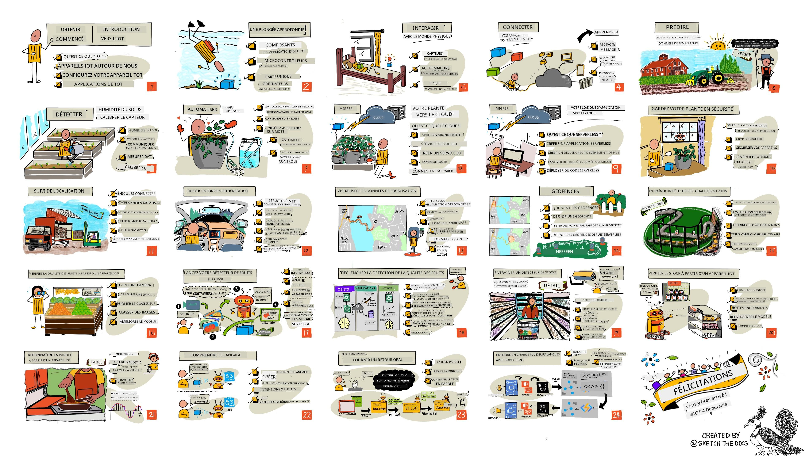

<!--
CO_OP_TRANSLATOR_METADATA:
{
  "original_hash": "6c354ec3487e4f6cfafbe44557996cd9",
  "translation_date": "2026-01-05T12:23:51+00:00",
  "source_file": "README.md",
  "language_code": "fr"
}
-->
[](https://github.com/microsoft/IoT-For-Beginners/blob/master/LICENSE)
[](https://GitHub.com/microsoft/IoT-For-Beginners/graphs/contributors/)
[](https://GitHub.com/microsoft/IoT-For-Beginners/issues/)
[](https://GitHub.com/microsoft/IoT-For-Beginners/pulls/)
[](http://makeapullrequest.com)

[](https://GitHub.com/microsoft/IoT-For-Beginners/watchers/)
[](https://GitHub.com/microsoft/IoT-For-Beginners/network/)
[](https://GitHub.com/microsoft/IoT-For-Beginners/stargazers/)

### Rejoignez la Communauté Azure AI Foundry

Si vous êtes bloqué ou avez des questions sur la création d’applications IA. Rejoignez d’autres apprenants et développeurs expérimentés dans des discussions sur MCP. C’est une communauté de soutien où les questions sont les bienvenues et où les connaissances sont librement partagées.

[](https://discord.gg/nTYy5BXMWG)

Si vous avez des retours produit ou des erreurs lors de la création, visitez :

[](https://aka.ms/foundry/forum)

Suivez ces étapes pour commencer à utiliser ces ressources :
1. **Forkez le dépôt** : Cliquez sur [](https://GitHub.com/microsoft/IoT-For-Beginners/fork)
2. **Clonez le dépôt** :   `git clone https://github.com/microsoft/IoT-For-Beginners.git`
3. [**Rejoignez le Discord Microsoft Foundry et rencontrez des experts et autres développeurs**](https://discord.com/invite/ByRwuEEgH4)


### 🌐 Support Multilingue

#### Supporté via GitHub Action (Automatisé & Toujours à jour)

<!-- CO-OP TRANSLATOR LANGUAGES TABLE START -->
[Arabe](../ar/README.md) | [Bengali](../bn/README.md) | [Bulgare](../bg/README.md) | [Birman (Myanmar)](../my/README.md) | [Chinois (Simplifié)](../zh/README.md) | [Chinois (Traditionnel, Hong Kong)](../hk/README.md) | [Chinois (Traditionnel, Macao)](../mo/README.md) | [Chinois (Traditionnel, Taïwan)](../tw/README.md) | [Croate](../hr/README.md) | [Tchèque](../cs/README.md) | [Danois](../da/README.md) | [Néerlandais](../nl/README.md) | [Estonien](../et/README.md) | [Finnois](../fi/README.md) | [Français](./README.md) | [Allemand](../de/README.md) | [Grec](../el/README.md) | [Hébreu](../he/README.md) | [Hindi](../hi/README.md) | [Hongrois](../hu/README.md) | [Indonésien](../id/README.md) | [Italien](../it/README.md) | [Japonais](../ja/README.md) | [Kannada](../kn/README.md) | [Coréen](../ko/README.md) | [Lituanien](../lt/README.md) | [Malais](../ms/README.md) | [Malayalam](../ml/README.md) | [Marathi](../mr/README.md) | [Népalais](../ne/README.md) | [Pidgin nigérian](../pcm/README.md) | [Norvégien](../no/README.md) | [Persan (Farsi)](../fa/README.md) | [Polonais](../pl/README.md) | [Portugais (Brésil)](../br/README.md) | [Portugais (Portugal)](../pt/README.md) | [Pendjabi (Gurmukhî)](../pa/README.md) | [Roumain](../ro/README.md) | [Russe](../ru/README.md) | [Serbe (Cyrillique)](../sr/README.md) | [Slovaque](../sk/README.md) | [Slovène](../sl/README.md) | [Espagnol](../es/README.md) | [Swahili](../sw/README.md) | [Suédois](../sv/README.md) | [Tagalog (Philippin)](../tl/README.md) | [Tamoul](../ta/README.md) | [Télougou](../te/README.md) | [Thaï](../th/README.md) | [Turc](../tr/README.md) | [Ukrainien](../uk/README.md) | [Ourdou](../ur/README.md) | [Vietnamien](../vi/README.md)

> **Préférez cloner localement ?**

> Ce dépôt inclut plus de 50 traductions linguistiques ce qui augmente significativement la taille du téléchargement. Pour cloner sans les traductions, utilisez le checkout sparse :
> ```bash
> git clone --filter=blob:none --sparse https://github.com/microsoft/IoT-For-Beginners.git
> cd IoT-For-Beginners
> git sparse-checkout set --no-cone '/*' '!translations' '!translated_images'
> ```
> Cela vous fournit tout ce dont vous avez besoin pour compléter le cours avec un téléchargement bien plus rapide.
<!-- CO-OP TRANSLATOR LANGUAGES TABLE END -->

# IoT pour débutants - Un programme

Les Azure Cloud Advocates chez Microsoft ont le plaisir de proposer un programme de 12 semaines, 24 leçons entièrement dédié aux bases de l’IoT. Chaque leçon inclut des quiz avant et après la leçon, des instructions écrites pour compléter la leçon, une solution, un devoir et plus encore. Notre pédagogie basée sur des projets vous permet d’apprendre en construisant, une méthode prouvée pour assimiler de nouvelles compétences.

Les projets couvrent le parcours de la nourriture de la ferme à la table. Cela inclut l’agriculture, la logistique, la fabrication, le commerce de détail et le consommateur – toutes des industries populaires pour les dispositifs IoT.



> Schéma réalisé par [Nitya Narasimhan](https://github.com/nitya). Cliquez sur l’image pour une version agrandie.

**Un grand merci à nos auteurs [Jen Fox](https://github.com/jenfoxbot), [Jen Looper](https://github.com/jlooper), [Jim Bennett](https://github.com/jimbobbennett), et à notre artiste sketchnote [Nitya Narasimhan](https://github.com/nitya).**

**Merci également à notre équipe d’[Ambassadeurs Étudiants Microsoft Learn](https://studentambassadors.microsoft.com?WT.mc_id=academic-17441-jabenn) qui ont relu et traduit ce programme – [Aditya Garg](https://github.com/AdityaGarg00), [Anurag Sharma](https://github.com/Anurag-0-1-A), [Arpita Das](https://github.com/Arpiiitaaa), [Aryan Jain](https://www.linkedin.com/in/aryan-jain-47a4a1145/), [Bhavesh Suneja](https://github.com/EliteWarrior315), [Faith Hunja](https://faithhunja.github.io/), [Lateefah Bello](https://www.linkedin.com/in/lateefah-bello/), [Manvi Jha](https://github.com/Severus-Matthew), [Mireille Tan](https://www.linkedin.com/in/mireille-tan-a4834819a/), [Mohammad Iftekher (Iftu) Ebne Jalal](https://github.com/Iftu119), [Mohammad Zulfikar](https://github.com/mohzulfikar), [Priyanshu Srivastav](https://www.linkedin.com/in/priyanshu-srivastav-b067241ba), [Thanmai Gowducheruvu](https://github.com/innovation-platform), et [Zina Kamel](https://www.linkedin.com/in/zina-kamel/).**

Rencontrez l’équipe !

[](https://youtu.be/-wippUJRi5k)

**Gif par** [Mohit Jaisal](https://linkedin.com/in/mohitjaisal)

> 🎥 Cliquez sur l’image ci-dessus pour voir une vidéo à propos du projet !

> **Enseignants**, nous avons [inclus quelques suggestions](for-teachers.md) sur la façon d’utiliser ce programme. Si vous souhaitez créer vos propres leçons, nous avons aussi inclus un [modèle de leçon](lesson-template/README.md).

> **[Étudiants](https://aka.ms/student-page)**, pour utiliser ce programme de manière autonome, forkez l’intégralité du dépôt et complétez les exercices par vous-mêmes, en commençant par un quiz avant le cours, puis en lisant la leçon et en accomplissant le reste des activités. Essayez de créer les projets en comprenant les leçons plutôt qu’en copiant le code solution ; cependant ce code est disponible dans les dossiers /solutions dans chaque leçon orientée projet. Une autre idée serait de former un groupe d’étude avec des amis et de parcourir le contenu ensemble. Pour une étude plus approfondie, nous recommandons [Microsoft Learn](https://docs.microsoft.com/users/jimbobbennett/collections/ke2ehd351jopwr?WT.mc_id=academic-17441-jabenn).

Pour un aperçu vidéo de ce cours, regardez cette vidéo :

[](https://youtube.com/watch?v=bccEMm8gRuc "Vidéo promotionnelle")

> 🎥 Cliquez sur l’image ci-dessus pour voir une vidéo à propos du projet !

## Pédagogie

Nous avons choisi deux principes pédagogiques lors de la création de ce programme : garantir qu’il soit basé sur des projets et qu’il inclue des quiz fréquents. À la fin de cette série, les étudiants auront construit un système de surveillance et d’arrosage de plante, un traceur de véhicule, une installation d’usine intelligente pour suivre et vérifier la nourriture, et un minuteur de cuisson contrôlé par la voix, et auront appris les bases de l’Internet des Objets incluant comment écrire du code pour dispositifs, se connecter au cloud, analyser la télémétrie et exécuter l’IA en périphérie.

En veillant à ce que le contenu soit aligné avec des projets, le processus devient plus engageant pour les étudiants et la rétention des concepts sera améliorée.

De plus, un quiz à faible enjeu avant un cours établit l’intention de l’étudiant envers l’apprentissage d’un sujet, tandis qu’un second quiz après le cours assure une meilleure rétention. Ce programme a été conçu pour être flexible et amusant et peut être suivi en totalité ou en partie. Les projets commencent petits et deviennent de plus en plus complexes d’ici la fin du cycle de 12 semaines.

Chaque projet est basé autour de matériel réel disponible pour les étudiants et amateurs. Chaque projet examine le domaine spécifique du projet, fournissant les connaissances de base pertinentes. Pour être un développeur performant, il est utile de comprendre le domaine dans lequel vous résolvez des problèmes, fournir ces connaissances de base permet aux étudiants de réfléchir à leurs solutions IoT et à leurs apprentissages dans le contexte du type de problème réel qu’ils pourraient être amenés à résoudre en tant que développeur IoT. Les étudiants apprennent le « pourquoi » des solutions qu’ils construisent, et se familiarisent avec l’utilisateur final.

## Matériel

Nous avons deux choix de matériel IoT à utiliser pour les projets selon les préférences personnelles, les connaissances ou préférences en langage de programmation, les objectifs d’apprentissage et la disponibilité. Nous avons également fourni une version de « matériel virtuel » pour ceux qui n’ont pas accès au matériel, ou qui veulent en apprendre plus avant de s’engager dans un achat. Vous pouvez en lire davantage et trouver une « liste de courses » sur la [page matériel](./hardware.md), incluant des liens pour acheter des kits complets auprès de nos amis de Seeed Studio.
> 💁 Retrouvez nos directives [Code de conduite](CODE_OF_CONDUCT.md), [Contribution](CONTRIBUTING.md) et [Traduction](TRANSLATIONS.md). Nous accueillons vos retours constructifs !
>
> 🔧 Vous rencontrez des problèmes ? Consultez notre [Guide de dépannage](TROUBLESHOOTING.md) pour des solutions aux problèmes courants.

## Chaque leçon comprend :

- sketchnote
- vidéo complémentaire optionnelle
- quiz d'échauffement avant la leçon
- leçon écrite
- pour les leçons basées sur un projet, des guides étape par étape pour construire le projet
- tests de connaissances
- un défi
- lecture complémentaire
- devoir
- [quiz post-leçon](https://ff-quizzes.netlify.app/en/)

> **Une note à propos des quiz** : Tous les quiz sont contenus dans le dossier quiz-app, pour un total de 48 quiz avec trois questions chacun. Ils sont liés depuis les leçons mais l'application de quiz peut être exécutée localement ou déployée sur Azure ; suivez les instructions dans le dossier `quiz-app`. Ils sont progressivement localisés.

## Leçons

|       |               Nom du projet               |                        Concepts enseignés                        | Objectifs d'apprentissage                                                                                                                                           |                                                      Leçon liée                                                      |
| :---: | :--------------------------------------: | :--------------------------------------------------------------: | ------------------------------------------------------------------------------------------------------------------------------------------------------------------- | :-------------------------------------------------------------------------------------------------------------------: |
|  01   | [Premiers pas](./1-getting-started/README.md) |                     Introduction à l’IoT                        | Apprenez les principes de base de l’IoT et les éléments fondamentaux des solutions IoT tels que les capteurs et les services cloud tout en configurant votre premier appareil IoT |                      [Introduction à l’IoT](./1-getting-started/lessons/1-introduction-to-iot/README.md)               |
|  02   | [Premiers pas](./1-getting-started/README.md) |                  Approfondissement de l’IoT                    | Apprenez davantage sur les composants d’un système IoT, ainsi que sur les microcontrôleurs et les ordinateurs monocartes                                                   |                        [Approfondissement de l’IoT](./1-getting-started/lessons/2-deeper-dive/README.md)               |
|  03   | [Premiers pas](./1-getting-started/README.md) | Interaction avec le monde physique via capteurs et actionneurs | Apprenez à utiliser des capteurs pour recueillir des données du monde physique et des actionneurs pour envoyer des réactions, tout en construisant une veilleuse         | [Interaction avec le monde physique via capteurs et actionneurs](./1-getting-started/lessons/3-sensors-and-actuators/README.md) |
|  04   | [Premiers pas](./1-getting-started/README.md) |                Connectez votre appareil à Internet               | Apprenez comment connecter un appareil IoT à Internet pour envoyer et recevoir des messages en connectant votre veilleuse à un courtier MQTT                           |               [Connecter votre appareil à Internet](./1-getting-started/lessons/4-connect-internet/README.md)          |
|  05   |              [Ferme](./2-farm/README.md)             |                  Prédire la croissance des plantes             | Apprenez à prédire la croissance des plantes en utilisant les données de température capturées par un appareil IoT                                                    |                        [Prédire la croissance des plantes](./2-farm/lessons/1-predict-plant-growth/README.md)          |
|  06   |              [Ferme](./2-farm/README.md)             |                  Détecter l’humidité du sol                     | Apprenez à détecter l’humidité du sol et à calibrer un capteur d’humidité du sol                                                                                        |                        [Détecter l’humidité du sol](./2-farm/lessons/2-detect-soil-moisture/README.md)                  |
|  07   |              [Ferme](./2-farm/README.md)             |                  Arrosage automatisé des plantes                | Apprenez à automatiser et minuter l’arrosage en utilisant un relais et MQTT                                                                                           |                    [Arrosage automatisé des plantes](./2-farm/lessons/3-automated-plant-watering/README.md)             |
|  08   |              [Ferme](./2-farm/README.md)             |               Migrer votre plante vers le cloud                 | Découvrez le cloud et les services IoT hébergés dans le cloud et comment connecter votre plante à l’un d’eux au lieu d’un courtier MQTT public                         |               [Migrer votre plante vers le cloud](./2-farm/lessons/4-migrate-your-plant-to-the-cloud/README.md)         |
|  09   |              [Ferme](./2-farm/README.md)             |              Migrer votre logique d’application vers le cloud   | Apprenez comment écrire une logique d’application dans le cloud qui réagit aux messages IoT                                                                           |         [Migrer votre logique d’application vers le cloud](./2-farm/lessons/5-migrate-application-to-the-cloud/README.md) |
|  10   |              [Ferme](./2-farm/README.md)             |                  Sécuriser votre plante                         | Apprenez la sécurité en IoT et comment protéger votre plante avec des clés et des certificats                                                                          |                          [Sécuriser votre plante](./2-farm/lessons/6-keep-your-plant-secure/README.md)                   |
|  11   |           [Transport](./3-transport/README.md)           |                    Suivi de localisation                        | Apprenez le suivi GPS de localisation pour les appareils IoT                                                                                                         |                          [Suivi de localisation](./3-transport/lessons/1-location-tracking/README.md)                     |
|  12   |           [Transport](./3-transport/README.md)           |                     Stocker les données de localisation         | Apprenez à stocker des données IoT pour les visualiser ou les analyser ultérieurement                                                                                  |                        [Stocker les données de localisation](./3-transport/lessons/2-store-location-data/README.md)       |
|  13   |           [Transport](./3-transport/README.md)           |                  Visualiser les données de localisation         | Découvrez comment visualiser les données de localisation sur une carte et comment les cartes représentent le monde réel en 3D dans 2 dimensions                       |                     [Visualiser les données de localisation](./3-transport/lessons/3-visualize-location-data/README.md)   |
|  14   |           [Transport](./3-transport/README.md)           |                            Géorepérages                         | Découvrez les géorepérages et comment ils peuvent être utilisés pour alerter lorsque des véhicules dans la chaîne d’approvisionnement sont proches de leur destination |                                     [Géorepérages](./3-transport/lessons/4-geofences/README.md)                      |
|  15   |       [Fabrication](./4-manufacturing/README.md)       |                Former un détecteur de qualité de fruits       | Apprenez à former un classificateur d'images dans le cloud pour détecter la qualité des fruits                                                                         |                     [Former un détecteur de qualité de fruits](./4-manufacturing/lessons/1-train-fruit-detector/README.md) |
|  16   |       [Fabrication](./4-manufacturing/README.md)       |               Vérifier la qualité des fruits depuis un appareil IoT | Découvrez comment utiliser votre détecteur de qualité des fruits depuis un appareil IoT                                                                               |               [Vérifier la qualité des fruits depuis un appareil IoT](./4-manufacturing/lessons/2-check-fruit-from-device/README.md) |
|  17   |       [Fabrication](./4-manufacturing/README.md)       |               Exécuter votre détecteur de fruits en périphérie | Apprenez à exécuter votre détecteur de fruits sur un appareil IoT en périphérie                                                                                       |               [Exécuter votre détecteur de fruits en périphérie](./4-manufacturing/lessons/3-run-fruit-detector-edge/README.md) |
|  18   |       [Fabrication](./4-manufacturing/README.md)       |             Déclencher la détection de qualité des fruits via un capteur | Apprenez à déclencher la détection de qualité des fruits à partir d'un capteur                                                                                       |             [Déclencher la détection de qualité des fruits via un capteur](./4-manufacturing/lessons/4-trigger-fruit-detector/README.md) |
|  19   |           [Commerce](./5-retail/README.md)            |                   Former un détecteur de stock                 | Apprenez à utiliser la détection d’objets pour former un détecteur de stock afin de compter le stock dans un magasin                                                  |                        [Former un détecteur de stock](./5-retail/lessons/1-train-stock-detector/README.md)                 |
|  20   |           [Commerce](./5-retail/README.md)            |                Vérifier le stock depuis un appareil IoT        | Apprenez à vérifier le stock depuis un appareil IoT en utilisant un modèle de détection d’objets                                                                      |                      [Vérifier le stock depuis un appareil IoT](./5-retail/lessons/2-check-stock-device/README.md)         |
|  21   |         [Consommateur](./6-consumer/README.md)         |           Reconnaître la parole avec un appareil IoT           | Apprenez à reconnaître la parole depuis un appareil IoT pour construire un minuteur intelligent                                                                       |                 [Reconnaître la parole avec un appareil IoT](./6-consumer/lessons/1-speech-recognition/README.md)          |
|  22   |         [Consommateur](./6-consumer/README.md)         |                   Comprendre la langue                          | Apprenez à comprendre des phrases parlées à un appareil IoT                                                                                                          |                        [Comprendre la langue](./6-consumer/lessons/2-language-understanding/README.md)                    |
|  23   |         [Consommateur](./6-consumer/README.md)         |               Régler un minuteur et fournir un retour vocal    | Apprenez à régler un minuteur sur un appareil IoT et donner un retour vocal lorsque le minuteur est réglé et lorsqu’il se termine                                    |                  [Régler un minuteur et fournir un retour vocal](./6-consumer/lessons/3-spoken-feedback/README.md)         |
|  24   |         [Consommateur](./6-consumer/README.md)         |                 Supporter plusieurs langues                     | Apprenez à supporter plusieurs langues, aussi bien dans la compréhension que dans les réponses de votre minuteur intelligent                                         |               [Supporter plusieurs langues](./6-consumer/lessons/4-multiple-language-support/README.md)                   |

## Accès hors ligne

Vous pouvez consulter cette documentation hors ligne en utilisant [Docsify](https://docsify.js.org/#/). Clonez ce dépôt, [installez Docsify](https://docsify.js.org/#/quickstart) sur votre machine locale, puis dans le dossier racine de ce dépôt, tapez `docsify serve`. Le site sera servi sur le port 3000 sur votre localhost : `localhost:3000`.

## Quiz

Merci à la communauté d’héberger le quiz interactif qui teste vos connaissances sur chacun des chapitres. Testez vos connaissances [ici](https://ff-quizzes.netlify.app/en/) 

### PDF

Vous pouvez générer un PDF de ce contenu pour une consultation hors ligne si nécessaire. Pour cela, assurez-vous d’avoir [npm installé](https://docs.npmjs.com/downloading-and-installing-node-js-and-npm) et exécutez les commandes suivantes dans le dossier racine de ce dépôt :

```sh
npm i
npm run convert
```

### Diaporamas

Il y a des diaporamas pour certaines leçons dans le dossier [slides](../../slides).


## Autres programmes

Notre équipe produit d’autres programmes ! Découvrez :

<!-- CO-OP TRANSLATOR OTHER COURSES START -->
### LangChain
[](https://aka.ms/langchain4j-for-beginners)
[](https://aka.ms/langchainjs-for-beginners?WT.mc_id=m365-94501-dwahlin)

---

### Azure / Edge / MCP / Agents
[](https://github.com/microsoft/AZD-for-beginners?WT.mc_id=academic-105485-koreyst)
[](https://github.com/microsoft/edgeai-for-beginners?WT.mc_id=academic-105485-koreyst)
[](https://github.com/microsoft/mcp-for-beginners?WT.mc_id=academic-105485-koreyst)
[](https://github.com/microsoft/ai-agents-for-beginners?WT.mc_id=academic-105485-koreyst)

---
 
### Série IA Générative
[](https://github.com/microsoft/generative-ai-for-beginners?WT.mc_id=academic-105485-koreyst)
[-9333EA?style=for-the-badge&labelColor=E5E7EB&color=9333EA)](https://github.com/microsoft/Generative-AI-for-beginners-dotnet?WT.mc_id=academic-105485-koreyst)
[-C084FC?style=for-the-badge&labelColor=E5E7EB&color=C084FC)](https://github.com/microsoft/generative-ai-for-beginners-java?WT.mc_id=academic-105485-koreyst)
[-E879F9?style=for-the-badge&labelColor=E5E7EB&color=E879F9)](https://github.com/microsoft/generative-ai-with-javascript?WT.mc_id=academic-105485-koreyst)

---
 
### Apprentissage Fondamental
[](https://aka.ms/ml-beginners?WT.mc_id=academic-105485-koreyst)
[](https://aka.ms/datascience-beginners?WT.mc_id=academic-105485-koreyst)
[](https://aka.ms/ai-beginners?WT.mc_id=academic-105485-koreyst)
[](https://github.com/microsoft/Security-101?WT.mc_id=academic-96948-sayoung)
[](https://aka.ms/webdev-beginners?WT.mc_id=academic-105485-koreyst)
[](https://aka.ms/iot-beginners?WT.mc_id=academic-105485-koreyst)
[](https://github.com/microsoft/xr-development-for-beginners?WT.mc_id=academic-105485-koreyst)

---
 
### Série Copilot
[](https://aka.ms/GitHubCopilotAI?WT.mc_id=academic-105485-koreyst)
[](https://github.com/microsoft/mastering-github-copilot-for-dotnet-csharp-developers?WT.mc_id=academic-105485-koreyst)
[](https://github.com/microsoft/CopilotAdventures?WT.mc_id=academic-105485-koreyst)
<!-- CO-OP TRANSLATOR OTHER COURSES END -->

## Attributions d’images

Vous pouvez trouver toutes les attributions pour les images utilisées dans ce programme là où c’est nécessaire dans le fichier [Attributions](./attributions.md).

---

<!-- CO-OP TRANSLATOR DISCLAIMER START -->
**Avertissement** :  
Ce document a été traduit à l’aide du service de traduction automatique [Co-op Translator](https://github.com/Azure/co-op-translator). Bien que nous fassions de notre mieux pour assurer l’exactitude, veuillez noter que les traductions automatiques peuvent comporter des erreurs ou des inexactitudes. Le document original dans sa langue d’origine doit être considéré comme la source faisant foi. Pour les informations critiques, il est recommandé de recourir à une traduction professionnelle réalisée par un humain. Nous déclinons toute responsabilité en cas de malentendus ou de mauvaises interprétations résultant de l’utilisation de cette traduction.
<!-- CO-OP TRANSLATOR DISCLAIMER END -->