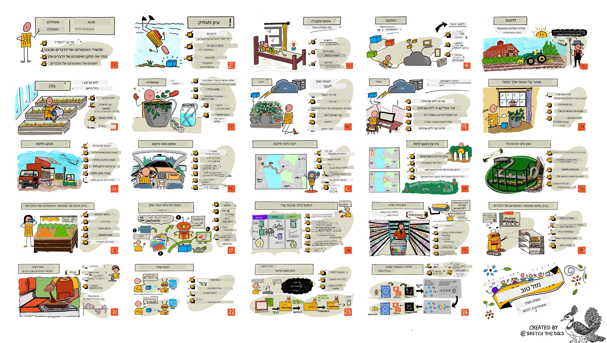

<!--
CO_OP_TRANSLATOR_METADATA:
{
  "original_hash": "6c354ec3487e4f6cfafbe44557996cd9",
  "translation_date": "2026-01-06T09:55:50+00:00",
  "source_file": "README.md",
  "language_code": "he"
}
-->
[](https://github.com/microsoft/IoT-For-Beginners/blob/master/LICENSE)
[](https://GitHub.com/microsoft/IoT-For-Beginners/graphs/contributors/)
[](https://GitHub.com/microsoft/IoT-For-Beginners/issues/)
[](https://GitHub.com/microsoft/IoT-For-Beginners/pulls/)
[](http://makeapullrequest.com)

[](https://GitHub.com/microsoft/IoT-For-Beginners/watchers/)
[](https://GitHub.com/microsoft/IoT-For-Beginners/network/)
[](https://GitHub.com/microsoft/IoT-For-Beginners/stargazers/)

### הצטרפו לקהילת Azure AI Foundry

אם נתקעתם או יש לכם שאלות לגבי בניית אפליקציות AI. הצטרפו ללומדים עמיתים ומפתחים מנוסים בדיונים על MCP. זוהי קהילה תומכת שבה שאלות מתקבלות בברכה והידע משותף בחופשיות.

[](https://discord.gg/nTYy5BXMWG)

אם יש לכם משוב על המוצר או טעויות בזמן הבנייה בקרו בכתובת:

[](https://aka.ms/foundry/forum)

עקבו אחר השלבים הבאים כדי להתחיל להשתמש במשאבים אלו:
1. **העתק את המאגר**: לחצו על [](https://GitHub.com/microsoft/IoT-For-Beginners/fork)
2. **השכפל את המאגר**:   `git clone https://github.com/microsoft/IoT-For-Beginners.git`
3. [**הצטרף ל-Discord של Microsoft Foundry ופגוש מומחים ומפתחים עמיתים**](https://discord.com/invite/ByRwuEEgH4)


### 🌐 תמיכה בריבוי שפות

#### נתמך באמצעות GitHub Action (אוטומטי ותמיד מעודכן)

<!-- CO-OP TRANSLATOR LANGUAGES TABLE START -->
[ערבית](../ar/README.md) | [בנגלית](../bn/README.md) | [בולגרית](../bg/README.md) | [בורמזית (מיאנמר)](../my/README.md) | [סינית (מפושטת)](../zh/README.md) | [סינית (מסורתית, הונג קונג)](../hk/README.md) | [סינית (מסורתית, מקאו)](../mo/README.md) | [סינית (מסורתית, טאיוואן)](../tw/README.md) | [קרואטית](../hr/README.md) | [צ’כית](../cs/README.md) | [דנית](../da/README.md) | [הולנדית](../nl/README.md) | [אסטונית](../et/README.md) | [פינית](../fi/README.md) | [צרפתית](../fr/README.md) | [גרמנית](../de/README.md) | [יוונית](../el/README.md) | [עברית](./README.md) | [הודית (הינדי)](../hi/README.md) | [הונגרית](../hu/README.md) | [אינדונזית](../id/README.md) | [איטלקית](../it/README.md) | [יפנית](../ja/README.md) | [קנאדה](../kn/README.md) | [קוריאנית](../ko/README.md) | [ליטאית](../lt/README.md) | [מלאית](../ms/README.md) | [מליאלאם](../ml/README.md) | [מרטהי](../mr/README.md) | [נפאלית](../ne/README.md) | [פידג’ין ניגרי](../pcm/README.md) | [נורווגית](../no/README.md) | [פרסית (פרסי)](../fa/README.md) | [פולנית](../pl/README.md) | [פורטוגזית (ברזיל)](../br/README.md) | [פורטוגזית (פורטוגל)](../pt/README.md) | [פנג’אבית (גורסי)](../pa/README.md) | [רומנית](../ro/README.md) | [רוסית](../ru/README.md) | [סרבית (קירילית)](../sr/README.md) | [סלובקית](../sk/README.md) | [סלובנית](../sl/README.md) | [ספרדית](../es/README.md) | [סווהילית](../sw/README.md) | [שוודית](../sv/README.md) | [טגאלוג (פיליפינית)](../tl/README.md) | [טמילית](../ta/README.md) | [טלוגו](../te/README.md) | [תאית](../th/README.md) | [טורקית](../tr/README.md) | [אוקראינית](../uk/README.md) | [אורדו](../ur/README.md) | [וייטנאמית](../vi/README.md)

> **מעדיפים לשכפל מקומית?**

> מאגר זה כולל מעל 50 תרגומים לשפות שמגדילים משמעותית את גודל ההורדה. כדי לשכפל בלי תרגומים, השתמשו ב-sparse checkout:
> ```bash
> git clone --filter=blob:none --sparse https://github.com/microsoft/IoT-For-Beginners.git
> cd IoT-For-Beginners
> git sparse-checkout set --no-cone '/*' '!translations' '!translated_images'
> ```
> זה נותן לכם את כל מה שצריך כדי להשלים את הקורס במהירות הורדה גבוהה יותר.
<!-- CO-OP TRANSLATOR LANGUAGES TABLE END -->

# IoT למתחילים - תוכנית לימודים

סנגורי הענן של Azure ב-Microsoft שמחים להציע תוכנית לימודים בת 12 שבועות, 24 שיעורים, הכוללת את יסודות ה-IoT. בכל שיעור יש מבחנים לפני ואחרי, הוראות כתובות להשלמת השיעור, פתרון, מטלה ועוד. הפדגוגיה מבוססת פרויקטים מאפשרת לכם ללמוד תוך כדי בנייה, דרך מוכחת ל'להיצמד' כישורים חדשים.

הפרויקטים מכסים את המסע של המזון מהחווה לשולחן. זה כולל חקלאות, לוגיסטיקה, ייצור, קמעונאות וצריכה - כל תחומי תעשייה פופולריים למכשירי IoT.



> סיכום בשרטוט מאת [Nitya Narasimhan](https://github.com/nitya). לחצו על התמונה לגרסה גדולה יותר.

**תודה חמה למחברינו [Jen Fox](https://github.com/jenfoxbot), [Jen Looper](https://github.com/jlooper), [Jim Bennett](https://github.com/jimbobbennett), ולאמן הסקטשנוט שלנו [Nitya Narasimhan](https://github.com/nitya).**

**תודה גם לצוות שגרירי הלמידה של Microsoft שלנו [Microsoft Learn Student Ambassadors](https://studentambassadors.microsoft.com?WT.mc_id=academic-17441-jabenn) שסקרו ותרגמו את תוכנית הלימודים הזו - [Aditya Garg](https://github.com/AdityaGarg00), [Anurag Sharma](https://github.com/Anurag-0-1-A), [Arpita Das](https://github.com/Arpiiitaaa), [Aryan Jain](https://www.linkedin.com/in/aryan-jain-47a4a1145/), [Bhavesh Suneja](https://github.com/EliteWarrior315), [Faith Hunja](https://faithhunja.github.io/), [Lateefah Bello](https://www.linkedin.com/in/lateefah-bello/), [Manvi Jha](https://github.com/Severus-Matthew), [Mireille Tan](https://www.linkedin.com/in/mireille-tan-a4834819a/), [Mohammad Iftekher (Iftu) Ebne Jalal](https://github.com/Iftu119), [Mohammad Zulfikar](https://github.com/mohzulfikar), [Priyanshu Srivastav](https://www.linkedin.com/in/priyanshu-srivastav-b067241ba), [Thanmai Gowducheruvu](https://github.com/innovation-platform), ו-[Zina Kamel](https://www.linkedin.com/in/zina-kamel/).**

הכירו את הצוות!

[](https://youtu.be/-wippUJRi5k)

**GIF מאת** [Mohit Jaisal](https://linkedin.com/in/mohitjaisal)

> 🎥 לחצו על התמונה למעלה לסרטון על הפרויקט!

> **מורים**, כללנו [כמה הצעות](for-teachers.md) על איך להשתמש בתוכנית הלימודים הזו. אם תרצו ליצור שיעורים משלכם, כללנו גם [תבנית לשיעור](lesson-template/README.md).

> **סטודנטים** [https://aka.ms/student-page](https://aka.ms/student-page), להשתמש בתוכנית זו באופן עצמאי, העתיקו את כל המאגר והשלימו את התרגילים בעצמכם, החל במבחן מקדים, קריאת השיעור והשלמת שאר הפעילויות. נסו ליצור את הפרויקטים לאחר הבנת השיעורים במקום להעתיק את קוד הפתרון; עם זאת הקוד זמין בתיקיות /solutions בכל שיעור ממוקד פרויקט. רעיון נוסף הוא ליצור קבוצת לימוד עם חברים ולעבור את התוכן יחד. ללימוד נוסף אנו ממליצים על [Microsoft Learn](https://docs.microsoft.com/users/jimbobbennett/collections/ke2ehd351jopwr?WT.mc_id=academic-17441-jabenn).

לסקירה ווידאו של הקורס, צפו בסרטון הבא:

[](https://youtube.com/watch?v=bccEMm8gRuc "סרטון מקדם")

> 🎥 לחצו על התמונה למעלה לסרטון על הפרויקט!

## פדגוגיה

בחרנו שני עקרונות פדגוגיים בעת בניית תוכנית הלימודים הזו: לוודא שהיא מבוססת פרויקטים וכוללת מבחנים תכופים. בסוף סדרת השיעורים תלמידים יבנו מערכת לניטור וצינון צמחים, מעקב כלי רכב, התקן מפעל חכם לניטור ובדיקת מזון וטיימר בישול הנשלט בקול, ולמדו את יסודות האינטרנט של הדברים כולל כתיבת קוד למכשיר, חיבור לענן, ניתוח טלמטריה והפעלת AI בקצה.

על ידי הבטחת התאמת התוכן לפרויקטים, התהליך נעשה מעניין יותר עבור התלמידים וזכירת המושגים תוגבר.

בנוסף, מבחן בעל סיכון נמוך לפני השיעור מגדיר את כוונת הלומד ללמוד נושא, בעוד מבחן שני אחרי השיעור משפר את הזכירה. תכנית לימודים זו תוכננה להיות גמישה ומהנה, וניתן לעשותה בשלמות או בחלקה. הפרויקטים מתחילים קטנים והופכים מורכבים יותר לקראת סיום מחזור 12 השבועות.

כל פרויקט מבוסס על חומרה אמיתית הזמינה לתלמידים וחובבים. כל פרויקט בוחן את תחום הפרויקט הספציפי, ומספק ידע רקע רלוונטי. כדי להיות מפתח מוצלח חשוב להבין את התחום שבו פותרים בעיות, מתן ידע רקע זה מאפשר לתלמידים לחשוב על פתרונות ה-IoT שלהם וללמוד בהקשר של סוג הבעיה בעולם האמיתי שהם עשויים להתבקש לפתור כמפתח IoT. התלמידים לומדים את 'למה' של הפתרונות שהם בונים, ומפתחים הערכה למשתמש הקצה.

## חומרה

יש לנו שתי אפשרויות חומרת IoT לשימוש בפרויקטים בהתאם להעדפה אישית, ידע או העדפות שפת תכנות, יעדי למידה וזמינות. סיפקנו גם גרסה של 'חומרה וירטואלית' למי שאין לו גישה לחומרה, או שרוצה ללמוד יותר לפני שמחייבים רכישה. ניתן לקרוא עוד ולמצוא 'רשימת קניות' ב[דף החומרה](./hardware.md), כולל קישורים לרכישת ערכות שלמות מחברינו ב-Seeed Studio.
> 💁 מצאו את [קוד ההתנהגות שלנו](CODE_OF_CONDUCT.md), [ההנחיות לתרומה](CONTRIBUTING.md) ו[הנחיות לתרגום](TRANSLATIONS.md). נשמח לקבל את המשוב הבונה שלכם!
> 
> 🔧 יש לכם בעיות? בדקו את [מדריך פתרון בעיות](TROUBLESHOOTING.md) שלנו לפתרונות לבעיות נפוצות.

## כל שיעור כולל:

- שרטוט סקיצה
- סרטון משלים אופציונלי
- חידון התחממות לפני השיעור
- שיעור כתוב
- לשיעורים מבוססי פרויקטים, מדריכים שלב אחרי שלב כיצד לבנות את הפרויקט
- בדיקות ידע
- אתגר
- קריאה נוספת
- מטלה
- [חידון לאחר השיעור](https://ff-quizzes.netlify.app/en/)

> **הערה על חידונים**: כל החידונים נמצאים בתיקיית quiz-app, עם סך הכל 48 חידונים שכל אחד מהם כולל שלוש שאלות. הם מקושרים מתוך השיעורים אך ניתן להריץ את אפליקציית החידון מקומית או לפרוס לאזור Azure; עקבו אחר ההוראות בתיקיית `quiz-app`. הם מתורגמים בהדרגה.

## שיעורים

|       |              שם הפרויקט              |                       מושגים שנלמדים                       | מטרות למידה                                                                                                                                                     |                                                        שיעור מקושר                                                         |
| :---: | :------------------------------------: | :---------------------------------------------------------: | ------------------------------------------------------------------------------------------------------------------------------------------------------------------- | :--------------------------------------------------------------------------------------------------------------------------: |
|  01   | [מתחילים](./1-getting-started/README.md) |                     מבוא ל-IoT                     | למדו את עקרונות היסוד של IoT ואת אבני היסוד של פתרונות IoT כמו חיישנים ושירותי ענן בזמן שאתם מכינים את מכשיר ה-IoT הראשון שלכם |                      [מבוא ל-IoT](./1-getting-started/lessons/1-introduction-to-iot/README.md)                      |
|  02   | [מתחילים](./1-getting-started/README.md) |                   תובנות מעמיקות יותר ב-IoT                    | למדו על מרכיבי מערכת IoT, כמו גם על מיקרו-בקרים ומחשבים לוחות יחידים                                                            |                        [תובנות מעמיקות יותר ב-IoT](./1-getting-started/lessons/2-deeper-dive/README.md)                         |
|  03   | [מתחילים](./1-getting-started/README.md) | אינטראקציה עם העולם הפיזי באמצעות חיישנים ומפעילים | למדו על חיישנים לאיסוף נתונים מהעולם הפיזי, ועל מפעילים לשליחת משוב, בזמן שאתם בונים מנורת לילה                                            | [אינטראקציה עם העולם הפיזי באמצעות חיישנים ומפעילים](./1-getting-started/lessons/3-sensors-and-actuators/README.md) |
|  04   | [מתחילים](./1-getting-started/README.md) |             חיבור המכשיר שלכם לאינטרנט             | למדו כיצד לחבר מכשיר IoT לאינטרנט לצורך שליחת וקבלת הודעות על ידי חיבור מנורת הלילה לשרת MQTT                               |               [חיבור המכשיר שלכם לאינטרנט](./1-getting-started/lessons/4-connect-internet/README.md)                |
|  05   |            [חקלאות](./2-farm/README.md)            |                    חיזוי צמיחת הצמח                     | למדו כיצד לחזות צמיחת צמח באמצעות נתוני טמפרטורה שנאספו ממכשיר IoT                                                                                  |                          [חיזוי צמיחת הצמח](./2-farm/lessons/1-predict-plant-growth/README.md)                           |
|  06   |            [חקלאות](./2-farm/README.md)            |                    זיהוי רמת לחות הקרקע                     | למדו כיצד לזהות לחות קרקע ולכייל חיישן לחות קרקע                                                                                              |                          [זיהוי רמת לחות הקרקע](./2-farm/lessons/2-detect-soil-moisture/README.md)                           |
|  07   |            [חקלאות](./2-farm/README.md)            |                  השקיית צמחים אוטומטית                   | למדו כיצד לבצע השקיית צמחים אוטומטית ועל פי לוח זמנים באמצעות ממסר ו-MQTT                                                                                                      |                      [הזרמת השקיית צמחים אוטומטית](./2-farm/lessons/3-automated-plant-watering/README.md)                       |
|  08   |            [חקלאות](./2-farm/README.md)            |               העברה של הצמח לענן               | למדו על ענן ושירותי IoT המופעלים בענן וכיצד לחבר את הצמח שלכם לאחד מהם במקום לשרת MQTT ציבורי                                   |               [העברה של הצמח לענן](./2-farm/lessons/4-migrate-your-plant-to-the-cloud/README.md)                |
|  09   |            [חקלאות](./2-farm/README.md)            |         העברה של לוגיקת היישום לענן         | למדו כיצד לכתוב לוגיקת יישום בענן המגיבה להודעות IoT                                                                          |         [העברה של לוגיקת היישום לענן](./2-farm/lessons/5-migrate-application-to-the-cloud/README.md)         |
|  10   |            [חקלאות](./2-farm/README.md)            |                   שמירה על אבטחת הצמח                    | למדו על אבטחה ב-IoT וכיצד לשמור על הצמח שלכם מאובטח עם מפתחות ותעודות                                                                          |                        [שמירה על אבטחת הצמח](./2-farm/lessons/6-keep-your-plant-secure/README.md)                         |
|  11   |       [תחבורה](./3-transport/README.md)       |                      מעקב מיקום                      | למדו על מעקב GPS למכשירי IoT                                                                                                                   |                           [מעקב מיקום](./3-transport/lessons/1-location-tracking/README.md)                           |
|  12   |       [תחבורה](./3-transport/README.md)       |                     אחסון נתוני מיקום                     | למדו כיצד לאחסן נתוני IoT לצורך ויזואליזציה או ניתוח מאוחר                                                                                                      |                         [אחסון נתוני מיקום](./3-transport/lessons/2-store-location-data/README.md)                         |
|  13   |       [תחבורה](./3-transport/README.md)       |                   ויזואליזציה של נתוני מיקום                   | למדו על ויזואליזציה של נתוני מיקום על מפה, ואיך מפות מייצגות את העולם התלת-ממדי האמיתי בשתי מידות                                                            |                     [ויזואליזציה של נתוני מיקום](./3-transport/lessons/3-visualize-location-data/README.md)                     |
|  14   |       [תחבורה](./3-transport/README.md)       |                          Geofences                          | למדו על גיאופנסים, וכיצד ניתן להשתמש בהם להתראה כאשר כלי רכב בשרשרת האספקה מתקרבים ליעדם                                           |                                   [גיאופנסים](./3-transport/lessons/4-geofences/README.md)                                   |
|  15   |   [ייצור](./4-manufacturing/README.md)   |               אימון גלאי איכות פרי                | למדו על אימון מסווג תמונות בענן לזיהוי איכות פרי                                                                                       |                 [אימון גלאי איכות פרי](./4-manufacturing/lessons/1-train-fruit-detector/README.md)                 |
|  16   |   [ייצור](./4-manufacturing/README.md)   |           בדיקת איכות פרי ממכשיר IoT            | למדו על השימוש בגלאי איכות הפרי ממכשיר IoT                                                                                                    |           [בדיקת איכות פרי ממכשיר IoT](./4-manufacturing/lessons/2-check-fruit-from-device/README.md)            |
|  17   |   [ייצור](./4-manufacturing/README.md)   |             הפעלת גלאי הפרי שלכם על הקצה             | למדו על הרצת גלאי הפרי שלכם על מכשיר IoT בקצה                                                                                                |             [הפעלת גלאי הפרי שלכם על הקצה](./4-manufacturing/lessons/3-run-fruit-detector-edge/README.md)             |
|  18   |   [ייצור](./4-manufacturing/README.md)   |        הפעלת זיהוי איכות פרי מחיישן        | למדו על הפעלת זיהוי איכות פרי מחיישן                                                                                                        |        [הפעלת זיהוי איכות פרי מחיישן](./4-manufacturing/lessons/4-trigger-fruit-detector/README.md)         |
|  19   |          [קמעונאות](./5-retail/README.md)          |                   אימון גלאי מלאי                    | למדו כיצד להשתמש בזיהוי אובייקטים לאימון גלאי מלאי לספירת מלאי בחנות                                                                                |                        [אימון גלאי מלאי](./5-retail/lessons/1-train-stock-detector/README.md)                         |
|  20   |          [קמעונאות](./5-retail/README.md)          |               בדיקת מלאי ממכשיר IoT                | למדו כיצד לבדוק מלאי ממכשיר IoT באמצעות דגם לזיהוי אובייקטים                                                                                         |                     [בדיקת מלאי ממכשיר IoT](./5-retail/lessons/2-check-stock-device/README.md)                      |
|  21   |        [צרכנות](./6-consumer/README.md)        |             זיהוי דיבור עם מכשיר IoT             | למדו כיצד לזהות דיבור ממכשיר IoT לבניית טיימר חכם                                                                                             |                  [זיהוי דיבור עם מכשיר IoT](./6-consumer/lessons/1-speech-recognition/README.md)                  |
|  22   |        [צרכנות](./6-consumer/README.md)        |                     הבנת שפה                     | למדו כיצד להבין משפטים המדוברים למכשיר IoT                                                                                                           |                        [הבנת שפה](./6-consumer/lessons/2-language-understanding/README.md)                        |
|  23   |        [צרכנות](./6-consumer/README.md)        |           הגדרת טיימר ומתן משוב מדובר           | למדו כיצד להגדיר טיימר במכשיר IoT ולתת משוב מדובר מתי הטיימר הופעל ומתי הוא מסתיים                                                    |                 [הגדרת טיימר ומתן משוב מדובר](./6-consumer/lessons/3-spoken-feedback/README.md)                  |
|  24   |        [צרכנות](./6-consumer/README.md)        |                 תמיכה בריבוי שפות                  | למדו כיצד לתמוך בשפות מרובות, הן בדיבור אל המכשיר והן בתגובות מטיימר חכם שלכם                                                               |                   [תמיכה בריבוי שפות](./6-consumer/lessons/4-multiple-language-support/README.md)                   |

## גישה לא מקוונת

ניתן להפעיל את התיעוד הזה במצב לא מקוון באמצעות [Docsify](https://docsify.js.org/#/). עשו פורק למאגר זה, [התקינו את Docsify](https://docsify.js.org/#/quickstart) במחשב המקומי שלכם, ואז בתיקיית השורש של מאגר זה, הקלידו `docsify serve`. האתר יוכן על פורט 3000 ב-localhost שלכם: `localhost:3000`.

## חידון

תודה לקהילה על אירוח חידון אינטראקטיבי הבוחן את הידע שלכם בכל אחד מהפרקים. תוכלו לבדוק את הידע שלכם [כאן](https://ff-quizzes.netlify.app/en/)

### PDF

ניתן ליצור PDF של התוכן הזה לגישה לא מקוונת במידת הצורך. לשם כך, ודאו שיש לכם [npm מותקן](https://docs.npmjs.com/downloading-and-installing-node-js-and-npm) והריצו את הפקודות הבאות בתיקיית השורש של מאגר זה:

```sh
npm i
npm run convert
```

### מצגות

יש מצגות עבור חלק מהשיעורים בתיקיית [slides](../../slides).


## תכניות לימודים נוספות

הצוות שלנו מייצר תכניות לימודים נוספות! בדקו:

<!-- CO-OP TRANSLATOR OTHER COURSES START -->
### LangChain
[](https://aka.ms/langchain4j-for-beginners)
[](https://aka.ms/langchainjs-for-beginners?WT.mc_id=m365-94501-dwahlin)

---

### Azure / Edge / MCP / סוכנים
[](https://github.com/microsoft/AZD-for-beginners?WT.mc_id=academic-105485-koreyst)
[](https://github.com/microsoft/edgeai-for-beginners?WT.mc_id=academic-105485-koreyst)
[](https://github.com/microsoft/mcp-for-beginners?WT.mc_id=academic-105485-koreyst)
[](https://github.com/microsoft/ai-agents-for-beginners?WT.mc_id=academic-105485-koreyst)

---
 
### סדרת AI יצירתי
[](https://github.com/microsoft/generative-ai-for-beginners?WT.mc_id=academic-105485-koreyst)
[-9333EA?style=for-the-badge&labelColor=E5E7EB&color=9333EA)](https://github.com/microsoft/Generative-AI-for-beginners-dotnet?WT.mc_id=academic-105485-koreyst)
[-C084FC?style=for-the-badge&labelColor=E5E7EB&color=C084FC)](https://github.com/microsoft/generative-ai-for-beginners-java?WT.mc_id=academic-105485-koreyst)
[-E879F9?style=for-the-badge&labelColor=E5E7EB&color=E879F9)](https://github.com/microsoft/generative-ai-with-javascript?WT.mc_id=academic-105485-koreyst)

---
 
### למידה בסיסית
[](https://aka.ms/ml-beginners?WT.mc_id=academic-105485-koreyst)
[](https://aka.ms/datascience-beginners?WT.mc_id=academic-105485-koreyst)
[](https://aka.ms/ai-beginners?WT.mc_id=academic-105485-koreyst)
[](https://github.com/microsoft/Security-101?WT.mc_id=academic-96948-sayoung)
[](https://aka.ms/webdev-beginners?WT.mc_id=academic-105485-koreyst)
[](https://aka.ms/iot-beginners?WT.mc_id=academic-105485-koreyst)
[](https://github.com/microsoft/xr-development-for-beginners?WT.mc_id=academic-105485-koreyst)

---
 
### סדרת קופיילוט
[](https://aka.ms/GitHubCopilotAI?WT.mc_id=academic-105485-koreyst)
[](https://github.com/microsoft/mastering-github-copilot-for-dotnet-csharp-developers?WT.mc_id=academic-105485-koreyst)
[](https://github.com/microsoft/CopilotAdventures?WT.mc_id=academic-105485-koreyst)
<!-- CO-OP TRANSLATOR OTHER COURSES END -->

## קרדיטים לתמונות

ניתן למצוא את כל הקרדיטים לתמונות המשמשות בתכנית הלימודים הזו היכן שנדרש ב-[קרדיטים](./attributions.md).

---

<!-- CO-OP TRANSLATOR DISCLAIMER START -->
**הצהרת אחריות**:  
מסמך זה תורגם באמצעות שירות תרגום מבוסס בינה מלאכותית [Co-op Translator](https://github.com/Azure/co-op-translator). אף שאנו משתדלים לדייק, יש להיות מודעים לכך שתרגומים אוטומטיים עשויים להכיל שגיאות או אי דיוקים. המסמך המקורי בשפתו המקורית נחשב למקור הסמכותי. למידע חשוב ובעל חשיבות קריטית מומלץ לבצע תרגום מקצועי על ידי בני אדם. אנו אינם אחראים לאי הבנות או לפרשנויות שגויות הנובעות מהשימוש בתרגום זה.
<!-- CO-OP TRANSLATOR DISCLAIMER END -->