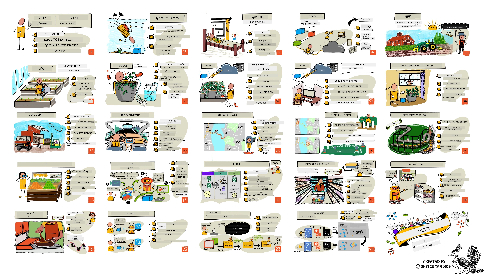

[](https://github.com/microsoft/IoT-For-Beginners/blob/master/LICENSE)
[](https://GitHub.com/microsoft/IoT-For-Beginners/graphs/contributors/)
[](https://GitHub.com/microsoft/IoT-For-Beginners/issues/)
[](https://GitHub.com/microsoft/IoT-For-Beginners/pulls/)
[](http://makeapullrequest.com)

[](https://GitHub.com/microsoft/IoT-For-Beginners/watchers/)
[](https://GitHub.com/microsoft/IoT-For-Beginners/network/)
[](https://GitHub.com/microsoft/IoT-For-Beginners/stargazers/)

### הצטרפו לקהילת Azure AI Foundry

אם אתם נתקעים או יש לכם שאלות על בניית אפליקציות AI. הצטרפו ללומדים אחרים ולמפתחים מנוסים בדיונים על MCP. זוהי קהילה תומכת שבה שאלות מתקבלות ברצון והידע משותף בחופשיות.

[](https://discord.gg/nTYy5BXMWG)

אם יש לכם משוב על מוצר או שגיאות בזמן הבנייה, בקרו:

[](https://aka.ms/foundry/forum)

עקבו אחר השלבים הבאים כדי להתחיל להשתמש במשאבים אלו:
1. **פיצול המאגר**: לחצו על [](https://GitHub.com/microsoft/IoT-For-Beginners/fork)
2. **שכפול המאגר**:  `git clone https://github.com/microsoft/IoT-For-Beginners.git`
3. [**הצטרפו לשרת Discord של Microsoft Foundry ופגשו מומחים ומפתחים אחרים**](https://discord.com/invite/ByRwuEEgH4)


### 🌐 תמיכה בריבוי שפות

#### נתמך באמצעות GitHub Action (אוטומטי ותמיד מעודכן)

<!-- CO-OP TRANSLATOR LANGUAGES TABLE START -->
[ערבית](../ar/README.md) | [בנגלית](../bn/README.md) | [בולגרית](../bg/README.md) | [בורמזית (מיאנמר)](../my/README.md) | [סינית (מפושטת)](../zh-CN/README.md) | [סינית (מסורתית, הונג קונג)](../zh-HK/README.md) | [סינית (מסורתית, מקאו)](../zh-MO/README.md) | [סינית (מסורתית, טייוואן)](../zh-TW/README.md) | [קרואטית](../hr/README.md) | [צ'כית](../cs/README.md) | [דנית](../da/README.md) | [הולנדית](../nl/README.md) | [אסטונית](../et/README.md) | [פינית](../fi/README.md) | [צרפתית](../fr/README.md) | [גרמנית](../de/README.md) | [יוונית](../el/README.md) | [עברית](./README.md) | [הינדי](../hi/README.md) | [הונגרית](../hu/README.md) | [אינדונזית](../id/README.md) | [איטלקית](../it/README.md) | [יפנית](../ja/README.md) | [קנאדה](../kn/README.md) | [חמר](../km/README.md) | [קוריאנית](../ko/README.md) | [ליטאית](../lt/README.md) | [מלאית](../ms/README.md) | [מלאיאלאם](../ml/README.md) | [מראטי](../mr/README.md) | [נפאלית](../ne/README.md) | [פידג'ין ניגרי](../pcm/README.md) | [נורווגית](../no/README.md) | [פרסית (פרסי)](../fa/README.md) | [פולנית](../pl/README.md) | [פורטוגזית (ברזיל)](../pt-BR/README.md) | [פורטוגזית (פורטוגל)](../pt-PT/README.md) | [פנג'אבי (ג\'רמוקי)](../pa/README.md) | [רומנית](../ro/README.md) | [רוסית](../ru/README.md) | [סרבית (קירילית)](../sr/README.md) | [סלובקית](../sk/README.md) | [סלובנית](../sl/README.md) | [ספרדית](../es/README.md) | [סווהילי](../sw/README.md) | [שוודית](../sv/README.md) | [טגלוג (פיליפינית)](../tl/README.md) | [טמילית](../ta/README.md) | [טלווגו](../te/README.md) | [תאית](../th/README.md) | [טורקית](../tr/README.md) | [אוקראינית](../uk/README.md) | [אורדו](../ur/README.md) | [וייטנאמית](../vi/README.md)

> **מעדיפים לשכפל מקומית?**
>
> מאגר זה כולל יותר מ-50 תרגומי שפות שמגדילים משמעותית את גודל ההורדה. בשביל לשכפל בלי תרגומים, השתמשו ב-sparse checkout:
>
> **Bash / macOS / Linux:**
> ```bash
> git clone --filter=blob:none --sparse https://github.com/microsoft/IoT-For-Beginners.git
> cd IoT-For-Beginners
> git sparse-checkout set --no-cone '/*' '!translations' '!translated_images'
> ```
>
> **CMD (Windows):**
> ```cmd
> git clone --filter=blob:none --sparse https://github.com/microsoft/IoT-For-Beginners.git
> cd IoT-For-Beginners
> git sparse-checkout set --no-cone "/*" "!translations" "!translated_images"
> ```
>
> זה נותן לכם את כל מה שאתם צריכים כדי לסיים את הקורס במהירות הורדה גבוהה יותר.
<!-- CO-OP TRANSLATOR LANGUAGES TABLE END -->

# IoT למתחילים - תכנית לימודים

סניגורי Azure Cloud במיקרוסופט שמחים להציע תכנית לימודים בת 12 שבועות ו-24 שיעורים העוסקת ביסודות ה-IoT. כל שיעור כולל חידוני קדם-שיעור ופוסט-שיעור, הוראות כתובות להשלמת השיעור, פתרון, משימה ועוד. הפדגוגיה המבוססת על פרויקטים שלנו מאפשרת לכם ללמוד תוך כדי בנייה — דרך מוכחת ללמידת מיומנויות חדשות בצורה יעילה.

הפרויקטים מכסים את מסע המזון מהחקלאות ועד לשולחן האוכל. זה כולל חקלאות, לוגיסטיקה, ייצור, קמעונאות וצרכנים – כל תחומי התעשייה הפופולריים עבור מכשירי IoT.



> סקצ\'נוט מאת [Nitya Narasimhan](https://github.com/nitya). לחצו על התמונה לגירסה מורחבת.

**תודה ענקית למחברים שלנו [Jen Fox](https://github.com/jenfoxbot), [Jen Looper](https://github.com/jlooper), [Jim Bennett](https://github.com/jimbobbennett), ואמן הסקצ\'נוט שלנו [Nitya Narasimhan](https://github.com/nitya).**

**תודה גם לצוות שגרירי התלמידים של מיקרוסופט [Microsoft Learn Student Ambassadors](https://studentambassadors.microsoft.com?WT.mc_id=academic-17441-jabenn) שסקרו ותרגמו את תכנית הלימודים הזו - [Aditya Garg](https://github.com/AdityaGarg00), [Anurag Sharma](https://github.com/Anurag-0-1-A), [Arpita Das](https://github.com/Arpiiitaaa), [Aryan Jain](https://www.linkedin.com/in/aryan-jain-47a4a1145/), [Bhavesh Suneja](https://github.com/EliteWarrior315), [Faith Hunja](https://faithhunja.github.io/), [Lateefah Bello](https://www.linkedin.com/in/lateefah-bello/), [Manvi Jha](https://github.com/Severus-Matthew), [Mireille Tan](https://www.linkedin.com/in/mireille-tan-a4834819a/), [Mohammad Iftekher (Iftu) Ebne Jalal](https://github.com/Iftu119), [Mohammad Zulfikar](https://github.com/mohzulfikar), [Priyanshu Srivastav](https://www.linkedin.com/in/priyanshu-srivastav-b067241ba), [Thanmai Gowducheruvu](https://github.com/innovation-platform), ו-[Zina Kamel](https://www.linkedin.com/in/zina-kamel/).**

הכירו את הצוות!

[](https://youtu.be/-wippUJRi5k)

**גיף מאת** [Mohit Jaisal](https://linkedin.com/in/mohitjaisal)

> 🎥 לחצו על התמונה למעלה לסרטון על הפרויקט!

> **למורים**, כלול אצלנו [כמה המלצות](for-teachers.md) כיצד להשתמש בתכנית הלימודים הזו. אם תרצו ליצור שיעורים משלכם, כלול גם [תבנית לשיעור](lesson-template/README.md).

> ** לתלמידים** [https://aka.ms/student-page](https://aka.ms/student-page), לשימוש עצמאי בתכנית זו, פיצלו את כל המאגר והשלימו את התרגילים בעצמכם, התחילו עם חידון קדם-הרצאה, קראו את ההרצאה והשלימו את שאר הפעילויות. נסו ליצור את הפרויקטים על ידי הבנת השיעורים ולא על ידי העתקת קוד הפתרון; עם זאת, הקוד הזה זמין בתיקיות /solutions בכל שיעור שמכוון לפרויקט. רעיון נוסף הוא ליצור קבוצת לימוד עם חברים ולעבור ביחד על התוכן. ללימוד נוסף מומלץ [Microsoft Learn](https://docs.microsoft.com/users/jimbobbennett/collections/ke2ehd351jopwr?WT.mc_id=academic-17441-jabenn).

לסקירה וידאו של הקורס, צפו בסרטון זה:

[](https://youtube.com/watch?v=bccEMm8gRuc "Promo video")

> 🎥 לחצו על התמונה למעלה לסרטון על הפרויקט!

## פדגוגיה

בחרנו שני יסודות פדגוגיים בזמן בניית תכנית הלימודים הזו: לוודא שהיא מבוססת על פרויקטים וכוללת חידונים תכופים. עד לסיום הסדרה, התלמידים יבנו מערכת לניטור והשקיית צמחים, מערכת למעקב רכב, מערכת מפעל חכם לזיהוי ומעקב אחר מזון, ומטבל שמע מבוקר בקול, ולמדו את יסודות האינטרנט של הדברים כולל כתיבת קוד למכשירים, חיבור לענן, ניתוח טלמטיריה והרצת AI בקצה.

על-ידי התאמת התוכן לפרויקטים, התהליך נעשה מרתק יותר לתלמידים ושמירת המושגים תוגבר.

בנוסף, חידון קטן לפני השיעור מציב את כוונת התלמיד ללמידת נושא מסוים, וחידון שני אחרי השיעור מבטיח שמירה נוספת. תכנית הלימודים הזו עוצבה להיות גמישה ומהנה וניתן לעבור עליה כולה או חלקית. הפרויקטים מתחילים קטנים והולכים ומסתבכים עד סוף מחזור של 12 שבועות.

כל פרויקט מבוסס על חומרה אמיתית הזמינה לתלמידים ולחובבים. כל פרויקט מתמקד בתחום ספציפי, מספק ידע רקע רלוונטי. כדי להיות מפתח מוצלח חשוב להבין את התחום שבו פותרים בעיות, מתן ידע רקע זה מאפשר לתלמידים לחשוב על פתרונות IoT שלהם וללמוד בהקשר של סוג הבעיה מהעולם האמיתי שיעשוי להתבקשו לפתור כמפתח IoT. התלמידים מבינים את ה"למה" של הפתרונות שהם בונים, ומקבלים הערכה על המשתמש הסופי.

## חומרה
יש לנו שתי אפשרויות של חומרת IoT לשימוש בפרויקטים בהתאם להעדפה אישית, ידע בשפת תכנות או העדפות, מטרות למידה וזמינות. גם סיפקנו גרסה של 'חומרה וירטואלית' למי שאין לו גישה לחומרה, או שרוצה ללמוד יותר לפני שמתחייב לרכישה. ניתן לקרוא עוד ולמצוא 'רשימת קניות' בעמוד [החומרה](./hardware.md), כולל קישורים לרכישת ערכות שלמות מחברינו ב-Seeed Studio.

> 💁 מצאו את [קוד ההתנהגות שלנו](CODE_OF_CONDUCT.md), הנחיות [השתתפות](CONTRIBUTING.md), ו[תרגומים](..). נשמח למשוב בונה מכם!
>
> 🔧 יש בעיות? בדקו את [מדריך פתרון הבעיות](TROUBLESHOOTING.md) לפתרונות לבעיות נפוצות.

## כל שיעור כולל:

- סקצ'נוט
- סרטון משלים אופציונלי
- חידון חימום לפני השיעור
- שיעור כתוב
- לשיעורי פרויקט, מדריכים שלב אחרי שלב כיצד לבנות את הפרויקט
- בדיקות ידע
- אתגר
- קריאה משלימה
- מטלה
- [חידון לאחר השיעור](https://ff-quizzes.netlify.app/en/)

> **הערה לגבי חידונים**: כל החידונים נמצאים בתיקיית quiz-app, סה"כ 48 חידונים עם 3 שאלות כל אחד. הם מקושרים מתוך השיעורים אבל אפליקציית החידונים יכולה לפעול מקומית או להיות מופעלת על Azure; עקבו אחר ההוראות בתיקיית `quiz-app`. הם מתורגמים בהדרגה.

## שיעורים

|       |              שם הפרויקט              |                       מושגים שנלמדים                       | מטרות למידה                                                                                                                                                 |                                                        שיעור מקושר                                                         |
| :---: | :------------------------------------: | :---------------------------------------------------------: | ------------------------------------------------------------------------------------------------------------------------------------------------------------------- | :--------------------------------------------------------------------------------------------------------------------------: |
|  01   | [מתחילים](./1-getting-started/README.md) |                     מבוא ל-IoT                     | למדו את העקרונות הבסיסיים של IoT ואת אבני הבניין הבסיסיות של פתרונות IoT כמו חיישנים ושירותי ענן תוך כדי התקנת מכשיר IoT ראשון שלכם |                      [מבוא ל-IoT](./1-getting-started/lessons/1-introduction-to-iot/README.md)                      |
|  02   | [מתחילים](./1-getting-started/README.md) |                   מבט מעמיק יותר ל-IoT                    | למדו עוד על רכיבי מערכת IoT, כמו גם על מיקרו-בקרים ומחשבים לוח בודד                                                            |                        [מבט מעמיק יותר ל-IoT](./1-getting-started/lessons/2-deeper-dive/README.md)                         |
|  03   | [מתחילים](./1-getting-started/README.md) | אינטראקציה עם העולם הפיזי עם חיישנים ומפעילים | למדו על חיישנים לאיסוף נתונים מהעולם הפיזי ומפעילים לשליחת משוב, תוך כדי בניית מנורת לילה                                           | [אינטראקציה עם העולם הפיזי עם חיישנים ומפעילים](./1-getting-started/lessons/3-sensors-and-actuators/README.md) |
|  04   | [מתחילים](./1-getting-started/README.md) |             לחבר את המכשיר לאינטרנט             | למדו איך לחבר מכשיר IoT לאינטרנט לשליחת וקבלת הודעות על ידי חיבור מנורת הלילה שלכם אל Broker מסוג MQTT                               |               [חבר את המכשיר לאינטרנט](./1-getting-started/lessons/4-connect-internet/README.md)                |
|  05   |            [חווה](./2-farm/README.md)            |                    חיזוי גידול צמחים                     | למדו כיצד לנבא גידול צמחים באמצעות נתוני טמפרטורה שנאספו באמצעות מכשיר IoT                                                                                  |                          [חיזוי גידול צמחים](./2-farm/lessons/1-predict-plant-growth/README.md)                           |
|  06   |            [חווה](./2-farm/README.md)            |                    זיהוי לחות קרקע                     | למדו כיצד לזהות לחות קרקע ולכייל חיישן לחות קרקע                                                                                              |                          [זיהוי לחות קרקע](./2-farm/lessons/2-detect-soil-moisture/README.md)                           |
|  07   |            [חווה](./2-farm/README.md)            |                  השקיית צמחים אוטומטית                   | למדו כיצד לאוטומט ולקבוע זמני השקיה באמצעות ריליי ו-MQTT                                                                                                      |                      [השקיית צמחים אוטומטית](./2-farm/lessons/3-automated-plant-watering/README.md)                       |
|  08   |            [חווה](./2-farm/README.md)            |               העבר את הצמח לענן               | למדו על הענן ושירותי IoT מתארחים בענן וכיצד לחבר את הצמח לאחד מהם במקום Broker MQTT ציבורי                                   |               [העבר את הצמח לענן](./2-farm/lessons/4-migrate-your-plant-to-the-cloud/README.md)                |
|  09   |            [חווה](./2-farm/README.md)            |         העבר את לוגיקת היישום לענן         | למדו איך לכתוב לוגיקת יישום בענן שמגיבה להודעות IoT                                                                          |         [העבר את לוגיקת היישום לענן](./2-farm/lessons/5-migrate-application-to-the-cloud/README.md)         |
|  10   |            [חווה](./2-farm/README.md)            |                   שמור על אבטחת הצמח                    | למדו על אבטחה ב-IoT וכיצד לשמור על אבטחת הצמח עם מפתחות ותעודות                                                                          |                        [שמור על אבטחת הצמח](./2-farm/lessons/6-keep-your-plant-secure/README.md)                         |
|  11   |       [תחבורה](./3-transport/README.md)       |                      מעקב מיקום                      | למדו על מעקב GPS למכשירי IoT                                                                                                                   |                           [מעקב מיקום](./3-transport/lessons/1-location-tracking/README.md)                           |
|  12   |       [תחבורה](./3-transport/README.md)       |                     אחסון נתוני מיקום                     | למדו כיצד לאחסן נתוני IoT להצגתם או ניתוחם מאוחר יותר                                                                                                      |                         [אחסון נתוני מיקום](./3-transport/lessons/2-store-location-data/README.md)                         |
|  13   |       [תחבורה](./3-transport/README.md)       |                   הצגת נתוני מיקום                   | למדו על הצגת נתוני מיקום במפה, וכיצד מפות מייצגות את העולם התלת־ממדי בממדיים דו־ממדיים                                                            |                     [הצגת נתוני מיקום](./3-transport/lessons/3-visualize-location-data/README.md)                     |
|  14   |       [תחבורה](./3-transport/README.md)       |                          אזורי גאוגרפיים                          | למדו על אזורי גיאופנס, וכיצד הם משמשים להתראה כאשר רכבים בשרשרת האספקה קרובים ליעד שלהם                                           |                                   [אזורי גאוגרפיים](./3-transport/lessons/4-geofences/README.md)                                   |
|  15   |   [ייצור](./4-manufacturing/README.md)   |               אימון גלאי איכות פירות                | למדו על אימון מסווג תמונות בענן לזיהוי איכות פירות                                                                                       |                 [אימון גלאי איכות פירות](./4-manufacturing/lessons/1-train-fruit-detector/README.md)                 |
|  16   |   [ייצור](./4-manufacturing/README.md)   |           בדיקת איכות פירות ממכשיר IoT            | למדו על שימוש בגלאי איכות פירות ממכשיר IoT                                                                                                    |           [בדיקת איכות פירות ממכשיר IoT](./4-manufacturing/lessons/2-check-fruit-from-device/README.md)            |
|  17   |   [ייצור](./4-manufacturing/README.md)   |             הרץ את גלאי הפירות על ה-edge             | למדו על הרצת גלאי הפירות במכשיר IoT על הקצה                                                                                                |             [הרץ את גלאי הפירות על ה-edge](./4-manufacturing/lessons/3-run-fruit-detector-edge/README.md)             |
|  18   |   [ייצור](./4-manufacturing/README.md)   |        הפעלת גילוי איכות פירות מחיישן        | למדו על הפעלת גילוי איכות פירות מחיישן                                                                                                        |        [הפעלת גילוי איכות פירות מחיישן](./4-manufacturing/lessons/4-trigger-fruit-detector/README.md)         |
|  19   |          [קמעונאות](./5-retail/README.md)          |                   אימון גלאי מלאי                    | למדו כיצד להשתמש בגילוי אובייקטים לאימון גלאי מלאי לספירת מלאי בחנות                                                                                |                        [אימון גלאי מלאי](./5-retail/lessons/1-train-stock-detector/README.md)                         |
|  20   |          [קמעונאות](./5-retail/README.md)          |               בדיקת מלאי ממכשיר IoT                | למדו כיצד לבדוק מלאי ממכשיר IoT באמצעות מודל לזיהוי אובייקטים                                                                                         |                     [בדיקת מלאי ממכשיר IoT](./5-retail/lessons/2-check-stock-device/README.md)                      |
|  21   |        [צרכנות](./6-consumer/README.md)        |             זיהוי דיבור עם מכשיר IoT             | למדו כיצד לזהות דיבור ממכשיר IoT לבניית טיימר חכם                                                                                             |                  [זיהוי דיבור עם מכשיר IoT](./6-consumer/lessons/1-speech-recognition/README.md)                  |
|  22   |        [צרכנות](./6-consumer/README.md)        |                     הבנת שפה                     | למדו כיצד להבין משפטים המדוברים למכשיר IoT                                                                                                           |                        [הבנת שפה](./6-consumer/lessons/2-language-understanding/README.md)                        |
|  23   |        [צרכנות](./6-consumer/README.md)        |           הגדרת טיימר ומתן משוב מוקרא           | למדו כיצד להגדיר טיימר במכשיר IoT ולתת משוב מוקרא על מתי הטיימר הוגדר ומתי מסתיים                                                    |                 [הגדרת טיימר ומתן משוב מוקרא](./6-consumer/lessons/3-spoken-feedback/README.md)                  |
|  24   |        [צרכנות](./6-consumer/README.md)        |                 תמיכה בשפות מרובות                  | למדו כיצד לתמוך בשפות מרובות, הן בשיח למכשיר והן בתגובות מהטיימר החכם שלכם                                                               |                   [תמיכה בשפות מרובות](./6-consumer/lessons/4-multiple-language-support/README.md)                   |

## גישה לא מקוונת

ניתן להפעיל תיעוד זה במצב לא מקוון באמצעות [Docsify](https://docsify.js.org/#/). העתיקו את הריפו, [התקינו את Docsify](https://docsify.js.org/#/quickstart) במחשב המקומי שלכם, ואז בתיקיית השורש של הריפו, הקלידו `docsify serve`. האתר יופעל על פורט 3000 בלוקאל הוסט שלכם: `localhost:3000`.

## חידון

תודה לקהילה על אירוח חידון אינטראקטיבי שבוחן את הידע שלכם בכל אחד מהפרקים. בדקו את הידע שלכם [כאן](https://ff-quizzes.netlify.app/en/)

### PDF

ניתן ליצור PDF של התוכן לצורכי גישה לא מקוונת במידת הצורך. לשם כך, ודאו שיש לכם [npm מותקן](https://docs.npmjs.com/downloading-and-installing-node-js-and-npm) והריצו את הפקודות הבאות בתיקיית השורש של הריפו:

```sh
npm i
npm run convert
```

### מצגות

יש חוברות מצגות לכמה מהשיעורים בתיקיית [slides](../../slides).


## תכניות לימוד נוספות

הצוות שלנו מייצר תכניות לימוד נוספות! בדקו:

<!-- CO-OP TRANSLATOR OTHER COURSES START -->
### LangChain
[](https://aka.ms/langchain4j-for-beginners)
[](https://aka.ms/langchainjs-for-beginners?WT.mc_id=m365-94501-dwahlin)
[](https://github.com/microsoft/langchain-for-beginners?WT.mc_id=m365-94501-dwahlin)
---

### Azure / Edge / MCP / Agents
[](https://github.com/microsoft/AZD-for-beginners?WT.mc_id=academic-105485-koreyst)
[](https://github.com/microsoft/edgeai-for-beginners?WT.mc_id=academic-105485-koreyst)
[](https://github.com/microsoft/mcp-for-beginners?WT.mc_id=academic-105485-koreyst)
[](https://github.com/microsoft/ai-agents-for-beginners?WT.mc_id=academic-105485-koreyst)

---
 
### סדרת AI יוצר
[](https://github.com/microsoft/generative-ai-for-beginners?WT.mc_id=academic-105485-koreyst)
[-9333EA?style=for-the-badge&labelColor=E5E7EB&color=9333EA)](https://github.com/microsoft/Generative-AI-for-beginners-dotnet?WT.mc_id=academic-105485-koreyst)
[-C084FC?style=for-the-badge&labelColor=E5E7EB&color=C084FC)](https://github.com/microsoft/generative-ai-for-beginners-java?WT.mc_id=academic-105485-koreyst)
[-E879F9?style=for-the-badge&labelColor=E5E7EB&color=E879F9)](https://github.com/microsoft/generative-ai-with-javascript?WT.mc_id=academic-105485-koreyst)

---
 
### למידה מרכזית
[](https://aka.ms/ml-beginners?WT.mc_id=academic-105485-koreyst)
[](https://aka.ms/datascience-beginners?WT.mc_id=academic-105485-koreyst)
[](https://aka.ms/ai-beginners?WT.mc_id=academic-105485-koreyst)
[](https://github.com/microsoft/Security-101?WT.mc_id=academic-96948-sayoung)
[](https://aka.ms/webdev-beginners?WT.mc_id=academic-105485-koreyst)
[](https://aka.ms/iot-beginners?WT.mc_id=academic-105485-koreyst)
[](https://github.com/microsoft/xr-development-for-beginners?WT.mc_id=academic-105485-koreyst)

---
 
### סדרת Copilot
[](https://aka.ms/GitHubCopilotAI?WT.mc_id=academic-105485-koreyst)
[](https://github.com/microsoft/mastering-github-copilot-for-dotnet-csharp-developers?WT.mc_id=academic-105485-koreyst)
[](https://github.com/microsoft/CopilotAdventures?WT.mc_id=academic-105485-koreyst)
<!-- CO-OP TRANSLATOR OTHER COURSES END -->

## שיוכים לתמונות

ניתן למצוא את כל השיוכים לתמונות בשימוש בתכנית הלימודים הזו היכן שנדרש ב[שיוכים](./attributions.md).

---

<!-- CO-OP TRANSLATOR DISCLAIMER START -->
**כתב ויתור**:  
מסמך זה תורגם באמצעות שירות תרגום מבוסס בינה מלאכותית [Co-op Translator](https://github.com/Azure/co-op-translator). למרות שאנו שואפים לדיוק, יש לקחת בחשבון כי תרגומים אוטומטיים עלולים להכיל שגיאות או אי-דיוקים. המסמך המקורי בשפתו המקורית ייחשב כמקור הסמכות. למידע קריטי מומלץ להשתמש בתרגום מקצועי אנושי. איננו אחראים לאי-הבנות או פרשנויות מוטעות הנובעות משימוש בתרגום זה.
<!-- CO-OP TRANSLATOR DISCLAIMER END -->