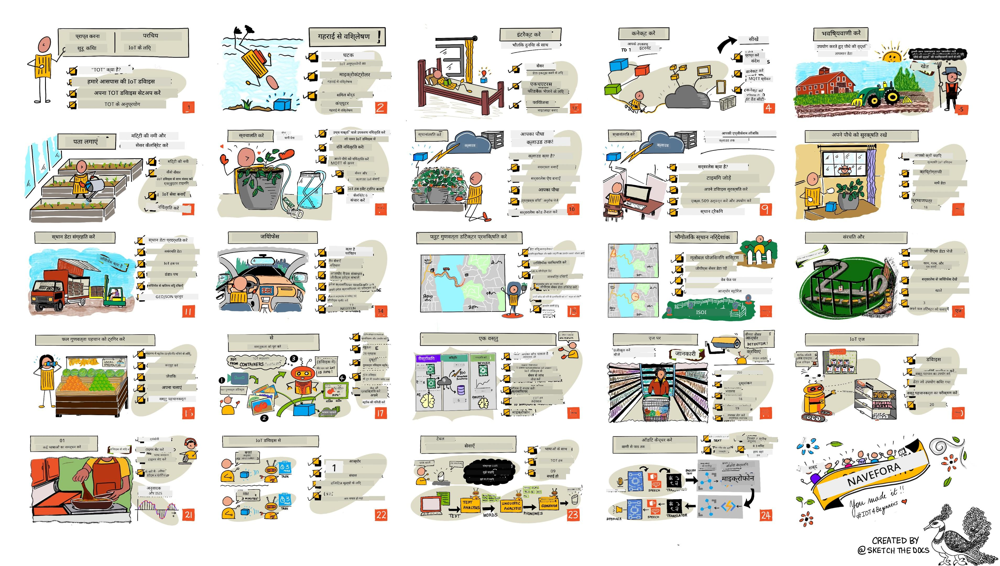

<!--
CO_OP_TRANSLATOR_METADATA:
{
  "original_hash": "6c354ec3487e4f6cfafbe44557996cd9",
  "translation_date": "2026-01-05T21:45:57+00:00",
  "source_file": "README.md",
  "language_code": "hi"
}
-->
[](https://github.com/microsoft/IoT-For-Beginners/blob/master/LICENSE)
[](https://GitHub.com/microsoft/IoT-For-Beginners/graphs/contributors/)
[](https://GitHub.com/microsoft/IoT-For-Beginners/issues/)
[](https://GitHub.com/microsoft/IoT-For-Beginners/pulls/)
[](http://makeapullrequest.com)

[](https://GitHub.com/microsoft/IoT-For-Beginners/watchers/)
[](https://GitHub.com/microsoft/IoT-For-Beginners/network/)
[](https://GitHub.com/microsoft/IoT-For-Beginners/stargazers/)

### Azure AI Foundry कम्युनिटी में शामिल हों

यदि आप अटक गए हैं या AI ऐप्स बनाने के बारे में कोई सवाल है। सहपाठी शिक्षार्थियों और अनुभवी डेवलपर्स के साथ MCP के बारे में चर्चा में शामिल हों। यह एक सहायक समुदाय है जहाँ प्रश्नों का स्वागत है और ज्ञान खुलकर साझा किया जाता है।

[](https://discord.gg/nTYy5BXMWG)

यदि आपके पास उत्पाद प्रतिक्रिया या निर्माण के दौरान त्रुटियाँ हैं, तो इस लिंक पर जाएँ:

[](https://aka.ms/foundry/forum)

इन संसाधनों का उपयोग शुरू करने के लिए निम्नलिखित चरणों का पालन करें:
1. **रिपॉजिटरी को फोर्क करें**: क्लिक करें [](https://GitHub.com/microsoft/IoT-For-Beginners/fork)
2. **रिपॉजिटरी क्लोन करें**:   `git clone https://github.com/microsoft/IoT-For-Beginners.git`
3. [**Microsoft Foundry Discord में शामिल हों और विशेषज्ञों और सह डेवलपर्स से मिलें**](https://discord.com/invite/ByRwuEEgH4)


### 🌐 बहुभाषी समर्थन

#### GitHub Action के माध्यम से समर्थित (स्वचालित और हमेशा अपडेटेड)

<!-- CO-OP TRANSLATOR LANGUAGES TABLE START -->
[Arabic](../ar/README.md) | [Bengali](../bn/README.md) | [Bulgarian](../bg/README.md) | [Burmese (Myanmar)](../my/README.md) | [Chinese (Simplified)](../zh/README.md) | [Chinese (Traditional, Hong Kong)](../hk/README.md) | [Chinese (Traditional, Macau)](../mo/README.md) | [Chinese (Traditional, Taiwan)](../tw/README.md) | [Croatian](../hr/README.md) | [Czech](../cs/README.md) | [Danish](../da/README.md) | [Dutch](../nl/README.md) | [Estonian](../et/README.md) | [Finnish](../fi/README.md) | [French](../fr/README.md) | [German](../de/README.md) | [Greek](../el/README.md) | [Hebrew](../he/README.md) | [Hindi](./README.md) | [Hungarian](../hu/README.md) | [Indonesian](../id/README.md) | [Italian](../it/README.md) | [Japanese](../ja/README.md) | [Kannada](../kn/README.md) | [Korean](../ko/README.md) | [Lithuanian](../lt/README.md) | [Malay](../ms/README.md) | [Malayalam](../ml/README.md) | [Marathi](../mr/README.md) | [Nepali](../ne/README.md) | [Nigerian Pidgin](../pcm/README.md) | [Norwegian](../no/README.md) | [Persian (Farsi)](../fa/README.md) | [Polish](../pl/README.md) | [Portuguese (Brazil)](../br/README.md) | [Portuguese (Portugal)](../pt/README.md) | [Punjabi (Gurmukhi)](../pa/README.md) | [Romanian](../ro/README.md) | [Russian](../ru/README.md) | [Serbian (Cyrillic)](../sr/README.md) | [Slovak](../sk/README.md) | [Slovenian](../sl/README.md) | [Spanish](../es/README.md) | [Swahili](../sw/README.md) | [Swedish](../sv/README.md) | [Tagalog (Filipino)](../tl/README.md) | [Tamil](../ta/README.md) | [Telugu](../te/README.md) | [Thai](../th/README.md) | [Turkish](../tr/README.md) | [Ukrainian](../uk/README.md) | [Urdu](../ur/README.md) | [Vietnamese](../vi/README.md)

> **स्थानीय रूप से क्लोन करना पसंद करते हैं?**

> इस रिपॉजिटरी में 50+ भाषा अनुवाद शामिल हैं, जो डाउनलोड आकार को काफी बढ़ाते हैं। अनुवादों के बिना क्लोन करने के लिए, sparse checkout का उपयोग करें:
> ```bash
> git clone --filter=blob:none --sparse https://github.com/microsoft/IoT-For-Beginners.git
> cd IoT-For-Beginners
> git sparse-checkout set --no-cone '/*' '!translations' '!translated_images'
> ```
> यह आपको तेजी से डाउनलोड के साथ पूरा कोर्स पूरा करने के लिए आवश्यक सभी चीजें देता है।
<!-- CO-OP TRANSLATOR LANGUAGES TABLE END -->

# शुरुआती लोगों के लिए IoT - एक पाठ्यक्रम

Microsoft के Azure Cloud Advocates खुशी के साथ IoT मूल बातें सीखने के लिए 12 सप्ताह, 24 पाठों की पाठ्यक्रम पेश करते हैं। प्रत्येक पाठ में पूर्व और पश्चात क्विज, पाठ पूरा करने के लिए लिखित निर्देश, एक समाधान, एक असाइनमेंट और अधिक शामिल हैं। हमारी परियोजना-आधारित शिक्षाशास्त्र आपको निर्माण करते हुए सीखने का अवसर देता है, जो नए कौशल को 'टिकने' का एक सिद्ध तरीका है।

परियोजनाएं खाद्य सामग्री के खेत से लेकर मेज तक के सफर को कवर करती हैं। इसमें खेती, लॉजिस्टिक्स, विनिर्माण, रिटेल और उपभोक्ता शामिल हैं - ये सभी IoT उपकरणों के लिए लोकप्रिय उद्योग क्षेत्र हैं।



> स्केचनोट द्वारा [Nitya Narasimhan](https://github.com/nitya). बड़ी छवि के लिए छवि पर क्लिक करें।

**हमारे लेखकों [Jen Fox](https://github.com/jenfoxbot), [Jen Looper](https://github.com/jlooper), [Jim Bennett](https://github.com/jimbobbennett), और हमारे स्केचनोट कलाकार [Nitya Narasimhan](https://github.com/nitya) को हार्दिक धन्यवाद।**

**धन्यवाद हमारे [Microsoft Learn Student Ambassadors](https://studentambassadors.microsoft.com?WT.mc_id=academic-17441-jabenn) की टीम को भी जिन्होंने इस पाठ्यक्रम की समीक्षा और अनुवाद किया है - [Aditya Garg](https://github.com/AdityaGarg00), [Anurag Sharma](https://github.com/Anurag-0-1-A), [Arpita Das](https://github.com/Arpiiitaaa), [Aryan Jain](https://www.linkedin.com/in/aryan-jain-47a4a1145/), [Bhavesh Suneja](https://github.com/EliteWarrior315), [Faith Hunja](https://faithhunja.github.io/), [Lateefah Bello](https://www.linkedin.com/in/lateefah-bello/), [Manvi Jha](https://github.com/Severus-Matthew), [Mireille Tan](https://www.linkedin.com/in/mireille-tan-a4834819a/), [Mohammad Iftekher (Iftu) Ebne Jalal](https://github.com/Iftu119), [Mohammad Zulfikar](https://github.com/mohzulfikar), [Priyanshu Srivastav](https://www.linkedin.com/in/priyanshu-srivastav-b067241ba), [Thanmai Gowducheruvu](https://github.com/innovation-platform), और [Zina Kamel](https://www.linkedin.com/in/zina-kamel/)।**

टीम से मिलें!

[](https://youtu.be/-wippUJRi5k)

**Gif द्वारा** [Mohit Jaisal](https://linkedin.com/in/mohitjaisal)

> 🎥 परियोजना के बारे में वीडियो के लिए ऊपर की छवि पर क्लिक करें!

> **शिक्षकों**, हमने इस पाठ्यक्रम का उपयोग कैसे करें, इसके लिए [कुछ सुझाव शामिल किए हैं](for-teachers.md)। यदि आप अपने स्वयं के पाठ बनाना चाहते हैं, तो हमने एक [पाठ टेम्पलेट भी शामिल किया है](lesson-template/README.md)।

> **[छात्रों](https://aka.ms/student-page)**, इस पाठ्यक्रम का उपयोग स्वयं करें, पूरे रिपॉजिटरी को फोर्क करें और अपने आप व्यायाम पूरे करें, जिससे कि आप प्री-लेक्चर क्विज से शुरू करें, फिर व्याख्यान पढ़ें और बाकी गतिविधियाँ पूरी करें। परियोजनाओं को समाधान कोड कॉपी करने के बजाय समझकर बनाने का प्रयास करें; हालांकि यह कोड प्रत्येक परियोजना-उन्मुख पाठ में /solutions फ़ोल्डर में उपलब्ध है। एक और विचार है कि मित्रों के साथ अध्ययन समूह बनाएं और एक साथ सामग्री से गुजरें। आगे अध्ययन के लिए, हम [Microsoft Learn](https://docs.microsoft.com/users/jimbobbennett/collections/ke2ehd351jopwr?WT.mc_id=academic-17441-jabenn) की सलाह देते हैं।

इस कोर्स का वीडियो अवलोकन देखने के लिए, इस वीडियो को देखें:

[](https://youtube.com/watch?v=bccEMm8gRuc "Promo video")

> 🎥 परियोजना के बारे में वीडियो के लिए ऊपर की छवि पर क्लिक करें!

## शिक्षाशास्त्र

इस पाठ्यक्रम को बनाते हुए हमने दो शैक्षिक सिद्धांत चुने हैं: इसे परियोजना-आधारित बनाना और इसमें नियमित क्विज शामिल करना। इस श्रृंखला के अंत तक, छात्र पौधों की निगरानी और पानी पहुंचाने की प्रणाली, वाहन ट्रैकर, खाद्य की निगरानी के लिए एक स्मार्ट फैक्टरी सेटअप, और एक वॉइस-कंट्रोल कुकिंग टाइमर बनाएंगे, और इंटरनेट ऑफ़ थिंग्स के मूल बातें सीखेंगे जिनमें डिवाइस कोड लिखना, क्लाउड से कनेक्ट करना, टेलीमेट्री का विश्लेषण करना और एज पर AI चलाना शामिल है।

सामग्री को परियोजनाओं के अनुरूप सुनिश्चित करने से प्रक्रिया छात्रों के लिए अधिक आकर्षक बनती है और अवधारणाओं का अवशोषण बढ़ता है।

इसके अलावा, कक्षा से पहले एक कम जोखिम वाला क्विज छात्र के सीखने के इरादे को सेट करता है, जबकि कक्षा के बाद दूसरा क्विज ध्यान और अवधारणाओं की और भी मजबूती सुनिश्चित करता है। यह पाठ्यक्रम लचीला और मज़ेदार बनाने के लिए डिज़ाइन किया गया है और इसे पूरी तरह या आंशिक रूप से लिया जा सकता है। परियोजनाएं छोटी शुरुआत करती हैं और 12 सप्ताह के चक्र के अंत तक धीरे-धीरे जटिल हो जाती हैं।

प्रत्येक परियोजना वास्तविक दुनिया की हार्डवेयर पर आधारित है जो छात्रों और शौकिया पेशेवरों के लिए उपलब्ध है। प्रत्येक परियोजना विशेष परियोजना क्षेत्र में संदर्भ ज्ञान प्रदान करती है। सफल विकासकर्ता बनने के लिए यह जानना मददगार होता है कि आप जिस क्षेत्र में समस्याएं सुलझा रहे हैं, यह पृष्ठभूमि ज्ञान छात्रों को उनके IoT समाधान और सीख को वास्तविक दुनिया की समस्या के संदर्भ में सोचने की अनुमति देता है जो उन्हें IoT डेवलपर के रूप में हल करना पड़ सकता है। छात्र उस 'क्यों' को समझते हैं जो वे बना रहे हैं, और अंतिम उपयोगकर्ता की सराहना करते हैं।

## हार्डवेयर

हम परियोजनाओं के लिए व्यक्तिगत पसंद, प्रोग्रामिंग भाषा ज्ञान या प्राथमिकताएं, सीखने के लक्ष्य और उपलब्धता के अनुसार दो IoT हार्डवेयर विकल्प प्रदान करते हैं। हमारे पास एक 'वर्चुअल हार्डवेयर' संस्करण भी है उन लोगों के लिए जिनके पास हार्डवेयर तक पहुंच नहीं है, या जो खरीदने से पहले अधिक सीखना चाहते हैं। आप अधिक पढ़ सकते हैं और एक 'शॉपिंग लिस्ट' पा सकते हैं [हार्डवेयर पेज](./hardware.md) पर, जिसमें Seeed Studio के हमारे मित्रों से पूरी किट खरीदने के लिए लिंक शामिल हैं।
> 💁 हमारे [आचार संहिता](CODE_OF_CONDUCT.md), [योगदान](CONTRIBUTING.md), और [अनुवाद](TRANSLATIONS.md) दिशानिर्देश देखें। हम आपके रचनात्मक प्रतिक्रिया का स्वागत करते हैं!
>
> 🔧 समस्या हो रही है? सामान्य समस्याओं के समाधान के लिए हमारे [समस्या निवारण मार्गदर्शिका](TROUBLESHOOTING.md) को देखें।

## प्रत्येक पाठ में शामिल है:

- स्केचनोट
- वैकल्पिक पूरक वीडियो
- पूर्व-पाठ वार्मअप क्विज़
- लिखित पाठ
- परियोजना आधारित पाठों के लिए, परियोजना को कैसे बनाएं पर चरण-दर-चरण मार्गदर्शिकाएं
- ज्ञान जाँच
- एक चुनौती
- पूरक पठन सामग्री
- असाइनमेंट
- [पाठोपरांत क्विज़](https://ff-quizzes.netlify.app/en/)

> **क्विज़ के बारे में एक नोट**: सभी क्विज़ क्विज़-ऐप फ़ोल्डर में संग्रहीत हैं, कुल 48 क्विज़ तीन प्रश्नों के प्रत्येक। ये पाठों के भीतर लिंक की गई हैं, लेकिन क्विज़ ऐप को स्थानीय रूप से चलाया जा सकता है या Azure पर डिप्लॉय किया जा सकता है; `quiz-app` फ़ोल्डर में निर्देशों का पालन करें। इन्हें क्रमशः स्थानीयकृत किया जा रहा है।

## पाठ

|       |              परियोजना का नाम              |                       सिखाए गए अवधारणाएँ                       | सीखने के उद्देश्य                                                                                                                                                 |                                                        लिंक किए गए पाठ                                                         |
| :---: | :------------------------------------: | :---------------------------------------------------------: | ------------------------------------------------------------------------------------------------------------------------------------------------------------------- | :--------------------------------------------------------------------------------------------------------------------------: |
|  01   | [शुरुआत करना](./1-getting-started/README.md) |                     IoT का परिचय                     | IoT के मूल सिद्धांतों और IoT समाधानों के मूल घटकों जैसे सेंसर और क्लाउड सेवाओं को सीखें, जब आप अपना पहला IoT डिवाइस सेट कर रहे हों |                      [IoT का परिचय](./1-getting-started/lessons/1-introduction-to-iot/README.md)                      |
|  02   | [शुरुआत करना](./1-getting-started/README.md) |                   IoT का गहरा अध्ययन                    | IoT सिस्टम के घटकों के बारे में अधिक जानें, साथ ही माइक्रोकंट्रोलर और सिंगल-बोर्ड कंप्यूटर के बारे में जानें                                                            |                        [IoT का गहरा अध्ययन](./1-getting-started/lessons/2-deeper-dive/README.md)                         |
|  03   | [शुरुआत करना](./1-getting-started/README.md) | सेंसर और एक्टुएटर्स के साथ भौतिक दुनिया के साथ इंटरैक्ट करें | भौतिक दुनिया से डेटा इकट्ठा करने के लिए सेंसर और प्रतिक्रिया भेजने के लिए एक्टुएटर्स के बारे में जानें, जबकि आप एक नाइटलाइट बनाते हैं                                           | [सेंसर और एक्टुएटर्स के साथ भौतिक दुनिया के साथ इंटरैक्ट करें](./1-getting-started/lessons/3-sensors-and-actuators/README.md) |
|  04   | [शुरुआत करना](./1-getting-started/README.md) |             अपने डिवाइस को इंटरनेट से जोड़ें             | सीखें कि IoT डिवाइस को इंटरनेट से कैसे जोड़ा जाए ताकि संदेश भेजे और प्राप्त किए जा सकें, अपने नाइटलाइट को MQTT ब्रोकर से कनेक्ट करते हुए                               |               [अपने डिवाइस को इंटरनेट से जोड़ें](./1-getting-started/lessons/4-connect-internet/README.md)                |
|  05   |            [खेती](./2-farm/README.md)            |                    पौधों की वृद्धि की भविष्यवाणी                     | एक IoT डिवाइस द्वारा कैप्चर किए गए तापमान डेटा का उपयोग करके पौधों की वृद्धि की भविष्यवाणी कैसे करें                                                                                  |                          [पौधों की वृद्धि की भविष्यवाणी](./2-farm/lessons/1-predict-plant-growth/README.md)                           |
|  06   |            [खेती](./2-farm/README.md)            |                    मिट्टी की नमी का पता लगाएं                     | मिट्टी की नमी का पता लगाने और मिट्टी नमी सेंसर को कैलिब्रेट करने के बारे में जानें                                                                                              |                          [मिट्टी की नमी का पता लगाएं](./2-farm/lessons/2-detect-soil-moisture/README.md)                           |
|  07   |            [खेती](./2-farm/README.md)            |                  स्वचालित पौधों को पानी देना                   | रिले और MQTT का उपयोग करके पानी देने को स्वचालित और समयबद्ध करने के बारे में जानें                                                                                                      |                      [स्वचालित पौधों को पानी देना](./2-farm/lessons/3-automated-plant-watering/README.md)                       |
|  08   |            [खेती](./2-farm/README.md)            |               अपने पौधे को क्लाउड में स्थानांतरित करें               | क्लाउड और क्लाउड-होस्टेड IoT सेवाओं के बारे में जानें और अपने पौधे को सार्वजनिक MQTT ब्रोकर के बजाय इनमें से किसी एक से कैसे कनेक्ट करें                                   |               [अपने पौधे को क्लाउड में स्थानांतरित करें](./2-farm/lessons/4-migrate-your-plant-to-the-cloud/README.md)                |
|  09   |            [खेती](./2-farm/README.md)            |         अपने एप्लिकेशन लॉजिक को क्लाउड में स्थानांतरित करें         | IoT संदेशों का प्रतिक्रिया देने वाले क्लाउड में एप्लिकेशन लॉजिक कैसे लिखा जा सकता है इसके बारे में जानें                                                                          |         [अपने एप्लिकेशन लॉजिक को क्लाउड में स्थानांतरित करें](./2-farm/lessons/5-migrate-application-to-the-cloud/README.md)         |
|  10   |            [खेती](./2-farm/README.md)            |                   अपने पौधे को सुरक्षित रखें                    | IoT के साथ सुरक्षा के बारे में जानें और कुंजियों और सर्टिफिकेट्स के साथ अपने पौधे को सुरक्षित कैसे रखें                                                                          |                        [अपने पौधे को सुरक्षित रखें](./2-farm/lessons/6-keep-your-plant-secure/README.md)                         |
|  11   |       [परिवहन](./3-transport/README.md)       |                      स्थान ट्रैकिंग                      | IoT उपकरणों के लिए GPS स्थान ट्रैकिंग के बारे में जानें                                                                                                                   |                           [स्थान ट्रैकिंग](./3-transport/lessons/1-location-tracking/README.md)                           |
|  12   |       [परिवहन](./3-transport/README.md)       |                     स्थान डेटा संग्रहीत करें                     | बाद में दृश्य या विश्लेषण के लिए IoT डेटा को संग्रहीत करने के बारे में जानें                                                                                                      |                         [स्थान डेटा संग्रहीत करें](./3-transport/lessons/2-store-location-data/README.md)                         |
|  13   |       [परिवहन](./3-transport/README.md)       |                   स्थान डेटा का दृश्य बनाएं                   | नक्शे पर स्थान डेटा के दृश्यकरण के बारे में जानें, और कैसे नक्शे वास्तविक 3डी विश्व को 2 आयामों में दर्शाते हैं                                                            |                     [स्थान डेटा का दृश्य बनाएं](./3-transport/lessons/3-visualize-location-data/README.md)                     |
|  14   |       [परिवहन](./3-transport/README.md)       |                          जियोफेंस                          | जियोफेंस के बारे में जानें, और कैसे इन्हें सप्लाई चेन में वाहन जब उनके गंतव्य के करीब होते हैं तो अलर्ट देने के लिए उपयोग किया जा सकता है                                           |                                   [जियोफेंस](./3-transport/lessons/4-geofences/README.md)                                   |
|  15   |   [निर्माण](./4-manufacturing/README.md)   |               फल गुणवत्ता डिटेक्टर को प्रशिक्षित करें                | क्लाउड में छवि वर्गीकारक को प्रशिक्षित करने के बारे में जानें ताकि फल की गुणवत्ता का पता लगाया जा सके                                                                                       |                 [फल गुणवत्ता डिटेक्टर को प्रशिक्षित करें](./4-manufacturing/lessons/1-train-fruit-detector/README.md)                 |
|  16   |   [निर्माण](./4-manufacturing/README.md)   |           IoT डिवाइस से फल की गुणवत्ता की जांच करें            | IoT डिवाइस से अपने फल गुणवत्ता डिटेक्टर का उपयोग करने के बारे में जानें                                                                                                    |           [IoT डिवाइस से फल की गुणवत्ता की जांच करें](./4-manufacturing/lessons/2-check-fruit-from-device/README.md)            |
|  17   |   [निर्माण](./4-manufacturing/README.md)   |             अपने फल डिटेक्टर को एज पर चलाएं             | एज पर एक IoT डिवाइस पर अपने फल डिटेक्टर को चलाने के बारे में जानें                                                                                                |             [अपने फल डिटेक्टर को एज पर चलाएं](./4-manufacturing/lessons/3-run-fruit-detector-edge/README.md)             |
|  18   |   [निर्माण](./4-manufacturing/README.md)   |        एक सेंसर से फल गुणवत्ता पहचान ट्रिगर करें        | एक सेंसर से फल गुणवत्ता पहचान को ट्रिगर करने के बारे में जानें                                                                                                        |        [एक सेंसर से फल गुणवत्ता पहचान ट्रिगर करें](./4-manufacturing/lessons/4-trigger-fruit-detector/README.md)         |
|  19   |          [खुदरा](./5-retail/README.md)          |                   स्टॉक डिटेक्टर को प्रशिक्षित करें                    | किसी दुकान में स्टॉक गिनने के लिए वस्तु पहचान का उपयोग करके स्टॉक डिटेक्टर को प्रशिक्षित करने के बारे में जानें                                                                                |                        [स्टॉक डिटेक्टर को प्रशिक्षित करें](./5-retail/lessons/1-train-stock-detector/README.md)                         |
|  20   |          [खुदरा](./5-retail/README.md)          |               IoT डिवाइस से स्टॉक जांचें                | वस्तु पहचान मॉडल का उपयोग करके IoT डिवाइस से स्टॉक की जांच कैसे करें                                                                                         |                     [IoT डिवाइस से स्टॉक जांचें](./5-retail/lessons/2-check-stock-device/README.md)                      |
|  21   |        [उपभोक्ता](./6-consumer/README.md)        |             IoT डिवाइस के साथ भाषण पहचानें             | स्मार्ट टाइमर बनाने के लिए IoT डिवाइस से भाषण पहचानने के बारे में जानें                                                                                             |                  [IoT डिवाइस के साथ भाषण पहचानें](./6-consumer/lessons/1-speech-recognition/README.md)                  |
|  22   |        [उपभोक्ता](./6-consumer/README.md)        |                     भाषा समझें                     | IoT डिवाइस से बोले गए वाक्यों को समझने के बारे में जानें                                                                                                           |                        [भाषा समझें](./6-consumer/lessons/2-language-understanding/README.md)                        |
|  23   |        [उपभोक्ता](./6-consumer/README.md)        |           टाइमर सेट करें और बोले गए फ़ीडबैक दें           | IoT डिवाइस पर टाइमर कैसे सेट करें और जब टाइमर सेट करें और समाप्त हो जाए तो बोले गए फ़ीडबैक कैसे दें                                                                                                                    |                 [टाइमर सेट करें और बोले गए फ़ीडबैक दें](./6-consumer/lessons/3-spoken-feedback/README.md)                  |
|  24   |        [उपभोक्ता](./6-consumer/README.md)        |                 कई भाषाओं का समर्थन करें                  | कई भाषाओं का समर्थन कैसे करें, यानी बोली जाने वाली और आपके स्मार्ट टाइमर से प्राप्त प्रतिक्रियाएँ                                                               |                   [कई भाषाओं का समर्थन करें](./6-consumer/lessons/4-multiple-language-support/README.md)                   |

## ऑफलाइन एक्सेस

आप इस दस्तावेज़ को ऑफलाइन [Docsify](https://docsify.js.org/#/) का उपयोग करके चला सकते हैं। इस रिपोजिटरी को फोर्क करें, [Docsify इंस्टॉल करें](https://docsify.js.org/#/quickstart) अपने स्थानीय मशीन पर, और फिर इस रिपोजिटरी के रूट फ़ोल्डर में `docsify serve` टाइप करें। वेबसाइट आपके लोकलहोस्ट पर पोर्ट 3000 पर चल जाएगी: `localhost:3000`।

## क्विज़

इस समुदाय का धन्यवाद जो इंटरएक्टिव क्विज़ की मेजबानी करता है जो प्रत्येक अध्याय पर आपका ज्ञान परखता है। आप अपना ज्ञान [यहाँ](https://ff-quizzes.netlify.app/en/) परीक्षण कर सकते हैं।

### PDF

अगर आवश्यक हो तो इस सामग्री का PDF ऑफलाइन एक्सेस के लिए बनाया जा सकता है। ऐसा करने के लिए, सुनिश्चित करें कि आपके पास [npm इंस्टॉल किया हुआ है](https://docs.npmjs.com/downloading-and-installing-node-js-and-npm) और फिर इस रिपोजिटरी के रूट फोल्डर में निम्नलिखित कमांड चलाएँ:

```sh
npm i
npm run convert
```

### स्लाइड्स

कुछ पाठों के लिए स्लाइड डेक [slides](../../slides) फ़ोल्डर में उपलब्ध हैं।

## अन्य पाठ्यक्रम

हमारी टीम अन्य पाठ्यक्रम भी तैयार करती है! देखें:

<!-- CO-OP TRANSLATOR OTHER COURSES START -->
### LangChain
[](https://aka.ms/langchain4j-for-beginners)
[](https://aka.ms/langchainjs-for-beginners?WT.mc_id=m365-94501-dwahlin)

---

### Azure / Edge / MCP / एजेंट्स
[](https://github.com/microsoft/AZD-for-beginners?WT.mc_id=academic-105485-koreyst)
[](https://github.com/microsoft/edgeai-for-beginners?WT.mc_id=academic-105485-koreyst)
[](https://github.com/microsoft/mcp-for-beginners?WT.mc_id=academic-105485-koreyst)
[](https://github.com/microsoft/ai-agents-for-beginners?WT.mc_id=academic-105485-koreyst)

---
 
### जनरेटिव AI सीरीज़
[](https://github.com/microsoft/generative-ai-for-beginners?WT.mc_id=academic-105485-koreyst)
[-9333EA?style=for-the-badge&labelColor=E5E7EB&color=9333EA)](https://github.com/microsoft/Generative-AI-for-beginners-dotnet?WT.mc_id=academic-105485-koreyst)
[-C084FC?style=for-the-badge&labelColor=E5E7EB&color=C084FC)](https://github.com/microsoft/generative-ai-for-beginners-java?WT.mc_id=academic-105485-koreyst)
[-E879F9?style=for-the-badge&labelColor=E5E7EB&color=E879F9)](https://github.com/microsoft/generative-ai-with-javascript?WT.mc_id=academic-105485-koreyst)

---
 
### मूल शिक्षण
[](https://aka.ms/ml-beginners?WT.mc_id=academic-105485-koreyst)
[](https://aka.ms/datascience-beginners?WT.mc_id=academic-105485-koreyst)
[](https://aka.ms/ai-beginners?WT.mc_id=academic-105485-koreyst)
[](https://github.com/microsoft/Security-101?WT.mc_id=academic-96948-sayoung)
[](https://aka.ms/webdev-beginners?WT.mc_id=academic-105485-koreyst)
[](https://aka.ms/iot-beginners?WT.mc_id=academic-105485-koreyst)
[](https://github.com/microsoft/xr-development-for-beginners?WT.mc_id=academic-105485-koreyst)

---
 
### कोपायलट सीरीज़
[](https://aka.ms/GitHubCopilotAI?WT.mc_id=academic-105485-koreyst)
[](https://github.com/microsoft/mastering-github-copilot-for-dotnet-csharp-developers?WT.mc_id=academic-105485-koreyst)
[](https://github.com/microsoft/CopilotAdventures?WT.mc_id=academic-105485-koreyst)
<!-- CO-OP TRANSLATOR OTHER COURSES END -->

## छवि संबंधित श्रेय

आप आवश्यकतानुसार इस पाठ्यक्रम में उपयोग की गई सभी छवियों के श्रेय [Attributions](./attributions.md) में पा सकते हैं।

---

<!-- CO-OP TRANSLATOR DISCLAIMER START -->
**अस्वीकरण**:  
यह दस्तावेज़ AI अनुवाद सेवा [Co-op Translator](https://github.com/Azure/co-op-translator) का उपयोग करके अनूदित किया गया है। जबकि हम सटीकता के लिए प्रयास करते हैं, कृपया ध्यान रखें कि स्वचालित अनुवाद में त्रुटियाँ या गलतियां हो सकती हैं। मूल भाषा में दस्तावेज़ को अधिकृत स्रोत माना जाना चाहिए। महत्वपूर्ण जानकारी के लिए, पेशेवर मानव अनुवाद की सलाह दी जाती है। इस अनुवाद के उपयोग से उत्पन्न किसी भी गलतफहमी या व्याख्या के लिए हम जिम्मेदार नहीं हैं।
<!-- CO-OP TRANSLATOR DISCLAIMER END -->