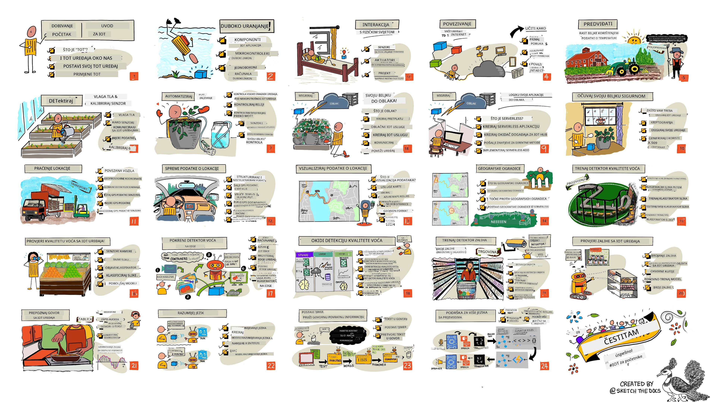

<!--
CO_OP_TRANSLATOR_METADATA:
{
  "original_hash": "6c354ec3487e4f6cfafbe44557996cd9",
  "translation_date": "2026-01-06T21:25:27+00:00",
  "source_file": "README.md",
  "language_code": "hr"
}
-->
[](https://github.com/microsoft/IoT-For-Beginners/blob/master/LICENSE)
[](https://GitHub.com/microsoft/IoT-For-Beginners/graphs/contributors/)
[](https://GitHub.com/microsoft/IoT-For-Beginners/issues/)
[](https://GitHub.com/microsoft/IoT-For-Beginners/pulls/)
[](http://makeapullrequest.com)

[](https://GitHub.com/microsoft/IoT-For-Beginners/watchers/)
[](https://GitHub.com/microsoft/IoT-For-Beginners/network/)
[](https://GitHub.com/microsoft/IoT-For-Beginners/stargazers/)

### Pridružite se Azure AI Foundry Zajednici

Ako zapnete ili imate bilo kakva pitanja o izgradnji AI aplikacija. Pridružite se kolegama učenicima i iskusnim programerima u raspravama o MCP-u. To je podržavajuća zajednica u kojoj su pitanja dobrodošla i gdje se znanje slobodno dijeli.

[](https://discord.gg/nTYy5BXMWG)

Ako imate povratnu informaciju o proizvodu ili prijavite greške tijekom izrade posjetite:

[](https://aka.ms/foundry/forum)

Slijedite ove korake za početak korištenja ovih resursa:
1. **Napravite fork repozitorija**: Kliknite [](https://GitHub.com/microsoft/IoT-For-Beginners/fork)
2. **Klonirajte repozitorij**:   `git clone https://github.com/microsoft/IoT-For-Beginners.git`
3. [**Pridružite se Microsoft Foundry Discordu i upoznajte stručnjake i kolege programere**](https://discord.com/invite/ByRwuEEgH4)


### 🌐 Višejezična Podrška

#### Podržano putem GitHub Action (Automatski i Uvijek Ažurirano)

<!-- CO-OP TRANSLATOR LANGUAGES TABLE START -->
[Arabic](../ar/README.md) | [Bengali](../bn/README.md) | [Bulgarian](../bg/README.md) | [Burmese (Myanmar)](../my/README.md) | [Chinese (Simplified)](../zh/README.md) | [Chinese (Traditional, Hong Kong)](../hk/README.md) | [Chinese (Traditional, Macau)](../mo/README.md) | [Chinese (Traditional, Taiwan)](../tw/README.md) | [Croatian](./README.md) | [Czech](../cs/README.md) | [Danish](../da/README.md) | [Dutch](../nl/README.md) | [Estonian](../et/README.md) | [Finnish](../fi/README.md) | [French](../fr/README.md) | [German](../de/README.md) | [Greek](../el/README.md) | [Hebrew](../he/README.md) | [Hindi](../hi/README.md) | [Hungarian](../hu/README.md) | [Indonesian](../id/README.md) | [Italian](../it/README.md) | [Japanese](../ja/README.md) | [Kannada](../kn/README.md) | [Korean](../ko/README.md) | [Lithuanian](../lt/README.md) | [Malay](../ms/README.md) | [Malayalam](../ml/README.md) | [Marathi](../mr/README.md) | [Nepali](../ne/README.md) | [Nigerian Pidgin](../pcm/README.md) | [Norwegian](../no/README.md) | [Persian (Farsi)](../fa/README.md) | [Polish](../pl/README.md) | [Portuguese (Brazil)](../br/README.md) | [Portuguese (Portugal)](../pt/README.md) | [Punjabi (Gurmukhi)](../pa/README.md) | [Romanian](../ro/README.md) | [Russian](../ru/README.md) | [Serbian (Cyrillic)](../sr/README.md) | [Slovak](../sk/README.md) | [Slovenian](../sl/README.md) | [Spanish](../es/README.md) | [Swahili](../sw/README.md) | [Swedish](../sv/README.md) | [Tagalog (Filipino)](../tl/README.md) | [Tamil](../ta/README.md) | [Telugu](../te/README.md) | [Thai](../th/README.md) | [Turkish](../tr/README.md) | [Ukrainian](../uk/README.md) | [Urdu](../ur/README.md) | [Vietnamese](../vi/README.md)

> **Radije klonirati lokalno?**

> Ovaj repozitorij uključuje više od 50 prijevoda jezika što značajno povećava veličinu preuzimanja. Za kloniranje bez prijevoda, koristite sparse checkout:
> ```bash
> git clone --filter=blob:none --sparse https://github.com/microsoft/IoT-For-Beginners.git
> cd IoT-For-Beginners
> git sparse-checkout set --no-cone '/*' '!translations' '!translated_images'
> ```
> Ovo vam daje sve što vam je potrebno za završetak tečaja uz puno brže preuzimanje.
<!-- CO-OP TRANSLATOR LANGUAGES TABLE END -->

# IoT za početnike - Kurikulum

Azure Cloud zagovornici iz Microsofta s veseljem nude 12-tjedni, 24-poglavni kurikulum koji se bavi osnovama IoT-a. Svako poglavlje uključuje prethodni i naknadni kviz, pisane upute za dovršetak lekcije, rješenje, zadatak i još mnogo toga. Naša pedagoška metoda utemeljena na projektima omogućuje učenje kroz izgradnju, dokazani način za 'učvršćivanje' novih vještina.

Projektima se pokriva put hrane od farme do stola. To uključuje poljoprivredu, logistiku, proizvodnju, maloprodaju i krajnjeg potrošača - sve popularna industrijska područja za IoT uređaje.



> Sketchnote autor [Nitya Narasimhan](https://github.com/nitya). Kliknite sliku za veću verziju.

**Iskrena hvala našim autorima [Jen Fox](https://github.com/jenfoxbot), [Jen Looper](https://github.com/jlooper), [Jim Bennett](https://github.com/jimbobbennett), i našem umjetniku sketchnotea [Nitya Narasimhan](https://github.com/nitya).**

**Također hvala našem timu [Microsoft Learn študentskih ambasadora](https://studentambassadors.microsoft.com?WT.mc_id=academic-17441-jabenn) koji su pregledavali i prevodili ovaj kurikulum - [Aditya Garg](https://github.com/AdityaGarg00), [Anurag Sharma](https://github.com/Anurag-0-1-A), [Arpita Das](https://github.com/Arpiiitaaa), [Aryan Jain](https://www.linkedin.com/in/aryan-jain-47a4a1145/), [Bhavesh Suneja](https://github.com/EliteWarrior315), [Faith Hunja](https://faithhunja.github.io/), [Lateefah Bello](https://www.linkedin.com/in/lateefah-bello/), [Manvi Jha](https://github.com/Severus-Matthew), [Mireille Tan](https://www.linkedin.com/in/mireille-tan-a4834819a/), [Mohammad Iftekher (Iftu) Ebne Jalal](https://github.com/Iftu119), [Mohammad Zulfikar](https://github.com/mohzulfikar), [Priyanshu Srivastav](https://www.linkedin.com/in/priyanshu-srivastav-b067241ba), [Thanmai Gowducheruvu](https://github.com/innovation-platform), i [Zina Kamel](https://www.linkedin.com/in/zina-kamel/).**

Upoznajte tim!

[](https://youtu.be/-wippUJRi5k)

**Gif autor** [Mohit Jaisal](https://linkedin.com/in/mohitjaisal)

> 🎥 Kliknite gornju sliku za video o projektu!

> **Nastavnici**, uključili smo [neke prijedloge](for-teachers.md) o tome kako koristiti ovaj kurikulum. Ako želite kreirati vlastite lekcije, uključili smo i [predložak lekcije](lesson-template/README.md).

> **[Učenici](https://aka.ms/student-page)**, za samostalno korištenje ovog kurikuluma, napravite fork cijelog repozitorija i sami dovršite vježbe, počevši s prethodnim kvizom, zatim čitanjem lekcije i dovršavanjem ostalih aktivnosti. Pokušajte kreirati projekte razumijevanjem lekcija radije nego kopiranjem koda rješenja; svejedno taj je kod dostupan u mapama /solutions u svakoj lekciji orijentiranoj na projekte. Još jedna ideja je da osnovate grupu za učenje s prijateljima i zajedno prolazite kroz sadržaj. Za daljnje učenje preporučujemo [Microsoft Learn](https://docs.microsoft.com/users/jimbobbennett/collections/ke2ehd351jopwr?WT.mc_id=academic-17441-jabenn).

Za video pregled ovog tečaja, pogledajte ovaj video:

[](https://youtube.com/watch?v=bccEMm8gRuc "Promo video")

> 🎥 Kliknite gornju sliku za video o projektu!

## Pedagogija

Odabrali smo dva pedagoška načela pri izradi ovog kurikuluma: osigurati da je baziran na projektima i da uključuje česte kvizove. Na kraju ove serije, studenti će izgraditi sustav za nadzor i zalijevanje biljaka, uređaj za praćenje vozila, pametnu tvornicu za praćenje i kontrolu hrane te timer za kuhanje koji se kontrolira glasom, kao i naučiti osnove Interneta stvari uključujući kako pisati kod za uređaj, povezati se s oblakom, analizirati telemetriju i pokretati AI na rubu mreže.

Time što sadržaj usklađujemo s projektima, proces postaje zanimljiviji učenicima i povećava se zadržavanje koncepata.

Osim toga, kviz s niskim rizikom prije nastave postavlja namjeru učenika za učenje teme, dok drugi kviz nakon nastave osigurava dodatnu zadržavanje. Ovaj je kurikulum dizajniran tako da bude fleksibilan i zabavan te se može pohađati u cijelosti ili djelomično. Projekti započinju jednostavni i postaju sve složeniji do kraja 12-tjednog ciklusa.

Svaki je projekt baziran na stvarnom hardveru dostupnom studentima i hobistima. Svaki projekt proučava specifično područje projekta, pružajući relevantno pozadinsko znanje. Za uspješnog developera pomaže razumjeti domen u kojoj se rješavaju problemi, a pružanjem ovog pozadinskog znanja pomažemo studentima razmišljati o njihovim IoT rješenjima i učenju u kontekstu vrste stvarnog problema kojeg bi mogli trebati riješiti kao IoT developer. Studenti uče 'zašto' rješenja koja grade i stječu cijenjenje krajnjeg korisnika.

## Hardver

Imamo dva izbora IoT hardvera za korištenje u projektima ovisno o osobnim preferencijama, znanju ili preferencijama programskog jezika, ciljevima učenja i dostupnosti. Također smo osigurali verziju 'virtualnog hardvera' za one koji nemaju pristup hardveru ili žele naučiti više prije nego što se odluče na kupnju. Više možete pročitati i pronaći 'listu za kupovinu' na [hardverskoj stranici](./hardware.md), uključujući poveznice za kupnju kompletnih kitova od naših prijatelja iz Seeed Studija.
> 💁 Pronađite naša [Pravila ponašanja](CODE_OF_CONDUCT.md), [Upute za doprinos](CONTRIBUTING.md) i [Prijevodne smjernice](TRANSLATIONS.md). Dobrodošli su vaši konstruktivni komentari!
>
> 🔧 Imate problema? Pogledajte naš [Vodič za rješavanje problema](TROUBLESHOOTING.md) za rješenja najčešćih problema.

## Svaka lekcija uključuje:

- sketchnote
- opcijski dodatni video
- zagrijavajući kviz prije lekcije
- pisanu lekciju
- za lekcije temeljene na projektima, korak-po-korak vodiče kako izgraditi projekt
- provjere znanja
- izazov
- dodatnu literaturu
- zadatak
- [kviz nakon lekcije](https://ff-quizzes.netlify.app/en/)

> **Napomena o kvizovima**: Svi su kvizovi sadržani u mapi quiz-app, ukupno 48 kvizova po tri pitanja. Povezani su iz lekcija, ali kviz se može pokretati lokalno ili postaviti na Azure; slijedite upute u mapi `quiz-app`. Postupno se lokaliziraju.

## Lekcije

|       |              Naziv projekta              |                       Pojmovi koji se uče                       | Ciljevi učenja                                                                                                                                                      |                                                         Povezana lekcija                                                         |
| :---: | :-------------------------------------: | :---------------------------------------------------------------: | ------------------------------------------------------------------------------------------------------------------------------------------------------------------ | :----------------------------------------------------------------------------------------------------------------------------: |
|  01   | [Početak](./1-getting-started/README.md) |                     Uvod u IoT                                  | Naučite osnovne principe IoT-a i osnovne gradivne blokove IoT rješenja poput senzora i usluga u oblaku dok postavljate svoj prvi IoT uređaj                            |                        [Uvod u IoT](./1-getting-started/lessons/1-introduction-to-iot/README.md)                         |
|  02   | [Početak](./1-getting-started/README.md) |                   Dublji uvid u IoT                            | Naučite više o komponentama IoT sustava, kao i o mikrokontrolerima i jedinstvenim računalima ploča                                                                |                           [Dublji uvid u IoT](./1-getting-started/lessons/2-deeper-dive/README.md)                         |
|  03   | [Početak](./1-getting-started/README.md) | Interakcija s fizičkim svijetom pomoću senzora i aktuatora     | Upoznajte senzore za prikupljanje podataka iz fizičkog svijeta i aktuatora za slanje povratnih informacija dok gradite noćno svjetlo                               | [Interakcija s fizičkim svijetom pomoću senzora i aktuatora](./1-getting-started/lessons/3-sensors-and-actuators/README.md) |
|  04   | [Početak](./1-getting-started/README.md) |             Povežite svoj uređaj s Internetom                   | Naučite kako povezati IoT uređaj s Internetom za slanje i primanje poruka povezivanjem vašeg noćnog svjetla s MQTT poslužiteljem                                    |                 [Povežite svoj uređaj s Internetom](./1-getting-started/lessons/4-connect-internet/README.md)               |
|  05   |            [Poljoprivreda](./2-farm/README.md)            |                    Predvidi rast biljke                         | Naučite kako predvidjeti rast biljaka pomoću podataka o temperaturi prikupljenih IoT uređajem                                                                       |                           [Predvidi rast biljke](./2-farm/lessons/1-predict-plant-growth/README.md)                          |
|  06   |            [Poljoprivreda](./2-farm/README.md)            |                    Detekcija vlage tla                          | Naučite kako detektirati vlagu tla i kalibrirati senzor vlage tla                                                                                                  |                           [Detekcija vlage tla](./2-farm/lessons/2-detect-soil-moisture/README.md)                          |
|  07   |            [Poljoprivreda](./2-farm/README.md)            |                  Automatsko zalijevanje biljaka                | Naučite kako automatizirati i vremenski uskladiti zalijevanje pomoću releja i MQTT-a                                                                              |                       [Automatsko zalijevanje biljaka](./2-farm/lessons/3-automated-plant-watering/README.md)               |
|  08   |            [Poljoprivreda](./2-farm/README.md)            |               Preselite svoju biljku u oblak                    | Upoznajte oblak i usluge IoT u oblaku te kako povezati svoju biljku s nekim od njih umjesto javnog MQTT poslužitelja                                            |              [Preselite svoju biljku u oblak](./2-farm/lessons/4-migrate-your-plant-to-the-cloud/README.md)                 |
|  09   |            [Poljoprivreda](./2-farm/README.md)            |         Preselite logiku aplikacije u oblak                    | Upoznajte kako pisati logiku aplikacije u oblaku koja reagira na IoT poruke                                                                                      |          [Preselite logiku aplikacije u oblak](./2-farm/lessons/5-migrate-application-to-the-cloud/README.md)               |
|  10   |            [Poljoprivreda](./2-farm/README.md)            |                   Osigurajte svoju biljku                      | Saznajte o sigurnosti u IoT-u i kako osigurati svoju biljku pomoću ključeva i certifikata                                                                        |                            [Osigurajte svoju biljku](./2-farm/lessons/6-keep-your-plant-secure/README.md)                     |
|  11   |       [Transport](./3-transport/README.md)       |                      Praćenje lokacije                         | Naučite o GPS praćenju lokacije za IoT uređaje                                                                                                                    |                         [Praćenje lokacije](./3-transport/lessons/1-location-tracking/README.md)                             |
|  12   |       [Transport](./3-transport/README.md)       |                     Pohrana podataka lokacije                 | Naučite kako pohraniti IoT podatke za kasniju vizualizaciju ili analizu                                                                                           |                         [Pohrana podataka lokacije](./3-transport/lessons/2-store-location-data/README.md)                   |
|  13   |       [Transport](./3-transport/README.md)       |                   Vizualizacija podataka lokacije             | Naučite o vizualizaciji podataka o lokaciji na karti i kako karte predstavljaju stvarni 3D svijet u 2 dimenzije                                                  |                     [Vizualizacija podataka o lokaciji](./3-transport/lessons/3-visualize-location-data/README.md)          |
|  14   |       [Transport](./3-transport/README.md)       |                          Geografske ograde                     | Upoznajte se s geografskim ogradama i kako se koriste za obavještavanje kad su vozila u lancu opskrbe blizu svoje destinacije                                   |                                   [Geografske ograde](./3-transport/lessons/4-geofences/README.md)                         |
|  15   |   [Proizvodnja](./4-manufacturing/README.md)   |               Obucite detektor kvalitete voća                  | Naučite o obuci klasifikatora slika u oblaku za detekciju kvalitete voća                                                                                        |                [Obucite detektor kvalitete voća](./4-manufacturing/lessons/1-train-fruit-detector/README.md)                 |
|  16   |   [Proizvodnja](./4-manufacturing/README.md)   |           Provjerite kvalitetu voća iz IoT uređaja            | Upoznajte korištenje detektora kvalitete voća s IoT uređaja                                                                                                     |             [Provjerite kvalitetu voća iz IoT uređaja](./4-manufacturing/lessons/2-check-fruit-from-device/README.md)        |
|  17   |   [Proizvodnja](./4-manufacturing/README.md)   |             Pokrenite detektor voća na rubu                    | Saznajte kako pokrenuti detektor voća na IoT uređaju na rubu                                                                                                   |             [Pokrenite detektor voća na rubu](./4-manufacturing/lessons/3-run-fruit-detector-edge/README.md)                |
|  18   |   [Proizvodnja](./4-manufacturing/README.md)   |        Aktivirajte detekciju kvalitete voća sa senzora        | Saznajte kako aktivirati detekciju kvalitete voća sa senzora                                                                                                   |          [Aktivirajte detekciju kvalitete voća sa senzora](./4-manufacturing/lessons/4-trigger-fruit-detector/README.md)     |
|  19   |          [Maloprodaja](./5-retail/README.md)          |                   Obucite detektor zaliha                     | Naučite koristiti detekciju objekata za treniranje detektora zaliha za brojanje zaliha u trgovini                                                             |                       [Obucite detektor zaliha](./5-retail/lessons/1-train-stock-detector/README.md)                         |
|  20   |          [Maloprodaja](./5-retail/README.md)          |               Provjerite stanje zaliha s IoT uređaja          | Naučite kako provjeriti stanje zaliha s IoT uređajem koristeći model za detekciju objekata                                                                      |                    [Provjerite stanje zaliha s IoT uređaja](./5-retail/lessons/2-check-stock-device/README.md)               |
|  21   |        [Potrošači](./6-consumer/README.md)        |             Prepoznajte govor IoT uređajem                   | Naučite kako prepoznati govor s IoT uređaja za izradu pametnog timera                                                                                            |                   [Prepoznajte govor IoT uređajem](./6-consumer/lessons/1-speech-recognition/README.md)                       |
|  22   |        [Potrošači](./6-consumer/README.md)        |                     Razumijevanje jezika                      | Naučite kako razumjeti rečenice izgovorene IoT uređaju                                                                                                          |                         [Razumijevanje jezika](./6-consumer/lessons/2-language-understanding/README.md)                      |
|  23   |        [Potrošači](./6-consumer/README.md)        |           Postavljanje timera i glasovna povratna informacija | Naučite kako postaviti timer na IoT uređaju i dati glasovnu povratnu informaciju o postavljenom i završenom tajmeru                                              |                  [Postavite timer i dajte glasovnu povratnu informaciju](./6-consumer/lessons/3-spoken-feedback/README.md)    |
|  24   |        [Potrošači](./6-consumer/README.md)        |                 Podrška za više jezika                        | Naučite kako podržati više jezika, i u govoru i u odgovorima vašeg pametnog timera                                                                              |                  [Podrška za više jezika](./6-consumer/lessons/4-multiple-language-support/README.md)                         |

## Pristup izvan mreže

Ovu dokumentaciju možete pokrenuti offline pomoću [Docsify](https://docsify.js.org/#/). Forkajte ovaj repozitorij, [instalirajte Docsify](https://docsify.js.org/#/quickstart) na svoj lokalni stroj, a zatim u korijenskoj mapi repozitorija upišite `docsify serve`. Web stranica će biti dostupna na portu 3000 na vašem lokalnom računalu: `localhost:3000`.

## Kviz

Zahvaljujemo zajednici na hostingu interaktivnog kviza koji testira vaše znanje o svakom od poglavlja. Znanje možete testirati [ovdje](https://ff-quizzes.netlify.app/en/)

### PDF

Možete generirati PDF ovog sadržaja za offline pristup ako je potrebno. Da biste to učinili, provjerite imate li [npm instaliran](https://docs.npmjs.com/downloading-and-installing-node-js-and-npm) i pokrenite sljedeće naredbe u korijenskoj mapi ovog repozitorija:

```sh
npm i
npm run convert
```

### Prezentacije (Slides)

Postoje prezentacije za neke lekcije u mapi [slides](../../slides).


## Ostali kurikulumi

Naš tim proizvodi i druge kurikulume! Pogledajte:

<!-- CO-OP TRANSLATOR OTHER COURSES START -->
### LangChain
[](https://aka.ms/langchain4j-for-beginners)
[](https://aka.ms/langchainjs-for-beginners?WT.mc_id=m365-94501-dwahlin)

---

### Azure / Edge / MCP / Agenti
[](https://github.com/microsoft/AZD-for-beginners?WT.mc_id=academic-105485-koreyst)
[](https://github.com/microsoft/edgeai-for-beginners?WT.mc_id=academic-105485-koreyst)
[](https://github.com/microsoft/mcp-for-beginners?WT.mc_id=academic-105485-koreyst)
[](https://github.com/microsoft/ai-agents-for-beginners?WT.mc_id=academic-105485-koreyst)

---
 
### Serija generativne AI
[](https://github.com/microsoft/generative-ai-for-beginners?WT.mc_id=academic-105485-koreyst)
[-9333EA?style=for-the-badge&labelColor=E5E7EB&color=9333EA)](https://github.com/microsoft/Generative-AI-for-beginners-dotnet?WT.mc_id=academic-105485-koreyst)
[-C084FC?style=for-the-badge&labelColor=E5E7EB&color=C084FC)](https://github.com/microsoft/generative-ai-for-beginners-java?WT.mc_id=academic-105485-koreyst)
[-E879F9?style=for-the-badge&labelColor=E5E7EB&color=E879F9)](https://github.com/microsoft/generative-ai-with-javascript?WT.mc_id=academic-105485-koreyst)

---
 
### Osnovno učenje
[](https://aka.ms/ml-beginners?WT.mc_id=academic-105485-koreyst)
[](https://aka.ms/datascience-beginners?WT.mc_id=academic-105485-koreyst)
[](https://aka.ms/ai-beginners?WT.mc_id=academic-105485-koreyst)
[](https://github.com/microsoft/Security-101?WT.mc_id=academic-96948-sayoung)
[](https://aka.ms/webdev-beginners?WT.mc_id=academic-105485-koreyst)
[](https://aka.ms/iot-beginners?WT.mc_id=academic-105485-koreyst)
[](https://github.com/microsoft/xr-development-for-beginners?WT.mc_id=academic-105485-koreyst)

---
 
### Serija Copilot
[](https://aka.ms/GitHubCopilotAI?WT.mc_id=academic-105485-koreyst)
[](https://github.com/microsoft/mastering-github-copilot-for-dotnet-csharp-developers?WT.mc_id=academic-105485-koreyst)
[](https://github.com/microsoft/CopilotAdventures?WT.mc_id=academic-105485-koreyst)
<!-- CO-OP TRANSLATOR OTHER COURSES END -->

## Foto zahvalnice

Sve zahvalnice za slike korištene u ovom kurikulumu gdje je potrebno možete pronaći u [Zahvalnice](./attributions.md).

---

<!-- CO-OP TRANSLATOR DISCLAIMER START -->
**Odricanje od odgovornosti**:  
Ovaj je dokument preveden pomoću AI usluge za prevođenje [Co-op Translator](https://github.com/Azure/co-op-translator). Iako nastojimo postići točnost, imajte na umu da automatski prijevodi mogu sadržavati pogreške ili netočnosti. Izvorni dokument na izvornom jeziku smatra se službenim i autentičnim izvorom. Za važne informacije preporučuje se stručno ljudsko prevođenje. Ne snosimo odgovornost za bilo kakva nesporazuma ili pogrešna tumačenja koja proizlaze iz korištenja ovog prijevoda.
<!-- CO-OP TRANSLATOR DISCLAIMER END -->