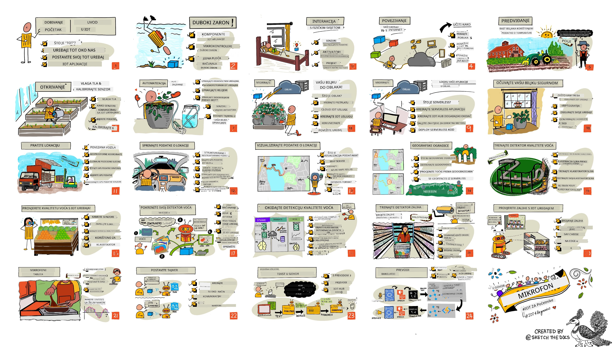

[](https://github.com/microsoft/IoT-For-Beginners/blob/master/LICENSE)
[](https://GitHub.com/microsoft/IoT-For-Beginners/graphs/contributors/)
[](https://GitHub.com/microsoft/IoT-For-Beginners/issues/)
[](https://GitHub.com/microsoft/IoT-For-Beginners/pulls/)
[](http://makeapullrequest.com)

[](https://GitHub.com/microsoft/IoT-For-Beginners/watchers/)
[](https://GitHub.com/microsoft/IoT-For-Beginners/network/)
[](https://GitHub.com/microsoft/IoT-For-Beginners/stargazers/)

### Pridružite se Azure AI Foundry zajednici

Ako zapnete ili imate pitanja o izradi AI aplikacija. Pridružite se kolegama koji uče i iskusnim programerima u raspravama o MCP-u. To je podržavajuća zajednica u kojoj su pitanja dobrodošla i znanje se slobodno dijeli.

[](https://discord.gg/nTYy5BXMWG)

Ako imate povratne informacije o proizvodu ili pogreške tijekom izrade posjetite:

[](https://aka.ms/foundry/forum)

Slijedite ove korake za početak rada s ovim resursima:
1. **Forkajte spremište**: Kliknite [](https://GitHub.com/microsoft/IoT-For-Beginners/fork)
2. **Klonirajte spremište**:   `git clone https://github.com/microsoft/IoT-For-Beginners.git`
3. [**Pridružite se Microsot Foundry Discordu i upoznajte stručnjake i kolege programere**](https://discord.com/invite/ByRwuEEgH4)


### 🌐 Višejezična podrška

#### Podržano putem GitHub Action (automatizirano i uvijek ažurno)

<!-- CO-OP TRANSLATOR LANGUAGES TABLE START -->
[Arabic](../ar/README.md) | [Bengali](../bn/README.md) | [Bulgarian](../bg/README.md) | [Burmese (Myanmar)](../my/README.md) | [Chinese (Simplified)](../zh-CN/README.md) | [Chinese (Traditional, Hong Kong)](../zh-HK/README.md) | [Chinese (Traditional, Macau)](../zh-MO/README.md) | [Chinese (Traditional, Taiwan)](../zh-TW/README.md) | [Croatian](./README.md) | [Czech](../cs/README.md) | [Danish](../da/README.md) | [Dutch](../nl/README.md) | [Estonian](../et/README.md) | [Finnish](../fi/README.md) | [French](../fr/README.md) | [German](../de/README.md) | [Greek](../el/README.md) | [Hebrew](../he/README.md) | [Hindi](../hi/README.md) | [Hungarian](../hu/README.md) | [Indonesian](../id/README.md) | [Italian](../it/README.md) | [Japanese](../ja/README.md) | [Kannada](../kn/README.md) | [Khmer](../km/README.md) | [Korean](../ko/README.md) | [Lithuanian](../lt/README.md) | [Malay](../ms/README.md) | [Malayalam](../ml/README.md) | [Marathi](../mr/README.md) | [Nepali](../ne/README.md) | [Nigerian Pidgin](../pcm/README.md) | [Norwegian](../no/README.md) | [Persian (Farsi)](../fa/README.md) | [Polish](../pl/README.md) | [Portuguese (Brazil)](../pt-BR/README.md) | [Portuguese (Portugal)](../pt-PT/README.md) | [Punjabi (Gurmukhi)](../pa/README.md) | [Romanian](../ro/README.md) | [Russian](../ru/README.md) | [Serbian (Cyrillic)](../sr/README.md) | [Slovak](../sk/README.md) | [Slovenian](../sl/README.md) | [Spanish](../es/README.md) | [Swahili](../sw/README.md) | [Swedish](../sv/README.md) | [Tagalog (Filipino)](../tl/README.md) | [Tamil](../ta/README.md) | [Telugu](../te/README.md) | [Thai](../th/README.md) | [Turkish](../tr/README.md) | [Ukrainian](../uk/README.md) | [Urdu](../ur/README.md) | [Vietnamese](../vi/README.md)

> **Radije klonirati lokalno?**
>
> Ovo spremište uključuje 50+ prijevoda jezika što značajno povećava veličinu preuzimanja. Za kloniranje bez prijevoda koristite sparse checkout:
>
> **Bash / macOS / Linux:**
> ```bash
> git clone --filter=blob:none --sparse https://github.com/microsoft/IoT-For-Beginners.git
> cd IoT-For-Beginners
> git sparse-checkout set --no-cone '/*' '!translations' '!translated_images'
> ```
>
> **CMD (Windows):**
> ```cmd
> git clone --filter=blob:none --sparse https://github.com/microsoft/IoT-For-Beginners.git
> cd IoT-For-Beginners
> git sparse-checkout set --no-cone "/*" "!translations" "!translated_images"
> ```
>
> Ovo vam daje sve što trebate da dovršite tečaj uz mnogo brže preuzimanje.
<!-- CO-OP TRANSLATOR LANGUAGES TABLE END -->

# IoT za početnike - Kurikulum

Azure Cloud Advocati u Microsoftu sa zadovoljstvom nude 12-tjedni, 24-lezijski kurikulum koji pokriva osnove IoT-a. Svaka lekcija uključuje kvizove prije i nakon lekcije, pisane upute za dovršetak lekcije, rješenje, zadatak i još mnogo toga. Naša pedagoška metoda zasnovana na projektima omogućuje učenje kroz izgradnju, što je dokazani način da se nove vještine bolje usvoje.

Projekti pokrivaju put hrane od farme do stola. To uključuje poljoprivredu, logistiku, proizvodnju, maloprodaju i potrošače - područja industrije u kojima su IoT uređaji posebno popularni.



> Sketchnote autorice [Nitya Narasimhan](https://github.com/nitya). Kliknite na sliku za veću verziju.

**Velika hvala našim autorima [Jen Fox](https://github.com/jenfoxbot), [Jen Looper](https://github.com/jlooper), [Jim Bennett](https://github.com/jimbobbennett), i našem umjetniku sketchnotea [Nitya Narasimhan](https://github.com/nitya).**

**Također hvala našem timu [Microsoft Learn Student Ambassadors](https://studentambassadors.microsoft.com?WT.mc_id=academic-17441-jabenn) koji su pregledavali i prevodili ovaj kurikulum - [Aditya Garg](https://github.com/AdityaGarg00), [Anurag Sharma](https://github.com/Anurag-0-1-A), [Arpita Das](https://github.com/Arpiiitaaa), [Aryan Jain](https://www.linkedin.com/in/aryan-jain-47a4a1145/), [Bhavesh Suneja](https://github.com/EliteWarrior315), [Faith Hunja](https://faithhunja.github.io/), [Lateefah Bello](https://www.linkedin.com/in/lateefah-bello/), [Manvi Jha](https://github.com/Severus-Matthew), [Mireille Tan](https://www.linkedin.com/in/mireille-tan-a4834819a/), [Mohammad Iftekher (Iftu) Ebne Jalal](https://github.com/Iftu119), [Mohammad Zulfikar](https://github.com/mohzulfikar), [Priyanshu Srivastav](https://www.linkedin.com/in/priyanshu-srivastav-b067241ba), [Thanmai Gowducheruvu](https://github.com/innovation-platform), i [Zina Kamel](https://www.linkedin.com/in/zina-kamel/).**

Upoznajte tim!

[](https://youtu.be/-wippUJRi5k)

**Gif autor** [Mohit Jaisal](https://linkedin.com/in/mohitjaisal)

> 🎥 Kliknite gornju sliku za video o projektu!

> **Nastavnici**, uveli smo [neke prijedloge](for-teachers.md) o tome kako koristiti ovaj kurikulum. Ako želite kreirati vlastite lekcije, uključili smo i [predložak lekcije](lesson-template/README.md).

> **Studenti** ([https://aka.ms/student-page](https://aka.ms/student-page)), da biste koristili ovaj kurikulum samostalno, forkajte cijeli repozitorij i sami riješite zadatke, počevši s kvizom prije predavanja, zatim pročitajte predavanje i dovršite ostale aktivnosti. Pokušajte kreirati projekte razumijevanjem lekcija, a ne kopiranjem koda rješenja; međutim, taj je kod dostupan u mapama /solutions u svakoj lekciji usmjerenoj na projekte. Druga ideja je da formirate studijsku grupu s prijateljima i zajedno prođete kroz sadržaj. Za dodatno učenje preporučujemo [Microsoft Learn](https://docs.microsoft.com/users/jimbobbennett/collections/ke2ehd351jopwr?WT.mc_id=academic-17441-jabenn).

Za video pregled ovog tečaja pogledajte ovaj video:

[](https://youtube.com/watch?v=bccEMm8gRuc "Promo video")

> 🎥 Kliknite gornju sliku za video o projektu!

## Pedagogija

Pri izradi ovog kurikuluma izabrali smo dva pedagoška načela: osigurati da je zasnovan na projektima i da uključuje česte kvizove. Na kraju ovog niza, studenti će izgraditi sustav za nadzor i zalijevanje biljaka, uređaj za praćenje vozila, pametnu tvornicu za praćenje i provjeru hrane te glasovno upravljani timer za kuhanje, te će naučiti osnove Interneta stvari uključujući pisanje koda za uređaje, povezivanje s oblakom, analizu telemetrije i izvođenje AI-a na rubu mreže.

Usklađivanjem sadržaja s projektima, proces je za studente zanimljiviji i bolja je zadrživost stečenih pojmova.

Također, kviz niskog rizika prije nastave usmjerava namjeru učenika na učenje teme, dok drugi kviz nakon nastave osigurava dodatnu zadrživost. Ovaj kurikulum je osmišljen da bude fleksibilan i zabavan i može se pratiti u cijelosti ili djelomično. Projekti počinju jednostavni i postaju složeniji do kraja 12-tjednog ciklusa.

Svaki projekt zasniva se na stvarnom hardveru dostupnom studentima i hobistima. Svaki projekt proučava specifičnu domenu projekta, pružajući relevantno osnovno znanje. Da biste bili uspješan programer, pomaže razumjeti domenu u kojoj rješavate probleme, a pružanje tog osnovnog znanja omogućuje studentima da razmišljaju o svojim IoT rješenjima i učenjima u kontekstu stvarnog problema koji bi od njih mogao biti zatražen kao IoT programera. Studenti uče 'zašto' rješenja koja grade i stječu uvid u krajnjeg korisnika.

## Hardver
Imamo dva izbora IoT hardvera za korištenje u projektima, ovisno o osobnim preferencijama, znanju programskog jezika, ciljevima učenja i dostupnosti. Također smo osigurali verziju 'virtualnog hardvera' za one koji nemaju pristup hardveru ili žele naučiti više prije nego što se odluče za kupnju. Više možete pročitati i pronaći 'popis za kupovinu' na [stranici hardvera](./hardware.md), uključujući poveznice za kupnju kompleta od naših prijatelja iz Seeed Studija.

> 💁 Pronađite naš [Kodeks ponašanja](CODE_OF_CONDUCT.md), smjernice za [doprinose](CONTRIBUTING.md) i [prijevode](..). Dobrodošli su vaši konstruktivni komentari!
>
> 🔧 Imate problema? Pogledajte naš [Vodič za rješavanje problema](TROUBLESHOOTING.md) za rješenja najčešćih problema.

## Svaka lekcija uključuje:

- sketchnote
- neobavezni dodatni video
- zagrijavanje prije lekcije (kviz)
- pisanu lekciju
- za lekcije bazirane na projektima, vodiče korak po korak o izradi projekta
- provjere znanja
- izazov
- dopunsku literaturu
- zadatak
- [kviz nakon lekcije](https://ff-quizzes.netlify.app/en/)

> **Napomena o kvizovima**: Svi kvizovi nalaze se u mapi quiz-app, ukupno 48 kvizova s po tri pitanja. Povezani su iz lekcija, no kviz aplikacija može se pokretati lokalno ili implementirati na Azure; slijedite upute u mapi `quiz-app`. Postupno se lokaliziraju.

## Lekcije

|       |              Naziv projekta              |                       Koncepti koji se podučavaju                       | Ciljevi učenja                                                                                                                                                 |                                                        Povezana lekcija                                                         |
| :---: | :------------------------------------: | :---------------------------------------------------------: | ------------------------------------------------------------------------------------------------------------------------------------------------------------------- | :--------------------------------------------------------------------------------------------------------------------------: |
|  01   | [Početak](./1-getting-started/README.md) |                     Uvod u IoT                     | Naučite osnovna načela IoT-a i osnovne gradivne blokove IoT rješenja kao što su senzori i usluge u oblaku dok postavljate svoj prvi IoT uređaj |                      [Uvod u IoT](./1-getting-started/lessons/1-introduction-to-iot/README.md)                      |
|  02   | [Početak](./1-getting-started/README.md) |                   Dublji uvid u IoT                    | Saznajte više o komponentama IoT sustava, kao i o mikrokontrolerima i jednokatnim računalima                                                            |                        [Dublji uvid u IoT](./1-getting-started/lessons/2-deeper-dive/README.md)                         |
|  03   | [Početak](./1-getting-started/README.md) | Interakcija s fizičkim svijetom putem senzora i aktuatora | Učite o senzorima za prikupljanje podataka iz stvarnog svijeta i aktuatorima za slanje povratnih informacija dok pravite noćno svjetlo                                           | [Interakcija s fizičkim svijetom putem senzora i aktuatora](./1-getting-started/lessons/3-sensors-and-actuators/README.md) |
|  04   | [Početak](./1-getting-started/README.md) |             Povežite svoj uređaj s internetom             | Naučite kako povezati IoT uređaj s internetom za slanje i primanje poruka povezivanjem vašeg noćnog svjetla na MQTT poslužitelj                               |               [Povežite svoj uređaj s internetom](./1-getting-started/lessons/4-connect-internet/README.md)                |
|  05   |            [Poljoprivreda](./2-farm/README.md)            |                    Predviđanje rasta biljaka                     | Naučite kako predvidjeti rast biljaka koristeći podatke o temperaturi prikupljene IoT uređajem                                                                                  |                          [Predviđanje rasta biljaka](./2-farm/lessons/1-predict-plant-growth/README.md)                           |
|  06   |            [Poljoprivreda](./2-farm/README.md)            |                    Detekcija vlage tla                     | Naučite kako detektirati vlagu tla i kalibrirati senzor vlage tla                                                                                              |                          [Detekcija vlage tla](./2-farm/lessons/2-detect-soil-moisture/README.md)                           |
|  07   |            [Poljoprivreda](./2-farm/README.md)            |                  Automatsko zalijevanje biljaka                   | Naučite kako automatizirati i vremenski uskladiti zalijevanje pomoću releja i MQTT                                                                                                      |                      [Automatsko zalijevanje biljaka](./2-farm/lessons/3-automated-plant-watering/README.md)                       |
|  08   |            [Poljoprivreda](./2-farm/README.md)            |               Migrirajte svoju biljku u oblak               | Naučite o oblaku i IoT uslugama hostanim u oblaku i kako povezati svoju biljku s jednom od njih umjesto javnog MQTT poslužitelja                                   |               [Migrirajte svoju biljku u oblak](./2-farm/lessons/4-migrate-your-plant-to-the-cloud/README.md)                |
|  09   |            [Poljoprivreda](./2-farm/README.md)            |         Migrirajte svoju logiku aplikacije u oblak         | Naučite kako možete pisati logiku aplikacije u oblaku koja reagira na IoT poruke                                                                          |         [Migrirajte svoju logiku aplikacije u oblak](./2-farm/lessons/5-migrate-application-to-the-cloud/README.md)         |
|  10   |            [Poljoprivreda](./2-farm/README.md)            |                   Čuvajte svoju biljku sigurnom                    | Naučite o sigurnosti u IoT-u i kako održati sigurnost svoje biljke pomoću ključeva i certifikata                                                                          |                        [Čuvajte svoju biljku sigurnom](./2-farm/lessons/6-keep-your-plant-secure/README.md)                         |
|  11   |       [Transport](./3-transport/README.md)       |                      Praćenje lokacije                      | Naučite o GPS praćenju lokacije za IoT uređaje                                                                                                                   |                           [Praćenje lokacije](./3-transport/lessons/1-location-tracking/README.md)                           |
|  12   |       [Transport](./3-transport/README.md)       |                     Pohrana podataka o lokaciji                     | Naučite kako pohraniti IoT podatke za kasniju vizualizaciju ili analizu                                                                                                      |                         [Pohrana podataka o lokaciji](./3-transport/lessons/2-store-location-data/README.md)                         |
|  13   |       [Transport](./3-transport/README.md)       |                   Vizualizacija podataka o lokaciji                   | Naučite o vizualizaciji podataka o lokaciji na karti i kako karte prikazuju stvarni 3D svijet u 2 dimenzije                                                            |                     [Vizualizacija podataka o lokaciji](./3-transport/lessons/3-visualize-location-data/README.md)                     |
|  14   |       [Transport](./3-transport/README.md)       |                          Geofence                           | Naučite o geofence-ovima i kako se mogu koristiti za upozorenja kada su vozila u lancu opskrbe blizu svojim odredištima                                           |                                   [Geofence](./3-transport/lessons/4-geofences/README.md)                                   |
|  15   |   [Proizvodnja](./4-manufacturing/README.md)   |               Obuka detektora kvalitete voća                | Naučite o obuci klasifikatora slika u oblaku za detekciju kvalitete voća                                                                                       |                 [Obuka detektora kvalitete voća](./4-manufacturing/lessons/1-train-fruit-detector/README.md)                 |
|  16   |   [Proizvodnja](./4-manufacturing/README.md)   |           Provjera kvalitete voća s IoT uređaja            | Naučite o korištenju detektora kvalitete voća na IoT uređaju                                                                                                    |           [Provjera kvalitete voća s IoT uređaja](./4-manufacturing/lessons/2-check-fruit-from-device/README.md)            |
|  17   |   [Proizvodnja](./4-manufacturing/README.md)   |             Pokretanje detektora voća na rubu             | Naučite o pokretanju detektora voća na IoT uređaju na rubu                                                                                                |             [Pokretanje detektora voća na rubu](./4-manufacturing/lessons/3-run-fruit-detector-edge/README.md)             |
|  18   |   [Proizvodnja](./4-manufacturing/README.md)   |        Aktiviranje detekcije kvalitete voća sa senzora        | Naučite o aktiviranju detekcije kvalitete voća sa senzora                                                                                                        |        [Aktiviranje detekcije kvalitete voća sa senzora](./4-manufacturing/lessons/4-trigger-fruit-detector/README.md)         |
|  19   |          [Maloprodaja](./5-retail/README.md)          |                   Obuka detektora zaliha                    | Naučite kako koristiti detekciju objekata za obuku detektora zaliha za brojanje zaliha u trgovini                                                                                |                        [Obuka detektora zaliha](./5-retail/lessons/1-train-stock-detector/README.md)                         |
|  20   |          [Maloprodaja](./5-retail/README.md)          |               Provjera zaliha s IoT uređaja                | Naučite kako provjeravati zalihe s IoT uređajem koristeći model detekcije objekata                                                                                         |                     [Provjera zaliha s IoT uređaja](./5-retail/lessons/2-check-stock-device/README.md)                      |
|  21   |        [Konzumer](./6-consumer/README.md)        |             Prepoznavanje govora s IoT uređaja             | Naučite kako prepoznavati govor s IoT uređaja kako biste napravili pametni tajmer                                                                                             |                  [Prepoznavanje govora s IoT uređaja](./6-consumer/lessons/1-speech-recognition/README.md)                  |
|  22   |        [Konzumer](./6-consumer/README.md)        |                     Razumijevanje jezika                     | Naučite kako razumjeti rečenice izgovorene IoT uređaju                                                                                                           |                        [Razumijevanje jezika](./6-consumer/lessons/2-language-understanding/README.md)                        |
|  23   |        [Konzumer](./6-consumer/README.md)        |           Postavite tajmer i pružite glasovnu povratnu informaciju           | Naučite kako postaviti tajmer na IoT uređaju i dati glasovnu povratnu informaciju kada je tajmer postavljen i kada završi                                                    |                 [Postavite tajmer i pružite glasovnu povratnu informaciju](./6-consumer/lessons/3-spoken-feedback/README.md)                  |
|  24   |        [Konzumer](./6-consumer/README.md)        |                 Podrška za više jezika                  | Naučite kako podržati više jezika, i u govoru i u odgovorima od vašeg pametnog tajmera                                                               |                   [Podrška za više jezika](./6-consumer/lessons/4-multiple-language-support/README.md)                   |

## Offline pristup

Možete koristiti ovu dokumentaciju izvan mreže pomoću [Docsify](https://docsify.js.org/#/). Forkajte ovaj repozitorij, [instalirajte Docsify](https://docsify.js.org/#/quickstart) na svoje lokalno računalo, a zatim u glavnoj mapi ovog repozitorija upišite `docsify serve`. Web stranica će biti dostupna na portu 3000 na vašem localhostu: `localhost:3000`.

## Kviz

Hvala zajednici što je omogućila interaktivni kviz koji testira vaše znanje o svakom poglavlju. Testirajte svoje znanje [ovdje](https://ff-quizzes.netlify.app/en/)

### PDF

Ako je potrebno, možete generirati PDF ovog sadržaja za offline pristup. Za to, provjerite imate li [installiran npm](https://docs.npmjs.com/downloading-and-installing-node-js-and-npm) i pokrenite sljedeće naredbe u glavnoj mapi ovog repozitorija:

```sh
npm i
npm run convert
```

### Slajdovi

Postoje prezentacije za neke lekcije u mapi [slides](../../slides).


## Ostali kurikulumi

Naš tim proizvodi i druge kurikulume! Pogledajte:

<!-- CO-OP TRANSLATOR OTHER COURSES START -->
### LangChain
[](https://aka.ms/langchain4j-for-beginners)
[](https://aka.ms/langchainjs-for-beginners?WT.mc_id=m365-94501-dwahlin)
[](https://github.com/microsoft/langchain-for-beginners?WT.mc_id=m365-94501-dwahlin)
---

### Azure / Edge / MCP / Agents
[](https://github.com/microsoft/AZD-for-beginners?WT.mc_id=academic-105485-koreyst)
[](https://github.com/microsoft/edgeai-for-beginners?WT.mc_id=academic-105485-koreyst)
[](https://github.com/microsoft/mcp-for-beginners?WT.mc_id=academic-105485-koreyst)
[](https://github.com/microsoft/ai-agents-for-beginners?WT.mc_id=academic-105485-koreyst)

---
 
### Serija Generativnog AI
[](https://github.com/microsoft/generative-ai-for-beginners?WT.mc_id=academic-105485-koreyst)
[-9333EA?style=for-the-badge&labelColor=E5E7EB&color=9333EA)](https://github.com/microsoft/Generative-AI-for-beginners-dotnet?WT.mc_id=academic-105485-koreyst)
[-C084FC?style=for-the-badge&labelColor=E5E7EB&color=C084FC)](https://github.com/microsoft/generative-ai-for-beginners-java?WT.mc_id=academic-105485-koreyst)
[-E879F9?style=for-the-badge&labelColor=E5E7EB&color=E879F9)](https://github.com/microsoft/generative-ai-with-javascript?WT.mc_id=academic-105485-koreyst)

---
 
### Temeljno učenje
[](https://aka.ms/ml-beginners?WT.mc_id=academic-105485-koreyst)
[](https://aka.ms/datascience-beginners?WT.mc_id=academic-105485-koreyst)
[](https://aka.ms/ai-beginners?WT.mc_id=academic-105485-koreyst)
[](https://github.com/microsoft/Security-101?WT.mc_id=academic-96948-sayoung)
[](https://aka.ms/webdev-beginners?WT.mc_id=academic-105485-koreyst)
[](https://aka.ms/iot-beginners?WT.mc_id=academic-105485-koreyst)
[](https://github.com/microsoft/xr-development-for-beginners?WT.mc_id=academic-105485-koreyst)

---
 
### Serija Copilota
[](https://aka.ms/GitHubCopilotAI?WT.mc_id=academic-105485-koreyst)
[](https://github.com/microsoft/mastering-github-copilot-for-dotnet-csharp-developers?WT.mc_id=academic-105485-koreyst)
[](https://github.com/microsoft/CopilotAdventures?WT.mc_id=academic-105485-koreyst)
<!-- CO-OP TRANSLATOR OTHER COURSES END -->

## Priznanja za slike

Sve priznanju za slike korištene u ovom kurikulumu gdje je potrebno možete pronaći u [Priznanjima](./attributions.md).

---

<!-- CO-OP TRANSLATOR DISCLAIMER START -->
**Odricanje**:  
Ovaj dokument preveden je korištenjem AI usluge za prevođenje [Co-op Translator](https://github.com/Azure/co-op-translator). Iako težimo točnosti, imajte na umu da automatski prijevodi mogu sadržavati pogreške ili netočnosti. Izvorni dokument na izvornom jeziku treba smatrati autoritativnim izvorom. Za kritične informacije preporuča se profesionalni ljudski prijevod. Ne snosimo odgovornost za bilo kakva nesporazuma ili pogrešna tumačenja nastala uporabom ovog prijevoda.
<!-- CO-OP TRANSLATOR DISCLAIMER END -->