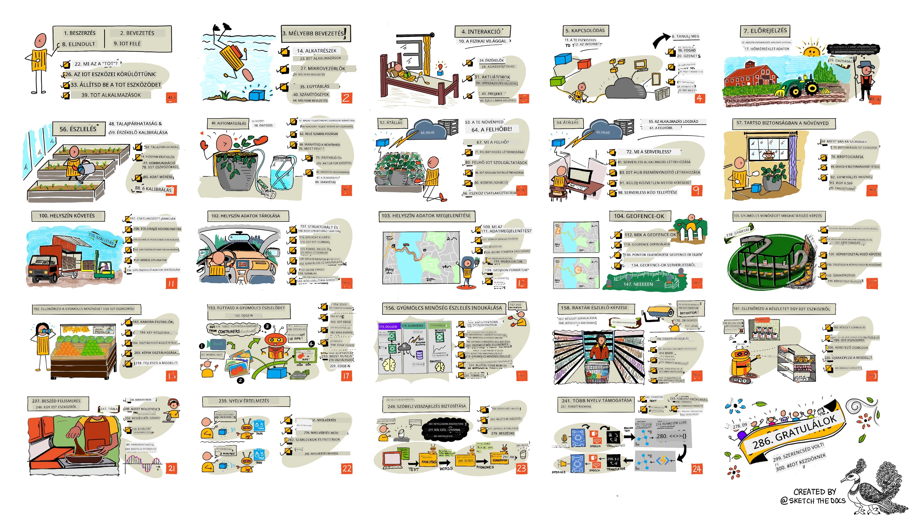

<!--
CO_OP_TRANSLATOR_METADATA:
{
  "original_hash": "6c354ec3487e4f6cfafbe44557996cd9",
  "translation_date": "2026-01-06T15:37:58+00:00",
  "source_file": "README.md",
  "language_code": "hu"
}
-->
[](https://github.com/microsoft/IoT-For-Beginners/blob/master/LICENSE)
[](https://GitHub.com/microsoft/IoT-For-Beginners/graphs/contributors/)
[](https://GitHub.com/microsoft/IoT-For-Beginners/issues/)
[](https://GitHub.com/microsoft/IoT-For-Beginners/pulls/)
[](http://makeapullrequest.com)

[](https://GitHub.com/microsoft/IoT-For-Beginners/watchers/)
[](https://GitHub.com/microsoft/IoT-For-Beginners/network/)
[](https://GitHub.com/microsoft/IoT-For-Beginners/stargazers/)

### Csatlakozz az Azure AI Foundry Közösséghez

Ha elakadsz vagy bármilyen kérdésed van az AI alkalmazások építésével kapcsolatban, csatlakozz a többi tanulóhoz és tapasztalt fejlesztőkhöz az MCP-körüli beszélgetésekben. Ez egy támogató közösség, ahol a kérdések szívesen látottak és a tudás szabadon megosztott.

[](https://discord.gg/nTYy5BXMWG)

Ha termék-visszajelzésed vagy építés közben hibákba ütközöl, látogass el ide:

[](https://aka.ms/foundry/forum)

Kövesd ezeket a lépéseket, hogy elkezdhesd használni ezeket az erőforrásokat:
1. **Felosztás (Fork)**: Kattints ide [](https://GitHub.com/microsoft/IoT-For-Beginners/fork)
2. **Klónozd a tárolót**:   `git clone https://github.com/microsoft/IoT-For-Beginners.git`
3. [**Csatlakozz a Microsoft Foundry Discordhoz, és ismerd meg a szakértőket és más fejlesztőket**](https://discord.com/invite/ByRwuEEgH4)


### 🌐 Többnyelvű támogatás

#### GitHub Action segítségével támogatott (Automatikus és mindig naprakész)

<!-- CO-OP TRANSLATOR LANGUAGES TABLE START -->
[Arabic](../ar/README.md) | [Bengali](../bn/README.md) | [Bulgarian](../bg/README.md) | [Burmese (Myanmar)](../my/README.md) | [Chinese (Simplified)](../zh/README.md) | [Chinese (Traditional, Hong Kong)](../hk/README.md) | [Chinese (Traditional, Macau)](../mo/README.md) | [Chinese (Traditional, Taiwan)](../tw/README.md) | [Croatian](../hr/README.md) | [Czech](../cs/README.md) | [Danish](../da/README.md) | [Dutch](../nl/README.md) | [Estonian](../et/README.md) | [Finnish](../fi/README.md) | [French](../fr/README.md) | [German](../de/README.md) | [Greek](../el/README.md) | [Hebrew](../he/README.md) | [Hindi](../hi/README.md) | [Hungarian](./README.md) | [Indonesian](../id/README.md) | [Italian](../it/README.md) | [Japanese](../ja/README.md) | [Kannada](../kn/README.md) | [Korean](../ko/README.md) | [Lithuanian](../lt/README.md) | [Malay](../ms/README.md) | [Malayalam](../ml/README.md) | [Marathi](../mr/README.md) | [Nepali](../ne/README.md) | [Nigerian Pidgin](../pcm/README.md) | [Norwegian](../no/README.md) | [Persian (Farsi)](../fa/README.md) | [Polish](../pl/README.md) | [Portuguese (Brazil)](../br/README.md) | [Portuguese (Portugal)](../pt/README.md) | [Punjabi (Gurmukhi)](../pa/README.md) | [Romanian](../ro/README.md) | [Russian](../ru/README.md) | [Serbian (Cyrillic)](../sr/README.md) | [Slovak](../sk/README.md) | [Slovenian](../sl/README.md) | [Spanish](../es/README.md) | [Swahili](../sw/README.md) | [Swedish](../sv/README.md) | [Tagalog (Filipino)](../tl/README.md) | [Tamil](../ta/README.md) | [Telugu](../te/README.md) | [Thai](../th/README.md) | [Turkish](../tr/README.md) | [Ukrainian](../uk/README.md) | [Urdu](../ur/README.md) | [Vietnamese](../vi/README.md)

> **Szeretnéd helyileg klónozni?**

> Ez a tároló több mint 50 nyelvű fordítást tartalmaz, ami jelentősen megnöveli a letöltési méretet. Ha fordítások nélkül akarod klónozni, használj rovásos kiválasztást:
> ```bash
> git clone --filter=blob:none --sparse https://github.com/microsoft/IoT-For-Beginners.git
> cd IoT-For-Beginners
> git sparse-checkout set --no-cone '/*' '!translations' '!translated_images'
> ```
> Ez megad neked mindent, amire szükséged van a kurzus elvégzéséhez és sokkal gyorsabb a letöltés.
<!-- CO-OP TRANSLATOR LANGUAGES TABLE END -->

# IoT kezdőknek - Egy tanterv

A Microsoft Azure Felhőszószólói örömmel kínálnak egy 12 hetes, 24 leckéből álló tananyagot, amely az IoT alapjairól szól. Minden lecke pre- és utóteszteket, írott instrukciókat a lecke elvégzéséhez, megoldást, feladatot és még sok mást tartalmaz. Projektalapú pedagógiánk lehetővé teszi, hogy építkezve tanulj, ami bevált módszer az új készségek elsajátítására.

A projektek az élelmiszer utazását fedik le a farmtól az asztalig. Ez magában foglalja a mezőgazdaságot, logisztikát, gyártást, kiskereskedelmet és fogyasztót – mind népszerű iparágak az IoT-eszközök számára.



> Rajzjegyzet: [Nitya Narasimhan](https://github.com/nitya). Kattints a képre a nagyobb verzióért.

**Szívből köszönjük szerzőinknek [Jen Fox](https://github.com/jenfoxbot), [Jen Looper](https://github.com/jlooper), [Jim Bennett](https://github.com/jimbobbennett) és a rajzjegyzet művészünknek [Nitya Narasimhan](https://github.com/nitya).**

**Köszönjük továbbá a [Microsoft Learn diák nagykövetek](https://studentambassadors.microsoft.com?WT.mc_id=academic-17441-jabenn) csapatának, akik felülvizsgálták és lefordították ezt a tananyagot - [Aditya Garg](https://github.com/AdityaGarg00), [Anurag Sharma](https://github.com/Anurag-0-1-A), [Arpita Das](https://github.com/Arpiiitaaa), [Aryan Jain](https://www.linkedin.com/in/aryan-jain-47a4a1145/), [Bhavesh Suneja](https://github.com/EliteWarrior315), [Faith Hunja](https://faithhunja.github.io/), [Lateefah Bello](https://www.linkedin.com/in/lateefah-bello/), [Manvi Jha](https://github.com/Severus-Matthew), [Mireille Tan](https://www.linkedin.com/in/mireille-tan-a4834819a/), [Mohammad Iftekher (Iftu) Ebne Jalal](https://github.com/Iftu119), [Mohammad Zulfikar](https://github.com/mohzulfikar), [Priyanshu Srivastav](https://www.linkedin.com/in/priyanshu-srivastav-b067241ba), [Thanmai Gowducheruvu](https://github.com/innovation-platform), és [Zina Kamel](https://www.linkedin.com/in/zina-kamel/).**

Ismerd meg a csapatot!

[](https://youtu.be/-wippUJRi5k)

**Gif készítője:** [Mohit Jaisal](https://linkedin.com/in/mohitjaisal)

> 🎥 Kattints a fenti képre a projektről készült videóért!

> **Tanítók**, [tartalmazunk néhány javaslatot](for-teachers.md) arra, hogyan használják ezt a tananyagot. Ha saját leckéket szeretnétek létrehozni, mellékeltünk egy [leckesablont](lesson-template/README.md).

> **[Diákok](https://aka.ms/student-page)**, ha önállóan szeretnétek használni ezt a tananyagot, forkold le az egész tárolót, és önállóan végezd el a feladatokat, kezdve a pre-előadási kvízzel, majd olvasd el az előadást, és végezd el a többi tevékenységet. Próbáljátok megérteni a leckéket, és ne csak másoljátok a megoldások kódját; a kód elérhető a /solutions mappákban minden projektre orientált leckében. Egy másik ötlet lehet egy tanulócsoportot létrehozni barátokkal és közösen átbeszélni a tartalmat. További tanuláshoz ajánljuk a [Microsoft Learn](https://docs.microsoft.com/users/jimbobbennett/collections/ke2ehd351jopwr?WT.mc_id=academic-17441-jabenn) oldalt.

A kurzusról készült videós áttekintést itt találod:

[](https://youtube.com/watch?v=bccEMm8gRuc "Promóciós videó")

> 🎥 Kattints a fenti képre a projektről készült videóért!

## Pedagógia

Két pedagógiai alaptételt választottunk a tananyag megalkotásakor: projektalapúságot és gyakori kvízeket. A sorozat végére a hallgatók építenek egy növényfigyelő és öntözőrendszert, egy járműkövetőt, egy okos gyártósori rendszert az élelmiszer nyomon követésére és ellenőrzésére, valamint egy hangvezérelt konyhai időzítőt, és megtanulják az Internet of Things alapjait, beleértve az eszközkód írását, a felhőhöz való csatlakozást, telemetria elemzést és mesterséges intelligencia futtatást a végponton.

Azáltal, hogy a tartalom összhangban van a projektekkel, a folyamat érdekesebb lesz a diákok számára, és a fogalmak megtartása is javul.

Ezen felül egy alacsony tétű kvíz az óra előtt megszabja a tanuló szándékát egy téma megtanulására, míg az óra utáni kvíz további megtartást biztosít. Ez a tananyag rugalmas és szórakoztató, teljesen vagy részben is elvégezhető. A projektek kicsiben indulnak és a 12 hét végére fokozatosan egyre összetettebbek lesznek.

Minden projekt a tanulók és hobbi fejlesztők számára elérhető valós hardver köré épül. Minden projekt a saját területét vizsgálja, releváns háttértudást nyújtva. Egy sikeres fejlesztőnek segít megérteni azt a területet, amelyen problémákat old meg, így ez a háttértudás segíti, hogy a diákok elgondolkodjanak IoT megoldásaikon és tanulmányaikon a valódi világban előforduló problémák kontextusában, amelyeket egy IoT fejlesztőtől elvárhatnak. A diákok megértik az általuk épített megoldások „miért”-jét és megismerik a végfelhasználót.

## Hardver

Két IoT hardver választék áll rendelkezésre a projektekhez, személyes preferencia, programozási ismeretek vagy egyéb szempontok alapján. Külön virtuális hardver verziót is biztosítunk azoknak, akik nem férnek hozzá fizikai eszközhöz, vagy többet szeretnének tanulni, mielőtt vásárolnának. További információkat és egy 'bevásárló listát' találsz a [hardver oldalon](./hardware.md), beleértve linkeket komplett csomagok megvásárlásához barátainktól a Seeed Studiotól.
> 💁 Találd meg a [Magatartási kódexünket](CODE_OF_CONDUCT.md), a [Hozzájárulási](CONTRIBUTING.md) és a [Fordítási](TRANSLATIONS.md) irányelveinket. Várjuk építő jellegű észrevételeidet!
>
> 🔧 Probléma merült fel? Nézd meg a [Hibakeresési útmutatónkat](TROUBLESHOOTING.md) a gyakori problémák megoldásaiért.

## Minden leckében szerepel:

- sketchnote
- opcionális kiegészítő videó
- az óra előtti bemelegítő teszt
- írott lecke
- projektalapú leckékhez lépésről-lépésre útmutatók a projekt elkészítéséhez
- tudásellenőrzések
- egy kihívás
- kiegészítő olvasmány
- házi feladat
- [óra utáni teszt](https://ff-quizzes.netlify.app/en/)

> **Megjegyzés a tesztekről**: Minden teszt a quiz-app mappában található, összesen 48 teszt három kérdéssel. Ezek a leckékből vannak linkelve, de a quiz alkalmazás lokálisan is futtatható vagy Azure-ra telepíthető; kövesd az utasításokat a `quiz-app` mappában. Fokozatosan lokalizáljuk őket.

## Leckék

|       |               Projekt neve               |                          Tanult fogalmak                           | Tanulási célok                                                                                                                                                      |                                                        Kapcsolódó lecke                                                         |
| :---: | :------------------------------------: | :-----------------------------------------------------------------: | ------------------------------------------------------------------------------------------------------------------------------------------------------------------ | :--------------------------------------------------------------------------------------------------------------------------: |
|  01   | [Kezdés](./1-getting-started/README.md) |                  Bevezetés az IoT világába                         | Tanuld meg az IoT alapelveit és az IoT megoldások alapvető építőelemeit, például az érzékelőket és felhőszolgáltatásokat, miközben beállítod az első IoT eszközödet |                        [Bevezetés az IoT-be](./1-getting-started/lessons/1-introduction-to-iot/README.md)                      |
|  02   | [Kezdés](./1-getting-started/README.md) |                  Az IoT mélyebb megismerése                        | Tanulj többet az IoT rendszer összetevőiről, valamint a mikrovezérlőkről és egyetlen lapos számítógépekről                                                            |                          [IoT mélyebb megismerése](./1-getting-started/lessons/2-deeper-dive/README.md)                       |
|  03   | [Kezdés](./1-getting-started/README.md) |   Fizikai világ érzékelőkkel és mozgatókkal való interakciója     | Ismerd meg az érzékelőket, hogy adatokat gyűjts a fizikai világból, és az aktuátorokat visszacsatolás küldésére, miközben egy éjszakai lámpát építesz                 | [Fizikai világgal való interakció érzékelőkkel és aktuátorokkal](./1-getting-started/lessons/3-sensors-and-actuators/README.md) |
|  04   | [Kezdés](./1-getting-started/README.md) |                Csatlakoztasd az eszközöd az internethez            | Tanuld meg, hogyan csatlakoztass egy IoT eszközt az internethez, hogy üzeneteket küldj és fogadj az MQTT brokerhez való csatlakozással                               |                  [Csatlakoztasd az eszközöd az internethez](./1-getting-started/lessons/4-connect-internet/README.md)         |
|  05   |             [Farm](./2-farm/README.md)             |                    Növény növekedésének előrejelzése                | Tanuld meg, hogyan jósolható meg a növény növekedése IoT eszköz által rögzített hőmérsékleti adatok alapján                                                            |                          [Növény növekedésének előrejelzése](./2-farm/lessons/1-predict-plant-growth/README.md)              |
|  06   |             [Farm](./2-farm/README.md)             |                    Talajnedvesség érzékelése                      | Tanulj meg talajnedvességet érzékelni és egy talajnedvesség-érzékelőt kalibrálni                                                                                      |                          [Talajnedvesség érzékelése](./2-farm/lessons/2-detect-soil-moisture/README.md)                      |
|  07   |             [Farm](./2-farm/README.md)             |                  Növény automatikus öntözése                       | Ismerd meg, hogyan lehet automatizálni és időzíteni az öntözést egy relé és MQTT használatával                                                                       |                      [Növény automatikus öntözése](./2-farm/lessons/3-automated-plant-watering/README.md)                    |
|  08   |             [Farm](./2-farm/README.md)             |                  Növényed felhőbe migrálása                        | Tanulj a felhőről és a felhőalapú IoT szolgáltatásokról, valamint arról, hogyan csatlakoztathatod a növényedet ezekhez, egy hagyományos MQTT broker helyett          |                 [Növényed felhőbe migrálása](./2-farm/lessons/4-migrate-your-plant-to-the-cloud/README.md)                   |
|  09   |             [Farm](./2-farm/README.md)             |           Alkalmazáslogika áthelyezése a felhőbe                   | Tanuld meg, hogyan írj felhőben futó alkalmazáslogikát, amely az IoT üzenetekre reagál                                                                                |            [Alkalmazáslogika áthelyezése a felhőbe](./2-farm/lessons/5-migrate-application-to-the-cloud/README.md)          |
|  10   |             [Farm](./2-farm/README.md)             |                   Biztonság növényed számára                        | Tanulj az IoT biztonságról, hogyan tartsd növényed biztonságban kulcsokkal és tanúsítványokkal                                                                        |                        [Biztonság növényed számára](./2-farm/lessons/6-keep-your-plant-secure/README.md)                     |
|  11   |        [Szállítás](./3-transport/README.md)        |                        Helymeghatározás                            | Ismerd meg az IoT eszközök GPS helymeghatározását                                                                                                                   |                           [Helymeghatározás](./3-transport/lessons/1-location-tracking/README.md)                          |
|  12   |        [Szállítás](./3-transport/README.md)        |                       Helyadat tárolása                            | Tanuld meg, hogyan tárold az IoT adatait későbbi vizualizáláshoz vagy elemzéshez                                                                                      |                          [Helyadat tárolása](./3-transport/lessons/2-store-location-data/README.md)                          |
|  13   |        [Szállítás](./3-transport/README.md)        |                      Helyadatok vizualizálása                      | Ismerd meg a helyadatok térképen történő megjelenítését, és azt, hogyan ábrázolják a térképek a valódi 3D világot 2D-ben                                              |                       [Helyadatok vizualizálása](./3-transport/lessons/3-visualize-location-data/README.md)                 |
|  14   |        [Szállítás](./3-transport/README.md)        |                         Geokerítések                               | Ismerd meg a geokerítéseket, és hogyan használhatók ezek riasztásként, ha ellátási lánc járművei közelednek úticéljukhoz                                            |                                    [Geokerítések](./3-transport/lessons/4-geofences/README.md)                              |
|  15   |    [Gyártás](./4-manufacturing/README.md)          |             Gyümölcsminőség érzékelő betanítása                   | Tanuld meg, hogyan képezz felhőben egy képosztályozót a gyümölcsminőség felismerésére                                                                                 |                [Gyümölcsminőség érzékelő betanítása](./4-manufacturing/lessons/1-train-fruit-detector/README.md)             |
|  16   |    [Gyártás](./4-manufacturing/README.md)          |                Gyümölcsminőség ellenőrzése IoT eszközről            | Tanulj meg gyümölcsminőség-ellenőrzést végezni egy IoT eszköz segítségével                                                                                           |            [Gyümölcsminőség ellenőrzése IoT eszközről](./4-manufacturing/lessons/2-check-fruit-from-device/README.md)        |
|  17   |    [Gyártás](./4-manufacturing/README.md)          |               Futótom gyümölcsérzékelőd élőben                    | Ismerd meg, hogyan futtathatod a gyümölcsérzékelőt egy IoT eszközön helyben                                                                                         |                  [Gyümölcsérzékelő futtatása az élőben](./4-manufacturing/lessons/3-run-fruit-detector-edge/README.md)        |
|  18   |    [Gyártás](./4-manufacturing/README.md)          |             Gyümölcsminőség érzékelés érzékelő triggerből         | Ismerd meg, hogyan indítható el a gyümölcsminőség érzékelés egy érzékelő által                                                                                       |                [Gyümölcsminőség érzékelés triggerelése érzékelőről](./4-manufacturing/lessons/4-trigger-fruit-detector/README.md) |
|  19   |           [Kiskereskedelem](./5-retail/README.md)           |                  Áruészlelő betanítása                             | Tanuld meg az objektumfelismerés használatát áruészlelő betanítására a bolt készletének számolásához                                                                 |                         [Áruészlelő betanítása](./5-retail/lessons/1-train-stock-detector/README.md)                         |
|  20   |           [Kiskereskedelem](./5-retail/README.md)           |               Árukészlet ellenőrzése IoT eszközről                 | Ismerd meg, hogyan ellenőrizheted az árukészletet IoT eszközről egy tárgyfelismerő modell segítségével                                                               |                      [Árukészlet ellenőrzése IoT eszközről](./5-retail/lessons/2-check-stock-device/README.md)               |
|  21   |       [Fogyasztói](./6-consumer/README.md)       |             Beszédfelismerés IoT eszközzel                         | Tanuld meg, hogyan ismerd fel a beszédet IoT eszközön egy okos időzítő építéséhez                                                                                     |                   [Beszédfelismerés IoT eszközzel](./6-consumer/lessons/1-speech-recognition/README.md)                      |
|  22   |       [Fogyasztói](./6-consumer/README.md)       |                     Nyelvi megértés                                | Tanuld meg, hogyan értheted meg az IoT eszköznek mondott mondatokat                                                                                                 |                      [Nyelvi megértés](./6-consumer/lessons/2-language-understanding/README.md)                                |
|  23   |       [Fogyasztói](./6-consumer/README.md)       |          Időzítő beállítása és szóban adott visszajelzés          | Ismerd meg, hogyan állítsd be az időzítőt IoT eszközön, és hogyan adj szóbeli visszajelzést az időzítő beállításáról és lejáratáról                                |                 [Időzítő beállítása és szóban adott visszajelzés](./6-consumer/lessons/3-spoken-feedback/README.md)           |
|  24   |       [Fogyasztói](./6-consumer/README.md)       |                Többnyelvű támogatás                                | Ismerd meg, hogyan támogathatod a többnyelvűséget, mind a beszélgetést, mind az okos időzítő válaszait                                                                |                   [Többnyelvű támogatás](./6-consumer/lessons/4-multiple-language-support/README.md)                           |

## Offline hozzáférés

A dokumentációt offline módon is futtathatod a [Docsify](https://docsify.js.org/#/) segítségével. Forkold ezt a repót, [telepítsd a Docsify-t](https://docsify.js.org/#/quickstart) a helyi gépedre, majd a repó gyökérmappájában írd be: `docsify serve`. A weboldal a 3000-es porton lesz elérhető a localhostodon: `localhost:3000`.

## Teszt

Köszönet a közösségnek az interaktív tesztért, amely minden fejezet tudását ellenőrzi. Tudásodat itt tesztelheted: [ide](https://ff-quizzes.netlify.app/en/)

### PDF

Ha szükséges, készíthetsz PDF-et erről a tartalomról offline hozzáféréshez. Ehhez győződj meg róla, hogy [npm telepítve van](https://docs.npmjs.com/downloading-and-installing-node-js-and-npm), és futtasd a következő parancsokat a repó gyökérmappájában:

```sh
npm i
npm run convert
```

### Diák

Egyes leckékhez diákat is találsz a [slides](../../slides) mappában.

## Egyéb tantervek

Csapatunk más tanterveket is készít! Nézd meg:

<!-- CO-OP TRANSLATOR OTHER COURSES START -->
### LangChain
[](https://aka.ms/langchain4j-for-beginners)
[](https://aka.ms/langchainjs-for-beginners?WT.mc_id=m365-94501-dwahlin)

---

### Azure / Edge / MCP / Ügynökök
[](https://github.com/microsoft/AZD-for-beginners?WT.mc_id=academic-105485-koreyst)
[](https://github.com/microsoft/edgeai-for-beginners?WT.mc_id=academic-105485-koreyst)
[](https://github.com/microsoft/mcp-for-beginners?WT.mc_id=academic-105485-koreyst)
[](https://github.com/microsoft/ai-agents-for-beginners?WT.mc_id=academic-105485-koreyst)

---
 
### Generatív AI sorozat
[](https://github.com/microsoft/generative-ai-for-beginners?WT.mc_id=academic-105485-koreyst)
[-9333EA?style=for-the-badge&labelColor=E5E7EB&color=9333EA)](https://github.com/microsoft/Generative-AI-for-beginners-dotnet?WT.mc_id=academic-105485-koreyst)
[-C084FC?style=for-the-badge&labelColor=E5E7EB&color=C084FC)](https://github.com/microsoft/generative-ai-for-beginners-java?WT.mc_id=academic-105485-koreyst)
[-E879F9?style=for-the-badge&labelColor=E5E7EB&color=E879F9)](https://github.com/microsoft/generative-ai-with-javascript?WT.mc_id=academic-105485-koreyst)

---
 
### Alapvető tanulás
[](https://aka.ms/ml-beginners?WT.mc_id=academic-105485-koreyst)
[](https://aka.ms/datascience-beginners?WT.mc_id=academic-105485-koreyst)
[](https://aka.ms/ai-beginners?WT.mc_id=academic-105485-koreyst)
[](https://github.com/microsoft/Security-101?WT.mc_id=academic-96948-sayoung)
[](https://aka.ms/webdev-beginners?WT.mc_id=academic-105485-koreyst)
[](https://aka.ms/iot-beginners?WT.mc_id=academic-105485-koreyst)
[](https://github.com/microsoft/xr-development-for-beginners?WT.mc_id=academic-105485-koreyst)

---
 
### Copilot sorozat
[](https://aka.ms/GitHubCopilotAI?WT.mc_id=academic-105485-koreyst)
[](https://github.com/microsoft/mastering-github-copilot-for-dotnet-csharp-developers?WT.mc_id=academic-105485-koreyst)
[](https://github.com/microsoft/CopilotAdventures?WT.mc_id=academic-105485-koreyst)
<!-- CO-OP TRANSLATOR OTHER COURSES END -->

## Képi hivatkozások

A tananyagban használt képekhez tartozó összes hivatkozást, ahol szükséges, megtalálod az [Attributions](./attributions.md) fájlban.

---

<!-- CO-OP TRANSLATOR DISCLAIMER START -->
**Jótállás**:
Ezt a dokumentumot az AI fordító szolgáltatás, a [Co-op Translator](https://github.com/Azure/co-op-translator) használatával fordítottuk le. Bár törekszünk a pontosságra, kérjük, vegye figyelembe, hogy az automatikus fordítások hibákat vagy pontatlanságokat tartalmazhatnak. Az eredeti dokumentum a saját nyelvén tekintendő hivatalos forrásnak. Fontos információk esetén javasolt szakértői emberi fordítást igénybe venni. Nem vállalunk felelősséget a fordítás használatából eredő félreértésekért vagy félreértelmezésekért.
<!-- CO-OP TRANSLATOR DISCLAIMER END -->