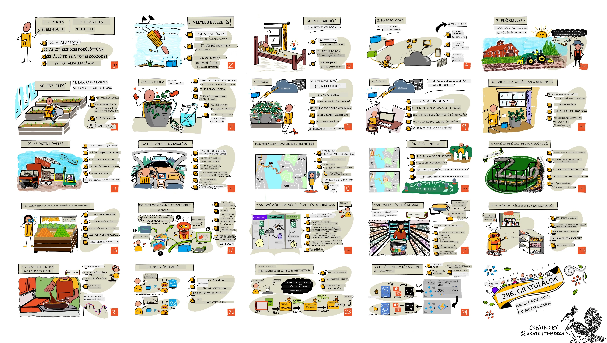

[](https://github.com/microsoft/IoT-For-Beginners/blob/master/LICENSE)
[](https://GitHub.com/microsoft/IoT-For-Beginners/graphs/contributors/)
[](https://GitHub.com/microsoft/IoT-For-Beginners/issues/)
[](https://GitHub.com/microsoft/IoT-For-Beginners/pulls/)
[](http://makeapullrequest.com)

[](https://GitHub.com/microsoft/IoT-For-Beginners/watchers/)
[](https://GitHub.com/microsoft/IoT-For-Beginners/network/)
[](https://GitHub.com/microsoft/IoT-For-Beginners/stargazers/)

### Csatlakozz az Azure AI Foundry Közösséghez

Ha elakadnál, vagy kérdéseid lennének az AI alkalmazások építésével kapcsolatban. Csatlakozz más tanulókhoz és tapasztalt fejlesztőkhöz az MCP-vel kapcsolatos beszélgetésekben. Ez egy támogató közösség, ahol a kérdések szívesen látottak és a tudás szabadon megosztott.

[](https://discord.gg/nTYy5BXMWG)

Ha termék visszajelzésed van vagy hibákat tapasztalsz építés közben, látogasd meg:

[](https://aka.ms/foundry/forum)

Kövesd ezeket a lépéseket a források használatának megkezdéséhez:
1. **Forkold a Tárolót**: Kattints ide [](https://GitHub.com/microsoft/IoT-For-Beginners/fork)
2. **Klónozd a Tárolót**:   `git clone https://github.com/microsoft/IoT-For-Beginners.git`
3. [**Csatlakozz a Microsot Foundry Discordhoz és ismerkedj szakértőkkel és más fejlesztőkkel**](https://discord.com/invite/ByRwuEEgH4)


### 🌐 Többnyelvű támogatás

#### GitHub Action segítségével (Automatikus és Mindig Naprakész)

<!-- CO-OP TRANSLATOR LANGUAGES TABLE START -->
[Arab](../ar/README.md) | [Bengáli](../bn/README.md) | [Bolgár](../bg/README.md) | [Burmai (Mianmar)](../my/README.md) | [Kínai (Egyszerűsített)](../zh-CN/README.md) | [Kínai (Hagyományos, Hongkong)](../zh-HK/README.md) | [Kínai (Hagyományos, Makaó)](../zh-MO/README.md) | [Kínai (Hagyományos, Tajvan)](../zh-TW/README.md) | [Horvát](../hr/README.md) | [Cseh](../cs/README.md) | [Dán](../da/README.md) | [Holland](../nl/README.md) | [Észt](../et/README.md) | [Finn](../fi/README.md) | [Francia](../fr/README.md) | [Német](../de/README.md) | [Görög](../el/README.md) | [Héber](../he/README.md) | [Hindi](../hi/README.md) | [Magyar](./README.md) | [Indonéz](../id/README.md) | [Olasz](../it/README.md) | [Japán](../ja/README.md) | [Kannada](../kn/README.md) | [Khmer](../km/README.md) | [Koreai](../ko/README.md) | [Litván](../lt/README.md) | [Maláj](../ms/README.md) | [Malayalam](../ml/README.md) | [Marathi](../mr/README.md) | [Nepáli](../ne/README.md) | [Nigériai Pidgin](../pcm/README.md) | [Norvég](../no/README.md) | [Perzsa (Fárszi)](../fa/README.md) | [Lengyel](../pl/README.md) | [Portugál (Brazília)](../pt-BR/README.md) | [Portugál (Portugália)](../pt-PT/README.md) | [Pandzsábi (Gurmukhi)](../pa/README.md) | [Román](../ro/README.md) | [Orosz](../ru/README.md) | [Szerb (Cirill)](../sr/README.md) | [Szlovák](../sk/README.md) | [Szlovén](../sl/README.md) | [Spanyol](../es/README.md) | [Szuahéli](../sw/README.md) | [Svéd](../sv/README.md) | [Tagalog (Filippínó)](../tl/README.md) | [Tamil](../ta/README.md) | [Telugu](../te/README.md) | [Thai](../th/README.md) | [Török](../tr/README.md) | [Ukrán](../uk/README.md) | [Urdu](../ur/README.md) | [Vietnami](../vi/README.md)

> **Inkább helyileg klónoznád?**
>
> Ez a tároló több mint 50 nyelvi fordítást tartalmaz, ami jelentősen megnöveli a letöltési méretet. Fordítások nélküli klónozáshoz használd a sparse checkout-ot:
>
> **Bash / macOS / Linux:**
> ```bash
> git clone --filter=blob:none --sparse https://github.com/microsoft/IoT-For-Beginners.git
> cd IoT-For-Beginners
> git sparse-checkout set --no-cone '/*' '!translations' '!translated_images'
> ```
>
> **CMD (Windows):**
> ```cmd
> git clone --filter=blob:none --sparse https://github.com/microsoft/IoT-For-Beginners.git
> cd IoT-For-Beginners
> git sparse-checkout set --no-cone "/*" "!translations" "!translated_images"
> ```
>
> Ez mindent biztosít, amire szükséged van a kurzus elvégzéséhez sokkal gyorsabb letöltéssel.
<!-- CO-OP TRANSLATOR LANGUAGES TABLE END -->

# IoT kezdőknek – Tananyag

A Microsoft Azure Cloud Advocates örömmel kínál egy 12 hetes, 24 leckés tananyagot, amely az IoT alapjait fedi le. Minden lecke tartalmaz elő- és utóteszteket, írott útmutatókat a lecke teljesítéséhez, megoldásokat, feladatokat és még sok mást. Projekt-alapú oktatásunk lehetővé teszi, hogy tanulj miközben építesz, ami bizonyítottan segíti az új készségek rögzülését.

A projektek az élelmiszer útját követik a gazdaságtól az asztalig. Ez magában foglalja a gazdálkodást, logisztikát, gyártást, kiskereskedelmet és fogyasztást – mind népszerű ipari területeket az IoT eszközök számára.



> Sketchnote készítette [Nitya Narasimhan](https://github.com/nitya). Kattints a képre a nagyobb verzióért.

**Szívből köszönjük szerzőinknek [Jen Fox](https://github.com/jenfoxbot), [Jen Looper](https://github.com/jlooper), [Jim Bennett](https://github.com/jimbobbennett), valamint sketchnote művészünknek [Nitya Narasimhan](https://github.com/nitya).**

**Köszönet illeti [Microsoft Learn Student Ambassadors](https://studentambassadors.microsoft.com?WT.mc_id=academic-17441-jabenn) csapatunkat, akik átnézték és lefordították ezt a tananyagot – [Aditya Garg](https://github.com/AdityaGarg00), [Anurag Sharma](https://github.com/Anurag-0-1-A), [Arpita Das](https://github.com/Arpiiitaaa), [Aryan Jain](https://www.linkedin.com/in/aryan-jain-47a4a1145/), [Bhavesh Suneja](https://github.com/EliteWarrior315), [Faith Hunja](https://faithhunja.github.io/), [Lateefah Bello](https://www.linkedin.com/in/lateefah-bello/), [Manvi Jha](https://github.com/Severus-Matthew), [Mireille Tan](https://www.linkedin.com/in/mireille-tan-a4834819a/), [Mohammad Iftekher (Iftu) Ebne Jalal](https://github.com/Iftu119), [Mohammad Zulfikar](https://github.com/mohzulfikar), [Priyanshu Srivastav](https://www.linkedin.com/in/priyanshu-srivastav-b067241ba), [Thanmai Gowducheruvu](https://github.com/innovation-platform), és [Zina Kamel](https://www.linkedin.com/in/zina-kamel/).**

Ismerd meg a csapatot!

[](https://youtu.be/-wippUJRi5k)

**Gif készítette** [Mohit Jaisal](https://linkedin.com/in/mohitjaisal)

> 🎥 Kattints a fenti képre egy videóért a projektről!

> **Tanárként** ajánlásokat [adunk](for-teachers.md) a tananyag használatához. Ha saját leckéket szeretnél készíteni, mellékeltünk egy [leckesablont](lesson-template/README.md).

> **[Diákok](https://aka.ms/student-page)**, ahhoz, hogy egyénileg használjátok ezt a tananyagot, forkoljátok a teljes repót, és végezzétek el a gyakorlatokat egymás után, kezdve az elő-előadás teszttel, majd az előadást elolvasva és a további tevékenységeket végrehajtva. Próbáljátok meg a projekteket a leckék megértése alapján létrehozni, ne csak a megoldáskódot másoljátok; a kód megtalálható a /solutions mappában minden projekt-orientált leckénél. Másik jó ötlet egy tanulócsoport alakítása barátokkal, és közösen átnézni a tartalmat. További tanulmányokhoz ajánljuk a [Microsoft Learn](https://docs.microsoft.com/users/jimbobbennett/collections/ke2ehd351jopwr?WT.mc_id=academic-17441-jabenn) tananyagot.

A kurzusról egy videós áttekintő:

[](https://youtube.com/watch?v=bccEMm8gRuc "Promóciós videó")

> 🎥 Kattints a fenti képre egy videóért a projektről!

## Oktatási megközelítés

Két oktatási alapelvet választottunk a tananyag készítésekor: hogy projekt-alapú legyen és gyakori teszteket tartalmazzon. A sorozat végére a tanulók egy növényfigyelő és öntöző rendszert, egy járműkövetőt, egy okos gyári beállítást az élelmiszer nyomon követésére és ellenőrzésére, valamint egy hangvezérelt főzőidőzítőt építenek, és megtanulják az Internet of Things alapjait, beleértve eszközprogramozást, felhőkapcsolatot, telemetria elemzést és élő AI futtatását az eszköz szélén.

Az anyag projekt-orientált jellege miatt a tanulók jobban el tudnak mélyülni a témában, és a fogalmak tartósabban rögzülnek.

Ezen kívül egy alacsony tétű teszt az óra előtt előkészíti a tanulót az adott témára, míg egy második, az óra után mér fel és segít a tananyag jobb megjegyzésében. Ez a tananyag rugalmas és szórakoztató, teljes egészében vagy részleteiben is elsajátítható. A projektek kis méretűekkel indulnak, és a 12 hét végére egyre összetettebbé válnak.

Minden projekt valódi, a tanulók és hobbi fejlesztők által elérhető hardveren alapul. Minden projekt konkrét iparági területre fókuszál, háttérismereteket nyújtva. A sikeres fejlesztőnek fontos értenie azt a területet, amelyen problémákat old meg, így a háttérismeretek lehetővé teszik a tanulók számára, hogy IoT megoldásaikat és tanulmányaikat az adott valós problémakörnyezetben gondolják át, amelyben dolgozni fognak. A tanulók megértik megoldásaik 'miértjét', és értékelik a végfelhasználó szempontját.

## Hardver
A projektjeinkhez kétféle IoT hardver közül választhatunk személyes preferenciától, programozási nyelvismerettől vagy preferenciáktól, tanulási céloktól és elérhetőségtől függően. Egy „virtuális hardver” verziót is biztosítottunk azok számára, akik nem férnek hozzá fizikai hardverhez, vagy többet szeretnének megtanulni vásárlás előtt. További információkat és egy „bevásárlólistát” találhatsz a [hardver oldalon](./hardware.md), beleértve a barátainktól, a Seeed Studio-tól vásárolható komplett készletek linkjeit is.

> 💁 Találd meg [Üzleti Etikai Kódexünket](CODE_OF_CONDUCT.md), a [Közreműködési szabályokat](CONTRIBUTING.md) és a [Fordítási](..) irányelveket. Várjuk a konstruktív visszajelzéseidet!
>
> 🔧 Problémád van? Nézd meg a [Hibaelhárító Útmutatót](TROUBLESHOOTING.md) a gyakori problémák megoldásaiért.

## Minden leckében szerepel:

- vázlat
- választható kiegészítő videó
- a lecke előtti bemelegítő kvíz
- írott lecke
- projekt-alapú leckék esetén lépésről lépésre vezető útmutatók a projekt elkészítéséhez
- tudásellenőrzések
- egy kihívás
- kiegészítő olvasmány
- házi feladat
- [leckét követő kvíz](https://ff-quizzes.netlify.app/en/)

> **Megjegyzés a kvízekről**: Minden kvíz a quiz-app mappában található, összesen 48 kvíz három-három kérdéssel. Ezek a leckékből elérhetők, de a kvíz alkalmazás lokálisan is futtatható vagy Azure-ba telepíthető; kövesd a quiz-app mappában található utasításokat. Fokozatosan lokalizáljuk őket.

## Leckék

|       |              Projekt Neve               |                        Tanult Fogalmak                        | Tanulási Célkitűzések                                                                                                                                               |                                                        Hivatkozott Lecke                                                          |
| :---: | :------------------------------------: | :------------------------------------------------------------: | ------------------------------------------------------------------------------------------------------------------------------------------------------------------ | :--------------------------------------------------------------------------------------------------------------------------: |
|  01   | [Kezdő lépések](./1-getting-started/README.md) |                     Bevezetés az IoT világába                  | Ismerd meg az IoT alapelveit és az IoT megoldások alapvető elemeit, például az érzékelőket és felhőszolgáltatásokat miközben beállítod az első IoT eszközödet      |                      [Bevezetés az IoT-be](./1-getting-started/lessons/1-introduction-to-iot/README.md)                       |
|  02   | [Kezdő lépések](./1-getting-started/README.md) |                   Mélyebb betekintés az IoT-be                 | Tudj meg többet az IoT rendszer komponenseiről, valamint a mikrokontrollerekről és az egylapos számítógépekről                                                        |                        [Mélyebb betekintés az IoT-be](./1-getting-started/lessons/2-deeper-dive/README.md)                    |
|  03   | [Kezdő lépések](./1-getting-started/README.md) | Interakció a fizikai világgal érzékelők és működtetők segítségével | Ismerd meg az érzékelőket, melyek adatot gyűjtenek a fizikai világból, és a működtetőket, amelyek visszacsatolást küldenek, miközben egy éjszakai lámpát építesz      | [Interakció a fizikai világgal érzékelők és működtetők segítségével](./1-getting-started/lessons/3-sensors-and-actuators/README.md) |
|  04   | [Kezdő lépések](./1-getting-started/README.md) |             Írd be eszközöd az internetre                      | Tanuld meg, hogyan lehet egy IoT eszközt az internetre csatlakoztatni és üzeneteket küldeni, fogadni, miközben a éjszakai lámpádat egy MQTT brokerhez kötöd        |              [Eszköz csatlakoztatása az internetre](./1-getting-started/lessons/4-connect-internet/README.md)                 |
|  05   |            [Gazdaság](./2-farm/README.md)            |                    Megnövekedés előrejelzése                   | Tanuld meg, hogyan lehet előre jelezni a növénynövekedést egy IoT eszköz által rögzített hőmérsékletadatok segítségével                                             |                          [Megnövekedés előrejelzése](./2-farm/lessons/1-predict-plant-growth/README.md)                       |
|  06   |            [Gazdaság](./2-farm/README.md)            |                    Talajnedvesség érzékelése                   | Tanuld meg, hogyan lehet érzékelni a talaj nedvességtartalmát és kalibrálni egy talajnedvesség érzékelőt                                                            |                          [Talajnedvesség érzékelése](./2-farm/lessons/2-detect-soil-moisture/README.md)                       |
|  07   |            [Gazdaság](./2-farm/README.md)            |                  Automatikus növényöntözés                      | Tanuld meg, hogyan lehet automatikusan és időzítve öntözni relé és MQTT segítségével                                                                                |                      [Automatikus növényöntözés](./2-farm/lessons/3-automated-plant-watering/README.md)                       |
|  08   |            [Gazdaság](./2-farm/README.md)            |               Növényed áthelyezése a felhőbe                   | Ismerd meg a felhőt és a felhőalapú IoT szolgáltatásokat, valamint hogyan csatlakoztasd növényedet egy ezek közül a publikus MQTT broker helyett                   |              [Növényed áthelyezése a felhőbe](./2-farm/lessons/4-migrate-your-plant-to-the-cloud/README.md)                   |
|  09   |            [Gazdaság](./2-farm/README.md)            |         Alkalmazás logikád áthelyezése a felhőbe               | Tudj meg többet arról, hogyan írhatod meg az alkalmazás logikáját a felhőben, amely reagál az IoT üzenetekre                                                         |         [Alkalmazás logikád áthelyezése a felhőbe](./2-farm/lessons/5-migrate-application-to-the-cloud/README.md)             |
|  10   |            [Gazdaság](./2-farm/README.md)            |                   Tartsd biztonságban növényed                  | Ismerd meg az IoT biztonságát, és hogyan védd növényed kulcsokkal és tanúsítványokkal                                                                               |                         [Tartsd biztonságban növényed](./2-farm/lessons/6-keep-your-plant-secure/README.md)                  |
|  11   |       [Szállítás](./3-transport/README.md)           |                      Helymeghatározás                          | Ismerd meg a GPS helymeghatározást IoT eszközökhöz                                                                                                                |                          [Helymeghatározás](./3-transport/lessons/1-location-tracking/README.md)                             |
|  12   |       [Szállítás](./3-transport/README.md)           |                     Adattárolás hely alapján                    | Tanuld meg, hogyan tárolhatod az IoT adatokat későbbi megjelenítéshez vagy elemzéshez                                                                               |                          [Helyadat tárolása](./3-transport/lessons/2-store-location-data/README.md)                            |
|  13   |       [Szállítás](./3-transport/README.md)           |                   Helyadatok megjelenítése                      | Ismerd meg, hogyan jelenítsd meg a helyadatokat térképen, és miként jelenítik meg a térképek a valós 3D világot 2 dimenzióban                                       |                        [Helyadatok megjelenítése](./3-transport/lessons/3-visualize-location-data/README.md)                |
|  14   |       [Szállítás](./3-transport/README.md)           |                          Geokerítések                          | Ismerd meg a geokerítéseket, és hogyan lehet őket figyelmeztetésre használni, amikor a szállítási lánc járművei közelítenek a célhoz                             |                                   [Geokerítések](./3-transport/lessons/4-geofences/README.md)                                |
|  15   |   [Gyártás](./4-manufacturing/README.md)             |               Gyümölcsminőség-érzékelő betanítása              | Ismerd meg, hogyan képezhetsz képosztályozót a felhőben gyümölcs minőségének érzékelésére                                                                           |                 [Gyümölcsminőség-érzékelő betanítása](./4-manufacturing/lessons/1-train-fruit-detector/README.md)             |
|  16   |   [Gyártás](./4-manufacturing/README.md)             |           Gyümölcsminőség ellenőrzése IoT-eszközről            | Ismerd meg, hogyan használhatod gyümölcsminőség-érzékelődet egy IoT eszközről                                                                                      |           [Gyümölcsminőség ellenőrzése IoT-eszközről](./4-manufacturing/lessons/2-check-fruit-from-device/README.md)         |
|  17   |   [Gyártás](./4-manufacturing/README.md)             |             Gyümölcsérzékelő futtatása az élen                 | Ismerd meg, hogyan futtathatod gyümölcsérzékelődet az IoT eszközön helyileg                                                                                      |             [Gyümölcsérzékelő futtatása az élen](./4-manufacturing/lessons/3-run-fruit-detector-edge/README.md)              |
|  18   |   [Gyártás](./4-manufacturing/README.md)             |        Gyümölcsminőség érzékelés indítása egy szenzorról       | Ismerd meg, hogyan indíthatod el a gyümölcsminőség érzékelést egy szenzorról                                                                                       |        [Gyümölcsminőség érzékelés indítása szenzorról](./4-manufacturing/lessons/4-trigger-fruit-detector/README.md)          |
|  19   |          [Kiskereskedelem](./5-retail/README.md)     |                   Készletérzékelő tanítása                     | Ismerd meg, hogyan használj objektumfelismerést egy készletérzékelő tanításához a bolt készletének megszámlálására                                                  |                         [Készletérzékelő tanítása](./5-retail/lessons/1-train-stock-detector/README.md)                      |
|  20   |          [Kiskereskedelem](./5-retail/README.md)     |               Készlet ellenőrzése IoT eszközről                 | Ismerd meg, hogyan ellenőrizheted a készletet IoT eszközről egy objektumfelismerő modell segítségével                                                             |                    [Készlet ellenőrzése IoT eszközről](./5-retail/lessons/2-check-stock-device/README.md)                    |
|  21   |        [Fogyasztói eszközök](./6-consumer/README.md) |             Beszédfelismerés IoT eszközzel                      | Ismerd meg, hogyan ismerd fel a beszédet egy IoT eszközről, hogy egy intelligens időzítőt építs                                                                        |                  [Beszédfelismerés IoT eszközzel](./6-consumer/lessons/1-speech-recognition/README.md)                       |
|  22   |        [Fogyasztói eszközök](./6-consumer/README.md) |                     Nyelvértés                                  | Tanuld meg, hogyan érts meg mondatokat, amelyeket egy IoT eszköznek mondanak                                                                                       |                        [Nyelvértés](./6-consumer/lessons/2-language-understanding/README.md)                                  |
|  23   |        [Fogyasztói eszközök](./6-consumer/README.md) |          Időzítő beállítása és hangos visszajelzés            | Tanuld meg, hogyan állíthatsz be időzítőt egy IoT eszközön és adhatsz hangos visszajelzést az időzítő indításáról és lejártáról                                    |                 [Időzítő beállítása és hangos visszajelzés](./6-consumer/lessons/3-spoken-feedback/README.md)                |
|  24   |        [Fogyasztói eszközök](./6-consumer/README.md) |                 Többnyelvű támogatás                           | Ismerd meg, hogyan támogathatsz több nyelvet, mind beszédben, mind válaszként az intelligens időzítődtől                                                             |                   [Többnyelvű támogatás](./6-consumer/lessons/4-multiple-language-support/README.md)                         |

## Offline elérés

A dokumentáció offline használatához használd a [Docsify](https://docsify.js.org/#/) eszközt. Forkold ezt a repót, [telepítsd a Docsify-t](https://docsify.js.org/#/quickstart) a helyi gépedre, majd a repo gyökérmappájában írd be, hogy `docsify serve`. A weboldalt a localhost 3000-es portján fogja szolgáltatni: `localhost:3000`.

## Kvíz

Köszönet a közösségnek, hogy megtartják az interaktív kvízt, amely minden fejezet tudáspróbája. Tudásodat [itt tesztelheted](https://ff-quizzes.netlify.app/en/).

### PDF

Ha szükséges, készíthetsz ebből a tartalomból offline elérésre PDF-et. Ehhez győződj meg róla, hogy [az npm telepítve van](https://docs.npmjs.com/downloading-and-installing-node-js-and-npm), majd fusd a következő parancsokat a repo gyökérmappájában:

```sh
npm i
npm run convert
```

### Diák

Néhány leckéhez diavetítések is elérhetők a [slides](../../slides) mappában.


## Egyéb tantervek

Csapatunk más tananyagokat is készít! Nézd meg:

<!-- CO-OP TRANSLATOR OTHER COURSES START -->
### LangChain
[](https://aka.ms/langchain4j-for-beginners)
[](https://aka.ms/langchainjs-for-beginners?WT.mc_id=m365-94501-dwahlin)
[](https://github.com/microsoft/langchain-for-beginners?WT.mc_id=m365-94501-dwahlin)
---

### Azure / Edge / MCP / Ügynökök
[](https://github.com/microsoft/AZD-for-beginners?WT.mc_id=academic-105485-koreyst)
[](https://github.com/microsoft/edgeai-for-beginners?WT.mc_id=academic-105485-koreyst)
[](https://github.com/microsoft/mcp-for-beginners?WT.mc_id=academic-105485-koreyst)
[](https://github.com/microsoft/ai-agents-for-beginners?WT.mc_id=academic-105485-koreyst)

---
 
### Generatív AI sorozat
[](https://github.com/microsoft/generative-ai-for-beginners?WT.mc_id=academic-105485-koreyst)
[-9333EA?style=for-the-badge&labelColor=E5E7EB&color=9333EA)](https://github.com/microsoft/Generative-AI-for-beginners-dotnet?WT.mc_id=academic-105485-koreyst)
[-C084FC?style=for-the-badge&labelColor=E5E7EB&color=C084FC)](https://github.com/microsoft/generative-ai-for-beginners-java?WT.mc_id=academic-105485-koreyst)
[-E879F9?style=for-the-badge&labelColor=E5E7EB&color=E879F9)](https://github.com/microsoft/generative-ai-with-javascript?WT.mc_id=academic-105485-koreyst)

---
 
### Alapvető tanulás
[](https://aka.ms/ml-beginners?WT.mc_id=academic-105485-koreyst)
[](https://aka.ms/datascience-beginners?WT.mc_id=academic-105485-koreyst)
[](https://aka.ms/ai-beginners?WT.mc_id=academic-105485-koreyst)
[](https://github.com/microsoft/Security-101?WT.mc_id=academic-96948-sayoung)
[](https://aka.ms/webdev-beginners?WT.mc_id=academic-105485-koreyst)
[](https://aka.ms/iot-beginners?WT.mc_id=academic-105485-koreyst)
[](https://github.com/microsoft/xr-development-for-beginners?WT.mc_id=academic-105485-koreyst)

---
 
### Copilot sorozat
[](https://aka.ms/GitHubCopilotAI?WT.mc_id=academic-105485-koreyst)
[](https://github.com/microsoft/mastering-github-copilot-for-dotnet-csharp-developers?WT.mc_id=academic-105485-koreyst)
[](https://github.com/microsoft/CopilotAdventures?WT.mc_id=academic-105485-koreyst)
<!-- CO-OP TRANSLATOR OTHER COURSES END -->

## Képforrások

A tananyagban használt képek forrásai megtalálhatók, ahol szükséges, az [Attributions](./attributions.md) fájlban.

---

<!-- CO-OP TRANSLATOR DISCLAIMER START -->
**Jogi nyilatkozat**:  
Ezt a dokumentumot az AI fordító szolgáltatás, a [Co-op Translator](https://github.com/Azure/co-op-translator) segítségével fordítottuk. Bár az pontosságra törekszünk, kérjük, vegye figyelembe, hogy az automatikus fordítás hibákat vagy pontatlanságokat tartalmazhat. Az eredeti dokumentum anyanyelven készült változata tekintendő hiteles forrásnak. Kritikus információk esetén ajánlott profi emberi fordítást igénybe venni. Nem vállalunk felelősséget a fordítás használatából eredő félreértésekért vagy félreértelmezésekért.
<!-- CO-OP TRANSLATOR DISCLAIMER END -->