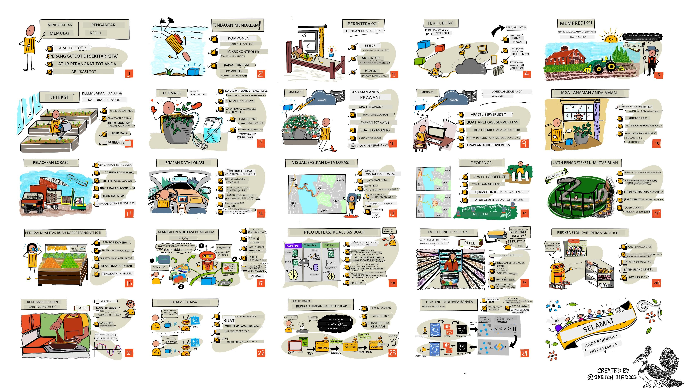

<!--
CO_OP_TRANSLATOR_METADATA:
{
  "original_hash": "6c354ec3487e4f6cfafbe44557996cd9",
  "translation_date": "2026-01-06T09:58:51+00:00",
  "source_file": "README.md",
  "language_code": "id"
}
-->
[](https://github.com/microsoft/IoT-For-Beginners/blob/master/LICENSE)
[](https://GitHub.com/microsoft/IoT-For-Beginners/graphs/contributors/)
[](https://GitHub.com/microsoft/IoT-For-Beginners/issues/)
[](https://GitHub.com/microsoft/IoT-For-Beginners/pulls/)
[](http://makeapullrequest.com)

[](https://GitHub.com/microsoft/IoT-For-Beginners/watchers/)
[](https://GitHub.com/microsoft/IoT-For-Beginners/network/)
[](https://GitHub.com/microsoft/IoT-For-Beginners/stargazers/)

### Bergabung dengan Komunitas Azure AI Foundry

Jika Anda mengalami kesulitan atau memiliki pertanyaan tentang membangun aplikasi AI. Bergabunglah dengan pelajar lain dan pengembang berpengalaman dalam diskusi tentang MCP. Ini adalah komunitas yang mendukung dimana pertanyaan disambut dan pengetahuan dibagikan secara bebas.

[](https://discord.gg/nTYy5BXMWG)

Jika Anda memiliki masukan produk atau menemukan kesalahan saat membangun, kunjungi:

[](https://aka.ms/foundry/forum)

Ikuti langkah-langkah ini untuk memulai menggunakan sumber daya ini:
1. **Fork Repositori**: Klik [](https://GitHub.com/microsoft/IoT-For-Beginners/fork)
2. **Clone Repositori**:   `git clone https://github.com/microsoft/IoT-For-Beginners.git`
3. [**Bergabung Dengan Discord Microsoft Foundry dan temui para ahli serta pengembang lainnya**](https://discord.com/invite/ByRwuEEgH4)

### 🌐 Dukungan Multi-Bahasa

#### Didukung melalui GitHub Action (Otomatis & Selalu Terbaru)

<!-- CO-OP TRANSLATOR LANGUAGES TABLE START -->
[Arab](../ar/README.md) | [Bengali](../bn/README.md) | [Bulgaria](../bg/README.md) | [Bahasa Burma (Myanmar)](../my/README.md) | [Cina (Sederhana)](../zh/README.md) | [Cina (Tradisional, Hong Kong)](../hk/README.md) | [Cina (Tradisional, Macau)](../mo/README.md) | [Cina (Tradisional, Taiwan)](../tw/README.md) | [Kroasia](../hr/README.md) | [Ceko](../cs/README.md) | [Denmark](../da/README.md) | [Belanda](../nl/README.md) | [Estonia](../et/README.md) | [Finlandia](../fi/README.md) | [Perancis](../fr/README.md) | [Jerman](../de/README.md) | [Yunani](../el/README.md) | [Ibrani](../he/README.md) | [Hindi](../hi/README.md) | [Hungaria](../hu/README.md) | [Indonesia](./README.md) | [Italia](../it/README.md) | [Jepang](../ja/README.md) | [Kannada](../kn/README.md) | [Korea](../ko/README.md) | [Lituania](../lt/README.md) | [Melayu](../ms/README.md) | [Malayalam](../ml/README.md) | [Marathi](../mr/README.md) | [Nepali](../ne/README.md) | [Pidgin Nigeria](../pcm/README.md) | [Norwegia](../no/README.md) | [Persia (Farsi)](../fa/README.md) | [Polandia](../pl/README.md) | [Portugis (Brasil)](../br/README.md) | [Portugis (Portugal)](../pt/README.md) | [Punjabi (Gurmukhi)](../pa/README.md) | [Rumania](../ro/README.md) | [Rusia](../ru/README.md) | [Serbia (Sirilik)](../sr/README.md) | [Slowakia](../sk/README.md) | [Slovenia](../sl/README.md) | [Spanyol](../es/README.md) | [Swahili](../sw/README.md) | [Swedia](../sv/README.md) | [Tagalog (Filipina)](../tl/README.md) | [Tamil](../ta/README.md) | [Telugu](../te/README.md) | [Thailand](../th/README.md) | [Turki](../tr/README.md) | [Ukraina](../uk/README.md) | [Urdu](../ur/README.md) | [Vietnam](../vi/README.md)

> **Lebih Suka Clone Secara Lokal?**

> Repositori ini mencakup lebih dari 50 terjemahan bahasa yang secara signifikan meningkatkan ukuran unduhan. Untuk meng-clone tanpa terjemahan, gunakan sparse checkout:
> ```bash
> git clone --filter=blob:none --sparse https://github.com/microsoft/IoT-For-Beginners.git
> cd IoT-For-Beginners
> git sparse-checkout set --no-cone '/*' '!translations' '!translated_images'
> ```
> Ini memberi Anda semua yang Anda butuhkan untuk menyelesaikan kursus dengan pengunduhan yang jauh lebih cepat.
<!-- CO-OP TRANSLATOR LANGUAGES TABLE END -->

# IoT untuk Pemula - Kurikulum

Azure Cloud Advocates di Microsoft dengan senang hati menawarkan kurikulum selama 12 minggu, 24 pelajaran yang membahas dasar-dasar IoT. Setiap pelajaran mencakup kuis sebelum dan sesudah pelajaran, instruksi tertulis untuk menyelesaikan pelajaran, solusi, tugas, dan lainnya. Pedagogi berbasis proyek kami memungkinkan Anda belajar sambil membangun, cara yang terbukti agar keterampilan baru 'melekat'.

Proyek-proyek mencakup perjalanan makanan dari pertanian ke meja makan. Ini termasuk pertanian, logistik, manufaktur, ritel, dan konsumen - semua adalah bidang industri populer untuk perangkat IoT.



> Sketchnote oleh [Nitya Narasimhan](https://github.com/nitya). Klik gambar untuk versi yang lebih besar.

**Terima kasih yang tulus kepada penulis kami [Jen Fox](https://github.com/jenfoxbot), [Jen Looper](https://github.com/jlooper), [Jim Bennett](https://github.com/jimbobbennett), dan seniman sketchnote kami [Nitya Narasimhan](https://github.com/nitya).**

**Terima kasih juga kepada tim [Microsoft Learn Student Ambassadors](https://studentambassadors.microsoft.com?WT.mc_id=academic-17441-jabenn) yang telah meninjau dan menerjemahkan kurikulum ini - [Aditya Garg](https://github.com/AdityaGarg00), [Anurag Sharma](https://github.com/Anurag-0-1-A), [Arpita Das](https://github.com/Arpiiitaaa), [Aryan Jain](https://www.linkedin.com/in/aryan-jain-47a4a1145/), [Bhavesh Suneja](https://github.com/EliteWarrior315), [Faith Hunja](https://faithhunja.github.io/), [Lateefah Bello](https://www.linkedin.com/in/lateefah-bello/), [Manvi Jha](https://github.com/Severus-Matthew), [Mireille Tan](https://www.linkedin.com/in/mireille-tan-a4834819a/), [Mohammad Iftekher (Iftu) Ebne Jalal](https://github.com/Iftu119), [Mohammad Zulfikar](https://github.com/mohzulfikar), [Priyanshu Srivastav](https://www.linkedin.com/in/priyanshu-srivastav-b067241ba), [Thanmai Gowducheruvu](https://github.com/innovation-platform), dan [Zina Kamel](https://www.linkedin.com/in/zina-kamel/).**

Kenali timnya!

[](https://youtu.be/-wippUJRi5k)

**Gif oleh** [Mohit Jaisal](https://linkedin.com/in/mohitjaisal)

> 🎥 Klik gambar di atas untuk video tentang proyek ini!

> **Guru**, kami telah [menyertakan beberapa saran](for-teachers.md) tentang cara menggunakan kurikulum ini. Jika Anda ingin membuat pelajaran sendiri, kami juga menyertakan [template pelajaran](lesson-template/README.md).

> **[Siswa](https://aka.ms/student-page)**, untuk menggunakan kurikulum ini sendiri, fork seluruh repo dan selesaikan latihan secara mandiri, mulai dengan kuis sebelum kuliah, kemudian membaca kuliah dan menyelesaikan aktivitas lainnya. Cobalah membuat proyek dengan memahami pelajaran daripada menyalin kode solusi; meskipun kode tersebut tersedia di folder /solutions di setiap pelajaran yang berorientasi proyek. Ide lain adalah membentuk kelompok belajar dengan teman dan melalui materi bersama-sama. Untuk studi lebih lanjut, kami merekomendasikan [Microsoft Learn](https://docs.microsoft.com/users/jimbobbennett/collections/ke2ehd351jopwr?WT.mc_id=academic-17441-jabenn).

Untuk video gambaran kursus ini, lihat video ini:

[](https://youtube.com/watch?v=bccEMm8gRuc "Video promo")

> 🎥 Klik gambar di atas untuk video tentang proyek ini!

## Pedagogi

Kami telah memilih dua prinsip pedagogis saat membangun kurikulum ini: memastikan bahwa kurikulum berbasis proyek dan mencakup kuis yang sering. Pada akhir seri ini, siswa akan membangun sistem pemantauan dan penyiraman tanaman, pelacak kendaraan, pengaturan pabrik pintar untuk melacak dan memeriksa makanan, serta timer memasak yang dikendalikan suara, dan akan mempelajari dasar-dasar Internet of Things termasuk cara menulis kode perangkat, menghubungkan ke cloud, menganalisis telemetri dan menjalankan AI di edge.

Dengan memastikan konten sesuai dengan proyek, proses menjadi lebih menarik bagi siswa dan retensi konsep akan meningkat.

Selain itu, kuis dengan risiko rendah sebelum kelas menetapkan niat siswa untuk mempelajari topik, sementara kuis kedua setelah kelas memastikan retensi lebih lanjut. Kurikulum ini dirancang agar fleksibel dan menyenangkan serta dapat diambil secara keseluruhan atau sebagian. Proyek mulai dari yang kecil dan menjadi semakin kompleks pada akhir siklus 12 minggu.

Setiap proyek didasarkan pada perangkat keras dunia nyata yang tersedia bagi siswa dan hobiis. Setiap proyek memperhatikan domain proyek spesifik, menyediakan pengetahuan latar belakang yang relevan. Untuk menjadi pengembang yang sukses membantu memahami domain dimana Anda menyelesaikan masalah, menyediakan pengetahuan latar belakang ini memungkinkan siswa memikirkan solusi IoT dan pembelajaran mereka dalam konteks jenis masalah dunia nyata yang mungkin mereka diminta untuk selesaikan sebagai pengembang IoT. Siswa belajar 'mengapa' dari solusi yang mereka bangun, dan mendapatkan apresiasi terhadap pengguna akhir.

## Perangkat Keras

Kami memiliki dua pilihan perangkat keras IoT untuk digunakan dalam proyek tergantung pada preferensi pribadi, pengetahuan bahasa pemrograman atau preferensi, tujuan pembelajaran, dan ketersediaan. Kami juga menyediakan versi 'perangkat keras virtual' bagi mereka yang tidak memiliki akses ke perangkat keras, atau ingin mempelajari lebih banyak sebelum memutuskan membeli. Anda dapat membaca lebih lanjut dan menemukan 'daftar belanja' di [halaman perangkat keras](./hardware.md), termasuk tautan untuk membeli paket lengkap dari teman kami di Seeed Studio.
> 💁 Temukan [Kode Etik](CODE_OF_CONDUCT.md), [Kontribusi](CONTRIBUTING.md), dan panduan [Terjemahan](TRANSLATIONS.md) kami. Kami menyambut umpan balik konstruktif Anda!
>
> 🔧 Mengalami masalah? Lihat [Panduan Pemecahan Masalah](TROUBLESHOOTING.md) kami untuk solusi atas masalah umum.

## Setiap pelajaran mencakup:

- sketchnote
- video tambahan opsional
- kuis pemanasan sebelum pelajaran
- pelajaran tertulis
- untuk pelajaran berbasis proyek, panduan langkah demi langkah tentang cara membangun proyek
- pemeriksaan pengetahuan
- tantangan
- bacaan tambahan
- tugas
- [kuis pasca-pelajaran](https://ff-quizzes.netlify.app/en/)

> **Catatan tentang kuis**: Semua kuis terdapat di folder quiz-app, dengan total 48 kuis yang masing-masing terdiri dari tiga pertanyaan. Kuis-kuis tersebut terhubung dari dalam pelajaran tetapi aplikasi kuis dapat dijalankan secara lokal atau dideploy ke Azure; ikuti instruksi dalam folder `quiz-app`. Kuis-kuis ini secara bertahap sedang dilokalkan.

## Pelajaran

|       |              Nama Proyek              |                       Konsep yang Diajarkan                       | Tujuan Pembelajaran                                                                                                                                                 |                                                        Pelajaran yang Terhubung                                                         |
| :---: | :------------------------------------: | :---------------------------------------------------------: | ------------------------------------------------------------------------------------------------------------------------------------------------------------------- | :--------------------------------------------------------------------------------------------------------------------------: |
|  01   | [Memulai](./1-getting-started/README.md) |                     Pengenalan ke IoT                     | Pelajari prinsip dasar IoT dan blok bangunan dasar solusi IoT seperti sensor dan layanan cloud saat Anda menyiapkan perangkat IoT pertama Anda                       |                      [Pengenalan ke IoT](./1-getting-started/lessons/1-introduction-to-iot/README.md)                      |
|  02   | [Memulai](./1-getting-started/README.md) |                   Pendalaman ke IoT                    | Pelajari lebih lanjut tentang komponen sistem IoT, serta mikrokontroler dan komputer papan tunggal                                                             |                        [Pendalaman ke IoT](./1-getting-started/lessons/2-deeper-dive/README.md)                         |
|  03   | [Memulai](./1-getting-started/README.md) | Berinteraksi dengan dunia fisik menggunakan sensor dan aktuator | Pelajari tentang sensor untuk mengumpulkan data dari dunia fisik, dan aktuator untuk memberikan umpan balik, sambil Anda membangun lampu malam                                           | [Berinteraksi dengan dunia fisik menggunakan sensor dan aktuator](./1-getting-started/lessons/3-sensors-and-actuators/README.md) |
|  04   | [Memulai](./1-getting-started/README.md) |             Sambungkan perangkat Anda ke Internet             | Pelajari cara menghubungkan perangkat IoT ke Internet untuk mengirim dan menerima pesan dengan menghubungkan lampu malam Anda ke broker MQTT                               |               [Sambungkan perangkat Anda ke Internet](./1-getting-started/lessons/4-connect-internet/README.md)                |
|  05   |            [Pertanian](./2-farm/README.md)            |                    Memprediksi pertumbuhan tanaman                     | Pelajari cara memprediksi pertumbuhan tanaman menggunakan data suhu yang diambil oleh perangkat IoT                                                                                     |                          [Memprediksi pertumbuhan tanaman](./2-farm/lessons/1-predict-plant-growth/README.md)                           |
|  06   |            [Pertanian](./2-farm/README.md)            |                    Mendeteksi kelembaban tanah                     | Pelajari cara mendeteksi kelembaban tanah dan mengkalibrasi sensor kelembaban tanah                                                                                              |                          [Mendeteksi kelembaban tanah](./2-farm/lessons/2-detect-soil-moisture/README.md)                           |
|  07   |            [Pertanian](./2-farm/README.md)            |                  Penyiraman tanaman otomatis                   | Pelajari cara mengotomatisasi dan menjadwalkan penyiraman menggunakan relay dan MQTT                                                                                                      |                      [Penyiraman tanaman otomatis](./2-farm/lessons/3-automated-plant-watering/README.md)                       |
|  08   |            [Pertanian](./2-farm/README.md)            |               Migrasikan tanaman Anda ke cloud               | Pelajari tentang cloud dan layanan IoT yang dihosting di cloud serta cara menghubungkan tanaman Anda ke salah satu layanan ini dibanding broker MQTT publik                                   |               [Migrasikan tanaman Anda ke cloud](./2-farm/lessons/4-migrate-your-plant-to-the-cloud/README.md)                |
|  09   |            [Pertanian](./2-farm/README.md)            |         Migrasikan logika aplikasi Anda ke cloud         | Pelajari bagaimana Anda dapat menulis logika aplikasi di cloud yang merespon pesan IoT                                                                          |         [Migrasikan logika aplikasi Anda ke cloud](./2-farm/lessons/5-migrate-application-to-the-cloud/README.md)         |
|  10   |            [Pertanian](./2-farm/README.md)            |                   Jaga keamanan tanaman Anda                    | Pelajari tentang keamanan IoT dan cara menjaga tanaman Anda aman dengan kunci dan sertifikat                                                                          |                        [Jaga keamanan tanaman Anda](./2-farm/lessons/6-keep-your-plant-secure/README.md)                         |
|  11   |       [Transportasi](./3-transport/README.md)       |                      Pelacakan lokasi                      | Pelajari tentang pelacakan lokasi GPS untuk perangkat IoT                                                                                                                   |                           [Pelacakan lokasi](./3-transport/lessons/1-location-tracking/README.md)                           |
|  12   |       [Transportasi](./3-transport/README.md)       |                     Menyimpan data lokasi                     | Pelajari cara menyimpan data IoT untuk divisualisasikan atau dianalisis kemudian                                                                                                      |                         [Menyimpan data lokasi](./3-transport/lessons/2-store-location-data/README.md)                         |
|  13   |       [Transportasi](./3-transport/README.md)       |                   Memvisualisasikan data lokasi                   | Pelajari tentang memvisualisasikan data lokasi pada peta, dan bagaimana peta merepresentasikan dunia nyata 3D dalam 2 dimensi                                                            |                     [Memvisualisasikan data lokasi](./3-transport/lessons/3-visualize-location-data/README.md)                     |
|  14   |       [Transportasi](./3-transport/README.md)       |                          Geofence                          | Pelajari tentang geofence, dan bagaimana geofence dapat digunakan untuk memberi peringatan ketika kendaraan dalam rantai pasokan mendekati tujuan mereka                                           |                                   [Geofence](./3-transport/lessons/4-geofences/README.md)                                   |
|  15   |   [Manufaktur](./4-manufacturing/README.md)   |               Melatih detektor kualitas buah                | Pelajari tentang melatih pengklasifikasi gambar di cloud untuk mendeteksi kualitas buah                                                                                       |                 [Melatih detektor kualitas buah](./4-manufacturing/lessons/1-train-fruit-detector/README.md)                 |
|  16   |   [Manufaktur](./4-manufacturing/README.md)   |           Memeriksa kualitas buah dari perangkat IoT            | Pelajari tentang menggunakan detektor kualitas buah dari perangkat IoT                                                                                                    |           [Memeriksa kualitas buah dari perangkat IoT](./4-manufacturing/lessons/2-check-fruit-from-device/README.md)            |
|  17   |   [Manufaktur](./4-manufacturing/README.md)   |             Menjalankan detektor buah pada edge             | Pelajari tentang menjalankan detektor buah pada perangkat IoT di edge                                                                                                |             [Menjalankan detektor buah pada edge](./4-manufacturing/lessons/3-run-fruit-detector-edge/README.md)             |
|  18   |   [Manufaktur](./4-manufacturing/README.md)   |        Memicu deteksi kualitas buah dari sensor        | Pelajari tentang memicu deteksi kualitas buah dari sensor                                                                                                        |        [Memicu deteksi kualitas buah dari sensor](./4-manufacturing/lessons/4-trigger-fruit-detector/README.md)         |
|  19   |          [Ritel](./5-retail/README.md)          |                   Melatih detektor stok                    | Pelajari cara menggunakan deteksi objek untuk melatih detektor stok menghitung stok di toko                                                                                |                        [Melatih detektor stok](./5-retail/lessons/1-train-stock-detector/README.md)                         |
|  20   |          [Ritel](./5-retail/README.md)          |               Memeriksa stok dari perangkat IoT                | Pelajari cara memeriksa stok dari perangkat IoT menggunakan model deteksi objek                                                                                         |                     [Memeriksa stok dari perangkat IoT](./5-retail/lessons/2-check-stock-device/README.md)                      |
|  21   |        [Konsumen](./6-consumer/README.md)        |             Mengenali ucapan dengan perangkat IoT             | Pelajari cara mengenali ucapan dari perangkat IoT untuk membangun timer pintar                                                                                             |                  [Mengenali ucapan dengan perangkat IoT](./6-consumer/lessons/1-speech-recognition/README.md)                  |
|  22   |        [Konsumen](./6-consumer/README.md)        |                     Memahami bahasa                     | Pelajari cara memahami kalimat yang diucapkan pada perangkat IoT                                                                                                           |                        [Memahami bahasa](./6-consumer/lessons/2-language-understanding/README.md)                        |
|  23   |        [Konsumen](./6-consumer/README.md)        |           Mengatur timer dan memberikan umpan balik suara           | Pelajari cara mengatur timer pada perangkat IoT dan memberikan umpan balik suara kapan timer diatur dan selesai                                                    |                 [Mengatur timer dan memberikan umpan balik suara](./6-consumer/lessons/3-spoken-feedback/README.md)                  |
|  24   |        [Konsumen](./6-consumer/README.md)        |                 Mendukung berbagai bahasa                  | Pelajari cara mendukung berbagai bahasa, baik dalam pengucapan maupun respon dari timer pintar Anda                                                               |                   [Mendukung berbagai bahasa](./6-consumer/lessons/4-multiple-language-support/README.md)                   |

## Akses offline

Anda dapat menjalankan dokumentasi ini secara offline dengan menggunakan [Docsify](https://docsify.js.org/#/). Fork repo ini, [pasang Docsify](https://docsify.js.org/#/quickstart) di mesin lokal Anda, lalu di folder root repo ini, ketik `docsify serve`. Situs web akan disajikan di port 3000 pada localhost Anda: `localhost:3000`.

## Kuis

Terima kasih kepada komunitas yang telah menghosting kuis interaktif yang menguji pengetahuan Anda pada setiap bab. Anda dapat menguji pengetahuan Anda [di sini](https://ff-quizzes.netlify.app/en/)

### PDF

Anda dapat menghasilkan PDF dari konten ini untuk akses offline jika diperlukan. Untuk melakukannya, pastikan Anda sudah menginstal [npm](https://docs.npmjs.com/downloading-and-installing-node-js-and-npm) dan jalankan perintah berikut di folder root repo ini:

```sh
npm i
npm run convert
```

### Slide

Tersedia slide untuk beberapa pelajaran di folder [slides](../../slides).

## Kurikulum Lain

Tim kami juga menghasilkan kurikulum lainnya! Lihat:

<!-- CO-OP TRANSLATOR OTHER COURSES START -->
### LangChain
[](https://aka.ms/langchain4j-for-beginners)
[](https://aka.ms/langchainjs-for-beginners?WT.mc_id=m365-94501-dwahlin)

---

### Azure / Edge / MCP / Agen
[](https://github.com/microsoft/AZD-for-beginners?WT.mc_id=academic-105485-koreyst)
[](https://github.com/microsoft/edgeai-for-beginners?WT.mc_id=academic-105485-koreyst)
[](https://github.com/microsoft/mcp-for-beginners?WT.mc_id=academic-105485-koreyst)
[](https://github.com/microsoft/ai-agents-for-beginners?WT.mc_id=academic-105485-koreyst)

---
 
### Seri AI Generatif
[](https://github.com/microsoft/generative-ai-for-beginners?WT.mc_id=academic-105485-koreyst)
[-9333EA?style=for-the-badge&labelColor=E5E7EB&color=9333EA)](https://github.com/microsoft/Generative-AI-for-beginners-dotnet?WT.mc_id=academic-105485-koreyst)
[-C084FC?style=for-the-badge&labelColor=E5E7EB&color=C084FC)](https://github.com/microsoft/generative-ai-for-beginners-java?WT.mc_id=academic-105485-koreyst)
[-E879F9?style=for-the-badge&labelColor=E5E7EB&color=E879F9)](https://github.com/microsoft/generative-ai-with-javascript?WT.mc_id=academic-105485-koreyst)

---
 
### Pembelajaran Inti
[](https://aka.ms/ml-beginners?WT.mc_id=academic-105485-koreyst)
[](https://aka.ms/datascience-beginners?WT.mc_id=academic-105485-koreyst)
[](https://aka.ms/ai-beginners?WT.mc_id=academic-105485-koreyst)
[](https://github.com/microsoft/Security-101?WT.mc_id=academic-96948-sayoung)
[](https://aka.ms/webdev-beginners?WT.mc_id=academic-105485-koreyst)
[](https://aka.ms/iot-beginners?WT.mc_id=academic-105485-koreyst)
[](https://github.com/microsoft/xr-development-for-beginners?WT.mc_id=academic-105485-koreyst)

---
 
### Seri Copilot
[](https://aka.ms/GitHubCopilotAI?WT.mc_id=academic-105485-koreyst)
[](https://github.com/microsoft/mastering-github-copilot-for-dotnet-csharp-developers?WT.mc_id=academic-105485-koreyst)
[](https://github.com/microsoft/CopilotAdventures?WT.mc_id=academic-105485-koreyst)
<!-- CO-OP TRANSLATOR OTHER COURSES END -->

## Atribusi Gambar

Anda dapat menemukan semua atribusi untuk gambar yang digunakan dalam kurikulum ini dimana diperlukan di [Attributions](./attributions.md).

---

<!-- CO-OP TRANSLATOR DISCLAIMER START -->
**Penafian**:
Dokumen ini telah diterjemahkan menggunakan layanan terjemahan AI [Co-op Translator](https://github.com/Azure/co-op-translator). Meskipun kami berusaha untuk akurat, harap diketahui bahwa terjemahan otomatis dapat mengandung kesalahan atau ketidakakuratan. Dokumen asli dalam bahasa aslinya harus dianggap sebagai sumber yang sah. Untuk informasi penting, disarankan menggunakan terjemahan profesional oleh penerjemah manusia. Kami tidak bertanggung jawab atas kesalahpahaman atau penafsiran yang salah yang timbul dari penggunaan terjemahan ini.
<!-- CO-OP TRANSLATOR DISCLAIMER END -->