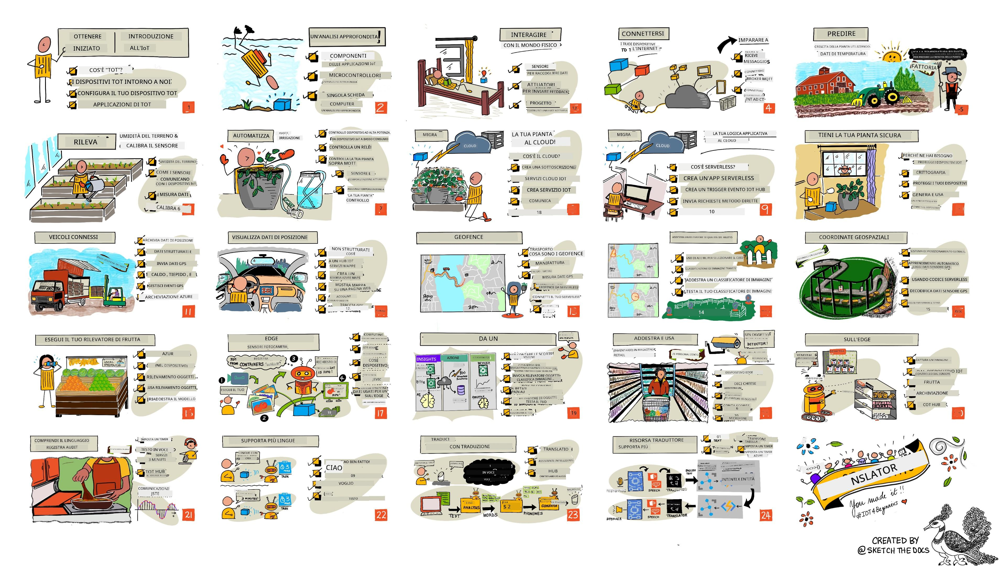

<!--
CO_OP_TRANSLATOR_METADATA:
{
  "original_hash": "6c354ec3487e4f6cfafbe44557996cd9",
  "translation_date": "2026-01-06T03:48:25+00:00",
  "source_file": "README.md",
  "language_code": "it"
}
-->
[](https://github.com/microsoft/IoT-For-Beginners/blob/master/LICENSE)
[](https://GitHub.com/microsoft/IoT-For-Beginners/graphs/contributors/)
[](https://GitHub.com/microsoft/IoT-For-Beginners/issues/)
[](https://GitHub.com/microsoft/IoT-For-Beginners/pulls/)
[](http://makeapullrequest.com)

[](https://GitHub.com/microsoft/IoT-For-Beginners/watchers/)
[](https://GitHub.com/microsoft/IoT-For-Beginners/network/)
[](https://GitHub.com/microsoft/IoT-For-Beginners/stargazers/)

### Unisciti alla Comunità Azure AI Foundry

Se rimani bloccato o hai domande sulla creazione di app AI. Unisciti a studenti e sviluppatori esperti nelle discussioni su MCP. È una comunità di supporto dove le domande sono benvenute e la conoscenza viene condivisa liberamente.

[](https://discord.gg/nTYy5BXMWG)

Se hai feedback sul prodotto o errori durante la creazione visita:

[](https://aka.ms/foundry/forum)

Segui questi passaggi per iniziare a utilizzare queste risorse:
1. **Forka il Repository**: Clicca [](https://GitHub.com/microsoft/IoT-For-Beginners/fork)
2. **Clona il Repository**:   `git clone https://github.com/microsoft/IoT-For-Beginners.git`
3. [**Unisciti al Discord Microsot Foundry e incontra esperti e altri sviluppatori**](https://discord.com/invite/ByRwuEEgH4)


### 🌐 Supporto Multilingue

#### Supportato tramite GitHub Action (Automatizzato e Sempre Aggiornato)

<!-- CO-OP TRANSLATOR LANGUAGES TABLE START -->
[Arabo](../ar/README.md) | [Bengalese](../bn/README.md) | [Bulgaro](../bg/README.md) | [Birmano (Myanmar)](../my/README.md) | [Cinese (Semplificato)](../zh/README.md) | [Cinese (Tradizionale, Hong Kong)](../hk/README.md) | [Cinese (Tradizionale, Macau)](../mo/README.md) | [Cinese (Tradizionale, Taiwan)](../tw/README.md) | [Croato](../hr/README.md) | [Ceco](../cs/README.md) | [Danese](../da/README.md) | [Olandese](../nl/README.md) | [Estone](../et/README.md) | [Finlandese](../fi/README.md) | [Francese](../fr/README.md) | [Tedesco](../de/README.md) | [Greco](../el/README.md) | [Ebraico](../he/README.md) | [Hindi](../hi/README.md) | [Ungherese](../hu/README.md) | [Indonesiano](../id/README.md) | [Italiano](./README.md) | [Giapponese](../ja/README.md) | [Kannada](../kn/README.md) | [Coreano](../ko/README.md) | [Lituano](../lt/README.md) | [Malese](../ms/README.md) | [Malayalam](../ml/README.md) | [Marathi](../mr/README.md) | [Nepalese](../ne/README.md) | [Pidgin Nigeriano](../pcm/README.md) | [Norvegese](../no/README.md) | [Persiano (Farsi)](../fa/README.md) | [Polacco](../pl/README.md) | [Portoghese (Brasile)](../br/README.md) | [Portoghese (Portogallo)](../pt/README.md) | [Punjabi (Gurmukhi)](../pa/README.md) | [Rumeno](../ro/README.md) | [Russo](../ru/README.md) | [Serbo (Cirillico)](../sr/README.md) | [Slovacco](../sk/README.md) | [Sloveno](../sl/README.md) | [Spagnolo](../es/README.md) | [Swahili](../sw/README.md) | [Svedese](../sv/README.md) | [Tagalog (Filippino)](../tl/README.md) | [Tamil](../ta/README.md) | [Telugu](../te/README.md) | [Thailandese](../th/README.md) | [Turco](../tr/README.md) | [Ucraino](../uk/README.md) | [Urdu](../ur/README.md) | [Vietnamita](../vi/README.md)

> **Preferisci clonare localmente?**

> Questo repository include oltre 50 traduzioni in lingua che aumentano significativamente la dimensione del download. Per clonare senza traduzioni, usa il checkout sparso:
> ```bash
> git clone --filter=blob:none --sparse https://github.com/microsoft/IoT-For-Beginners.git
> cd IoT-For-Beginners
> git sparse-checkout set --no-cone '/*' '!translations' '!translated_images'
> ```
> Questo ti dà tutto il necessario per completare il corso con un download molto più veloce.
<!-- CO-OP TRANSLATOR LANGUAGES TABLE END -->

# IoT per Principianti - Un Curricolo

Gli Azure Cloud Advocates di Microsoft sono lieti di offrire un curricolo di 12 settimane composto da 24 lezioni tutto sui fondamenti di IoT. Ogni lezione include quiz prima e dopo la lezione, istruzioni scritte per completarla, una soluzione, un compito e altro ancora. La nostra pedagogia basata su progetti ti permette di imparare costruendo, un metodo comprovato per far “rimanere” le nuove competenze.

I progetti coprono il percorso del cibo dalla fattoria alla tavola. Questo include agricoltura, logistica, produzione, vendita al dettaglio e consumatori - tutti settori popolari per i dispositivi IoT.



> Sketchnote di [Nitya Narasimhan](https://github.com/nitya). Clicca l’immagine per la versione ingrandita.

**Un sentito ringraziamento ai nostri autori [Jen Fox](https://github.com/jenfoxbot), [Jen Looper](https://github.com/jlooper), [Jim Bennett](https://github.com/jimbobbennett), e alla nostra artista degli sketchnote [Nitya Narasimhan](https://github.com/nitya).**

**Grazie anche al nostro team di [Microsoft Learn Student Ambassadors](https://studentambassadors.microsoft.com?WT.mc_id=academic-17441-jabenn) che hanno revisionato e tradotto questo curricolo - [Aditya Garg](https://github.com/AdityaGarg00), [Anurag Sharma](https://github.com/Anurag-0-1-A), [Arpita Das](https://github.com/Arpiiitaaa), [Aryan Jain](https://www.linkedin.com/in/aryan-jain-47a4a1145/), [Bhavesh Suneja](https://github.com/EliteWarrior315), [Faith Hunja](https://faithhunja.github.io/), [Lateefah Bello](https://www.linkedin.com/in/lateefah-bello/), [Manvi Jha](https://github.com/Severus-Matthew), [Mireille Tan](https://www.linkedin.com/in/mireille-tan-a4834819a/), [Mohammad Iftekher (Iftu) Ebne Jalal](https://github.com/Iftu119), [Mohammad Zulfikar](https://github.com/mohzulfikar), [Priyanshu Srivastav](https://www.linkedin.com/in/priyanshu-srivastav-b067241ba), [Thanmai Gowducheruvu](https://github.com/innovation-platform), e [Zina Kamel](https://www.linkedin.com/in/zina-kamel/).**

Incontra il team!

[](https://youtu.be/-wippUJRi5k)

**Gif di** [Mohit Jaisal](https://linkedin.com/in/mohitjaisal)

> 🎥 Clicca l’immagine sopra per un video sul progetto!

> **Insegnanti**, abbiamo [incluso qualche suggerimento](for-teachers.md) su come usare questo curricolo. Se vuoi creare le tue lezioni, abbiamo anche incluso un [modello di lezione](lesson-template/README.md).

> **[Studenti](https://aka.ms/student-page)**, per usare questo curricolo da soli, forcate l’intero repository e completate gli esercizi partendo da un quiz pre-lezione, poi leggete la lezione e completate le attività. Cercate di creare i progetti comprendendo le lezioni piuttosto che copiando il codice della soluzione; comunque quel codice è disponibile nelle cartelle /solutions di ogni lezione orientata al progetto. Un’altra idea è formare un gruppo di studio con amici e attraversare i contenuti insieme. Per ulteriore studio, consigliamo [Microsoft Learn](https://docs.microsoft.com/users/jimbobbennett/collections/ke2ehd351jopwr?WT.mc_id=academic-17441-jabenn).

Per una panoramica video di questo corso, guarda questo video:

[](https://youtube.com/watch?v=bccEMm8gRuc "Promo video")

> 🎥 Clicca l’immagine sopra per un video sul progetto!

## Pedagogia

Abbiamo scelto due principi pedagogici nello sviluppare questo curricolo: garantire che sia basato su progetti e che includa frequenti quiz. Alla fine di questa serie, gli studenti avranno realizzato un sistema di monitoraggio e irrigazione delle piante, un localizzatore di veicoli, una configurazione di smart factory per tracciare e controllare il cibo, e un timer da cucina controllato con la voce, e avranno imparato le basi dell’Internet delle Cose inclusi come scrivere codice per dispositivi, collegarsi al cloud, analizzare la telemetria ed eseguire AI sul dispositivo.

Garantendo che i contenuti si allineino ai progetti, il processo diventa più coinvolgente per gli studenti e la memorizzazione dei concetti sarà aumentata.

Inoltre, un quiz a basso rischio prima della lezione imposta l’intenzione dello studente verso l’apprendimento di un argomento, mentre un secondo quiz dopo la lezione garantisce una maggiore memorizzazione. Questo curricolo è stato progettato per essere flessibile e divertente e può essere seguito interamente o in parte. I progetti iniziano piccoli e diventano sempre più complessi alla fine del ciclo di 12 settimane.

Ogni progetto si basa su hardware reale disponibile a studenti e appassionati. Ogni progetto si concentra sul dominio specifico, fornendo conoscenze di base rilevanti. Per essere uno sviluppatore di successo è utile capire il dominio in cui si risolvono i problemi, fornire queste conoscenze di fondo permette agli studenti di riflettere sulle loro soluzioni IoT e apprendimento nel contesto del tipo di problema reale che potrebbero dover risolvere come sviluppatori IoT. Gli studenti imparano il “perché” delle soluzioni che stanno costruendo e acquisiscono apprezzamento per l’utente finale.

## Hardware

Abbiamo due scelte di hardware IoT da usare per i progetti dipendendo dalle preferenze personali, conoscenze o preferenze del linguaggio di programmazione, obiettivi di apprendimento e disponibilità. Abbiamo inoltre fornito una versione “hardware virtuale” per chi non ha accesso all’hardware o vuole imparare di più prima di procedere con un acquisto. Puoi leggere di più e trovare una “lista della spesa” nella [pagina hardware](./hardware.md), inclusi link per acquistare kit completi dai nostri amici di Seeed Studio.
> 💁 Trova il nostro [Codice di Condotta](CODE_OF_CONDUCT.md), le linee guida per il [Contributo](CONTRIBUTING.md) e la [Traduzione](TRANSLATIONS.md). Accogliamo con piacere il tuo feedback costruttivo!
>
> 🔧 Hai problemi? Consulta la nostra [Guida alla risoluzione dei problemi](TROUBLESHOOTING.md) per soluzioni ai problemi comuni.

## Ogni lezione include:

- sketchnote
- video supplementare opzionale
- quiz di riscaldamento prima della lezione
- lezione scritta
- per le lezioni basate su progetti, guide passo-passo su come costruire il progetto
- verifiche di conoscenza
- una sfida
- letture supplementari
- compito
- [quiz post-lezione](https://ff-quizzes.netlify.app/en/)

> **Una nota sui quiz**: Tutti i quiz sono contenuti nella cartella quiz-app, per un totale di 48 quiz con tre domande ciascuno. Sono collegati all'interno delle lezioni ma l'app quiz può essere eseguita localmente o distribuita su Azure; segui le istruzioni nella cartella `quiz-app`. Sono progressivamente localizzati.

## Lezioni

|       |              Nome del Progetto              |                       Concetti Insegnati                       | Obiettivi di Apprendimento                                                                                                                                          |                                                        Lezione Collegata                                                         |
| :---: | :-----------------------------------------: | :-------------------------------------------------------------: | ------------------------------------------------------------------------------------------------------------------------------------------------------------------ | :-----------------------------------------------------------------------------------------------------------------------------: |
|  01   | [Getting started](./1-getting-started/README.md) |                     Introduzione all'IoT                     | Impara i principi base dell'IoT e i blocchi fondamentali delle soluzioni IoT come sensori e servizi cloud mentre configuri il tuo primo dispositivo IoT               |                      [Introduzione all'IoT](./1-getting-started/lessons/1-introduction-to-iot/README.md)                      |
|  02   | [Getting started](./1-getting-started/README.md) |                   Approfondimento sull'IoT                    | Approfondisci i componenti di un sistema IoT, così come microcontrollori e computer con scheda singola                                                              |                        [Approfondimento sull'IoT](./1-getting-started/lessons/2-deeper-dive/README.md)                         |
|  03   | [Getting started](./1-getting-started/README.md) | Interagire con il mondo fisico tramite sensori e attuatori    | Scopri come usare i sensori per raccogliere dati dal mondo fisico e gli attuatori per inviare feedback, costruendo una lampada notturna                              | [Interagire con il mondo fisico tramite sensori e attuatori](./1-getting-started/lessons/3-sensors-and-actuators/README.md) |
|  04   | [Getting started](./1-getting-started/README.md) |             Collegare il dispositivo a Internet               | Impara come collegare un dispositivo IoT a Internet per inviare e ricevere messaggi collegando la lampada notturna a un broker MQTT                                  |               [Collegare il dispositivo a Internet](./1-getting-started/lessons/4-connect-internet/README.md)                |
|  05   |            [Farm](./2-farm/README.md)            |                    Prevedere la crescita delle piante         | Impara a prevedere la crescita delle piante utilizzando dati di temperatura raccolti da un dispositivo IoT                                                          |                          [Prevedere la crescita delle piante](./2-farm/lessons/1-predict-plant-growth/README.md)             |
|  06   |            [Farm](./2-farm/README.md)            |                    Rilevare l'umidità del terreno              | Impara a rilevare l'umidità del terreno e calibrare un sensore di umidità del terreno                                                                                 |                          [Rilevare l'umidità del terreno](./2-farm/lessons/2-detect-soil-moisture/README.md)                  |
|  07   |            [Farm](./2-farm/README.md)            |                  Irrigazione automatizzata                     | Impara a automatizzare e temporizzare l'irrigazione usando un relè e MQTT                                                                                            |                      [Irrigazione automatizzata](./2-farm/lessons/3-automated-plant-watering/README.md)                       |
|  08   |            [Farm](./2-farm/README.md)            |               Migra la tua pianta nel cloud                    | Impara cos'è il cloud e i servizi IoT ospitati sul cloud e come collegare la tua pianta a uno di questi invece che a un broker MQTT pubblico                         |               [Migra la tua pianta nel cloud](./2-farm/lessons/4-migrate-your-plant-to-the-cloud/README.md)                  |
|  09   |            [Farm](./2-farm/README.md)            |         Migra la logica applicativa nel cloud                  | Impara come scrivere logica applicativa nel cloud che risponde ai messaggi IoT                                                                                       |         [Migra la logica applicativa nel cloud](./2-farm/lessons/5-migrate-application-to-the-cloud/README.md)               |
|  10   |            [Farm](./2-farm/README.md)            |                   Mantieni la tua pianta sicura                | Impara la sicurezza nell'IoT e come mantenere la tua pianta sicura con chiavi e certificati                                                                          |                        [Mantieni la tua pianta sicura](./2-farm/lessons/6-keep-your-plant-secure/README.md)                   |
|  11   |       [Transport](./3-transport/README.md)       |                      Monitoraggio della posizione              | Impara il tracciamento della posizione GPS per dispositivi IoT                                                                                                      |                           [Monitoraggio della posizione](./3-transport/lessons/1-location-tracking/README.md)                |
|  12   |       [Transport](./3-transport/README.md)       |                     Memorizzare dati di posizione              | Impara come memorizzare i dati IoT per visualizzazione o analisi successive                                                                                           |                         [Memorizzare dati di posizione](./3-transport/lessons/2-store-location-data/README.md)                |
|  13   |       [Transport](./3-transport/README.md)       |                   Visualizzare dati di posizione               | Impara a visualizzare dati di posizione su una mappa e come le mappe rappresentano il mondo reale 3D in 2 dimensioni                                                 |                     [Visualizzare dati di posizione](./3-transport/lessons/3-visualize-location-data/README.md)               |
|  14   |       [Transport](./3-transport/README.md)       |                          Geofence                               | Impara cos'è una geofence e come possono essere usate per avvisare quando i veicoli nella catena di fornitura sono vicini alla loro destinazione                     |                                   [Geofence](./3-transport/lessons/4-geofences/README.md)                                   |
|  15   |   [Manufacturing](./4-manufacturing/README.md)   |               Addestrare un rilevatore di qualità della frutta | Impara come addestrare un classificatore di immagini nel cloud per rilevare la qualità della frutta                                                                  |                 [Addestrare un rilevatore di qualità della frutta](./4-manufacturing/lessons/1-train-fruit-detector/README.md) |
|  16   |   [Manufacturing](./4-manufacturing/README.md)   |           Controllare la qualità della frutta da un dispositivo IoT | Impara a usare il tuo rilevatore di qualità della frutta da un dispositivo IoT                                                                                       |           [Controllare la qualità della frutta da un dispositivo IoT](./4-manufacturing/lessons/2-check-fruit-from-device/README.md) |
|  17   |   [Manufacturing](./4-manufacturing/README.md)   |             Esegui il tuo rilevatore di frutta all'edge       | Impara come eseguire il tuo rilevatore di frutta su un dispositivo IoT all'edge                                                                                     |             [Esegui il tuo rilevatore di frutta all'edge](./4-manufacturing/lessons/3-run-fruit-detector-edge/README.md)       |
|  18   |   [Manufacturing](./4-manufacturing/README.md)   |        Attiva il rilevamento della qualità della frutta da un sensore | Impara come attivare la rilevazione della qualità della frutta da un sensore                                                                                        |        [Attiva il rilevamento della qualità della frutta da un sensore](./4-manufacturing/lessons/4-trigger-fruit-detector/README.md) |
|  19   |          [Retail](./5-retail/README.md)          |                   Addestra un rilevatore di scorte             | Impara a usare il riconoscimento di oggetti per addestrare un rilevatore di scorte per contare la merce in un negozio                                              |                        [Addestra un rilevatore di scorte](./5-retail/lessons/1-train-stock-detector/README.md)                |
|  20   |          [Retail](./5-retail/README.md)          |               Controlla le scorte da un dispositivo IoT       | Impara a controllare le scorte da un dispositivo IoT usando un modello di riconoscimento degli oggetti                                                              |                     [Controlla le scorte da un dispositivo IoT](./5-retail/lessons/2-check-stock-device/README.md)           |
|  21   |        [Consumer](./6-consumer/README.md)        |             Riconoscere il parlato con un dispositivo IoT     | Impara a riconoscere il parlato da un dispositivo IoT per costruire un timer intelligente                                                                            |                  [Riconoscere il parlato con un dispositivo IoT](./6-consumer/lessons/1-speech-recognition/README.md)          |
|  22   |        [Consumer](./6-consumer/README.md)        |                     Comprendere il linguaggio                  | Impara a comprendere frasi dette a un dispositivo IoT                                                                                                              |                        [Comprendere il linguaggio](./6-consumer/lessons/2-language-understanding/README.md)                   |
|  23   |        [Consumer](./6-consumer/README.md)        |           Impostare un timer e fornire feedback vocale        | Impara a impostare un timer su un dispositivo IoT e fornire feedback vocale su quando il timer è impostato e quando termina                                        |                 [Impostare un timer e fornire feedback vocale](./6-consumer/lessons/3-spoken-feedback/README.md)              |
|  24   |        [Consumer](./6-consumer/README.md)        |                 Supportare più lingue                          | Impara a supportare più lingue, sia nella comunicazione ricevuta sia nelle risposte del tuo timer intelligente                                                     |                   [Supportare più lingue](./6-consumer/lessons/4-multiple-language-support/README.md)                         |

## Accesso offline

Puoi eseguire questa documentazione offline usando [Docsify](https://docsify.js.org/#/). Forka questo repo, [installa Docsify](https://docsify.js.org/#/quickstart) sulla tua macchina locale, quindi nella cartella radice di questo repo, digita `docsify serve`. Il sito sarà servito sulla porta 3000 sul tuo localhost: `localhost:3000`.

## Quiz

Grazie alla comunità per l'hosting del quiz interattivo che testa le tue conoscenze su ciascuno dei capitoli. Puoi testare le tue conoscenze [qui](https://ff-quizzes.netlify.app/en/) 

### PDF

Puoi generare un PDF di questo contenuto per l'accesso offline se necessario. Per farlo, assicurati di avere [npm installato](https://docs.npmjs.com/downloading-and-installing-node-js-and-npm) ed esegui i seguenti comandi nella cartella radice di questo repo:

```sh
npm i
npm run convert
```

### Slide

Sono disponibili deck di slide per alcune lezioni nella cartella [slides](../../slides).


## Altri Programmi Didattici

Il nostro team produce altri programmi didattici! Dai un'occhiata a:

<!-- CO-OP TRANSLATOR OTHER COURSES START -->
### LangChain
[](https://aka.ms/langchain4j-for-beginners)
[](https://aka.ms/langchainjs-for-beginners?WT.mc_id=m365-94501-dwahlin)

---

### Azure / Edge / MCP / Agents
[](https://github.com/microsoft/AZD-for-beginners?WT.mc_id=academic-105485-koreyst)
[](https://github.com/microsoft/edgeai-for-beginners?WT.mc_id=academic-105485-koreyst)
[](https://github.com/microsoft/mcp-for-beginners?WT.mc_id=academic-105485-koreyst)
[](https://github.com/microsoft/ai-agents-for-beginners?WT.mc_id=academic-105485-koreyst)

---
 
### Serie AI Generativa
[](https://github.com/microsoft/generative-ai-for-beginners?WT.mc_id=academic-105485-koreyst)
[-9333EA?style=for-the-badge&labelColor=E5E7EB&color=9333EA)](https://github.com/microsoft/Generative-AI-for-beginners-dotnet?WT.mc_id=academic-105485-koreyst)
[-C084FC?style=for-the-badge&labelColor=E5E7EB&color=C084FC)](https://github.com/microsoft/generative-ai-for-beginners-java?WT.mc_id=academic-105485-koreyst)
[-E879F9?style=for-the-badge&labelColor=E5E7EB&color=E879F9)](https://github.com/microsoft/generative-ai-with-javascript?WT.mc_id=academic-105485-koreyst)

---
 
### Apprendimento Fondamentale
[](https://aka.ms/ml-beginners?WT.mc_id=academic-105485-koreyst)
[](https://aka.ms/datascience-beginners?WT.mc_id=academic-105485-koreyst)
[](https://aka.ms/ai-beginners?WT.mc_id=academic-105485-koreyst)
[](https://github.com/microsoft/Security-101?WT.mc_id=academic-96948-sayoung)
[](https://aka.ms/webdev-beginners?WT.mc_id=academic-105485-koreyst)
[](https://aka.ms/iot-beginners?WT.mc_id=academic-105485-koreyst)
[](https://github.com/microsoft/xr-development-for-beginners?WT.mc_id=academic-105485-koreyst)

---
 
### Serie Copilot
[](https://aka.ms/GitHubCopilotAI?WT.mc_id=academic-105485-koreyst)
[](https://github.com/microsoft/mastering-github-copilot-for-dotnet-csharp-developers?WT.mc_id=academic-105485-koreyst)
[](https://github.com/microsoft/CopilotAdventures?WT.mc_id=academic-105485-koreyst)
<!-- CO-OP TRANSLATOR OTHER COURSES END -->

## Crediti immagini

Puoi trovare tutti i crediti per le immagini utilizzate in questo curriculum dove richiesto in [Attributions](./attributions.md).

---

<!-- CO-OP TRANSLATOR DISCLAIMER START -->
**Disclaimer**:  
Questo documento è stato tradotto utilizzando il servizio di traduzione automatica AI [Co-op Translator](https://github.com/Azure/co-op-translator). Pur impegnandoci per garantire accuratezza, si prega di considerare che le traduzioni automatiche possono contenere errori o imprecisioni. Il documento originale nella lingua nativa deve essere considerato la fonte autorevole. Per informazioni critiche, si raccomanda una traduzione professionale effettuata da un umano. Non ci assumiamo alcuna responsabilità per eventuali fraintendimenti o interpretazioni errate derivanti dall’uso di questa traduzione.
<!-- CO-OP TRANSLATOR DISCLAIMER END -->