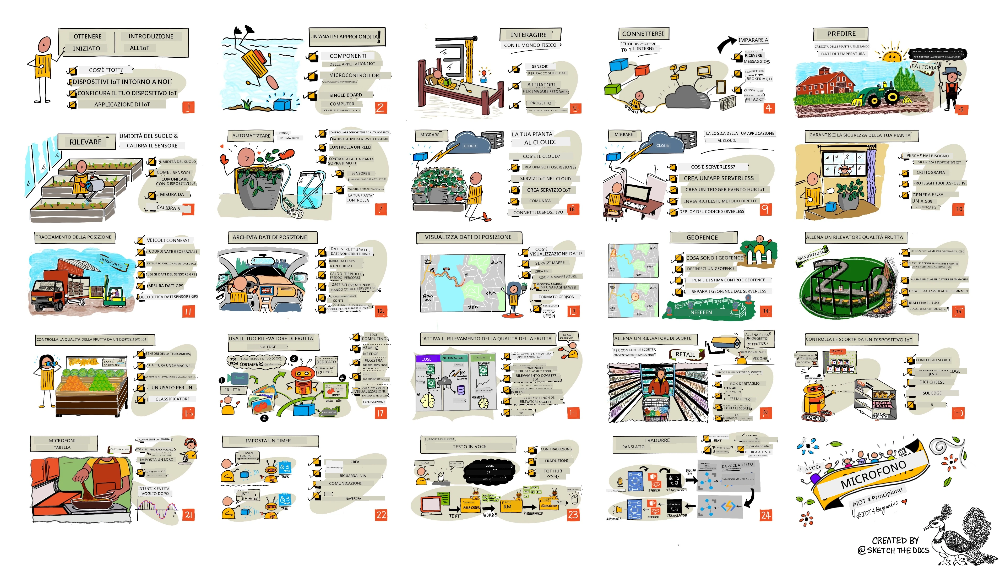

[](https://github.com/microsoft/IoT-For-Beginners/blob/master/LICENSE)
[](https://GitHub.com/microsoft/IoT-For-Beginners/graphs/contributors/)
[](https://GitHub.com/microsoft/IoT-For-Beginners/issues/)
[](https://GitHub.com/microsoft/IoT-For-Beginners/pulls/)
[](http://makeapullrequest.com)

[](https://GitHub.com/microsoft/IoT-For-Beginners/watchers/)
[](https://GitHub.com/microsoft/IoT-For-Beginners/network/)
[](https://GitHub.com/microsoft/IoT-For-Beginners/stargazers/)

### Unisciti alla Community Azure AI Foundry

Se ti blocchi o hai domande sulla creazione di app AI. Unisciti ad altri studenti e sviluppatori esperti nelle discussioni su MCP. È una comunità di supporto dove le domande sono benvenute e la conoscenza è condivisa liberamente.

[](https://discord.gg/nTYy5BXMWG)

Se hai feedback sul prodotto o errori durante la creazione visita:

[](https://aka.ms/foundry/forum)

Segui questi passaggi per iniziare a utilizzare queste risorse:
1. **Crea un Fork del Repository:** Clicca [](https://GitHub.com/microsoft/IoT-For-Beginners/fork)
2. **Clona il Repository:**   `git clone https://github.com/microsoft/IoT-For-Beginners.git`
3. [**Unisciti al Discord Microsot Foundry e incontra esperti e altri sviluppatori**](https://discord.com/invite/ByRwuEEgH4)


### 🌐 Supporto Multilingue

#### Supportato tramite GitHub Action (Automatizzato e Sempre Aggiornato)

<!-- CO-OP TRANSLATOR LANGUAGES TABLE START -->
[Arabo](../ar/README.md) | [Bengalese](../bn/README.md) | [Bulgaro](../bg/README.md) | [Birmano (Myanmar)](../my/README.md) | [Cinese (Semplificato)](../zh-CN/README.md) | [Cinese (Tradizionale, Hong Kong)](../zh-HK/README.md) | [Cinese (Tradizionale, Macao)](../zh-MO/README.md) | [Cinese (Tradizionale, Taiwan)](../zh-TW/README.md) | [Croato](../hr/README.md) | [Ceco](../cs/README.md) | [Danese](../da/README.md) | [Olandese](../nl/README.md) | [Estone](../et/README.md) | [Finlandese](../fi/README.md) | [Francese](../fr/README.md) | [Tedesco](../de/README.md) | [Greco](../el/README.md) | [Ebraico](../he/README.md) | [Hindi](../hi/README.md) | [Ungherese](../hu/README.md) | [Indonesiano](../id/README.md) | [Italiano](./README.md) | [Giapponese](../ja/README.md) | [Kannada](../kn/README.md) | [Khmer](../km/README.md) | [Coreano](../ko/README.md) | [Lituano](../lt/README.md) | [Malese](../ms/README.md) | [Malayalam](../ml/README.md) | [Marathi](../mr/README.md) | [Nepalese](../ne/README.md) | [Pidgin Nigeriano](../pcm/README.md) | [Norvegese](../no/README.md) | [Persiano (Farsi)](../fa/README.md) | [Polacco](../pl/README.md) | [Portoghese (Brasile)](../pt-BR/README.md) | [Portoghese (Portogallo)](../pt-PT/README.md) | [Punjabi (Gurmukhi)](../pa/README.md) | [Rumeno](../ro/README.md) | [Russo](../ru/README.md) | [Serbo (Cirillico)](../sr/README.md) | [Slovacco](../sk/README.md) | [Sloveno](../sl/README.md) | [Spagnolo](../es/README.md) | [Swahili](../sw/README.md) | [Svedese](../sv/README.md) | [Tagalog (Filippino)](../tl/README.md) | [Tamil](../ta/README.md) | [Telugu](../te/README.md) | [Thai](../th/README.md) | [Turco](../tr/README.md) | [Ucraino](../uk/README.md) | [Urdu](../ur/README.md) | [Vietnamita](../vi/README.md)

> **Preferisci Clonare Localmente?**
>
> Questo repository include più di 50 traduzioni linguistiche che aumentano significativamente la dimensione del download. Per clonare senza le traduzioni, usa sparse checkout:
>
> **Bash / macOS / Linux:**  
> ```bash
> git clone --filter=blob:none --sparse https://github.com/microsoft/IoT-For-Beginners.git
> cd IoT-For-Beginners
> git sparse-checkout set --no-cone '/*' '!translations' '!translated_images'
> ```
>
> **CMD (Windows):**  
> ```cmd
> git clone --filter=blob:none --sparse https://github.com/microsoft/IoT-For-Beginners.git
> cd IoT-For-Beginners
> git sparse-checkout set --no-cone "/*" "!translations" "!translated_images"
> ```
>
> Questo ti offre tutto il necessario per completare il corso con un download molto più veloce.
<!-- CO-OP TRANSLATOR LANGUAGES TABLE END -->

# IoT per Principianti - Un Curriculum

I Cloud Advocates di Azure presso Microsoft sono lieti di offrire un curriculum di 12 settimane, 24 lezioni, tutto sui concetti base dell'IoT. Ogni lezione include quiz prima e dopo la lezione, istruzioni scritte per completare la lezione, una soluzione, un compito e altro. La nostra pedagogia basata su progetti permette di imparare mentre si costruisce, un modo comprovato per far “attaccare” le nuove competenze.

I progetti riguardano il percorso del cibo dalla fattoria alla tavola. Ciò include agricoltura, logistica, produzione, vendita al dettaglio e consumatore - tutte aree industriali popolari per i dispositivi IoT.



> Sketchnote di [Nitya Narasimhan](https://github.com/nitya). Clicca sull'immagine per una versione più grande.

**Un sentito ringraziamento ai nostri autori [Jen Fox](https://github.com/jenfoxbot), [Jen Looper](https://github.com/jlooper), [Jim Bennett](https://github.com/jimbobbennett), e al nostro artista degli sketchnote [Nitya Narasimhan](https://github.com/nitya).**

**Grazie anche al nostro team di [Microsoft Learn Student Ambassadors](https://studentambassadors.microsoft.com?WT.mc_id=academic-17441-jabenn) che hanno revisionato e tradotto questo curriculum - [Aditya Garg](https://github.com/AdityaGarg00), [Anurag Sharma](https://github.com/Anurag-0-1-A), [Arpita Das](https://github.com/Arpiiitaaa), [Aryan Jain](https://www.linkedin.com/in/aryan-jain-47a4a1145/), [Bhavesh Suneja](https://github.com/EliteWarrior315), [Faith Hunja](https://faithhunja.github.io/), [Lateefah Bello](https://www.linkedin.com/in/lateefah-bello/), [Manvi Jha](https://github.com/Severus-Matthew), [Mireille Tan](https://www.linkedin.com/in/mireille-tan-a4834819a/), [Mohammad Iftekher (Iftu) Ebne Jalal](https://github.com/Iftu119), [Mohammad Zulfikar](https://github.com/mohzulfikar), [Priyanshu Srivastav](https://www.linkedin.com/in/priyanshu-srivastav-b067241ba), [Thanmai Gowducheruvu](https://github.com/innovation-platform), e [Zina Kamel](https://www.linkedin.com/in/zina-kamel/).**

Incontra il team!

[](https://youtu.be/-wippUJRi5k)

**Gif di** [Mohit Jaisal](https://linkedin.com/in/mohitjaisal)

> 🎥 Clicca sull'immagine sopra per un video sul progetto!

> **Insegnanti**, abbiamo [incluso alcuni suggerimenti](for-teachers.md) su come usare questo curriculum. Se volete creare le vostre lezioni, abbiamo anche incluso un [modello per le lezioni](lesson-template/README.md).

> **[Studenti](https://aka.ms/student-page)**, per usare questo curriculum in modo indipendente, fate un fork dell'intero repo e completate gli esercizi da soli, iniziando con un quiz pre-lezione, poi leggendo la lezione e completando le altre attività. Cercate di creare i progetti comprendendo le lezioni invece di copiare il codice della soluzione; comunque quel codice è disponibile nelle cartelle /solutions di ogni lezione orientata al progetto. Un'altra idea è formare un gruppo di studio con amici e seguire insieme i contenuti. Per ulteriori studi, consigliamo [Microsoft Learn](https://docs.microsoft.com/users/jimbobbennett/collections/ke2ehd351jopwr?WT.mc_id=academic-17441-jabenn).

Per una panoramica video di questo corso, guarda questo video:

[](https://youtube.com/watch?v=bccEMm8gRuc "Video promozionale")

> 🎥 Clicca sull'immagine sopra per un video sul progetto!

## Pedagogia

Abbiamo scelto due principi pedagogici mentre costruivamo questo curriculum: assicurarci che sia basato su progetti e che includa quiz frequenti. Alla fine di questa serie, gli studenti avranno costruito un sistema di monitoraggio e irrigazione delle piante, un tracciatore di veicoli, un impianto industriale smart per tracciare e controllare il cibo, un timer di cottura controllato a voce, e avranno imparato le basi dell'Internet delle Cose incluso come scrivere codice per dispositivi, connettersi al cloud, analizzare telemetria ed eseguire AI al bordo.

Garantendo che i contenuti si allineino ai progetti, il processo diventa più coinvolgente per gli studenti e la ritenzione dei concetti sarà aumentata.

Inoltre, un quiz a bassa pressione prima della lezione fissa l'intenzione dello studente verso l'apprendimento di un argomento, mentre un secondo quiz dopo la lezione assicura una ritenzione ulteriore. Questo curriculum è stato progettato per essere flessibile e divertente e può essere seguito per intero o in parte. I progetti iniziano piccoli e diventano sempre più complessi entro la fine del ciclo di 12 settimane.

Ogni progetto è basato su hardware reale disponibile a studenti e appassionati. Ogni progetto approfondisce il dominio specifico, fornendo conoscenze di base rilevanti. Per avere successo come sviluppatore è utile comprendere il dominio in cui si stanno risolvendo problemi; fornire questa conoscenza di base permette agli studenti di riflettere sulle loro soluzioni IoT e sugli apprendimenti nel contesto del tipo di problema reale che potrebbero dover risolvere come sviluppatori IoT. Gli studenti imparano il ‘perché’ delle soluzioni che stanno costruendo e acquisiscono un apprezzamento per l’utente finale.

## Hardware
Abbiamo due scelte di hardware IoT da utilizzare per i progetti, a seconda delle preferenze personali, della conoscenza o preferenza del linguaggio di programmazione, degli obiettivi di apprendimento e della disponibilità. Abbiamo anche fornito una versione di 'hardware virtuale' per chi non ha accesso all'hardware o vuole imparare di più prima di procedere con un acquisto. Puoi leggere di più e trovare una 'lista della spesa' nella [pagina hardware](./hardware.md), inclusi i link per acquistare kit completi dai nostri amici di Seeed Studio.

> 💁 Trova il nostro [Codice di Condotta](CODE_OF_CONDUCT.md), le linee guida per il [Contributo](CONTRIBUTING.md) e le [Traduzioni](..). Accogliamo con piacere il tuo feedback costruttivo!
>
> 🔧 Hai problemi? Consulta la nostra [Guida alla Risoluzione dei Problemi](TROUBLESHOOTING.md) per soluzioni ai problemi comuni.

## Ogni lezione include:

- appunti disegnati (sketchnote)
- video supplementare opzionale
- quiz preparatorio pre-lezione
- lezione scritta
- per le lezioni basate su progetti, guide passo-passo su come costruire il progetto
- verifiche di conoscenza
- una sfida
- letture supplementari
- compito
- [quiz post-lezione](https://ff-quizzes.netlify.app/en/)

> **Una nota sui quiz**: Tutti i quiz sono contenuti nella cartella quiz-app, per un totale di 48 quiz con tre domande ciascuno. Sono collegati all’interno delle lezioni ma l’app dei quiz può essere eseguita localmente o distribuita su Azure; segui le istruzioni nella cartella `quiz-app`. Stanno venendo progressivamente tradotti.

## Lezioni

|       |              Nome del Progetto              |                       Concetti Insegnati                       | Obiettivi di Apprendimento                                                                                                                                          |                                                        Lezione Collegata                                                         |
| :---: | :-----------------------------------------: | :------------------------------------------------------------: | ------------------------------------------------------------------------------------------------------------------------------------------------------------------ | :--------------------------------------------------------------------------------------------------------------------------: |
|  01   | [Primi passi](./1-getting-started/README.md) |                     Introduzione all’IoT                      | Impara i principi base dell’IoT e i componenti fondamentali delle soluzioni IoT come sensori e servizi cloud mentre configuri il tuo primo dispositivo IoT             |                      [Introduzione all’IoT](./1-getting-started/lessons/1-introduction-to-iot/README.md)                      |
|  02   | [Primi passi](./1-getting-started/README.md) |                   Approfondimento sull’IoT                    | Scopri di più sui componenti di un sistema IoT, oltre ai microcontrollori e ai computer a scheda singola                                                           |                        [Approfondimento sull’IoT](./1-getting-started/lessons/2-deeper-dive/README.md)                         |
|  03   | [Primi passi](./1-getting-started/README.md) | Interagire con il mondo fisico tramite sensori e attuatori   | Impara a conoscere sensori per raccogliere dati dal mondo fisico e attuatori per inviare feedback, mentre costruisci una luce notturna                               | [Interagire con il mondo fisico tramite sensori e attuatori](./1-getting-started/lessons/3-sensors-and-actuators/README.md) |
|  04   | [Primi passi](./1-getting-started/README.md) |             Connetti il tuo dispositivo a Internet            | Impara come collegare un dispositivo IoT a Internet per inviare e ricevere messaggi collegando la tua luce notturna a un broker MQTT                                |               [Connetti il tuo dispositivo a Internet](./1-getting-started/lessons/4-connect-internet/README.md)                |
|  05   |            [Fattoria](./2-farm/README.md)            |                    Prevedere la crescita delle piante         | Impara a prevedere la crescita delle piante usando dati di temperatura catturati da un dispositivo IoT                                                              |                          [Prevedere la crescita delle piante](./2-farm/lessons/1-predict-plant-growth/README.md)                           |
|  06   |            [Fattoria](./2-farm/README.md)            |                    Rilevare l’umidità del terreno             | Impara a rilevare l’umidità del terreno e calibrare un sensore di umidità                                                                                            |                          [Rilevare l’umidità del terreno](./2-farm/lessons/2-detect-soil-moisture/README.md)                           |
|  07   |            [Fattoria](./2-farm/README.md)            |                  Irrigazione automatica delle piante         | Impara a automatizzare e temporizzare l’irrigazione usando un relè e MQTT                                                                                           |                      [Irrigazione automatica delle piante](./2-farm/lessons/3-automated-plant-watering/README.md)                       |
|  08   |            [Fattoria](./2-farm/README.md)            |               Migra la tua pianta al cloud                    | Impara cos’è il cloud e i servizi IoT ospitati nel cloud e come connettere la tua pianta a uno di questi invece di un broker MQTT pubblico                           |               [Migra la tua pianta al cloud](./2-farm/lessons/4-migrate-your-plant-to-the-cloud/README.md)                |
|  09   |            [Fattoria](./2-farm/README.md)            |         Migra la logica della tua applicazione al cloud      | Impara come scrivere logiche applicative nel cloud che rispondono ai messaggi IoT                                                                                    |         [Migra la logica della tua applicazione al cloud](./2-farm/lessons/5-migrate-application-to-the-cloud/README.md)         |
|  10   |            [Fattoria](./2-farm/README.md)            |                   Mantieni la tua pianta al sicuro            | Impara la sicurezza con l’IoT e come mantenere la tua pianta sicura con chiavi e certificati                                                                        |                        [Mantieni la tua pianta al sicuro](./2-farm/lessons/6-keep-your-plant-secure/README.md)                         |
|  11   |       [Trasporto](./3-transport/README.md)       |                      Tracciamento della posizione             | Impara il tracciamento GPS della posizione per dispositivi IoT                                                                                                      |                           [Tracciamento della posizione](./3-transport/lessons/1-location-tracking/README.md)                           |
|  12   |       [Trasporto](./3-transport/README.md)       |                     Memorizzare dati di posizione             | Impara come salvare dati IoT per visualizzarli o analizzarli in seguito                                                                                             |                         [Memorizzare dati di posizione](./3-transport/lessons/2-store-location-data/README.md)                         |
|  13   |       [Trasporto](./3-transport/README.md)       |                   Visualizzare dati di posizione              | Impara a visualizzare dati di posizione su una mappa e come le mappe rappresentano il mondo 3D reale in 2 dimensioni                                                |                     [Visualizzare dati di posizione](./3-transport/lessons/3-visualize-location-data/README.md)                     |
|  14   |       [Trasporto](./3-transport/README.md)       |                          Geofence                              | Impara cosa sono le geofence e come possono essere usate per avvisare quando veicoli nella catena di fornitura sono vicini alla loro destinazione                    |                                   [Geofence](./3-transport/lessons/4-geofences/README.md)                                   |
|  15   |   [Manifatturiero](./4-manufacturing/README.md)   |               Addestrare un rilevatore della qualità della frutta             | Impara a addestrare un classificatore di immagini nel cloud per rilevare la qualità della frutta                                                                    |                 [Addestrare un rilevatore della qualità della frutta](./4-manufacturing/lessons/1-train-fruit-detector/README.md)                 |
|  16   |   [Manifatturiero](./4-manufacturing/README.md)   |           Controllare la qualità della frutta da un dispositivo IoT           | Impara a usare il tuo rilevatore di qualità della frutta da un dispositivo IoT                                                                                      |           [Controllare la qualità della frutta da un dispositivo IoT](./4-manufacturing/lessons/2-check-fruit-from-device/README.md)            |
|  17   |   [Manifatturiero](./4-manufacturing/README.md)   |             Esegui il tuo rilevatore di frutta sul edge      | Impara a far funzionare il tuo rilevatore di frutta su un dispositivo IoT sul edge                                                                                  |             [Esegui il tuo rilevatore di frutta sul edge](./4-manufacturing/lessons/3-run-fruit-detector-edge/README.md)             |
|  18   |   [Manifatturiero](./4-manufacturing/README.md)   |        Scatena il rilevamento della qualità della frutta da un sensore         | Impara a scatenare il rilevamento della qualità della frutta da un sensore                                                                                          |        [Scatena il rilevamento della qualità della frutta da un sensore](./4-manufacturing/lessons/4-trigger-fruit-detector/README.md)         |
|  19   |          [Vendita al dettaglio](./5-retail/README.md)          |                   Addestrare un rilevatore di stock          | Impara a usare il rilevamento oggetti per addestrare un rilevatore di stock per conteggiare il magazzino in un negozio                                             |                        [Addestrare un rilevatore di stock](./5-retail/lessons/1-train-stock-detector/README.md)                         |
|  20   |          [Vendita al dettaglio](./5-retail/README.md)          |               Controllare lo stock da un dispositivo IoT     | Impara a controllare lo stock da un dispositivo IoT usando un modello di rilevamento oggetti                                                                        |                     [Controllare lo stock da un dispositivo IoT](./5-retail/lessons/2-check-stock-device/README.md)                      |
|  21   |        [Consumo](./6-consumer/README.md)        |             Riconoscere il parlato con un dispositivo IoT   | Impara a riconoscere il parlato da un dispositivo IoT per costruire un timer intelligente                                                                           |                  [Riconoscere il parlato con un dispositivo IoT](./6-consumer/lessons/1-speech-recognition/README.md)                  |
|  22   |        [Consumo](./6-consumer/README.md)        |                     Comprendere il linguaggio                 | Impara a comprendere le frasi pronunciate a un dispositivo IoT                                                                                                    |                        [Comprendere il linguaggio](./6-consumer/lessons/2-language-understanding/README.md)                        |
|  23   |        [Consumo](./6-consumer/README.md)        |           Impostare un timer e fornire feedback vocale       | Impara a impostare un timer su un dispositivo IoT e fornire feedback vocale quando il timer è impostato e quando finisce                                           |                 [Impostare un timer e fornire feedback vocale](./6-consumer/lessons/3-spoken-feedback/README.md)                  |
|  24   |        [Consumo](./6-consumer/README.md)        |                 Supportare più lingue                        | Impara a supportare più lingue, sia nel parlato che nelle risposte dal tuo timer intelligente                                                                      |                   [Supportare più lingue](./6-consumer/lessons/4-multiple-language-support/README.md)                   |

## Accesso offline

Puoi eseguire questa documentazione offline usando [Docsify](https://docsify.js.org/#/). Fai il fork di questo repo, [installa Docsify](https://docsify.js.org/#/quickstart) sulla tua macchina locale e poi nella cartella radice di questo repo digita `docsify serve`. Il sito web sarà servito sulla porta 3000 del tuo localhost: `localhost:3000`.

## Quiz

Grazie alla comunità per aver ospitato il quiz interattivo che mette alla prova le tue conoscenze su ciascuno dei capitoli. Puoi testare le tue conoscenze [qui](https://ff-quizzes.netlify.app/en/)

### PDF

Puoi generare un PDF di questo contenuto per accesso offline se necessario. Per farlo, assicurati di avere [npm installato](https://docs.npmjs.com/downloading-and-installing-node-js-and-npm) ed esegui i seguenti comandi nella cartella radice di questo repo:

```sh
npm i
npm run convert
```

### Slide

Ci sono delle presentazioni per alcune lezioni nella cartella [slides](../../slides).

## Altri curricula

Il nostro team produce altri curricula! Dai un’occhiata:

<!-- CO-OP TRANSLATOR OTHER COURSES START -->
### LangChain
[](https://aka.ms/langchain4j-for-beginners)
[](https://aka.ms/langchainjs-for-beginners?WT.mc_id=m365-94501-dwahlin)
[](https://github.com/microsoft/langchain-for-beginners?WT.mc_id=m365-94501-dwahlin)
---

### Azure / Edge / MCP / Agents
[](https://github.com/microsoft/AZD-for-beginners?WT.mc_id=academic-105485-koreyst)
[](https://github.com/microsoft/edgeai-for-beginners?WT.mc_id=academic-105485-koreyst)
[](https://github.com/microsoft/mcp-for-beginners?WT.mc_id=academic-105485-koreyst)
[](https://github.com/microsoft/ai-agents-for-beginners?WT.mc_id=academic-105485-koreyst)

---
 
### Serie di AI Generativa
[](https://github.com/microsoft/generative-ai-for-beginners?WT.mc_id=academic-105485-koreyst)
[-9333EA?style=for-the-badge&labelColor=E5E7EB&color=9333EA)](https://github.com/microsoft/Generative-AI-for-beginners-dotnet?WT.mc_id=academic-105485-koreyst)
[-C084FC?style=for-the-badge&labelColor=E5E7EB&color=C084FC)](https://github.com/microsoft/generative-ai-for-beginners-java?WT.mc_id=academic-105485-koreyst)
[-E879F9?style=for-the-badge&labelColor=E5E7EB&color=E879F9)](https://github.com/microsoft/generative-ai-with-javascript?WT.mc_id=academic-105485-koreyst)

---
 
### Apprendimento Core
[](https://aka.ms/ml-beginners?WT.mc_id=academic-105485-koreyst)
[](https://aka.ms/datascience-beginners?WT.mc_id=academic-105485-koreyst)
[](https://aka.ms/ai-beginners?WT.mc_id=academic-105485-koreyst)
[](https://github.com/microsoft/Security-101?WT.mc_id=academic-96948-sayoung)
[](https://aka.ms/webdev-beginners?WT.mc_id=academic-105485-koreyst)
[](https://aka.ms/iot-beginners?WT.mc_id=academic-105485-koreyst)
[](https://github.com/microsoft/xr-development-for-beginners?WT.mc_id=academic-105485-koreyst)

---
 
### Serie Copilot
[](https://aka.ms/GitHubCopilotAI?WT.mc_id=academic-105485-koreyst)
[](https://github.com/microsoft/mastering-github-copilot-for-dotnet-csharp-developers?WT.mc_id=academic-105485-koreyst)
[](https://github.com/microsoft/CopilotAdventures?WT.mc_id=academic-105485-koreyst)
<!-- CO-OP TRANSLATOR OTHER COURSES END -->

## Attribuzioni delle immagini

Puoi trovare tutte le attribuzioni per le immagini usate in questo curriculum dove richiesto in [Attribuzioni](./attributions.md).

---

<!-- CO-OP TRANSLATOR DISCLAIMER START -->
**Disclaimer**:
Questo documento è stato tradotto utilizzando il servizio di traduzione automatica [Co-op Translator](https://github.com/Azure/co-op-translator). Sebbene ci impegniamo per l'accuratezza, si prega di essere consapevoli che le traduzioni automatiche possono contenere errori o inesattezze. Il documento originale nella sua lingua natale deve essere considerato la fonte autorevole. Per informazioni critiche, si raccomanda una traduzione professionale umana. Non siamo responsabili per eventuali fraintendimenti o interpretazioni errate derivanti dall'uso di questa traduzione.
<!-- CO-OP TRANSLATOR DISCLAIMER END -->