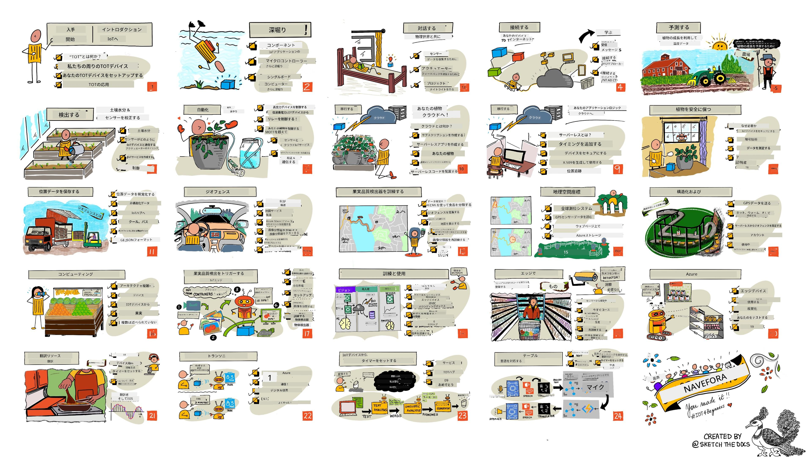

<!--
CO_OP_TRANSLATOR_METADATA:
{
  "original_hash": "6c354ec3487e4f6cfafbe44557996cd9",
  "translation_date": "2026-01-05T21:43:36+00:00",
  "source_file": "README.md",
  "language_code": "ja"
}
-->
[](https://github.com/microsoft/IoT-For-Beginners/blob/master/LICENSE)
[](https://GitHub.com/microsoft/IoT-For-Beginners/graphs/contributors/)
[](https://GitHub.com/microsoft/IoT-For-Beginners/issues/)
[](https://GitHub.com/microsoft/IoT-For-Beginners/pulls/)
[](http://makeapullrequest.com)

[](https://GitHub.com/microsoft/IoT-For-Beginners/watchers/)
[](https://GitHub.com/microsoft/IoT-For-Beginners/network/)
[](https://GitHub.com/microsoft/IoT-For-Beginners/stargazers/)

### Azure AI Foundry コミュニティに参加しよう

AIアプリの構築で行き詰まったり質問がある場合は、MCPについて学ぶ仲間や経験豊富な開発者たちと一緒に議論しませんか。ここは質問が歓迎され、知識が自由に共有されるサポーティブなコミュニティです。

[](https://discord.gg/nTYy5BXMWG)

製品のフィードバックやビルド中のエラーがある場合は以下をご利用ください：

[](https://aka.ms/foundry/forum)

これらのリソースを使い始めるには以下の手順を踏んでください：
1. **リポジトリをフォーク**: クリック [](https://GitHub.com/microsoft/IoT-For-Beginners/fork)
2. **リポジトリをクローン**: `git clone https://github.com/microsoft/IoT-For-Beginners.git`
3. [**Microsoft Foundry Discord に参加して専門家や他の開発者と交流しよう**](https://discord.com/invite/ByRwuEEgH4)


### 🌐 多言語対応

#### GitHub Actions でサポート（自動かつ常に最新）

<!-- CO-OP TRANSLATOR LANGUAGES TABLE START -->
[Arabic](../ar/README.md) | [Bengali](../bn/README.md) | [Bulgarian](../bg/README.md) | [Burmese (Myanmar)](../my/README.md) | [Chinese (Simplified)](../zh/README.md) | [Chinese (Traditional, Hong Kong)](../hk/README.md) | [Chinese (Traditional, Macau)](../mo/README.md) | [Chinese (Traditional, Taiwan)](../tw/README.md) | [Croatian](../hr/README.md) | [Czech](../cs/README.md) | [Danish](../da/README.md) | [Dutch](../nl/README.md) | [Estonian](../et/README.md) | [Finnish](../fi/README.md) | [French](../fr/README.md) | [German](../de/README.md) | [Greek](../el/README.md) | [Hebrew](../he/README.md) | [Hindi](../hi/README.md) | [Hungarian](../hu/README.md) | [Indonesian](../id/README.md) | [Italian](../it/README.md) | [Japanese](./README.md) | [Kannada](../kn/README.md) | [Korean](../ko/README.md) | [Lithuanian](../lt/README.md) | [Malay](../ms/README.md) | [Malayalam](../ml/README.md) | [Marathi](../mr/README.md) | [Nepali](../ne/README.md) | [Nigerian Pidgin](../pcm/README.md) | [Norwegian](../no/README.md) | [Persian (Farsi)](../fa/README.md) | [Polish](../pl/README.md) | [Portuguese (Brazil)](../br/README.md) | [Portuguese (Portugal)](../pt/README.md) | [Punjabi (Gurmukhi)](../pa/README.md) | [Romanian](../ro/README.md) | [Russian](../ru/README.md) | [Serbian (Cyrillic)](../sr/README.md) | [Slovak](../sk/README.md) | [Slovenian](../sl/README.md) | [Spanish](../es/README.md) | [Swahili](../sw/README.md) | [Swedish](../sv/README.md) | [Tagalog (Filipino)](../tl/README.md) | [Tamil](../ta/README.md) | [Telugu](../te/README.md) | [Thai](../th/README.md) | [Turkish](../tr/README.md) | [Ukrainian](../uk/README.md) | [Urdu](../ur/README.md) | [Vietnamese](../vi/README.md)

> **ローカルでクローンしたい場合？**

> 本リポジトリには50以上の言語翻訳が含まれているため、ダウンロードサイズが大きくなります。翻訳を含まずにクローンするにはスパースチェックアウトを使用してください:
> ```bash
> git clone --filter=blob:none --sparse https://github.com/microsoft/IoT-For-Beginners.git
> cd IoT-For-Beginners
> git sparse-checkout set --no-cone '/*' '!translations' '!translated_images'
> ```
> コース完遂に必要なものだけを高速にダウンロードできます。
<!-- CO-OP TRANSLATOR LANGUAGES TABLE END -->

# 初心者向けIoT - カリキュラム

マイクロソフトのAzure Cloud Advocatesチームは、IoTの基本を学べる12週間、24レッスンのカリキュラムを提供します。各レッスンには、事前・事後のクイズ、レッスン完了手順の説明、解決策、課題などが含まれます。本プロジェクトベースの教育手法により、実際に作りながら学べ、スキルの定着に効果的です。

プロジェクトは食品が農場から食卓に届くまでの流れをカバーしています。農業、物流、製造、小売、消費者というIoTデバイスの一般的な産業領域を扱います。



> スケッチノートは [Nitya Narasimhan](https://github.com/nitya) によるものです。画像をクリックすると拡大表示されます。

**著者の [Jen Fox](https://github.com/jenfoxbot)、[Jen Looper](https://github.com/jlooper)、[Jim Bennett](https://github.com/jimbobbennett)とスケッチノート作成者の[Nitya Narasimhan](https://github.com/nitya)に心より感謝します。**

**さらに本カリキュラムのレビューと翻訳に協力いただいた [Microsoft Learn Student Ambassadors](https://studentambassadors.microsoft.com?WT.mc_id=academic-17441-jabenn) チームにも感謝します - [Aditya Garg](https://github.com/AdityaGarg00)、[Anurag Sharma](https://github.com/Anurag-0-1-A)、[Arpita Das](https://github.com/Arpiiitaaa)、[Aryan Jain](https://www.linkedin.com/in/aryan-jain-47a4a1145/)、[Bhavesh Suneja](https://github.com/EliteWarrior315)、[Faith Hunja](https://faithhunja.github.io/)、[Lateefah Bello](https://www.linkedin.com/in/lateefah-bello/)、[Manvi Jha](https://github.com/Severus-Matthew)、[Mireille Tan](https://www.linkedin.com/in/mireille-tan-a4834819a/)、[Mohammad Iftekher (Iftu) Ebne Jalal](https://github.com/Iftu119)、[Mohammad Zulfikar](https://github.com/mohzulfikar)、[Priyanshu Srivastav](https://www.linkedin.com/in/priyanshu-srivastav-b067241ba)、[Thanmai Gowducheruvu](https://github.com/innovation-platform)、および [Zina Kamel](https://www.linkedin.com/in/zina-kamel/) です。**

チームを紹介します！

[](https://youtu.be/-wippUJRi5k)

**Gif作成者:** [Mohit Jaisal](https://linkedin.com/in/mohitjaisal)

> 🎥 上の画像をクリックするとプロジェクトの動画が見られます！

> **先生用に** [本カリキュラムの活用方法に関する提案](for-teachers.md)を用意しています。オリジナルのレッスンを作りたい方には [レッスンテンプレート](lesson-template/README.md)もご提供しています。

> **[学生の皆さん](https://aka.ms/student-page)**、このカリキュラムを自分で使う場合は、リポジトリをフォークして事前クイズから始め、講義を読み、課題を完了してください。コードをコピーするのではなくレッスン内容を理解してプロジェクトを作ってみましょう。解決策のコードは各プロジェクト向けレッスンの /solutions フォルダにあります。友達と学習グループを作って一緒に進めるのもおすすめです。さらに学習を続けたい方は[Microsoft Learn](https://docs.microsoft.com/users/jimbobbennett/collections/ke2ehd351jopwr?WT.mc_id=academic-17441-jabenn)を参照してください。

本コースの概要動画はこちら：

[](https://youtube.com/watch?v=bccEMm8gRuc "プロモ動画")

> 🎥 上の画像をクリックするとプロジェクトの動画が見られます！

## 教育方針

このカリキュラムでは、プロジェクトベースであることと頻繁にクイズを含むこと、という2つの教育理念を採用しました。シリーズを終える頃には、植物モニタリング・灌漑システム、車両追跡システム、食品の追跡と確認ができるスマート工場、音声操作クッキングタイマーを作り、IoTの基礎（デバイスコードの書き方、クラウド接続、テレメトリ解析、エッジAIの運用）を習得していることでしょう。

プロジェクトに合わせた内容設計で、学習者の興味を引きつけ、理解の定着が促進されます。

また、授業前の低負荷なクイズで学習意欲を高め、授業後のクイズで理解度をさらに深めます。カリキュラムは柔軟で楽しく取り組めるよう設計されており、全てまたは一部を選んで履修可能です。プロジェクトは簡単なものから始まり、12週間の終盤には高度な内容になります。

各プロジェクトは学生やホビイストが実際に使えるハードウェアを用いています。プロジェクト毎に関連する背景知識を提供し、問題解決の対象となる領域を理解できるよう支援しています。開発者として成功するためには、解決しようとしている分野を理解することが重要です。これにより、IoTソリューションや学びを現実の問題に結びつけて考えられるようになります。学生は作るソリューションの”なぜ”を理解し、最終利用者への理解も深まります。

## ハードウェア

プロジェクト用のIoTハードウェアは、個人の好み、プログラミング言語の知識や好み、学習目標、入手可能性に応じて2種類の選択肢があります。ハードを持っていない方や購入前にもっと学びたい方向けに「仮想ハードウェア」版も用意しています。詳細や完全なキット購入リンクは[ハードウェアページ](./hardware.md)でご覧いただけます。Seeed Studioの友人たちからのキットもリンクしています。
> 💁 私たちの[行動規範](CODE_OF_CONDUCT.md)、[貢献ガイドライン](CONTRIBUTING.md)、[翻訳ガイドライン](TRANSLATIONS.md)をご覧ください。建設的なフィードバックを歓迎します！
>
> 🔧 問題が発生しましたか？一般的な問題の解決策については、[トラブルシューティングガイド](TROUBLESHOOTING.md)をチェックしてください。

## 各レッスンには以下が含まれています：

- スケッチノート
- 任意の補足ビデオ
- レッスン前ウォームアップクイズ
- 文章によるレッスン
- プロジェクトベースのレッスンの場合、プロジェクトを構築するためのステップバイステップガイド
- 知識確認
- チャレンジ
- 補足読書
- 課題
- [レッスンクイズ](https://ff-quizzes.netlify.app/en/)

> **クイズについての注意**：すべてのクイズはquiz-appフォルダーに格納されており、合計48のクイズ（それぞれ3問ずつ）があります。レッスン内からリンクされていますが、quiz-appはローカルで実行したりAzureにデプロイすることもできます。quiz-appフォルダー内の指示に従ってください。順次ローカライズされています。

## レッスン

|       |              プロジェクト名              |                       教える概念                       | 学習目標                                                                                                                                                           |                                                        リンクされたレッスン                                                         |
| :---: | :------------------------------------: | :----------------------------------------------------: | ----------------------------------------------------------------------------------------------------------------------------------------------------------------- | :----------------------------------------------------------------------------------------------------------------------------: |
|  01   | [Getting started](./1-getting-started/README.md) |                     IoTの紹介                     | IoTの基本原理と、センサーやクラウドサービスなどのIoTソリューションの基本的な構成要素について学びながら、最初のIoTデバイスをセットアップする方法を習得する |                      [IoTの紹介](./1-getting-started/lessons/1-introduction-to-iot/README.md)                      |
|  02   | [Getting started](./1-getting-started/README.md) |                   IoTのより深い理解                    | IoTシステムの構成要素やマイクロコントローラ、シングルボードコンピュータについてより詳しく学ぶ                                                               |                        [IoTのより深い理解](./1-getting-started/lessons/2-deeper-dive/README.md)                         |
|  03   | [Getting started](./1-getting-started/README.md) | センサーとアクチュエーターを用いて物理世界と相互作用 | 物理世界からデータを収集するセンサーとフィードバックを送信するアクチュエーターについて学びながら、ナイトライトを作成する                                      | [センサーとアクチュエーターで物理世界と相互作用](./1-getting-started/lessons/3-sensors-and-actuators/README.md) |
|  04   | [Getting started](./1-getting-started/README.md) |             デバイスをインターネットに接続             | ナイトライトをMQTTブローカーに接続して、IoTデバイスをインターネットに接続しメッセージの送受信方法を学ぶ                                                       |               [デバイスをインターネットに接続](./1-getting-started/lessons/4-connect-internet/README.md)                |
|  05   |            [Farm](./2-farm/README.md)            |                    植物の成長予測                     | IoTデバイスで収集した温度データを使って植物の成長を予測する方法を学ぶ                                                                                           |                          [植物の成長予測](./2-farm/lessons/1-predict-plant-growth/README.md)                           |
|  06   |            [Farm](./2-farm/README.md)            |                    土壌の湿度検出                     | 土壌の湿度を検出し、土壌湿度センサーの校正方法を学ぶ                                                                                                           |                          [土壌の湿度検出](./2-farm/lessons/2-detect-soil-moisture/README.md)                           |
|  07   |            [Farm](./2-farm/README.md)            |                  自動植物灌水システム                   | リレーとMQTTを使って水やりを自動化しタイミングを制御する方法を学ぶ                                                                                               |                      [自動植物灌水システム](./2-farm/lessons/3-automated-plant-watering/README.md)                       |
|  08   |            [Farm](./2-farm/README.md)            |               植物のクラウドへの移行               | クラウドおよびクラウドホストされたIoTサービスについて学び、植物を公共のMQTTブローカーの代わりにこれらのクラウド接続に切り替える方法を理解する                   |               [植物のクラウドへの移行](./2-farm/lessons/4-migrate-your-plant-to-the-cloud/README.md)                |
|  09   |            [Farm](./2-farm/README.md)            |         アプリケーションロジックをクラウドに移行         | IoTメッセージに応答するクラウド上のアプリケーションロジックの作成方法を学ぶ                                                                                     |         [アプリケーションロジックをクラウドに移行](./2-farm/lessons/5-migrate-application-to-the-cloud/README.md)         |
|  10   |            [Farm](./2-farm/README.md)            |                   植物のセキュリティを保持                    | IoTのセキュリティと鍵や証明書を使って植物を安全に保つ方法を学ぶ                                                                                                 |                        [植物のセキュリティを保持](./2-farm/lessons/6-keep-your-plant-secure/README.md)                         |
|  11   |       [Transport](./3-transport/README.md)       |                      位置追跡                      | IoTデバイスのGPS位置追跡について学ぶ                                                                                                                             |                           [位置追跡](./3-transport/lessons/1-location-tracking/README.md)                           |
|  12   |       [Transport](./3-transport/README.md)       |                     位置データの保存                     | 後で視覚化または分析可能なIoTデータの保存方法を学ぶ                                                                                                              |                         [位置データの保存](./3-transport/lessons/2-store-location-data/README.md)                         |
|  13   |       [Transport](./3-transport/README.md)       |                   位置データの視覚化                   | 地図上での位置データの視覚化や地図が実際の3D世界を2次元で表現する方法について学ぶ                                                                                |                     [位置データの視覚化](./3-transport/lessons/3-visualize-location-data/README.md)                     |
|  14   |       [Transport](./3-transport/README.md)       |                          ジオフェンス                          | ジオフェンスとは何か、そしてサプライチェーン内の車両が目的地に近づいた際に警告を出すための利用方法を学ぶ                                                       |                                   [ジオフェンス](./3-transport/lessons/4-geofences/README.md)                                   |
|  15   |   [Manufacturing](./4-manufacturing/README.md)   |               果物品質検出器の訓練                | クラウドで画像分類器を訓練して果物の品質を識別する方法を学ぶ                                                                                                     |                 [果物品質検出器の訓練](./4-manufacturing/lessons/1-train-fruit-detector/README.md)                 |
|  16   |   [Manufacturing](./4-manufacturing/README.md)   |           IoTデバイスからの果物品質確認            | IoTデバイスから果物品質検出器を利用する方法を学ぶ                                                                                                               |           [IoTデバイスからの果物品質確認](./4-manufacturing/lessons/2-check-fruit-from-device/README.md)            |
|  17   |   [Manufacturing](./4-manufacturing/README.md)   |             エッジ上で果物検出器を実行             | エッジ上のIoTデバイスで果物検出器を実行する方法を学ぶ                                                                                                           |             [エッジ上で果物検出器を実行](./4-manufacturing/lessons/3-run-fruit-detector-edge/README.md)             |
|  18   |   [Manufacturing](./4-manufacturing/README.md)   |        センサーから果物品質検出をトリガー        | センサーから果物品質検出をトリガーする方法を学ぶ                                                                                                               |        [センサーから果物品質検出をトリガー](./4-manufacturing/lessons/4-trigger-fruit-detector/README.md)         |
|  19   |          [Retail](./5-retail/README.md)          |                   在庫検出器の訓練                    | 物体検出を使って店舗での在庫をカウントするための在庫検出器を訓練する方法を学ぶ                                                                                |                        [在庫検出器の訓練](./5-retail/lessons/1-train-stock-detector/README.md)                         |
|  20   |          [Retail](./5-retail/README.md)          |               IoTデバイスからの在庫確認                | 物体検出モデルを使ってIoTデバイスから在庫を確認する方法を学ぶ                                                                                                 |                     [IoTデバイスからの在庫確認](./5-retail/lessons/2-check-stock-device/README.md)                      |
|  21   |        [Consumer](./6-consumer/README.md)        |             IoTデバイスで音声認識             | IoTデバイスからの音声認識によるスマートタイマーの作成方法を学ぶ                                                                                               |                  [IoTデバイスで音声認識](./6-consumer/lessons/1-speech-recognition/README.md)                  |
|  22   |        [Consumer](./6-consumer/README.md)        |                     言語理解                     | IoTデバイスに話しかけられた文を理解する方法を学ぶ                                                                                                           |                        [言語理解](./6-consumer/lessons/2-language-understanding/README.md)                        |
|  23   |        [Consumer](./6-consumer/README.md)        |           タイマーセットと言語フィードバック           | IoTデバイスでタイマーをセットし、セット時と終了時に音声でフィードバックを提供する方法を学ぶ                                                    |                 [タイマーセットと言語フィードバック](./6-consumer/lessons/3-spoken-feedback/README.md)                  |
|  24   |        [Consumer](./6-consumer/README.md)        |                 複数言語のサポート                  | スマートタイマーへの話しかけや返答の際に複数言語をサポートする方法を学ぶ                                                               |                   [複数言語のサポート](./6-consumer/lessons/4-multiple-language-support/README.md)                   |

## オフラインアクセス

[Docsify](https://docsify.js.org/#/)を使ってオフラインでもこのドキュメントを実行できます。このリポジトリをフォークし、ローカルマシンに[Docsifyをインストール](https://docsify.js.org/#/quickstart)し、リポジトリのルートフォルダーで `docsify serve` と入力してください。ウェブサイトはローカルホストのポート3000で提供されます：`localhost:3000`。

## クイズ

インタラクティブなクイズをホスティングしてくださるコミュニティに感謝します。各章での知識をテストできます。[ここで知識を試してください](https://ff-quizzes.netlify.app/en/)

### PDF

必要に応じて、オフラインアクセスのためにこの内容のPDFを生成できます。そのためには[npmがインストールされていることを確認](https://docs.npmjs.com/downloading-and-installing-node-js-and-npm)し、このリポジトリのルートフォルダーで次のコマンドを実行してください：

```sh
npm i
npm run convert
```

### スライド

いくつかのレッスンのスライドデッキは[slides](../../slides)フォルダーにあります。

## その他のカリキュラム

私たちのチームは他のカリキュラムも制作しています！ぜひご覧ください：

<!-- CO-OP TRANSLATOR OTHER COURSES START -->
### LangChain
[](https://aka.ms/langchain4j-for-beginners)
[](https://aka.ms/langchainjs-for-beginners?WT.mc_id=m365-94501-dwahlin)

---

### Azure / Edge / MCP / Agents
[](https://github.com/microsoft/AZD-for-beginners?WT.mc_id=academic-105485-koreyst)
[](https://github.com/microsoft/edgeai-for-beginners?WT.mc_id=academic-105485-koreyst)
[](https://github.com/microsoft/mcp-for-beginners?WT.mc_id=academic-105485-koreyst)
[](https://github.com/microsoft/ai-agents-for-beginners?WT.mc_id=academic-105485-koreyst)

---
 
### 生成AIシリーズ
[](https://github.com/microsoft/generative-ai-for-beginners?WT.mc_id=academic-105485-koreyst)
[-9333EA?style=for-the-badge&labelColor=E5E7EB&color=9333EA)](https://github.com/microsoft/Generative-AI-for-beginners-dotnet?WT.mc_id=academic-105485-koreyst)
[-C084FC?style=for-the-badge&labelColor=E5E7EB&color=C084FC)](https://github.com/microsoft/generative-ai-for-beginners-java?WT.mc_id=academic-105485-koreyst)
[-E879F9?style=for-the-badge&labelColor=E5E7EB&color=E879F9)](https://github.com/microsoft/generative-ai-with-javascript?WT.mc_id=academic-105485-koreyst)

---
 
### コアラーニング
[](https://aka.ms/ml-beginners?WT.mc_id=academic-105485-koreyst)
[](https://aka.ms/datascience-beginners?WT.mc_id=academic-105485-koreyst)
[](https://aka.ms/ai-beginners?WT.mc_id=academic-105485-koreyst)
[](https://github.com/microsoft/Security-101?WT.mc_id=academic-96948-sayoung)
[](https://aka.ms/webdev-beginners?WT.mc_id=academic-105485-koreyst)
[](https://aka.ms/iot-beginners?WT.mc_id=academic-105485-koreyst)
[](https://github.com/microsoft/xr-development-for-beginners?WT.mc_id=academic-105485-koreyst)

---
 
### Copilotシリーズ
[](https://aka.ms/GitHubCopilotAI?WT.mc_id=academic-105485-koreyst)
[](https://github.com/microsoft/mastering-github-copilot-for-dotnet-csharp-developers?WT.mc_id=academic-105485-koreyst)
[](https://github.com/microsoft/CopilotAdventures?WT.mc_id=academic-105485-koreyst)
<!-- CO-OP TRANSLATOR OTHER COURSES END -->

## 画像の帰属

このカリキュラムで使用されている画像のすべての帰属情報は、[Attributions](./attributions.md)でご覧いただけます。

---

<!-- CO-OP TRANSLATOR DISCLAIMER START -->
**免責事項**：  
本書類はAI翻訳サービス「Co-op Translator」（https://github.com/Azure/co-op-translator）を使用して翻訳されています。正確さを期しておりますが、自動翻訳には誤りや不正確な部分が含まれる場合があります。原文が記載された元の言語の文書を権威ある情報源としてご参照ください。重要な情報については、専門の人間による翻訳をお勧めします。本翻訳の利用により生じたいかなる誤解や誤訳についても、当方は一切の責任を負いかねます。
<!-- CO-OP TRANSLATOR DISCLAIMER END -->