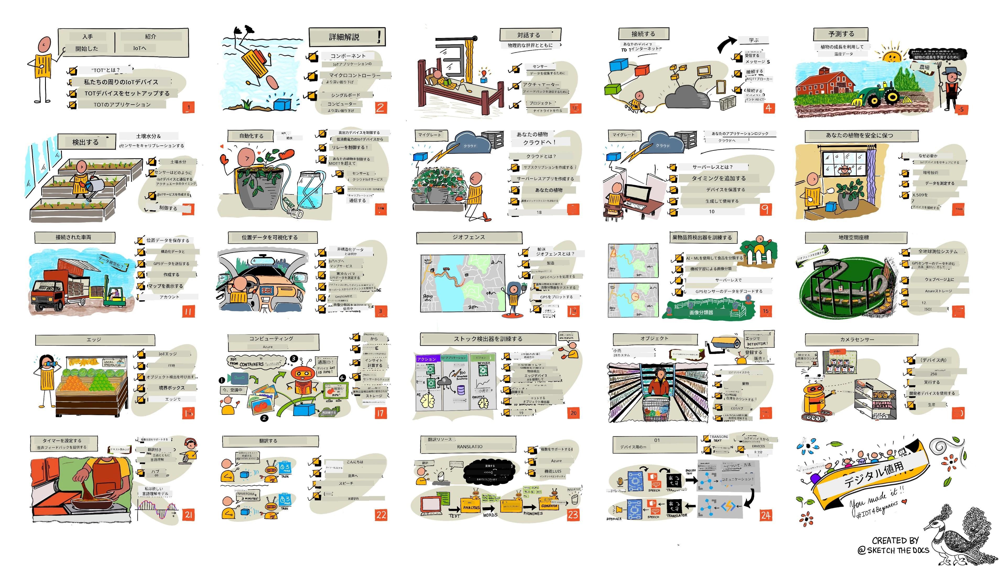

[](https://github.com/microsoft/IoT-For-Beginners/blob/master/LICENSE)
[](https://GitHub.com/microsoft/IoT-For-Beginners/graphs/contributors/)
[](https://GitHub.com/microsoft/IoT-For-Beginners/issues/)
[](https://GitHub.com/microsoft/IoT-For-Beginners/pulls/)
[](http://makeapullrequest.com)

[](https://GitHub.com/microsoft/IoT-For-Beginners/watchers/)
[](https://GitHub.com/microsoft/IoT-For-Beginners/network/)
[](https://GitHub.com/microsoft/IoT-For-Beginners/stargazers/)

### Azure AI Foundry コミュニティに参加しよう

AIアプリ構築に関して行き詰まったり質問があれば、MCPについて学ぶ仲間や経験豊富な開発者と一緒にディスカッションしましょう。質問歓迎のサポート体制が整ったコミュニティで、知識も自由に共有されます。

[](https://discord.gg/nTYy5BXMWG)

製品フィードバックやビルド中のエラーがある場合は次をご利用ください:

[](https://aka.ms/foundry/forum)

以下の手順でこれらのリソースを利用開始してください:
1. <strong>リポジトリをフォーク</strong>: Click [](https://GitHub.com/microsoft/IoT-For-Beginners/fork)
2. <strong>リポジトリをクローン</strong>: `git clone https://github.com/microsoft/IoT-For-Beginners.git`
3. [**Microsoft Foundry Discord に参加し、専門家や開発仲間と交流**](https://discord.com/invite/ByRwuEEgH4)


### 🌐 多言語サポート

#### GitHub Actions を通じてサポート (自動化 & 常に最新)

<!-- CO-OP TRANSLATOR LANGUAGES TABLE START -->
[Arabic](../ar/README.md) | [Bengali](../bn/README.md) | [Bulgarian](../bg/README.md) | [Burmese (Myanmar)](../my/README.md) | [Chinese (Simplified)](../zh-CN/README.md) | [Chinese (Traditional, Hong Kong)](../zh-HK/README.md) | [Chinese (Traditional, Macau)](../zh-MO/README.md) | [Chinese (Traditional, Taiwan)](../zh-TW/README.md) | [Croatian](../hr/README.md) | [Czech](../cs/README.md) | [Danish](../da/README.md) | [Dutch](../nl/README.md) | [Estonian](../et/README.md) | [Finnish](../fi/README.md) | [French](../fr/README.md) | [German](../de/README.md) | [Greek](../el/README.md) | [Hebrew](../he/README.md) | [Hindi](../hi/README.md) | [Hungarian](../hu/README.md) | [Indonesian](../id/README.md) | [Italian](../it/README.md) | [Japanese](./README.md) | [Kannada](../kn/README.md) | [Khmer](../km/README.md) | [Korean](../ko/README.md) | [Lithuanian](../lt/README.md) | [Malay](../ms/README.md) | [Malayalam](../ml/README.md) | [Marathi](../mr/README.md) | [Nepali](../ne/README.md) | [Nigerian Pidgin](../pcm/README.md) | [Norwegian](../no/README.md) | [Persian (Farsi)](../fa/README.md) | [Polish](../pl/README.md) | [Portuguese (Brazil)](../pt-BR/README.md) | [Portuguese (Portugal)](../pt-PT/README.md) | [Punjabi (Gurmukhi)](../pa/README.md) | [Romanian](../ro/README.md) | [Russian](../ru/README.md) | [Serbian (Cyrillic)](../sr/README.md) | [Slovak](../sk/README.md) | [Slovenian](../sl/README.md) | [Spanish](../es/README.md) | [Swahili](../sw/README.md) | [Swedish](../sv/README.md) | [Tagalog (Filipino)](../tl/README.md) | [Tamil](../ta/README.md) | [Telugu](../te/README.md) | [Thai](../th/README.md) | [Turkish](../tr/README.md) | [Ukrainian](../uk/README.md) | [Urdu](../ur/README.md) | [Vietnamese](../vi/README.md)

> **ローカルでのクローンを希望されますか？**
>
> このリポジトリには50以上の言語翻訳が含まれており、ダウンロードサイズが大幅に増加します。翻訳なしでクローンするにはスパースチェックアウトを使ってください:
>
> **Bash / macOS / Linux:**
> ```bash
> git clone --filter=blob:none --sparse https://github.com/microsoft/IoT-For-Beginners.git
> cd IoT-For-Beginners
> git sparse-checkout set --no-cone '/*' '!translations' '!translated_images'
> ```
>
> **CMD (Windows):**
> ```cmd
> git clone --filter=blob:none --sparse https://github.com/microsoft/IoT-For-Beginners.git
> cd IoT-For-Beginners
> git sparse-checkout set --no-cone "/*" "!translations" "!translated_images"
> ```
>
> コース完了に必要なファイルのみを、より速くダウンロードできます。
<!-- CO-OP TRANSLATOR LANGUAGES TABLE END -->

# IoT for Beginners - カリキュラム

MicrosoftのAzure Cloud Advocatesは、IoTの基礎に関する12週間・24レッスンのカリキュラムを提供します。各レッスンは、事前・事後のクイズ、レッスンを完了するためのテキスト指示、解答例、課題などを含みます。プロジェクトベースの教授法により、スキルが身につきやすい学習を実現します。

このプロジェクトは、農場から食卓へと至る旅路をテーマにしています。農業、物流、製造、小売、消費者というIoTデバイスに人気の産業分野を網羅しています。



> スケッチノート提供者: [Nitya Narasimhan](https://github.com/nitya)。画像をクリックすると拡大表示されます。

**著者の [Jen Fox](https://github.com/jenfoxbot)、[Jen Looper](https://github.com/jlooper)、[Jim Bennett](https://github.com/jimbobbennett) とスケッチノートアーティストの [Nitya Narasimhan](https://github.com/nitya) に心から感謝します。**

**また、このカリキュラムのレビューや翻訳に携わってくれた [Microsoft Learn Student Ambassadors](https://studentambassadors.microsoft.com?WT.mc_id=academic-17441-jabenn) のチームにも感謝します - [Aditya Garg](https://github.com/AdityaGarg00)、[Anurag Sharma](https://github.com/Anurag-0-1-A)、[Arpita Das](https://github.com/Arpiiitaaa)、[Aryan Jain](https://www.linkedin.com/in/aryan-jain-47a4a1145/)、[Bhavesh Suneja](https://github.com/EliteWarrior315)、[Faith Hunja](https://faithhunja.github.io/)、[Lateefah Bello](https://www.linkedin.com/in/lateefah-bello/)、[Manvi Jha](https://github.com/Severus-Matthew)、[Mireille Tan](https://www.linkedin.com/in/mireille-tan-a4834819a/)、[Mohammad Iftekher (Iftu) Ebne Jalal](https://github.com/Iftu119)、[Mohammad Zulfikar](https://github.com/mohzulfikar)、[Priyanshu Srivastav](https://www.linkedin.com/in/priyanshu-srivastav-b067241ba)、[Thanmai Gowducheruvu](https://github.com/innovation-platform)、[Zina Kamel](https://www.linkedin.com/in/zina-kamel/) も参加しています。**

チームをご紹介！

[](https://youtu.be/-wippUJRi5k)

**Gif制作** [Mohit Jaisal](https://linkedin.com/in/mohitjaisal)

> 🎥 上記の画像をクリックしてプロジェクトの動画をご覧ください！

> <strong>先生方へ</strong> このカリキュラムの使い方の提案を [こちら](for-teachers.md) にまとめています。独自のレッスンを作成したい場合は、[レッステンプレート](lesson-template/README.md) もご活用ください。

> **[学生の皆さん](https://aka.ms/student-page)**、このカリキュラムを独学で使うには、リポジトリをフォークし、まず事前クイズ、その後講義の読み込み、残りの課題を実施してください。ソリューションコードをコピーするのではなく、レッスン内容を理解してプロジェクトを作成することを推奨します。コードは各プロジェクトレッスンの /solutions フォルダーにあります。友人と勉強グループを作って一緒に進めるのも良いでしょう。さらに学習を進めるには [Microsoft Learn](https://docs.microsoft.com/users/jimbobbennett/collections/ke2ehd351jopwr?WT.mc_id=academic-17441-jabenn) をおすすめします。

コースの概要動画はこちら:

[](https://youtube.com/watch?v=bccEMm8gRuc "Promo video")

> 🎥 上記の画像をクリックしてプロジェクトの動画をご覧ください！

## 教授法

このカリキュラムを作成するにあたり、プロジェクトベースであることと、頻繁なクイズを含むことの二つの教育原則を採用しました。このシリーズ終了時には、植物の監視と自動水やりシステム、車両追跡システム、食品の追跡と検査のためのスマート工場セットアップ、音声制御の調理タイマーを作成し、IoTの基礎であるデバイスコードの作成、クラウド接続、テレメトリ解析、エッジでのAI実行を習得しています。

プロジェクトに合致した内容にすることで、学習がより引き込まれ理解度が高まります。

また、授業前の簡易クイズは学習の準備としての意図を生徒に持たせ、授業後のクイズは理解度をさらに深める役割を果たします。このカリキュラムは柔軟で楽しく、全体または一部を受講可能です。プロジェクトは小規模なところから始まり、12週の終盤に向けて徐々に複雑になります。

各プロジェクトは、学生や趣味の開発者が入手可能な実世界のハードウェアをベースにしています。特定のプロジェクト領域を扱い、関連する背景知識を提供します。成功する開発者になるには、問題解決の領域を理解することが重要であり、この背景知識により学生は自分のIoTソリューションや学びを、開発者として実際に解決すべき現実の問題の文脈で考察できます。学生は作成するソリューションの「理由」を理解し、最終ユーザーを意識することができます。

## ハードウェア
私たちは、個人の好み、プログラミング言語の知識や好み、学習目標、入手可能性に応じて、プロジェクトに使用する2種類のIoTハードウェアを用意しています。また、ハードウェアにアクセスできない方や購入を決める前にもっと学びたい方のために「仮想ハードウェア」バージョンも提供しています。詳細や「ショッピングリスト」は[ハードウェアページ](./hardware.md)でご覧いただけます。Seeed Studioの友人たちから完全なキットを購入するためのリンクも含まれています。

> 💁 [Code of Conduct](CODE_OF_CONDUCT.md)、[Contributing](CONTRIBUTING.md)、[Translations](..) のガイドラインをご覧ください。建設的なフィードバックをお待ちしています！
>
> 🔧 問題がありますか？よくある問題の解決策については[トラブルシューティングガイド](TROUBLESHOOTING.md)をご確認ください。

## 各レッスンに含まれるもの：

- スケッチノート
- 追加の動画（オプション）
- 事前ウォームアップクイズ
- 文章によるレッスン
- プロジェクトベースのレッスンでは、プロジェクトの作り方のステップバイステップガイド
- 知識チェック
- チャレンジ
- 追加の読書資料
- 課題
- [レッスン後のクイズ](https://ff-quizzes.netlify.app/en/)

> <strong>クイズについての注意</strong>: すべてのクイズはquiz-appフォルダーに収められており、3問構成の合計48クイズがあります。レッスンからリンクされていますが、quiz-appはローカルで実行したりAzureにデプロイしたりできます。`quiz-app`フォルダーの指示に従ってください。順次ローカライズを進めています。

## レッスン

|       |              プロジェクト名               |                       学習内容                       | 学習目標                                                                                                                                                           |                                                        リンクされたレッスン                                                         |
| :---: | :------------------------------------: | :-------------------------------------------------: | ----------------------------------------------------------------------------------------------------------------------------------------------------------------- | :--------------------------------------------------------------------------------------------------------------------------: |
|  01   | [Getting started](./1-getting-started/README.md) |                     IoT入門                      | IoTの基本原則やセンサーやクラウドサービスなどのIoTソリューションの基本的な構成要素について学びながら、初めてのIoTデバイスをセットアップします |                      [Introduction to IoT](./1-getting-started/lessons/1-introduction-to-iot/README.md)                      |
|  02   | [Getting started](./1-getting-started/README.md) |                   IoTのより深い理解                   | IoTシステムのコンポーネント、マイコンやシングルボードコンピュータについてさらに学びます                                                                        |                        [A deeper dive into IoT](./1-getting-started/lessons/2-deeper-dive/README.md)                         |
|  03   | [Getting started](./1-getting-started/README.md) | センサーとアクチュエーターで物理世界と相互作用する | センサーで物理世界からデータを収集し、アクチュエーターでフィードバックを送信する方法を学び、ナイトライトを作成します                                           | [Interact with the physical world with sensors and actuators](./1-getting-started/lessons/3-sensors-and-actuators/README.md) |
|  04   | [Getting started](./1-getting-started/README.md) |             デバイスをインターネットに接続する              | IoTデバイスをインターネットに接続してメッセージを送受信する方法を学び、ナイトライトをMQTTブローカーに接続します                                                |               [Connect your device to the Internet](./1-getting-started/lessons/4-connect-internet/README.md)                |
|  05   |            [Farm](./2-farm/README.md)            |                    植物の成長予測                    | IoTデバイスで取得した温度データを使って植物の成長を予測する方法を学びます                                                                                      |                          [Predict plant growth](./2-farm/lessons/1-predict-plant-growth/README.md)                           |
|  06   |            [Farm](./2-farm/README.md)            |                    土壌水分の検出                    | 土壌水分を検出し、土壌水分センサーの校正を行う方法を学びます                                                                                                  |                          [Detect soil moisture](./2-farm/lessons/2-detect-soil-moisture/README.md)                           |
|  07   |            [Farm](./2-farm/README.md)            |                  自動植物灌漑制御                   | リレーとMQTTを使用して水やりを自動化しタイミングを制御する方法を学びます                                                                                        |                      [Automated plant watering](./2-farm/lessons/3-automated-plant-watering/README.md)                       |
|  08   |            [Farm](./2-farm/README.md)            |               自分の植物をクラウドに移行する               | クラウドおよびクラウドホスト型IoTサービスについて学び、植物を公共のMQTTブローカーの代わりにこれらに接続する方法を学びます                                  |               [Migrate your plant to the cloud](./2-farm/lessons/4-migrate-your-plant-to-the-cloud/README.md)                |
|  09   |            [Farm](./2-farm/README.md)            |         アプリケーションロジックをクラウドに移行する         | IoTメッセージに応じて動作するクラウド上のアプリケーションロジックの書き方について学びます                                                                      |         [Migrate your application logic to the cloud](./2-farm/lessons/5-migrate-application-to-the-cloud/README.md)         |
|  10   |            [Farm](./2-farm/README.md)            |                   植物を安全に保つ                    | IoTにおけるセキュリティ、および鍵や証明書で植物を安全に保つ方法を学びます                                                                                      |                        [Keep your plant secure](./2-farm/lessons/6-keep-your-plant-secure/README.md)                         |
|  11   |       [Transport](./3-transport/README.md)       |                      位置追跡                      | IoTデバイス向けのGPS位置追跡について学びます                                                                                                                   |                           [Location tracking](./3-transport/lessons/1-location-tracking/README.md)                           |
|  12   |       [Transport](./3-transport/README.md)       |                    位置データの保存                     | 後で可視化や分析をするためにIoTデータを保存する方法を学びます                                                                                                  |                         [Store location data](./3-transport/lessons/2-store-location-data/README.md)                         |
|  13   |       [Transport](./3-transport/README.md)       |                   位置データの可視化                   | 地図上で位置データを可視化すること、地図が3Dの実世界を2次元で表現する方法について学びます                                                                      |                     [Visualize location data](./3-transport/lessons/3-visualize-location-data/README.md)                     |
|  14   |       [Transport](./3-transport/README.md)       |                          ジオフェンス                          | ジオフェンスについて学び、サプライチェーンの車両が目的地に近づいたときに通知するための利用方法を学びます                                                      |                                   [Geofences](./3-transport/lessons/4-geofences/README.md)                                   |
|  15   |   [Manufacturing](./4-manufacturing/README.md)   |               果物の品質検出器の訓練                | クラウドで画像分類器を訓練して果物の品質を検出する方法を学びます                                                                                               |                 [Train a fruit quality detector](./4-manufacturing/lessons/1-train-fruit-detector/README.md)                 |
|  16   |   [Manufacturing](./4-manufacturing/README.md)   |           IoTデバイスで果物の品質をチェック            | IoTデバイスから果物の品質検出器を利用する方法を学びます                                                                                                        |           [Check fruit quality from an IoT device](./4-manufacturing/lessons/2-check-fruit-from-device/README.md)            |
|  17   |   [Manufacturing](./4-manufacturing/README.md)   |             エッジで果物検出器を実行             | エッジ上でIoTデバイスに果物検出器を実行する方法を学びます                                                                                                      |             [Run your fruit detector on the edge](./4-manufacturing/lessons/3-run-fruit-detector-edge/README.md)             |
|  18   |   [Manufacturing](./4-manufacturing/README.md)   |        センサーから果物品質検出をトリガー        | センサーから果物品質検出をトリガーする方法を学びます                                                                                                            |        [Trigger fruit quality detection from a sensor](./4-manufacturing/lessons/4-trigger-fruit-detector/README.md)         |
|  19   |          [Retail](./5-retail/README.md)          |                   在庫検出器の訓練                  | 物体検出を利用して店舗の在庫検出器を訓練し、在庫数を数える方法を学びます                                                                                      |                        [Train a stock detector](./5-retail/lessons/1-train-stock-detector/README.md)                         |
|  20   |          [Retail](./5-retail/README.md)          |               IoTデバイスで在庫をチェック                | 物体検出モデルを利用してIoTデバイスで在庫をチェックする方法を学びます                                                                                         |                     [Check stock from an IoT device](./5-retail/lessons/2-check-stock-device/README.md)                      |
|  21   |        [Consumer](./6-consumer/README.md)        |             IoTデバイスで音声認識             | IoTデバイスで音声を認識してスマートタイマーを作成する方法を学びます                                                                                           |                  [Recognize speech with an IoT device](./6-consumer/lessons/1-speech-recognition/README.md)                  |
|  22   |        [Consumer](./6-consumer/README.md)        |                     言語の理解                     | IoTデバイスに話しかけた文章を理解する方法を学びます                                                                                                           |                        [Understand language](./6-consumer/lessons/2-language-understanding/README.md)                        |
|  23   |        [Consumer](./6-consumer/README.md)        |           タイマー設定と音声フィードバック           | IoTデバイスでタイマーを設定し、タイマー設定時と終了時に音声でフィードバックをする方法を学びます                                                                |                 [Set a timer and provide spoken feedback](./6-consumer/lessons/3-spoken-feedback/README.md)                  |
|  24   |        [Consumer](./6-consumer/README.md)        |                 複数言語対応                  | 話しかけられる言語とスマートタイマーからの応答の両方で複数言語対応する方法を学びます                                                                           |                   [Support multiple languages](./6-consumer/lessons/4-multiple-language-support/README.md)                   |

## オフラインアクセス

このドキュメントは[Docsify](https://docsify.js.org/#/)を使ってオフラインで実行できます。このリポジトリをフォークし、ローカルマシンに[Docsifyをインストール](https://docsify.js.org/#/quickstart)し、その後このリポジトリのルートフォルダーで `docsify serve` と入力してください。ウェブサイトはローカルホストのポート3000で提供されます: `localhost:3000`。

## クイズ

各章の知識を試すインタラクティブなクイズのホスティングにご協力いただいたコミュニティに感謝します。こちらで知識を試せます [here](https://ff-quizzes.netlify.app/en/)

### PDF

必要に応じて、この内容のPDFを生成してオフラインアクセスできます。そのためには[npmのインストール](https://docs.npmjs.com/downloading-and-installing-node-js-and-npm)が必要です。リポジトリのルートフォルダーで以下のコマンドを実行してください:

```sh
npm i
npm run convert
```

### スライド

いくつかのレッスンには[slides](../../slides)フォルダーにスライドデッキがあります。

## 他のカリキュラム

私たちのチームは他のカリキュラムも制作しています！ぜひご覧ください：

<!-- CO-OP TRANSLATOR OTHER COURSES START -->
### LangChain
[](https://aka.ms/langchain4j-for-beginners)
[](https://aka.ms/langchainjs-for-beginners?WT.mc_id=m365-94501-dwahlin)
[](https://github.com/microsoft/langchain-for-beginners?WT.mc_id=m365-94501-dwahlin)
---

### Azure / Edge / MCP / Agents
[](https://github.com/microsoft/AZD-for-beginners?WT.mc_id=academic-105485-koreyst)
[](https://github.com/microsoft/edgeai-for-beginners?WT.mc_id=academic-105485-koreyst)
[](https://github.com/microsoft/mcp-for-beginners?WT.mc_id=academic-105485-koreyst)
[](https://github.com/microsoft/ai-agents-for-beginners?WT.mc_id=academic-105485-koreyst)

---
 
### 生成AIシリーズ
[](https://github.com/microsoft/generative-ai-for-beginners?WT.mc_id=academic-105485-koreyst)
[-9333EA?style=for-the-badge&labelColor=E5E7EB&color=9333EA)](https://github.com/microsoft/Generative-AI-for-beginners-dotnet?WT.mc_id=academic-105485-koreyst)
[-C084FC?style=for-the-badge&labelColor=E5E7EB&color=C084FC)](https://github.com/microsoft/generative-ai-for-beginners-java?WT.mc_id=academic-105485-koreyst)
[-E879F9?style=for-the-badge&labelColor=E5E7EB&color=E879F9)](https://github.com/microsoft/generative-ai-with-javascript?WT.mc_id=academic-105485-koreyst)

---
 
### コアラーニング
[](https://aka.ms/ml-beginners?WT.mc_id=academic-105485-koreyst)
[](https://aka.ms/datascience-beginners?WT.mc_id=academic-105485-koreyst)
[](https://aka.ms/ai-beginners?WT.mc_id=academic-105485-koreyst)
[](https://github.com/microsoft/Security-101?WT.mc_id=academic-96948-sayoung)
[](https://aka.ms/webdev-beginners?WT.mc_id=academic-105485-koreyst)
[](https://aka.ms/iot-beginners?WT.mc_id=academic-105485-koreyst)
[](https://github.com/microsoft/xr-development-for-beginners?WT.mc_id=academic-105485-koreyst)

---
 
### コパイロットシリーズ
[](https://aka.ms/GitHubCopilotAI?WT.mc_id=academic-105485-koreyst)
[](https://github.com/microsoft/mastering-github-copilot-for-dotnet-csharp-developers?WT.mc_id=academic-105485-koreyst)
[](https://github.com/microsoft/CopilotAdventures?WT.mc_id=academic-105485-koreyst)
<!-- CO-OP TRANSLATOR OTHER COURSES END -->

## 画像の帰属表記

このカリキュラムで使用されている画像の帰属は、必要に応じて[Attributions](./attributions.md)でご確認いただけます。

---

<!-- CO-OP TRANSLATOR DISCLAIMER START -->
**免責事項**:  
本書類は AI 翻訳サービス [Co-op Translator](https://github.com/Azure/co-op-translator) を使用して翻訳されています。正確性を期しておりますが、自動翻訳には誤りや不正確な部分が含まれる場合があります。原文の母国語による文書を正式な情報源としてご参照ください。重要な情報については、専門の人間翻訳を推奨します。本翻訳の使用に起因する誤解や解釈違いについて、当方は一切責任を負いません。
<!-- CO-OP TRANSLATOR DISCLAIMER END -->