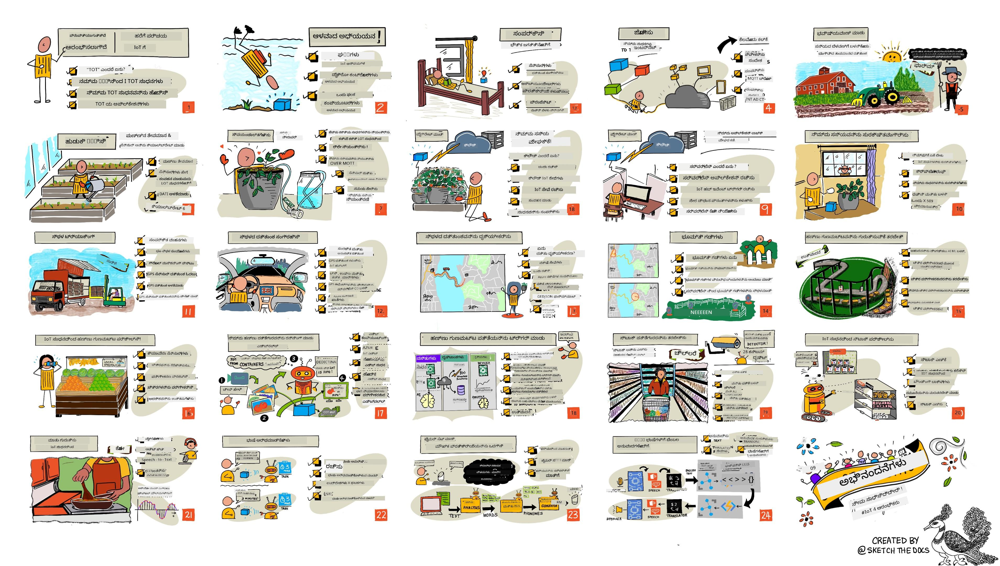

<!--
CO_OP_TRANSLATOR_METADATA:
{
  "original_hash": "6c354ec3487e4f6cfafbe44557996cd9",
  "translation_date": "2026-01-07T01:29:19+00:00",
  "source_file": "README.md",
  "language_code": "kn"
}
-->
[](https://github.com/microsoft/IoT-For-Beginners/blob/master/LICENSE)
[](https://GitHub.com/microsoft/IoT-For-Beginners/graphs/contributors/)
[](https://GitHub.com/microsoft/IoT-For-Beginners/issues/)
[](https://GitHub.com/microsoft/IoT-For-Beginners/pulls/)
[](http://makeapullrequest.com)

[](https://GitHub.com/microsoft/IoT-For-Beginners/watchers/)
[](https://GitHub.com/microsoft/IoT-For-Beginners/network/)
[](https://GitHub.com/microsoft/IoT-For-Beginners/stargazers/)

### ಅಜೂರ್ AI ಫೌಂಡ್ರಿ ಸಮುದಾಯಕ್ಕೆ ಸೇರಿಕೊಳ್ಳಿ

ನೀವು ಅಡ್ಡಿಯಾಗಿದ್ರೆ ಅಥವಾ AI ಅಪ್ಲಿಕೇಶನ್‌ಗಳನ್ನು ನಿರ್ಮಿಸುವ ಬಗ್ಗೆ ಯಾವುದೇ ಪ್ರಶ್ನೆಗಳಿದ್ದರೆ. MCP ಬಗ್ಗೆ ಚರ್ಚೆಗಳಲ್ಲಿ ಸಹಪಠಿಗಳು ಮತ್ತು ಅನುಭವಜ್ಞರೊಂದಿಗೆ ಸೇರಿಕೊಳ್ಳಿ. ಇದು ಒಂದು ಬೆಂಬಲಿಸುವ ಸಮುದಾಯವಾಗಿದ್ದು, ಪ್ರಶ್ನೆಗಳ ಸ್ವಾಗತ ಮಾಡುತ್ತದೆ ಮತ್ತು ಜ್ಞಾನವನ್ನು ಸ್ವತಃಸ್ಫೂರ್ತಿಯಾಗಿ ಹಂಚಿಕೊಳ್ಳಲಾಗುತ್ತದೆ.

[](https://discord.gg/nTYy5BXMWG)

ನೀವು ಉತ್ಪನ್ನ ಪ್ರತಿಕ್ರಿಯೆ ಅಥವಾ ಬಿಲ್ಡಿಂಗ್ ಸಮಯದಲ್ಲಿ ಎಡವಟ್ಟುಗಳನ್ನು ಹೊಂದಿದ್ದರೆ ಭೇಟಿ ನೀಡಿರಿ:

[](https://aka.ms/foundry/forum)

ಈ ಸಂಪನ್ಮೂಲಗಳನ್ನು ಬಳಸಿಸಲು ಈ ಹಂತಗಳನ್ನು ಅನುಸರಿಸಿ:
1. **ರಿಪೋಜಿಟರಿಯನ್ನು ಫಾರ್ಕ್ ಮಾಡಿ**: ಕ್ಲಿಕ್ ಮಾಡಿ [](https://GitHub.com/microsoft/IoT-For-Beginners/fork)
2. **ರಿಪೋಜಿಟರಿಯನ್ನು ಕ್ಲೋನ್ ಮಾಡಿ**: `git clone https://github.com/microsoft/IoT-For-Beginners.git`
3. [**ಮೈಕ್ರೋಸಾಫ್ಟ್ ಫೌಂಡ್ರಿ Discord ಗೆ ಸೇರಿ ಮತ್ತು ತಜ್ಞರ ಹಾಗೂ ಸಹಪಠಿಗಳನ್ನ ಭೇಟಿ ಮಾಡಿ**](https://discord.com/invite/ByRwuEEgH4)


### 🌐 ಬಹುಭಾಷಾ ಬೆಂಬಲ

#### GitHub Action ಮೂಲಕ ಬೆಂಬಲಿತ (ಸ್ವಯಂಚಾಲಿತ & ಸದಾ ನವೀಕೃತ)

<!-- CO-OP TRANSLATOR LANGUAGES TABLE START -->
[Arabic](../ar/README.md) | [Bengali](../bn/README.md) | [Bulgarian](../bg/README.md) | [Burmese (Myanmar)](../my/README.md) | [Chinese (Simplified)](../zh/README.md) | [Chinese (Traditional, Hong Kong)](../hk/README.md) | [Chinese (Traditional, Macau)](../mo/README.md) | [Chinese (Traditional, Taiwan)](../tw/README.md) | [Croatian](../hr/README.md) | [Czech](../cs/README.md) | [Danish](../da/README.md) | [Dutch](../nl/README.md) | [Estonian](../et/README.md) | [Finnish](../fi/README.md) | [French](../fr/README.md) | [German](../de/README.md) | [Greek](../el/README.md) | [Hebrew](../he/README.md) | [Hindi](../hi/README.md) | [Hungarian](../hu/README.md) | [Indonesian](../id/README.md) | [Italian](../it/README.md) | [Japanese](../ja/README.md) | [Kannada](./README.md) | [Korean](../ko/README.md) | [Lithuanian](../lt/README.md) | [Malay](../ms/README.md) | [Malayalam](../ml/README.md) | [Marathi](../mr/README.md) | [Nepali](../ne/README.md) | [Nigerian Pidgin](../pcm/README.md) | [Norwegian](../no/README.md) | [Persian (Farsi)](../fa/README.md) | [Polish](../pl/README.md) | [Portuguese (Brazil)](../br/README.md) | [Portuguese (Portugal)](../pt/README.md) | [Punjabi (Gurmukhi)](../pa/README.md) | [Romanian](../ro/README.md) | [Russian](../ru/README.md) | [Serbian (Cyrillic)](../sr/README.md) | [Slovak](../sk/README.md) | [Slovenian](../sl/README.md) | [Spanish](../es/README.md) | [Swahili](../sw/README.md) | [Swedish](../sv/README.md) | [Tagalog (Filipino)](../tl/README.md) | [Tamil](../ta/README.md) | [Telugu](../te/README.md) | [Thai](../th/README.md) | [Turkish](../tr/README.md) | [Ukrainian](../uk/README.md) | [Urdu](../ur/README.md) | [Vietnamese](../vi/README.md)

> **ಸ್ಥಾನೀಯವಾಗಿ ಕ್ಲೋನ್ ಮಾಡಬೇಕೆ?**

> ಈ ರಿಪೋಜಿಟರಿ 50+ ಭಾಷಾ ಅನುವಾದಗಳನ್ನು ಒಳಗೊಂಡಿರುವುದರಿಂದ ಡೌನ್‌ಲೋಡ್ ಸೈಜ್ ಬಹಳಷ್ಟು ಹೆಚ್ಚಾಗುತ್ತದೆ. ಅನುವಾದಗಳಿಲ್ಲದೆ ಕ್ಲೋನ್ ಮಾಡಲು sparse checkout ಬಳಸಿರಿ:
> ```bash
> git clone --filter=blob:none --sparse https://github.com/microsoft/IoT-For-Beginners.git
> cd IoT-For-Beginners
> git sparse-checkout set --no-cone '/*' '!translations' '!translated_images'
> ```
> ಇದು ನಿಮಗೆ ಕೋರ್ಸ್ ಪೂರ್ಣಗೊಳಿಸಲು ಅಗತ್ಯವಿರುವ ಎಲ್ಲಾ ವಸ್ತುಗಳನ್ನು ವೇಗವಾಗಿ ಡೌನ್‌ಲೋಡ್ ಮಾಡಲು ಸಹಾಯ ಮಾಡುತ್ತದೆ.
<!-- CO-OP TRANSLATOR LANGUAGES TABLE END -->

# ಆರಂಭಿಕರಿಗೆ IoT - ಪಠ್ಯಕ್ರಮ

ಮೈಕ್ರೋಸಾಫ್ಟ್‌ನ ಅಜೂರ್ ಕ್ಲೌಡ್ ಪ್ರಚಾರಕರು IoT ಮೂಲತತ್ವಗಳ ಬಗ್ಗೆ 12 ವಾರಗಳ, 24 ಪಾಠಗಳ ಪಠ್ಯಕ್ರಮವನ್ನು ಒದಗಿಸಲು ಸಂತೋಷಪಡುತ್ತಾರೆ. ಪ್ರತಿಯೊಂದು ಪಾಠವು ಪೂರ್ವ ಮತ್ತು ನಂತರದ ಕ್ವಿಜ್‌ಗಳು, ಪಾಠವನ್ನು ಪೂರ್ಣಗೊಳಿಸಲು ಬರೆಯಲ್ಪಟ್ಟ ಸೂಚನೆಗಳು, ಪರಿಹಾರ, ನಿಗದಿ ಮತ್ತು ಇನ್ನಷ್ಟು ಒಳಗೊಂಡಿರುತ್ತದೆ. ನಮ್ಮ ಪ್ರಾಜೆಕ್ಟ್-ಆಧಾರಿತ ಅಧ್ಯಯನ ವಿಧಾನವು ನೀವು ನಿರ್ಮಿಸುತ್ತಿದ್ದಂತೆ ಕಲಿಯಲು ಅವಕಾಶ ನೀಡುತ್ತದೆ, ಇದು ಹೊಸ ಕೌಶಲಗಳನ್ನು ಹತ್ತಿರ ಇಡುವ ಪ್ರಮಾಣಿತ ಮಾರ್ಗವಾಗಿದೆ.

ಈ ಯೋಜನೆಗಳು ಆಹಾರವು ಹೊಲದಿಂದ ಬಟ್ಟೆಗೆ ಪ್ರಯಾಣಿಸುವುದನ್ನು ಒಳಗೊಂಡಿವೆ. ಇದರಲ್ಲಿ ಕೃಷಿ, ಲಾಜಿಸ್ಟಿಕ್ಸ್, ತಯಾರಿಕೆ, ಚಿಲ್ಲರೆ ಮಾರುಕಟ್ಟೆ ಮತ್ತು ಗ್ರಾಹಕ ನಿರ್ವಹಣೆ ಸೇರಿವೆ - ಇವುಗಳೆಲ್ಲಾ IoT ಸಾಧನಗಳ ಜನಪ್ರಿಯ ಉದ್ಯಮ ಕ್ಷೇತ್ರಗಳಾಗಿವೆ.



> ಸ್ಕೆಚ್‌ನೋಟ್ [ನಿತ್ಯ ನರಸಿಂಹನ್](https://github.com/nitya) ರವರಿಂದ. ದೊಡ್ಡ ಆಕಾರಕ್ಕೆ ಚಿತ್ರವನ್ನು ಕ್ಲಿಕ್ ಮಾಡಿ.

**ನಮ್ಮ ಲೇಖಕರು [ಜೆನ್ ಫಾಕ್ಸ್](https://github.com/jenfoxbot), [ಜೆನ್ ಲೂಪರ್](https://github.com/jlooper), [ಜಿಮ್ ಬೆನೆಟ್](https://github.com/jimbobbennett) ಮತ್ತು ನಮ್ಮ ಸ್ಕೆಚ್‌ನೋಟ್ ಕಲಾವಿದ [ನಿತ್ಯ ನರಸಿಂಹನ್](https://github.com/nitya)ರಿಗೆ ಹೃದಯಪೂರ್ವಕ ಧನ್ಯವಾದಗಳು.**

**ನಮ್ಮ [Microsoft Learn ವಿದ್ಯಾರ್ಥಿ ತಮಗೆಳೆಯರ](https://studentambassadors.microsoft.com?WT.mc_id=academic-17441-jabenn) ತಂಡಕ್ಕೂ ಧನ್ಯವಾದಗಳು, ಅವರು ಈ ಪಠ್ಯಕ್ರಮವನ್ನು ಪರಿಶೀಲಿಸಿ ಅನುವಾದಿಸುತ್ತಿದ್ದಾರೆ - [ಆದಿತ್ಯ ಗಾರ್ಗ್](https://github.com/AdityaGarg00), [ಅನುರಾಗ್ ಶರ್ಮಾ](https://github.com/Anurag-0-1-A), [ಅರ್ಪಿತ ದಾಸ್](https://github.com/Arpiiitaaa), [ಆರ್ಯನ್ ಜೈನ್](https://www.linkedin.com/in/aryan-jain-47a4a1145/), [ಭವೇಶ್ ಸುನೇಜಾ](https://github.com/EliteWarrior315), [ಫೇತ್ ಹಂಜಾ](https://faithhunja.github.io/), [ಲಾಗ್ಟೀಫ್ ಬೆಲ್ಲೋ](https://www.linkedin.com/in/lateefah-bello/), [ಮಾನವಿ ಜ್ಹಾ](https://github.com/Severus-Matthew), [ಮಿರೈಲ್ ಟಾನ್](https://www.linkedin.com/in/mireille-tan-a4834819a/), [ಮೊಹಮದ್ ಇಫ್ತೆಖರ್ (ಇಫ್ತು) ಎಬ್ನೆ ಜಲಾಲ್](https://github.com/Iftu119), [ಮೊಹಮದ್ ಜುಲ್ಫಿಕಾರ್](https://github.com/mohzulfikar), [ಪ್ರಿಯಾಂಶು ಶ್ರೀವಾಸ್ತವ್](https://www.linkedin.com/in/priyanshu-srivastav-b067241ba), [ತನ್ ಮೇ ಗೋಡುಚೆರುವು](https://github.com/innovation-platform), ಮತ್ತು [ಝೀನಾ ಕಮೇಲ್](https://www.linkedin.com/in/zina-kamel/).**

ತಂಡವನ್ನು ಭೇಟಿಯಾದಿರಿ!

[](https://youtu.be/-wippUJRi5k)

**ಏನಿಮೇಶನ್ ಗಿಫ್ ಬರೆಗೆ [ಮೊಹಿತ್ ಜೈಸಲ್](https://linkedin.com/in/mohitjaisal)**

> 🎥 ಈ ಯೋಜನೆಯ ಬಗ್ಗೆ ವಿಡಿಯೋಗಾಗಿ ಮೇಲಿನ ಚಿತ್ರವನ್ನು ಕ್ಲಿಕ್ ಮಾಡಿ!

> **ಶಿಕ್ಷಕರು**, ನಾವು ಈ ಪಠ್ಯಕ್ರಮವನ್ನು ಬಳಸುವ ಬಗ್ಗೆ ಕೆಲವು [ಸೂಚನೆಗಳನ್ನು](for-teachers.md) ಸೇರಿಸಿದ್ದೇವೆ. ನೀವು ಸ್ವಂತ ಪಾಠಗಳನ್ನು ರಚಿಸಲು ಬಯಸಿದರೆ, ನಮ್ಮೊಂದಿಗೆ [ಪಾಠ ಟೆಂಪ್ಲೇಟನ್ನು](lesson-template/README.md) ಕೂಡ ಸೇರಿಸಿದ್ದೇವೆ.

> **[ವಿದ್ಯಾರ್ಥಿಗಳು](https://aka.ms/student-page)**, ಈ ಪಠ್ಯಕ್ರಮವನ್ನು ಸ್ವತಂತ್ರವಾಗಿ ಬಳಸಲು, ಸಂಪೂರ್ಣ ರಿಪೋವನ್ನು ಫಾರ್ಕ್ ಮಾಡಿ ಮತ್ತು ವ್ಯಾಯಾಮಗಳನ್ನು ಅವಲಂಬಿಸಿ ಮಾಡಿ, ಪ್ರಾಥಮಿಕವಾದ ಕ್ವಿಜ್‌ನಿಂದ ಪ್ರಾರಂಭಿಸಿ, ನಂತರ ಉಪನ್ಯಾಸವನ್ನು ಓದಿ ಇತರೆ ಚಟುವಟಿಕೆಗಳನ್ನು ಪೂರ್ಣಗೊಳಿಸಿ. ಪರಿಹಾರ ಕೋಡ್ ಅನ್ನು ನಕಲಿಸಲು ಬದಲು ಪಾಠಗಳನ್ನು ಅರ್ಥಮಾಡಿಕೊಂಡು ಯೋಜನೆಗಳನ್ನು ರಚಿಸಲು ಪ್ರಯತ್ನಿಸಿ; ಆದರೆ ಪ್ರತಿಯೊಂದು ಪ್ರಾಜೆಕ್ಟ್-ಆಧಾರಿತ ಪಾಠದ /solutions ಫೋಲ್ಡರ್‌ನಲ್ಲಿ ಆ ಕೋಡ್ ಲಭ್ಯವಿದೆ. ಮತ್ತೊಂದು ಆಲೋಚನೆ ಎಂದರೆ ಗೆಳೆಯರು ಜೊತೆಯಾಗಿ ಅಧ್ಯಯನ ಗುಂಪು ರಚಿಸಿ ವಿಷಯವನ್ನು ಒಂದಾಗಿ ಓದಿ. ಮುಂದಿನ ಅಧ್ಯಯನಕ್ಕಾಗಿ, ನಾವು [Microsoft Learn](https://docs.microsoft.com/users/jimbobbennett/collections/ke2ehd351jopwr?WT.mc_id=academic-17441-jabenn) ಶಿಫಾರಸು ಮಾಡುತ್ತೇವೆ.

ಈ ಕೋರ್ಸ್ ಬಗ್ಗೆ ವಿಡಿಯೋ ಪರಿಚಯಕ್ಕೆ ಈ ವಿಡಿಯೋ ನೋಡಿ:

[](https://youtube.com/watch?v=bccEMm8gRuc "Promo video")

> 🎥 ಈ ಯೋಜನೆಯ ಬಗ್ಗೆ ವಿಡಿಯೋಗಾಗಿ ಮೇಲಿನ ಚಿತ್ರವನ್ನು ಕ್ಲಿಕ್ ಮಾಡಿ!

## ಪಠ್ಯವಿಧಾನ

ಈ ಪಠ್ಯಕ್ರಮವನ್ನು ನಿರ್ಮಿಸುವಾಗ ನಾವು ಎರಡು ಪಾಠದ ತತ್ವಗಳನ್ನು ಆಯ್ಕೆಮಾಡಿದ್ದು: ಇದು ಪ್ರಾಜೆಕ್ಟ್-ಆಧಾರಿತವಾಗಿರಬೇಕು ಮತ್ತು ನಿಯಮಿತವಾಗಿ ಕ್ವಿಜ್‌ಗಳನ್ನು ಒಳಗೊಂಡಿರಬೇಕು ಎಂಬುದು. ಈ ಸರಣಿಯ ಅಂತ್ಯದಲ್ಲಿ, ವಿದ್ಯಾರ್ಥಿಗಳು ಒಂದು ಸಸ್ಯ ಮೇಲ್ವಿಚಾರಣಾ ಮತ್ತು ನೀರಾವರಿ ವ್ಯವಸ್ಥೆ, ವಾಹನ ಟ್ರ್ಯಾಕರ್, ಆಹಾರಗಳನ್ನು ಟ್ರ್ಯಾಕ್ ಮಾಡಲು ಹಾಗೂ ಪರಿಶೀಲಿಸಲು ಸ್ಮಾರ್ಟ್ ಕಾರ್ಖಾನೆ ಸೆಟಪ್, ಮತ್ತು ಧ್ವನಿ-ಕಂಟ್ರೋಲ್ ಅಡುಗೆ ಟೈಮರ್ ನಿರ್ಮಿಸುವರು ಮತ್ತು ಇಂಟರ್ನೆಟ್ ಆಫ್ ಥಿಂಗ್ಸ್ ಮೂಲಗಳನ್ನು ಗೊತ್ತಾಗಿಸುವರು, ಇದರಲ್ಲಿ ಸಾಧನ ಕೋಡ್ ಬರೆಯುವುದು, ಕ್ಲೌಡ್‌ಗೆ ಸಂಪರ್ಕ ಹೊಂದುವುದು, ಟೆಲಿಮೆಟ್ರಿ ವಿಶ್ಲೇಷಣೆ ಮತ್ತು ಎಡ್ಜ್‌ನಲ್ಲಿ AI ಓಡಿಸುವುದು ಸೇರಿದೆ.

ವಿಷಯವು ಪ್ರಾಜೆಕ್ಟ್‌ಗಳಿಗೆ ಹೊಂದಾಣಿಕೆಯಾಗಿರುವುದರಿಂದ, ವಿದ್ಯಾರ್ಥಿಗಳಿಗೆ ಉತ್ಸಾಹವನ್ನು ಹೆಚ್ಚಿಸುತ್ತದೆ ಮತ್ತು ಕಲಿತ ವಿಚಾರಗಳ ಉಳಿವು ಹೆಚ್ಚಾಗುತ್ತದೆ.

ತರುವಾಯ, ತರಗತಿಗೆ ಮುಂಚಿತವಾದ ಕಡಿಮೆ ಒತ್ತಡದ ಕ್ವಿಜ್ ವಿದ್ಯಾರ್ಥಿಯು ವಿಷಯವನ್ನು ಕಲಿಯಲು ಉದ್ದೇಶಪಡಿಸುವಂತೆ ಮಾಡುತ್ತದೆ, ಮತ್ತು ತರಗತಿವರೆಗೆ ನಂತರದ ಮತ್ತೊಂದು ಕ್ವಿಜ್ ಹೆಚ್ಚಿನ ಉಳಿವನ್ನು ಖಚಿತಪಡಿಸುತ್ತದೆ. ಈ ಪಠ್ಯಕ್ರಮವನ್ನು ಅನುಕೂಲಕಾರಿಯಾಗಿಯೂ ಮತ್ತು ಮನರಂಜನೀಯವಾಗಿಯೂ ರೂಪಿಸಲಾಗಿದೆ ಮತ್ತು ಸಂಪೂರ್ಣ ಅಥವಾ ಭಾಗಶಃ ಅನುಸರಿಸಬಹುದು. 12 ವಾರಗಳ ಚಕ್ರದ ಅಂತ್ಯಕ್ಕೆ ಪ್ರಾಜೆಕ್ಟುಗಳು ಸಣ್ಣದಿಂದ ಹೆಚ್ಚಿನ ಸಂಕೀರ್ಣತೆಯವರೆಗೆ ಪರಿವರ್ತಿತವಾಗುತ್ತವೆ.

ಪ್ರತಿ ಪ್ರಾಜೆಕ್ಟಿನೂ ವಿದ್ಯಾರ್ಥಿಗಳು ಮತ್ತು ಹವ್ಯಾಸಿಗಳಿಗಾಗಿ ಲಭ್ಯವಿರುವ ನೈಜ-ವಿಶ್ವದ ಹಾರ್ಡ್‌ವೇರ್ ಆಧಾರದ ಮೇಲೆ ರಚಿಸಲಾಗಿದೆ. ಪ್ರತಿ ಪ್ರಾಜೆಕ್ಟು ವಿಶೇಷ ಪ್ರಾಜೆಕ್ಟ್ ಕ್ಷೇತ್ರವನ್ನು ಒಳಗೊಂಡಿದ್ದು ಸಂಬಂಧಿತ ಹಿನ್ನೆಲೆ ಜ್ಞಾನವನ್ನು ಒದಗಿಸುತ್ತದೆ. ಯಶಸ್ವೀ ಡೆವಲಪರ್ ಆಗಲು ನೀವು ಪರಿಹರಿಸುತ್ತಿರುವ ಸಮಸ್ಯೆಗಳ ಕ್ಷೇತ್ರವನ್ನು ತಿಳಿದುಕೊಳ್ಳುವುದು ಸಹಾಯಕ. ಈ ಹಿನ್ನೆಲೆ ಜ್ಞಾನವನ್ನು ಒದಗಿಸುವುದರಿಂದ ವಿದ್ಯಾರ್ಥಿಗಳು ಅವರಿಗೆ ನೀಡಲಾದ IoT ಪರಿಹಾರ ಮತ್ತು ಕಲಿಕೆಗಳನ್ನು ನೈಜ-ವಿಶ್ವದ ಸಮಸ್ಯೆಗಳ ಸಂಕಷ್ಟದ ಹಿನ್ನೆಲೆಯಲ್ಲಿ ಪರಿಗಣಿಸಬಹುದು. ವಿದ್ಯಾರ್ಥಿಗಳು ನಿರ್ಮಿಸುತ್ತಿರುವ ಪರಿಹಾರಗಳ ‘ಏಕೆ’ಗೊಂಡು ತಿಳಿದುಕೊಳ್ಳುತ್ತಾರೆ ಮತ್ತು ಅಂತಿಮ ಬಳಕೆದಾರರ ಬಗ್ಗೆ ಆನಂದವನ್ನು ಪಡೆಯುತ್ತಾರೆ.

## ಹಾರ್ಡ್‌ವೇರ್

ನಾವು ಪ್ರಾಜೆಕ್ಟ್‌ಗಳಿಗೆ ಬಳಸಬಹುದಾದ ಎರಡು ಆಯ್ಕೆಗಳು ಹೊಂದಿದ್ದೇವೆ: ವೈಯಕ್ತಿಕ ಪ್ರಾಧಾನ್ಯತೆ, ಪ್ರೋಗ್ರಾಮಿಂಗ್ ಭಾಷಾ ಜ್ಞಾನ ಅಥವಾ ಇಚ್ಛೆಗಳು, ಕಲಿಕೆಯ ಗುರಿಗಳು ಮತ್ತು ಲಭ್ಯತೆಗಳ ಆಧಾರದಲ್ಲಿ. ಹಾರ್ಡ್‌ವೇರ್ ಗಳಿಗೆ ಪ್ರವೇಶವಿಲ್ಲದವರಿಗೆ ಅಥವಾ ಖರೀದಿ ಮಾಡಲು ಮುಂಚೆ ಹೆಚ್ಚು ತಿಳಿದುಕೊಳ್ಳಲು ಬಯಸುವವರಿಗೆ ನಾವು 'ವರ್ಚುವಲ್ ಹಾರ್ಡ್‌ವೇರ್' ಆವೃತ್ತಿಯನ್ನು ಕೂಡ ಒದಗಿಸಿದ್ದೇವೆ. ಹೆಚ್ಚಿನ ವಿವರಗಳನ್ನು ಓದಿರಿ ಮತ್ತು [hardware page](./hardware.md)ನಲ್ಲಿ 'ಶಾಪಿಂಗ್ ಲಿಸ್ಟ್' ಅನ್ನು ಕಂಡುಹಿಡಿಯಿರಿ, Seeed Studioನಿಂದ ಸಂಪೂರ್ಣ ಕಿಟ್‌ಗಳನ್ನು ಖರೀದಿಸಲು ಲಿಂಕ್‌ಗಳೊಂದಿಗೆ.
> 💁 ನಮ್ಮ [ನಡತಿಕೆ ಕೋಡ್](CODE_OF_CONDUCT.md), [ಕೊಡುಗೊಳ್ಳಿ](CONTRIBUTING.md), ಮತ್ತು [ಅನುವಾದ](TRANSLATIONS.md) ಮಾರ್ಗಸೂಚಿಗಳನ್ನು ಹುಡುಕು. ನಿಮ್ಮ ನಿರ್ಮಾಣಾತ್ಮಕ ಪ್ರತಿಕ್ರಿಯೆಯ ಸ್ವಾಗತ!
>
> 🔧 ಸಮಸ್ಯೆಗಳಿದೆಯೇ? ಸಾಮಾನ್ಯ ಸಮಸ್ಯೆಗಳ ಪರಿಹಾರಗಳಿಗೆ ನಮ್ಮ [ಟ್ರಬಲ್ಶೂಟಿಂಗ್ ಗೈಡ್](TROUBLESHOOTING.md)ೆಯನ್ನು ಪರಿಶೀಲಿಸಿ.

## ಪ್ರತಿಯೊಂದು ಪಾಠವೂ ಒಳಗೊಂಡಿದೆ:

- ಸ್ಕೆಚ್ನೋಟು
- ಐಚ್ಛಿಕ ಪೂರಕ ವೀಡಿಯೋ
- ಪಾಠದ ಮೊದಲು ವಾರ್ಮ್‌ಅಪ್ ಕುಯಿಜ್
- ಬರಹ ಪಾಠ
- ಯೋಜನೆ ಆಧಾರಿತ ಪಾಠಗಳಿಗಾಗಿ, ಯೋಜನೆಯನ್ನು ನಿರ್ಮಿಸುವ ಹೇಗೆಯೆಂಬುದರ ಹಂತದ ಕ್ರಮದ ಮಾರ್ಗದರ್ಶನ
- ಜ್ಞಾನ ಪರಿಶೀಲನೆಗಳು
- ಸವಾಲು
- ಪೂರಕ ವಾಚನ
- ನಿಯೋಜನೆ
- [ಪಾಠದ ನಂತರ ಕುಯಿಜ್](https://ff-quizzes.netlify.app/en/)

> **ಕುಯಿಜ್ ಗಳ ಬಗ್ಗೆ ಒಂದು ಟಿಪ್ಪಣಿ**: ಎಲ್ಲಾ ಕುಯಿಜ್‌ಗಳು quiz-app ಫೋಲ್ಡರ್‌ನಲ್ಲಿ ಇರುವ 48 ಒಟ್ಟು ಕುಯಿಜ್‌ಗಳ ಮೂರು ಪ್ರಶ್ನೆಗಳಿಂದ ಕೂಡಿವೆ. ಅವು ಪಾಠಗಳಲ್ಲಿ ಲಿಂಕ್ ಮಾಡಲ್ಪಟ್ಟಿವೆ ಆದರೆ quiz app ಅನ್ನು ಸ್ಥಳೀಯವಾಗಿ ಚಲಾಯಿಸಬಹುದಾಗಿಯೂ ಅಥವಾ ಅಜರ್‌ಗೆ ನಿಯೋಜಿಸಬಹುದಾಗಿಯೂ ಇದೆ; `quiz-app` ಫೋಲ್ಡರ್‌ನ ಸೂಚನೆಗಳನ್ನು ಅನುಸರಿಸಿ. ಅವು ಕ್ರಮೇಣ ಸ್ಥಳೀಯೀಕರಿಸೋದಲ್ಲಿವೆ.

## ಪಾಠಗಳು

|       |              ಯೋಜನೆಯ ಹೆಸರು               |                       ಕಲಿಸುವ ಸಂಶೋಧನೆಗಳು                       | ಅಧ್ಯಯನ ಗುರಿಗಳು                                                                                                                                                 |                                                        ಲಿಂಕ್ ಮಾಡಿದ ಪಾಠ                                                        |
| :---: | :------------------------------------: | :---------------------------------------------------------: | ------------------------------------------------------------------------------------------------------------------------------------------------------------------- | :--------------------------------------------------------------------------------------------------------------------------: |
|  01   | [ತಿಂಗಳ ಆರಂಭ](./1-getting-started/README.md) |                     ಐಒಟಿ ಪರಿಚಯ                     | ನೀವು ಮೊದಲ ಐಒಟಿ ಸಾಧನವನ್ನು ಹೊಂದಿಸಲು ಎರಡನೇ ಸಲಸ್ಯೋಲೆ, ಸೆನ್ಸಾರ್‌ಗಳು ಮತ್ತು ಕ್ಲೌಡ್ ಸೇವೆಗಳಂತಹ ಐಒಟಿ ಪರಿಹಾರಗಳ ಮೂಲ ತತ್ವಗಳನ್ನು ಕಲಿಯಿರಿ |                      [ಐಒಟಿ ಪರಿಚಯ](./1-getting-started/lessons/1-introduction-to-iot/README.md)                      |
|  02   | [ತಿಂಗಳ ಆರಂಭ](./1-getting-started/README.md) |                   ಐಒಟಿ ನಲ್ಲಿ ಇನ್ನಷ್ಟು ಆಳವಾಗಿ                   | ಐಒಟಿ ವ್ಯವಸ್ಥೆಯ ಘಟಕಗಳು ಮತ್ತು ಮೈಕ್ರೋಕಂಟ್ರೋಲರ್‌ಗಳು ಮತ್ತು ಸಿಂಗಲ್-ಬೋರ್ಡ್ ಕಂಪ್ಯೂಟರ್‌ಗಳ ಕುರಿತು ಹೆಚ್ಚು ತಿಳಿದುಕೊಳ್ಳಿ                                                            |                        [ಐಒಟಿ ನಲ್ಲಿ ಇನ್ನಷ್ಟು ಆಳವಾಗಿ](./1-getting-started/lessons/2-deeper-dive/README.md)                         |
|  03   | [ತಿಂಗಳ ಆರಂಭ](./1-getting-started/README.md) | ಸೆನ್ಸಾರ್‌ಗಳು ಮತ್ತು ಕಾರ್ಯಗತಗೊಳಿಸುವವರೊಂದಿಗೆ ಭೌತಿಕ ಲೋಕದೊಂದಿಗೆ ಸಂವಹನ | ಭೌತಿಕ ಲೋಕದಿಂದ ಮಾಹಿತಿ ಸಂಗ್ರಹಿಸಲು ಸೆನ್ಸಾರ್‌ಗಳ ಬಗ್ಗೆ ಮತ್ತು ಪ್ರತಿಕ್ರಿಯೆಯನ್ನು ಕಳುಹಿಸಲು ಕಾರ್ಯಗತಗೊಳಿಸುವವರ ಬಗ್ಗೆ ಕಲಿಯಿರಿ, ಹಾಗೂ ನೀವು ನೈಟ್‌ಲೈಟ್ ನಿರ್ಮಿಸುತ್ತಿದ್ದೀರಿ                                           | [ಸೆನ್ಸಾರ್‌ಗಳು ಮತ್ತು ಕಾರ್ಯಗತಗೊಳಿಸುವವರೊಂದಿಗೆ ಭೌತಿಕ ಲೋಕದೊಂದಿಗೆ ಸಂವಹನ](./1-getting-started/lessons/3-sensors-and-actuators/README.md) |
|  04   | [ತಿಂಗಳ ಆರಂಭ](./1-getting-started/README.md) |             ನಿಮ್ಮ ಸಾಧನವನ್ನು ಇಂಟರ್ನೆಟ್‌ಗೆ ಸಂಪರ್ಕಿಸಿ             | ನಿಮ್ಮ ನೈಟ್‌ಲೈಟ್ ಅನ್ನು MQTT ಬ್ರೋಕರ್‌ಗೆ ಸಂಪರ್ಕಿಸುವ ಮೂಲಕ ಐಒಟಿ ಸಾಧನವನ್ನು ಇಂಟರ್ನೆಟ್‌ಗೆ ಸಂಪರ್ಕಿಸುವ ವಿಧಾನಗಳನ್ನು ತಿಳಿದುಕೊಳ್ಳಿ                               |               [ನಿಮ್ಮ ಸಾಧನವನ್ನು ಇಂಟರ್ನೆಟ್‌ಗೆ ಸಂಪರ್ಕಿಸಿ](./1-getting-started/lessons/4-connect-internet/README.md)                |
|  05   |            [ಕೃಷಿ](./2-farm/README.md)            |                    ಸಸ್ಯ ಬೆಳವಣಿಗೆಯನ್ನು ಊಹಿಸಿ                     | ಐಒಟಿ ಸಾಧನದಿಂದ ಸೆರೆಹಿಡಿದ ತಾಪಮಾನ ಮಾಹಿತಿಯನ್ನು ಬಳಸಿಕೊಂಡು ಸಸ್ಯ ಬೆಳವಣಿಗೆಯನ್ನು ಊಹಿಸುವ ವಿಧಾನವನ್ನು ಕಲಿಯಿರಿ                                                                                  |                          [ಸಸ್ಯ ಬೆಳವಣಿಗೆಯನ್ನು ಊಹಿಸಿ](./2-farm/lessons/1-predict-plant-growth/README.md)                           |
|  06   |            [ಕೃಷಿ](./2-farm/README.md)            |                    ಮಣ್ಣಿನ ತೇವಾಂಶವನ್ನು ಪತ್ತೆಮಾಡಿ                     | ಮಣ್ಣಿನ ತೇವಾಂಶವನ್ನು ಪತ್ತೆಮಾಡುವಿಕೆ ಮತ್ತು ಮಣ್ಣಿನ ತೇವಾಂಶ ಸೆನ್ಸಾರ್ ಅನ್ನು ಕಾಲಿಬ್ರೇಟ್ ಮಾಡುವುದನ್ನು ತಿಳಿದುಕೊಳ್ಳಿ                                                                                              |                          [ಮಣ್ಣಿನ ತೇವಾಂಶವನ್ನು ಪತ್ತೆಮಾಡಿ](./2-farm/lessons/2-detect-soil-moisture/README.md)                           |
|  07   |            [ಕೃಷಿ](./2-farm/README.md)            |                  ಸ್ವಯಂಚಾಲಿತ ಸಸ್ಯ ನೀರುಹಾಕು                   | ರಿಲೇ ಮತ್ತು MQTT ಬಳಸಿ ಸ್ವಯಂಚಾಲಿತವಾಗಿ ನೀರು ಹಾಕುವ ವಿಧಾನವನ್ನು ಕಲಿಯಿರಿ                                                                                                      |                      [ಸ್ವಯಂಚಾಲಿತ ಸಸ್ಯ ನೀರುಹಾಕು](./2-farm/lessons/3-automated-plant-watering/README.md)                       |
|  08   |            [ಕೃಷಿ](./2-farm/README.md)            |               ನಿಮ್ಮ ಸಸ್ಯವನ್ನು ಕ್ಲೌಡ್‌ಗೆ ವರ್ಗಾಯಿಸಿ               | ಕ್ಲೌಡ್ ಮತ್ತು ಕ್ಲೌಡ್-ಆಧಾರಿತ ಐಒಟಿ ಸೇವೆಗಳ ಬಗ್ಗೆ ತಿಳಿದುಕೊಳ್ಳಿ ಮತ್ತು ಸಾರ್ವಜನಿಕ MQTT ಬ್ರೋಕರ್ ಬದಲು ನಿಮ್ಮ ಸಸ್ಯವನ್ನು ಅವುಗಳಿಗೆ ಹೇಗೆ ಸಂಪರ್ಕಿಸುವುದು ಎಂಬುದನ್ನು ಕಲಿಯಿರಿ                                   |               [ನಿಮ್ಮ ಸಸ್ಯವನ್ನು ಕ್ಲೌಡ್‌ಗೆ ವರ್ಗಾಯಿಸಿ](./2-farm/lessons/4-migrate-your-plant-to-the-cloud/README.md)                |
|  09   |            [ಕೃಷಿ](./2-farm/README.md)            |         ನಿಮ್ಮ ಅಪ್ಲಿಕೇಶನ್ ಲಾಜಿಕ್ ಅನ್ನು ಕ್ಲೌಡ್‌ಗೆ ವರ್ಗಾಯಿಸಿ         | ಐಒಟಿ ಸಂದೇಶಗಳಿಗೆ ಪ್ರತಿಕ್ರಿಯಿಸುವಂತೆ ಕ್ಲೌಡ್‌ನಲ್ಲಿ ಅಪ್ಲಿಕೇಶನ್ ಲಾಜಿಕ್ ಹೇಗೆ ಬರೆಯಬಹುದು ಎಂಬುದನ್ನು ಕಲಿಯಿರಿ                                                                          |         [ನಿಮ್ಮ ಅಪ್ಲಿಕೇಶನ್ ಲಾಜಿಕ್ ಅನ್ನು ಕ್ಲೌಡ್‌ಗೆ ವರ್ಗಾಯಿಸಿ](./2-farm/lessons/5-migrate-application-to-the-cloud/README.md)         |
|  10   |            [ಕೃಷಿ](./2-farm/README.md)            |                   ನಿಮ್ಮ ಸಸ್ಯವನ್ನು ಸುರಕ್ಷಿತವಾಗಿಟ್ಟುಕೊಳ್ಳಿ                    | ಐಒಟಿ ಸುರಕ್ಷತೆ ಮತ್ತು ಕೀಗಳು ಹಾಗೂ ಪ್ರಮಾಣಪತ್ರಗಳೊಂದಿಗೆ ನಿಮ್ಮ ಸಸ್ಯವನ್ನು ಹೇಗೆ ಸುರಕ್ಷಿತವಾಗಿಟ್ಟುಕೊಳ್ಳಬೇಕು ಎಂಬುದನ್ನು ತಿಳಿದುಕೊಳ್ಳಿ                                                                          |                        [ನಿಮ್ಮ ಸಸ್ಯವನ್ನು ಸುರಕ್ಷಿತವಾಗಿಟ್ಟುಕೊಳ್ಳಿ](./2-farm/lessons/6-keep-your-plant-secure/README.md)                         |
|  11   |       [ದಾಟಣೆ](./3-transport/README.md)       |                      ಸ್ಥಳಾವಕಾಶ ಹಿಂಬಾಳುವಿಕೆ                      | ಐಒಟಿ ಸಾಧನಗಳಿಗಾಗಿ ಜಿಪಿಎಸ್ ಸ್ಥಳಾವಕಾಶ ಹಿಂಬಾಳುವಿಕೆಯ ಬಗ್ಗೆ ಕಲಿಯಿರಿ                                                                                                                   |                           [ಸ್ಥಳಾವಕಾಶ ಹಿಂಬಾಳುವಿಕೆ](./3-transport/lessons/1-location-tracking/README.md)                           |
|  12   |       [ದಾಟಣೆ](./3-transport/README.md)       |                     ಸ್ಥಳ ಡೇಟಾವನ್ನು ಸಂಗ್ರಹಿಸು                     | ನಂತರ ವೀಕ್ಷಿಸಲು ಅಥವಾ ವಿಶ್ಲೇಷಿಸಲು ಐಒಟಿ ಡೇಟಾವನ್ನು ಸಂಗ್ರಹಿಸುವುದನ್ನು ಕಲಿಯಿರಿ                                                                                                      |                         [ಸ್ಥಳ ಡೇಟಾವನ್ನು ಸಂಗ್ರಹಿಸು](./3-transport/lessons/2-store-location-data/README.md)                         |
|  13   |       [ದಾಟಣೆ](./3-transport/README.md)       |                   ಸ್ಥಳ ಡೇಟಾವನ್ನು ದೃಶ್ಯೀಕರಿಸಿ                   | ನಕ್ಷೆಯಲ್ಲಿ ಸ್ಥಳ ಡೇಟಾವನ್ನು ದೃಶ್ಯೀಕರಿಸುವ ಬಗ್ಗೆ ಮತ್ತು ನಕ್ಷೆಗಳು ಹೇಗೆ ನಿಜವಾದ 3ಡಿ ಜಗತ್ತನ್ನು 2 ಆಯಾಮಗಳಲ್ಲಿ ಪ್ರತಿನಿಧಿಸುತ್ತವೆ ಎಂಬುದನ್ನು ತಿಳಿಯಿರಿ                                                            |                     [ಸ್ಥಳ ಡೇಟಾವನ್ನು ದೃಶ್ಯೀಕರಿಸಿ](./3-transport/lessons/3-visualize-location-data/README.md)                     |
|  14   |       [ದಾಟಣೆ](./3-transport/README.md)       |                          ಭೌಗೋಳಿಕ ಅಂಚುಗಳು                          | ಭೌಗೋಳಿಕ ಅಂಚುಗಳು ಮತ್ತು ಸರಬರಾಜು ಸರಣಿಯ ವಾಹನಗಳು ಅವರ ಗುರಿಯತ್ತ ಹತ್ತಿರ ಇದ್ದಾಗ ಎಚ್ಚರಿಸಿಕೊಳ್ಳುವಂತೆ ಅವುಗಳನ್ನು ಬಳಸುವ ವಿಧಾನವನ್ನೂ ಕಲಿಯಿರಿ                                           |                                   [ಭೌಗೋಳಿಕ ಅಂಚುಗಳು](./3-transport/lessons/4-geofences/README.md)                                   |
|  15   |   [ನಿರ್ಮಾಣ](./4-manufacturing/README.md)   |               ಹಲಿಗೆ ಗುಣಮಟ್ಟ ಗುರುತಿಸುವವರನ್ನು ತರಬೇತigorಪುವಿಟ್ಟು                | ಹಲಿಗೆ ಗುಣಮಟ್ಟವನ್ನು ಪತ್ತೆಮಾಡಲು ಕ್ಲೌಡ್‌ನಲ್ಲಿ ಚಿತ್ರ ವರ್ಗೀಕರಣಕಾರರನ್ನು ತರಬೇತಿಗೊಳಿಸುವ ಬಗ್ಗೆ ತಿಳಿದುಕೊಳ್ಳಿ                                                                                       |                 [ಹಲಿಗೆ ಗುಣಮಟ್ಟ ಗುರುತಿಸುವವರನ್ನು ತರಬೇತigorಪುವಿಟ್ಟು](./4-manufacturing/lessons/1-train-fruit-detector/README.md)                 |
|  16   |   [ನಿರ್ಮಾಣ](./4-manufacturing/README.md)   |           ಐಒಟಿ ಸಾಧನದಿಂದ ಹಲಿಗೆ ಗುಣಮಟ್ಟವನ್ನು ಪರಿಶೀಲಿಸಿ            | ಐಒಟಿ ಸಾಧನದಿಂದ ನಿಮ್ಮ ಹಲಿಗೆ ಗುಣಮಟ್ಟ ಗುರುತಿಸುವವರನ್ನು ಬಳಸುವುದನ್ನು ಕಲಿಯಿರಿ                                                                                                    |           [ಐಒಟಿ ಸಾಧನದಿಂದ ಹಲಿಗೆ ಗುಣಮಟ್ಟವನ್ನು ಪರಿಶೀಲಿಸಿ](./4-manufacturing/lessons/2-check-fruit-from-device/README.md)            |
|  17   |   [ನಿರ್ಮಾಣ](./4-manufacturing/README.md)   |             ಎಡ್ಜ್‌ನಲ್ಲಿ ನಿಮ್ಮ ಹಲಿಗೆ ಗುರುತಿಸುವವರನ್ನು ಚಾಲನೆ ಮಾಡಿ             | ಎಡ್ಜ್‌ನಲ್ಲಿ ಐಒಟಿ ಸಾಧನದ ಮೇಲೆ ನಿಮ್ಮ ಹಲಿಗೆ ಗುರುತಿಸುವವರನ್ನು ಚಾಲನೆ ಮಾಡುವ ಬಗ್ಗೆ ತಿಳಿದುಕೊಳ್ಳಿ                                                                                                |             [ಎಡ್ಜ್‌ನಲ್ಲಿ ನಿಮ್ಮ ಹಲಿಗೆ ಗುರುತಿಸುವವರನ್ನು ಚಾಲನೆ ಮಾಡಿ](./4-manufacturing/lessons/3-run-fruit-detector-edge/README.md)             |
|  18   |   [ನಿರ್ಮಾಣ](./4-manufacturing/README.md)   |        ಸೆನ್ಸಾರ್‌ನಿಂದ ಹಲಿಗೆ ಗುಣಮಟ್ಟ ಪತ್ತೆಮಾಡುವಿಕೆಯನ್ನು ಪ್ರೇರಣೆ ಮಾಡಿ        | ಸೆನ್ಸಾರ್‌ನಿಂದ ಹಲಿಗೆ ಗುಣಮಟ್ಟ ಪತ್ತೆಮಾಡುವಿಕೆಯನ್ನು ಪ್ರೇರಣೆ ಮಾಡುವ ಬಗ್ಗೆ ತಿಳಿದುಕೊಳ್ಳಿ                                                                                                        |        [ಸೇನ್ಸರ್‌ನಿಂದ ಹಲಿಗೆ ಗುಣಮಟ್ಟ ಪತ್ತೆಮಾಡುವಿಕೆಯನ್ನು ಪ್ರೇರಣೆ ಮಾಡಿ](./4-manufacturing/lessons/4-trigger-fruit-detector/README.md)         |
|  19   |          [ರೀಟೇಲ್](./5-retail/README.md)          |                   ಸ್ಟಾಕ್ ಗುರುತುಪಡಿಸುವವರನ್ನು ತರಬೇತigorಪುವಿಟ್ಟು                    | ಅಂಗಡಿಯಲ್ಲಿನ ಸ್ಟಾಕ್ ಎಣಿಸಲು ವಸ್ತು ಪತ್ತೆಮಾಡುವಿಕೆಯನ್ನು ಬಳಸಿ ಸ್ಟಾಕ್ ಗುರುತುಪಡಿಸುವವರನ್ನು ತರಬೇತಿಗೊಳಿಸುವ ವಿಧಾನವನ್ನು ಕಲಿಯಿರಿ                                                                                |                        [ಸ್ಟಾಕ್ ಗುರುತುಪಡಿಸುವವರನ್ನು ತರಬೇತigorಪುವಿಟ್ಟು](./5-retail/lessons/1-train-stock-detector/README.md)                         |
|  20   |          [ರೀಟೇಲ್](./5-retail/README.md)          |               ಐಒಟಿ ಸಾಧನದಿಂದ ಸ್ಟಾಕ್ ಪರಿಶೀಲಿಸಿ                | ವಸ್ತು ಪತ್ತೆಮಾಡುವ ಮಾದರಿಯನ್ನು ಬಳಸಿ ಐಒಟಿ ಸಾಧನದಿಂದ ಸ್ಟಾಕ್ ಪರಿಶೀಲಿಸುವ ವಿಧಾನವನ್ನು ತಿಳಿದುಕೊಳ್ಳಿ                                                                                         |                     [ಐಒಟಿ ಸಾಧನದಿಂದ ಸ್ಟಾಕ್ ಪರಿಶೀಲಿಸಿ](./5-retail/lessons/2-check-stock-device/README.md)                      |
|  21   |        [ಗ್ರಾಹಕ](./6-consumer/README.md)        |             ಐಒಟಿ ಸಾಧನ ಮೂಲಕ ಭಾಷಣವನ್ನು ಗುರುತಿಸಿ             | ಸ್ಮಾರ್ಟ್ ಟೈಮರ್ ನಿರ್ಮಿಸಲು ಐಒಟಿ ಸಾಧನದಿಂದ ಭಾಷಣವನ್ನು ಗುರುತಿಸುವುದನ್ನು ಕಲಿಯಿರಿ                                                                                             |                  [ಐಒಟಿ ಸಾಧನ ಮೂಲಕ ಭಾಷಣವನ್ನು ಗುರುತಿಸಿ](./6-consumer/lessons/1-speech-recognition/README.md)                  |
|  22   |        [ಗ್ರಾಹಕ](./6-consumer/README.md)        |                     ಭಾಷೆಯನ್ನು ಅರ್ಥಮಾಡಿಕೊಳ್ಳಿ                     | ಐಒಟಿ ಸಾಧನಕ್ಕೆ ಮಾತಾಡಿದ ವಾಕ್ಯಗಳನ್ನು ಅರ್ಥಮಾಡಿಕೊಳ್ಳುವ ವಿಧಾನವನ್ನು ಕಲಿಯಿರಿ                                                                                                           |                        [ಭಾಷೆಯನ್ನು ಅರ್ಥಮಾಡಿಕೊಳ್ಳಿ](./6-consumer/lessons/2-language-understanding/README.md)                        |
|  23   |        [ಗ್ರಾಹಕ](./6-consumer/README.md)        |           ಟೈಮರ್‌ ಅನ್ನು ಹೊಂದಿಸಿ ಮತ್ತು ಮಾತಿನ ಪ್ರತಿಕ್ರಿಯೆಯನ್ನು ನೀಡಿರಿ           | ಐಒಟಿ ಸಾಧನದಲ್ಲಿ ಟೈಮರ್ ಅನ್ನು ಹೊಂದಿಸುವುದು ಮತ್ತು ಟೈಮರ್ ಹೊಂದಿದಾಗ ಹಾಗೂ ಮುಗಿದಾಗ ಮಾತಿನ ಪ್ರತಿಕ್ರಿಯೆಯನ್ನು ನೀಡುವುದನ್ನು ಕಲಿಯಿರಿ                                                    |                 [ಟೈಮರ್‌ ಅನ್ನು ಹೊಂದಿಸಿ ಮತ್ತು ಮಾತಿನ ಪ್ರತಿಕ್ರಿಯೆಯನ್ನು ನೀಡಿರಿ](./6-consumer/lessons/3-spoken-feedback/README.md)                  |
|  24   |        [ಗ್ರಾಹಕ](./6-consumer/README.md)        |                 ಅನೇಕ ಭಾಷೆಗಳನ್ನು ಬೆಂಬಲಿಸಿ                  | ಮಾತನಾಡುವುದು ಮತ್ತು ನಿಮ್ಮ ಸ್ಮಾರ್ಟ್ ಟೈಮರ್‌ನಿಂದ ಪ್ರತಿಕ್ರಿಯೆಗಳನ್ನು ನೀಡುವುದರೊಂದಿಗೆ ಅನೇಕ ಭಾಷೆಗಳನ್ನು ಬೆಂಬಲಿಸುವುದನ್ನು ಕಲಿಯಿರಿ                                                               |                   [ಅನೇಕ ಭಾಷೆಗಳನ್ನು ಬೆಂಬಲಿಸಿ](./6-consumer/lessons/4-multiple-language-support/README.md)                   |

## ಆಫ್‌ಲೈನ್ ಪ್ರವೇಶ

ನೀವು [Docsify](https://docsify.js.org/#/) ಉಪಯೋಗಿಸುವ ಮೂಲಕ ಈ ಡಾಕ್ಯುಮೆಂಟೇಷನ್ ಅನ್ನು ಆಫ್‌ಲೈನ್‌ನಲ್ಲಿ ಓಡಿಸಬಹುದು. ಈ ರೆಪೊವನ್ನು ಫೋರ್ಕ್ ಮಾಡಿ, ನಿಮ್ಮ ಸ್ಥಳೀಯ ಯಂತ್ರದಲ್ಲಿ [Docsify ಅನ್ನು ಸ್ಥಾಪಿಸಿ](https://docsify.js.org/#/quickstart), ಮತ್ತು ನಂತರ ಈ ರೆಪೊನ ರೂಟ್ ಫೋಲ್ಡರ್‌ನಲ್ಲಿಊಡಿಸುವಿಕೆ `docsify serve` ಅನ್ನು ರನ್ ಮಾಡಿ. ವೆಬ್‌ಸೈಟ್ ನಿಮ್ಮ ಲೋಕಲ್‌ಹೋಸ್ಟ್‌ನ 3000 ಪೋರ್ಟ್‌ನಲ್ಲಿ ಸರ್ವ್ ಆಗುತ್ತದೆ: `localhost:3000`.

## ಕುಯಿಜ್

ಪ್ರತಿ ಅಧ್ಯಾಯದ ಮೇಲೆ ನಿಮ್ಮ ಜ್ಞಾನ ಪರೀಕ್ಷಿಸುವ ಸಂವಹನಾತ್ಮಕ ಕುಯಿಜ್ ಹೋಸ್ಟ್ ಮಾಡಿದ ಸಮುದಾಯಕ್ಕೆ շնորհಗಳು. ನೀವು ನಿಮ್ಮ ಜ್ಞಾನವನ್ನು [ಇಲ್ಲಿ](https://ff-quizzes.netlify.app/en/) ಪರೀಕ್ಷಿಸಬಹುದು 

### PDF

ನೀವು ಈ ವಿಷಯವನ್ನು ಆಫ್‌ಲೈನ್ ಪ್ರವೇಶಕ್ಕಾಗಿ PDF ರೂಪದಲ್ಲಿ ರಚಿಸಬಹುದು. ಇದಕ್ಕಾಗಿ, ನೀವು [npm ನ್ನು ಸ್ಥಾಪಿಸಿರುವುದನ್ನು ಖಚಿತಪಡಿಸಿಕೊಳ್ಳಿ](https://docs.npmjs.com/downloading-and-installing-node-js-and-npm) ಮತ್ತು ಈ ರೆಪೊನ ರೂಟ್ ಫೋಲ್ಡರ್‌ನಲ್ಲಿ ಕೆಳಗಿನ ಆಜ್ಞೆಗಳನ್ನು ರನ್ ಮಾಡಿ:

```sh
npm i
npm run convert
```

### ಸ್ಲೈಡ್ಗಳು

ಕೆಲವು ಪಾಠಗಳಿಗಾಗಿ ಸ್ಲೈಡ್ ಡೆಕ್ಗಳು [slides](../../slides) ಫೋಲ್ಡರ್‌ನಲ್ಲಿ ಇವೆ.


## ಇತರೆ ಪಠ್ಯಕ್ರಮಗಳು

ನಮ್ಮ ತಂಡ ಇತರೆ ಪಠ್ಯಕ್ರಮಗಳನ್ನು ಉತ್ಪಾದಿಸುತ್ತದೆ! ಪರಿಶೀಲಿಸಿ:

<!-- CO-OP TRANSLATOR OTHER COURSES START -->
### LangChain
[](https://aka.ms/langchain4j-for-beginners)
[](https://aka.ms/langchainjs-for-beginners?WT.mc_id=m365-94501-dwahlin)

---

### Azure / Edge / MCP / Agents
[](https://github.com/microsoft/AZD-for-beginners?WT.mc_id=academic-105485-koreyst)
[](https://github.com/microsoft/edgeai-for-beginners?WT.mc_id=academic-105485-koreyst)
[](https://github.com/microsoft/mcp-for-beginners?WT.mc_id=academic-105485-koreyst)
[](https://github.com/microsoft/ai-agents-for-beginners?WT.mc_id=academic-105485-koreyst)

---
 
### ಜನರೆಟಿವ್ ಎಐ ಸರಣಿ
[](https://github.com/microsoft/generative-ai-for-beginners?WT.mc_id=academic-105485-koreyst)
[-9333EA?style=for-the-badge&labelColor=E5E7EB&color=9333EA)](https://github.com/microsoft/Generative-AI-for-beginners-dotnet?WT.mc_id=academic-105485-koreyst)
[-C084FC?style=for-the-badge&labelColor=E5E7EB&color=C084FC)](https://github.com/microsoft/generative-ai-for-beginners-java?WT.mc_id=academic-105485-koreyst)
[-E879F9?style=for-the-badge&labelColor=E5E7EB&color=E879F9)](https://github.com/microsoft/generative-ai-with-javascript?WT.mc_id=academic-105485-koreyst)

---
 
### ಕೋರ್ ಕಲಿಕೆ
[](https://aka.ms/ml-beginners?WT.mc_id=academic-105485-koreyst)
[](https://aka.ms/datascience-beginners?WT.mc_id=academic-105485-koreyst)
[](https://aka.ms/ai-beginners?WT.mc_id=academic-105485-koreyst)
[](https://github.com/microsoft/Security-101?WT.mc_id=academic-96948-sayoung)
[](https://aka.ms/webdev-beginners?WT.mc_id=academic-105485-koreyst)
[](https://aka.ms/iot-beginners?WT.mc_id=academic-105485-koreyst)
[](https://github.com/microsoft/xr-development-for-beginners?WT.mc_id=academic-105485-koreyst)

---
 
### ಕೊಪೈಲಟ್ ಸರಣಿ
[](https://aka.ms/GitHubCopilotAI?WT.mc_id=academic-105485-koreyst)
[](https://github.com/microsoft/mastering-github-copilot-for-dotnet-csharp-developers?WT.mc_id=academic-105485-koreyst)
[](https://github.com/microsoft/CopilotAdventures?WT.mc_id=academic-105485-koreyst)
<!-- CO-OP TRANSLATOR OTHER COURSES END -->

## ಚಿತ್ರಗಳಿಗೆ ಗೌರವಗಳು

ನೀವು ಈ ಪಠ್ಯಕ್ರಮದಲ್ಲಿ ಬಳಸಲ್ಪಟ್ಟ ಎಲ್ಲಾ ಚಿತ್ರಗಳ ಗೌರವಗಳನ್ನು ಅವಶ್ಯಕತೆಯಾದಲ್ಲಿ [Attributions](./attributions.md) ನಲ್ಲಿ ಕಾಣಬಹುದು.

---

<!-- CO-OP TRANSLATOR DISCLAIMER START -->
**ಅस्वೀಕರಣೆ**:
ಈ ದಾಖಲೆ AI ಅನುವಾದ ಸೇವೆ [Co-op Translator](https://github.com/Azure/co-op-translator) ಬಳಸಿ ಅನುವಾದಿಸಲಾಗಿದೆ. ನಾವು ನಿಖರತೆಯಿಗಾಗಿ ಪ್ರಯತ್ನಿಸುತ್ತಿದ್ದರೂ, ಸ್ವಯಂಚಾಲಿತ ಅನುವಾದಗಳಲ್ಲಿ ತಪ್ಪುಗಳು ಅಥವಾ ಅಶುದ್ಧಿಗಳು ಇರೊಹದು ಸಾಧ್ಯತೆ ಇದೆ. ಮೂಲ ಭಾಷೆಯಲ್ಲಿರುವ ಮೂಲ ದಾಖಲೆ ಆಧಾರಿತ ಮೂಲವೆಂದು ಪರಿಗಣಿಸಲಬೇಕು. ಪ್ರಮುಖ ಮಾಹಿತಿಗಾಗಿ, ವೃತ್ತಿಪರ ಮಾನವ ಅನುವಾದವನ್ನು ಶಿಫಾರಸು ಮಾಡಲಾಗುತ್ತದೆ. ಈ ಅನುವಾದದ ಬಳಕೆಯಿಂದ ಉಂಟಾಗುವ ಯಾವುದೇ ತಪ್ಪು ಗ್ರಹಿಕೆಗಳು ಅಥವಾ ತಪ್ಪುಅರ್ಥಗರ್ಭಿತಗಳಿಗಾಗಿ ನಾವು ಜವಾಬ್ದಾರಿಯಲ್ಲ.
<!-- CO-OP TRANSLATOR DISCLAIMER END -->