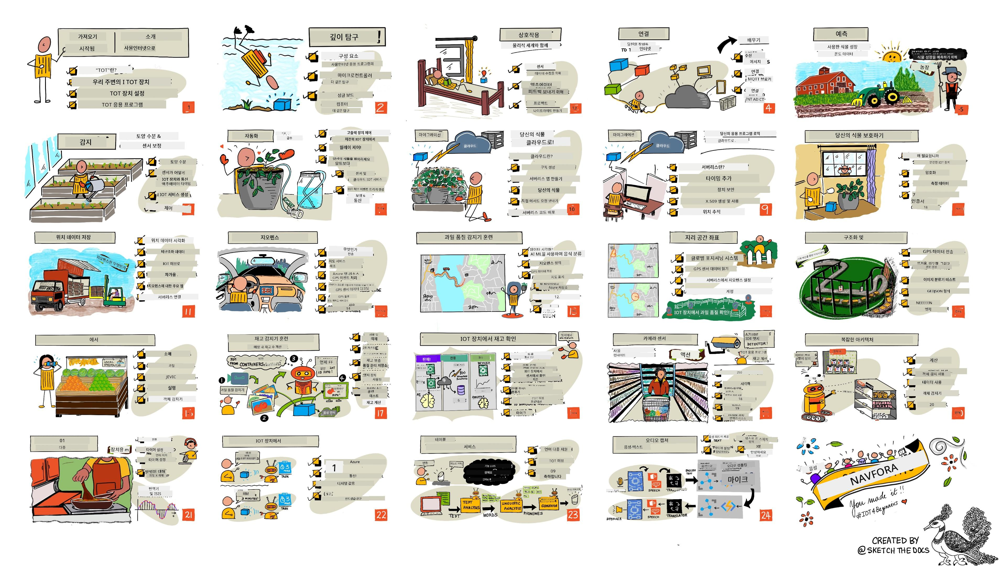

<!--
CO_OP_TRANSLATOR_METADATA:
{
  "original_hash": "6c354ec3487e4f6cfafbe44557996cd9",
  "translation_date": "2026-01-05T21:44:46+00:00",
  "source_file": "README.md",
  "language_code": "ko"
}
-->
[](https://github.com/microsoft/IoT-For-Beginners/blob/master/LICENSE)
[](https://GitHub.com/microsoft/IoT-For-Beginners/graphs/contributors/)
[](https://GitHub.com/microsoft/IoT-For-Beginners/issues/)
[](https://GitHub.com/microsoft/IoT-For-Beginners/pulls/)
[](http://makeapullrequest.com)

[](https://GitHub.com/microsoft/IoT-For-Beginners/watchers/)
[](https://GitHub.com/microsoft/IoT-For-Beginners/network/)
[](https://GitHub.com/microsoft/IoT-For-Beginners/stargazers/)

### Azure AI Foundry 커뮤니티에 참여하세요

AI 앱 개발에 대해 막히거나 질문이 있을 경우, MCP에 대해 학습하는 동료 학습자 및 경험 많은 개발자들과 함께 토론에 참여하세요. 질문이 환영받고 지식이 자유롭게 공유되는 지원 커뮤니티입니다.

[](https://discord.gg/nTYy5BXMWG)

제품 피드백이나 개발 중 오류가 있을 경우 방문하세요:

[](https://aka.ms/foundry/forum)

이 리소스 사용을 시작하려면 다음 단계를 따르세요:
1. **저장소 포크**: 클릭 [](https://GitHub.com/microsoft/IoT-For-Beginners/fork)
2. **저장소 클론**:   `git clone https://github.com/microsoft/IoT-For-Beginners.git`
3. [**Microsoft Foundry Discord에 참여하여 전문가 및 동료 개발자들을 만나보세요**](https://discord.com/invite/ByRwuEEgH4)


### 🌐 다국어 지원

#### GitHub Action을 통한 지원 (자동 및 항상 최신 상태 유지)

<!-- CO-OP TRANSLATOR LANGUAGES TABLE START -->
[Arabic](../ar/README.md) | [Bengali](../bn/README.md) | [Bulgarian](../bg/README.md) | [Burmese (Myanmar)](../my/README.md) | [Chinese (Simplified)](../zh/README.md) | [Chinese (Traditional, Hong Kong)](../hk/README.md) | [Chinese (Traditional, Macau)](../mo/README.md) | [Chinese (Traditional, Taiwan)](../tw/README.md) | [Croatian](../hr/README.md) | [Czech](../cs/README.md) | [Danish](../da/README.md) | [Dutch](../nl/README.md) | [Estonian](../et/README.md) | [Finnish](../fi/README.md) | [French](../fr/README.md) | [German](../de/README.md) | [Greek](../el/README.md) | [Hebrew](../he/README.md) | [Hindi](../hi/README.md) | [Hungarian](../hu/README.md) | [Indonesian](../id/README.md) | [Italian](../it/README.md) | [Japanese](../ja/README.md) | [Kannada](../kn/README.md) | [Korean](./README.md) | [Lithuanian](../lt/README.md) | [Malay](../ms/README.md) | [Malayalam](../ml/README.md) | [Marathi](../mr/README.md) | [Nepali](../ne/README.md) | [Nigerian Pidgin](../pcm/README.md) | [Norwegian](../no/README.md) | [Persian (Farsi)](../fa/README.md) | [Polish](../pl/README.md) | [Portuguese (Brazil)](../br/README.md) | [Portuguese (Portugal)](../pt/README.md) | [Punjabi (Gurmukhi)](../pa/README.md) | [Romanian](../ro/README.md) | [Russian](../ru/README.md) | [Serbian (Cyrillic)](../sr/README.md) | [Slovak](../sk/README.md) | [Slovenian](../sl/README.md) | [Spanish](../es/README.md) | [Swahili](../sw/README.md) | [Swedish](../sv/README.md) | [Tagalog (Filipino)](../tl/README.md) | [Tamil](../ta/README.md) | [Telugu](../te/README.md) | [Thai](../th/README.md) | [Turkish](../tr/README.md) | [Ukrainian](../uk/README.md) | [Urdu](../ur/README.md) | [Vietnamese](../vi/README.md)

> **로컬 클론을 선호하시나요?**

> 이 저장소에는 50개 이상의 언어 번역본이 포함되어 있어 다운로드 크기가 크게 증가합니다. 번역 없이 클론하려면 sparse checkout을 사용하세요:
> ```bash
> git clone --filter=blob:none --sparse https://github.com/microsoft/IoT-For-Beginners.git
> cd IoT-For-Beginners
> git sparse-checkout set --no-cone '/*' '!translations' '!translated_images'
> ```
> 이 방법은 훨씬 빠른 다운로드로 수업을 완료하는 데 필요한 모든 것을 제공합니다.
<!-- CO-OP TRANSLATOR LANGUAGES TABLE END -->

# 초보자를 위한 IoT - 교육 과정

마이크로소프트 Azure Cloud Advocates는 IoT 기초에 관한 12주, 24개 수업의 커리큘럼을 기쁘게 제공합니다. 각 수업은 사전 및 사후 퀴즈, 수업 완료를 위한 서면 지침, 솔루션, 과제 등을 포함합니다. 프로젝트 기반 교수법으로 학습하면서 실제로 만들어가며 배우는 방식은 새로운 기술이 ‘붙는’ 검증된 방법입니다.

프로젝트들은 농장에서 식탁까지 음식의 여정을 다룹니다. 여기에는 농업, 물류, 제조, 소매 및 소비자가 포함되며, 모두 IoT 장치의 인기 산업 분야입니다.



> 스케치노트: [Nitya Narasimhan](https://github.com/nitya). 이미지를 클릭하면 큰 버전을 볼 수 있습니다.

**저자 [Jen Fox](https://github.com/jenfoxbot), [Jen Looper](https://github.com/jlooper), [Jim Bennett](https://github.com/jimbobbennett), 그리고 스케치노트 작가 [Nitya Narasimhan](https://github.com/nitya)께 진심으로 감사드립니다.**

**또한 이 커리큘럼을 검토 및 번역해 준 [Microsoft Learn Student Ambassadors](https://studentambassadors.microsoft.com?WT.mc_id=academic-17441-jabenn) 팀 - [Aditya Garg](https://github.com/AdityaGarg00), [Anurag Sharma](https://github.com/Anurag-0-1-A), [Arpita Das](https://github.com/Arpiiitaaa), [Aryan Jain](https://www.linkedin.com/in/aryan-jain-47a4a1145/), [Bhavesh Suneja](https://github.com/EliteWarrior315), [Faith Hunja](https://faithhunja.github.io/), [Lateefah Bello](https://www.linkedin.com/in/lateefah-bello/), [Manvi Jha](https://github.com/Severus-Matthew), [Mireille Tan](https://www.linkedin.com/in/mireille-tan-a4834819a/), [Mohammad Iftekher (Iftu) Ebne Jalal](https://github.com/Iftu119), [Mohammad Zulfikar](https://github.com/mohzulfikar), [Priyanshu Srivastav](https://www.linkedin.com/in/priyanshu-srivastav-b067241ba), [Thanmai Gowducheruvu](https://github.com/innovation-platform), [Zina Kamel](https://www.linkedin.com/in/zina-kamel/)**에게도 감사드립니다.

팀을 만나보세요!

[](https://youtu.be/-wippUJRi5k)

**GIF 제공** [Mohit Jaisal](https://linkedin.com/in/mohitjaisal)

> 🎥 위 이미지를 클릭하여 프로젝트에 관한 영상을 시청하세요!

> **교사 여러분**, 이 커리큘럼을 활용하는 방법에 대한 [몇 가지 제안](for-teachers.md)을 포함했습니다. 직접 강의를 만들고 싶으시면 [강의 템플릿](lesson-template/README.md)도 포함되어 있습니다.

> **[학생 여러분](https://aka.ms/student-page)**, 이 커리큘럼을 스스로 활용하려면 전체 저장소를 포크하여 사전 퀴즈부터 시작해 강의를 읽고 나머지 활동을 완료하세요. 솔루션 코드를 복사하기보다는 수업 내용을 이해하며 프로젝트를 만들어 보세요; 다만 솔루션 코드는 각 프로젝트 중심 수업의 /solutions 폴더에 열려 있습니다. 또 다른 방법은 친구들과 스터디 그룹을 만들어 함께 콘텐츠를 학습하는 것입니다. 더 깊은 학습을 위해서는 [Microsoft Learn](https://docs.microsoft.com/users/jimbobbennett/collections/ke2ehd351jopwr?WT.mc_id=academic-17441-jabenn)을 권장합니다.

이 코스의 영상 개요를 보려면 다음 영상을 확인하세요:

[](https://youtube.com/watch?v=bccEMm8gRuc "홍보 영상")

> 🎥 위 이미지를 클릭하여 프로젝트에 관한 영상을 시청하세요!

## 교수법

이 커리큘럼을 개발하면서 두 가지 교수 원칙을 선택했습니다: 프로젝트 기반 학습과 빈번한 퀴즈 포함입니다. 시리즈가 끝날 때쯤 학생들은 식물 모니터링 및 물 주기 시스템, 차량 추적기, 식품을 추적하고 검사하는 스마트 공장 설정, 음성 제어 요리 타이머를 직접 만들고, 사물인터넷 기초인 장치 코드 작성, 클라우드 연결, 텔레메트리 분석, 엣지 AI 실행 방법을 배웁니다.

프로젝트와 일치하는 콘텐츠를 보장함으로써, 학생들에게 더 흥미롭고 개념 이해도가 향상됩니다.

또한 수업 전에 부담 없는 퀴즈로 학습 주제에 대한 학생의 의도를 설정하고, 수업 후 두 번째 퀴즈로 추가 학습을 도모합니다. 이 커리큘럼은 유연하고 즐겁게 설계되어 전체 또는 일부만 수강할 수 있습니다. 프로젝트는 작게 시작해 12주 차에 점점 복잡해집니다.

각 프로젝트는 학생 및 취미 개발자가 사용할 수 있는 실제 하드웨어를 중심으로 합니다. 각 프로젝트는 해당 도메인에 관한 배경 지식을 제공합니다. 성공적인 개발자가 되려면 문제 해결 대상 분야를 이해하는 것이 도움이 되며, 이런 배경 지식은 학생들이 IoT 솔루션 및 학습을 현실 세계 문제 맥락에서 사고하게 해 줍니다. 학생들은 자신이 만드는 솔루션의 ‘왜’를 이해하고 최종 사용자에 대한 인식을 얻습니다.

## 하드웨어

개인 취향, 프로그래밍 언어 지식 및 선호도, 학습 목표와 접근성에 따라 프로젝트에 사용할 두 가지 IoT 하드웨어 선택지가 있습니다. 또한 하드웨어가 없거나 구매 전에 더 배우고 싶은 분들을 위한 ‘가상 하드웨어’ 버전도 제공합니다. [하드웨어 페이지](./hardware.md)에서 자세한 내용과 Seeed Studio 친구들의 완전한 키트 구매 링크를 포함한 ‘쇼핑 리스트’를 확인할 수 있습니다.
> 💁 저희의 [행동 강령](CODE_OF_CONDUCT.md), [기여 가이드](CONTRIBUTING.md), 그리고 [번역 가이드](TRANSLATIONS.md)를 확인하세요. 여러분의 건설적인 피드백을 환영합니다!
>
> 🔧 문제가 있으신가요? 일반적인 문제에 대한 해결책은 [문제 해결 가이드](TROUBLESHOOTING.md)를 참조하세요.

## 각 강의에는 다음이 포함됩니다:

- 스케치노트
- 선택적 보조 동영상
- 강의 전 워밍업 퀴즈
- 서면 강의
- 프로젝트 기반 강의의 경우, 프로젝트를 만드는 단계별 가이드
- 지식 점검
- 도전 과제
- 보충 자료 읽기
- 과제
- [강의 후 퀴즈](https://ff-quizzes.netlify.app/en/)

> **퀴즈에 대한 참고:** 모든 퀴즈는 quiz-app 폴더에 포함되어 있으며, 총 48개의 퀴즈가 각각 세 문제로 구성되어 있습니다. 강의 내에서 링크되어 있지만 quiz-app은 로컬에서 실행하거나 Azure에 배포할 수 있습니다; `quiz-app` 폴더의 지침을 따르세요. 점차 현지화되고 있습니다.

## 강의 목록

|       |              프로젝트 이름              |                       다루는 개념                       | 학습 목표                                                                                                                                                        |                                                        연결된 강의                                                         |
| :---: | :------------------------------------: | :-----------------------------------------------------: | --------------------------------------------------------------------------------------------------------------------------------------------------------------- | :--------------------------------------------------------------------------------------------------------------------------: |
|  01   | [시작하기](./1-getting-started/README.md) |                     IoT 소개                     | IoT의 기본 원리와 센서 및 클라우드 서비스와 같은 IoT 솔루션의 기본 구성 요소를 배우며 첫 IoT 장치를 설정합니다 |                      [IoT 소개](./1-getting-started/lessons/1-introduction-to-iot/README.md)                      |
|  02   | [시작하기](./1-getting-started/README.md) |                   IoT 심화                   | IoT 시스템의 구성 요소뿐만 아니라 마이크로컨트롤러와 싱글보드 컴퓨터에 대해 더 자세히 배웁니다                                                            |                        [IoT 심화](./1-getting-started/lessons/2-deeper-dive/README.md)                         |
|  03   | [시작하기](./1-getting-started/README.md) | 센서와 액추에이터로 물리 세계와 상호작용하기 | 물리 세계에서 데이터를 수집하는 센서와 피드백을 보내는 액추에이터에 대해 배우며 나이트라이트를 만듭니다                                           | [센서와 액추에이터로 물리 세계와 상호작용하기](./1-getting-started/lessons/3-sensors-and-actuators/README.md) |
|  04   | [시작하기](./1-getting-started/README.md) |             장치를 인터넷에 연결하기             | MQTT 브로커에 나이트라이트를 연결하여 메시지를 송수신하는 IoT 장치를 인터넷에 연결하는 방법을 배웁니다                               |               [장치를 인터넷에 연결하기](./1-getting-started/lessons/4-connect-internet/README.md)                |
|  05   |            [농장](./2-farm/README.md)            |                    식물 성장 예측                     | IoT 장치로 수집한 온도 데이터를 사용해 식물 성장을 예측하는 방법을 배웁니다                                                                                  |                          [식물 성장 예측](./2-farm/lessons/1-predict-plant-growth/README.md)                           |
|  06   |            [농장](./2-farm/README.md)            |                    토양 수분 감지                     | 토양 수분을 감지하고 토양 수분 센서를 보정하는 방법을 배웁니다                                                                                              |                          [토양 수분 감지](./2-farm/lessons/2-detect-soil-moisture/README.md)                           |
|  07   |            [농장](./2-farm/README.md)            |                  자동 식물 급수                   | 릴레이와 MQTT를 사용하여 급수를 자동화하고 시간 설정하는 방법을 배웁니다                                                                                                      |                      [자동 식물 급수](./2-farm/lessons/3-automated-plant-watering/README.md)                       |
|  08   |            [농장](./2-farm/README.md)            |               클라우드로 식물 데이터 이전               | 클라우드 및 클라우드 호스팅 IoT 서비스에 대해 배우고, 공개 MQTT 브로커 대신 식물을 이러한 서비스 중 하나에 연결하는 방법을 배웁니다                                   |               [클라우드로 식물 데이터 이전](./2-farm/lessons/4-migrate-your-plant-to-the-cloud/README.md)                |
|  09   |            [농장](./2-farm/README.md)            |         애플리케이션 로직을 클라우드로 이전         | IoT 메시지에 반응하는 애플리케이션 로직을 클라우드에서 작성하는 방법을 배웁니다                                                                          |         [애플리케이션 로직을 클라우드로 이전](./2-farm/lessons/5-migrate-application-to-the-cloud/README.md)         |
|  10   |            [농장](./2-farm/README.md)            |                   식물을 안전하게 보호하기                    | IoT 보안에 대해 배우고 키와 인증서로 식물을 안전하게 보호하는 방법을 학습합니다                                                                          |                        [식물을 안전하게 보호하기](./2-farm/lessons/6-keep-your-plant-secure/README.md)                         |
|  11   |       [운송](./3-transport/README.md)       |                      위치 추적                      | IoT 장치의 GPS 위치 추적에 대해 배웁니다                                                                                                                   |                           [위치 추적](./3-transport/lessons/1-location-tracking/README.md)                           |
|  12   |       [운송](./3-transport/README.md)       |                     위치 데이터 저장                     | 나중에 시각화하거나 분석할 수 있도록 IoT 데이터를 저장하는 방법을 배웁니다                                                                                                      |                         [위치 데이터 저장](./3-transport/lessons/2-store-location-data/README.md)                         |
|  13   |       [운송](./3-transport/README.md)       |                   위치 데이터 시각화                   | 지도 상에서 위치 데이터를 시각화하는 방법과 지도가 실제 3차원 세계를 2차원으로 표현하는 방식을 배웁니다                                                            |                     [위치 데이터 시각화](./3-transport/lessons/3-visualize-location-data/README.md)                     |
|  14   |       [운송](./3-transport/README.md)       |                          지리적 펜스                          | 지리적 펜스에 대해 배우고, 공급망 내 차량이 목적지에 가까워질 때 알림을 받는 방법을 배웁니다                                           |                                   [지리적 펜스](./3-transport/lessons/4-geofences/README.md)                                   |
|  15   |   [제조](./4-manufacturing/README.md)   |               과일 품질 탐지기 학습                | 클라우드에서 이미지 분류기를 학습하여 과일 품질을 감지하는 방법을 배웁니다                                                                                       |                 [과일 품질 탐지기 학습](./4-manufacturing/lessons/1-train-fruit-detector/README.md)                 |
|  16   |   [제조](./4-manufacturing/README.md)   |           IoT 장치로 과일 품질 확인            | IoT 장치에서 과일 품질 탐지기를 사용하는 방법을 배웁니다                                                                                                    |           [IoT 장치로 과일 품질 확인](./4-manufacturing/lessons/2-check-fruit-from-device/README.md)            |
|  17   |   [제조](./4-manufacturing/README.md)   |             에지에서 과일 탐지기 실행             | 에지 IoT 장치에서 과일 탐지기를 실행하는 방법을 배웁니다                                                                                                |             [에지에서 과일 탐지기 실행](./4-manufacturing/lessons/3-run-fruit-detector-edge/README.md)             |
|  18   |   [제조](./4-manufacturing/README.md)   |        센서로 과일 품질 감지 트리거        | 센서에서 과일 품질 감지를 트리거하는 방법을 배웁니다                                                                                                        |        [센서로 과일 품질 감지 트리거](./4-manufacturing/lessons/4-trigger-fruit-detector/README.md)         |
|  19   |          [소매](./5-retail/README.md)          |                   재고 탐지기 학습                    | 객체 탐지를 사용해 매장의 재고를 세는 재고 탐지기를 학습하는 방법을 배웁니다                                                                                |                        [재고 탐지기 학습](./5-retail/lessons/1-train-stock-detector/README.md)                         |
|  20   |          [소매](./5-retail/README.md)          |               IoT 장치로 재고 확인                | 객체 탐지 모델을 사용해 IoT 장치로 재고를 확인하는 방법을 배웁니다                                                                                         |                     [IoT 장치로 재고 확인](./5-retail/lessons/2-check-stock-device/README.md)                      |
|  21   |        [소비자](./6-consumer/README.md)        |             IoT 장치로 음성 인식             | IoT 장치에서 음성을 인식해 스마트 타이머를 구축하는 방법을 배웁니다                                                                                             |                  [IoT 장치로 음성 인식](./6-consumer/lessons/1-speech-recognition/README.md)                  |
|  22   |        [소비자](./6-consumer/README.md)        |                     언어 이해                     | IoT 장치에 말한 문장을 이해하는 방법을 배웁니다                                                                                                           |                        [언어 이해](./6-consumer/lessons/2-language-understanding/README.md)                        |
|  23   |        [소비자](./6-consumer/README.md)        |           타이머 설정 및 음성 피드백 제공           | IoT 장치에서 타이머를 설정하고 타이머 설정 시와 종료 시 음성 피드백을 제공하는 방법을 배웁니다                                                    |                 [타이머 설정 및 음성 피드백 제공](./6-consumer/lessons/3-spoken-feedback/README.md)                  |
|  24   |        [소비자](./6-consumer/README.md)        |                 다국어 지원                  | 스마트 타이머가 여러 언어를 이해하고 응답할 수 있도록 지원하는 방법을 배웁니다                                                               |                   [다국어 지원](./6-consumer/lessons/4-multiple-language-support/README.md)                   |

## 오프라인 접근

[Docsify](https://docsify.js.org/#/)를 사용하여 이 문서를 오프라인으로 실행할 수 있습니다. 이 저장소를 포크하고, 로컬 컴퓨터에 [Docsify를 설치](https://docsify.js.org/#/quickstart)한 다음, 이 저장소 루트 폴더에서 `docsify serve`를 입력하세요. 웹사이트는 로컬호스트의 포트 3000에서 제공됩니다: `localhost:3000`.

## 퀴즈

각 챕터에 대한 지식을 테스트하는 인터랙티브 퀴즈를 제공해 주신 커뮤니티에 감사드립니다. 지식을 [여기](https://ff-quizzes.netlify.app/en/)에서 테스트해 보세요.

### PDF

필요한 경우 이 내용을 오프라인으로 접근할 수 있도록 PDF로 생성할 수 있습니다. 이를 위해 [npm이 설치되어 있는지](https://docs.npmjs.com/downloading-and-installing-node-js-and-npm) 확인한 후 이 저장소 루트 폴더에서 다음 명령어를 실행하세요:

```sh
npm i
npm run convert
```

### 슬라이드

일부 강의에 대한 슬라이드 데크는 [slides](../../slides) 폴더에 있습니다.


## 기타 커리큘럼

우리 팀은 다른 커리큘럼도 제작합니다! 확인해 보세요:

<!-- CO-OP TRANSLATOR OTHER COURSES START -->
### LangChain
[](https://aka.ms/langchain4j-for-beginners)
[](https://aka.ms/langchainjs-for-beginners?WT.mc_id=m365-94501-dwahlin)

---

### Azure / Edge / MCP / Agents
[](https://github.com/microsoft/AZD-for-beginners?WT.mc_id=academic-105485-koreyst)
[](https://github.com/microsoft/edgeai-for-beginners?WT.mc_id=academic-105485-koreyst)
[](https://github.com/microsoft/mcp-for-beginners?WT.mc_id=academic-105485-koreyst)
[](https://github.com/microsoft/ai-agents-for-beginners?WT.mc_id=academic-105485-koreyst)

---
 
### 생성형 AI 시리즈
[](https://github.com/microsoft/generative-ai-for-beginners?WT.mc_id=academic-105485-koreyst)
[-9333EA?style=for-the-badge&labelColor=E5E7EB&color=9333EA)](https://github.com/microsoft/Generative-AI-for-beginners-dotnet?WT.mc_id=academic-105485-koreyst)
[-C084FC?style=for-the-badge&labelColor=E5E7EB&color=C084FC)](https://github.com/microsoft/generative-ai-for-beginners-java?WT.mc_id=academic-105485-koreyst)
[-E879F9?style=for-the-badge&labelColor=E5E7EB&color=E879F9)](https://github.com/microsoft/generative-ai-with-javascript?WT.mc_id=academic-105485-koreyst)

---
 
### 핵심 학습
[](https://aka.ms/ml-beginners?WT.mc_id=academic-105485-koreyst)
[](https://aka.ms/datascience-beginners?WT.mc_id=academic-105485-koreyst)
[](https://aka.ms/ai-beginners?WT.mc_id=academic-105485-koreyst)
[](https://github.com/microsoft/Security-101?WT.mc_id=academic-96948-sayoung)
[](https://aka.ms/webdev-beginners?WT.mc_id=academic-105485-koreyst)
[](https://aka.ms/iot-beginners?WT.mc_id=academic-105485-koreyst)
[](https://github.com/microsoft/xr-development-for-beginners?WT.mc_id=academic-105485-koreyst)

---
 
### 코파일럿 시리즈
[](https://aka.ms/GitHubCopilotAI?WT.mc_id=academic-105485-koreyst)
[](https://github.com/microsoft/mastering-github-copilot-for-dotnet-csharp-developers?WT.mc_id=academic-105485-koreyst)
[](https://github.com/microsoft/CopilotAdventures?WT.mc_id=academic-105485-koreyst)
<!-- CO-OP TRANSLATOR OTHER COURSES END -->

## 이미지 출처

이 커리큘럼에서 사용된 이미지의 모든 출처는 필요 시 [Attributions](./attributions.md)에서 확인할 수 있습니다.

---

<!-- CO-OP TRANSLATOR DISCLAIMER START -->
**면책 조항**:  
이 문서는 AI 번역 서비스 [Co-op Translator](https://github.com/Azure/co-op-translator)를 사용하여 번역되었습니다. 정확성을 위해 최선을 다했으나, 자동 번역에는 오류나 부정확성이 포함될 수 있음을 유의해 주시기 바랍니다. 원래 문서의 원어가 권위 있는 출처로 간주되어야 합니다. 중요한 정보에 대해서는 전문적인 인간 번역을 권장합니다. 본 번역의 사용으로 인해 발생하는 오해나 잘못된 해석에 대해서는 책임을 지지 않습니다.
<!-- CO-OP TRANSLATOR DISCLAIMER END -->