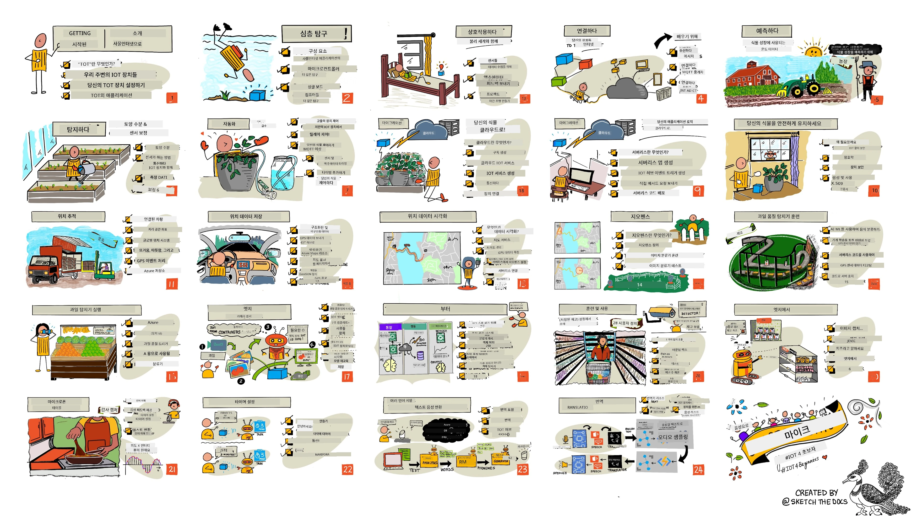

### Azure AI Foundry 커뮤니티에 참여하세요

AI 앱 구축에 관한 질문이 있거나 막혔을 때, MCP에 대해 토론하는 학습자들과 경험 많은 개발자들과 함께하세요. 질문이 환영받고 지식이 자유롭게 공유되는 지원적인 커뮤니티입니다.

제품 피드백이나 빌드 중 오류가 있는 경우 방문하세요:

이 리소스를 사용해서 시작하려면 다음 단계를 따르세요:
1. **저장소 포크하기**: 클릭 [](https://GitHub.com/microsoft/IoT-For-Beginners/fork)
2. **저장소 클론하기**: `git clone https://github.com/microsoft/IoT-For-Beginners.git`
3. [**Microsoft Foundry Discord에 참여하여 전문가와 동료 개발자를 만나세요**](https://discord.com/invite/ByRwuEEgH4)

### 🌐 다국어 지원

#### GitHub Action을 통한 지원 (자동화 및 항상 최신 상태 유지)

> **로컬에서 클론하시겠습니까?**
>
> 이 저장소에는 50개 이상의 언어 번역이 포함되어 있어 다운로드 크기가 상당히 커집니다. 번역 없이 클론하려면 희소 체크아웃을 사용하세요:
>
> **Bash / macOS / Linux:**
> ```bash
> git clone --filter=blob:none --sparse https://github.com/microsoft/IoT-For-Beginners.git
> cd IoT-For-Beginners
> git sparse-checkout set --no-cone '/*' '!translations' '!translated_images'
> ```
>
> **CMD (Windows):**
> ```cmd
> git clone --filter=blob:none --sparse https://github.com/microsoft/IoT-For-Beginners.git
> cd IoT-For-Beginners
> git sparse-checkout set --no-cone "/*" "!translations" "!translated_images"
> ```
>
> 이것은 코스를 완료하는 데 필요한 모든 것을 훨씬 빠른 다운로드로 제공합니다.

# 초보자를 위한 IoT - 커리큘럼

Microsoft의 Azure 클라우드 대사들이 12주간 24개의 수업으로 구성된 IoT 기본에 관한 커리큘럼을 제공합니다. 각 수업에는 수업 전후 퀴즈, 수업 완료를 위한 서면 지침, 솔루션, 과제 등이 포함되어 있습니다. 프로젝트 기반의 교수법을 통해 새로운 기술이 '착 달라붙도록' 학습하면서 직접 구축할 수 있습니다.

프로젝트는 농장에서 식탁까지 음식의 여정을 다룹니다. 여기에는 농업, 물류, 제조, 소매, 소비자 등 IoT 기기가 많이 사용되는 산업 분야가 포함됩니다.



> [Nitya Narasimhan](https://github.com/nitya)의 스케치노트입니다. 더 큰 버전을 보려면 이미지를 클릭하세요.

**저자 [Jen Fox](https://github.com/jenfoxbot), [Jen Looper](https://github.com/jlooper), [Jim Bennett](https://github.com/jimbobbennett), 그리고 스케치노트 아티스트 [Nitya Narasimhan](https://github.com/nitya)에게 진심으로 감사드립니다.**

**이 커리큘럼을 검토하고 번역해 준 [Microsoft Learn 학생 홍보대사](https://studentambassadors.microsoft.com?WT.mc_id=academic-17441-jabenn) 팀에도 감사드립니다 - [Aditya Garg](https://github.com/AdityaGarg00), [Anurag Sharma](https://github.com/Anurag-0-1-A), [Arpita Das](https://github.com/Arpiiitaaa), [Aryan Jain](https://www.linkedin.com/in/aryan-jain-47a4a1145/), [Bhavesh Suneja](https://github.com/EliteWarrior315), [Faith Hunja](https://faithhunja.github.io/), [Lateefah Bello](https://www.linkedin.com/in/lateefah-bello/), [Manvi Jha](https://github.com/Severus-Matthew), [Mireille Tan](https://www.linkedin.com/in/mireille-tan-a4834819a/), [Mohammad Iftekher (Iftu) Ebne Jalal](https://github.com/Iftu119), [Mohammad Zulfikar](https://github.com/mohzulfikar), [Priyanshu Srivastav](https://www.linkedin.com/in/priyanshu-srivastav-b067241ba), [Thanmai Gowducheruvu](https://github.com/innovation-platform), 그리고 [Zina Kamel](https://www.linkedin.com/in/zina-kamel/)**

팀을 만나보세요!

[](https://youtu.be/-wippUJRi5k)

**Gif 제작자** [Mohit Jaisal](https://linkedin.com/in/mohitjaisal)

> 🎥 프로젝트에 관한 영상은 위 이미지를 클릭하세요!

> **교사 여러분**, 이 커리큘럼을 활용하는 방법에 대한 [몇 가지 제안](for-teachers.md)을 포함했습니다. 자신만의 수업을 만들고 싶다면 [수업 템플릿](lesson-template/README.md)도 제공합니다.

> **[학생 여러분](https://aka.ms/student-page)**, 이 커리큘럼을 혼자 사용하려면 전체 저장소를 포크하여 사전 강의 퀴즈, 강의 읽기 그리고 나머지 활동 완료 순서대로 진행하세요. 솔루션 코드 복사보다 수업 내용을 이해하면서 프로젝트를 시도해 보세요. 각 프로젝트 지향 수업의 /solutions 폴더에는 코드가 제공됩니다. 또 다른 방법은 친구들과 스터디 그룹을 만들어 함께 콘텐츠를 학습하는 것입니다. 추가 학습 자료로 [Microsoft Learn](https://docs.microsoft.com/users/jimbobbennett/collections/ke2ehd351jopwr?WT.mc_id=academic-17441-jabenn)을 추천합니다.

이 코스의 영상 개요를 보고 싶다면 다음 영상을 확인하세요:

[](https://youtube.com/watch?v=bccEMm8gRuc "홍보 영상")

> 🎥 프로젝트에 대한 영상은 위 이미지를 클릭하세요!

## 교수법

이 커리큘럼을 만들면서 프로젝트 기반 학습과 빈번한 퀴즈를 포함시키는 두 가지 교수 원칙을 선택했습니다. 이 시리즈를 마치면 학생들은 식물을 모니터링하고 물을 주는 시스템, 차량 추적기, 식품을 추적하고 검사하는 스마트 공장 설치, 음성으로 제어하는 요리 타이머를 구축하며, IoT의 기본 개념 including 디바이스 코드 작성, 클라우드 연결, 텔레메트리 분석, 에지 AI 실행을 배우게 됩니다.

프로젝트와 내용이 일치함으로써 학생들의 참여도를 높이고 개념 이해도를 향상시킬 수 있습니다.

또한 수업 전 낮은 부담의 퀴즈는 학생이 주제에 집중하도록 하고, 수업 후 두 번째 퀴즈는 개념 기억을 강화합니다. 이 커리큘럼은 유연하고 재미있게 설계되었으며 전부 혹은 일부를 수강할 수 있습니다. 프로젝트는 작게 시작해 12주 주기 말에는 점점 더 복잡해집니다.

각 프로젝트는 학생과 취미자들이 구할 수 있는 실제 하드웨어를 기반으로 합니다. 각 프로젝트는 해당 프로젝트 영역에 대한 배경 지식을 제공하여 성공적인 개발자가 문제를 해결하는 분야를 이해하는 데 도움을 줍니다. 이는 학생들이 IoT 개발자로서 실생활 문제를 해결할 때 자신들의 IoT 솔루션과 학습 내용을 생각할 수 있게 합니다. 학생들은 자신들이 만드는 솔루션의 '이유'를 배우고 최종 사용자를 이해하게 됩니다.

## 하드웨어
프로젝트에 사용할 수 있는 두 가지 IoT 하드웨어 선택지가 있습니다. 개인의 선호도, 프로그래밍 언어 지식 또는 선호도, 학습 목표 및 가용성에 따라 결정할 수 있습니다. 하드웨어 접근이 어렵거나 구매 전에 더 배우고 싶은 분들을 위해 '가상 하드웨어' 버전도 제공하고 있습니다. [하드웨어 페이지](./hardware.md)에서 더 자세한 내용을 읽고, Seeed Studio에서 제공하는 완성 키트를 구매할 수 있는 링크가 포함된 '쇼핑 리스트'도 확인할 수 있습니다.

> 💁 [행동 강령](CODE_OF_CONDUCT.md), [기여 가이드](CONTRIBUTING.md), [번역 가이드라인](..)을 확인하세요. 여러분의 건설적인 피드백을 환영합니다!
>
> 🔧 문제가 있나요? 흔히 발생하는 문제에 대한 해결책을 다룬 [문제 해결 가이드](TROUBLESHOOTING.md)를 확인해보세요.

## 각 강의에는 다음이 포함됩니다:

- 스케치노트
- 선택적 보조 영상
- 강의 전 워밍업 퀴즈
- 서면 강의 자료
- 프로젝트 기반 강의의 경우, 프로젝트를 만드는 단계별 가이드
- 지식 점검
- 챌린지
- 보충 읽기 자료
- 과제
- [강의 후 퀴즈](https://ff-quizzes.netlify.app/en/)

> **퀴즈에 대한 주의사항**: 모든 퀴즈는 quiz-app 폴더에 포함되어 있으며, 총 48개의 퀴즈가 있으며 각 퀴즈는 세 개의 질문으로 구성되어 있습니다. 강의 내에서 링크되어 있지만, 이 퀴즈 앱은 로컬에서 실행하거나 Azure에 배포할 수 있습니다. quiz-app 폴더 내 지침을 따라주세요. 점진적으로 현지화 작업이 진행 중입니다.

## 강의 목록

|       |              프로젝트 이름              |                       교육 내용                       | 학습 목표                                                                                                                                                 |                                                        연동 강의                                                         |
| :---: | :------------------------------------: | :-------------------------------------------------: | --------------------------------------------------------------------------------------------------------------------------------------------------------- | :------------------------------------------------------------------------------------------------------------------------: |
|  01   | [시작하기](./1-getting-started/README.md) |                     IoT 소개                     | IoT의 기본 원리와 센서 및 클라우드 서비스와 같이 IoT 솔루션의 기본 요소들을 학습하며 첫 IoT 장치를 설정해봅니다. |                      [IoT 소개](./1-getting-started/lessons/1-introduction-to-iot/README.md)                      |
|  02   | [시작하기](./1-getting-started/README.md) |                   IoT 심층 탐구                    | IoT 시스템의 구성 요소와 마이크로컨트롤러 및 싱글보드 컴퓨터에 대해 더 깊이 배웁니다.                                                             |                        [IoT 심층 탐구](./1-getting-started/lessons/2-deeper-dive/README.md)                         |
|  03   | [시작하기](./1-getting-started/README.md) | 센서 및 액추에이터로 물리적 세계와 상호작용하기 | 물리적 세계에서 데이터를 수집하는 센서와 피드백을 보내는 액추에이터에 대해 배우면서 나이트라이트를 만듭니다.                                           | [센서 및 액추에이터로 물리적 세계와 상호작용하기](./1-getting-started/lessons/3-sensors-and-actuators/README.md) |
|  04   | [시작하기](./1-getting-started/README.md) |             장치를 인터넷에 연결하기             | MQTT 브로커에 나이트라이트를 연결하여 IoT 장치를 인터넷에 연결하고 메시지를 송수신하는 방법을 학습합니다.                               |               [장치를 인터넷에 연결하기](./1-getting-started/lessons/4-connect-internet/README.md)                |
|  05   |            [농장](./2-farm/README.md)            |                    식물 성장 예측                     | IoT 장치로 수집한 온도 데이터를 사용하여 식물 성장을 예측하는 방법을 배웁니다.                                                                                  |                          [식물 성장 예측](./2-farm/lessons/1-predict-plant-growth/README.md)                           |
|  06   |            [농장](./2-farm/README.md)            |                    토양 수분 감지                     | 토양 수분을 감지하고 토양 수분 센서를 보정하는 방법을 배웁니다.                                                                                              |                          [토양 수분 감지](./2-farm/lessons/2-detect-soil-moisture/README.md)                           |
|  07   |            [농장](./2-farm/README.md)            |                  자동 식물 급수                   | 릴레이와 MQTT를 사용해 자동으로 식물에 물을 주고 시간을 설정하는 방법을 배웁니다.                                                                                                      |                      [자동 식물 급수](./2-farm/lessons/3-automated-plant-watering/README.md)                       |
|  08   |            [농장](./2-farm/README.md)            |               식물을 클라우드로 이전하기               | 클라우드 및 클라우드 호스팅 IoT 서비스에 관해 배우고, 기존 공용 MQTT 브로커 대신 식물을 클라우드에 연결하는 방법을 배웁니다.                                   |               [식물을 클라우드로 이전하기](./2-farm/lessons/4-migrate-your-plant-to-the-cloud/README.md)                |
|  09   |            [농장](./2-farm/README.md)            |         애플리케이션 로직을 클라우드로 이전하기         | IoT 메시지에 반응하는 클라우드 기반 애플리케이션 로직 작성 방법을 배웁니다.                                                                          |         [애플리케이션 로직을 클라우드로 이전하기](./2-farm/lessons/5-migrate-application-to-the-cloud/README.md)         |
|  10   |            [농장](./2-farm/README.md)            |                   식물을 안전하게 보호하기                    | IoT 보안과 키 및 인증서를 사용하여 식물을 안전하게 보호하는 방법에 대해 배웁니다.                                                                          |                        [식물을 안전하게 보호하기](./2-farm/lessons/6-keep-your-plant-secure/README.md)                         |
|  11   |       [운송](./3-transport/README.md)       |                      위치 추적                      | IoT 장치에 대한 GPS 위치 추적에 대해 배웁니다.                                                                                                                   |                           [위치 추적](./3-transport/lessons/1-location-tracking/README.md)                           |
|  12   |       [운송](./3-transport/README.md)       |                     위치 데이터 저장                     | 나중에 시각화하거나 분석할 수 있도록 IoT 데이터를 저장하는 방법을 배웁니다.                                                                                                      |                         [위치 데이터 저장](./3-transport/lessons/2-store-location-data/README.md)                         |
|  13   |       [운송](./3-transport/README.md)       |                   위치 데이터 시각화                   | 지도 위에 위치 데이터를 시각화하는 방법과 지도가 3차원 실제 세계를 2차원으로 표현하는 방식을 배웁니다.                                                            |                     [위치 데이터 시각화](./3-transport/lessons/3-visualize-location-data/README.md)                     |
|  14   |       [운송](./3-transport/README.md)       |                          지오펜스                          | 지오펜스에 대해 배우고, 공급망 차량이 목적지 근처에 있을 때 경고를 발생시키는 데 어떻게 활용할 수 있는지 학습합니다.                                           |                                   [지오펜스](./3-transport/lessons/4-geofences/README.md)                                   |
|  15   |   [제조](./4-manufacturing/README.md)   |               과일 품질 탐지기 학습하기                | 클라우드에서 이미지 분류기를 학습하여 과일 품질을 탐지하는 방법을 배웁니다.                                                                                       |                 [과일 품질 탐지기 학습하기](./4-manufacturing/lessons/1-train-fruit-detector/README.md)                 |
|  16   |   [제조](./4-manufacturing/README.md)   |           IoT 장치로 과일 품질 검사하기            | IoT 장치에서 과일 품질 탐지기를 사용하는 방법을 배웁니다.                                                                                                    |           [IoT 장치로 과일 품질 검사하기](./4-manufacturing/lessons/2-check-fruit-from-device/README.md)            |
|  17   |   [제조](./4-manufacturing/README.md)   |             엣지에서 과일 탐지기 실행하기             | 엣지 IoT 장치에서 과일 탐지기를 실행하는 방법을 배웁니다.                                                                                                |             [엣지에서 과일 탐지기 실행하기](./4-manufacturing/lessons/3-run-fruit-detector-edge/README.md)             |
|  18   |   [제조](./4-manufacturing/README.md)   |        센서로 과일 품질 탐지 트리거하기        | 센서를 통해 과일 품질 탐지를 트리거하는 방법을 배웁니다.                                                                                                        |        [센서로 과일 품질 탐지 트리거하기](./4-manufacturing/lessons/4-trigger-fruit-detector/README.md)         |
|  19   |          [소매](./5-retail/README.md)          |                   재고 탐지기 학습하기                    | 객체 감지를 활용해 상점 내 재고를 계산하는 재고 탐지기를 훈련하는 방법을 배웁니다.                                                                                |                        [재고 탐지기 학습하기](./5-retail/lessons/1-train-stock-detector/README.md)                         |
|  20   |          [소매](./5-retail/README.md)          |               IoT 장치로 재고 확인하기                | 객체 감지 모델을 사용하여 IoT 장치로 재고를 확인하는 방법을 배웁니다.                                                                                         |                     [IoT 장치로 재고 확인하기](./5-retail/lessons/2-check-stock-device/README.md)                      |
|  21   |        [소비자](./6-consumer/README.md)        |             IoT 장치로 음성 인식하기             | IoT 장치로 음성을 인식해 스마트 타이머를 만드는 방법을 배웁니다.                                                                                             |                  [IoT 장치로 음성 인식하기](./6-consumer/lessons/1-speech-recognition/README.md)                  |
|  22   |        [소비자](./6-consumer/README.md)        |                     언어 이해하기                     | IoT 장치에 말한 문장을 이해하는 방법을 배웁니다.                                                                                                           |                        [언어 이해하기](./6-consumer/lessons/2-language-understanding/README.md)                        |
|  23   |        [소비자](./6-consumer/README.md)        |           타이머 설정 및 음성 피드백 제공           | IoT 장치에서 타이머를 설정하고 타이머가 설정될 때와 종료될 때 음성 피드백을 제공하는 방법을 배웁니다.                                                    |                 [타이머 설정 및 음성 피드백 제공](./6-consumer/lessons/3-spoken-feedback/README.md)                  |
|  24   |        [소비자](./6-consumer/README.md)        |                 다중 언어 지원                  | 스마트 타이머가 여러 언어로 음성을 이해하고 피드백을 제공하는 방법을 배웁니다.                                                               |                   [다중 언어 지원](./6-consumer/lessons/4-multiple-language-support/README.md)                   |

## 오프라인 접속

이 문서를 [Docsify](https://docsify.js.org/#/)를 사용하여 오프라인에서도 실행할 수 있습니다. 이 저장소를 포크하고, 로컬 컴퓨터에 [Docsify 설치](https://docsify.js.org/#/quickstart)를 한 후, 이 저장소의 루트 폴더에서 `docsify serve` 명령어를 입력하세요. 웹사이트는 로컬호스트의 3000번 포트에서 제공됩니다: `localhost:3000`.

## 퀴즈

각 장에 대한 지식을 테스트하는 대화형 퀴즈를 호스팅해 주신 커뮤니티에 감사드립니다. [여기](https://ff-quizzes.netlify.app/en/)에서 지식을 테스트할 수 있습니다.

### PDF

오프라인 접속을 위해 이 내용을 PDF로 생성할 수 있습니다. 이를 위해 [npm이 설치되어 있는지](https://docs.npmjs.com/downloading-and-installing-node-js-and-npm) 확인한 후, 이 저장소의 루트 폴더에서 다음 명령어를 실행하세요:

```sh
npm i
npm run convert
```

### 슬라이드

일부 강의를 위한 슬라이드 데크가 [slides](../../slides) 폴더에 있습니다.

## 기타 커리큘럼

저희 팀은 다른 커리큘럼도 제작합니다! 확인해보세요:

<!-- CO-OP TRANSLATOR OTHER COURSES START -->
### LangChain
[](https://aka.ms/langchain4j-for-beginners)
[](https://aka.ms/langchainjs-for-beginners?WT.mc_id=m365-94501-dwahlin)
[](https://github.com/microsoft/langchain-for-beginners?WT.mc_id=m365-94501-dwahlin)
---

### Azure / Edge / MCP / Agents
[](https://github.com/microsoft/AZD-for-beginners?WT.mc_id=academic-105485-koreyst)
[](https://github.com/microsoft/edgeai-for-beginners?WT.mc_id=academic-105485-koreyst)
[](https://github.com/microsoft/mcp-for-beginners?WT.mc_id=academic-105485-koreyst)
[](https://github.com/microsoft/ai-agents-for-beginners?WT.mc_id=academic-105485-koreyst)

---

### 생성 AI 시리즈
[](https://github.com/microsoft/generative-ai-for-beginners?WT.mc_id=academic-105485-koreyst)
[-9333EA?style=for-the-badge&labelColor=E5E7EB&color=9333EA)](https://github.com/microsoft/Generative-AI-for-beginners-dotnet?WT.mc_id=academic-105485-koreyst)
[-C084FC?style=for-the-badge&labelColor=E5E7EB&color=C084FC)](https://github.com/microsoft/generative-ai-for-beginners-java?WT.mc_id=academic-105485-koreyst)
[-E879F9?style=for-the-badge&labelColor=E5E7EB&color=E879F9)](https://github.com/microsoft/generative-ai-with-javascript?WT.mc_id=academic-105485-koreyst)

---

### 핵심 학습
[](https://aka.ms/ml-beginners?WT.mc_id=academic-105485-koreyst)
[](https://aka.ms/datascience-beginners?WT.mc_id=academic-105485-koreyst)
[](https://aka.ms/ai-beginners?WT.mc_id=academic-105485-koreyst)
[](https://github.com/microsoft/Security-101?WT.mc_id=academic-96948-sayoung)
[](https://aka.ms/webdev-beginners?WT.mc_id=academic-105485-koreyst)
[](https://aka.ms/iot-beginners?WT.mc_id=academic-105485-koreyst)
[](https://github.com/microsoft/xr-development-for-beginners?WT.mc_id=academic-105485-koreyst)

---

### 코파일럿 시리즈
[](https://aka.ms/GitHubCopilotAI?WT.mc_id=academic-105485-koreyst)
[](https://github.com/microsoft/mastering-github-copilot-for-dotnet-csharp-developers?WT.mc_id=academic-105485-koreyst)
[](https://github.com/microsoft/CopilotAdventures?WT.mc_id=academic-105485-koreyst)
<!-- CO-OP TRANSLATOR OTHER COURSES END -->

## 이미지 저작권

이 커리큘럼에서 사용된 이미지에 대한 모든 저작권 정보는 [Attributions](./attributions.md)에서 확인할 수 있습니다.

---

<!-- CO-OP TRANSLATOR DISCLAIMER START -->
**면책 조항**:  
이 문서는 AI 번역 서비스 [Co-op Translator](https://github.com/Azure/co-op-translator)를 사용하여 번역되었습니다. 정확성을 위해 노력하고 있으나, 자동 번역에는 오류나 부정확성이 포함될 수 있음을 유의하시기 바랍니다. 원문은 해당 언어의 원본 문서가 권위 있는 출처로 간주되어야 합니다. 중요한 정보의 경우 전문적인 사람에 의한 번역을 권장합니다. 본 번역의 사용으로 인해 발생하는 오해나 잘못된 해석에 대해서 당사는 책임을 지지 않습니다.
<!-- CO-OP TRANSLATOR DISCLAIMER END -->