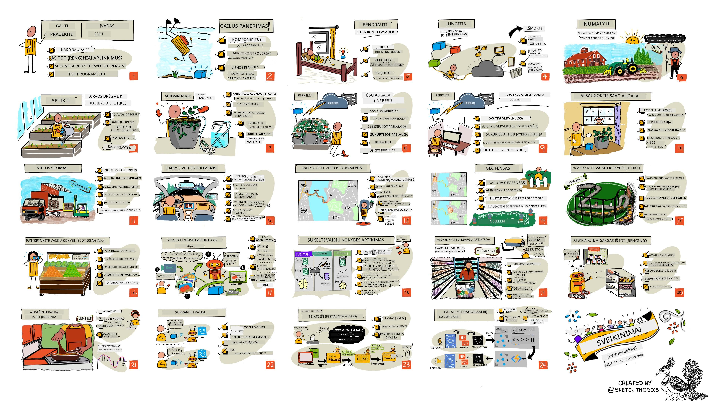

<!--
CO_OP_TRANSLATOR_METADATA:
{
  "original_hash": "6c354ec3487e4f6cfafbe44557996cd9",
  "translation_date": "2026-01-06T21:31:34+00:00",
  "source_file": "README.md",
  "language_code": "lt"
}
-->
[](https://github.com/microsoft/IoT-For-Beginners/blob/master/LICENSE)
[](https://GitHub.com/microsoft/IoT-For-Beginners/graphs/contributors/)
[](https://GitHub.com/microsoft/IoT-For-Beginners/issues/)
[](https://GitHub.com/microsoft/IoT-For-Beginners/pulls/)
[](http://makeapullrequest.com)

[](https://GitHub.com/microsoft/IoT-For-Beginners/watchers/)
[](https://GitHub.com/microsoft/IoT-For-Beginners/network/)
[](https://GitHub.com/microsoft/IoT-For-Beginners/stargazers/)

### Prisijunkite prie Azure AI Foundry bendruomenės

Jei susiduriate su sunkumais arba turite klausimų apie AI programėlių kūrimą. Prisijunkite prie mokymosi bendraminčių ir patyrusių kūrėjų diskusijose apie MCP. Tai palaikanti bendruomenė, kurioje klausimai laukiami, o žinios dalijamos laisvai.

[](https://discord.gg/nTYy5BXMWG)

Jei turite produkto atsiliepimų arba radote klaidų kūrimo metu, apsilankykite:

[](https://aka.ms/foundry/forum)

Sekite šiuos žingsnius, kad pradėtumėte naudotis šiomis ištekliais:
1. **Sukurkite sau šaką (Fork)**: Spustelėkite [](https://GitHub.com/microsoft/IoT-For-Beginners/fork)
2. **Klonuokite sau saugyklą**:   `git clone https://github.com/microsoft/IoT-For-Beginners.git`
3. [**Prisijunkite prie Microsoft Foundry Discord ir susipažinkite su ekspertais bei kitais kūrėjais**](https://discord.com/invite/ByRwuEEgH4)


### 🌐 Daugiakalbė parama

#### Palaikoma per GitHub veiksmą (automatinė ir visada atnaujinta)

<!-- CO-OP TRANSLATOR LANGUAGES TABLE START -->
[Arabic](../ar/README.md) | [Bengali](../bn/README.md) | [Bulgarian](../bg/README.md) | [Burmese (Myanmar)](../my/README.md) | [Chinese (Simplified)](../zh/README.md) | [Chinese (Traditional, Hong Kong)](../hk/README.md) | [Chinese (Traditional, Macau)](../mo/README.md) | [Chinese (Traditional, Taiwan)](../tw/README.md) | [Croatian](../hr/README.md) | [Czech](../cs/README.md) | [Danish](../da/README.md) | [Dutch](../nl/README.md) | [Estonian](../et/README.md) | [Finnish](../fi/README.md) | [French](../fr/README.md) | [German](../de/README.md) | [Greek](../el/README.md) | [Hebrew](../he/README.md) | [Hindi](../hi/README.md) | [Hungarian](../hu/README.md) | [Indonesian](../id/README.md) | [Italian](../it/README.md) | [Japanese](../ja/README.md) | [Kannada](../kn/README.md) | [Korean](../ko/README.md) | [Lithuanian](./README.md) | [Malay](../ms/README.md) | [Malayalam](../ml/README.md) | [Marathi](../mr/README.md) | [Nepali](../ne/README.md) | [Nigerian Pidgin](../pcm/README.md) | [Norwegian](../no/README.md) | [Persian (Farsi)](../fa/README.md) | [Polish](../pl/README.md) | [Portuguese (Brazil)](../br/README.md) | [Portuguese (Portugal)](../pt/README.md) | [Punjabi (Gurmukhi)](../pa/README.md) | [Romanian](../ro/README.md) | [Russian](../ru/README.md) | [Serbian (Cyrillic)](../sr/README.md) | [Slovak](../sk/README.md) | [Slovenian](../sl/README.md) | [Spanish](../es/README.md) | [Swahili](../sw/README.md) | [Swedish](../sv/README.md) | [Tagalog (Filipino)](../tl/README.md) | [Tamil](../ta/README.md) | [Telugu](../te/README.md) | [Thai](../th/README.md) | [Turkish](../tr/README.md) | [Ukrainian](../uk/README.md) | [Urdu](../ur/README.md) | [Vietnamese](../vi/README.md)

> **Pageidaujate Klonuoti Vietoje?**

> Ši saugykla apima daugiau nei 50 kalbų vertimų, kurie žymiai padidina atsisiuntimo dydį. Norėdami klonuoti be vertimų, naudokite sparse checkout:
> ```bash
> git clone --filter=blob:none --sparse https://github.com/microsoft/IoT-For-Beginners.git
> cd IoT-For-Beginners
> git sparse-checkout set --no-cone '/*' '!translations' '!translated_images'
> ```
> Tai suteikia viską, ko reikia kursui baigti, su daug greitesniu atsisiuntimu.
<!-- CO-OP TRANSLATOR LANGUAGES TABLE END -->

# IoT pradedantiesiems - Mokymo programa

„Azure Cloud Advocates“ komanda Microsoft džiaugiasi galėdama pasiūlyti 12 savaičių, 24 pamokų mokymo programą, kuri skirta IoT pagrindams. Kiekviena pamoka apima prieš ir po pamokos viktorinas, rašytines instrukcijas, kaip įvykdyti pamoką, sprendimą, užduotį ir daugiau. Mūsų projektų pagrindu kuriama pedagogika leidžia mokytis statant, kas yra patvirtintas būdas, kaip „prilimpa“ nauji įgūdžiai.

Projektai apima maisto kelionę nuo ūkio iki stalo. Tai apima žemės ūkį, logistiką, gamybą, mažmeninę prekybą ir vartotojus - visos populiarios IoT įrenginių pramonės sritys.



> Sketchnote piešinys [Nitya Narasimhan](https://github.com/nitya). Spustelėkite paveikslėlį, kad pamatytumėte didesnį.

**Nuoširdus ačiū mūsų autoriams [Jen Fox](https://github.com/jenfoxbot), [Jen Looper](https://github.com/jlooper), [Jim Bennett](https://github.com/jimbobbennett) ir mūsų sketchnote menininkei [Nitya Narasimhan](https://github.com/nitya).**

**Taip pat dėkojame mūsų komandai iš [Microsoft Learn Student Ambassadors](https://studentambassadors.microsoft.com?WT.mc_id=academic-17441-jabenn), kurie peržiūrėjo ir vertė šią mokymo programą - [Aditya Garg](https://github.com/AdityaGarg00), [Anurag Sharma](https://github.com/Anurag-0-1-A), [Arpita Das](https://github.com/Arpiiitaaa), [Aryan Jain](https://www.linkedin.com/in/aryan-jain-47a4a1145/), [Bhavesh Suneja](https://github.com/EliteWarrior315), [Faith Hunja](https://faithhunja.github.io/), [Lateefah Bello](https://www.linkedin.com/in/lateefah-bello/), [Manvi Jha](https://github.com/Severus-Matthew), [Mireille Tan](https://www.linkedin.com/in/mireille-tan-a4834819a/), [Mohammad Iftekher (Iftu) Ebne Jalal](https://github.com/Iftu119), [Mohammad Zulfikar](https://github.com/mohzulfikar), [Priyanshu Srivastav](https://www.linkedin.com/in/priyanshu-srivastav-b067241ba), [Thanmai Gowducheruvu](https://github.com/innovation-platform), ir [Zina Kamel](https://www.linkedin.com/in/zina-kamel/).**

Susipažinkite su komanda!

[](https://youtu.be/-wippUJRi5k)

**Gif sukūrė** [Mohit Jaisal](https://linkedin.com/in/mohitjaisal)

> 🎥 Spustelėkite aukščiau esantį paveikslėlį, kad peržiūrėtumėte vaizdo įrašą apie projektą!

> **Mokytojai**, mes [įtraukėme keletą pasiūlymų](for-teachers.md), kaip naudoti šią mokymo programą. Jei norite kurti savo pamokas, mes taip pat paruošėme [pamokos šabloną](lesson-template/README.md).

> **Mokiniai** [https://aka.ms/student-page](https://aka.ms/student-page), norėdami naudoti šią mokymo programą savarankiškai, susikurkite savo saugyklos šaką ir savarankiškai atlikite užduotis, pradėdami nuo priešpaskaitinės viktorinos, tada perskaitykite paskaitą ir atlikite likusias veiklas. Stenkitės kurti projektus suprasdami pamokas, o ne tiesiog kopijuodami sprendimo kodą; visgi šis kodas yra pateiktas /solutions aplankuose kiekvienoje projektams skirtose pamokose. Kita idėja – susidaryti studijų grupę su draugais ir močiutes medžiagos kartu. Tolimesniam mokymuisi rekomenduojame [Microsoft Learn](https://docs.microsoft.com/users/jimbobbennett/collections/ke2ehd351jopwr?WT.mc_id=academic-17441-jabenn).

Daugiau apie kursą žiūrėkite šiame vaizdo įraše:

[](https://youtube.com/watch?v=bccEMm8gRuc "Promo video")

> 🎥 Spustelėkite aukščiau esantį paveikslėlį, kad peržiūrėtumėte vaizdo įrašą apie projektą!

## Pedagogika

Kurdami šią mokymo programą pasirinkome du pedagoginius principus: užtikrinti, kad ji būtų projektu pagrįsta ir kad būtų įtrauktos dažnos viktorinos. Šios serijos pabaigoje studentai bus sukūrę augalų stebėjimo ir laistymo sistemą, transporto priemonių sekimo įrenginį, išmanios gamyklos sistemą maisto sekimui ir patikrinimui bei garso valdomą maisto ruošimo laikmatį, taip pat išmoks IoT pagrindus, įskaitant įrenginio kodo rašymą, ryšį su debesimi, telemetrijos analizę ir AI vykdymą edges.

Užtikrindami, kad turinys susietas su projektais, procesas tampa įdomesnis studentams ir pagerina koncepcijų įsisavinimą.

Be to, žemos rizikos viktorina prieš klasę nukreipia studentų dėmesį į tam tikros temos mokymąsi, o antroji viktorina po pamokos užtikrina geresnį įsisavinimą. Ši mokymo programa buvo sukurta būti lanksčia ir smagia – ją galima rinktis visą arba dalimis. Projektai prasideda nuo mažesnių ir baigiasi sudėtingesniais per 12 savaičių laikotarpį.

Kiekvienas projektas yra pagrįstas realia aparatūra, prieinama studentams ir mėgėjams. Kiekvienas projektas nagrinėja specifinę sritį, pateikia reikalingas pagrindines žinias. Norint būti sėkmingu kūrėju, svarbu suprasti sritį, kurioje sprendžiamos problemos; šios žinios leidžia studentams mąstyti apie savo IoT sprendimus ir mokymąsi realaus pasaulio problemų kontekste. Studentai supranta kuriamų sprendimų „kodėl“ ir įvertina galutinį vartotoją.

## Aparatūra

Turime du IoT aparatūros pasirinkimus projektams, priklausomai nuo asmeninių pageidavimų, programavimo kalbos žinių ar pomėgių, mokymosi tikslų ir prieinamumo. Taip pat paruošėme „virtualios aparatūros“ versiją tiems, kurie neturi prieigos prie įrangos arba norėtų sužinoti daugiau prieš įsigyjant. Daugiau galite sužinoti ir rasti „pirkinių sąrašą“ [aparatūros puslapyje](./hardware.md), įskaitant nuorodas į pilnas komplektacijas iš mūsų draugų Seeed Studio.
> 💁 Raskite mūsų [Elgesio kodeksą](CODE_OF_CONDUCT.md), [Prisidėjimo](CONTRIBUTING.md) ir [Vertimo](TRANSLATIONS.md) gaires. Laukiame jūsų konstruktyvios grįžtamosios informacijos!
>
> 🔧 Turite problemų? Peržiūrėkite mūsų [Trikčių šalinimo vadovą](TROUBLESHOOTING.md) dažniausiai pasitaikančioms problemoms spręsti.

## Kiekviena pamoka apima:

- sketchnote užrašus
- pasirenkamą papildomą vaizdo įrašą
- priešpamokos apšilimo testą
- rašytinę pamoką
- projektinėms pamokoms – žingsnis po žingsnio vadovus, kaip sukurti projektą
- žinių patikrinimus
- iššūkį
- papildomą skaitymą
- užduotį
- [pokalbį po pamokos](https://ff-quizzes.netlify.app/en/)

> **Pastaba apie testus**: Visi testai yra quiz-app aplanke, iš viso 48 testai po tris klausimus. Jie yra susieti iš pamokų, tačiau testų programėlę galima paleisti vietoje arba talpinti Azure; vadovaukitės nurodymais `quiz-app` aplanke. Jie palaipsniui lokalizuojami.

## Pamokos

|       |              Projekto pavadinimas              |                        Mokomi konceptai                        | Mokymosi tikslai                                                                                                                                              |                                                        Susieta pamoka                                                          |
| :---: | :--------------------------------------------: | :------------------------------------------------------------: | ------------------------------------------------------------------------------------------------------------------------------------------------------------- | :------------------------------------------------------------------------------------------------------------------------------: |
|  01   | [Pirmieji žingsniai](./1-getting-started/README.md) |                    Įvadas į daiktų internetą                   | Išmokite pagrindinius daiktų interneto principus ir bazinius sprendimo komponentus, tokius kaip jutikliai ir debesų paslaugos, kol konfigūruojate savo pirmą IoT įrenginį |                    [Įvadas į daiktų internetą](./1-getting-started/lessons/1-introduction-to-iot/README.md)                    |
|  02   | [Pirmieji žingsniai](./1-getting-started/README.md) |                     Gyliau apie daiktų internetą               | Sužinokite daugiau apie daiktų interneto sistemos komponentus, mikrovaldiklius ir vienploksčius kompiuterius                                                  |                      [Gyliau apie daiktų internetą](./1-getting-started/lessons/2-deeper-dive/README.md)                       |
|  03   | [Pirmieji žingsniai](./1-getting-started/README.md) | Sąveika su fiziniu pasauliu per jutiklius ir aktyvatorius     | Išmokite apie jutiklius, kurie renka duomenis iš fizinio pasaulio, ir aktyvatorius, kurie siūlo atsaką, kol kuriate naktinę lemputę                            | [Sąveika su fiziniu pasauliu per jutiklius ir aktyvatorius](./1-getting-started/lessons/3-sensors-and-actuators/README.md) |
|  04   | [Pirmieji žingsniai](./1-getting-started/README.md) |                Prijunkite savo įrenginį prie interneto         | Sužinokite, kaip prijungti IoT įrenginį prie interneto, kad siųstumėte ir gautumėte pranešimus, prijungdami savo naktinę lemputę prie MQTT brokerio           |               [Prijunkite savo įrenginį prie interneto](./1-getting-started/lessons/4-connect-internet/README.md)               |
|  05   |            [Ūkis](./2-farm/README.md)            |                     Prognozuokite augalų augimą               | Išmokite prognozuoti augalų augimą naudojant temperatūros duomenis, gaunamus per IoT įrenginį                                                                 |                            [Prognozuokite augalų augimą](./2-farm/lessons/1-predict-plant-growth/README.md)                    |
|  06   |            [Ūkis](./2-farm/README.md)            |                    Aptikite dirvos drėgmę                    | Išmokite aptikti dirvos drėgmę ir kalibruoti dirvos drėgmės jutiklį                                                                                             |                            [Aptikite dirvos drėgmę](./2-farm/lessons/2-detect-soil-moisture/README.md)                        |
|  07   |            [Ūkis](./2-farm/README.md)            |                    Automatinis augalų laistymas              | Išmokite automatizuoti ir laiku laistyti naudojant relę ir MQTT                                                                                                |                        [Automatinis augalų laistymas](./2-farm/lessons/3-automated-plant-watering/README.md)                   |
|  08   |            [Ūkis](./2-farm/README.md)            |                  Perkelkite savo augalą į debesį              | Sužinokite apie debesis ir debesyje veikiančias IoT paslaugas bei kaip prijungti savo augalą prie jų, o ne prie viešo MQTT brokerio                           |                 [Perkelkite savo augalą į debesį](./2-farm/lessons/4-migrate-your-plant-to-the-cloud/README.md)                |
|  09   |            [Ūkis](./2-farm/README.md)            |                Perkelkite programinės logikos valdymą į debesį | Sužinokite, kaip debesyje rašyti programinę logiką, kuri reaguoja į IoT pranešimus                                                                             |           [Perkelkite programinės logikos valdymą į debesį](./2-farm/lessons/5-migrate-application-to-the-cloud/README.md)     |
|  10   |            [Ūkis](./2-farm/README.md)            |                    Apsaugokite savo augalą                   | Sužinokite apie saugumą IoT kontekste ir kaip apsaugoti savo augalą naudojant raktus ir sertifikatus                                                           |                       [Apsaugokite savo augalą](./2-farm/lessons/6-keep-your-plant-secure/README.md)                          |
|  11   |       [Transportas](./3-transport/README.md)       |                   Vietovės sekimas                           | Išmokite apie GPS vietovės sekimą IoT įrenginiams                                                                                                             |                            [Vietovės sekimas](./3-transport/lessons/1-location-tracking/README.md)                             |
|  12   |       [Transportas](./3-transport/README.md)       |                  Vietovės duomenų saugojimas                 | Išmokite, kaip saugoti IoT duomenis tolimesniam vaizdavimui arba analizei                                                                                      |                         [Vietovės duomenų saugojimas](./3-transport/lessons/2-store-location-data/README.md)                  |
|  13   |       [Transportas](./3-transport/README.md)       |                Vietovės duomenų vaizdavimas                  | Sužinokite, kaip vaizduoti vietovės duomenis žemėlapyje ir kaip žemėlapiai atspindi tikrąjį 3D pasaulį 2 matmenyse                                            |                    [Vietovės duomenų vaizdavimas](./3-transport/lessons/3-visualize-location-data/README.md)                   |
|  14   |       [Transportas](./3-transport/README.md)       |                        Geopteritorijos zonos                 | Sužinokite apie geopteritorijas ir kaip jas naudoti įspėti, kai tiekimo grandinės transporto priemonės artėja prie tikslo                                      |                                  [Geopteritorijos zonos](./3-transport/lessons/4-geofences/README.md)                           |
|  15   |   [Gamyba](./4-manufacturing/README.md)   |                  Apmokykite vaisių kokybės detektorių        | Sužinokite, kaip debesyje apmokyti vaizdų klasifikatorių vaisių kokybei nustatyti                                                                              |                     [Apmokykite vaisių kokybės detektorių](./4-manufacturing/lessons/1-train-fruit-detector/README.md)         |
|  16   |   [Gamyba](./4-manufacturing/README.md)   |            Patikrinkite vaisių kokybę iš IoT įrenginio       | Sužinokite, kaip naudoti savo vaisių kokybės detektorių per IoT įrenginį                                                                                      |               [Patikrinkite vaisių kokybę iš IoT įrenginio](./4-manufacturing/lessons/2-check-fruit-from-device/README.md)    |
|  17   |   [Gamyba](./4-manufacturing/README.md)   |              Paleiskite savo vaisių detektorių krašte        | Išmokite, kaip paleisti vaisių detektorių IoT įrenginyje krašte                                                                                               |                 [Paleiskite savo vaisių detektorių krašte](./4-manufacturing/lessons/3-run-fruit-detector-edge/README.md)      |
|  18   |   [Gamyba](./4-manufacturing/README.md)   |           Paleiskite vaisių kokybės aptikimą iš jutiklio     | Sužinokite, kaip paleisti vaisių kokybės aptikimą iš jutiklio                                                                                                |              [Paleiskite vaisių kokybės aptikimą iš jutiklio](./4-manufacturing/lessons/4-trigger-fruit-detector/README.md)   |
|  19   |          [Mažmena](./5-retail/README.md)          |                   Apmokykite prekių aptikiklį               | Išmokite naudoti objektų aptikimą prekių skaičiavimui parduotuvėje                                                                                            |                         [Apmokykite prekių aptikiklį](./5-retail/lessons/1-train-stock-detector/README.md)                  |
|  20   |          [Mažmena](./5-retail/README.md)          |                Patikrinkite prekes iš IoT įrenginio          | Išmokite tikrinti prekių likučius IoT įrenginiu naudojant objektų aptikimo modelį                                                                             |                      [Patikrinkite prekes iš IoT įrenginio](./5-retail/lessons/2-check-stock-device/README.md)                |
|  21   |        [Vartotojas](./6-consumer/README.md)        |              Atpažinkite kalbą per IoT įrenginį              | Išmokite atpažinti kalbą iš IoT įrenginio, kad sukurtumėte išmanų laikmatį                                                                                      |                     [Atpažinkite kalbą per IoT įrenginį](./6-consumer/lessons/1-speech-recognition/README.md)                   |
|  22   |        [Vartotojas](./6-consumer/README.md)        |                    Supraskite kalbą                          | Išmokite suprasti frazes, sakomas IoT įrenginiui                                                                                                             |                         [Supraskite kalbą](./6-consumer/lessons/2-language-understanding/README.md)                           |
|  23   |        [Vartotojas](./6-consumer/README.md)        |              Nustatykite laikmatį ir pateikite balsinį atsaką | Išmokite nustatyti laikmatį IoT įrenginyje ir pateikti balsinį atsaką, kada laikmatis nustatytas ir baigiasi                                                  |                   [Nustatykite laikmatį ir pateikite balsinį atsaką](./6-consumer/lessons/3-spoken-feedback/README.md)         |
|  24   |        [Vartotojas](./6-consumer/README.md)        |                Palaikykite kelias kalbas                      | Išmokite palaikyti kelias kalbas tiek įrenginio kalbai, tiek išmaniojo laikmačio atsakymams                                                                     |                   [Palaikykite kelias kalbas](./6-consumer/lessons/4-multiple-language-support/README.md)                      |

## Prieiga be interneto

Galite naudoti šią dokumentaciją neprisijungę naudodami [Docsify](https://docsify.js.org/#/). Šaknyje padarykite forką, [įdiekite Docsify](https://docsify.js.org/#/quickstart) savo kompiuteryje, tada šio repo pagrindiniame aplanke įveskite `docsify serve`. Svetainė bus pasiekiama jūsų localhost serveryje per prievadą 3000 adresu: `localhost:3000`.

## Testas

Dėkojame bendruomenei už interaktyvų testą, kuris tikrina jūsų žinias kiekviename skyriuje. Savo žinias galite patikrinti [čia](https://ff-quizzes.netlify.app/en/)

### PDF

Jei reikia, galite sugeneruoti šio turinio PDF versiją neprisijungtam pasiekiamumui. Tam įsitikinkite, kad turite [įdiegtą npm](https://docs.npmjs.com/downloading-and-installing-node-js-and-npm) ir vykdykite šias komandas šio repo pagrindiniame aplanke:

```sh
npm i
npm run convert
```

### Skaidrių pristatymai

Kai kurioms pamokoms yra skaidrių prezentacijos [slides](../../slides) aplanke.


## Kitos programos

Mūsų komanda kuria ir kitas programas! Peržiūrėkite:

<!-- CO-OP TRANSLATOR OTHER COURSES START -->
### LangChain
[](https://aka.ms/langchain4j-for-beginners)
[](https://aka.ms/langchainjs-for-beginners?WT.mc_id=m365-94501-dwahlin)

---

### Azure / Edge / MCP / Agentai
[](https://github.com/microsoft/AZD-for-beginners?WT.mc_id=academic-105485-koreyst)
[](https://github.com/microsoft/edgeai-for-beginners?WT.mc_id=academic-105485-koreyst)
[](https://github.com/microsoft/mcp-for-beginners?WT.mc_id=academic-105485-koreyst)
[](https://github.com/microsoft/ai-agents-for-beginners?WT.mc_id=academic-105485-koreyst)

---
 
### Generatyvinio DI serija
[](https://github.com/microsoft/generative-ai-for-beginners?WT.mc_id=academic-105485-koreyst)
[-9333EA?style=for-the-badge&labelColor=E5E7EB&color=9333EA)](https://github.com/microsoft/Generative-AI-for-beginners-dotnet?WT.mc_id=academic-105485-koreyst)
[-C084FC?style=for-the-badge&labelColor=E5E7EB&color=C084FC)](https://github.com/microsoft/generative-ai-for-beginners-java?WT.mc_id=academic-105485-koreyst)
[-E879F9?style=for-the-badge&labelColor=E5E7EB&color=E879F9)](https://github.com/microsoft/generative-ai-with-javascript?WT.mc_id=academic-105485-koreyst)

---
 
### Pagrindinis mokymasis
[](https://aka.ms/ml-beginners?WT.mc_id=academic-105485-koreyst)
[](https://aka.ms/datascience-beginners?WT.mc_id=academic-105485-koreyst)
[](https://aka.ms/ai-beginners?WT.mc_id=academic-105485-koreyst)
[](https://github.com/microsoft/Security-101?WT.mc_id=academic-96948-sayoung)
[](https://aka.ms/webdev-beginners?WT.mc_id=academic-105485-koreyst)
[](https://aka.ms/iot-beginners?WT.mc_id=academic-105485-koreyst)
[](https://github.com/microsoft/xr-development-for-beginners?WT.mc_id=academic-105485-koreyst)

---
 
### Copilot serija
[](https://aka.ms/GitHubCopilotAI?WT.mc_id=academic-105485-koreyst)
[](https://github.com/microsoft/mastering-github-copilot-for-dotnet-csharp-developers?WT.mc_id=academic-105485-koreyst)
[](https://github.com/microsoft/CopilotAdventures?WT.mc_id=academic-105485-koreyst)
<!-- CO-OP TRANSLATOR OTHER COURSES END -->

## Vaizdų priskyrimai

Visus šiame mokymo plane naudojamų vaizdų priskyrimus, kai reikia, galite rasti [Attributions](./attributions.md).

---

<!-- CO-OP TRANSLATOR DISCLAIMER START -->
**Atsakomybės apribojimas**:  
Šis dokumentas buvo išverstas naudojant dirbtinio intelekto vertimo paslaugą [Co-op Translator](https://github.com/Azure/co-op-translator). Nors siekiame tikslumo, atkreipkite dėmesį, kad automatizuoti vertimai gali turėti klaidų ar netikslumų. Pirminis dokumentas jo gimtąja kalba turi būti laikomas autoritetingu šaltiniu. Kritinei informacijai rekomenduojamas profesionalus žmogaus vertimas. Mes neatsakome už bet kokius nesusipratimus ar klaidingas interpretacijas, kylančias dėl šio vertimo naudojimo.
<!-- CO-OP TRANSLATOR DISCLAIMER END -->