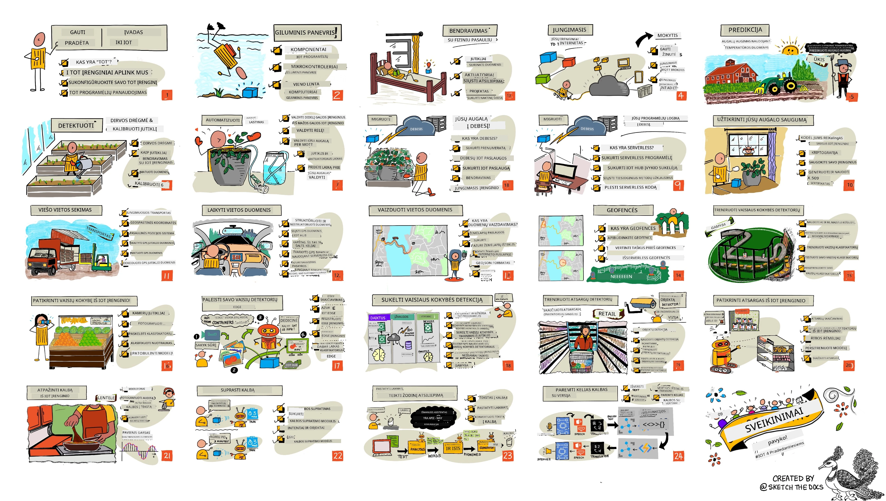

[](https://github.com/microsoft/IoT-For-Beginners/blob/master/LICENSE)
[](https://GitHub.com/microsoft/IoT-For-Beginners/graphs/contributors/)
[](https://GitHub.com/microsoft/IoT-For-Beginners/issues/)
[](https://GitHub.com/microsoft/IoT-For-Beginners/pulls/)
[](http://makeapullrequest.com)

[](https://GitHub.com/microsoft/IoT-For-Beginners/watchers/)
[](https://GitHub.com/microsoft/IoT-For-Beginners/network/)
[](https://GitHub.com/microsoft/IoT-For-Beginners/stargazers/)

### Prisijunkite prie Azure AI Foundry bendruomenės

Jei užstrigote arba turite klausimų apie AI programėlių kūrimą. Prisijunkite prie kitų besimokančių ir patyrusių kūrėjų diskusijų apie MCP. Tai palaikanti bendruomenė, kurioje klausimai yra sveikintini ir žinios dalijamos laisvai.

[](https://discord.gg/nTYy5BXMWG)

Jei turite atsiliepimų apie produktą arba randate klaidų kūrimo metu, apsilankykite:

[](https://aka.ms/foundry/forum)

Vykdykite šiuos veiksmus, kad pradėtumėte naudotis šiomis priemonėmis:
1. **Sukurkite šaką (fork) repozitorijoje**: Spustelėkite [](https://GitHub.com/microsoft/IoT-For-Beginners/fork)
2. **Klonuokite repozitoriją**: `git clone https://github.com/microsoft/IoT-For-Beginners.git`
3. [**Prisijunkite prie Microsoft Foundry Discord ir susipažinkite su ekspertais bei kolegomis kūrėjais**](https://discord.com/invite/ByRwuEEgH4)


### 🌐 Daugiakalbė parama

#### Palaikoma per GitHub Action (automatiškai ir visada atnaujinta)

<!-- CO-OP TRANSLATOR LANGUAGES TABLE START -->
[Arabic](../ar/README.md) | [Bengali](../bn/README.md) | [Bulgarian](../bg/README.md) | [Burmese (Myanmar)](../my/README.md) | [Chinese (Simplified)](../zh-CN/README.md) | [Chinese (Traditional, Hong Kong)](../zh-HK/README.md) | [Chinese (Traditional, Macau)](../zh-MO/README.md) | [Chinese (Traditional, Taiwan)](../zh-TW/README.md) | [Croatian](../hr/README.md) | [Czech](../cs/README.md) | [Danish](../da/README.md) | [Dutch](../nl/README.md) | [Estonian](../et/README.md) | [Finnish](../fi/README.md) | [French](../fr/README.md) | [German](../de/README.md) | [Greek](../el/README.md) | [Hebrew](../he/README.md) | [Hindi](../hi/README.md) | [Hungarian](../hu/README.md) | [Indonesian](../id/README.md) | [Italian](../it/README.md) | [Japanese](../ja/README.md) | [Kannada](../kn/README.md) | [Khmer](../km/README.md) | [Korean](../ko/README.md) | [Lithuanian](./README.md) | [Malay](../ms/README.md) | [Malayalam](../ml/README.md) | [Marathi](../mr/README.md) | [Nepali](../ne/README.md) | [Nigerian Pidgin](../pcm/README.md) | [Norwegian](../no/README.md) | [Persian (Farsi)](../fa/README.md) | [Polish](../pl/README.md) | [Portuguese (Brazil)](../pt-BR/README.md) | [Portuguese (Portugal)](../pt-PT/README.md) | [Punjabi (Gurmukhi)](../pa/README.md) | [Romanian](../ro/README.md) | [Russian](../ru/README.md) | [Serbian (Cyrillic)](../sr/README.md) | [Slovak](../sk/README.md) | [Slovenian](../sl/README.md) | [Spanish](../es/README.md) | [Swahili](../sw/README.md) | [Swedish](../sv/README.md) | [Tagalog (Filipino)](../tl/README.md) | [Tamil](../ta/README.md) | [Telugu](../te/README.md) | [Thai](../th/README.md) | [Turkish](../tr/README.md) | [Ukrainian](../uk/README.md) | [Urdu](../ur/README.md) | [Vietnamese](../vi/README.md)

> **Norite klonuoti vietoje?**
>
> Šiame repozitorijoje yra virš 50 kalbų vertimų, dėl kurių ženkliai padidėja atsisiuntimo dydis. Norėdami klonuoti be vertimų, naudokite sparse checkout:
>
> **Bash / macOS / Linux:**
> ```bash
> git clone --filter=blob:none --sparse https://github.com/microsoft/IoT-For-Beginners.git
> cd IoT-For-Beginners
> git sparse-checkout set --no-cone '/*' '!translations' '!translated_images'
> ```
>
> **CMD (Windows):**
> ```cmd
> git clone --filter=blob:none --sparse https://github.com/microsoft/IoT-For-Beginners.git
> cd IoT-For-Beginners
> git sparse-checkout set --no-cone "/*" "!translations" "!translated_images"
> ```
>
> Tai suteiks jums viską, ko reikia kurso užbaigimui, su daug greitesniu atsisiuntimu.
<!-- CO-OP TRANSLATOR LANGUAGES TABLE END -->

# IoT pradedantiesiems – mokymo programa

„Microsoft“ Azure Cloud advokatai džiaugiasi galėdami pasiūlyti 12 savaičių, 24 pamokų mokymo programą, skirtą IoT pagrindams. Kiekviena pamoka apima prieš- ir po pamokos testus, rašytines pamokos atlikimo instrukcijas, sprendimą, užduotį ir dar daugiau. Mūsų projektinė pedagogika leidžia mokytis praktikuojantis – tai įrodyta kaip veiksmingas būdas įsisavinti naujus įgūdžius.

Projektai apima maisto kelią nuo ūkio iki stalo. Tai apima žemės ūkį, logistiką, gamybą, mažmeninę prekybą ir vartotoją – visas populiarias IoT įrenginių pramonės sritis.



> Sketchnote nupiešė [Nitya Narasimhan](https://github.com/nitya). Spustelėkite paveikslėlį, kad pamatytumėte didesnę versiją.

**Nuoširdžiai dėkojame mūsų autoriams [Jen Fox](https://github.com/jenfoxbot), [Jen Looper](https://github.com/jlooper), [Jim Bennett](https://github.com/jimbobbennett) ir mūsų sketchnote menininkui [Nitya Narasimhan](https://github.com/nitya).**

**Taip pat dėkojame mūsų komandai iš [Microsoft Learn Student Ambassadors](https://studentambassadors.microsoft.com?WT.mc_id=academic-17441-jabenn), kurie peržiūrėjo ir vertė šią programą – [Aditya Garg](https://github.com/AdityaGarg00), [Anurag Sharma](https://github.com/Anurag-0-1-A), [Arpita Das](https://github.com/Arpiiitaaa), [Aryan Jain](https://www.linkedin.com/in/aryan-jain-47a4a1145/), [Bhavesh Suneja](https://github.com/EliteWarrior315), [Faith Hunja](https://faithhunja.github.io/), [Lateefah Bello](https://www.linkedin.com/in/lateefah-bello/), [Manvi Jha](https://github.com/Severus-Matthew), [Mireille Tan](https://www.linkedin.com/in/mireille-tan-a4834819a/), [Mohammad Iftekher (Iftu) Ebne Jalal](https://github.com/Iftu119), [Mohammad Zulfikar](https://github.com/mohzulfikar), [Priyanshu Srivastav](https://www.linkedin.com/in/priyanshu-srivastav-b067241ba), [Thanmai Gowducheruvu](https://github.com/innovation-platform) ir [Zina Kamel](https://www.linkedin.com/in/zina-kamel/).**

Susipažinkite su komanda!

[](https://youtu.be/-wippUJRi5k)

**Gif sukūrė** [Mohit Jaisal](https://linkedin.com/in/mohitjaisal)

> 🎥 Spustelėkite paveikslėlį viršuje, kad pamatytumėte vaizdo medžiagą apie projektą!

> **Mokytojai**, mes [įtraukėme keletą pasiūlymų](for-teachers.md), kaip naudoti šią mokymo programą. Jei norėtumėte kurti savo pamokas, taip pat pateikėme [pamokos šabloną](lesson-template/README.md).

> **Studentai** ([https://aka.ms/student-page](https://aka.ms/student-page)), kad naudotumėtės šia mokymo programa savarankiškai, sukurkite visos repozitorijos šaką (fork) ir savarankiškai atlikite užduotis, pradėdami nuo priešpaskaitos testo, skaitydami paskaitą ir įvykdydami kitas veiklas. Stenkitės kurti projektus suprasdami pamokas, o ne tik kopijuodami sprendimo kodą; tačiau tas kodas yra prieinamas /solutions aplankuose kiekvienose projektui skirtose pamokose. Kita idėja – sukurti mokymosi grupę su draugais ir kartu peržiūrėti turinį. Tolimesniam mokymuisi rekomenduojame [Microsoft Learn](https://docs.microsoft.com/users/jimbobbennett/collections/ke2ehd351jopwr?WT.mc_id=academic-17441-jabenn).

Norėdami pamatyti šio kurso vaizdo apžvalgą, peržiūrėkite šį vaizdo įrašą:

[](https://youtube.com/watch?v=bccEMm8gRuc "Promo video")

> 🎥 Spustelėkite paveikslėlį viršuje, kad pamatytumėte vaizdo medžiagą apie projektą!

## Pedagogika

Rengdami šią mokymo programą pasirinkome du pedagoginius principus: užtikrinti, kad programa būtų paremta projektais ir kad būtų dažnai atliekami testai. Šios serijos pabaigoje studentai bus sukūrę augalų stebėjimo ir laistymo sistemą, transporto priemonių sekimo įrenginį, pažangią gamyklos sistemą maistui sekti ir tikrinti bei balso valdomą virimo laikmatį; taip pat išmoks IoT pagrindus, įskaitant kaip rašyti įrenginių kodą, jungtis prie debesies, analizuoti telemetriją ir vykdyti dirbtinį intelektą krašte.

Užtikrinant, kad turinys būtų susietas su projektais, procesas tampa įdomesnis studentams, o koncepcijų įsisavinimas yra pagerintas.

Be to, žemo rizikos testo atlikimas prieš paskaitą nukreipia studentą mokymuisi apie temą, o antras testas po paskaitos užtikrina tolesnį įsisavinimą. Ši mokymo programa buvo sukurta būti lanksčia ir įdomia, ją galima atlikti visą arba dalimis. Projektai prasideda nuo mažų ir baigiasi sudėtingesniais per 12 savaičių ciklą.

Kiekvienas projektas paremtas realūs prieinamais aparatinės įrangos elementais, skirtais studentams ir mėgėjams. Kiekvienas projektas tiria konkretų projektų domeną, pateikdamas atitinkamas žinias. Norint būti sėkmingu kūrėju, svarbu suprasti sritį, kurioje sprendžiate problemas – šios žinios leidžia studentams mąstyti apie savo IoT sprendimus ir mokymąsi kontekste realių problemų, kurias gali tekti spręsti kaip IoT kūrėjui. Studentai supranta kuriamų sprendimų „kodėl“ ir įgyja pagarbą galutiniam vartotojui.

## Aparatinė įranga
Projektams turime du IoT techninės įrangos pasirinkimus, kurie priklauso nuo asmeninių pomėgių, programavimo kalbos žinių ar pageidavimų, mokymosi tikslų ir prieinamumo. Taip pat pateikėme „virtualios techninės įrangos“ versiją tiems, kurie neturi prieigos prie techninės įrangos arba nori sužinoti daugiau prieš įsigyjant. Daugiau galite paskaityti ir rasti „pirkinių sąrašą“ [techninės įrangos puslapyje](./hardware.md), įskaitant nuorodas, kur įsigyti pilnus rinkinius iš mūsų draugų Seeed Studio.

> 💁 Rasite mūsų [Elgesio kodeksą](CODE_OF_CONDUCT.md), [Indėlio taisykles](CONTRIBUTING.md) bei [Vertimų](..) gaires. Mielai priimame jūsų konstruktyvią grįžtamąją informaciją!
>
> 🔧 Kyla problemų? Peržvelkite mūsų [Trikčių šalinimo gairę](TROUBLESHOOTING.md) dėl dažniausiai pasitaikančių problemų sprendimų.

## Kiekviena pamoka apima:

- eskizų užrašus
- pasirenkamą papildomą vaizdo įrašą
- priešpamokinį apšilimo testą
- rašytinę pamoką
- projekto tipo pamokose – žingsnis po žingsnio nurodymus, kaip sukurti projektą
- žinių patikrinimus
- iššūkį
- papildomą skaitymą
- užduotį
- [po pamokos testą](https://ff-quizzes.netlify.app/en/)

> **Pastaba apie testus**: Visi testai yra quiz-app aplanke, kur yra iš viso 48 testai, kiekviename po tris klausimus. Jie susieti iš pamokų, tačiau testų programėlę galima paleisti vietoje arba diegti į Azure; vadovaukitės instrukcijomis `quiz-app` aplanke. Jie palaipsniui lokalizuojami.

## Pamokos

|       |              Projekto pavadinimas               |                         Mokomos sąvokos                        | Mokymosi tikslai                                                                                                                                                   |                                                        Susieta pamoka                                                         |
| :---: | :--------------------------------------------: | :-------------------------------------------------------------: | ----------------------------------------------------------------------------------------------------------------------------------------------------------------- | :-----------------------------------------------------------------------------------------------------------------------------: |
|  01   | [Pradžia](./1-getting-started/README.md)       |                       Įvadas į IoT                             | Išmokite pagrindines IoT principų ir pagrindinius IoT sprendimų komponentus, tokius kaip jutikliai ir debesų paslaugos, diegdami savo pirmąjį IoT įrenginį        |                  [Įvadas į IoT](./1-getting-started/lessons/1-introduction-to-iot/README.md)                                     |
|  02   | [Pradžia](./1-getting-started/README.md)       |                      Giliau apie IoT                            | Sužinokite daugiau apie IoT sistemos komponentus, mikrovaldiklius ir vieno plokštės kompiuterius                                                                   |                      [Giliau apie IoT](./1-getting-started/lessons/2-deeper-dive/README.md)                                   |
|  03   | [Pradžia](./1-getting-started/README.md)       | Sąveika su fiziniu pasauliu per jutiklius ir aktyvatorius      | Sužinokite apie fizinio pasaulio duomenų rinkimą naudojant jutiklius ir atsako signalus siunčiančius aktyvatorius, kuriant naktinę lempą                        | [Sąveika su fiziniu pasauliu per jutiklius ir aktyvatorius](./1-getting-started/lessons/3-sensors-and-actuators/README.md)  |
|  04   | [Pradžia](./1-getting-started/README.md)       |                Prijunkite įrenginį prie interneto               | Sužinokite, kaip prijungti IoT įrenginį prie interneto ir siųsti bei gauti žinutes prijungiant naktinę lempą prie MQTT brokerio                                  |               [Prijunkite įrenginį prie interneto](./1-getting-started/lessons/4-connect-internet/README.md)                   |
|  05   |            [Ūkis](./2-farm/README.md)            |                    Numatyti augalų augimą                       | Sužinokite, kaip numatyti augalų augimą naudojant temperatūros duomenis, surinktus IoT įrenginiu                                                                   |                          [Numatyti augalų augimą](./2-farm/lessons/1-predict-plant-growth/README.md)                           |
|  06   |            [Ūkis](./2-farm/README.md)            |                    Aptikti dirvos drėgmę                       | Sužinokite, kaip aptikti dirvos drėgmę ir kalibruoti drėgmės jutiklį                                                                                               |                          [Aptikti dirvos drėgmę](./2-farm/lessons/2-detect-soil-moisture/README.md)                           |
|  07   |            [Ūkis](./2-farm/README.md)            |                   Automatinis augalų laistymas                  | Sužinokite, kaip automatizuoti ir laiku laistyti naudojant relę ir MQTT                                                                                            |                      [Automatinis augalų laistymas](./2-farm/lessons/3-automated-plant-watering/README.md)                     |
|  08   |            [Ūkis](./2-farm/README.md)            |                 Perkelkite augalą į debesį                      | Sužinokite apie debesį ir IoT paslaugas debesyje, taip pat kaip prijungti augalą prie vienos iš jų, o ne viešo MQTT brokerio                                       |               [Perkelkite augalą į debesį](./2-farm/lessons/4-migrate-your-plant-to-the-cloud/README.md)                      |
|  09   |            [Ūkis](./2-farm/README.md)            |           Perkelkite programos logiką į debesį                  | Sužinokite, kaip debesyje rašyti programos logiką, kuri reaguoja į IoT žinutes                                                                                    |         [Perkelkite programos logiką į debesį](./2-farm/lessons/5-migrate-application-to-the-cloud/README.md)                 |
|  10   |            [Ūkis](./2-farm/README.md)            |               Užtikrinkite augalo saugumą                       | Sužinokite apie IoT saugumą ir kaip apsaugoti augalą naudodami raktus ir sertifikatus                                                                             |                        [Užtikrinkite augalo saugumą](./2-farm/lessons/6-keep-your-plant-secure/README.md)                     |
|  11   |       [Transportas](./3-transport/README.md)     |                     Vietos sekimas                             | Sužinokite apie GPS vietos sekimą IoT įrenginiuose                                                                                                               |                           [Vietos sekimas](./3-transport/lessons/1-location-tracking/README.md)                               |
|  12   |       [Transportas](./3-transport/README.md)     |                    Laikyti vietos duomenis                      | Sužinokite, kaip saugoti IoT duomenis tolimesniam duomenų vizualizavimui ar analizei                                                                              |                         [Laikyti vietos duomenis](./3-transport/lessons/2-store-location-data/README.md)                      |
|  13   |       [Transportas](./3-transport/README.md)     |                  Vizualizuoti vietos duomenis                   | Sužinokite, kaip vaizduoti vietos duomenis žemėlapyje ir kaip žemėlapiai perteikia realų 3D pasaulį 2D formatu                                                    |                     [Vizualizuoti vietos duomenis](./3-transport/lessons/3-visualize-location-data/README.md)                |
|  14   |       [Transportas](./3-transport/README.md)     |                         Geografinės ribos                      | Sužinokite apie geografines ribas ir kaip jas galima naudoti įspėjimams, kai tiekimo grandinės transporto priemonės artėja prie savo paskirties                  |                                   [Geografinės ribos](./3-transport/lessons/4-geofences/README.md)                            |
|  15   |   [Gamyba](./4-manufacturing/README.md)          |         Apmokykite vaisių kokybės detektorių                  | Sužinokite, kaip debesyje apmokyti vaizdų klasifikatorių vaisių kokybės nustatymui                                                                               |                 [Apmokykite vaisių kokybės detektorių](./4-manufacturing/lessons/1-train-fruit-detector/README.md)            |
|  16   |   [Gamyba](./4-manufacturing/README.md)          |          Patikrinti vaisių kokybę IoT įrenginiu               | Sužinokite, kaip naudoti vaisių kokybės detektorių IoT įrenginyje                                                                                               |            [Patikrinti vaisių kokybę IoT įrenginiu](./4-manufacturing/lessons/2-check-fruit-from-device/README.md)            |
|  17   |   [Gamyba](./4-manufacturing/README.md)          |           Vykdykite vaisių detektorių prie įrenginio           | Sužinokite apie vaisių detektoriaus vykdymą IoT įrenginyje arti vartotojo                                                                                        |             [Vykdykite vaisių detektorių prie įrenginio](./4-manufacturing/lessons/3-run-fruit-detector-edge/README.md)      |
|  18   |   [Gamyba](./4-manufacturing/README.md)          |          Paleiskite vaisių kokybės nustatymą iš jutiklio       | Sužinokite, kaip paleisti vaisių kokybės aptikimą iš jutiklio                                                                                                   |            [Paleiskite vaisių kokybės nustatymą iš jutiklio](./4-manufacturing/lessons/4-trigger-fruit-detector/README.md)    |
|  19   |          [Mažmeninė prekyba](./5-retail/README.md)         |              Apmokykite prekių detektorių                     | Sužinokite, kaip naudoti objektų aptikimą, kad apmokytumėte prekių detektorių sandėlyje                                                                           |                        [Apmokykite prekių detektorių](./5-retail/lessons/1-train-stock-detector/README.md)                   |
|  20   |          [Mažmeninė prekyba](./5-retail/README.md)         |                Patikrinti prekių atsargas per IoT įrenginį     | Sužinokite, kaip patikrinti prekių atsargas naudodami IoT įrenginį ir objektų aptikimo modelį                                                                     |                     [Patikrinti atsargas per IoT įrenginį](./5-retail/lessons/2-check-stock-device/README.md)                 |
|  21   |        [Vartotojas](./6-consumer/README.md)      |        Atpažinti kalbą su IoT įrenginiu                        | Sužinokite, kaip atpažinti kalbą iš IoT įrenginio, kad sukurtumėte išmanų laikmatį                                                                                |                  [Atpažinti kalbą su IoT įrenginiu](./6-consumer/lessons/1-speech-recognition/README.md)                     |
|  22   |        [Vartotojas](./6-consumer/README.md)      |                     Suprasti kalbą                             | Sužinokite, kaip suprasti sakinius, kalbamus IoT įrenginiui                                                                                                      |                        [Suprasti kalbą](./6-consumer/lessons/2-language-understanding/README.md)                              |
|  23   |        [Vartotojas](./6-consumer/README.md)      |             Nustatyti laikmatį ir pateikti kalbinį atsaką      | Sužinokite, kaip nustatyti laikmatį IoT įrenginyje ir pateikti garsinį atsiliepimą apie laikmačio nustatymo ir baigimą                                             |                  [Nustatyti laikmatį ir pateikti kalbinį atsaką](./6-consumer/lessons/3-spoken-feedback/README.md)            |
|  24   |        [Vartotojas](./6-consumer/README.md)      |                   Palaikyti kelias kalbas                      | Sužinokite, kaip palaikyti kelias kalbas, tiek girdimus, tiek atsakymus iš jūsų išmanaus laikmačio                                                                |                  [Palaikyti kelias kalbas](./6-consumer/lessons/4-multiple-language-support/README.md)                       |

## Offline prieiga

Šią dokumentaciją galite naudoti be interneto, naudodamiesi [Docsify](https://docsify.js.org/#/). Padarykite šio repozitorijos šaką, [įdiekite Docsify](https://docsify.js.org/#/quickstart) savo vietiniame kompiuteryje, tada šio repozitorijos šaknyje įveskite `docsify serve`. Svetainė bus pasiekiama adresu `localhost:3000`.

## Testas

Dėkojame bendruomenei už interaktyvų testą, kuris tikrina jūsų žinias kiekviename skyriuje. Išbandykite žinias [čia](https://ff-quizzes.netlify.app/en/)

### PDF

Jeigu reikia, galite sugeneruoti šio turinio PDF failą, kad galėtumėte pasiekti be interneto. Tam įsitikinkite, kad turite įdiegtą [npm](https://docs.npmjs.com/downloading-and-installing-node-js-and-npm) ir paleiskite šias komandas repozitorijos šaknyje:

```sh
npm i
npm run convert
```

### Skaidrės

Kai kurioms pamokoms yra paruoštos skaidrių rinkiniai [slides](../../slides) aplanke.


## Kitos programos

Mūsų komanda kuria ir kitas programas! Pažiūrėkite:

<!-- CO-OP TRANSLATOR OTHER COURSES START -->
### LangChain
[](https://aka.ms/langchain4j-for-beginners)
[](https://aka.ms/langchainjs-for-beginners?WT.mc_id=m365-94501-dwahlin)
[](https://github.com/microsoft/langchain-for-beginners?WT.mc_id=m365-94501-dwahlin)
---

### Azure / Edge / MCP / Agentai
[](https://github.com/microsoft/AZD-for-beginners?WT.mc_id=academic-105485-koreyst)
[](https://github.com/microsoft/edgeai-for-beginners?WT.mc_id=academic-105485-koreyst)
[](https://github.com/microsoft/mcp-for-beginners?WT.mc_id=academic-105485-koreyst)
[](https://github.com/microsoft/ai-agents-for-beginners?WT.mc_id=academic-105485-koreyst)

---
 
### Generatyvinis DI serija
[](https://github.com/microsoft/generative-ai-for-beginners?WT.mc_id=academic-105485-koreyst)
[-9333EA?style=for-the-badge&labelColor=E5E7EB&color=9333EA)](https://github.com/microsoft/Generative-AI-for-beginners-dotnet?WT.mc_id=academic-105485-koreyst)
[-C084FC?style=for-the-badge&labelColor=E5E7EB&color=C084FC)](https://github.com/microsoft/generative-ai-for-beginners-java?WT.mc_id=academic-105485-koreyst)
[-E879F9?style=for-the-badge&labelColor=E5E7EB&color=E879F9)](https://github.com/microsoft/generative-ai-with-javascript?WT.mc_id=academic-105485-koreyst)

---
 
### Pagrindinis mokymasis
[](https://aka.ms/ml-beginners?WT.mc_id=academic-105485-koreyst)
[](https://aka.ms/datascience-beginners?WT.mc_id=academic-105485-koreyst)
[](https://aka.ms/ai-beginners?WT.mc_id=academic-105485-koreyst)
[](https://github.com/microsoft/Security-101?WT.mc_id=academic-96948-sayoung)
[](https://aka.ms/webdev-beginners?WT.mc_id=academic-105485-koreyst)
[](https://aka.ms/iot-beginners?WT.mc_id=academic-105485-koreyst)
[](https://github.com/microsoft/xr-development-for-beginners?WT.mc_id=academic-105485-koreyst)

---
 
### Copilot serija
[](https://aka.ms/GitHubCopilotAI?WT.mc_id=academic-105485-koreyst)
[](https://github.com/microsoft/mastering-github-copilot-for-dotnet-csharp-developers?WT.mc_id=academic-105485-koreyst)
[](https://github.com/microsoft/CopilotAdventures?WT.mc_id=academic-105485-koreyst)
<!-- CO-OP TRANSLATOR OTHER COURSES END -->

## Vaizdų autorystės teisės

Visas šio mokymo programos vaizdų autorystės teises, kur būtina, galite rasti [Attribucijose](./attributions.md).

---

<!-- CO-OP TRANSLATOR DISCLAIMER START -->
**Atsakomybės atsisakymas**:  
Šis dokumentas buvo išverstas naudojant dirbtinio intelekto vertimo paslaugą [Co-op Translator](https://github.com/Azure/co-op-translator). Nors siekiame tikslumo, atkreipkite dėmesį, kad automatiniai vertimai gali turėti klaidų arba netikslumų. Originalus dokumentas gimtąja kalba turėtų būti laikomas autoritetingu šaltiniu. Kritinės informacijos atveju rekomenduojamas profesionalus žmonių atliktas vertimas. Mes neatsakome už bet kokius nesusipratimus ar neteisingus aiškinimus, kilusius naudojant šį vertimą.
<!-- CO-OP TRANSLATOR DISCLAIMER END -->