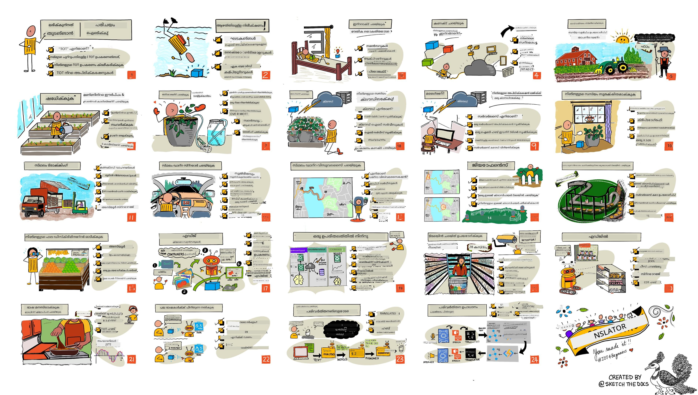

<!--
CO_OP_TRANSLATOR_METADATA:
{
  "original_hash": "6c354ec3487e4f6cfafbe44557996cd9",
  "translation_date": "2026-01-07T01:27:35+00:00",
  "source_file": "README.md",
  "language_code": "ml"
}
-->
[](https://github.com/microsoft/IoT-For-Beginners/blob/master/LICENSE)
[](https://GitHub.com/microsoft/IoT-For-Beginners/graphs/contributors/)
[](https://GitHub.com/microsoft/IoT-For-Beginners/issues/)
[](https://GitHub.com/microsoft/IoT-For-Beginners/pulls/)
[](http://makeapullrequest.com)

[](https://GitHub.com/microsoft/IoT-For-Beginners/watchers/)
[](https://GitHub.com/microsoft/IoT-For-Beginners/network/)
[](https://GitHub.com/microsoft/IoT-For-Beginners/stargazers/)

### അസ്യൂർ എഐ ഫൗണ്ട്രി കമ്മ്യൂണിറ്റിയിലേക്ക് ചേരുക

നിങ്ങൾ സങ്കടത്തിൽപ്പെടുകയോ എഐ ആപ്പുകൾ നിർമ്മിക്കുന്നതിനെക്കുറിച്ചുള്ള ഏതെങ്കിലും ചോദ്യങ്ങൾ ഉണ്ടായിരിക്കുന്നുവെങ്കിൽ, MCP-യെക്കുറിച്ചുള്ള ചർച്ചകളിൽ അനുബന്ധ പഠിതാക്കളുടേയും പരിചയസമ്പന്നരായ ഡെവലപ്പർമാരുടേയും കൂട്ടത്തിലേക്ക് ചേരുക. ചോദ്യങ്ങൾക്ക് വരവേ കൂടിയ ഒരു പിന്തുണയേറിയ സമൂഹമാണ് ഇത്, അറിവ് സ്വതന്ത്രമായി പങ്കുവെക്കപ്പെടുന്നു.

[](https://discord.gg/nTYy5BXMWG)

നിങ്ങൾക്ക് ഉൽപ്പന്ന പ്രതികരണം ഉണ്ടെങ്കിൽ അല്ലെങ്കിൽ നിർമ്മാണം നടത്തുമ്പോൾ പിശകുകൾ കണ്ടാൽ സന്ദർശിക്കുക:

[](https://aka.ms/foundry/forum)

ഈ რესോഴ്‌സുകൾ ഉപയോഗിച്ച് തുടങ്ങിയുകൊള്ളുന്നതിനുള്ള ഈ ഘട്ടങ്ങൾ പിന്തുടരുക:
1. **റിപ്പോസിറ്ററി ഫോർക്ക് ചെയ്യുക**: ക്ലിക്ക് ചെയ്യുക [](https://GitHub.com/microsoft/IoT-For-Beginners/fork)
2. **റിപ്പോസിറ്ററി ക്ലോൺ ചെയ്യുക**:   `git clone https://github.com/microsoft/IoT-For-Beginners.git`
3. [**മൈക്രോസോഫ്റ്റ് ഫൗണ്ട്രി ഡിസ്കോർഡിൽ ചേർന്ന് വിദഗ്ദ്ധരെയും അനുബന്ധ ഡെവലപ്പർമാരെയും കാണുക**](https://discord.com/invite/ByRwuEEgH4)


### 🌐 ബഹുഭാഷാ പിന്തുണ

#### GitHub ആക്ഷൻ വഴി പിന്തുണ (താനിയന്ത്രിതവും എപ്പോഴും പുതുക്കപ്പെടുന്നതുമായ)

<!-- CO-OP TRANSLATOR LANGUAGES TABLE START -->
[Arabic](../ar/README.md) | [Bengali](../bn/README.md) | [Bulgarian](../bg/README.md) | [Burmese (Myanmar)](../my/README.md) | [Chinese (Simplified)](../zh/README.md) | [Chinese (Traditional, Hong Kong)](../hk/README.md) | [Chinese (Traditional, Macau)](../mo/README.md) | [Chinese (Traditional, Taiwan)](../tw/README.md) | [Croatian](../hr/README.md) | [Czech](../cs/README.md) | [Danish](../da/README.md) | [Dutch](../nl/README.md) | [Estonian](../et/README.md) | [Finnish](../fi/README.md) | [French](../fr/README.md) | [German](../de/README.md) | [Greek](../el/README.md) | [Hebrew](../he/README.md) | [Hindi](../hi/README.md) | [Hungarian](../hu/README.md) | [Indonesian](../id/README.md) | [Italian](../it/README.md) | [Japanese](../ja/README.md) | [Kannada](../kn/README.md) | [Korean](../ko/README.md) | [Lithuanian](../lt/README.md) | [Malay](../ms/README.md) | [Malayalam](./README.md) | [Marathi](../mr/README.md) | [Nepali](../ne/README.md) | [Nigerian Pidgin](../pcm/README.md) | [Norwegian](../no/README.md) | [Persian (Farsi)](../fa/README.md) | [Polish](../pl/README.md) | [Portuguese (Brazil)](../br/README.md) | [Portuguese (Portugal)](../pt/README.md) | [Punjabi (Gurmukhi)](../pa/README.md) | [Romanian](../ro/README.md) | [Russian](../ru/README.md) | [Serbian (Cyrillic)](../sr/README.md) | [Slovak](../sk/README.md) | [Slovenian](../sl/README.md) | [Spanish](../es/README.md) | [Swahili](../sw/README.md) | [Swedish](../sv/README.md) | [Tagalog (Filipino)](../tl/README.md) | [Tamil](../ta/README.md) | [Telugu](../te/README.md) | [Thai](../th/README.md) | [Turkish](../tr/README.md) | [Ukrainian](../uk/README.md) | [Urdu](../ur/README.md) | [Vietnamese](../vi/README.md)

> **സ്ഥലീയമായി ക്ലോൺ ചെയ്യാൻ ഇഷ്ടപ്പെടുന്നവർക്കായി?**

> ഈ റിപ്പോസിറ്ററിയിൽ 50-കൂടുതൽ ഭാഷാ വിവർത്തനങ്ങൾ ഉൾപ്പെടുത്തിയതുണ്ടുതിൽ ഇത് ഡൗൺലോഡിന്റെ വലുതായ വലിപ്പം വർദ്ധിപ്പിക്കും. വിവർത്തനങ്ങൾ ഇല്ലാതെ ക്ലോൺ ചെയ്യാൻ sparse checkout ഉപയോഗിക്കുക:
> ```bash
> git clone --filter=blob:none --sparse https://github.com/microsoft/IoT-For-Beginners.git
> cd IoT-For-Beginners
> git sparse-checkout set --no-cone '/*' '!translations' '!translated_images'
> ```
> ഇതിൽ കോഴ്‌സ് പൂർത്തിയാക്കാൻ ആവശ്യമായ എല്ലാ വസ്തുക്കളും ലഭിക്കും, കൂടുതൽ വേഗത്തിൽ ഡൗൺലോഡ് ചെയ്യാം.
<!-- CO-OP TRANSLATOR LANGUAGES TABLE END -->

# ആരംഭക്കാർക്കുള്ള IoT - ഒരു പാഠ്യപദ്ധതി

Microsoft-ൽ അസ്യൂർ ക്ലൗഡ് അഡ്വൊക്കേറ്റ്മാർ 12 ആഴ്ച, 24 പാഠങ്ങളുള്ള IoT അടിസ്ഥാനങ്ങളെക്കുറിച്ചുള്ള പാഠ്യപദ്ധതി സന്തോഷത്തോടെ അവതരിപ്പിക്കുന്നു. ഓരോ പാഠവും മുൻ-പാഠം மற்றும் പാഠാനന്തര ക്വിസുകൾ ഉൾക്കൊള്ളുന്നു, പാഠം പൂർത്തിയാകാൻ എഴുതിയ നിർദ്ദേശങ്ങൾ, ഒരു പരിഹാരം, ഒരു അസൈൻമെന്റ്, കൂടാതെ മറ്റും ഉണ്ട്. നമ്മുടെ പ്രോജക്ട് നിയമാവലി നിങ്ങൾക്ക് നിർമ്മിക്കുന്നതിനിടെ പഠിക്കാൻ അനുവദിക്കുന്നു, പുതിയ കഴിവുകൾ 'അടിഞ്ഞുപൊരുകാൻ' തെളിയിച്ച മാർഗമാണ്.

പദ്ധതികൾ നടപ്പിലാക്കുന്ന ഭക്ഷണത്തിന്റെയും കൃഷിയുടെയും യാത്രയെയും അടങ്ങിയിരിക്കുന്നു. ഇതിൽ കൃഷി, ഗത്യക്ഷേമം, നിർമ്മാണം, കുടുംബവ്യാപാരം, ഉപഭോക്താവ് എന്നിവ ഉള്‍പ്പെടുന്നു — IoT ഉപകരണങ്ങൾക്കായി പ്രശസ്തമായ വ്യവസായ മേഖലകൾ.



> സ്കെച് നോട്ട് [നിത്യ നരസിംഹൻ](https://github.com/nitya) തയാറാക്കിയതാണ്. വലിയ പതിപ്പിന് ചിത്രം ക്ലിക്ക് ചെയ്യുക.

**നമ്മുടെ എഴുത്തുകാരായ [ജന ഫോക്സ്](https://github.com/jenfoxbot), [ജന ലൂപ്പർ](https://github.com/jlooper), [ജിം ബെനറ്റ്](https://github.com/jimbobbennett), ഞങ്ങളുടെ സ്കെച് നോട്ട് ആർട്ടിസ്റ്റ് [നിത്യ നരസിംഹൻ](https://github.com/nitya) എന്നിവർക്കും ഹൃദയം നിറഞ്ഞ നന്ദി.**

**ഈ പാഠ്യപദ്ധതി നിരീക്ഷിക്കുകയും വിവർത്തനം നടത്തുകയും ചെയ്ത [Microsoft Learn Student Ambassadors](https://studentambassadors.microsoft.com?WT.mc_id=academic-17441-jabenn) സംഘത്തിനും നന്ദി: [അദിത്യ ഗാർഗ്](https://github.com/AdityaGarg00), [അനുരാഗ് ശർമ](https://github.com/Anurag-0-1-A), [അർപിത ദാസ്](https://github.com/Arpiiitaaa), [അറിയാൻ ജെയിൻ](https://www.linkedin.com/in/aryan-jain-47a4a1145/), [ഭവേഷ് സുനേജ](https://github.com/EliteWarrior315), [ഫെയ്ത് ഹുന്ജ](https://faithhunja.github.io/), [ലത്തീഫ ബെല്ലോ](https://www.linkedin.com/in/lateefah-bello/), [മൻവി ജാ](https://github.com/Severus-Matthew), [മിറെയിൽ ടാൻ](https://www.linkedin.com/in/mireille-tan-a4834819a/), [മുഹമ്മദ് ഇഫ്തेखർ (ഇഫ്റ്റു) എബ്നെ ജലാൽ](https://github.com/Iftu119), [മുഹമ്മദ് സുൽഫിക്കർ](https://github.com/mohzulfikar), [പ്രിയൻഷു ശ്രീവാസ്തവ്](https://www.linkedin.com/in/priyanshu-srivastav-b067241ba), [തൻമയ് ഗോഡ്യൂചെറുവു](https://github.com/innovation-platform), [സീന കാമേൽ](https://www.linkedin.com/in/zina-kamel/).**

ടീമിനെ അറിയൂ!

[](https://youtu.be/-wippUJRi5k)

**ഗിഫ് [മോഹിത് ജയിസൽ](https://linkedin.com/in/mohitjaisal) നിർമ്മിച്ചത്**

> 🎥 പ്രോജക്ട് സംബന്ധിച്ച വീഡിയോയ്ക്ക് മുകളിൽ ചിത്രം ക്ലിക്ക് ചെയ്യുക!

> **അധ്യാപകർ**, ഈ പാഠ്യപദ്ധതി ഉപയോഗിക്കുന്നതിനെക്കുറിച്ച് [ചില നിർദ്ദേശങ്ങൾ ഉൾപ്പെടുത്തിയിട്ടുണ്ട്](for-teachers.md). നിങ്ങളുടെ സ്വന്തം പാഠങ്ങൾ സൃഷ്ടിക്കാൻ ആഗ്രഹിക്കുന്നുവെങ്കിൽ, [ഒരു പാഠം ടെന്ന്പ്ലേറ്റ്](lesson-template/README.md) കൂടി നൽകിയിട്ടുണ്ട്.

> **[വിദാർത്ഥികൾ](https://aka.ms/student-page)**, ഈ പാഠ്യപദ്ധതി സ്വയം ഉപയോഗിക്കാൻ, മുഴുവൻ റിപോ ഫോർക്ക് ചെയ്ത് നിങ്ങളുടെ കൃത്യങ്ങൾ സ്വയം പൂർത്തിയാക്കുക, മുൻപുള്ള ഒരു ക്ലാസ്-ക്വിസിനോട് തുടങ്ങുകയും, പാഠം വായിച്ച് ശേഷിക്കുന്ന പ്രവർത്തനങ്ങൾ നടത്തുകയും ചെയ്യുക. പരിഹാര കോഡ് പകർപ്പു ചെയ്യുന്നതിന് പകരം പാഠങ്ങൾ ആധിക്യം മനസിലാക്കിയ ശേഷം പ്രോജക്റ്റുകൾ സൃഷ്ടിക്കാൻ ശ്രമിക്കുക; ആ കോഡ് ഓരോ പ്രോജക്റ്റ്-ഓറിയന്റഡ് പാഠത്തിലും /solutions ഫോൾഡറുകളിൽ ലഭ്യമാണ്. ഒരു വേറെ ആശയം സുഹൃത്തുക്കളുമായി പഠനസംഘം രൂപീകരിച്ച് ഒരുമിച്ച് ഉള്ളടക്കം പരിശോധിക്കുന്നതും ആണ്. കൂടുതൽ പഠനത്തിനായി ഞങ്ങൾ [Microsoft Learn](https://docs.microsoft.com/users/jimbobbennett/collections/ke2ehd351jopwr?WT.mc_id=academic-17441-jabenn) ശുപാർശ ചെയ്യുന്നു.

ഈ കോഴ്സിന്റെ ഒരു വീഡിയോ അവലോകനത്തിനായി, ഈ വീഡിയോ കാണുക:

[](https://youtube.com/watch?v=bccEMm8gRuc "പ്രമോ വീഡിയോ")

> 🎥 പ്രോജക്ട് സംബന്ധിച്ച വീഡിയോയ്ക്ക് മുകളിൽ ചിത്രം ക്ലിക്ക് ചെയ്യുക!

## പാഠരീതി

ഈ പാഠ്യപദ്ധതി തയ്യാറാക്കുമ്പോൾ ഞങ്ങൾ രണ്ട് പ്രധാന പാഠരീതികൾ തെരഞ്ഞെടുത്തു: പ്രോജക്റ്റ് മേലുള്ള അധിഷ്ഠിതം ഉറപ്പുവരുത്തലും, ഏറെക്കുറെ ക്വിസുകൾ ഉൾപ്പെടുത്തലും. ഈ പരമ്പരയുടെ അവസാനം വിദ്യാർത്ഥികൾ ഒരു സസ്യ പരിശോധനയും ജലസേചന സംവിധാനവും, ഒരു ഗതാഗത ട്രാക്കറും, ഭക്ഷണം പരിശോധിക്കുകയും ട്രാക്ക് ചെയ്യുകയും ചെയ്യുന്ന ഒരു സ്മാർട്ട് ഫാക്ടറിയും, ശബ്ദ നിയന്ത്രിത പാചക ടൈമറുമായ ഒരു വിദ്യാർത്ഥി ആയി തീരും, കൂടാതെ ഇന്റർനെറ്റ് ഓഫ് തിങ്‌സ് അടിസ്ഥാനങ്ങൾ ഉൾപ്പെടെ ഉപകരണ കോഡ് എഴുതാൻ, ക്ലൗഡിലേക്കു കണക്ടുചെയ്യാൻ, ടെലിമെട്രി വിശകലനം ചെയ്യാനും, എഡ്‌ജിൽ എഐ പ്രവർത്തിപ്പിക്കാനും പഠിക്കും.

ഉള്ളടക്കം പ്രോജക്റ്റുകളുമായി യോജിക്കുന്നതായും ഉണ്ടെങ്കിൽ വിദ്യാർത്ഥികൾക്ക് ഇത് കൂടുതൽ ആകർഷകമായും ആശയങ്ങൾ കൂടുതൽ പിടിച്ചുപറിയുന്നതായി നിർമ്മിക്കും.

ക്ലാസിനു മുമ്പ് കുറഞ്ഞ പ്രാധാന്യമുള്ള ഒരു ക്വിസ് വിദ്യാർത്ഥിയുടെ പഠനസങ്കൽപ്പത്തിന് ദിശ നല്കുകയും, ക്ലാസ് കഴിഞ്ഞ് രണ്ടാം ക്വിസ് കൂടുതൽ നിലനിർത്തലിന് സഹായിക്കുകയും ചെയ്യുന്നു. ഈ പാഠ്യപദ്ധതി ഫ്ലെക്സിബിളും രസകരമായും രൂപകൽപ്പന ചെയ്തതാണ്, പൂർണ്ണമായി അല്ലെങ്കിൽ חלקമായും സ്വീകരിക്കാം. പ്രോജക്റ്റുകൾ ചെറിയതുപോലെ തുടങ്ങിയിട്ട് 12 ആഴ്ച്ചവരെ കൂടുതൽ സങ്കീർണ്ണമായിരിക്കും.

ഓരോ പ്രോജക്റ്റും വിദ്യാർത്ഥികൾക്കും ഹോബിയാസ്സന്മാർക്കും ലഭ്യമായ സത്യവസ്തു ഹാർഡ്‌വെയർ അടിസ്ഥാനമാക്കിയാണ്. പ്രോജക്റ്റ് ഓരോ പ്രോജക്റ്റ് ഡൊമെയിനിൽനിന്ന് ബന്ധപ്പെട്ട പശ്ചാത്തല അറിവ് നൽകുന്നു. വിജയകരമായ ഒരു ഡെവലപ്പറാവാൻ നിങ്ങൾ പരിഹരിക്കുന്ന മേഖല മനസ്സിലാക്കുന്നുവെങ്കിൽ സഹായകമാണ്, ഇതിലൂടെ വിദ്യാർത്ഥികൾക്ക് അവരുടെ IoT പരിഹാരങ്ങളും പഠനങ്ങളും യാഥാർത്ഥ്യ പ്രശ്നത്തിന്റെ സാഹചര്യത്തിൽ ആലോചിക്കാൻ സാധിക്കും. അവർ നിർമിക്കുന്ന പരിഹാരങ്ങളുടെ 'കാരണം' മനസ്സിലാക്കുകയും, അവസാന ഉപയോക്താവിന്idiousധാന്യം ലഭിക്കുകയും ചെയ്യും.

## ഹാർഡ്‌വെയർ

പ്രോജക്റ്റുകൾക്കായി രണ്ടു വിധത്തിലുള്ള IoT ഹാർഡ്‌വെയറുകൾ ഞങ്ങൾ ഉണ്ട്, വ്യക്തിപരമായ ഇഷ്ടം, പ്രോഗ്രാമിംഗ് ഭാഷാ അറിവ് അല്ലെങ്കിൽ ഇഷ്ടങ്ങൾ, പഠന ലക്ഷ്യങ്ങൾ, ലഭ്യമാകൽ എന്നിവയുടെ അടിസ്ഥാനത്തിൽ തിരഞ്ഞെടുക്കാം. ഹാർഡ്‌വെയർ ലഭ്യമല്ലാത്തവർക്കോ വാങ്ങുന്നതിനുമുൻപ് കൂടുതൽ പഠിക്ക വേണമെങ്കിൽ ഉപയോഗിക്കാൻ 'വർച്വൽ ഹാർഡ്‌വെയർ' പതിപ്പ് ഞങ്ങൾ നൽകിയിട്ടുണ്ട്. കൂടുതൽ വായിച്ച് 'ഷോപ്പിംഗ് ലിസ്റ്റ്' പേജ് [hardware page](./hardware.md)ൽ കാണുക, Seeed Studioൽ നിന്നുള്ള കിറ്റുകൾ വാങ്ങാനുള്ള ലിങ്കുകൾ ഉൾപ്പെടെ.
> 💁 ഞങ്ങളുടെ [കോഡ് ഓഫ് കൺഡക്റ്റ്](CODE_OF_CONDUCT.md), [സംഭാവന](CONTRIBUTING.md), અને [പരിവർത്തനം](TRANSLATIONS.md) മാർഗ്ഗനിർദ്ദേശങ്ങൾ കണ്ടുപിടിക്കൂ. നിങ്ങളുടെ നിർമ്മിതിപരമായ പ്രതികരണത്തെ ഞങ്ങൾ സ്വാഗതം ചെയ്യുന്നു!
>
> 🔧 പ്രശ്നങ്ങൾ നേരിടുകയാണോ? സാധാരണ പ്രശ്നങ്ങൾക്ക് പരിഹാരങ്ങൾക്കായി ഞങ്ങളുടെ [ട്രബിൾഷൂട്ടിംഗ് ഗൈഡ്](TROUBLESHOOTING.md) നോക്കൂ.

## ഓരോ പാഠവും ഇതു ഉൾക്കൊള്ളുന്നു:

- സ്കെച്ച്നോട്ട്
- ഐച്ഛിക കൂട്ടിച്ചേർക്കുന്ന വീഡിയോ
- പാഠത്തിനുമുമ്പുള്ള വേർമപ്പ് ക്വിസ്
- എഴുതി രേഖപ്പെടുത്തിയ പാഠം
- പ്രോജക്ട് അടിസ്ഥാനമായ പാഠങ്ങൾക്ക്, പ്രോജക്ട് നിർമ്മിക്കുന്നതിനുള്ള ഘട്ടം-ഘട്ടമായ മാർഗ്ഗനിർദ്ദേശങ്ങൾ
- അറിവ് പരിശോധിക്കൽ
- ഒരു ചലഞ്ച്
- കൂട്ടിച്ചേർക്കുന്ന വായന
- അസൈൻമെന്റ്
- [പാഠാനന്തര ക്വിസ്](https://ff-quizzes.netlify.app/en/)

> **ക്വിസുകളെക്കുറിച്ചുള്ള ഒരു കുറിപ്പ്**: എല്ലാ ക്വിസുകളും quiz-app ഫോൾഡറിനുള്ളിൽ ഉൾപ്പെടുന്നു, ഓരോന്നിലും മൂന്ന് ചോദ്യങ്ങളുള്ള 48 ക്വിസുകൾ ഉണ്ടെന്നു. അവ പാഠങ്ങളിലൂടെ കണക്റ്റ് ചെയ്തിട്ടുണ്ടെങ്കിലും quiz app പ്രാദേശികമായി ഓടിക്കാം അല്ലെങ്കിൽ Azure-ലേക്ക് نشر ചെയ്യാം; quiz-app ഫോൾഡറിലെ നിർദ്ദേശങ്ങൾ പാലിക്കുക. അവ ക്രമമായി പ്രാദേശീകമാക്കപ്പെടുകയാണ്.

## പാഠങ്ങൾ

|       |              പ്രോജക്ട് പേര്               |                       പഠിപ്പിച്ച ആശയങ്ങൾ                        | പഠന ലക്ഷ്യങ്ങൾ                                                                                                                                                        |                                                        ബന്ധിപ്പിച്ച പാഠം                                                         |
| :---: | :------------------------------------: | :---------------------------------------------------------: | ------------------------------------------------------------------------------------------------------------------------------------------------------------------- | :--------------------------------------------------------------------------------------------------------------------------: |
|  01   | [ആരംഭിക്കുന്നത്](./1-getting-started/README.md) |                     ഇന്റർനെറ്റിന്റെ വസ്തുക്കൾ (IoT) പരിചയം                     | IoTന്റെ അടിസ്ഥാന സിദ്ധാന്തങ്ങൾ പഠിക്കുക, സെൻസറുകൾ, ക്ലൗഡ് സേവനങ്ങൾ പോലുള്ള IoT പരിഹാരങ്ങളുടെ അടിസ്ഥാന ഘടകങ്ങൾ പഠിക്കുക, നിങ്ങളുടെ ആദ്യ IoT ഉപകരണം ക്രമീകരിക്കുമ്പോൾ |                      [ഇന്റർനെറ്റിന്റെ വസ്തുക്കൾ - പരിചയം](./1-getting-started/lessons/1-introduction-to-iot/README.md)                      |
|  02   | [ആരംഭിക്കുന്നത്](./1-getting-started/README.md) |                   IoT-യിൽ കൂടുതൽ ആഴത്തിലുള്ള പഠനം                    | ഒരു IoT സംവിധാനത്തിന്റെ ഘടകങ്ങളെക്കുറിച്ച് കൂടെയായി അറിയുക, മൈക്രോക്കൺട്രോളറുകളും സിംഗിൾ-ബോർഡ് കമ്പ്യൂട്ടറുകളും ഉൾപ്പെടെ                                                            |                        [IoT-യിൽ കൂടുതൽ ആഴത്തിൽ](./1-getting-started/lessons/2-deeper-dive/README.md)                         |
|  03   | [ആരംഭിക്കുന്നത്](./1-getting-started/README.md) | സെൻസറുകളും ആക്ചുവേറ്ററുകളും ഉപയോഗിച്ച് ഭൗതിക ലോകത്തെ ഇടപെടുക | ഭൗതിക ലോകത്തുനിന്ന് ഡേറ്റ ശേഖരിക്കാൻ സെൻസറുകൾ, പ്രതികരണം നൽകാൻ ആക്ചുവേറ്ററുകൾ എന്നിവയെക്കുറിച്ചറിയുക, രാത്രിവെളിച്ചം നിർമ്മിക്കുമ്പോൾ                                           | [സെൻസറുകളും ആക്ചുവേറ്ററുകളും ഉപയോഗിച്ച് ഭൗതിക ലോകത്തെ ഇടപെടുക](./1-getting-started/lessons/3-sensors-and-actuators/README.md) |
|  04   | [ആരംഭിക്കുന്നത്](./1-getting-started/README.md) |             നിങ്ങളുടെ ഉപകരണം ഇന്റർനെറ്റുമായി ബന്ധിപ്പിക്കുക             | നിങ്ങളുടെ നൈറ്റ് ലൈറ്റിനെ MQTT ബ്രോക്കറുമായി ബന്ധിപ്പിച്ച് സന്ദേശങ്ങൾ അയയ്ക്കാനും സ്വീകരിക്കാനും എങ്ങനെ IoT ഉപകരണം ഇന്റർനെറ്റടക്കം ബന്ധിപ്പിക്കുക പഠിക്കുക                               |               [നിങ്ങളുടെ ഉപകരണം ഇന്റർനെറ്റുമായി ബന്ധിപ്പിക്കുക](./1-getting-started/lessons/4-connect-internet/README.md)                |
|  05   |            [ഫാം](./2-farm/README.md)            |                    സസ്യവളർച്ച പ്രവചിക്കുക                     | IoT ഉപകരണം പകർത്തുന്ന താപനില ഡേറ്റ ഉപയോഗിച്ച് സസ്യവളർച്ചയെ എങ്ങനെ പ്രവചിക്കാമെന്ന് പഠിക്കുക                                                                                  |                          [സസ്യവളർച്ച പ്രവചിക്കുക](./2-farm/lessons/1-predict-plant-growth/README.md)                           |
|  06   |            [ഫാം](./2-farm/README.md)            |                    മണ്ണിലെ ഇളക്കം കണ്ടെത്തുക                     | മണ്ണിലെ ഇളക്കം എങ്ങനെ കണ്ടെത്താമെന്നും മണ്ണിലെ ഇളക്കം സെൻസർ എങ്ങനെ കാലിബ്രേറ്റ് ചെയ്യാമെന്നും പഠിക്കുക                                                                                              |                          [മണ്ണിലെ ഇളക്കം കണ്ടെത്തുക](./2-farm/lessons/2-detect-soil-moisture/README.md)                           |
|  07   |            [ഫാം](./2-farm/README.md)            |                  സസ്യത്തിന് ഓട്ടോമേറ്റഡ് ജലസേചനം                   | റിലേയും MQTTഉം ഉപയോഗിച്ച് ജലസേചനം ഓട്ടോമേറ്റുചെയ്യുകയും സമയക്രമീകരിക്കുകയും ചെയ്യുന്നതെങ്ങനെ എന്നത് പഠിക്കുക                                                                                                      |                      [ഓട്ടോമേറ്റഡ് സസ്യ ജലസേചനം](./2-farm/lessons/3-automated-plant-watering/README.md)                       |
|  08   |            [ഫാം](./2-farm/README.md)            |               നിങ്ങളുടെ സസ്യം ക്ലൗഡിലേക്കു മാറ്റുക               | ക്ലൗഡുകളെയും ക്ലൗഡ്-ഹോസ്റ്റുചെയ്യുന്ന IoT സേവനങ്ങളെയും കുറിച്ച് അറിയുക, പബ്ലിക് MQTT ബ്രോക്കറിന്റെ പകരം നിങ്ങളുടെ സസ്യം എങ്ങനെ ക്ലൗഡിലേക്ക് ബന്ധിപ്പിക്കാമെന്ന് പഠിക്കുക                                   |               [നിങ്ങളുടെ സസ്യം ക്ലൗഡിലേക്കു മാറ്റുക](./2-farm/lessons/4-migrate-your-plant-to-the-cloud/README.md)                |
|  09   |            [ഫാം](./2-farm/README.md)            |         നിങ്ങളുടെ ആപ്പ്ലിക്കേഷൻ ലജിക് ക്ലൗഡിലേക്കു മാറ്റുക         | IoT സന്ദേശങ്ങൾക്ക് പ്രതികരിക്കുന്ന ക്ലൗഡിലുള്ള ആപ്ലിക്കേഷൻ ലജിക് എങ്ങനെ എഴുതാമെന്ന് പഠിക്കുക                                                                          |         [നിങ്ങളുടെ ആപ്പ് ലജിക് ക്ലൗഡിലേക്കു മാറ്റുക](./2-farm/lessons/5-migrate-application-to-the-cloud/README.md)         |
|  10   |            [ഫാം](./2-farm/README.md)            |                   നിങ്ങളുടെ സസ്യം സുരക്ഷിതമാക്കുക                    | IoT-യിൽ സുരക്ഷയെക്കുറിച്ച് അറിയുക, കീകൾ എൻസെർട്ടിഫിക്കറ്റുകൾ ഉപയോഗിച്ച് നിങ്ങളുടെ സസ്യം എങ്ങനെ സുരക്ഷിതമാക്കാമെന്ന് പഠിക്കുക                                                                          |                        [നിങ്ങളുടെ സസ്യം സുരക്ഷിതമാക്കുക](./2-farm/lessons/6-keep-your-plant-secure/README.md)                         |
|  11   |       [ട്രാൻസ്പോർട്ട്](./3-transport/README.md)       |                      സ്ഥാനം ട്രാക്കുചെയ്യൽ                      | IoT ഉപകരണങ്ങൾക്ക് GPS സ്ഥാനം ട്രാക്കുചെയ്യലിനെക്കുറിച്ച് അറിയുക                                                                                                                   |                           [സ്ഥാനം ട്രാക്കുചെയ്യൽ](./3-transport/lessons/1-location-tracking/README.md)                           |
|  12   |       [ട്രാൻസ്പോർട്ട്](./3-transport/README.md)       |                     സ്ഥാനം ഡേറ്റ സംഭരിക്കൽ                     | പിന്നീട് കാഴ്ചവയ്ക്കാനോ വിശകലനം ചെയ്യാനോ IoT ഡേറ്റ എങ്ങനെ സംഭരിക്കാമെന്ന് പഠിക്കുക                                                                                                      |                         [സ്ഥാനം ഡേറ്റ സംഭരിക്കുക](./3-transport/lessons/2-store-location-data/README.md)                         |
|  13   |       [ട്രാൻസ്പോർട്ട്](./3-transport/README.md)       |                   സ്ഥാനം ഡേറ്റ ആസ്വദിക്കൽ                   | ഒരു മാപ്പിൽ സ്ഥാനം ഡേറ്റ എങ്ങനെ കാഴ്ചവയ്ക്കാനാകുമെന്ന്, മാപ്പുകൾ എങ്ങനെ യഥാർത്ഥ 3D ലോകത്തെ 2D മാപ്പുകളായി പ്രതിനിധാനം ചെയ്യുന്നു എന്നത് പഠിക്കുക                                                            |                     [സ്ഥാനം ഡേറ്റ ആസ്വദിക്കൽ](./3-transport/lessons/3-visualize-location-data/README.md)                     |
|  14   |       [ട്രാൻസ്പോർട്ട്](./3-transport/README.md)       |                          ജിയോഫുവ്സുകൾ                          | ജിയോഫുവ്സുകൾ എന്താണെന്നും അവ വിതരണ ശൃംഖലയിൽ വാഹനങ്ങൾ അവരുടെ ഘട്ടത്തിലേക്ക് സമീപിക്കുമ്പോൾ എങ്ങനെ അലർട്ട് നൽകാറുണ്ടെന്നും പഠിക്കുക                                           |                                   [ജിയോഫുവ്സുകൾ](./3-transport/lessons/4-geofences/README.md)                                   |
|  15   |   [മാനുഫാക്ചറിംഗ്](./4-manufacturing/README.md)   |               പഴം ഗുണം തിരിച്ചറിയാനുള്ള ട്രയിനിങ്                | പഴം ഗുണം തിരിച്ചറിയാൻ ക്ലൗഡിൽ ഇമേജ് ക്ലാസിഫയർ ട്രെയിൻ ചെയ്യുന്നതെങ്ങനെയാണെന്ന് പഠിക്കുക                                                                                       |                 [പഴം ഗുണം തിരിച്ചറിയൽ ട്രെയിന്‍](./4-manufacturing/lessons/1-train-fruit-detector/README.md)                 |
|  16   |   [മാനുഫാക്ചറിംഗ്](./4-manufacturing/README.md)   |           IoT ഉപകരണത്തിൽ നിന്നുള്ള പഴം ഗുണം പരിശോധന            | നിങ്ങളുടെ പഴം ഗുണം തിരിച്ചറിയുന്ന ഉപകരണം ഒരു IoT ഉപകരണത്തിൽ നിന്ന് ഉപയോഗിക്കുന്നതെങ്ങനെ എന്നത് പഠിക്കുക                                                                                                    |           [IoT ഉപകരണത്തിൽ നിന്നുള്ള പഴം ഗുണം പരിശോധന](./4-manufacturing/lessons/2-check-fruit-from-device/README.md)            |
|  17   |   [മാനുഫാക്ചറിംഗ്](./4-manufacturing/README.md)   |             നിങ്ങളുടെ പഴം കണ്ടെത്തുന്ന ഉപകരണം എഡ്ജിൽ ഓടിക്കുക             | നിങ്ങളുടെ പഴം കണ്ടെത്തുന്ന ഉപകരണം എഡ്ജിൽ IoT ഉപകരണത്തിൽ എങ്ങനെയാണ് ഓടിക്കുന്നത് എന്നത് പഠിക്കുക                                                                                                |             [പഴം കണ്ടെത്തുന്ന ഉപകരണം എഡ്ജിൽ ഓടിക്കുക](./4-manufacturing/lessons/3-run-fruit-detector-edge/README.md)             |
|  18   |   [മാനുഫാക്ചറിംഗ്](./4-manufacturing/README.md)   |        സെൻസറിൽ നിന്നുള്ള പഴം ഗുണം കണ്ടെത്തൽ പ്രേരിപ്പിക്കുക        | സെൻസറിൽ നിന്നുള്ള പഴം ഗുണം കണ്ടെത്തൽ എങ്ങനെ പ്രേരിപ്പിക്കാമെന്ന് പഠിക്കുക                                                                                                        |        [സെൻസറിൽ നിന്നുള്ള പഴം ഗുണം കണ്ടെത്തൽ പ്രേരിപ്പിക്കുക](./4-manufacturing/lessons/4-trigger-fruit-detector/README.md)         |
|  19   |          [റീറ്റെയിൽ](./5-retail/README.md)          |                   സ്റ്റോക്ക് കണ്ടെത്താനുള്ള ട്രയിനിങ്                    | ഒരു കടയിലെ സ്റ്റോക്ക് എണ്ണാൻ ഉദ്ദേശിച്ചിട്ടുള്ള സ്റ്റോക്ക് കണ്ടെത്തുന്ന ഉപകരണം പരിശീലിപ്പിക്കാൻ ഒബ്ജക്ട് ഡിറ്റക്ഷൻ എങ്ങനെ ഉപയോഗിക്കാമെന്ന് പഠിക്കുക                                                                                |                        [സ്റ്റോക്ക് കണ്ടെത്തുന്ന ട്രയിനിങ്](./5-retail/lessons/1-train-stock-detector/README.md)                         |
|  20   |          [റീറ്റെയിൽ](./5-retail/README.md)          |               IoT ഉപകരണത്തിൽ നിന്നുള്ള സ്റ്റോക്ക് പരിശോധിക്കൽ                | ഒബ്ജക്ട് ഡിറ്റക്ഷൻ മോഡൽ ഉപയോഗിച്ച് IoT ഉപകരണത്തിൽ നിന്നുള്ള സ്റ്റോക്ക് എങ്ങനെ പരിശോധിക്കാമെന്ന് പഠിക്കുക                                                                                         |                     [IoT ഉപകരണത്തിൽ നിന്നുള്ള സ്റ്റോക്ക് പരിശോധിക്കുക](./5-retail/lessons/2-check-stock-device/README.md)                      |
|  21   |        [ഉപഭോക്താവ്](./6-consumer/README.md)        |             IoT ഉപകരണത്തിൽ നിന്നുള്ള വാക്ക് തിരിച്ചറിയൽ             | IoT ഉപകരണത്തിൽ നിന്നുള്ള വാക്ക് തിരിച്ചറിയാൻ പഠിക്കുക, അത് ഉപയോഗിച്ച് ഒരു സ്മാർട്ട് ടൈമർ നിർമ്മിക്കുക                                                                                             |                  [IoT ഉപകരണത്തിൽ നിന്നുള്ള വാക്ക് തിരിച്ചറിയൽ](./6-consumer/lessons/1-speech-recognition/README.md)                  |
|  22   |        [ഉപഭോക്താവ്](./6-consumer/README.md)        |                     ഭാഷ മനസ്സിലാക്കൽ                     | IoT ഉപകരണത്തിന് സംസാരിച്ച വാക്യങ്ങൾ മനസ്സിലാക്കാൻ എങ്ങനെ പഠിക്കാമെന്ന് അറിയുക                                                                                                           |                        [ഭാഷ മനസ്സിലാക്കൽ](./6-consumer/lessons/2-language-understanding/README.md)                        |
|  23   |        [ഉപഭോക്താവ്](./6-consumer/README.md)        |           ടൈമർ സജ്ജീകരിക്കുകയും സംസാരത്തിലുള്ള പ്രതികരണവും നൽകുക           | IoT ഉപകരണത്തിൽ ഒരു ടൈമർ ക്രമീകരിക്കുന്നു, ടൈമർ സജ്ജീകരിച്ചതും തീർന്നതും എപ്പോൾ എന്നും സംസാരവായ്പ്പായ പ്രതികരണം നൽകുന്നത് എങ്ങനെയാണെന്ന് പഠിക്കുക                                                    |                 [ടൈമർ സജ്ജീകരിക്കുകയും സംസാരത്തിലുള്ള പ്രതികരണവും നൽകുക](./6-consumer/lessons/3-spoken-feedback/README.md)                  |
|  24   |        [ഉപഭോക്താവ്](./6-consumer/README.md)        |                 പല ഭാഷകളും പിന്തുണയ്ക്കുക                  | സംസാരിക്കുന്നതിലും നിങ്ങൾ്റെ സ്മാർട്ട് ടൈമറിന്റെ മറുപടികളിലും പല ഭാഷകളും എങ്ങനെ പിന്തുണയ്ക്കാമെന്ന് പഠിക്കുക                                                               |                   [പല ഭാഷകൾക്ക് പിന്തുണ](./6-consumer/lessons/4-multiple-language-support/README.md)                   |

## ഓഫ്‌ലൈൻ ആക്‌സസ്

[Docsify](https://docsify.js.org/#/) ഉപയോഗിച്ച് നിങ്ങൾക്ക് ഈ ഡോക്യുമെന്റേഷൻ ഓഫ്‌ലൈൻ എളുപ്പത്തിൽ റൺ ചെയ്യാനാകും. ഈ റിപ്പോസിറ്ററി ഫോർക്ക് ചെയ്ത്, നിങ്ങളുടെ ലോക്കൽ യന്ത്രത്തിൽ [Docsify ഇൻസ്റ്റാൾ](https://docsify.js.org/#/quickstart) ചെയ്ത്, പിന്നീട് ഈ റിപ്പോസിറ്ററിയുടെ റൂട്ടിൽ `docsify serve` ടൈപ്പിക്കുക. വെബ്സൈറ്റ് പോർട്ട് 3000-ൽ നിങ്ങളുടെ ലോക്കൽഹോസ്റ്റ് : `localhost:3000`-ൽ സേവനം ചെയ്യും.

## ക്വിസ്

പ്രാദേശികമായി ഓരോ അധ്യായത്തിന്റെ അറിവ് പരിശോധിക്കുന്ന ഇന്റർആക്റ്റീവ് ക്വിസ് ഹോസ്റ്റുചെയ്യുന്നതിന് സമൂഹത്തിന് നന്ദി. നിങ്ങളുടെ അറിവ് [ഇവിടെ പരിശോധിക്കുക](https://ff-quizzes.netlify.app/en/) 

### PDF

ആവശ്യമെങ്കിൽ ഓഫ്‌ലൈൻ ആക്‌സസിനായി ഈ ഉള്ളടക്കത്തിന്റെ PDF സൃഷ്ടിക്കാം. ഇത് ചെയ്യാൻ, [npm ഇൻസ്റ്റാൾ ചെയ്തിട്ടുണ്ടെന്ന് ഉറപ്പാക്കുക](https://docs.npmjs.com/downloading-and-installing-node-js-and-npm), ശേഷം ഈ റിപ്പോസിറ്ററിയുടെ റൂട്ടിൽ താഴെയുള്ള കമാൻഡുകൾ ഓടിക്കുക:

```sh
npm i
npm run convert
```

### സ്ലൈഡുകൾ

പല പാഠങ്ങൾക്കായി [slides](../../slides) ഫോൾഡറിൽ സ്ലൈഡ് ഡെക്കുകൾ ലഭ്യമാണ്.


## മറ്റ് പ്രഭാഷണ വിഷയങ്ങൾ

ഞങ്ങളുടെ ടീം മറ്റ് പ്രഭാഷണവിഷയങ്ങളും ഉണ്ടാക്കുന്നു! കാണൂ:

<!-- CO-OP TRANSLATOR OTHER COURSES START -->
### LangChain
[](https://aka.ms/langchain4j-for-beginners)
[](https://aka.ms/langchainjs-for-beginners?WT.mc_id=m365-94501-dwahlin)

---

### Azure / Edge / MCP / ഏജന്റുകൾ
[](https://github.com/microsoft/AZD-for-beginners?WT.mc_id=academic-105485-koreyst)
[](https://github.com/microsoft/edgeai-for-beginners?WT.mc_id=academic-105485-koreyst)
[](https://github.com/microsoft/mcp-for-beginners?WT.mc_id=academic-105485-koreyst)
[](https://github.com/microsoft/ai-agents-for-beginners?WT.mc_id=academic-105485-koreyst)

---
 
### ജനറേറ്റീവ് AI സീരീസ്
[](https://github.com/microsoft/generative-ai-for-beginners?WT.mc_id=academic-105485-koreyst)
[-9333EA?style=for-the-badge&labelColor=E5E7EB&color=9333EA)](https://github.com/microsoft/Generative-AI-for-beginners-dotnet?WT.mc_id=academic-105485-koreyst)
[-C084FC?style=for-the-badge&labelColor=E5E7EB&color=C084FC)](https://github.com/microsoft/generative-ai-for-beginners-java?WT.mc_id=academic-105485-koreyst)
[-E879F9?style=for-the-badge&labelColor=E5E7EB&color=E879F9)](https://github.com/microsoft/generative-ai-with-javascript?WT.mc_id=academic-105485-koreyst)

---
 
### മുഖ്യ പഠനം
[](https://aka.ms/ml-beginners?WT.mc_id=academic-105485-koreyst)
[](https://aka.ms/datascience-beginners?WT.mc_id=academic-105485-koreyst)
[](https://aka.ms/ai-beginners?WT.mc_id=academic-105485-koreyst)
[](https://github.com/microsoft/Security-101?WT.mc_id=academic-96948-sayoung)
[](https://aka.ms/webdev-beginners?WT.mc_id=academic-105485-koreyst)
[](https://aka.ms/iot-beginners?WT.mc_id=academic-105485-koreyst)
[](https://github.com/microsoft/xr-development-for-beginners?WT.mc_id=academic-105485-koreyst)

---
 
### കോപൈലറ്റ് സീരീസ്
[](https://aka.ms/GitHubCopilotAI?WT.mc_id=academic-105485-koreyst)
[](https://github.com/microsoft/mastering-github-copilot-for-dotnet-csharp-developers?WT.mc_id=academic-105485-koreyst)
[](https://github.com/microsoft/CopilotAdventures?WT.mc_id=academic-105485-koreyst)
<!-- CO-OP TRANSLATOR OTHER COURSES END -->

## ചിത്രം അത്രിബ്യൂഷനുകൾ

ഈ പഠനപദ്ധതിയിൽ ഉപയോഗിക്കുന്ന ചിത്രങ്ങളുടെ അത്രിബ്യൂഷനുകൾ ആവശ്യമായ സ്ഥലങ്ങളിൽ നിങ്ങൾക്ക് [Attributions](./attributions.md) ൽ കണ്ടെത്താവുന്നതാണ്.

---

<!-- CO-OP TRANSLATOR DISCLAIMER START -->
**അസൂയപ്പെടുത്തൽ**:  
ഈ രേഖ AI പരിഭാഷ സേവനമായ [Co-op Translator](https://github.com/Azure/co-op-translator) ഉപയോഗിച്ച് പരിഭാഷപ്പെടുത്തിയതാണ്. നാം കൃത്യതയ്ക്ക് ശ്രമിച്ചാൽ പോലും, സ്വയം പ്രവർത്തിക്കുന്ന പരിഭാഷകളിൽ പിശകുകൾ അല്ലെങ്കിൽ തകരാറുകൾ ഉണ്ടാകാമെന്ന് ശ്രദ്ധിക്കുക. മാതൃഭാഷയിൽ ഉള്ള മൂല രേഖ പ്രാബല്യസമ്പന്നമായ ഉറവിടമായി അംഗീകരിക്കപ്പെടേണ്ടതാണ്. അത്യന്താപേക്ഷിത വിവരങ്ങൾക്ക്, പ്രൊഫഷണൽ മാനവ പരിഭാഷ ഓഫറാണ് ശുപാർശ. ഈ പരിഭാഷയുടെ ഉപയോഗത്തിൽ നിന്നുണ്ടാകുന്ന യാതൊരു തെറ്റിദ്ധാരണയ്ക്കും അല്ലെങ്കിൽ തെറ്റായ വ്യാഖ്യാനങ്ങൾക്ക് ഞങ്ങൾ ബാധ്യസ്ഥരല്ല.
<!-- CO-OP TRANSLATOR DISCLAIMER END -->