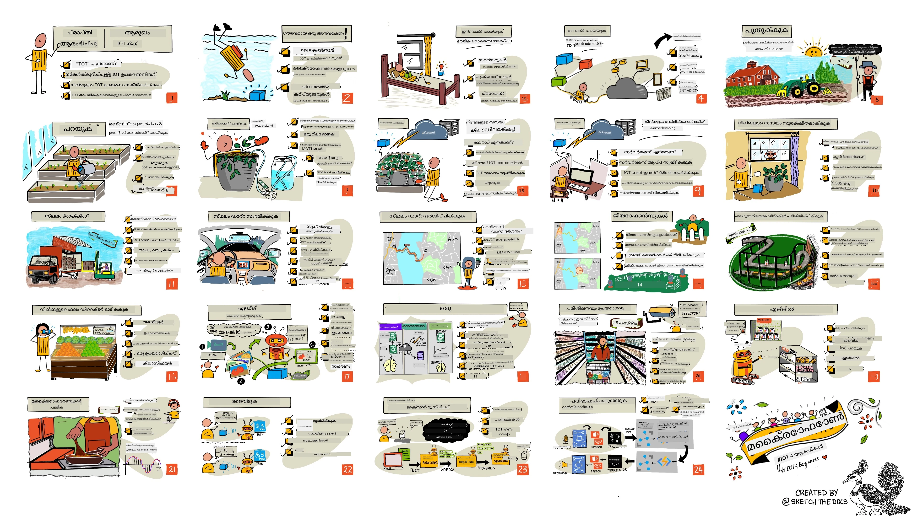

[](https://github.com/microsoft/IoT-For-Beginners/blob/master/LICENSE)
[](https://GitHub.com/microsoft/IoT-For-Beginners/graphs/contributors/)
[](https://GitHub.com/microsoft/IoT-For-Beginners/issues/)
[](https://GitHub.com/microsoft/IoT-For-Beginners/pulls/)
[](http://makeapullrequest.com)

[](https://GitHub.com/microsoft/IoT-For-Beginners/watchers/)
[](https://GitHub.com/microsoft/IoT-For-Beginners/network/)
[](https://GitHub.com/microsoft/IoT-For-Beginners/stargazers/)

### ആزمان് AI Foundry സമൂഹത്തിൽ ചേർക്കൂ

AI ആപ്ലിക്കേഷനുകൾ നിർമ്മിക്കുന്നതിൽ നിങ്ങൾക്ക് സ്‌റ്റക്ക് ആയി പോവുകയോ എന്തെങ്കിലും ചോദ്യങ്ങളുണ്ടെങ്കിൽ. MCP സംബന്ധിച്ച് Fellow learners ആയും പരിചയസമ്പന്നരായ ഡെവലപ്പർമാരും ചേർന്ന് ചർച്ചകൾക്കായി ചേരൂ. ഇത് ചോദ്യങ്ങൾ സ്വാഗതം ചെയ്യപ്പെടുന്നൊരു പിന്തുണയുള്ള സമൂഹമാണ്, അറിവ് സ്വതന്ത്രമായി പങ്കുവെക്കപ്പെടുന്നു.

[](https://discord.gg/nTYy5BXMWG)

ഉൽപ്പന്ന പ്രതികരണങ്ങളോ നിർമ്മാണ സമയത്ത് പിഴവുകളോ ഉണ്ടെങ്കിൽ സന്ദർശിക്കൂ:

[](https://aka.ms/foundry/forum)

ഈ റിസോഴ്‌സുകൾ ഉപയോഗിച്ച് ആരംഭിക്കാൻ താഴെ പറയുന്ന ഘട്ടങ്ങൾ പിന്തുടരുക:
1. **റിപ്പോസിറ്ററി ഫോർക്ക് ചെയ്യുക**: ക്ലിക്ക് ചെയ്യുക [](https://GitHub.com/microsoft/IoT-For-Beginners/fork)
2. **റിപ്പോസിറ്ററി ക്ലോൺ ചെയ്യുക**: `git clone https://github.com/microsoft/IoT-For-Beginners.git`
3. [**Microsoft Foundry Discord-ൽ ചേരൂ, വിദഗ്ധരെയും മറ്റ് ഡെവലപ്പർമാരെയും കണ്ടുമുട്ടൂ**](https://discord.com/invite/ByRwuEEgH4)


### 🌐 മൾട്ടി-ഭാഷാ പിന്തുണ

#### GitHub Action മുഖാന്തിരം പിന്തുണ (സ്വയംപ്രവർത്തനവും എല്ലായ്പ്പോഴും അപ്‌ഡേറ്റായി ഉള്ളതും)

<!-- CO-OP TRANSLATOR LANGUAGES TABLE START -->
[Arabic](../ar/README.md) | [Bengali](../bn/README.md) | [Bulgarian](../bg/README.md) | [Burmese (Myanmar)](../my/README.md) | [Chinese (Simplified)](../zh-CN/README.md) | [Chinese (Traditional, Hong Kong)](../zh-HK/README.md) | [Chinese (Traditional, Macau)](../zh-MO/README.md) | [Chinese (Traditional, Taiwan)](../zh-TW/README.md) | [Croatian](../hr/README.md) | [Czech](../cs/README.md) | [Danish](../da/README.md) | [Dutch](../nl/README.md) | [Estonian](../et/README.md) | [Finnish](../fi/README.md) | [French](../fr/README.md) | [German](../de/README.md) | [Greek](../el/README.md) | [Hebrew](../he/README.md) | [Hindi](../hi/README.md) | [Hungarian](../hu/README.md) | [Indonesian](../id/README.md) | [Italian](../it/README.md) | [Japanese](../ja/README.md) | [Kannada](../kn/README.md) | [Khmer](../km/README.md) | [Korean](../ko/README.md) | [Lithuanian](../lt/README.md) | [Malay](../ms/README.md) | [Malayalam](./README.md) | [Marathi](../mr/README.md) | [Nepali](../ne/README.md) | [Nigerian Pidgin](../pcm/README.md) | [Norwegian](../no/README.md) | [Persian (Farsi)](../fa/README.md) | [Polish](../pl/README.md) | [Portuguese (Brazil)](../pt-BR/README.md) | [Portuguese (Portugal)](../pt-PT/README.md) | [Punjabi (Gurmukhi)](../pa/README.md) | [Romanian](../ro/README.md) | [Russian](../ru/README.md) | [Serbian (Cyrillic)](../sr/README.md) | [Slovak](../sk/README.md) | [Slovenian](../sl/README.md) | [Spanish](../es/README.md) | [Swahili](../sw/README.md) | [Swedish](../sv/README.md) | [Tagalog (Filipino)](../tl/README.md) | [Tamil](../ta/README.md) | [Telugu](../te/README.md) | [Thai](../th/README.md) | [Turkish](../tr/README.md) | [Ukrainian](../uk/README.md) | [Urdu](../ur/README.md) | [Vietnamese](../vi/README.md)

> **സ്ഥലീയമായി ക്ലോൺ ചെയ്യാൻ ആഗ്രഹിക്കാത്തോ?**
>
> ഈ റിപ്പോസിറ്ററിയിൽ 50-ലേറെ ഭാഷാ പരിഭാഷകൾ ഉൾപ്പെടുത്തിയിട്ടുണ്ട്, ഇത് ഡൗൺലോഡ് വലുപ്പം ഗണ്യമായി വർദ്ധിപ്പിക്കുന്നു. പരിഭാഷകൾ ഇല്ലാതെ ക്ലോൺ ചെയ്യാൻ sparse checkout ഉപയോഗിക്കൂ:
>
> **Bash / macOS / Linux:**
> ```bash
> git clone --filter=blob:none --sparse https://github.com/microsoft/IoT-For-Beginners.git
> cd IoT-For-Beginners
> git sparse-checkout set --no-cone '/*' '!translations' '!translated_images'
> ```
>
> **CMD (Windows):**
> ```cmd
> git clone --filter=blob:none --sparse https://github.com/microsoft/IoT-For-Beginners.git
> cd IoT-For-Beginners
> git sparse-checkout set --no-cone "/*" "!translations" "!translated_images"
> ```
>
> ഇത് കോഴ്സ് പൂർത്തിയാക്കാൻ ആവശ്യമായവയെല്ലാം വേഗത്തിൽ ലഭ്യമാണ്.
<!-- CO-OP TRANSLATOR LANGUAGES TABLE END -->

# ആരംഭക്കാർക്കുള്ള IoT - ഒരു കോഴ്സ്

Microsoft-യിലെ Azure ക്ലൗഡ് അഡ്വക്കേറ്റ്സ് ഒരു 12 ആഴ്ച, 24 പാഠങ്ങൾ ഉള്ള IoT അടിസ്ഥാന വിഷയങ്ങളെക്കുറിച്ചുള്ള കോഴ്സ് നൽക്കാൻ സന്തോഷിച്ചിരിക്കുന്നു. ഓരോ പാഠത്തിലും മുൻപും ശേഷമുള്ള ക്വിസുകളും, പാഠം പൂർത്തിയാക്കാനുള്ള എഴുത്തുവിവരണങ്ങളും, പരിഹാരവും, അസൈൻമെന്റുമുണ്ട്. നമ്മുടെ പ്രോജക്റ്റ് അടിസ്ഥാന അധ്യയനരീതിയിലൂടെ നിങ്ങൾ നിർമ്മിക്കാൻ പഠിക്കുന്നു, പുതിയ കഴിവുകൾക്ക് ഉറപ്പായി 'ഇട്ടുപിടിക്കുന്ന' വഴി.

പ്രോജക്റ്റുകൾ ഭക്ഷണത്തിന്റെ ഫാമിൽ നിന്നുള്ള യാത്രയെ ഒരു പരിധിവരയ്ക്കും. ഇതിൽ കർഷണം, ലോജിസ്റ്റിക്‌സ്, നിർമ്മാണം, റീട്ടെയിൽ, ഉപഭോക്താവ് എന്നിവ ഉൾപ്പെടുന്നു - ഇവയൊക്കെ IoT ഉപകരണങ്ങൾക്കുള്ള പ്രധാന വ്യവസായ മേഖലകളാണ്.



> സ്കെച്ച് നോട്ടുകൾ [Nitya Narasimhan](https://github.com/nitya) ഒരുകൈ വാരിയതാണ്. വലിയ പതിപ്പിന്റെ കാഴ്‌ചക്കായി ചിത്രം ക്ലിക്ക് ചെയ്യുക.

**ഞങ്ങളുടെ രചയിതാക്കളായ [Jen Fox](https://github.com/jenfoxbot), [Jen Looper](https://github.com/jlooper), [Jim Bennett](https://github.com/jimbobbennett) എന്നിവർക്ക്, കൂടാതെ സ്കെച്ച് നോട്ടുകൾ സൃഷ്ടിച്ച [Nitya Narasimhan](https://github.com/nitya) യാത്രയ്ക്കും ഹൃദയപൂർവം നന്ദി.**

**[Microsoft Learn Student Ambassadors](https://studentambassadors.microsoft.com?WT.mc_id=academic-17441-jabenn) എന്ന ടീം ഇതു അവലോകനം ചെയ്യുകയും ഭാഷാന്തരം ചെയ്യുകയും ചെയ്തത് - [Aditya Garg](https://github.com/AdityaGarg00), [Anurag Sharma](https://github.com/Anurag-0-1-A), [Arpita Das](https://github.com/Arpiiitaaa), [Aryan Jain](https://www.linkedin.com/in/aryan-jain-47a4a1145/), [Bhavesh Suneja](https://github.com/EliteWarrior315), [Faith Hunja](https://faithhunja.github.io/), [Lateefah Bello](https://www.linkedin.com/in/lateefah-bello/), [Manvi Jha](https://github.com/Severus-Matthew), [Mireille Tan](https://www.linkedin.com/in/mireille-tan-a4834819a/), [Mohammad Iftekher (Iftu) Ebne Jalal](https://github.com/Iftu119), [Mohammad Zulfikar](https://github.com/mohzulfikar), [Priyanshu Srivastav](https://www.linkedin.com/in/priyanshu-srivastav-b067241ba), [Thanmai Gowducheruvu](https://github.com/innovation-platform), and [Zina Kamel](https://www.linkedin.com/in/zina-kamel/).**

ടീമിനെ പരിചയപ്പെടൂ!

[](https://youtu.be/-wippUJRi5k)

**ഗിഫ് -** [Mohit Jaisal](https://linkedin.com/in/mohitjaisal)

> 🎥 ഈ ചിത്രം ക്ലിക്ക് ചെയ്താൽ ഈ പ്രോജക്റ്റിനെ കുറിച്ചുള്ള വീഡിയോ കാണാം!

> **അധ്യാപകർ**, ഈ കോഴ്സ് ഉപയോഗിക്കാനായി ചില നിർദ്ദേശങ്ങൾ [ഈ ലിങ്കിൽ](for-teachers.md) ഉൾപ്പെടുത്തിയിട്ടുണ്ട്. നിങ്ങളുടെ സ്വന്തം പാഠങ്ങൾ സൃഷ്ടിക്കാൻ ആഗ്രഹിക്കുന്നുവെങ്കിൽ, [പാഠം ടെംപ്ലേറ്റ്](lesson-template/README.md) കൂടി ലഭ്യമാണ്.

> **[വിദ്യാർത്ഥികൾ](https://aka.ms/student-page)**, ഈ കോഴ്സ് സ്വതന്ത്രമായി ഉപയോഗിക്കാൻ, മുഴുവൻ റീപോഫോർക്കുക, മുൻപത്തെ ക്വിസുകളും പാഠം വായിക്കുകയും ശേഷമുള്ള പ്രവർത്തനങ്ങൾ പൂർത്തിയാക്കുകയും ചെയ്യുക. പരിഹാര കോഡ് ഓരോ പ്രോജക്റ്റ്-അധിഷ്ഠിത പാഠത്തിലും /solutions ഫോൾഡറുകളിൽ ലഭ്യമാണ്, അതിനെ പകർപ്പിക്കാൻ പകരം പാഠങ്ങൾ മനസ്സിലാക്കി പ്രോജക്റ്റുകൾ സൃഷ്ടിക്കാൻ ശ്രമിക്കുക. മറ്റൊരു ആശയം സുഹൃത്തുക്കളോടൊപ്പം പഠന ഗ്രൂപ്പ് രൂപീകരിച്ച് ഒരുമിച്ച് പഠനം നടത്തുക. കൂടുതൽ പഠനത്തിനു, [Microsoft Learn](https://docs.microsoft.com/users/jimbobbennett/collections/ke2ehd351jopwr?WT.mc_id=academic-17441-jabenn) ശുപാർശ ചെയ്യുന്നു.

ഈ കോഴ്സിന്റെ വീഡിയോ അവലോകനത്തിനായി ഈ വീഡിയോ കാണാം:

[](https://youtube.com/watch?v=bccEMm8gRuc "Promo video")

> 🎥 ഈ ചിത്രം ക്ലിക്ക് ചെയ്താൽ ഈ പ്രോജക്റ്റിനെ കുറിച്ചുള്ള വീഡിയോ കാണാം!

## അധ്യയന രീതി

കോഴ്സ് നിർമ്മിക്കുന്നതിന് രണ്ട് അധ്യയന സിദ്ധാന്തങ്ങൾ തിരഞ്ഞെടുത്തിട്ടുണ്ട്: പ്രോജക്റ്റ് അടിസ്ഥാനമാകുക, കൂടാതെ സ്ഥിരമായി ക്വിസുകൾ ഉൾപ്പെടുത്തുക. ഈ പരമ്പരയുടെ അവസാനം, വിദ്യാർത്ഥികൾ ഒരു സസ്യ നിരീക്ഷണവും ജലവിതരണവും നടത്തുന്ന സംവിധാനം, വാഹന ട്രാക്കർ, ഭക്ഷണ പാചകത്തിനായുള്ള സ്മാർട്ട് ഫാക്ടറി സെറ്റപ്പ്, വോയിസ് നിയന്ത്രിത കുക്കിംഗ് ടൈമർ എന്നിവ നിർമിച്ചിരിക്കണം, കൂടാതെ ഐഒટીയുടെ അടിസ്ഥാനങ്ങളും, ഉപകരണ കോഡ് എഴുതൽ, ക്ലൗഡിലേക്ക് കണക്ട് ചെയ്യൽ, ടെലിമെട്രി വിശകലനം, എഡ്ജിൽ AI പ്രവർത്തനങ്ങൾ എന്നിവയും പഠിച്ചിരിക്കണം.

വിഷയം പ്രോജക്റ്റുകളുമായി സുഖകരമായി ഖണ്ഡിപ്പിച്ച് വിദ്യാർത്ഥികൾക്കു ഭേദഗതി നിലനിർത്താനും ആശയങ്ങൾ സമ്മതിക്കും.

ക്ലാസ് ആരംഭിക്കുന്നതിനു മുന്നിൽ കുറഞ്ഞ പ്രമാദമുള്ള ക്വിസ് വിദ്യാർത്ഥിയുടെ പഠന ഉദ്ദേശ്യം വ്യക്തമാക്കുന്നു, ക്ലാസ് ശേഷം മറ്റൊരു ക്വിസ് അറിവിന്റെ ശേഷിക്കും ഉറപ്പ് നൽകുന്നു. ഈ കോഴ്സ് അവകാശത്തിന്നും രസകരവുമാണ്, മുഴുവനായി അല്ലെങ്കിൽ ഭാഗികമായി നടത്താം. പ്രോജക്റ്റുകൾ ചെറുതായിട്ട് തുടങ്ങി ഒടുവിൽ 12 ആഴ്ച്ച്യുള്ള തുടർ വളർച്ചയും ഉണ്ടാകും.

ഓരോ പ്രോജക്റ്റും വിദ്യാർത്ഥികൾക്കും ഹോബി സിസ്റ്റർമാരും ഉപയോഗിക്കാൻ സാധിയ്ക്കുന്ന യഥാർത്ഥ ഹാർഡ്‌വെയറിൽ അടിസ്ഥാനമാക്കിയുള്ളതാണ്. ഓരോ പ്രോജക്റ്റും പ്രത്യേക പ്രോജക്റ്റ് ഡൊമെയ്‌നോട് ബന്ധപ്പെട്ട് പ്രസക്തമായ പശ്ചാത്തല അറിവ് നൽകുന്നു. വിജയകരമായ ഡെവലപ്പറായി മാറാൻ, നിങ്ങൾ പരിഹരിക്കുന്ന പ്രശ്നങ്ങളെ kuuluയ ഡൊമെയ്ൻ മനസ്സിലാക്കുന്നത് സഹായിക്കുന്നു, ഈ പശ്ചാത്തല അറിവ് വിദ്യാർത്ഥികൾക്ക് തങ്ങളുടെ IoT പരിഹാരങ്ങൾ ചിന്തിച്ച് പഠിക്കാനിടയാക്കുന്നു. വിദ്യാർത്ഥികൾ നിർമ്മിക്കുന്ന പരിഹാരങ്ങളുടെ 'എന്തുകൊണ്ട്' മനസ്സിലാക്കുകയും അവസാനം ഉപയോക്താവിന്റെ മൂല്യവും തിരിച്ചറിയുകയും ചെയ്യുന്നു.

## ഹാർഡ്‌വെയർ
നാം വ്യക്തിഗത താല്പര്യം, പ്രോഗ്രാമിംഗ് ഭാഷാ ജ്ഞാനം അല്ലെങ്കിൽ മുൻഗണനകൾ, പഠന ലക്ഷ്യങ്ങൾ, ലഭ്യത എന്നിവയുടെ അടിസ്ഥാനത്തിൽ പ്രൊജക്ടുകൾക്കായി ഉപയോഗിക്കാവുന്ന രണ്ട് ഐഒടി ഹാർഡ്‌വെയർ ഓപ്ഷനുകൾ ഉണ്ട്. ഹാർഡ്‌വെയർ ആക്‌സസ് ഇല്ലാത്തവർക്കായോ വാങ്ങുന്നതിന് മുൻപ് കൂടുതൽ പഠിക്കാൻ ആഗ്രഹിക്കുന്നവർക്കായോ 'വർച്വൽ ഹാർഡ്‌വെയർ' വേർഷൻ ഞങ്ങൾ നൽകിയിട്ടുണ്ട്. [ഹാർഡ്‌വെയർ പേജ്](./hardware.md)യിൽ നിങ്ങൾക്ക് കൂടുതൽ വായിക്കാനും ഞങ്ങളുടെ സുഹൃത്തുക്കളായ Seeed Studioവിൽ നിന്ന് പൂർണ്ണ കിറ്റുകൾ വാങ്ങാനുള്ള ലിങ്കുകൾ ഉൾപ്പെടെയുള്ള 'ഷോപ്പിങ്ങ് ലിസ്റ്റ്' കണ്ടെത്താനുമാകും.

> 💁 ഞങ്ങളുടെ [Code of Conduct](CODE_OF_CONDUCT.md), [Contributing](CONTRIBUTING.md), மற்றும் [Translations](..) മാർഗ്ഗനിർദ്ദേശങ്ങൾ കണ്ടെത്തുക. നിങ്ങളുടെ രചനാത്മക പ്രതികരണങ്ങൾ സ്വാഗതം ചെയ്യുന്നു!
>
> 🔧 പ്രശ്‌നങ്ങളുണ്ടോ? സാധാരണ പ്രശ്‌നങ്ങൾക്ക് പരിഹാരങ്ങൾക്കായി ഞങ്ങളുടെ [Troubleshooting Guide](TROUBLESHOOTING.md) പരിശോധിക്കുക.

## ഓരോ പാഠവും ഉൾക്കൊള്ളുന്നു:

- സ്കെച്‌നോട്ട്
- ഇച്ഛാനുസൃത കൂടി വീഡിയോ
- പാഠത്തിന് മുൻപ് വാര്മപ് ക്വിസ്
- എഴുത്തുപടിയായ പാഠം
- പ്രൊജക്ട് അടിസ്ഥാന പാഠങ്ങൾക്ക്, പ്രൊജക്ട് നിർമ്മിക്കുന്നതിന് വേണ്ടിയുള്ള സ്റ്റെപ്പ് ബൈ സ്റ്റെപ് ഗൈഡ്
- നോളേജ് ചെക്കുകൾ
- ഒരു വെല്ലുവിളി
- കൂട്ടിച്ചേർക്കേണ്ട വായന
- അസൈന്മെന്റ്
- [പോസ്റ്റ്-പാഠം ക്വിസ്](https://ff-quizzes.netlify.app/en/)

> **ക്വിസുകളെ കുറിച്ച് ഒരു കുറിപ്പ്**: എല്ലാ ക്വിസുകളും quiz-app ഫോളഡറിൽ ഉൾപ്പെടുന്നു, ഓരോ ക്വിസിലും മൂന്ന് ചോദ്യങ്ങൾ ഉണ്ടായ 48 ക്വിസുകളാണ്. ഇവ പാഠങ്ങളിൽ നിന്ന് ലിങ്ക് ചെയ്തിട്ടുണ്ടെങ്കിലും ക്വിസ് ആപ്പ് ലോക്കലായി ഓടിച്ചാലോ Azureൽ ഡിപ്‌ളോയ്ചെയ്യുന്നതായോ കഴിയും; quiz-app ഫോളഡറിലെ നിർദ്ദേശങ്ങൾ പാലിക്കുക. ഇവ ക്രമീകരിച്ച് സ്വദേശീയമാക്കപ്പെടുകയാണ്.

## പാഠങ്ങൾ

|       |              പ്രൊജക്ട് നാമം              |                       പഠിപ്പിക്കുന്ന ആശയങ്ങൾ                       | പഠന ലക്ഷ്യങ്ങൾ                                                                                                                                                 |                                                        ലിങ്കുചെയ്ത പാഠം                                                         |
| :---: | :------------------------------------: | :---------------------------------------------------------: | ------------------------------------------------------------------------------------------------------------------------------------------------------------------- | :--------------------------------------------------------------------------------------------------------------------------: |
|  01   | [Getting started](./1-getting-started/README.md) |                     ഐഒടിയിലെ പരിചയം                     | ഐഒടിയുടെ അടിസ്ഥാന തത്വങ്ങളും സെൻസറുകളും ക്ലൗഡ് സർവീസുകളും പോലുള്ള ഐഒടി ഉത്തരവാദിത്വങ്ങളുടെ അടിസ്ഥാന ഘടകങ്ങളും പഠിച്ച് നിങ്ങളുടെ ആദ്യ ഐഒടി ഉപകരണം സെറ്റ് ചെയ്യുക |                      [Introduction to IoT](./1-getting-started/lessons/1-introduction-to-iot/README.md)                      |
|  02   | [Getting started](./1-getting-started/README.md) |                   ഐഒടിയിൽ കൂടുതൽ ആഴത്തിൽ                   | ഐഒടി സിസ്റ്റത്തിന്റെ ഘടകങ്ങൾ, മൈക്രോക്കൺട്രോളറുകൾ, സിംഗിൾ-ബോർഡ് കമ്പ്യൂട്ടറുകൾ എന്നിവയെ കുറിച്ച് കൂടുതൽ അറിയുക                                                            |                        [A deeper dive into IoT](./1-getting-started/lessons/2-deeper-dive/README.md)                         |
|  03   | [Getting started](./1-getting-started/README.md) | സെൻസറുകളും ആക്റ്റുവേറ്ററുകളും ഉപയോഗിച്ച് ഫിസിക്കൽ ലോകവുമായി ഇടപെടുക | ദത്തസംഹിത ശേഖരിക്കുന്നതിന് സെൻസറുകൾ, ഫീഡ്‌ബാക്ക് നൽകാൻ ആക്റ്റുവേറ്ററുകൾ എന്നിവയെക്കുറിച്ച് പഠിച്ച് നൈറ്റ്‌ലൈറ്റ് നിർമ്മിക്കുക                                           | [Interact with the physical world with sensors and actuators](./1-getting-started/lessons/3-sensors-and-actuators/README.md) |
|  04   | [Getting started](./1-getting-started/README.md) |             നിങ്ങളുടെ ഉപകരണം ഇന്റർനെറ്റുമായി ബന്ധിപ്പിക്കുക             | MQTT ബ്രോക്കറുമായി ബന്ധിപ്പിച്ച് നിങ്ങളുടെ നൈറ്റ്‌ലൈറ്റിന് സന്ദേശങ്ങൾ അയയ്ക്കാനും സ്വീകരിക്കാനുമുള്ള ഐഒടി ഉപകരണം ഇന്റർനെറ്റിൽ എങ്ങനെ ബന്ധിപ്പിക്കാമെന്ന് പഠിക്കുക                               |               [Connect your device to the Internet](./1-getting-started/lessons/4-connect-internet/README.md)                |
|  05   |            [Farm](./2-farm/README.md)            |                    സസ്യവളർച്ച പ്രവചിക്കുക                     | ഐഒടി ഉപകരണത്തിൽ പിടിച്ചെടുത്ത താപനില ഡാറ്റ ഉപയോഗിച്ച് സസ്യവളർച്ച പ്രവചിക്കുന്നത് എങ്ങനെ ചെയ്യാമെന്ന് പഠിക്കുക                                                                                  |                          [Predict plant growth](./2-farm/lessons/1-predict-plant-growth/README.md)                           |
|  06   |            [Farm](./2-farm/README.md)            |                    മണ്ണിലെ ഈർപ്പം കണ്ടെത്തുക                     | മണ്ണിലെ ഈർപ്പം കണ്ടെത്താനും മണ്ണിലെ ഈർപ്പം സെൻസർ കാലിബ്രേറ്റ് ചെയ്യാനുമുള്ള വിദ്യ പഠിക്കുക                                                                                              |                          [Detect soil moisture](./2-farm/lessons/2-detect-soil-moisture/README.md)                           |
|  07   |            [Farm](./2-farm/README.md)            |                  സസ്യങ്ങൾക്ക് ഓട്ടോമേറ്റഡ് ജലസേചനം                   | റീലെയും MQTTയുമുപയോഗിച്ച് ജലസേചനം ഓട്ടോമേറ്റുചെയ്യാനും സമയമിതീകരിക്കാനും പഠിക്കുക                                                                                                      |                      [Automated plant watering](./2-farm/lessons/3-automated-plant-watering/README.md)                       |
|  08   |            [Farm](./2-farm/README.md)            |               നിങ്ങളുടെ സസ്യം ക്ലൗഡിലേക്ക് മാറുക               | ക്ലൗഡും ക്ലൗഡിൽ ഹോസ്റ്റ് ചെയ്ത ഐഒടി സർവീസുകളുമെന്താണെന്ന്, പൊതുയോഗ്യമല്ലാത്ത MQTT ബ്രോക്കറിനുപകരം നിങ്ങളുടെ സസ്യം ഇവയിൽ എങ്ങനെ ബന്ധിപ്പിക്കാമെന്നും പഠിക്കുക                                   |               [Migrate your plant to the cloud](./2-farm/lessons/4-migrate-your-plant-to-the-cloud/README.md)                |
|  09   |            [Farm](./2-farm/README.md)            |         നിങ്ങളുടെ അപ്ലിക്കേഷൻ ലോട്ടിക്ക് ക്ലൗഡിലേക്ക് മാറ്റുക         | ഐഒടി സന്ദേശങ്ങൾക്ക് പ്രതികരിക്കുന്ന അപ്ലിക്കേഷൻ ലോട്ടിക്ക് ക്ലൗഡിൽ എങ്ങനെ എഴുതാമെന്ന് പഠിക്കുക                                                                          |         [Migrate your application logic to the cloud](./2-farm/lessons/5-migrate-application-to-the-cloud/README.md)         |
|  10   |            [Farm](./2-farm/README.md)            |                   നിങ്ങളുടെ സസ്യം സുരക്ഷിതമാക്കുക                    | ഐഒടിയിൽ സുരക്ഷയെക്കുറിച്ച്, കീകളും സർട്ടിഫിക്കറ്റുകളുമുപയോഗിച്ച് നിങ്ങളുടെ സസ്യം എങ്ങനെ സുരക്ഷിതമാക്കാമെന്ന് പഠിക്കുക                                                                          |                        [Keep your plant secure](./2-farm/lessons/6-keep-your-plant-secure/README.md)                         |
|  11   |       [Transport](./3-transport/README.md)       |                      ലൊക്കേഷൻ ട്രാക്കിംഗ്                      | ഐഒടി ഉപകരണങ്ങൾക്ക് GPS ലൊക്കേഷൻ ട്രാക്കിങ്ങിനെക്കുറിച്ച് പഠിക്കുക                                                                                                                   |                           [Location tracking](./3-transport/lessons/1-location-tracking/README.md)                           |
|  12   |       [Transport](./3-transport/README.md)       |                     ലൊക്കേഷൻ ഡാറ്റ സംഭരിക്കുക                     | പിന്നീട് വിശകലനം ചെയ്യാനോ കാഴ്ചവെക്കാനോ ഉള്ള ഐഒടി ഡാറ്റ എങ്ങിനെ സംഭരിക്കാമെന്നു പഠിക്കുക                                                                                                      |                         [Store location data](./3-transport/lessons/2-store-location-data/README.md)                         |
|  13   |       [Transport](./3-transport/README.md)       |                   ലൊക്കേഷൻ ഡാറ്റ കാഴ്ചവെക്കുക                   | ഒരു മാപ്പിൽ ലൊക്കേഷൻ ഡാറ്റ കാണിക്കുന്നതിനെക്കുറിച്ച്, മാപ്പുകൾ 3D ലോകത്തെ 2D ൽ പ്രതിനിധാനം ചെയ്യുന്നതിനെക്കുറിച്ച് പഠിക്കുക                                                            |                     [Visualize location data](./3-transport/lessons/3-visualize-location-data/README.md)                     |
|  14   |       [Transport](./3-transport/README.md)       |                          ജിയോഫെൻസുകൾ                          | ജിയോഫെൻസുകൾ, സപ്ലൈ ചെയിനിലെ വാഹനങ്ങൾ അവരുടെ ലക്ഷ്യസ്ഥാനത്തോട് അടുക്കുമ്പോൾ എങ്ങനെ അറിയിപ്പ് നൽകാനുള്ളതിനായി ഇവ എങ്ങനെ ഉപയോഗിക്കാമെന്നു പഠിക്കുക                                           |                                   [Geofences](./3-transport/lessons/4-geofences/README.md)                                   |
|  15   |   [Manufacturing](./4-manufacturing/README.md)   |               ഫലങ്ങളുടെ ഗുണനിലവാരം കണ്ടുപിടിക്കുന്നതിൽ പരിശീലനം                | ക്ലൗഡിൽ ഇമേജ് ക്ലാസിഫയർ ട്രെയിൻ ചെയ്ത് ഫലങ്ങളുടെ ഗുണനിലവാരം കണ്ടെത്തുന്നത് എങ്ങനെയെന്ന് പഠിക്കുക                                                                                       |                 [Train a fruit quality detector](./4-manufacturing/lessons/1-train-fruit-detector/README.md)                 |
|  16   |   [Manufacturing](./4-manufacturing/README.md)   |           ഐഒടി ഉപകരണം ഉപയോഗിച്ച് ഫലങ്ങളുടെ ഗുണനിലവാരം പരിശോധിക്കുക            | നിങ്ങളുടെ ഫലങ്ങളുടെ ഗുണനിലവാരം കണ്ടെത്തുന്ന സെൻസർ ഐഒടി ഉപകരണത്തിൽ എങ്ങനെ ഉപയോഗിക്കാമെന്ന് പഠിക്കുക                                                                                                    |           [Check fruit quality from an IoT device](./4-manufacturing/lessons/2-check-fruit-from-device/README.md)            |
|  17   |   [Manufacturing](./4-manufacturing/README.md)   |             എഡ്ജിൽ നിങ്ങളുടെ ഫലം കണ്ടുപിടിക്കുന്നതും ഓടിക്കുക             | എഡ്ജ് ഐഒടി ഉപകരണത്തിൽ നിങ്ങളുടെ ഫലം കണ്ടെത്തുന്ന പ്രക്രിയ എങ്ങനെയാണെന്ന് പഠിക്കുക                                                                                                |             [Run your fruit detector on the edge](./4-manufacturing/lessons/3-run-fruit-detector-edge/README.md)             |
|  18   |   [Manufacturing](./4-manufacturing/README.md)   |        സെൻസറിൽ നിന്നു ഫലങ്ങളുടെ ഗുണനിലവാരം കണ്ടെത്താൻ ട്രിഗർ ചെയ്യുക        | സെൻസറിൽ നിന്നുള്ള ഫലങ്ങളുടെ ഗുണനിലവാരം കണ്ടെത്തൽ എങ്ങനെയാണ് ട്രിഗർ ചെയ്യപ്പെടുക എന്നതിനെക്കുറിച്ച് പഠിക്കുക                                                                                                        |        [Trigger fruit quality detection from a sensor](./4-manufacturing/lessons/4-trigger-fruit-detector/README.md)         |
|  19   |          [Retail](./5-retail/README.md)          |                   സ്റ്റോക്ക് ഡിറ്റക്ടർ ട്രെയിൻ ചെയ്യുക                    | ഒരു ഷോപ്പിലെ സ്റ്റോക്ക് എണ്ണാൻ ഒബ്ജക്റ്റ് ഡിറ്റെക്ഷൻ എങ്ങനെ ഉപയോഗിക്കാമെന്ന് പഠിക്കുക                                                                                |                        [Train a stock detector](./5-retail/lessons/1-train-stock-detector/README.md)                         |
|  20   |          [Retail](./5-retail/README.md)          |               ഐഒടി ഉപകരണത്തിൽ നിന്നുള്ള സ്റ്റോക്ക് പരിശോധിക്കുക                | ഒബ്ജക്റ്റ് ഡിറ്റക്ഷൻ മോഡൽ ഉപയോഗിച്ച് ഐഒടി ഉപകരണത്തിലൂടെ സ്റ്റോക്ക് എങ്ങനെ പരിശോധിക്കാമെന്ന് പഠിക്കുക                                                                                         |                     [Check stock from an IoT device](./5-retail/lessons/2-check-stock-device/README.md)                      |
|  21   |        [Consumer](./6-consumer/README.md)        |             ഐഒടി ഉപകരണത്തോട് സംസാരമാറ്റം തിരിച്ചറിഞ്ഞുക             | ഐഒടി ഉപകരണത്തിന് സംസാരമാറ്റം തിരിച്ചറിയാൻ പഠിച്ച് സമർത്ഥമായ ടൈമർ നിർമ്മിക്കുക                                                                                             |                  [Recognize speech with an IoT device](./6-consumer/lessons/1-speech-recognition/README.md)                  |
|  22   |        [Consumer](./6-consumer/README.md)        |                     ഭാഷ മനസിലാക്കുക                     | ഐഒടി ഉപകരണത്തോട് പറയുന്ന വാചകങ്ങൾ എങ്ങനെ മനസിലാക്കാമെന്നു പഠിക്കുക                                                                                                           |                        [Understand language](./6-consumer/lessons/2-language-understanding/README.md)                        |
|  23   |        [Consumer](./6-consumer/README.md)        |           ഒരു ടൈമർ സജ്ജീകരിക്കുകയും സംസാര ഫീഡ്ബാക്ക് നൽകുകയും ചെയ്യുക           | ഐഒടി ഉപകരണത്തിൽ ടൈമർ എങ്ങനെ സജ്ജീകരിക്കാമെന്നും ടൈമർ തുടങ്ങുമ്പോഴും ചുരുക്കുമ്പോഴും സംസാരമായി ഫീഡ്ബാക്ക് എങ്ങനെ നൽകാമെന്നും പഠിക്കുക                                                    |                 [Set a timer and provide spoken feedback](./6-consumer/lessons/3-spoken-feedback/README.md)                  |
|  24   |        [Consumer](./6-consumer/README.md)        |                 പല ഭാഷകൾക്കും പിന്തുണ നൽകുക                  | സംസാരിക്കപ്പെടുകയും, നിങ്ങളുടെ സ്മാർട്ട് ടൈമറിൽ നിന്നുള്ള പ്രതികരണവും ഉൾക്കൊള്ളുന്നതായി എങ്ങനെ പല ഭാഷകളും പിന്തുണയ്ക്കാമെന്ന് പഠിക്കുക                                                               |                   [Support multiple languages](./6-consumer/lessons/4-multiple-language-support/README.md)                   |

## ഒഫ്ലൈൻ ആക്‌സസ്

നിങ്ങൾക്ക് [Docsify](https://docsify.js.org/#/) ഉപയോഗിച്ച് ഈ രേഖാമൂലം ഒഫ്ലൈനായി ഓടിക്കാം. ഈ റീപോ ഫോർക്ക് ചെയ്യുക, നിങ്ങളുടെ ലോക്കൽ മെഷീനിൽ [Docsify ഇൻസ്റ്റാൾ ചെയ്യുക](https://docsify.js.org/#/quickstart), ശേഷം ഈ റീപോയുടെ റൂട്ട് ഫോൾഡറിൽ, `docsify serve` എന്ന് ടൈപ്പ് ചെയ്യുക. വെബ്സൈറ്റ് പോർട്ട് 3000ൽ നിങ്ങളുടെ ലൊക്കൽഹോസ്റ്റ്-ൽ സേർവ് ചെയ്യും: `localhost:3000`.

## ക്വിസ്

ഓരോ അധ്യായത്തിന്റെയും നിങ്ങളുടെ ജ്ഞാനം പരീക്ഷിക്കുന്ന ഇന്ററാക്ടീവ് ക്വിസ് സമുദായത്തിന് നന്ദി. നിങ്ങളുടെ ജ്ഞാനം [ഇവിടെ](https://ff-quizzes.netlify.app/en/) പരീക്ഷിക്കുക.

### PDF

ഒഫ്ലൈൻ ആക്‌സസിനായി ഈ ഉള്ളടക്കത്തിന്റെ PDF സൃഷ്ടിക്കാം. അതിനായി, നിങ്ങൾക്കു [npm ഇൻസ്റ്റാൾ ചെയ്തിട്ടുണ്ടെന്ന്](https://docs.npmjs.com/downloading-and-installing-node-js-and-npm) ഉറപ്പാക്കുക, പിന്നെ ഈ റീപോയുടെ റൂട്ട് ഫോൾഡറിൽ താഴെ കൊടുത്തിരിക്കുന്ന കമാന്റുകൾ ഓടിക്കുക:

```sh
npm i
npm run convert
```

### സ്ലൈഡുകൾ

ചില പാഠങ്ങൾക്ക് [slides](../../slides) ഫോൾഡറിൽ സ്ലൈഡ് ഡെക്കുകൾ ഉണ്ട്.


## മറ്റു പാഠ്യപദ്ധതികൾ

ഞങ്ങളുടെ ടീം മറ്റു പാഠ്യപദ്ധതികളും ഒരുക്കുന്നു! പരിശോധിക്കുക:

<!-- CO-OP TRANSLATOR OTHER COURSES START -->
### LangChain
[](https://aka.ms/langchain4j-for-beginners)
[](https://aka.ms/langchainjs-for-beginners?WT.mc_id=m365-94501-dwahlin)
[](https://github.com/microsoft/langchain-for-beginners?WT.mc_id=m365-94501-dwahlin)
---

### Azure / Edge / MCP / Agents
[](https://github.com/microsoft/AZD-for-beginners?WT.mc_id=academic-105485-koreyst)
[](https://github.com/microsoft/edgeai-for-beginners?WT.mc_id=academic-105485-koreyst)
[](https://github.com/microsoft/mcp-for-beginners?WT.mc_id=academic-105485-koreyst)
[](https://github.com/microsoft/ai-agents-for-beginners?WT.mc_id=academic-105485-koreyst)

---
 
### ജനറേറ്റീവ് എഐ സീരീസ്
[](https://github.com/microsoft/generative-ai-for-beginners?WT.mc_id=academic-105485-koreyst)
[-9333EA?style=for-the-badge&labelColor=E5E7EB&color=9333EA)](https://github.com/microsoft/Generative-AI-for-beginners-dotnet?WT.mc_id=academic-105485-koreyst)
[-C084FC?style=for-the-badge&labelColor=E5E7EB&color=C084FC)](https://github.com/microsoft/generative-ai-for-beginners-java?WT.mc_id=academic-105485-koreyst)
[-E879F9?style=for-the-badge&labelColor=E5E7EB&color=E879F9)](https://github.com/microsoft/generative-ai-with-javascript?WT.mc_id=academic-105485-koreyst)

---
 
### പ്രാഥമിക പഠനം
[](https://aka.ms/ml-beginners?WT.mc_id=academic-105485-koreyst)
[](https://aka.ms/datascience-beginners?WT.mc_id=academic-105485-koreyst)
[](https://aka.ms/ai-beginners?WT.mc_id=academic-105485-koreyst)
[](https://github.com/microsoft/Security-101?WT.mc_id=academic-96948-sayoung)
[](https://aka.ms/webdev-beginners?WT.mc_id=academic-105485-koreyst)
[](https://aka.ms/iot-beginners?WT.mc_id=academic-105485-koreyst)
[](https://github.com/microsoft/xr-development-for-beginners?WT.mc_id=academic-105485-koreyst)

---
 
### കോപൈലറ്റ് സീരീസ്
[](https://aka.ms/GitHubCopilotAI?WT.mc_id=academic-105485-koreyst)
[](https://github.com/microsoft/mastering-github-copilot-for-dotnet-csharp-developers?WT.mc_id=academic-105485-koreyst)
[](https://github.com/microsoft/CopilotAdventures?WT.mc_id=academic-105485-koreyst)
<!-- CO-OP TRANSLATOR OTHER COURSES END -->

## ചിത്രം ഏത്രിബ്യൂഷനുകൾ

ഈ പാഠ്യപദ്ധതിയിൽ ഉപയോഗിച്ചിരിക്കുന്ന ചിത്രങ്ങൾക്ക് വേണ്ട ഏത്രിബ്യൂഷനുകൾ നിങ്ങൾക്ക് [Attributions](./attributions.md) എന്നിൽ ലഭ്യമാണ്.

---

<!-- CO-OP TRANSLATOR DISCLAIMER START -->
**പ്രതിഫലം**:  
ഈ രേഖ [Co-op Translator](https://github.com/Azure/co-op-translator) എന്ന AI തർജ്ജുമ സേവനം ഉപയോഗിച്ച് തർജ്ജമ ചെയ്തതാണ്. ഞങ്ങൾ കൃത്യതയ്ക്കായി ശ്രമിക്കുന്നതിനാൽ, ഓട്ടോമാറ്റിക് തർജ്ജുമകളിൽ പിശകുകൾ അല്ലെങ്കിൽ തെറ്റായ വിവരങ്ങൾ ഉണ്ടാകാമെന്ന് ദയവായി മനസ്സിലാക്കുക. സ്വദേശം ഭാഷയിലുള്ള യഥാർത്ഥ രേഖയെ പ്രാമാണികവുമായ സ്രോതസ്സായി പരിഗണിക്കണം. നിർണായക വിവരങ്ങൾക്കായി, പ്രൊഫഷണൽ മനുഷ്യ തർജ്ജുമ നിർദ്ദേശിക്കുന്നു. ഈ തർജ്ജുമ ഉപയോഗിച്ച് ഉണ്ടാകുന്ന ഏതെങ്കിലും തെറ്റിദ്ധാരണകൾക്കോ തെറ്റായ വ്യാഖ്യാനങ്ങൾക്കോ ഞങ്ങൾ ഉത്തരവാദികൾ അല്ല.
<!-- CO-OP TRANSLATOR DISCLAIMER END -->