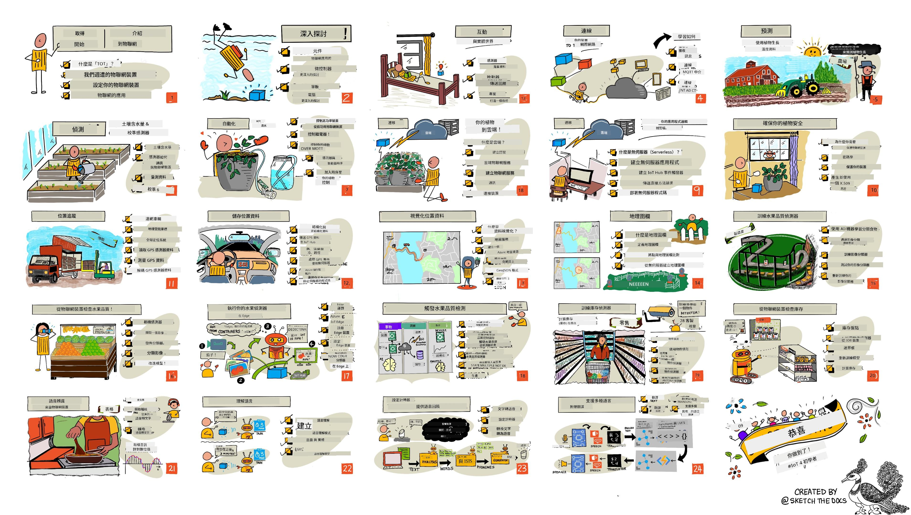

<!--
CO_OP_TRANSLATOR_METADATA:
{
  "original_hash": "6c354ec3487e4f6cfafbe44557996cd9",
  "translation_date": "2026-01-05T17:25:13+00:00",
  "source_file": "README.md",
  "language_code": "mo"
}
-->
[](https://github.com/microsoft/IoT-For-Beginners/blob/master/LICENSE)
[](https://GitHub.com/microsoft/IoT-For-Beginners/graphs/contributors/)
[](https://GitHub.com/microsoft/IoT-For-Beginners/issues/)
[](https://GitHub.com/microsoft/IoT-For-Beginners/pulls/)
[](http://makeapullrequest.com)

[](https://GitHub.com/microsoft/IoT-For-Beginners/watchers/)
[](https://GitHub.com/microsoft/IoT-For-Beginners/network/)
[](https://GitHub.com/microsoft/IoT-For-Beginners/stargazers/)

### 加入 Azure AI Foundry 社群

如果你遇到困難或對建構 AI 應用程式有任何疑問。加入其他學習者和有經驗的開發者，一同討論 MCP。這是一個支持性的社區，歡迎發問並自由分享知識。

[](https://discord.gg/nTYy5BXMWG)

如果你在建置時有產品反饋或錯誤，請造訪：

[](https://aka.ms/foundry/forum)

按照以下步驟開始使用這些資源：
1. **分支此程式庫**：點擊 [](https://GitHub.com/microsoft/IoT-For-Beginners/fork)
2. **克隆此程式庫**：   `git clone https://github.com/microsoft/IoT-For-Beginners.git`
3. [**加入 Microsoft Foundry Discord，與專家及其他開發者交流**](https://discord.com/invite/ByRwuEEgH4)


### 🌐 多語言支援

#### 透過 GitHub Action 支援（自動且持續更新）

<!-- CO-OP TRANSLATOR LANGUAGES TABLE START -->
[阿拉伯語](../ar/README.md) | [孟加拉語](../bn/README.md) | [保加利亞語](../bg/README.md) | [緬甸語 (Myanmar)](../my/README.md) | [中文 (簡體)](../zh/README.md) | [中文 (繁體, 香港)](../hk/README.md) | [中文 (繁體, 澳門)](./README.md) | [中文 (繁體, 台灣)](../tw/README.md) | [克羅地亞語](../hr/README.md) | [捷克語](../cs/README.md) | [丹麥語](../da/README.md) | [荷蘭語](../nl/README.md) | [愛沙尼亞語](../et/README.md) | [芬蘭語](../fi/README.md) | [法語](../fr/README.md) | [德語](../de/README.md) | [希臘語](../el/README.md) | [希伯來語](../he/README.md) | [印地語](../hi/README.md) | [匈牙利語](../hu/README.md) | [印尼語](../id/README.md) | [義大利語](../it/README.md) | [日語](../ja/README.md) | [坎納達語](../kn/README.md) | [韓語](../ko/README.md) | [立陶宛語](../lt/README.md) | [馬來語](../ms/README.md) | [馬拉雅拉姆語](../ml/README.md) | [馬拉地語](../mr/README.md) | [尼泊爾語](../ne/README.md) | [奈及利亞皮欽語](../pcm/README.md) | [挪威語](../no/README.md) | [波斯語 (法爾西語)](../fa/README.md) | [波蘭語](../pl/README.md) | [葡萄牙語 (巴西)](../br/README.md) | [葡萄牙語 (葡萄牙)](../pt/README.md) | [旁遮普語 (Gurmukhi)](../pa/README.md) | [羅馬尼亞語](../ro/README.md) | [俄語](../ru/README.md) | [塞爾維亞語 (西里爾字母)](../sr/README.md) | [斯洛伐克語](../sk/README.md) | [斯洛維尼亞語](../sl/README.md) | [西班牙語](../es/README.md) | [斯瓦希里語](../sw/README.md) | [瑞典語](../sv/README.md) | [塔加洛語 (菲律賓語)](../tl/README.md) | [泰米爾語](../ta/README.md) | [泰盧固語](../te/README.md) | [泰語](../th/README.md) | [土耳其語](../tr/README.md) | [烏克蘭語](../uk/README.md) | [烏爾都語](../ur/README.md) | [越南語](../vi/README.md)

> **想要本地克隆？**

> 此程式庫包含超過 50 種語言翻譯，會顯著增加下載大小。若不需要翻譯，請使用稀疏檢出：
> ```bash
> git clone --filter=blob:none --sparse https://github.com/microsoft/IoT-For-Beginners.git
> cd IoT-For-Beginners
> git sparse-checkout set --no-cone '/*' '!translations' '!translated_images'
> ```
> 這樣可以更快速下載所需內容完成課程。
<!-- CO-OP TRANSLATOR LANGUAGES TABLE END -->

# IoT 初學者課程大綱

微軟 Azure 雲端推廣大使很高興提供一個為期 12 週、共 24 課的 IoT 基礎課程。每節課包含課前與課後測驗、完成課程的書面教學、解答、作業等。我們基於專案的教學法允許你在建構過程中學習，是一種驗證過的技能鞏固方法。

這些專案涵蓋食物從農場到餐桌的旅程。包括農業、物流、製造、零售與消費端——這些是 IoT 裝置廣泛應用的行業領域。



> 草圖筆記由 [Nitya Narasimhan](https://github.com/nitya) 製作。點擊圖片查看大圖。

**誠摯感謝作者 [Jen Fox](https://github.com/jenfoxbot)、[Jen Looper](https://github.com/jlooper)、[Jim Bennett](https://github.com/jimbobbennett) 以及草圖筆記藝術家 [Nitya Narasimhan](https://github.com/nitya)。**

**同時也感謝 [Microsoft Learn 學生大使](https://studentambassadors.microsoft.com?WT.mc_id=academic-17441-jabenn) 團隊成員的審閱與翻譯：包括 [Aditya Garg](https://github.com/AdityaGarg00)、[Anurag Sharma](https://github.com/Anurag-0-1-A)、[Arpita Das](https://github.com/Arpiiitaaa)、[Aryan Jain](https://www.linkedin.com/in/aryan-jain-47a4a1145/)、[Bhavesh Suneja](https://github.com/EliteWarrior315)、[Faith Hunja](https://faithhunja.github.io/)、[Lateefah Bello](https://www.linkedin.com/in/lateefah-bello/)、[Manvi Jha](https://github.com/Severus-Matthew)、[Mireille Tan](https://www.linkedin.com/in/mireille-tan-a4834819a/)、[Mohammad Iftekher (Iftu) Ebne Jalal](https://github.com/Iftu119)、[Mohammad Zulfikar](https://github.com/mohzulfikar)、[Priyanshu Srivastav](https://www.linkedin.com/in/priyanshu-srivastav-b067241ba)、[Thanmai Gowducheruvu](https://github.com/innovation-platform) 以及 [Zina Kamel](https://www.linkedin.com/in/zina-kamel/)。**

認識團隊吧！

[](https://youtu.be/-wippUJRi5k)

**Gif 由** [Mohit Jaisal](https://linkedin.com/in/mohitjaisal) 製作

> 🎥 點擊上方圖片觀看專案介紹影片！

> **教師們**，我們提供了[一些建議](for-teachers.md)關於如何使用這個課程大綱。如果你想創建自己的課程，也包含了一個[課程範本](lesson-template/README.md)。

> **[學生](https://aka.ms/student-page)**，若想自行使用此課程，請將整個儲存庫分支，並自行完成練習。從課前測驗開始，閱覽課文並完成其餘作業。嘗試理解課程來完成專案，而非直接複製解答代碼；不過解答代碼可在各專案課程的 /solutions 目錄下找到。另一個好方法是與朋友組成讀書會，共同研讀內容。進一步學習，推薦參考 [Microsoft Learn](https://docs.microsoft.com/users/jimbobbennett/collections/ke2ehd351jopwr?WT.mc_id=academic-17441-jabenn)。

課程影片總覽：

[](https://youtube.com/watch?v=bccEMm8gRuc "Promo video")

> 🎥 點擊上方圖片觀看專案介紹影片！

## 教學法

本課程秉持兩項教學原則：確保課程以專案為基礎，以及包含頻繁的小測驗。完成此系列課程後，學生將打造一個植物監控與澆水系統、車輛追蹤器、智慧工廠用於追蹤檢驗食物的系統，以及語音控制的烹飪計時器，並學習物聯網基礎知識，包括如何撰寫裝置程式碼、連接雲端、分析遙測數據及在邊緣執行 AI。

透過專案對應內容，使過程更具吸引力並提升概念保留效果。

此外，課前測驗可設定學生學習目標，課後測驗則鞏固學習成效。此課程設計彈性且有趣，可整套或分段學習。專案由簡入繁，於 12 星期後逐步提升複雜度。

每個專案均基於學生及業餘愛好者可取得的真實硬體。每個專案都探討特定領域，提供相關背景知識。身為成功的開發者，了解問題域有助問題解決。這些背景知識讓學生能在實際物聯網問題情境中思考解決方案和學習內容，理解他們建立的解決方案的「為何」，並理解最終使用者。

## 硬體

我們提供兩種 IoT 硬體可供專案使用，依個人喜好、程式語言知識、學習目標與可用性選擇。同時也提供「虛擬硬體」版本，供未持有硬體或想先深入了解再購買的學習者。你可以在[硬體頁面](./hardware.md) 詳讀更多內容，該頁包含購買完整套件的購物清單與 Seeed Studio 友商連結。
> 💁 查閱我哋嘅 [行為守則](CODE_OF_CONDUCT.md)、[貢獻指南](CONTRIBUTING.md) 同 [翻譯指南](TRANSLATIONS.md)。我哋歡迎您嘅建設性意見！
>
> 🔧 有問題？睇睇我哋嘅 [疑難排解指南](TROUBLESHOOTING.md) 搵解決方法。

## 每課包括：

- 手繪筆記
- 選擇性補充影片
- 課前熱身測驗
- 書面課程
- 就專案基礎嘅課程，有逐步指引教你點建立專案
- 知識檢查
- 挑戰
- 補充閱讀
- 作業
- [課後測驗](https://ff-quizzes.netlify.app/en/)

> **有關測驗嘅提示**：所有測驗都喺 quiz-app 資料夾內，共有 48 個測驗，每個有三條問題。測驗喺課程中有連結，但測驗應用可以喺本機運行或者部署到 Azure；跟住 quiz-app 資料夾入面嘅指示進行。佢哋會逐步本地化。

## 課程

|       |              專案名稱              |                       授課概念                       | 學習目標                                                                                                                                                               |                                                        相關課程                                                         |
| :---: | :------------------------------------: | :---------------------------------------------------------: | --------------------------------------------------------------------------------------------------------------------------------------------------------------------- | :--------------------------------------------------------------------------------------------------------------------------: |
|  01   | [入門](./1-getting-started/README.md) |                     物聯網簡介                     | 學習物聯網嘅基本原則同物聯網解決方案嘅基本組件，例如感應器同雲端服務，同時設置你嘅第一個物聯網裝置                                                                                                     |                      [物聯網簡介](./1-getting-started/lessons/1-introduction-to-iot/README.md)                      |
|  02   | [入門](./1-getting-started/README.md) |                   深入認識物聯網                   | 進一步了解物聯網系統嘅元件，仲有微控制器同單板電腦                                                                                                                 |                        [深入認識物聯網](./1-getting-started/lessons/2-deeper-dive/README.md)                         |
|  03   | [入門](./1-getting-started/README.md) | 用感應器同埋執行器同物理世界互動 | 學習點用感應器收集物理世界嘅數據，執行器如何傳送回饋，仲可以建立一盞夜燈                                                                                           | [用感應器同執行器同物理世界互動](./1-getting-started/lessons/3-sensors-and-actuators/README.md) |
|  04   | [入門](./1-getting-started/README.md) |             將裝置連接到網絡             | 學習點樣將物聯網裝置連接到互聯網，發送同接收訊息，連接你嘅夜燈到 MQTT 代理                                                               |               [將裝置連接到網絡](./1-getting-started/lessons/4-connect-internet/README.md)                |
|  05   |            [農場](./2-farm/README.md)            |                    預測植物生長                     | 學習點用物聯網裝置捕捉嘅溫度數據來預測植物生長                                                                                                              |                          [預測植物生長](./2-farm/lessons/1-predict-plant-growth/README.md)                           |
|  06   |            [農場](./2-farm/README.md)            |                    偵測土壤濕度                     | 學習點偵測土壤濕度同標定土壤濕度感應器                                                                                                                      |                          [偵測土壤濕度](./2-farm/lessons/2-detect-soil-moisture/README.md)                           |
|  07   |            [農場](./2-farm/README.md)            |                  自動灌溉                   | 學習點用繼電器同 MQTT 自動化同定時澆水                                                                                                                      |                      [自動灌溉](./2-farm/lessons/3-automated-plant-watering/README.md)                       |
|  08   |            [農場](./2-farm/README.md)            |               將植物遷移到雲端               | 了解雲端及其物聯網服務，學習如何將植物連接到雲端，而唔係連接公眾 MQTT 代理                                                      |               [將植物遷移到雲端](./2-farm/lessons/4-migrate-your-plant-to-the-cloud/README.md)                |
|  09   |            [農場](./2-farm/README.md)            |         將應用邏輯遷移到雲端         | 學習點寫雲端嘅應用邏輯，回應物聯網嘅訊息                                                                                                                |         [將應用邏輯遷移到雲端](./2-farm/lessons/5-migrate-application-to-the-cloud/README.md)         |
|  10   |            [農場](./2-farm/README.md)            |                   保護你嘅植物安全                    | 學習物聯網安全，點用密鑰同證書保障你嘅植物                                                                                                                |                        [保護你嘅植物安全](./2-farm/lessons/6-keep-your-plant-secure/README.md)                         |
|  11   |       [運輸](./3-transport/README.md)       |                      定位追蹤                      | 學習物聯網裝置嘅 GPS 定位追蹤                                                                                                                         |                           [定位追蹤](./3-transport/lessons/1-location-tracking/README.md)                           |
|  12   |       [運輸](./3-transport/README.md)       |                     儲存位置數據                     | 學習點儲存物聯網數據，方便之後視覺化或分析                                                                                                          |                         [儲存位置數據](./3-transport/lessons/2-store-location-data/README.md)                         |
|  13   |       [運輸](./3-transport/README.md)       |                   視覺化位置數據                   | 學習點將位置數據喺地圖上視覺化，仲理解地圖點樣將三維真實世界喺二維上呈現                                            |                     [視覺化位置數據](./3-transport/lessons/3-visualize-location-data/README.md)                     |
|  14   |       [運輸](./3-transport/README.md)       |                          地理圍欄                          | 了解地理圍欄，點用嚟喺運輸鏈中車輛接近目的地時發出警報                                                         |                                   [地理圍欄](./3-transport/lessons/4-geofences/README.md)                                   |
|  15   |   [製造](./4-manufacturing/README.md)   |               訓練水果品質檢測器                | 學習喺雲端訓練圖像分類器嚟檢測水果品質                                                                                                               |                 [訓練水果品質檢測器](./4-manufacturing/lessons/1-train-fruit-detector/README.md)                 |
|  16   |   [製造](./4-manufacturing/README.md)   |           用物聯網裝置檢查水果品質            | 學習點用物聯網裝置配合你嘅水果品質檢測器                                                                                                           |           [用物聯網裝置檢查水果品質](./4-manufacturing/lessons/2-check-fruit-from-device/README.md)            |
|  17   |   [製造](./4-manufacturing/README.md)   |             喺邊緣運行水果檢測器             | 學習點喺邊緣設備上運行水果檢測器                                                                                                               |             [喺邊緣運行水果檢測器](./4-manufacturing/lessons/3-run-fruit-detector-edge/README.md)             |
|  18   |   [製造](./4-manufacturing/README.md)   |        用感應器觸發水果品質檢測        | 學習點用感應器觸發水果品質檢測                                                                                                                   |        [用感應器觸發水果品質檢測](./4-manufacturing/lessons/4-trigger-fruit-detector/README.md)         |
|  19   |          [零售](./5-retail/README.md)          |                   訓練庫存檢測器                    | 學習如何用物件檢測訓練庫存檢測器，計算店舖內嘅庫存                                                                                              |                        [訓練庫存檢測器](./5-retail/lessons/1-train-stock-detector/README.md)                         |
|  20   |          [零售](./5-retail/README.md)          |               用物聯網裝置檢查庫存                | 學習用物聯網裝置利用物件檢測模型檢查庫存                                                                                                     |                     [用物聯網裝置檢查庫存](./5-retail/lessons/2-check-stock-device/README.md)                      |
|  21   |        [消費者](./6-consumer/README.md)        |             用物聯網裝置識別語音             | 學習點用物聯網裝置識別語音，建立智能定時器                                                                                                 |                  [用物聯網裝置識別語音](./6-consumer/lessons/1-speech-recognition/README.md)                  |
|  22   |        [消費者](./6-consumer/README.md)        |                     理解語言                     | 學習了解說畀物聯網裝置嘅句子                                                                                                           |                        [理解語言](./6-consumer/lessons/2-language-understanding/README.md)                        |
|  23   |        [消費者](./6-consumer/README.md)        |           設定定時器並提供語音回應           | 學習點喺物聯網裝置設定定時器，同用語音回應提示定時器已設置及完成                                                                |                 [設定定時器並提供語音回應](./6-consumer/lessons/3-spoken-feedback/README.md)                  |
|  24   |        [消費者](./6-consumer/README.md)        |                 支援多語言                  | 學習點支援多種語言，包括講話同智能定時器嘅回應                                                                                               |                   [支援多語言](./6-consumer/lessons/4-multiple-language-support/README.md)                   |

## 離線使用

你可以用 [Docsify](https://docsify.js.org/#/) 喺離線狀態下運行呢份文件。Fork 呢個 repo，喺你嘅本機安裝 Docsify（[Docsify 快速開始指南](https://docsify.js.org/#/quickstart)），然後喺呢個 repo 根目錄輸入 `docsify serve`。網站會喺本地嘅 3000 埠運行：`localhost:3000`。

## 測驗

多謝社群為每章節提供嘅互動式測驗，檢驗你嘅知識。你可以喺 [呢度](https://ff-quizzes.netlify.app/en/) 測試你嘅知識。

### PDF

如果需要，你可以將內容生產成 PDF 以離線查看。確保你已經安裝咗 [npm](https://docs.npmjs.com/downloading-and-installing-node-js-and-npm)，然後喺呢個 repo 根目錄執行以下指令：

```sh
npm i
npm run convert
```


### 簡報

部分課程有簡報，可喺 [slides](../../slides) 資料夾睇到。

## 其他課程

我哋團隊仲有其他課程！快啲睇睇：

<!-- CO-OP TRANSLATOR OTHER COURSES START -->
### LangChain
[](https://aka.ms/langchain4j-for-beginners)
[](https://aka.ms/langchainjs-for-beginners?WT.mc_id=m365-94501-dwahlin)

---

### Azure / Edge / MCP / Agents
[](https://github.com/microsoft/AZD-for-beginners?WT.mc_id=academic-105485-koreyst)
[](https://github.com/microsoft/edgeai-for-beginners?WT.mc_id=academic-105485-koreyst)
[](https://github.com/microsoft/mcp-for-beginners?WT.mc_id=academic-105485-koreyst)
[](https://github.com/microsoft/ai-agents-for-beginners?WT.mc_id=academic-105485-koreyst)

---
 
### 生成式 AI 系列
[](https://github.com/microsoft/generative-ai-for-beginners?WT.mc_id=academic-105485-koreyst)
[-9333EA?style=for-the-badge&labelColor=E5E7EB&color=9333EA)](https://github.com/microsoft/Generative-AI-for-beginners-dotnet?WT.mc_id=academic-105485-koreyst)
[-C084FC?style=for-the-badge&labelColor=E5E7EB&color=C084FC)](https://github.com/microsoft/generative-ai-for-beginners-java?WT.mc_id=academic-105485-koreyst)
[-E879F9?style=for-the-badge&labelColor=E5E7EB&color=E879F9)](https://github.com/microsoft/generative-ai-with-javascript?WT.mc_id=academic-105485-koreyst)

---
 
### 核心學習
[](https://aka.ms/ml-beginners?WT.mc_id=academic-105485-koreyst)
[](https://aka.ms/datascience-beginners?WT.mc_id=academic-105485-koreyst)
[](https://aka.ms/ai-beginners?WT.mc_id=academic-105485-koreyst)
[](https://github.com/microsoft/Security-101?WT.mc_id=academic-96948-sayoung)
[](https://aka.ms/webdev-beginners?WT.mc_id=academic-105485-koreyst)
[](https://aka.ms/iot-beginners?WT.mc_id=academic-105485-koreyst)
[](https://github.com/microsoft/xr-development-for-beginners?WT.mc_id=academic-105485-koreyst)

---
 
### Copilot 系列
[](https://aka.ms/GitHubCopilotAI?WT.mc_id=academic-105485-koreyst)
[](https://github.com/microsoft/mastering-github-copilot-for-dotnet-csharp-developers?WT.mc_id=academic-105485-koreyst)
[](https://github.com/microsoft/CopilotAdventures?WT.mc_id=academic-105485-koreyst)
<!-- CO-OP TRANSLATOR OTHER COURSES END -->

## 圖像歸屬

您可以在需要的地方於[歸屬](./attributions.md)查看本課程中所使用的所有圖像歸屬。

---

<!-- CO-OP TRANSLATOR DISCLAIMER START -->
**免責聲明**：
本文件係使用 AI 翻譯服務 [Co-op Translator](https://github.com/Azure/co-op-translator) 進行翻譯。雖然我哋致力保證準確性，但請注意，自動翻譯可能包含錯誤或不準確之處。原文文件之原語言版本應視為權威來源。對於重要資訊，建議採用專業人工翻譯。本公司對因使用本翻譯而引致之任何誤解或誤釋概不負責。
<!-- CO-OP TRANSLATOR DISCLAIMER END -->