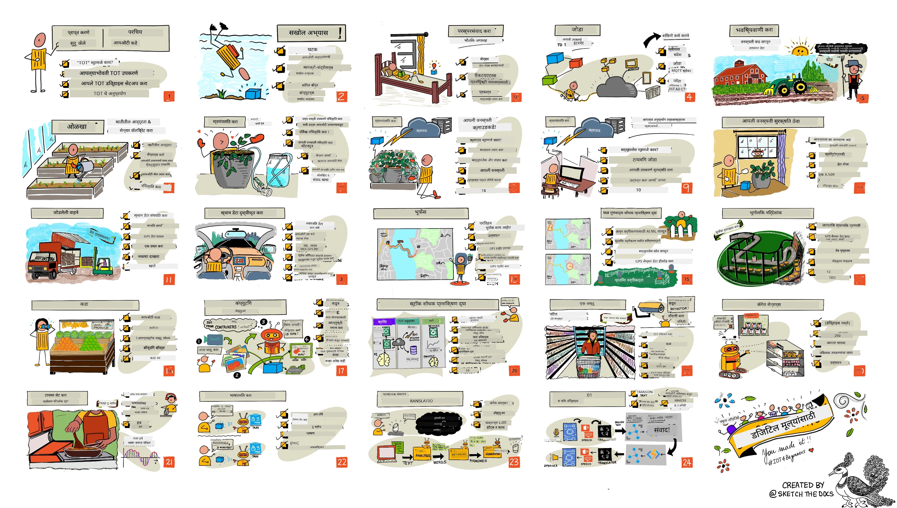

<!--
CO_OP_TRANSLATOR_METADATA:
{
  "original_hash": "6c354ec3487e4f6cfafbe44557996cd9",
  "translation_date": "2026-01-05T21:48:38+00:00",
  "source_file": "README.md",
  "language_code": "mr"
}
-->
[](https://github.com/microsoft/IoT-For-Beginners/blob/master/LICENSE)
[](https://GitHub.com/microsoft/IoT-For-Beginners/graphs/contributors/)
[](https://GitHub.com/microsoft/IoT-For-Beginners/issues/)
[](https://GitHub.com/microsoft/IoT-For-Beginners/pulls/)
[](http://makeapullrequest.com)

[](https://GitHub.com/microsoft/IoT-For-Beginners/watchers/)
[](https://GitHub.com/microsoft/IoT-For-Beginners/network/)
[](https://GitHub.com/microsoft/IoT-For-Beginners/stargazers/)

### Azure AI Foundry समुदायात सहभागी व्हा

जर तुम्हाला अडचण येत असेल किंवा AI अ‍ॅप तयार करताना काही प्रश्न असतील तर. MCP विषयी चर्चा करण्यासाठी सहकार्य करणाऱ्या शिकणाऱ्यांसह आणि अनुभवी विकासकांसह सामील व्हा. हे एक सहायक समुदाय आहे जेथे प्रश्नांना स्वागत आहे आणि ज्ञान मोकळेपणाने वाटले जाते.

[](https://discord.gg/nTYy5BXMWG)

जर उत्पादनेबद्दल अभिप्राय किंवा चुकांबाबत सूचना द्यायच्या असतील तर भेट द्या:

[](https://aka.ms/foundry/forum)

या संसाधनांचा वापर सुरू करण्यासाठी खालील चरणांचे अनुसरण करा:
1. **रिपॉजिटरी फोर्क करा**: क्लिक करा [](https://GitHub.com/microsoft/IoT-For-Beginners/fork)
2. **रिपॉजिटरी क्लोन करा**:   `git clone https://github.com/microsoft/IoT-For-Beginners.git`
3. [**Microso​​ft Foundry Discord मध्ये सामील व्हा आणि तज्ञ व सहकारी विकासक भेटा**](https://discord.com/invite/ByRwuEEgH4)


### 🌐 बहुभाषिक समर्थन

#### GitHub Action द्वारे समर्थित (स्वयंचलित आणि नेहमी अद्ययावत)

<!-- CO-OP TRANSLATOR LANGUAGES TABLE START -->
[Arabic](../ar/README.md) | [Bengali](../bn/README.md) | [Bulgarian](../bg/README.md) | [Burmese (Myanmar)](../my/README.md) | [Chinese (Simplified)](../zh/README.md) | [Chinese (Traditional, Hong Kong)](../hk/README.md) | [Chinese (Traditional, Macau)](../mo/README.md) | [Chinese (Traditional, Taiwan)](../tw/README.md) | [Croatian](../hr/README.md) | [Czech](../cs/README.md) | [Danish](../da/README.md) | [Dutch](../nl/README.md) | [Estonian](../et/README.md) | [Finnish](../fi/README.md) | [French](../fr/README.md) | [German](../de/README.md) | [Greek](../el/README.md) | [Hebrew](../he/README.md) | [Hindi](../hi/README.md) | [Hungarian](../hu/README.md) | [Indonesian](../id/README.md) | [Italian](../it/README.md) | [Japanese](../ja/README.md) | [Kannada](../kn/README.md) | [Korean](../ko/README.md) | [Lithuanian](../lt/README.md) | [Malay](../ms/README.md) | [Malayalam](../ml/README.md) | [Marathi](./README.md) | [Nepali](../ne/README.md) | [Nigerian Pidgin](../pcm/README.md) | [Norwegian](../no/README.md) | [Persian (Farsi)](../fa/README.md) | [Polish](../pl/README.md) | [Portuguese (Brazil)](../br/README.md) | [Portuguese (Portugal)](../pt/README.md) | [Punjabi (Gurmukhi)](../pa/README.md) | [Romanian](../ro/README.md) | [Russian](../ru/README.md) | [Serbian (Cyrillic)](../sr/README.md) | [Slovak](../sk/README.md) | [Slovenian](../sl/README.md) | [Spanish](../es/README.md) | [Swahili](../sw/README.md) | [Swedish](../sv/README.md) | [Tagalog (Filipino)](../tl/README.md) | [Tamil](../ta/README.md) | [Telugu](../te/README.md) | [Thai](../th/README.md) | [Turkish](../tr/README.md) | [Ukrainian](../uk/README.md) | [Urdu](../ur/README.md) | [Vietnamese](../vi/README.md)

> **स्थानिक पद्धतीने क्लोन करायचे असल्यास?**

> या रिपॉजिटरीमध्ये ५०+ भाषांमध्ये अनुवाद आहेत ज्यामुळे डाउनलोडचा आकार लक्षणीय वाढतो. अनुवादांशिवाय क्लोन करण्यासाठी sparse checkout वापरा:
> ```bash
> git clone --filter=blob:none --sparse https://github.com/microsoft/IoT-For-Beginners.git
> cd IoT-For-Beginners
> git sparse-checkout set --no-cone '/*' '!translations' '!translated_images'
> ```
> हे तुम्हाला हे कोर्स पूर्ण करण्यासाठी सर्व काही देते जे तुलनेने जलद डाउनलोड होते.
<!-- CO-OP TRANSLATOR LANGUAGES TABLE END -->

# IoT for Beginners - एक अभ्यासक्रम

Microsoft मधील Azure Cloud Advocates यांनी IoT च्या मूलभूत गोष्टींबाबत १२ आठवड्यांचा, २४ धड्यांचा अभ्यासक्रम सादर केला आहे. प्रत्येक धड्यात पूर्व- आणि पाठोपाठ चाचण्या, धडा पूर्ण करण्यासाठी लेखी सूचना, एक उपाय, एक असाइनमेंट आणि बरेच काही समाविष्ट आहे. प्रकल्पाधारित शिक्षणमार्गामुळे तुम्ही शिकताच तयार करता येते, जी नवीन कौशल्ये पक्की करण्याचा सिद्ध मार्ग आहे.

हे प्रकल्प अन्नाची शेतीपासून टेबलपर्यंतची यात्रा दर्शवितात. यामध्ये शेती, लॉजिस्टिक्स, उत्पादन, किरकोळ विक्री आणि ग्राहक या सर्व क्षेत्रांमध्ये IoT उपकरणे वापरली जातात.



> नित्य नरसिंहन यांनी तयार केलेला स्केचनो्ट. मोठा प्रतिमा पाहण्यासाठी प्रतिमेवर क्लिक करा.

**आमच्या लेखकांना मन:पूर्वक धन्यवाद - [Jen Fox](https://github.com/jenfoxbot), [Jen Looper](https://github.com/jlooper), [Jim Bennett](https://github.com/jimbobbennett), आणि आमच्या स्केचनो्ट कलाकार नित्य नरसिंहन यांना.**

**त्याचप्रमाणे धन्यवाद आमच्या [Microsoft Learn Student Ambassadors](https://studentambassadors.microsoft.com?WT.mc_id=academic-17441-jabenn) या संघाला ज्यांनी या अभ्यासक्रमाचे पुनरावलोकन आणि अनुवाद केले आहे - [Aditya Garg](https://github.com/AdityaGarg00), [Anurag Sharma](https://github.com/Anurag-0-1-A), [Arpita Das](https://github.com/Arpiiitaaa), [Aryan Jain](https://www.linkedin.com/in/aryan-jain-47a4a1145/), [Bhavesh Suneja](https://github.com/EliteWarrior315), [Faith Hunja](https://faithhunja.github.io/), [Lateefah Bello](https://www.linkedin.com/in/lateefah-bello/), [Manvi Jha](https://github.com/Severus-Matthew), [Mireille Tan](https://www.linkedin.com/in/mireille-tan-a4834819a/), [Mohammad Iftekher (Iftu) Ebne Jalal](https://github.com/Iftu119), [Mohammad Zulfikar](https://github.com/mohzulfikar), [Priyanshu Srivastav](https://www.linkedin.com/in/priyanshu-srivastav-b067241ba), [Thanmai Gowducheruvu](https://github.com/innovation-platform), आणि [Zina Kamel](https://www.linkedin.com/in/zina-kamel/).**

संघाला भेटा!

[](https://youtu.be/-wippUJRi5k)

**Gif तयार केले आहे** [Mohit Jaisal](https://linkedin.com/in/mohitjaisal) यांनी

> 🎥 या प्रोजेक्ट बद्दल व्हिडिओ पाहण्यासाठी वरील प्रतिमेवर क्लिक करा!

> **शिक्षकांनो**, आम्ही [अभ्यासक्रम कसा वापरायचा याबाबत काही सूचना](for-teachers.md) दिल्या आहेत. तुम्हाला स्वतःचे धडे तयार करायचे असतील तर आम्ही [धडा साचा](lesson-template/README.md) देखील दिला आहे.

> **[विद्यार्थ्यांनो](https://aka.ms/student-page)**, हा अभ्यासक्रम स्वतः वापरण्यासाठी संपूर्ण रिपॉ दिला आणि स्वतः व्यायाम पूर्ण करा, पूर्व-व्याख्यान चाचणीने सुरुवात करा, मग व्याख्यान वाचा आणि शिल्लक क्रियाकलाप पूर्ण करा. उपाय कोड कॉपी करण्याऐवजी, प्रकल्प समजून घेऊन तयार करण्याचा प्रयत्न करा; मात्र हा कोड प्रत्येक प्रकल्प-केन्द्रित धड्याच्या /solutions फोल्डरमध्ये उपलब्ध आहे. दुसरा पर्याय म्हणजे मित्रांसोबत अभ्यास समूह तयार करून एकत्र अभ्यास करणे. पुढच्या अभ्यासासाठी, आम्ही [Microsoft Learn](https://docs.microsoft.com/users/jimbobbennett/collections/ke2ehd351jopwr?WT.mc_id=academic-17441-jabenn) चा सल्ला देतो.

या कोर्सचा व्हिडिओ सारांश पहा:

[](https://youtube.com/watch?v=bccEMm8gRuc "प्रोमो व्हिडिओ")

> 🎥 या प्रोजेक्ट बद्दल व्हिडिओ पाहण्यासाठी वरील प्रतिमेवर क्लिक करा!

## शिक्षणपद्धती

आम्ही या अभ्यासक्रमाचा आराखडा तयार करताना दोन शैक्षणिक तत्त्वे राखली - प्रकल्पाधारित असणे आणि वारंवार चाचण्या घेणे. या मालिकेच्या अखेरीस, विद्यार्थी वनस्पती निरीक्षण व पाणी देण्याची यंत्रणा, वाहन ट्रॅकर, स्मार्ट फॅक्टरी अन्न तपासणीसाठी आणि आवाज-नियंत्रित स्वयंपाक टाइमर तयार करतील, तसेच इंटरनेट ऑफ थिंग्जचे मूलभूत तत्त्वे शिकतील ज्यात डिव्हाइस कोड कसा लिहायचा, क्लाउडशी कसे जोडायचे, टेलीमेट्रीचा विश्लेषण कसा करायचा आणि एजवर AI कसा चालवायचा यांचा समावेश आहे.

प्रकल्पांसोबत विषय विषय जुळवून दिल्यामुळे विद्यार्थ्यांचे लक्ष वेधणे आणि संकल्पना चांगल्या प्रकारे लक्षात ठेवणे शक्य होते.

शिक्षणानिमित्ताने वर्ग सुरू होण्यापूर्वी कमी दाबाचे क्विझ विद्यार्थ्यांचा विषय शिकण्याची इच्छा उभारतात, आणि नंतर वर्गानंतर दुसरे क्विझ त्याची लक्षात ठेवण्यास मदत करतात. हा अभ्यासक्रम लवचीक आणि मनोरंजक असे बनवला आहे आणि संपूर्ण किंवा भागभागी घेतला जाऊ शकतो. प्रकल्प सुरुवातीला सोपे आहेत आणि १२ आठवड्यांच्या चक्राच्या शेवटी अधिक गुंतागुंतीचे बनतात.

प्रत्येक प्रकल्प वास्तविक हार्डवेअरवर आधारित आहे जे विद्यार्थ्यां आणि छंदातील लोकांसाठी उपलब्ध आहे. प्रत्येक प्रकल्प विशिष्ट प्रकल्प क्षेत्राकडे लक्ष देतो, संबंधित पार्श्वभूमी ज्ञान पुरवतो. यशस्वी विकासक होण्यासाठी तुम्हाला ज्या क्षेत्रात समस्या सोडवत आहात ते समजणे आवश्यक आहे, या पार्श्वभूमी ज्ञानामुळे विद्यार्थी त्यांच्या IoT उपाय आणि शिकण्याचा विचार त्या प्रकारच्या वास्तविक समस्यांच्या संदर्भात करू शकतील ज्यासाठी त्यांना IoT विकासक म्हणून विचारले जाऊ शकते. विद्यार्थी तयार करत असलेल्या उपायांची "का" समजतात आणि अंतिम वापरकर्त्याचे मूल्यांकन करतात.

## हार्डवेअर

आमच्याकडे प्रकल्पांसाठी वापरण्यासाठी दोन IoT हार्डवेअर पर्याय आहेत, वैयक्तिक प्राधान्य, प्रोग्रामिंग भाषा ज्ञान किंवा आवडीनिवडी, शिकण्याचे उद्दिष्टे आणि उपलब्धतेनुसार. ज्यांना हार्डवेअरचा उपयोग करता येत नाही किंवा खरेदी करण्याआधी अधिक शिकायचे आहे त्यांच्यासाठी 'व्हर्च्युअल हार्डवेअर' आवृत्ती देखील दिली आहे. तुम्ही अधिक वाचू शकता आणि [हार्डवेअर पृष्ठावर](./hardware.md) 'शॉपिंग लिस्ट' पाहू शकता, ज्यात Seeed Studio कडून पूर्ण किट खरेदी करण्यासाठी लिंकदेखील आहेत.
> 💁 आमच्या [व्यवहार संकेत](CODE_OF_CONDUCT.md), [योगदान देण्याबाबत](CONTRIBUTING.md), आणि [अनुवाद](TRANSLATIONS.md) मार्गदर्शक तत्त्वे पहा. तुमचे रचनात्मक अभिप्राय स्वागतार्ह आहेत!
>
> 🔧 अडचणी येत आहेत का? सामन्य समस्या सोडवण्यासाठी आमच्या [समस्या निवारण मार्गदर्शक](TROUBLESHOOTING.md) ला पहा.

## प्रत्येक धडा यामध्ये असतो:

- स्केचनोट
- ऐच्छिक पूरक व्हिडिओ
- धड्यापूर्वीचा उष्मायन क्विझ
- लिखित धडा
- प्रकल्पाधारित धड्यांसाठी, प्रकल्प कसा तयार करायचा यावर टप्प्याटप्प्याने मार्गदर्शक
- ज्ञान तपासणी
- एक आव्हान
- पूरक वाचन
- [धड्यानंतर क्विझ](https://ff-quizzes.netlify.app/en/)

> **क्विझबद्दल एक नोंद**: सर्व क्विझ quiz-app फोल्डर मध्ये आहेत, एकूण ४८ क्विझ ज्यात प्रत्येकात तीन प्रश्न आहेत. ते धड्यांमध्ये लिंक केलेले आहेत पण क्विझ अॅप स्थानिकरित्या चालवू शकता किंवा Azure वर तैनात करू शकता; quiz-app फोल्डर मधील सूचना पाळा. ते हळूहळू स्थानिकीकरण केले जात आहेत.

## धडे

|       |              प्रकल्प नाव              |                       शिकवलेले संकल्पना                       | शिक्षण उद्दिष्टे                                                                                                                                                 |                                                        लिंक केलेला धडा                                                         |
| :---: | :------------------------------------: | :---------------------------------------------------------: | ------------------------------------------------------------------------------------------------------------------------------------------------------------------- | :--------------------------------------------------------------------------------------------------------------------------: |
|  01   | [प्रारंभ करणे](./1-getting-started/README.md) |                     IoT परिचय                     | IoT ची मूलभूत तत्वे आणि IoT उपायांचे मुख्य घटक जसे सेन्सर आणि क्लाउड सेवा शिकून तुमचे पहिले IoT उपकरण सेट करताना भेट बघा |                      [IoT परिचय](./1-getting-started/lessons/1-introduction-to-iot/README.md)                      |
|  02   | [प्रारंभ करणे](./1-getting-started/README.md) |                   IoT वर सखोल माहिती                    | IoT प्रणालीतील घटक, मायक्रोकंट्रोलर्स आणि सिंगल-बोर्ड संगणकांबद्दल अधिक जाणून घ्या                                                            |                        [IoT वर सखोल माहिती](./1-getting-started/lessons/2-deeper-dive/README.md)                         |
|  03   | [प्रारंभ करणे](./1-getting-started/README.md) | सेन्सर्स आणि अॅक्च्युएटर्ससह भौतिक जगाशी संवाद साधा | भौतिक जगातील डेटा गोळा करण्यासाठी सेन्सर्स आणि प्रतिसाद देण्यासाठी अॅक्च्युएटर्स याबद्दल शिका, आणि एक नाईटलाइट तयार करा                                           | [सेन्सर्स आणि अॅक्च्युएटर्ससह भौतिक जगाशी संवाद](./1-getting-started/lessons/3-sensors-and-actuators/README.md) |
|  04   | [प्रारंभ करणे](./1-getting-started/README.md) |             तुमचे उपकरण इंटरनेटशी कनेक्ट करा             | IoT उपकरण इंटरनेटशी कसे जोडता येते आणि संदेश पाठवणे व प्राप्त करणे याबद्दल शिका, MQTT ब्रोकरशी तुमचे नाईटलाइट जोडून                               |               [इंटरनेटशी उपकरण कनेक्ट करा](./1-getting-started/lessons/4-connect-internet/README.md)                |
|  05   |            [शेती](./2-farm/README.md)            |                    वनस्पती वाढीचा अंदाज लावा                     | IoT उपकरणाने घेतलेले तापमान डेटा वापरून वनस्पती वाढीचा अंदाज लावण्याबाबत शिका                                                                                  |                          [वनस्पती वाढीचा अंदाज](./2-farm/lessons/1-predict-plant-growth/README.md)                           |
|  06   |            [शेती](./2-farm/README.md)            |                    मातीतील ओलसरपणा शोधा                     | मातीतील ओलसरपणा शोधण्याबाबत आणि मातीच्या ओलसरपणा सेन्सरच्या कॅलिब्रेशनबद्दल शिका                                                                                              |                          [मातीतील ओलसरपणा शोधा](./2-farm/lessons/2-detect-soil-moisture/README.md)                           |
|  07   |            [शेती](./2-farm/README.md)            |                  स्वयंचलित पाणी देणे                   | एक रिले आणि MQTT वापरून पाणी देणे स्वयंचलित आणि वेळापत्रकित कसे करता येईल याबद्दल शिका                                                                                                      |                      [स्वयंचलित पाणी देणे](./2-farm/lessons/3-automated-plant-watering/README.md)                       |
|  08   |            [शेती](./2-farm/README.md)            |               तुमची वनस्पती क्लाउडमध्ये स्थलांतरित करा               | क्लाउड आणि क्लाउड-होस्टेड IoT सेवांविषयी जाणून घ्या आणि सार्वजनिक MQTT ब्रोकरच्या ऐवजी तुमची वनस्पती कशी यापैकी एका सेवेशी कनेक्ट केली जाते                                   |               [वनस्पती क्लाउडमध्ये स्थलांतरित करा](./2-farm/lessons/4-migrate-your-plant-to-the-cloud/README.md)                |
|  09   |            [शेती](./2-farm/README.md)            |         तुमचा अनुप्रयोग लॉजिक क्लाउडमध्ये स्थलांतरित करा         | क्लाउडमध्ये IoT संदेशांना प्रतिसाद देणारा अनुप्रयोग लॉजिक कसा लिहिता येतो हे शिका                                                                          |         [अनुप्रयोग लॉजिक क्लाउडमध्ये स्थलांतरित करा](./2-farm/lessons/5-migrate-application-to-the-cloud/README.md)         |
|  10   |            [शेती](./2-farm/README.md)            |                   तुमची वनस्पती सुरक्षित ठेवा                    | IoT सुरक्षा आणि की व प्रमाणपत्रांसह तुमची वनस्पती सुरक्षित ठेवण्याबाबत शिका                                                                          |                        [वनस्पती सुरक्षित ठेवा](./2-farm/lessons/6-keep-your-plant-secure/README.md)                         |
|  11   |       [परिवहन](./3-transport/README.md)       |                      स्थान ट्रॅकिंग                      | IoT उपकरणांसाठी GPS स्थान ट्रॅकिंग बद्दल शिका                                                                                                                   |                           [स्थान ट्रॅकिंग](./3-transport/lessons/1-location-tracking/README.md)                           |
|  12   |       [परिवहन](./3-transport/README.md)       |                     स्थान डेटा संग्रहित करा                     | IoT डेटा संकलित करून नंतर दृष्टांत किंवा विश्लेषणासाठी संग्रहित कसा करायचा हे शिका                                                                                                      |                         [स्थान डेटा संग्रहित करा](./3-transport/lessons/2-store-location-data/README.md)                         |
|  13   |       [परिवहन](./3-transport/README.md)       |                   स्थान डेटा दृश्यात्मक करा                   | नकाशावर स्थान डेटा दृश्यात्मक कसा करायचा आणि नकाशे कसे प्रत्यक्ष 3D जागेचे 2D प्रतिनिधित्व करतात हे शिका                                                            |                     [स्थान डेटा दृश्यात्मक करा](./3-transport/lessons/3-visualize-location-data/README.md)                     |
|  14   |       [परिवहन](./3-transport/README.md)       |                          जिओफेन्सेस                          | जिओफेन्सेस बद्दल शिका, आणि वाहने त्यांच्या गंतव्याजवळ असताना पुरवठा साखळीत कसे सूचित करतात हे शिका                                           |                                   [जिओफेन्सेस](./3-transport/lessons/4-geofences/README.md)                                   |
|  15   |   [निर्मिती](./4-manufacturing/README.md)   |               फळ गुणवत्ता शोधकाचे प्रशिक्षण                | क्लाउडमध्ये प्रतिमा वर्गीकरण करणारा fruit quality detector प्रशिक्षणाबद्दल शिका                                                                                       |                 [फळ गुणवत्ता शोधकाचे प्रशिक्षण](./4-manufacturing/lessons/1-train-fruit-detector/README.md)                 |
|  16   |   [निर्मिती](./4-manufacturing/README.md)   |           IoT उपकरणावरून फळ गुणवत्ता तपासा            | IoT उपकरणावरून तुमचा फळ गुणवत्ता शोधक कसा वापरायचा हे शिका                                                                                                    |           [IoT उपकरणावरून फळ गुणवत्ता तपासा](./4-manufacturing/lessons/2-check-fruit-from-device/README.md)            |
|  17   |   [निर्मिती](./4-manufacturing/README.md)   |             एजवर तुमचा फळ शोधक चालवा             | एजवर IoT उपकरणावर तुमचा फळ शोधक कसा चालवायचा हे शिका                                                                                                |             [एजवर फळ शोधक चालवा](./4-manufacturing/lessons/3-run-fruit-detector-edge/README.md)             |
|  18   |   [निर्मिती](./4-manufacturing/README.md)   |        सेन्सरद्वारे फळ गुणवत्ता शोध सुरु करा        | सेन्सरद्वारे फळ गुणवत्ता शोध सुरू करण्याबाबत शिका                                                                                                        |        [सेन्सरद्वारे फळ गुणवत्ता शोध सुरु करा](./4-manufacturing/lessons/4-trigger-fruit-detector/README.md)         |
|  19   |          [खुदरा](./5-retail/README.md)          |                   स्टॉक शोधकाचे प्रशिक्षण                    | ऑब्जेक्ट शोध वापरून दुकानातील स्टॉक मोजण्यासाठी स्टॉक शोधकाचे प्रशिक्षण कसा करायचा हे शिका                                                                                |                        [स्टॉक शोधकाचे प्रशिक्षण](./5-retail/lessons/1-train-stock-detector/README.md)                         |
|  20   |          [खुदरा](./5-retail/README.md)          |               IoT उपकरणावरून स्टॉक तपासा                | ऑब्जेक्ट डिटेक्शन मॉडेल वापरून IoT उपकरणावरून स्टॉक तपासण्याबद्दल शिका                                                                                         |                     [IoT उपकरणावरून स्टॉक तपासा](./5-retail/lessons/2-check-stock-device/README.md)                      |
|  21   |        [ग्राहक](./6-consumer/README.md)        |             IoT उपकरणासह भाषण ओळखा             | IoT उपकरणावरून भाषण ओळखून स्मार्ट टाइमर तयार करण्याबाबत शिका                                                                                             |                  [IoT उपकरणासह भाषण ओळखा](./6-consumer/lessons/1-speech-recognition/README.md)                  |
|  22   |        [ग्राहक](./6-consumer/README.md)        |                     भाषा समजून घ्या                     | IoT उपकरणाला सांगितलेली वाक्ये समजण्यात कशी मदत होते हे शिका                                                                                                           |                        [भाषा समजून घ्या](./6-consumer/lessons/2-language-understanding/README.md)                        |
|  23   |        [ग्राहक](./6-consumer/README.md)        |           टाइमर सेट करा आणि बोलीने अभिप्राय द्या           | IoT उपकरणावर टाइमर कसा सेट करायचा आणि टाइमर सेट झाल्यावर आणि संपल्यानंतर बोलीने अभिप्राय कसा द्यायचा हे शिका                                                    |                 [टाइमर सेट करा आणि बोलीने अभिप्राय द्या](./6-consumer/lessons/3-spoken-feedback/README.md)                  |
|  24   |        [ग्राहक](./6-consumer/README.md)        |                 अनेक भाषा समर्थित करा                  | अनेक भाषा समर्थन कसे करता येते, म्हणजे बोली आणि स्मार्ट टाइमरकडून होणाऱ्या प्रतिसादांसाठी हे शिका                                                               |                   [अनेक भाषा समर्थित करा](./6-consumer/lessons/4-multiple-language-support/README.md)                   |

## ऑफलाइन प्रवेश

तुम्ही [Docsify](https://docsify.js.org/#/) वापरून ही कागदपत्रे ऑफलाइन चालवू शकता. हा रेपो फोर्क करा, तुमच्या स्थानिक मशीनवर [Docsify इन्स्टॉल करा](https://docsify.js.org/#/quickstart), आणि नंतर या रेपोच्या मूळ फोल्डरमध्ये `docsify serve` टाइप करा. वेबसाइट पोर्ट 3000 वर तुमच्या स्थानिकहोस्टवर उपलब्ध होईल: `localhost:3000`.

## क्विझ

प्रत्येक प्रकरणावरील तुमचे ज्ञान तपासण्यासाठी इंटरऐक्टिव क्विझ होस्ट करणाऱ्या समुदायाचे आभार. तुम्ही तुमचे ज्ञान [येथे](https://ff-quizzes.netlify.app/en/) तपासू शकता

### PDF

जर आवश्यक असेल तर तुम्ही ऑफलाइन प्रवेशासाठी या सामग्रीचा PDF तयार करू शकता. हे करण्यासाठी, खात्री करा की तुमच्याकडे [npm इंस्टॉल केलेले आहे](https://docs.npmjs.com/downloading-and-installing-node-js-and-npm) आणि या रेपोच्या मूळ फोल्डरमध्ये खालील आदेश चालवा:

```sh
npm i
npm run convert
```

### स्लाइड्स

काही धड्यांसाठी स्लाइड डेक [slides](../../slides) फोल्डरमध्ये आहेत.


## इतर अभ्यासक्रम

आमच्या टीमकडे इतरही अभ्यासक्रम आहेत! ते तपासा:

<!-- CO-OP TRANSLATOR OTHER COURSES START -->
### LangChain
[](https://aka.ms/langchain4j-for-beginners)
[](https://aka.ms/langchainjs-for-beginners?WT.mc_id=m365-94501-dwahlin)

---

### Azure / Edge / MCP / Agents
[](https://github.com/microsoft/AZD-for-beginners?WT.mc_id=academic-105485-koreyst)
[](https://github.com/microsoft/edgeai-for-beginners?WT.mc_id=academic-105485-koreyst)
[](https://github.com/microsoft/mcp-for-beginners?WT.mc_id=academic-105485-koreyst)
[](https://github.com/microsoft/ai-agents-for-beginners?WT.mc_id=academic-105485-koreyst)

---
 
### जनरेटिव्ह एआय सिरीज
[](https://github.com/microsoft/generative-ai-for-beginners?WT.mc_id=academic-105485-koreyst)
[-9333EA?style=for-the-badge&labelColor=E5E7EB&color=9333EA)](https://github.com/microsoft/Generative-AI-for-beginners-dotnet?WT.mc_id=academic-105485-koreyst)
[-C084FC?style=for-the-badge&labelColor=E5E7EB&color=C084FC)](https://github.com/microsoft/generative-ai-for-beginners-java?WT.mc_id=academic-105485-koreyst)
[-E879F9?style=for-the-badge&labelColor=E5E7EB&color=E879F9)](https://github.com/microsoft/generative-ai-with-javascript?WT.mc_id=academic-105485-koreyst)

---
 
### मुख्य शिक्षण
[](https://aka.ms/ml-beginners?WT.mc_id=academic-105485-koreyst)
[](https://aka.ms/datascience-beginners?WT.mc_id=academic-105485-koreyst)
[](https://aka.ms/ai-beginners?WT.mc_id=academic-105485-koreyst)
[](https://github.com/microsoft/Security-101?WT.mc_id=academic-96948-sayoung)
[](https://aka.ms/webdev-beginners?WT.mc_id=academic-105485-koreyst)
[](https://aka.ms/iot-beginners?WT.mc_id=academic-105485-koreyst)
[](https://github.com/microsoft/xr-development-for-beginners?WT.mc_id=academic-105485-koreyst)

---
 
### कॉपायलट सिरीज
[](https://aka.ms/GitHubCopilotAI?WT.mc_id=academic-105485-koreyst)
[](https://github.com/microsoft/mastering-github-copilot-for-dotnet-csharp-developers?WT.mc_id=academic-105485-koreyst)
[](https://github.com/microsoft/CopilotAdventures?WT.mc_id=academic-105485-koreyst)
<!-- CO-OP TRANSLATOR OTHER COURSES END -->

## चित्र कृतज्ञता

या अभ्यासक्रमासाठी वापरलेल्या चित्रांसाठी सर्व कृतज्ञता आपण [Attributions](./attributions.md) येथे पाहू शकता.

---

<!-- CO-OP TRANSLATOR DISCLAIMER START -->
**विज्ञप्ती**:
हा दस्तऐवज AI भाषांतर सेवा [Co-op Translator](https://github.com/Azure/co-op-translator) वापरून भाषांतरित केला गेला आहे. आमचे उद्दिष्ट अचूकता ठेवण्याचे असले तरी, कृपया लक्षात घ्या की स्वयंचलित भाषांतरांमध्ये चुका किंवा अचूकतेचा अभाव असू शकतो. मूळ दस्तऐवज त्याच्या स्थानिक भाषेत अधिकृत स्रोत मानला जावा. महत्त्वाच्या माहितीकरिता व्यावसायिक मानवी भाषांतर करण्याची शिफारस केली जाते. या भाषांतराच्या वापरामुळे झालेल्या कोणत्याही गैरसमजुतीं किंवा चुका यासाठी आम्ही जबाबदार नाही.
<!-- CO-OP TRANSLATOR DISCLAIMER END -->