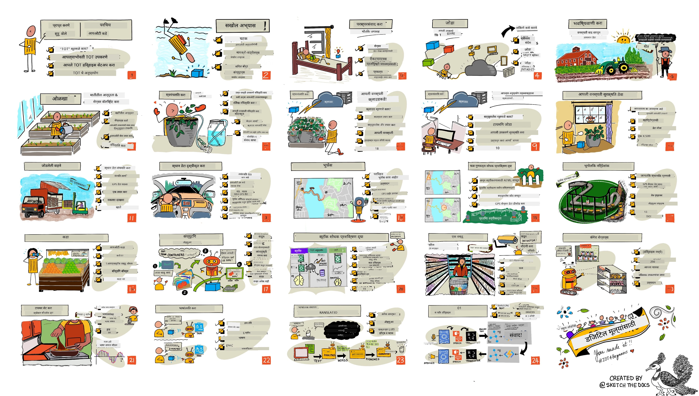

[](https://github.com/microsoft/IoT-For-Beginners/blob/master/LICENSE)
[](https://GitHub.com/microsoft/IoT-For-Beginners/graphs/contributors/)
[](https://GitHub.com/microsoft/IoT-For-Beginners/issues/)
[](https://GitHub.com/microsoft/IoT-For-Beginners/pulls/)
[](http://makeapullrequest.com)

[](https://GitHub.com/microsoft/IoT-For-Beginners/watchers/)
[](https://GitHub.com/microsoft/IoT-For-Beginners/network/)
[](https://GitHub.com/microsoft/IoT-For-Beginners/stargazers/)

### Azure AI Foundry समुदायात सामील व्हा

जर तुम्हाला अडचण आली किंवा AI अॅप्स बनवण्याबाबत काही प्रश्न असल्यास, तर अन्य शिकणाऱ्या आणि अनुभवी विकसकांसोबत MCP विषयी चर्चा करण्यासाठी सामील व्हा. हा एक सहायक समुदाय आहे जिथे प्रश्न विचारणे स्वागतार्ह आहे आणि ज्ञान मोकळेपणाने वाटले जाते.

[](https://discord.gg/nTYy5BXMWG)

जर तुम्हाला उत्पादनाबाबत अभिप्राय किंवा त्रुटी आढळल्यास, त्यासाठी भेट द्या:

[](https://aka.ms/foundry/forum)

या साधनांचा वापर सुरू करण्यासाठी खालील टप्पे पाळा:
1. **रिपॉझिटरी फोर्क करा**: क्लिक करा [](https://GitHub.com/microsoft/IoT-For-Beginners/fork)
2. **रिपॉझिटरी क्लोन करा**:   `git clone https://github.com/microsoft/IoT-For-Beginners.git`
3. [**Microsoft Foundry Discord मध्ये सामील व्हा आणि तज्ञ व इतर विकसकांना भेटा**](https://discord.com/invite/ByRwuEEgH4)


### 🌐 बहुभाषिक समर्थन

#### GitHub Action द्वारे समर्थित (स्वयंचलित आणि नेहमी अद्ययावत)

<!-- CO-OP TRANSLATOR LANGUAGES TABLE START -->
[Arabic](../ar/README.md) | [Bengali](../bn/README.md) | [Bulgarian](../bg/README.md) | [Burmese (Myanmar)](../my/README.md) | [Chinese (Simplified)](../zh-CN/README.md) | [Chinese (Traditional, Hong Kong)](../zh-HK/README.md) | [Chinese (Traditional, Macau)](../zh-MO/README.md) | [Chinese (Traditional, Taiwan)](../zh-TW/README.md) | [Croatian](../hr/README.md) | [Czech](../cs/README.md) | [Danish](../da/README.md) | [Dutch](../nl/README.md) | [Estonian](../et/README.md) | [Finnish](../fi/README.md) | [French](../fr/README.md) | [German](../de/README.md) | [Greek](../el/README.md) | [Hebrew](../he/README.md) | [Hindi](../hi/README.md) | [Hungarian](../hu/README.md) | [Indonesian](../id/README.md) | [Italian](../it/README.md) | [Japanese](../ja/README.md) | [Kannada](../kn/README.md) | [Khmer](../km/README.md) | [Korean](../ko/README.md) | [Lithuanian](../lt/README.md) | [Malay](../ms/README.md) | [Malayalam](../ml/README.md) | [Marathi](./README.md) | [Nepali](../ne/README.md) | [Nigerian Pidgin](../pcm/README.md) | [Norwegian](../no/README.md) | [Persian (Farsi)](../fa/README.md) | [Polish](../pl/README.md) | [Portuguese (Brazil)](../pt-BR/README.md) | [Portuguese (Portugal)](../pt-PT/README.md) | [Punjabi (Gurmukhi)](../pa/README.md) | [Romanian](../ro/README.md) | [Russian](../ru/README.md) | [Serbian (Cyrillic)](../sr/README.md) | [Slovak](../sk/README.md) | [Slovenian](../sl/README.md) | [Spanish](../es/README.md) | [Swahili](../sw/README.md) | [Swedish](../sv/README.md) | [Tagalog (Filipino)](../tl/README.md) | [Tamil](../ta/README.md) | [Telugu](../te/README.md) | [Thai](../th/README.md) | [Turkish](../tr/README.md) | [Ukrainian](../uk/README.md) | [Urdu](../ur/README.md) | [Vietnamese](../vi/README.md)

> **स्थानिक क्लोन करायचा आहे का?**
>
> या रिपॉझिटरीमध्ये ५०+ भाषा अनुवाद आहेत ज्यामुळे डाउनलोडचा आकार मोठा होतो. केवळ मूळ कोड क्लोन करण्यासाठी sparse checkout वापरा:
>
> **Bash / macOS / Linux:**
> ```bash
> git clone --filter=blob:none --sparse https://github.com/microsoft/IoT-For-Beginners.git
> cd IoT-For-Beginners
> git sparse-checkout set --no-cone '/*' '!translations' '!translated_images'
> ```
>
> **CMD (Windows):**
> ```cmd
> git clone --filter=blob:none --sparse https://github.com/microsoft/IoT-For-Beginners.git
> cd IoT-For-Beginners
> git sparse-checkout set --no-cone "/*" "!translations" "!translated_images"
> ```
>
> यामुळे कोर्स पूर्ण करण्यासाठी आवश्यक सर्व काही खूप वेगाने डाउनलोड होईल.
<!-- CO-OP TRANSLATOR LANGUAGES TABLE END -->

# बिगीनर्ससाठी IoT - एक अभ्यासक्रम

Microsoft मधील Azure Cloud Advocates आपल्याला IoT मूलभूत बाबींबाबत १२ आठवड्यांचा, २४ धड्यांचा अभ्यासक्रम प्रदान करण्यात आनंदित आहेत. प्रत्येक धड्यात पूर्व आणि पश्चात क्विझेस, धडा पूर्ण करण्यासाठी लेखी सूचना, एक समाधान, असाइनमेंट आणि बरेच काही समाविष्ट आहे. आमची प्रकल्प-आधारित शिकवण आपल्याला बनवताना शिकण्याची संधी देते, ही नवीन कौशल्ये आत्मसात करण्याचा सिद्ध मार्ग आहे.

हे प्रकल्प अन्नाच्या शेतापासून टेबलपर्यंतच्या प्रवासाचे आच्छादन करतात. यात शेती, वाहतूक, उत्पादन, किरकोळ विक्री आणि ग्राहक यांनी IoT डिव्हाइससाठी लोकप्रिय उद्योग क्षेत्रे समाविष्ट आहेत.



> स्केच नोट [Nitya Narasimhan](https://github.com/nitya) यांनी तयार केलेले आहेत. अधिक मोठे आवृत्ती पाहण्यासाठी प्रतिमा क्लिक करा.

**आमच्या लेखकांचे मनापासून आभार [Jen Fox](https://github.com/jenfoxbot), [Jen Looper](https://github.com/jlooper), [Jim Bennett](https://github.com/jimbobbennett) आणि आमच्या स्केच नोट कलाकार [Nitya Narasimhan](https://github.com/nitya).**

**तसेच, [Microsoft Learn Student Ambassadors](https://studentambassadors.microsoft.com?WT.mc_id=academic-17441-jabenn) या टीमचे आभार ज्यांनी या अभ्यासक्रमाचे पुनरावलोकन व अनुवाद केले आहे - [Aditya Garg](https://github.com/AdityaGarg00), [Anurag Sharma](https://github.com/Anurag-0-1-A), [Arpita Das](https://github.com/Arpiiitaaa), [Aryan Jain](https://www.linkedin.com/in/aryan-jain-47a4a1145/), [Bhavesh Suneja](https://github.com/EliteWarrior315), [Faith Hunja](https://faithhunja.github.io/), [Lateefah Bello](https://www.linkedin.com/in/lateefah-bello/), [Manvi Jha](https://github.com/Severus-Matthew), [Mireille Tan](https://www.linkedin.com/in/mireille-tan-a4834819a/), [Mohammad Iftekher (Iftu) Ebne Jalal](https://github.com/Iftu119), [Mohammad Zulfikar](https://github.com/mohzulfikar), [Priyanshu Srivastav](https://www.linkedin.com/in/priyanshu-srivastav-b067241ba), [Thanmai Gowducheruvu](https://github.com/innovation-platform), आणि [Zina Kamel](https://www.linkedin.com/in/zina-kamel/).**

टीमला भेट द्या!

[](https://youtu.be/-wippUJRi5k)

**Gif द्वारे** [Mohit Jaisal](https://linkedin.com/in/mohitjaisal)

> 🎥 प्रकल्पाबाबत व्हिडिओ पाहण्यासाठी वरची प्रतिमा क्लिक करा!

> **शिक्षक**, आम्ही [अभ्यासक्रम वापरण्याच्या काही सूचना](for-teachers.md) दिल्या आहेत. आपले स्वतःचे धडे तयार करायचे असल्यास, आम्ही [धडा टेम्पलेट](lesson-template/README.md) देखील प्रदान केले आहे.

> **[विद्यार्थी](https://aka.ms/student-page)**, हा अभ्यासक्रम स्वयंपूर्वक वापरण्यासाठी संपूर्ण रेपॉझिटरी फोर्क करा आणि व्यायाम पूर्ण करा, सुरुवात पूर्वव्याख्यान क्विझने करा, नंतर व्याख्यान वाचा आणि उर्वरित क्रियाकलाप पूर्ण करा. प्रकल्प तयार करताना धड्यांची समज घेऊन तयार करा, समाधान कोडची कॉपी न करता; असे असले तरी हा कोड प्रोजेक्ट-आधारित प्रत्येक धड्यात /solutions फोल्डरमध्ये उपलब्ध आहे. आणखी एक कल्पना म्हणजे मित्रांसोबत स्टडी ग्रुप तयार करणे आणि एकत्र सामग्री अभ्यास करणे. अधिक अभ्यासासाठी [Microsoft Learn](https://docs.microsoft.com/users/jimbobbennett/collections/ke2ehd351jopwr?WT.mc_id=academic-17441-jabenn) शिफारस केली जाते.

या कोर्सचा व्हिडिओ आढावा पाहण्यासाठी हा व्हिडिओ पहा:

[](https://youtube.com/watch?v=bccEMm8gRuc "प्रमो व्हिडिओ")

> 🎥 प्रकल्पाबाबत व्हिडिओ पाहण्यासाठी वरची प्रतिमा क्लिक करा!

## शिकण्याची पद्धत

या अभ्यासक्रमात आम्ही दोन शिकवण्याच्या तत्त्वांवर लक्ष केंद्रीत केले आहे: हे प्रकल्प-आधारित असणे आणि वारंवार क्विझ देणे. या मालिकेच्या शेवटी, विद्यार्थ्यांनी वनस्पती निरीक्षण आणि पाणी देण्याची यंत्रणा, वाहन ट्रॅकर, स्मार्ट फॅक्टरी सेटअप जे अन्न तपासते, आणि आवाज नियंत्रण स्वयंपाक टायमर बनवलेले असतील, आणि त्यांना इंटरनेट ऑफ थिंग्जचे मूलतत्त्वे समजलेले असतील ज्यात डिव्हाइस कोड लिहिणे, क्लाऊडशी कनेक्ट करणे, टेलिमेट्रीचे विश्लेषण आणि एजवर AI चालवणे यांचा समावेश आहे.

सामग्री प्रकल्पांशी सुसंगत असल्यामुळे विद्यार्थ्यांसाठी प्रक्रिया अधिक आकर्षक बनते आणि संकल्पनांची स्मरणशक्ती वाढते.

शिवाय, वर्गाच्या आधी एक क्विझ विद्यार्थ्यांमध्ये विषय शिकण्याचा मानस तयार करतो, तर वर्गानंतरचा दुसरा क्विझ अजून चांगली स्मृती सुनिश्चित करतो. हा अभ्यासक्रम लवचिक आणि मजेदार आहे आणि संपूर्ण किंवा भागांमध्ये घेता येऊ शकतो. प्रकल्प छोटे सुरू होतात आणि १२ आठवड्यांच्या पूर्ण चक्रात अधिक क्लिष्ट होतात.

प्रत्येक प्रकल्प विद्यार्थी आणि छंदविकसितांसाठी उपलब्ध वास्तविक हार्डवेअरभोवती आधारित आहे. प्रत्येक प्रकल्प संबंधित प्रकल्प डोमेनचीदेखील माहिती देतो, संबंधित पार्श्वभूमी ज्ञान पुरवतो. यशस्वी विकसक होण्यासाठी समस्या सोडविण्याच्या डोमेनचे स्वाभाविक ज्ञान असणे मदत करते, जेणेकरून विद्यार्थ्यांना त्यांचे IoT सोल्युशन्स आणि शिकण्याचा संदर्भ त्या प्रकारच्या वास्तविक समस्यांसह विचारता येईल जे IoT विकसक म्हणून त्यांना कदाचित सोडवायच्या असतील. विद्यार्थ्यांना ते सोल्युशन्स का तयार करत आहेत हे समजते आणि अंतिम वापरकर्त्याचे समज तयार होते.

## हार्डवेअर
आमच्याकडे प्रकल्पांसाठी वैयक्तिक पसंती, प्रोग्रामिंग भाषा ज्ञान किंवा आवडीनुसार, शिकण्याच्या ध्येयांनुसार आणि उपलब्धतेनुसार वापरण्यासाठी दोन IoT हार्डवेअर पर्याय आहेत. ज्यांना हार्डवेअर उपलब्ध नाही किंवा खरेदी करण्यापूर्वी अधिक शिकण्यास आवडेल अशांसाठी आम्ही 'व्हर्च्युअल हार्डवेअर' आवृत्ती देखील पुरवली आहे. तुम्ही [hardware page](./hardware.md) वर अधिक वाचू शकता आणि 'शॉपिंग लिस्ट' सुद्धा पाहू शकता, ज्यात Seeed Studio येथील आमच्या मित्रांकडून पूर्ण किट खरेदी करण्याच्या दुव्यांचा समावेश आहे.

> 💁 आमचा [Code of Conduct](CODE_OF_CONDUCT.md), [Contributing](CONTRIBUTING.md), आणि [Translations](..) मार्गदर्शक तत्त्वे शोधा. आम्ही तुमचे रचनात्मक अभिप्राय स्वागत करतो!
>
> 🔧 समस्या येत आहेत का? सामान्य समस्या सोडवण्यासाठी आमचा [Troubleshooting Guide](TROUBLESHOOTING.md) तपासा.

## प्रत्येक धडा यामध्ये समाविष्ट आहे:

- स्केचनोट
- ऐच्छिक पूरक व्हिडिओ
- पूर्व-धडा वॉर्मअप क्विझ
- लेखी धडा
- प्रकल्पाधारित धड्यांसाठी, प्रकल्प बनवण्याच्या टप्प्याटप्प्याने मार्गदर्शिका
- ज्ञान तपासण्या
- एक आव्हान
- पूरक वाचन
- असाइनमेंट
- [पश्चात धडा क्विझ](https://ff-quizzes.netlify.app/en/)

> **क्विझ विषयी एक नोंद**: सर्व क्विझेस quiz-app फोल्डरमध्ये असतात, ज्यामध्ये प्रत्येकी तीन प्रश्नांसह एकूण ४८ क्विझेस आहेत. त्या धड्यांमध्ये लिंक केल्या आहेत पण quiz app स्थानिक पद्धतीने चालवता येऊ शकतो किंवा Azure वर तैनात केला जाऊ शकतो; `quiz-app` फोल्डरमधील सूचनांचे पालन करा. ते हळूहळू स्थानिकीकरण केले जात आहेत.

## धडे

|       |              प्रकल्पाचे नाव              |                       शिकवले जाणारे संकल्पना                       | शिक्षण उद्दिष्टे                                                                                                                                                          |                                                        लिंक केलेला धडा                                                         |
| :---: | :------------------------------------: | :---------------------------------------------------------: | ----------------------------------------------------------------------------------------------------------------------------------------------------------------------- | :--------------------------------------------------------------------------------------------------------------------------: |
|  01   | [Getting started](./1-getting-started/README.md) |                     IoT परिचय                     | IoT ची मूलभूत तत्त्वे आणि IoT सोल्यूशन्सच्या मूलभूत संरचनात्मक घटकांचा अभ्यास करा जसे की सेन्सर आणि क्लाऊड सेवा, पुढे प्रथम IoT डिव्हाईस सेट करताना                         |                      [IoT परिचय](./1-getting-started/lessons/1-introduction-to-iot/README.md)                      |
|  02   | [Getting started](./1-getting-started/README.md) |                   IoT मध्ये सखोल जाणून घेणे                    | IoT प्रणालींचे अधिक घटक, मायक्रो कंट्रोलर्स आणि सिंगल-बोर्ड संगणकांविषयी अधिक माहिती मिळवा                                                                       |                        [IoT मध्ये सखोल जाणून घेणे](./1-getting-started/lessons/2-deeper-dive/README.md)                         |
|  03   | [Getting started](./1-getting-started/README.md) | सेंसर आणि अॅक्च्युएटर्ससह भौतिक विश्वाशी संवाद करा | भौतिक जगातून डेटा गोळा करण्यासाठी सेन्सरचा वापर व अॅक्च्युएटर्सद्वारे प्रतिसाद कसा दिला जातो, याबाबत शिकून एका नाईटलाइटचे बांधकाम करा                                           | [सेंसर आणि अॅक्च्युएटर्ससह भौतिक विश्वाशी संवाद करा](./1-getting-started/lessons/3-sensors-and-actuators/README.md) |
|  04   | [Getting started](./1-getting-started/README.md) |             तुमचा डिव्हाइस इंटरनेटशी जोडा             | IoT डिव्हाइसला इंटरनेटशी जोडून संदेश पाठविण्यास आणि प्राप्त करण्यासंबंधीत माहिती मिळवा, तुमचा नाईटलाइट MQTT ब्रोकरशी कसा जोडायचा हे शिकवा                               |               [तुमचा डिव्हाइस इंटरनेटशी जोडा](./1-getting-started/lessons/4-connect-internet/README.md)                |
|  05   |            [Farm](./2-farm/README.md)            |                    वनस्पतीच्या वाढीची भविष्यवाणी करा                     | IoT डिव्हाइसने कॅप्चर केलेल्या तापमानाच्या डेटाचा वापर करून वनस्पतीच्या वाढीची भविष्यवाणी कशी करावी हे शिका                                                                                  |                          [वनस्पतीच्या वाढीची भविष्यवाणी करा](./2-farm/lessons/1-predict-plant-growth/README.md)                           |
|  06   |            [Farm](./2-farm/README.md)            |                    मातीतील आर्द्रता ओळखा                     | मातीतील आर्द्रता कशी ओळखायची आणि मातीच्या आर्द्रता सेन्सरची कॅलिब्रेशन कशी करायची हे शिका                                                                                              |                          [मातीतील आर्द्रता ओळखा](./2-farm/lessons/2-detect-soil-moisture/README.md)                           |
|  07   |            [Farm](./2-farm/README.md)            |                  स्वयंचलित वनस्पतींचे पाणी देणे                   | रिले आणि MQTT वापरून पाण्याचे वेळापत्रक आधारित पाणी देण्याची कृती कशी स्वयंचलित करायची ते शिकवा                                                                                                      |                      [स्वयंचलित वनस्पतींचे पाणी देणे](./2-farm/lessons/3-automated-plant-watering/README.md)                       |
|  08   |            [Farm](./2-farm/README.md)            |               तुमची वनस्पती क्लाऊडमध्ये स्थलांतर करा               | क्लाऊड आणि क्लाऊड-होस्टेड IoT सेवा याबाबतची माहिती मिळवा आणि सार्वजनिक MQTT ब्रोकरऐवजी तुम्ही तुमची वनस्पती कशी एका क्लाऊडवर जोडू शकता हे शिका                                   |               [तुमची वनस्पती क्लाऊडमध्ये स्थलांतर करा](./2-farm/lessons/4-migrate-your-plant-to-the-cloud/README.md)                |
|  09   |            [Farm](./2-farm/README.md)            |         तुमची अनुप्रयोग लॉजिक क्लाऊडमध्ये स्थलांतर करा         | IoT संदेशांना प्रतिसाद देणारे क्लाऊडमधील अनुप्रयोग लॉजिक लिहिण्याबाबत शिका                                                                          |         [तुमची अनुप्रयोग लॉजिक क्लाऊडमध्ये स्थलांतर करा](./2-farm/lessons/5-migrate-application-to-the-cloud/README.md)         |
|  10   |            [Farm](./2-farm/README.md)            |                   तुमची वनस्पती सुरक्षित ठेवा                    | IoT सह सुरक्षा आणि कीज आणि प्रमाणपत्रांसह कशाप्रकारे तुमची वनस्पती सुरक्षित ठेवायची हे शिका                                                                          |                        [तुमची वनस्पती सुरक्षित ठेवा](./2-farm/lessons/6-keep-your-plant-secure/README.md)                         |
|  11   |       [Transport](./3-transport/README.md)       |                      स्थान ट्रॅकिंग                      | IoT डिव्हाइसेससाठी GPS स्थान ट्रॅकिंग बद्दल माहिती मिळवा                                                                                                                   |                           [स्थान ट्रॅकिंग](./3-transport/lessons/1-location-tracking/README.md)                           |
|  12   |       [Transport](./3-transport/README.md)       |                     स्थान डेटा साठवणे                     | IoT डेटा नंतर दृश्य किंवा विश्लेषित करण्यासाठी साठवण्याबाबत शिका                                                                                                      |                         [स्थान डेटा साठवणे](./3-transport/lessons/2-store-location-data/README.md)                         |
|  13   |       [Transport](./3-transport/README.md)       |                   स्थान डेटा दृश्य रूपांतरण                   | नकाशावर स्थान डेटा कसा दर्शवायचा याबाबत आणि नक्शे कसे वास्तविक 3D जग 2 परिमाणांमध्ये कसे सादर करतात याबद्दल माहिती मिळवा                                                            |                     [स्थान डेटा दृश्य रूपांतरण](./3-transport/lessons/3-visualize-location-data/README.md)                     |
|  14   |       [Transport](./3-transport/README.md)       |                          जिओफेन्सेस                          | जिओफेन्सेस काय असतात, आणि पुरवठा साखळीतील वाहन त्यांच्या गंतव्याजवळ आल्यास कसे सूचित केले जाऊ शकते हे शिका                                           |                                   [जिओफेन्सेस](./3-transport/lessons/4-geofences/README.md)                                   |
|  15   |   [Manufacturing](./4-manufacturing/README.md)   |               फळांच्या गुणवत्तेचा शोधक प्रशिक्षण द्या                | क्लाऊडमध्ये प्रतिमा वर्गीकरण करणारे मॉडेल प्रशिक्षित करून फळांच्या गुणवत्तेची ओळख कशी करायची हे शिका                                                                                       |                 [फळांच्या गुणवत्तेचा शोधक प्रशिक्षण द्या](./4-manufacturing/lessons/1-train-fruit-detector/README.md)                 |
|  16   |   [Manufacturing](./4-manufacturing/README.md)   |           IoT डिव्हाइसद्वारे फळांची गुणवत्ता तपासा            | IoT डिव्हाइसवर तुमचा फळ गुणवत्तेचा शोधक कसा वापरायचा हे शिका                                                                                                    |           [IoT डिव्हाइसद्वारे फळांची गुणवत्ता तपासा](./4-manufacturing/lessons/2-check-fruit-from-device/README.md)            |
|  17   |   [Manufacturing](./4-manufacturing/README.md)   |             एजवर तुमचा फळ शोधक चालवा             | एजवर IoT डिव्हाइसवर तुमचा फळ शोधक कसा चालवायचा हे शिका                                                                                                |             [एजवर तुमचा फळ शोधक चालवा](./4-manufacturing/lessons/3-run-fruit-detector-edge/README.md)             |
|  18   |   [Manufacturing](./4-manufacturing/README.md)   |        सेन्सरद्वारे फळ गुणवत्ता शोधणा प्रारंभ करा        | सेन्सरद्वारे फळ गुणवत्ता शोधणा सुरू करण्याबाबत शिका                                                                                                        |        [सेन्सरद्वारे फळ गुणवत्ता शोधणा प्रारंभ करा](./4-manufacturing/lessons/4-trigger-fruit-detector/README.md)         |
|  19   |          [Retail](./5-retail/README.md)          |                   स्टॉक शोधक प्रशिक्षण द्या                    | वस्तू ओळख वापरून दुकानातील स्टॉक मोजण्यासाठी स्टॉक शोधक कसा प्रशिक्षित करायचा हे शिका                                                                                |                        [स्टॉक शोधक प्रशिक्षण द्या](./5-retail/lessons/1-train-stock-detector/README.md)                         |
|  20   |          [Retail](./5-retail/README.md)          |               IoT डिव्हाइसद्वारे स्टॉक तपासा                | वस्तू ओळख मॉडेल वापरून IoT डिव्हाइसद्वारे स्टॉक कसा तपासायचा हे शिका                                                                                         |                     [IoT डिव्हाइसद्वारे स्टॉक तपासा](./5-retail/lessons/2-check-stock-device/README.md)                      |
|  21   |        [Consumer](./6-consumer/README.md)        |             IoT डिव्हाइसद्वारे भाषण ओळखा             | IoT डिव्हाइसवरून भाषण ओळखून स्मार्ट टाइमर कसा तयार करायचा हे शिका                                                                                             |                  [IoT डिव्हाइसद्वारे भाषण ओळखा](./6-consumer/lessons/1-speech-recognition/README.md)                  |
|  22   |        [Consumer](./6-consumer/README.md)        |                     भाषा समजून घ्या                     | IoT डिव्हाइसवर बोललेल्या वाक्यांचा अर्थ कसा लावायचा हे शिका                                                                                                           |                        [भाषा समजून घ्या](./6-consumer/lessons/2-language-understanding/README.md)                        |
|  23   |        [Consumer](./6-consumer/README.md)        |           टाइमर सेट करा आणि आवाजात प्रतिक्रिया द्या           | IoT डिव्हाइसवर टाइमर कसा सेट करायचा आणि टाइमर सुरू केल्यावर व संपल्यावर किचकट भाषिक प्रतिक्रिया कशी द्यायची हे शिका                                                    |                 [टाइमर सेट करा आणि आवाजात प्रतिक्रिया द्या](./6-consumer/lessons/3-spoken-feedback/README.md)                  |
|  24   |        [Consumer](./6-consumer/README.md)        |                 अनेक भाषा समर्थन करा                  | अनेक भाषा बोलून आणि प्रतिसादांसाठी तुमच्या स्मार्ट टाइमरला कसा समर्थन द्यायचा हे शिका                                                               |                   [अनेक भाषा समर्थन करा](./6-consumer/lessons/4-multiple-language-support/README.md)                   |

## ऑफलाइन प्रवेश

तुम्ही ही दस्तऐवज ऑफलाइन वापरू शकता [Docsify](https://docsify.js.org/#/) वापरून. हा रिपॉ फोर्क करा, तुमच्या स्थानिक संगणकावर [Docsify इंस्टॉल](https://docsify.js.org/#/quickstart) करा आणि नंतर या रिपॉच्या मूळ फोल्डरमध्ये `docsify serve` हा आदेश द्या. वेबसाइट 3000 पोर्टवर तुमच्या लोकलहोस्टवर उपलब्ध होईल: `localhost:3000`.

## क्विझ

प्रत्येक अध्यायाबद्दल तुमचे ज्ञान तपासण्यासाठी इंटरअॅक्टिव्ह क्विझ आयोजित केल्याबद्दल समुदायाला धन्यवाद. तुम्ही तुमचे ज्ञान [येथे](https://ff-quizzes.netlify.app/en/) परखेऊ शकता.

### PDF

जर आवश्यक असेल तर तुम्ही या सामग्रीचा PDF ऑफलाइन वापरासाठी निर्माण करू शकता. तसे करण्यासाठी, खात्री करा की तुमच्या संगणकावर [npm इंस्टॉल केलेले](https://docs.npmjs.com/downloading-and-installing-node-js-and-npm) आहे आणि नंतर या रिपॉच्या मूळ फोल्डरमध्ये खालील आदेश चालवा:

```sh
npm i
npm run convert
```

### स्लाइड्स

काही धड्यांसाठी स्लाईड डेक [slides](../../slides) फोल्डरमध्ये उपलब्ध आहेत.

## इतर अभ्यासक्रम

आमच्या टीमकडून इतर अभ्यासक्रम तयार केले जातात! ते पाहा:

<!-- CO-OP TRANSLATOR OTHER COURSES START -->
### LangChain
[](https://aka.ms/langchain4j-for-beginners)
[](https://aka.ms/langchainjs-for-beginners?WT.mc_id=m365-94501-dwahlin)
[](https://github.com/microsoft/langchain-for-beginners?WT.mc_id=m365-94501-dwahlin)
---

### Azure / Edge / MCP / Agents
[](https://github.com/microsoft/AZD-for-beginners?WT.mc_id=academic-105485-koreyst)
[](https://github.com/microsoft/edgeai-for-beginners?WT.mc_id=academic-105485-koreyst)
[](https://github.com/microsoft/mcp-for-beginners?WT.mc_id=academic-105485-koreyst)
[](https://github.com/microsoft/ai-agents-for-beginners?WT.mc_id=academic-105485-koreyst)

---
 
### जनरेटिव AI मालिका
[](https://github.com/microsoft/generative-ai-for-beginners?WT.mc_id=academic-105485-koreyst)
[-9333EA?style=for-the-badge&labelColor=E5E7EB&color=9333EA)](https://github.com/microsoft/Generative-AI-for-beginners-dotnet?WT.mc_id=academic-105485-koreyst)
[-C084FC?style=for-the-badge&labelColor=E5E7EB&color=C084FC)](https://github.com/microsoft/generative-ai-for-beginners-java?WT.mc_id=academic-105485-koreyst)
[-E879F9?style=for-the-badge&labelColor=E5E7EB&color=E879F9)](https://github.com/microsoft/generative-ai-with-javascript?WT.mc_id=academic-105485-koreyst)

---
 
### मुख्य शिक्षण
[](https://aka.ms/ml-beginners?WT.mc_id=academic-105485-koreyst)
[](https://aka.ms/datascience-beginners?WT.mc_id=academic-105485-koreyst)
[](https://aka.ms/ai-beginners?WT.mc_id=academic-105485-koreyst)
[](https://github.com/microsoft/Security-101?WT.mc_id=academic-96948-sayoung)
[](https://aka.ms/webdev-beginners?WT.mc_id=academic-105485-koreyst)
[](https://aka.ms/iot-beginners?WT.mc_id=academic-105485-koreyst)
[](https://github.com/microsoft/xr-development-for-beginners?WT.mc_id=academic-105485-koreyst)

---
 
### Copilot मालिका
[](https://aka.ms/GitHubCopilotAI?WT.mc_id=academic-105485-koreyst)
[](https://github.com/microsoft/mastering-github-copilot-for-dotnet-csharp-developers?WT.mc_id=academic-105485-koreyst)
[](https://github.com/microsoft/CopilotAdventures?WT.mc_id=academic-105485-koreyst)
<!-- CO-OP TRANSLATOR OTHER COURSES END -->

## प्रतिमा श्रेय

आपण या अभ्यासक्रमासाठी वापरलेल्या प्रतिमांसाठी सर्व श्रेय येथे पाहू शकता [Attributions](./attributions.md).

---

<!-- CO-OP TRANSLATOR DISCLAIMER START -->
**अस्वीकरण**:
हा दस्तऐवज AI भाषांतर सेवा [Co-op Translator](https://github.com/Azure/co-op-translator) वापरून भाषांतरित केला आहे. आम्ही अचूकतेसाठी प्रयत्न करतो, तरी कृपया लक्षात ठेवा की स्वयंचलित भाषांतरणांमध्ये चुका किंवा अचूकतेची कमतरता असू शकते. मूळ दस्तऐवजाची त्याच्या मूळ भाषेतली आवृत्ती अधिकृत स्रोत मानली पाहिजे. महत्त्वाच्या माहितींसाठी व्यावसायिक मानव भाषांतर शिफारस केली जाते. या भाषांतराच्या वापरामुळे उद्भवलेल्या कोणत्याही गैरसमजुती किंवा चुकीच्या अर्थान्वयासाठी आम्ही जबाबदार नाही.
<!-- CO-OP TRANSLATOR DISCLAIMER END -->