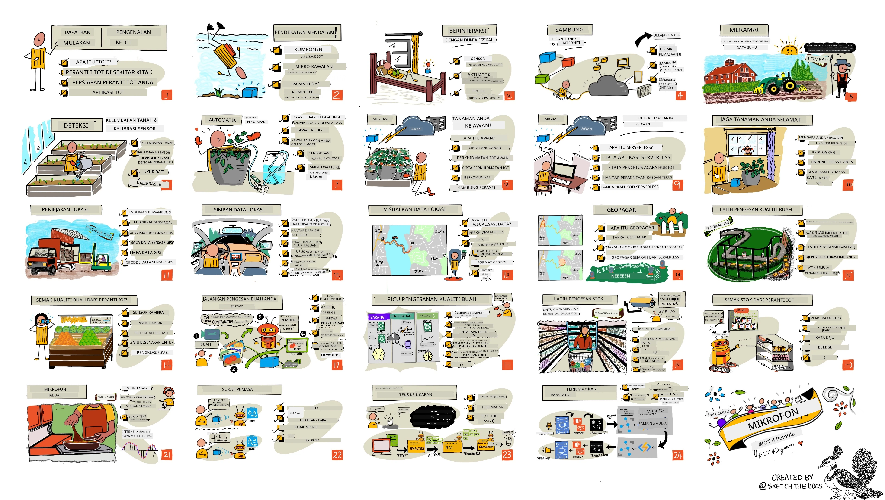

[](https://github.com/microsoft/IoT-For-Beginners/blob/master/LICENSE)
[](https://GitHub.com/microsoft/IoT-For-Beginners/graphs/contributors/)
[](https://GitHub.com/microsoft/IoT-For-Beginners/issues/)
[](https://GitHub.com/microsoft/IoT-For-Beginners/pulls/)
[](http://makeapullrequest.com)

[](https://GitHub.com/microsoft/IoT-For-Beginners/watchers/)
[](https://GitHub.com/microsoft/IoT-For-Beginners/network/)
[](https://GitHub.com/microsoft/IoT-For-Beginners/stargazers/)

### Sertai Komuniti Azure AI Foundry

Jika anda tersekat atau mempunyai sebarang soalan tentang membina aplikasi AI. Sertai pelajar lain dan pembangun berpengalaman dalam perbincangan mengenai MCP. Ia adalah komuniti yang menyokong di mana soalan dialu-alukan dan ilmu dikongsi secara bebas.

[](https://discord.gg/nTYy5BXMWG)

Jika anda mempunyai maklum balas produk atau ralat semasa pembinaan, lawati:

[](https://aka.ms/foundry/forum)

Ikuti langkah-langkah ini untuk mula menggunakan sumber ini:
1. **Garpu Repositori**: Klik [](https://GitHub.com/microsoft/IoT-For-Beginners/fork)
2. **Klon Repositori**:   `git clone https://github.com/microsoft/IoT-For-Beginners.git`
3. [**Sertai Discord Microsoft Foundry dan temui pakar serta rakan pembangun lain**](https://discord.com/invite/ByRwuEEgH4)


### 🌐 Sokongan Pelbagai Bahasa

#### Disokong melalui GitHub Action (Automatik & Sentiasa Dikemas Kini)

<!-- CO-OP TRANSLATOR LANGUAGES TABLE START -->
[Arabic](../ar/README.md) | [Bengali](../bn/README.md) | [Bulgarian](../bg/README.md) | [Burmese (Myanmar)](../my/README.md) | [Chinese (Simplified)](../zh-CN/README.md) | [Chinese (Traditional, Hong Kong)](../zh-HK/README.md) | [Chinese (Traditional, Macau)](../zh-MO/README.md) | [Chinese (Traditional, Taiwan)](../zh-TW/README.md) | [Croatian](../hr/README.md) | [Czech](../cs/README.md) | [Danish](../da/README.md) | [Dutch](../nl/README.md) | [Estonian](../et/README.md) | [Finnish](../fi/README.md) | [French](../fr/README.md) | [German](../de/README.md) | [Greek](../el/README.md) | [Hebrew](../he/README.md) | [Hindi](../hi/README.md) | [Hungarian](../hu/README.md) | [Indonesian](../id/README.md) | [Italian](../it/README.md) | [Japanese](../ja/README.md) | [Kannada](../kn/README.md) | [Khmer](../km/README.md) | [Korean](../ko/README.md) | [Lithuanian](../lt/README.md) | [Malay](./README.md) | [Malayalam](../ml/README.md) | [Marathi](../mr/README.md) | [Nepali](../ne/README.md) | [Nigerian Pidgin](../pcm/README.md) | [Norwegian](../no/README.md) | [Persian (Farsi)](../fa/README.md) | [Polish](../pl/README.md) | [Portuguese (Brazil)](../pt-BR/README.md) | [Portuguese (Portugal)](../pt-PT/README.md) | [Punjabi (Gurmukhi)](../pa/README.md) | [Romanian](../ro/README.md) | [Russian](../ru/README.md) | [Serbian (Cyrillic)](../sr/README.md) | [Slovak](../sk/README.md) | [Slovenian](../sl/README.md) | [Spanish](../es/README.md) | [Swahili](../sw/README.md) | [Swedish](../sv/README.md) | [Tagalog (Filipino)](../tl/README.md) | [Tamil](../ta/README.md) | [Telugu](../te/README.md) | [Thai](../th/README.md) | [Turkish](../tr/README.md) | [Ukrainian](../uk/README.md) | [Urdu](../ur/README.md) | [Vietnamese](../vi/README.md)

> **Lebih suka Klon Secara Tempatan?**
>
> Repositori ini termasuk lebih 50 terjemahan bahasa yang meningkatkan saiz muat turun dengan ketara. Untuk klon tanpa terjemahan, gunakan sparse checkout:
>
> **Bash / macOS / Linux:**
> ```bash
> git clone --filter=blob:none --sparse https://github.com/microsoft/IoT-For-Beginners.git
> cd IoT-For-Beginners
> git sparse-checkout set --no-cone '/*' '!translations' '!translated_images'
> ```
>
> **CMD (Windows):**
> ```cmd
> git clone --filter=blob:none --sparse https://github.com/microsoft/IoT-For-Beginners.git
> cd IoT-For-Beginners
> git sparse-checkout set --no-cone "/*" "!translations" "!translated_images"
> ```
>
> Ini memberikan anda segala yang anda perlukan untuk menamatkan kursus dengan muat turun yang lebih cepat.
<!-- CO-OP TRANSLATOR LANGUAGES TABLE END -->

# IoT untuk Pemula - Kurikulum

Penyokong Awan Azure di Microsoft dengan sukacitanya menawarkan kurikulum 12 minggu, 24 pelajaran yang semuanya mengenai asas IoT. Setiap pelajaran termasuk kuiz sebelum dan selepas pelajaran, arahan bertulis untuk menyiapkan pelajaran, penyelesaian, tugasan dan banyak lagi. Pedagogi berasaskan projek kami membolehkan anda belajar sambil membina, satu cara yang terbukti agar kemahiran baru 'melekat'.

Projek-projek merangkumi perjalanan makanan dari ladang ke meja. Ini merangkumi pertanian, logistik, pembuatan, runcit dan pengguna - semua kawasan industri popular untuk peranti IoT.



> Sketchnote oleh [Nitya Narasimhan](https://github.com/nitya). Klik imej untuk versi lebih besar.

**Terima kasih yang tidak terhingga kepada penulis kami [Jen Fox](https://github.com/jenfoxbot), [Jen Looper](https://github.com/jlooper), [Jim Bennett](https://github.com/jimbobbennett), dan artis sketchnote kami [Nitya Narasimhan](https://github.com/nitya).**

**Terima kasih juga kepada pasukan kami yang terdiri daripada [Duta Pelajar Microsoft Learn](https://studentambassadors.microsoft.com?WT.mc_id=academic-17441-jabenn) yang telah menyemak dan menterjemah kurikulum ini - [Aditya Garg](https://github.com/AdityaGarg00), [Anurag Sharma](https://github.com/Anurag-0-1-A), [Arpita Das](https://github.com/Arpiiitaaa), [Aryan Jain](https://www.linkedin.com/in/aryan-jain-47a4a1145/), [Bhavesh Suneja](https://github.com/EliteWarrior315), [Faith Hunja](https://faithhunja.github.io/), [Lateefah Bello](https://www.linkedin.com/in/lateefah-bello/), [Manvi Jha](https://github.com/Severus-Matthew), [Mireille Tan](https://www.linkedin.com/in/mireille-tan-a4834819a/), [Mohammad Iftekher (Iftu) Ebne Jalal](https://github.com/Iftu119), [Mohammad Zulfikar](https://github.com/mohzulfikar), [Priyanshu Srivastav](https://www.linkedin.com/in/priyanshu-srivastav-b067241ba), [Thanmai Gowducheruvu](https://github.com/innovation-platform), dan [Zina Kamel](https://www.linkedin.com/in/zina-kamel/).**

Kenali pasukan!

[](https://youtu.be/-wippUJRi5k)

**Gif oleh** [Mohit Jaisal](https://linkedin.com/in/mohitjaisal)

> 🎥 Klik imej di atas untuk video mengenai projek!

> **Guru**, kami telah [menyediakan beberapa cadangan](for-teachers.md) tentang cara menggunakan kurikulum ini. Jika anda ingin mencipta pelajaran anda sendiri, kami juga telah menyertakan sebuah [templat pelajaran](lesson-template/README.md).

> **[Pelajar](https://aka.ms/student-page)**, untuk menggunakan kurikulum ini sendiri, garpu keseluruhan repo dan selesaikan tugasan secara sendiri, bermula dengan kuiz sebelum kuliah, kemudian baca kuliah dan selesaikan aktiviti lain. Cuba cipta projek dengan memahami pelajaran daripada menyalin kod penyelesaian; namun kod itu tersedia dalam folder /solutions dalam setiap pelajaran berorientasikan projek. Satu lagi idea adalah membentuk kumpulan belajar bersama kawan dan menjalani kandungan bersama. Untuk kajian lanjut, kami mengesyorkan [Microsoft Learn](https://docs.microsoft.com/users/jimbobbennett/collections/ke2ehd351jopwr?WT.mc_id=academic-17441-jabenn).

Untuk gambaran video kursus ini, lihat video ini:

[](https://youtube.com/watch?v=bccEMm8gRuc "Video promosi")

> 🎥 Klik imej di atas untuk video mengenai projek!

## Pedagogi

Kami telah memilih dua prinsip pedagogi semasa membina kurikulum ini: memastikan ia berasaskan projek dan turut mengandungi kuiz yang selalu. Pada akhir siri ini, pelajar akan telah membina sistem pemantauan dan penyiraman tumbuhan, penjejak kenderaan, penetapan kilang pintar untuk mengesan dan memeriksa makanan, dan pemasa memasak yang dikawal suara, serta mempelajari asas-asas Internet of Things termasuk bagaimana menulis kod peranti, sambung ke awan, menganalisis telemetri dan menjalankan AI di hujung.

Dengan memastikan kandungan sejajar dengan projek, proses menjadi lebih menarik bagi pelajar dan peningkatan pemahaman konsep akan bertambah baik.

Selain itu, kuiz berisiko rendah sebelum kelas menetapkan niat pelajar untuk mempelajari topik, manakala kuiz kedua selepas kelas memastikan pemahaman lebih mendalam. Kurikulum ini direka supaya fleksibel dan menyeronokkan serta boleh diambil sepenuhnya atau sebahagiannya. Projek-projek bermula kecil dan semakin kompleks pada akhir kitaran 12 minggu.

Setiap projek berasaskan perkakasan dunia sebenar yang tersedia kepada pelajar dan penggemar. Setiap projek melihat domain projek tertentu, menyediakan pengetahuan latar yang relevan. Untuk menjadi pembangun berjaya adalah berguna memahami domain di mana anda menyelesaikan masalah, memberikan pengetahuan latar ini membolehkan pelajar berfikir tentang penyelesaian IoT dan pembelajaran mereka dalam konteks jenis masalah dunia sebenar yang mungkin diminta untuk diselesaikan sebagai pembangun IoT. Pelajar belajar 'mengapa' penyelesaian dibina, dan mendapat penghargaan terhadap pengguna akhir.

## Perkakasan
Kami mempunyai dua pilihan perkakasan IoT untuk digunakan dalam projek bergantung pada keutamaan peribadi, pengetahuan bahasa pengaturcaraan atau keutamaan, matlamat pembelajaran dan ketersediaan. Kami juga menyediakan versi 'perkakasan maya' bagi mereka yang tidak mempunyai akses kepada perkakasan, atau ingin belajar lebih banyak sebelum membuat pembelian. Anda boleh membaca lebih lanjut dan mencari 'senarai membeli-belah' di [halaman perkakasan](./hardware.md), termasuk pautan untuk membeli kit lengkap daripada rakan kami di Seeed Studio.

> 💁 Temui [Kod Etika](CODE_OF_CONDUCT.md), [Penyumbangan](CONTRIBUTING.md), dan garis panduan [Terjemahan](..) kami. Kami mengalu-alukan maklum balas membina anda!
>
> 🔧 Ada masalah? Lihat [Panduan Penyelesaian Masalah](TROUBLESHOOTING.md) kami untuk penyelesaian masalah biasa.

## Setiap pelajaran merangkumi:

- sketchnote
- video tambahan pilihan
- kuiz pemanasan pra-pelajaran
- pelajaran bertulis
- untuk pelajaran berasaskan projek, panduan langkah demi langkah tentang cara membina projek
- pemeriksaan pengetahuan
- cabaran
- bacaan tambahan
- tugasan
- [kuiz pasca-pelajaran](https://ff-quizzes.netlify.app/en/)

> **Nota tentang kuiz**: Semua kuiz terkandung dalam folder quiz-app, dengan jumlah 48 kuiz masing-masing mengandungi tiga soalan. Ia dipautkan dari dalam pelajaran tetapi aplikasi kuiz boleh dijalankan secara tempatan atau dihantar ke Azure; ikut arahan di folder `quiz-app`. Ia sedang diterjemahkan secara beransur-ansur.

## Pelajaran

|       |              Nama Projek              |                       Konsep yang Diajarkan                       | Objektif Pembelajaran                                                                                                                                                 |                                                        Pelajaran Berkaitan                                                         |
| :---: | :------------------------------------: | :---------------------------------------------------------: | ------------------------------------------------------------------------------------------------------------------------------------------------------------------- | :--------------------------------------------------------------------------------------------------------------------------: |
|  01   | [Memulakan](./1-getting-started/README.md) |                     Pengenalan kepada IoT                     | Pelajari prinsip asas IoT dan blok binaan asas penyelesaian IoT seperti sensor dan perkhidmatan awan semasa anda menyediakan peranti IoT pertama anda |                      [Pengenalan kepada IoT](./1-getting-started/lessons/1-introduction-to-iot/README.md)                      |
|  02   | [Memulakan](./1-getting-started/README.md) |                   Penyelaman lebih dalam kepada IoT                    | Pelajari lebih lanjut tentang komponen sistem IoT, serta mikropengawal dan komputer papan tunggal                                                            |                        [Penyelaman lebih dalam kepada IoT](./1-getting-started/lessons/2-deeper-dive/README.md)                         |
|  03   | [Memulakan](./1-getting-started/README.md) | Berinteraksi dengan dunia fizikal menggunakan sensor dan aktuator | Pelajari tentang sensor untuk mengumpul data dari dunia fizikal, dan aktuator untuk menghantar maklum balas, semasa anda membina lampu malam                                           | [Berinteraksi dengan dunia fizikal menggunakan sensor dan aktuator](./1-getting-started/lessons/3-sensors-and-actuators/README.md) |
|  04   | [Memulakan](./1-getting-started/README.md) |             Sambungkan peranti anda ke Internet             | Pelajari bagaimana menyambungkan peranti IoT ke Internet untuk menghantar dan menerima mesej dengan menyambungkan lampu malam anda kepada broker MQTT                               |               [Sambungkan peranti anda ke Internet](./1-getting-started/lessons/4-connect-internet/README.md)                |
|  05   |            [Ladang](./2-farm/README.md)            |                    Ramal pertumbuhan tanaman                     | Pelajari cara meramal pertumbuhan tanaman menggunakan data suhu yang ditangkap oleh peranti IoT                                                                                  |                          [Ramal pertumbuhan tanaman](./2-farm/lessons/1-predict-plant-growth/README.md)                           |
|  06   |            [Ladang](./2-farm/README.md)            |                    Mengesan kelembapan tanah                     | Pelajari cara mengesan kelembapan tanah dan mengkalibrasi sensor kelembapan tanah                                                                                              |                          [Mengesan kelembapan tanah](./2-farm/lessons/2-detect-soil-moisture/README.md)                           |
|  07   |            [Ladang](./2-farm/README.md)            |                  Penyiraman tanaman automatik                   | Pelajari bagaimana mengautomasikan dan menjadualkan penyiraman menggunakan relay dan MQTT                                                                                                      |                      [Penyiraman tanaman automatik](./2-farm/lessons/3-automated-plant-watering/README.md)                       |
|  08   |            [Ladang](./2-farm/README.md)            |               Migrasikan tanaman anda ke awan               | Pelajari tentang awan dan perkhidmatan IoT yang dihoskan awan dan bagaimana menghubungkan tanaman anda kepada salah satu daripadanya daripada broker MQTT awam                                   |               [Migrasikan tanaman anda ke awan](./2-farm/lessons/4-migrate-your-plant-to-the-cloud/README.md)                |
|  09   |            [Ladang](./2-farm/README.md)            |         Migrasikan logik aplikasi anda ke awan         | Pelajari bagaimana anda boleh menulis logik aplikasi di awan yang bertindak balas kepada mesej IoT                                                                          |         [Migrasikan logik aplikasi anda ke awan](./2-farm/lessons/5-migrate-application-to-the-cloud/README.md)         |
|  10   |            [Ladang](./2-farm/README.md)            |                   Kekalkan keselamatan tanaman anda                    | Pelajari tentang keselamatan dengan IoT dan bagaimana menjaga tanaman anda selamat dengan kunci dan sijil                                                                          |                        [Kekalkan keselamatan tanaman anda](./2-farm/lessons/6-keep-your-plant-secure/README.md)                         |
|  11   |       [Pengangkutan](./3-transport/README.md)       |                      Penjejakan lokasi                      | Pelajari tentang penjejakan lokasi GPS untuk peranti IoT                                                                                                                   |                           [Penjejakan lokasi](./3-transport/lessons/1-location-tracking/README.md)                           |
|  12   |       [Pengangkutan](./3-transport/README.md)       |                     Simpan data lokasi                     | Pelajari bagaimana menyimpan data IoT untuk divisualisasikan atau dianalisis kemudian                                                                                                      |                         [Simpan data lokasi](./3-transport/lessons/2-store-location-data/README.md)                         |
|  13   |       [Pengangkutan](./3-transport/README.md)       |                   Visualisasikan data lokasi                   | Pelajari tentang memvisualisasikan data lokasi pada peta, dan bagaimana peta mewakili dunia 3d sebenar dalam 2 dimensi                                                            |                     [Visualisasikan data lokasi](./3-transport/lessons/3-visualize-location-data/README.md)                     |
|  14   |       [Pengangkutan](./3-transport/README.md)       |                          Geofence                          | Pelajari tentang geofence, dan bagaimana ia boleh digunakan untuk memberi amaran apabila kenderaan dalam rantaian bekalan hampir ke destinasi mereka                                           |                                   [Geofence](./3-transport/lessons/4-geofences/README.md)                                   |
|  15   |   [Pembuatan](./4-manufacturing/README.md)   |               Latih pengesan kualiti buah                | Pelajari tentang melatih pengklasifikasi imej di awan untuk mengesan kualiti buah                                                                                       |                 [Latih pengesan kualiti buah](./4-manufacturing/lessons/1-train-fruit-detector/README.md)                 |
|  16   |   [Pembuatan](./4-manufacturing/README.md)   |           Periksa kualiti buah dari peranti IoT            | Pelajari tentang menggunakan pengesan kualiti buah anda dari peranti IoT                                                                                                    |           [Periksa kualiti buah dari peranti IoT](./4-manufacturing/lessons/2-check-fruit-from-device/README.md)            |
|  17   |   [Pembuatan](./4-manufacturing/README.md)   |             Jalankan pengesan buah anda di tepi             | Pelajari tentang menjalankan pengesan buah anda pada peranti IoT di tepi                                                                                                |             [Jalankan pengesan buah anda di tepi](./4-manufacturing/lessons/3-run-fruit-detector-edge/README.md)             |
|  18   |   [Pembuatan](./4-manufacturing/README.md)   |        Picu pengesanan kualiti buah dari sensor        | Pelajari tentang mencetuskan pengesanan kualiti buah dari sensor                                                                                                        |        [Picu pengesanan kualiti buah dari sensor](./4-manufacturing/lessons/4-trigger-fruit-detector/README.md)         |
|  19   |          [Runcit](./5-retail/README.md)          |                   Latih pengesan stok                    | Pelajari bagaimana menggunakan pengesanan objek untuk melatih pengesan stok mengira stok dalam kedai                                                                                |                        [Latih pengesan stok](./5-retail/lessons/1-train-stock-detector/README.md)                         |
|  20   |          [Runcit](./5-retail/README.md)          |               Periksa stok dari peranti IoT                | Pelajari bagaimana memeriksa stok dari peranti IoT menggunakan model pengesanan objek                                                                                         |                     [Periksa stok dari peranti IoT](./5-retail/lessons/2-check-stock-device/README.md)                      |
|  21   |        [Pengguna](./6-consumer/README.md)        |             Kenal pasti ucapan dengan peranti IoT             | Pelajari bagaimana mengenal pasti ucapan dari peranti IoT untuk membina pemasa pintar                                                                                             |                  [Kenal pasti ucapan dengan peranti IoT](./6-consumer/lessons/1-speech-recognition/README.md)                  |
|  22   |        [Pengguna](./6-consumer/README.md)        |                     Fahami bahasa                     | Pelajari bagaimana memahami ayat yang diucapkan kepada peranti IoT                                                                                                           |                        [Fahami bahasa](./6-consumer/lessons/2-language-understanding/README.md)                        |
|  23   |        [Pengguna](./6-consumer/README.md)        |           Tetapkan pemasa dan berikan maklum balas lisan           | Pelajari bagaimana menetapkan pemasa pada peranti IoT dan memberi maklum balas lisan bila pemasa ditetapkan dan apabila tamat                                                    |                 [Tetapkan pemasa dan berikan maklum balas lisan](./6-consumer/lessons/3-spoken-feedback/README.md)                  |
|  24   |        [Pengguna](./6-consumer/README.md)        |                 Sokong pelbagai bahasa                  | Pelajari bagaimana menyokong pelbagai bahasa, kedua-dua bahasa yang digunakan dan respons dari pemasa pintar anda                                                               |                   [Sokong pelbagai bahasa](./6-consumer/lessons/4-multiple-language-support/README.md)                   |

## Akses luar talian

Anda boleh menjalankan dokumentasi ini secara luar talian dengan menggunakan [Docsify](https://docsify.js.org/#/). Fork repo ini, [pasang Docsify](https://docsify.js.org/#/quickstart) pada mesin tempatan anda, dan kemudian di folder root repo ini, taip `docsify serve`. Laman web akan dihidangkan pada port 3000 pada localhost anda: `localhost:3000`.

## Kuiz

Terima kasih kepada komuniti kerana menghoskan kuiz interaktif yang menguji pengetahuan anda pada setiap bab. Anda boleh menguji pengetahuan anda [di sini](https://ff-quizzes.netlify.app/en/) 

### PDF

Anda boleh menghasilkan PDF bagi kandungan ini untuk akses luar talian jika diperlukan. Untuk melakukannya, pastikan anda telah memasang [npm](https://docs.npmjs.com/downloading-and-installing-node-js-and-npm) dan jalankan arahan berikut di folder root repo ini:

```sh
npm i
npm run convert
```

### Slaid

Terdapat dek slaid untuk beberapa pelajaran dalam folder [slides](../../slides).


## Kurikulum Lain

Pasukan kami menghasilkan kurikulum lain! Lihat:

<!-- CO-OP TRANSLATOR OTHER COURSES START -->
### LangChain
[](https://aka.ms/langchain4j-for-beginners)
[](https://aka.ms/langchainjs-for-beginners?WT.mc_id=m365-94501-dwahlin)
[](https://github.com/microsoft/langchain-for-beginners?WT.mc_id=m365-94501-dwahlin)
---

### Azure / Edge / MCP / Agents
[](https://github.com/microsoft/AZD-for-beginners?WT.mc_id=academic-105485-koreyst)
[](https://github.com/microsoft/edgeai-for-beginners?WT.mc_id=academic-105485-koreyst)
[](https://github.com/microsoft/mcp-for-beginners?WT.mc_id=academic-105485-koreyst)
[](https://github.com/microsoft/ai-agents-for-beginners?WT.mc_id=academic-105485-koreyst)

---
 
### Siri Generatif AI
[](https://github.com/microsoft/generative-ai-for-beginners?WT.mc_id=academic-105485-koreyst)
[-9333EA?style=for-the-badge&labelColor=E5E7EB&color=9333EA)](https://github.com/microsoft/Generative-AI-for-beginners-dotnet?WT.mc_id=academic-105485-koreyst)
[-C084FC?style=for-the-badge&labelColor=E5E7EB&color=C084FC)](https://github.com/microsoft/generative-ai-for-beginners-java?WT.mc_id=academic-105485-koreyst)
[-E879F9?style=for-the-badge&labelColor=E5E7EB&color=E879F9)](https://github.com/microsoft/generative-ai-with-javascript?WT.mc_id=academic-105485-koreyst)

---
 
### Pembelajaran Teras
[](https://aka.ms/ml-beginners?WT.mc_id=academic-105485-koreyst)
[](https://aka.ms/datascience-beginners?WT.mc_id=academic-105485-koreyst)
[](https://aka.ms/ai-beginners?WT.mc_id=academic-105485-koreyst)
[](https://github.com/microsoft/Security-101?WT.mc_id=academic-96948-sayoung)
[](https://aka.ms/webdev-beginners?WT.mc_id=academic-105485-koreyst)
[](https://aka.ms/iot-beginners?WT.mc_id=academic-105485-koreyst)
[](https://github.com/microsoft/xr-development-for-beginners?WT.mc_id=academic-105485-koreyst)

---
 
### Siri Copilot
[](https://aka.ms/GitHubCopilotAI?WT.mc_id=academic-105485-koreyst)
[](https://github.com/microsoft/mastering-github-copilot-for-dotnet-csharp-developers?WT.mc_id=academic-105485-koreyst)
[](https://github.com/microsoft/CopilotAdventures?WT.mc_id=academic-105485-koreyst)
<!-- CO-OP TRANSLATOR OTHER COURSES END -->

## Pemberian kredit imej

Anda boleh mencari semua pemberian kredit untuk imej yang digunakan dalam kurikulum ini di mana diperlukan dalam [Attributions](./attributions.md).

---

<!-- CO-OP TRANSLATOR DISCLAIMER START -->
**Penafian**:  
Dokumen ini telah diterjemahkan menggunakan perkhidmatan terjemahan AI [Co-op Translator](https://github.com/Azure/co-op-translator). Walaupun kami berusaha untuk ketepatan, sila maklum bahawa terjemahan automatik mungkin mengandungi kesilapan atau ketidaktepatan. Dokumen asal dalam bahasa asalnya harus dianggap sebagai sumber yang sahih. Untuk maklumat kritikal, terjemahan profesional oleh manusia adalah disarankan. Kami tidak bertanggungjawab atas sebarang salah faham atau salah tafsir yang timbul daripada penggunaan terjemahan ini.
<!-- CO-OP TRANSLATOR DISCLAIMER END -->