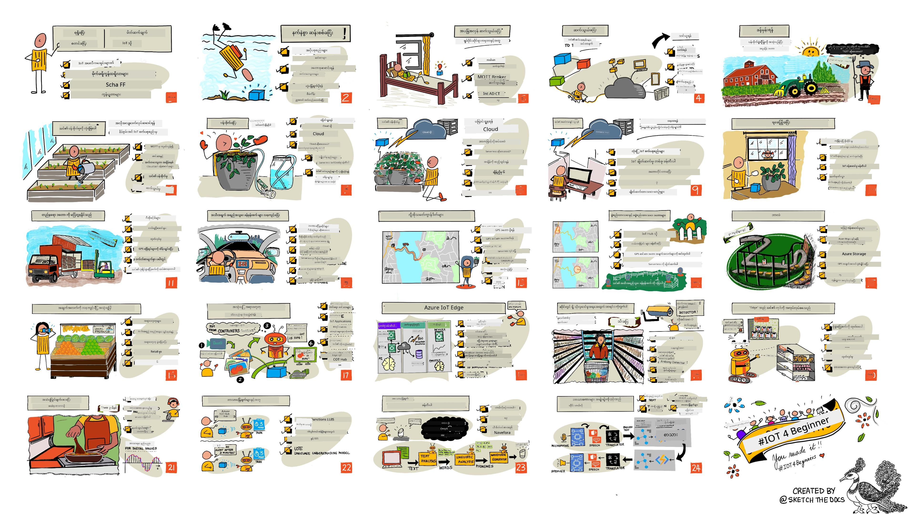

<!--
CO_OP_TRANSLATOR_METADATA:
{
  "original_hash": "6c354ec3487e4f6cfafbe44557996cd9",
  "translation_date": "2026-01-06T21:28:07+00:00",
  "source_file": "README.md",
  "language_code": "my"
}
-->
[](https://github.com/microsoft/IoT-For-Beginners/blob/master/LICENSE)
[](https://GitHub.com/microsoft/IoT-For-Beginners/graphs/contributors/)
[](https://GitHub.com/microsoft/IoT-For-Beginners/issues/)
[](https://GitHub.com/microsoft/IoT-For-Beginners/pulls/)
[](http://makeapullrequest.com)

[](https://GitHub.com/microsoft/IoT-For-Beginners/watchers/)
[](https://GitHub.com/microsoft/IoT-For-Beginners/network/)
[](https://GitHub.com/microsoft/IoT-For-Beginners/stargazers/)

### Azure AI Foundry Community တွင် ပါဝင်ဆည်းပူးပါ

AI အက်ပလီကေးရှင်းများ တည်ဆောက်ရာတွင် မသိသေးသည့်အခါ သို့မဟုတ် မေးခွန်းများရှိပါက MCP အကြောင်း ဆွေးနွေးမှုများတွင် အတူတူ လေ့လာသူများနှင့် အတွေ့အကြုံရှိ လုပ်ငန်းဆောင်ရွက်သူများနှင့် ဆွေးနွေးပါ။ မေးခွန်းများကို ကြိုဆိုခြင်းနဲ့ သိမြင်မှုများကို လွတ်လပ်စွာ မျှဝေသည့် ပံ့ပိုးမှုရှိသော အသိုင်းအဝိုင်းတစ်ခု ဖြစ်ပါသည်။

[](https://discord.gg/nTYy5BXMWG)

ထုတ်ကုန်အကြံပြုချက်များ သို့မဟုတ် တည်ဆောက်မှုအတွင်း အမှားများရှိပါက ဒီနေရာကို သွားရောက်ကြည့်ရှုနိုင်ပါသည်။

[](https://aka.ms/foundry/forum)

ဤအရင်းအမြစ်များကို အသုံးပြု၍ စတင်ရန် အဆင့်လိုက် လုပ်ဆောင်ပါ-
1. **Repository ကို Fork လုပ်ပါ**: Click [](https://GitHub.com/microsoft/IoT-For-Beginners/fork)
2. **Repository ကို Clone လုပ်ပါ**:   `git clone https://github.com/microsoft/IoT-For-Beginners.git`
3. [**Microsoft Foundry Discord တွင် ပါဝင်၍ ကျွမ်းကျင်ပညာရှင်များနှင့် လေ့လာသူများနှင့် တွေ့ဆုံပါ**](https://discord.com/invite/ByRwuEEgH4)


### 🌐 ဘာသာစကား များစွာအတွက် အထောက်အပံ့

#### GitHub Action ဖြင့် ထောက်ပံ့သည် (အလိုအလျောက်နှင့် အမြဲတမ်း အပ်ဒိတ်ဖြစ်နေ)

<!-- CO-OP TRANSLATOR LANGUAGES TABLE START -->
[Arabic](../ar/README.md) | [Bengali](../bn/README.md) | [Bulgarian](../bg/README.md) | [Burmese (Myanmar)](./README.md) | [Chinese (Simplified)](../zh/README.md) | [Chinese (Traditional, Hong Kong)](../hk/README.md) | [Chinese (Traditional, Macau)](../mo/README.md) | [Chinese (Traditional, Taiwan)](../tw/README.md) | [Croatian](../hr/README.md) | [Czech](../cs/README.md) | [Danish](../da/README.md) | [Dutch](../nl/README.md) | [Estonian](../et/README.md) | [Finnish](../fi/README.md) | [French](../fr/README.md) | [German](../de/README.md) | [Greek](../el/README.md) | [Hebrew](../he/README.md) | [Hindi](../hi/README.md) | [Hungarian](../hu/README.md) | [Indonesian](../id/README.md) | [Italian](../it/README.md) | [Japanese](../ja/README.md) | [Kannada](../kn/README.md) | [Korean](../ko/README.md) | [Lithuanian](../lt/README.md) | [Malay](../ms/README.md) | [Malayalam](../ml/README.md) | [Marathi](../mr/README.md) | [Nepali](../ne/README.md) | [Nigerian Pidgin](../pcm/README.md) | [Norwegian](../no/README.md) | [Persian (Farsi)](../fa/README.md) | [Polish](../pl/README.md) | [Portuguese (Brazil)](../br/README.md) | [Portuguese (Portugal)](../pt/README.md) | [Punjabi (Gurmukhi)](../pa/README.md) | [Romanian](../ro/README.md) | [Russian](../ru/README.md) | [Serbian (Cyrillic)](../sr/README.md) | [Slovak](../sk/README.md) | [Slovenian](../sl/README.md) | [Spanish](../es/README.md) | [Swahili](../sw/README.md) | [Swedish](../sv/README.md) | [Tagalog (Filipino)](../tl/README.md) | [Tamil](../ta/README.md) | [Telugu](../te/README.md) | [Thai](../th/README.md) | [Turkish](../tr/README.md) | [Ukrainian](../uk/README.md) | [Urdu](../ur/README.md) | [Vietnamese](../vi/README.md)

> **ဒေတာများကို ဒေသခံတွင် Clone လုပ်ရန် မွန်မာပါတယ်။**

> ဤ repository တွင် ဘာသာစကား ၅၀ ကျော် ဘာသာပြန်ချက်များ ပါဝင်သည်၊ ၎င်းကြောင့် ဒေါင်းလုပ်ရမည့်အရွယ်အစား ကြီးမားပါသည်။ ဘာသာပြန်ချက်များ မပါဝင်ဘဲ Clone လုပ်ချင်ရင် sparse checkout ကို သုံးပါ-
> ```bash
> git clone --filter=blob:none --sparse https://github.com/microsoft/IoT-For-Beginners.git
> cd IoT-For-Beginners
> git sparse-checkout set --no-cone '/*' '!translations' '!translated_images'
> ```
> ဒီနည်းနဲ့ သင်အတန်းပြီးဆုံးအောင် လိုအပ်တဲ့ အရာအားလုံးကို အလွန်လျင်မြန်စွာ ဒေါင်းလုပ် လုပ်နိုင်ပါသည်။
<!-- CO-OP TRANSLATOR LANGUAGES TABLE END -->

# စတားများအတွက် IoT - ကိုယ်ပိုင် သင်ရိုးအစီအစဉ်

Microsoft ရဲ့ Azure Cloud Advocates များက အခြေခံ IoT သင်ရိုးအစီအစဉ် ၁၂ ပတ်၊ သင်ခန်းစာ ၂၄ ခုပါဝင်တဲ့ သင်ရိုးအစီအစဉ်ကို ပေးအပ်ခြင်းငှါ ဝမ်းသာကြောင်း ပြောကြားပါတယ်။ သင်ခန်းစာတိုင်းတွင် သင်ခန်းစာမတိုင်မီ နှင့် သင်ခန်းစာပြီးနောက် မေးခွန်းများ၊ သင်ခန်းစာ ပြီးမြောက်ရန် လမ်းညွှန်ချက်များ၊ ဖြေရှင်းချက် တစ်ခု၊ လေ့ကျင့်ခန်း များပါဝင်သည်။ ကျွန်ုပ်တို့၏ ပရောဂျက်အခြေပြု သင်ကြားပုံစံသည် သင်ယူသူများ အတူတကွ တည်ဆောက်မှုလုပ်ရာတွင် သင်ယူနိုင်ခြင်းကို အာမခံကာ ကောင်းမွန်စွာ ကျင့်သုံးနိုင်စေပါသည်။

ဤပရောဂျက်များသည် စားနပ်ရိက္ခာ၏ လယ်ယာမှ စားပွဲထိ သွားရှိမှု ခရီးစဉ်ကို ဖော်ပြသည်။ လယ်ယာလုပ်ငန်း၊ ကုန်ပို့ရေး၊ ထုတ်လုပ်မှု၊ လက်လီရောင်းချမှုနှင့် စားသုံးသူ အစရှိသည့် IoT စက်ပစ္စည်းများအတွက် အကြမ်းဖျဉ်း လုပ်ငန်းခွဲများ ဖြည်းဖြည်းစွာ ပါဝင်သည်။



> Sketchnote ကို [Nitya Narasimhan](https://github.com/nitya) ရေးဆွဲထားသည်။ ပုံကို နှိပ်၍ ပိုကြီးသည့် ဗားရှင်းကို ကြည့်ရှုနိုင်သည်။

**ကျေးဇူးတင်စကား မြောက်များစွာအား ကျွန်ုပ်တို့၏ ကုဒ်ရေးသူများ [Jen Fox](https://github.com/jenfoxbot), [Jen Looper](https://github.com/jlooper), [Jim Bennett](https://github.com/jimbobbennett) နှင့် sketchnote အနုပညာရှင် [Nitya Narasimhan](https://github.com/nitya) သို့ ပေးအပ်လိုက်ပါသည်။**

**သင်ကြားမှုကို ပြန်လည်စိစစ်ခြင်းနှင့် ဘာသာပြန်ခြင်းတွင် ပါဝင်ကူညီသော [Microsoft Learn Student Ambassadors](https://studentambassadors.microsoft.com?WT.mc_id=academic-17441-jabenn) အဖွဲ့အားလုံးကိုလည်း ကျေးဇူးတင်ပါတယ္ - [Aditya Garg](https://github.com/AdityaGarg00), [Anurag Sharma](https://github.com/Anurag-0-1-A), [Arpita Das](https://github.com/Arpiiitaaa), [Aryan Jain](https://www.linkedin.com/in/aryan-jain-47a4a1145/), [Bhavesh Suneja](https://github.com/EliteWarrior315), [Faith Hunja](https://faithhunja.github.io/), [Lateefah Bello](https://www.linkedin.com/in/lateefah-bello/), [Manvi Jha](https://github.com/Severus-Matthew), [Mireille Tan](https://www.linkedin.com/in/mireille-tan-a4834819a/), [Mohammad Iftekher (Iftu) Ebne Jalal](https://github.com/Iftu119), [Mohammad Zulfikar](https://github.com/mohzulfikar), [Priyanshu Srivastav](https://www.linkedin.com/in/priyanshu-srivastav-b067241ba), [Thanmai Gowducheruvu](https://github.com/innovation-platform), နှင့် [Zina Kamel](https://www.linkedin.com/in/zina-kamel/).**

အဖွဲ့သားများနှင့် ပျော်ပါစေ!

[](https://youtu.be/-wippUJRi5k)

**Gif ကို** [Mohit Jaisal](https://linkedin.com/in/mohitjaisal) မှ ဖန်တီးထားသည်။

> 🎥 ပရောဂျက်အကြောင်း Video တစ်ခုကြည့်ရန် ပုံကို နှိပ်ပါ!

> **ဆရာ/ဆရာမများအတွက်**, ဤသင်ရိုးအစီအစဉ်ကို ဘယ်လိုအသုံးပြုရမည်နှင့် လမ်းညွှန်ချက် များကို တင်ပြထားသည်။ သင်က မိမိကိုယ်တိုင်သင်ခန်းစာများ ဖန်တီးလိုပါက [lesson template](lesson-template/README.md) ကိုပါ ထည့်သွင်းပေးထားသည်။

> **[ကျောင်းသားများ](https://aka.ms/student-page)**, သင်တန်းကို ကိုယ်တိုင်အသုံးပြုလိုပါက စုစုပေါင်း repository ကို fork လုပ်ပြီး ကိုယ်တိုင် လေ့ကျင့်ခန်းများကို အစပြု၊ သင်ခန်းစာမတိုင်မီ မေးခွန်းဖြေခြင်း၊ သင်ခန်းစာ ဖတ်ခြင်းနှင့် လုပ်ဆောင်ရမည့် အခြားလှုပ်ရှားမှုများ ပြီးမြောက်အောင်ပါ။ ဖြေရှင်းနည်းကုဒ်ကို မျှတကောင်းကောင်း နားလည်မှ အသုံးပြုပြီး project များ ဖန်တီးရန် ကြိုးစားပါ; အဆိုပါကုဒ်များသည် project ရည်ရွယ်ချက် တိုင်းရှိ /solutions ဖိုလ်ဒါတွေအတွင်း တွေ့နိုင်ပါသည်။ လေ့လာသူမိတ်ဆွေများနှင့် စတတ်ဂရုပ်ဖွဲ့ပြီး အတူတကွ လေ့လာခြင်းလည်း ရနိုင်ပါသည်။ ပိုမိုအကြံပြုရန် [Microsoft Learn](https://docs.microsoft.com/users/jimbobbennett/collections/ke2ehd351jopwr?WT.mc_id=academic-17441-jabenn) ကို 推薦 ပြုထားပါသည်။

ဤသင်တန်း၏ ရုပ်သံ မိတ်ဆက်ကိုအောက်တွင်ကြည့်ရှုပါ-

[](https://youtube.com/watch?v=bccEMm8gRuc "Promo video")

> 🎥 ပရောဂျက်အကြောင်း Video တစ်ခုကြည့်ရန် ပုံကို နှိပ်ပါ!

## သင်ကြားပုံ

ငါတို့သည် ဤသင်ရိုးအစီအစဉ်ကို တည်ဆောက်ရာတွင် ပရောဂျက်အခြေပြုပုံစံဖြစ်စေရန်နှင့် မေးခွန်းများကို မကြာခဏထည့်သွင်းသုံးထားခြင်းဖြစ်စေရန် နှစ်ခုကို ရွေးချယ်ထားသည်။ ဤအကြောင်းအရာတွင် ကျောင်းသားများသည် စပါးစိုက်ပျိုးရေးစနစ်၊ ယာဉ်လမ်းကြောင်းခြေရာခံစနစ်၊ စားနပ်ရိက္ခာစစ်ဆေးချက်များနှင့် စားသောက်ဆိုင်လုပ်ငန်းများ စသည်တို့ကို တည်ဆောက်ပြီး IoT ရဲ့ အခြေခံအချက်များဖြစ်သော ကိရိယာကုဒ်ရေးခြင်း၊ cloud နှင့် ချိတ်ဆက်ခြင်း၊ telemetry ကို သုံးသုံးသပ်ခြင်းနှင့် အံ့ဩဖွယ် AI ကို edge တွင် အသုံးပြုပုံများကို သင်ယူရမည် ဖြစ်သည်။

ပရောဂျက်များနှင့် အကြောင်းအရာ ကိုက်ညီမှုများ တိုးမြှင့်ခြင်းအားဖြင့် ကျောင်းသားများအတွက် ပိုမိုစိတ်ဝင်စားစေပြီး သဘောတရားများကို ပိုမို မှတ်မိနိုင်စေသည်။

အတန်းမတိုင်မီ မေးခွန်းများဖြေခြင်းသည် ကျောင်းသားများကို သင်ယူရန် ရည်ရွယ်ချက် တစ်ခု သတ်မှတ်ပေးပြီး၊ အတန်းပြီးနောက် မေးခွန်းတစ်ခုနောက်ထပ်ဖြေခြင်းဖြင့် အကြောင်းအရာကို ပိုမို မှတ်မိစေသည်။ ဤသင်ရိုးအစီအစဉ်သည် လိုရင်းနှင့် ပျော်ရွှင်မှု့အပြည့်ရှိသော ပုံစံဖြစ်ပြီး အဆင်ပြေသလို ဧည့်ခံ၍ သင်ယူနိုင်ပါသည်။ ပရောဂျက်များသည် ပထမက လွယ်ကူစပြီး ၁၂ ပတ်ကုန်တွင် ပိုမိုရှုပ်ထွေးလာသည်။

ပရောဂျက်တိုင်းသည် ကျောင်းသားများနှင့် အလေ့အကျင့်ပြုသူများ၏ လက်တွေ့အသုံးပြုနိုင်သော ဟာ့ဒ်ဝဲများ ပတ်လည်ထားသည်။ ပရောဂျက်များသည် အထူးသဖြင့် အလုပ်ရဲ့ သက်ဆိုင်ရာ အကြောင်းအရာကို ဖော်ပြထားပြီး မည်သည့် IoT ဖြေရှင်းမှုများကို ဖန်တီးရမည်ဆိုသည်ကို နားလည်မှု ပေးရန် ရည်ရွယ်သည်။ လုပ်ဆောင်ရမည့် လုပ်ငန်းခွဲကို နားလည်ခြင်းသည် အောင်မြင်သော ဖန်တီးသူ ဖြစ်စေရန် အရေးကြီးပြီး အဆုံးတိုင် အသုံးပြုသူအတွက် တန်ဖိုးရှိမှုကို နားလည်စေသည်။

## ဟာ့ဒ်ဝဲ

ကျွန်ုပ်တို့တွင်ပုဂ္ဂိုလ်ရေး မျှော်လင့်ချက်များ၊ ပရိုဂရမ်မင်းဘာသာစကား ဒါရိုက်တာများ၊ သင်ယူလိုသည့် ရည်မှန်းချက်များနှင့် လက်လီရရှိမှုအပေါ် မှီငြမ်းပြီး IoT ဟာ့ဒ်ဝဲ နှစ်မျိုးရှိသည်။ ဟာ့ဒ်ဝဲ မရှိသူများအတွက် သို့မဟုတ် ဈေးဝယ်ရန် မတည့်ခင်ပိုမိုလေ့လာလိုသူများအတွက် ‘အမြင့်ပုံမှန် ဟာ့ဒ်ဝဲ’ ဗားရှင်းကိုလည်း ပေးထားပါသည်။ ပိုမိုဖတ်ရှုလိုပါက [hardware page](./hardware.md) တွင် မိတ်ဆွေများ Seeed Studio မှ ပရောဂျက် ကြည့်ရှုရန် အတွက် စပ်စုခြင်းနှင့် အသေးစိတ် ဝယ်ယူမည်ဟာ့ဒ်ဝဲစာရင်းများ ပါဝင်သည်။
> 💁 ကျွန်ုပ်တို့ရဲ့ [ကျင့်ဝတ်သဘောတူချက်](CODE_OF_CONDUCT.md), [လှုပ်ရှားမှုတွင်ပါဝင်ခြင်း](CONTRIBUTING.md) နှင့် [ဘာသာပြန်ခြင်း](TRANSLATIONS.md) လမ်းညွှန်ချက်များကိုရှာဖွေကြည့်ပါ။ သင့်၏တည်ဆောက်မှုပေးသည့်အကြံပေးချက်များကိုကြိုဆိုပါသည်။
>
> 🔧 ပြဿနာတက်နေသလား? ပုံမှန်ပြဿနာများအတွက်ဖြေရှင်းနည်းများကိုကြည့်ရှုရန် ကျွန်ုပ်တို့ရဲ့ [ပြဿနာဖြေရှင်းလမ်းညွှန်](TROUBLESHOOTING.md) ကိုစစ်ဆေးပါ။

## တစ်ခုချင်းစီသောသင်ခန်းစာတွင်ပါဝင်သည် -

- စကက်ချ်နိုက်
- ရွေးချယ်စရာထောက်ပံ့ပေးဗီဒီယို
- သင်ခန်းစာမတိုင်မီအပူပြင်စမ်းသပ်မေးခွန်း
- စာသားဖြင့်ရေးသားထားသောသင်ခန်းစာ
- စီမံကိန်းအခြေပြုသင်ခန်းစာများအတွက် စီမံကိန်းဆောက်လုပ်နည်းအဆင့်မြှင့်လမ်းညွှန်များ
- နားလည်မှုပြုစစ်မှုများ
- စိန်ခေါ်မှုတစ်ခု
- ထောက်ပံ့ဖတ်စာများ
- ပို့စ်သင်ခန်းစာမေးခွန်း [post-lesson quiz](https://ff-quizzes.netlify.app/en/)

> **မေးခွန်းများအကြောင်းမှတ်ချက်** - မေးခွန်းများအားလုံးကို quiz-app ဖိုလ်ဒါတွင်ထားရှိထားပြီး မေးခွန်းသုံးခုပါသော စုစုပေါင်းမေးခွန်း ၄၈ ခုရှိသည်။ ထိုမေးခွန်းများကိုသင်ခန်းစာများမှလင့်ခ်တင်ထားသော်လည်း quiz app ကို ကိုယ်ပိုင်စက်တွင် run ထားနိုင်ပြီး Azure သို့ deploy လုပ်နိုင်သည်။ quiz-app ဖိုလ်ဒါအတွင်းရှိညွှန်ကြားချက်များကိုလိုက်နာပါ။ မေးခွန်းများကိုတဖြည်းဖြည်း ဒေသန္တရပြုလုပ်နေသည်။

## သင်ခန်းစာများ

|       |              စီမံကိန်းအမည်              |                       သင်ကြားသောအယူအဆများ                       | သင်ယူရမည့်ရည်မှန်းချက်များ                                                                                                                                                 |                                                        လင့်ခ်ထားသောသင်ခန်းစာ                                                         |
| :---: | :------------------------------------: | :---------------------------------------------------------: | ------------------------------------------------------------------------------------------------------------------------------------------------------------------- | :--------------------------------------------------------------------------------------------------------------------------: |
|  01   | [စတင်အသုံးပြုခြင်း](./1-getting-started/README.md) |                     IoT အတွက်မိတ်ဆက်                     | IoT အခြေခံခံယူချက်များနှင့် ဆင်ဆာများ၊ မိုကလောင်းဝန်ဆောင်မှုများကဲ့သို့ IoT ဖြေရှင်းချက်များ၏အခြေခံအဆောက်အအုံများကို သင်ယူပြီး သင့်ပထမဆုံး IoT စက်ပစ္စည်းကိုဆက်တင်ခြင်း                                                                       |                      [IoT မိတ်ဆက်ခြင်း](./1-getting-started/lessons/1-introduction-to-iot/README.md)                      |
|  02   | [စတင်အသုံးပြုခြင်း](./1-getting-started/README.md) |                   IoT တွင်နက်ရှိုင်းစွာခွဲခြမ်းစိတ်ဖြာခြင်း                    | IoT စနစ်၏ အစိတ်အပိုင်းများ၊ မိုက်ခရိုကွန်ထရိုလာများနှင့် တစ်ပတိယသုတ်ကပ်ကွန်ပျူတာများအကြောင်း အများကြီး လေ့လာသိရှိခြင်း                                                            |                        [IoT တွင်နက်ရှိုင်းစွာခွဲခြမ်းစိတ်ဖြာခြင်း](./1-getting-started/lessons/2-deeper-dive/README.md)                         |
|  03   | [စတင်အသုံးပြုခြင်း](./1-getting-started/README.md) | ဆင်ဆာများနှင့် အက်တူးအေးတာများဖြင့် ရုပ်ပိုင်းဆိုင်ရာကမ္ဘာနှင့် ဆက်သွယ်ခြင်း | ရုပ်ပိုင်းဆိုင်ရာကမ္ဘာမှ ဒေတာစုဆောင်းရန် ဆင်ဆာများအကြောင်းနှင့် တုံ့ပြန်ချက်ပို့ရန် အက်တူးအေးတာများအကြောင်း အသိပညာဖြင့် နက်ထိုက်အလင်းတောက်တောင့် ဖန်တီးခြင်း                                           | [ဆင်ဆာများနှင့် အက်တူးအေးတာများဖြင့် ရုပ်ပိုင်းဆိုင်ရာကမ္ဘာနှင့် ဆက်သွယ်ခြင်း](./1-getting-started/lessons/3-sensors-and-actuators/README.md) |
|  04   | [စတင်အသုံးပြုခြင်း](./1-getting-started/README.md) |             သင့်ကိရိယာကို အင်တာနက်နှင့် ချိတ်ဆက်ခြင်း             | သင့်အလင်းတောက်တောင့်ကို MQTT broker သို့ချိတ်ဆက်ခြင်းဖြင့် IoT စက်ပစ္စည်းကို အင်တာနက်တစ်ဆင့် စာတိုက်ပို့ခြင်းနှင့် လက်ခံခြင်းကိုသိရှိခြင်း                               |               [သင့်ကိရိယာကို အင်တာနက်နှင့် ချိတ်ဆက်ခြင်း](./1-getting-started/lessons/4-connect-internet/README.md)                |
|  05   |            [လယ်ယာ](./2-farm/README.md)            |                    ပင်လယ်ကြွယ်ဝမှုခန့်မှန်းခြင်း                     | IoT စက်ပစ္စည်းမှ ဖမ်းဆီးသည့် အပူချိန်ဒေတာဖြင့်အပင်ကြီးထွားမှုကို ခန့်မှန်းပုံသင်ယူပါ                                                                                  |                          [ပင်လယ်ကြွယ်ဝမှုခန့်မှန်းခြင်း](./2-farm/lessons/1-predict-plant-growth/README.md)                           |
|  06   |            [လယ်ယာ](./2-farm/README.md)            |                    မြေညစ်ညမ်းမှုကိုလွှမ်းခြုံရန်                     | မြေညစ်ညမ်းမှုကို စစ်ဆေးခြင်းနှင့် မြေညစ်ညမ်းမှုဆင်ဆာကို ပြင်ဆင်ခြင်းအကြောင်းသင်ကြားပါ                                                                                              |                          [မြေညစ်ညမ်းမှုကိုလွှမ်းခြုံရန်](./2-farm/lessons/2-detect-soil-moisture/README.md)                           |
|  07   |            [လယ်ယာ](./2-farm/README.md)            |                  အလိုအလျောက်အပင်များသစ်ရေနှင့် အပူကျောင်းချိန်သတ်မှတ်ခြင်း                   | relay နှင့် MQTT ကို အသုံးပြုပြီး အလိုအလျောက်အပူကျောင်းချိန်သတ်မှတ်ခြင်းနည်းလမ်းကိုသင်ယူပါ                                                                                                      |                      [အလိုအလျောက်အပင်များသစ်ရေနှင့် အပူကျောင်းချိန်သတ်မှတ်ခြင်း](./2-farm/lessons/3-automated-plant-watering/README.md)                       |
|  08   |            [လယ်ယာ](./2-farm/README.md)            |               သင်၏အပင်ကို cloud သို့ ပြောင်းရွှေ့ခြင်း               | cloud နှင့် cloud-hosted IoT ဝန်ဆောင်မှုများအကြောင်းနှင့် သင်၏အပင်ကို ပုဂ္ဂိုလ်ရေး MQTT broker အစား ၎င်းတို့ထဲတစ်ခုချိတ်ဆက်နည်းကို သင်ယူပါ                                   |               [သင်၏အပင်ကို cloud သို့ ပြောင်းရွှေ့ခြင်း](./2-farm/lessons/4-migrate-your-plant-to-the-cloud/README.md)                |
|  09   |            [လယ်ယာ](./2-farm/README.md)            |         သင့်လျှောက်လွှာနည်းဗျူဟာကို cloud သို့ ပြောင်းရွှေ့ခြင်း         | IoT စာတိုများအား အသိပညာတုံ့ပြန်မှုရှိလာရန် cloud တွင် လျှောက်လွှာနည်းဗျူဟာရေးသားနည်းသင်ယူပါ                                                                          |         [သင့်လျှောက်လွှာနည်းဗျူဟာကို cloud သို့ ပြောင်းရွှေ့ခြင်း](./2-farm/lessons/5-migrate-application-to-the-cloud/README.md)         |
|  10   |            [လယ်ယာ](./2-farm/README.md)            |                   သင့်အပင်ကို လုံခြုံစောင့်ရှောက်ပါ                    | IoT နှင့် လုံခြုံရေး၊ သော့များနှင့် လက်မှတ်များဖြင့် သင့်အပင်ကိုဘယ်လိုလုံခြုံစောင့်ရှောက်ရမည်ကို သင်ယူပါ                                                                          |                        [သင့်အပင်ကို လုံခြုံစောင့်ရှောက်ပါ](./2-farm/lessons/6-keep-your-plant-secure/README.md)                         |
|  11   |       [ရေကြောင်း](./3-transport/README.md)       |                      တည်နေရာခြေရာခံခြင်း                      | IoT စက်ပစ္စည်းများအတွက် GPS တည်နေရာခြေရာခံခြင်းအကြောင်းသင်ယူပါ                                                                                                                   |                           [တည်နေရာခြေရာခံခြင်း](./3-transport/lessons/1-location-tracking/README.md)                           |
|  12   |       [ရေကြောင်း](./3-transport/README.md)       |                     တည်နေရာဒေတာသိုလှောင်ခြင်း                     | နောက်ပိုင်းတွင် မြင်သာရန် သို့မဟုတ် ခွဲခြမ်းစိတ်ဖြာရန် IoT ဒေတာသိုလှောင်ခြင်းနည်းလမ်း                                                                    |                         [တည်နေရာဒေတာသိုလှောင်ခြင်း](./3-transport/lessons/2-store-location-data/README.md)                         |
|  13   |       [ရေကြောင်း](./3-transport/README.md)       |                   တည်နေရာဒေတာကိုလေ့လာမြင်ရခြင်း                   | တည်နေရာဒေတာကို မြေပုံပေါ်တွင်မြင်သာအောင်ပြသခြင်းနှင့်မြေပုံများသည် အမှန် 3d ကမ္ဘာကို 2 မิติဖြင့် ကိုယ်စားပြုခြင်းအကြောင်းသင်ယူပါ                                                            |                     [တည်နေရာဒေတာကိုလေ့လာမြင်ရခြင်း](./3-transport/lessons/3-visualize-location-data/README.md)                     |
|  14   |       [ရေကြောင်း](./3-transport/README.md)       |                          Geographic fences                          | Geofence များအကြောင်း၊ ပို့ဆောင်ရေးစီးရီးရှိယာဉ်များသည် သတ်မှတ်ထားသောနေရာများနှင့်အနီးကပ်ရှိသည်ဟု သတိပေးနိုင်ကြောင်း                                                            |                                   [Geofences](./3-transport/lessons/4-geofences/README.md)                                   |
|  15   |   [စက်မှုလုပ်ငန်း](./4-manufacturing/README.md)   |               အသီးအနှံ အရည်အသွေး ဖော်ထုတ်ကိရိယာလေ့ကျင့်ခြင်း                | အသီးအနှံအရည်အသွေးကိုဖော်ထုတ်ရန် cloud တွင် ပုံရိပ်ခွဲခြမ်းစိတ်ဖြာကိရိယာ သင်ကြားခြင်း                                                                                       |                 [အသီးအနှံ အရည်အသွေး ဖော်ထုတ်ကိရိယာလေ့ကျင့်ခြင်း](./4-manufacturing/lessons/1-train-fruit-detector/README.md)                 |
|  16   |   [စက်မှုလုပ်ငန်း](./4-manufacturing/README.md)   |           IoT စက်မှ အသီးအနှံအရည်အသွေး စစ်ဆေးခြင်း            | IoT စက်မှ အသီးအနှံအရည်အသွေးဖော်ထုတ်ကိရိယာကို အသုံးပြုခြင်းအကြောင်းသင်ကြားပါ                                                                                                    |           [IoT စက်မှ အသီးအနှံအရည်အသွေး စစ်ဆေးခြင်း](./4-manufacturing/lessons/2-check-fruit-from-device/README.md)            |
|  17   |   [စက်မှုလုပ်ငန်း](./4-manufacturing/README.md)   |             အသီးအနှံဖော်ထုတ်ကိရိယာကို edge တွင် run လုပ်ခြင်း             | IoT စက်ပစ္စည်းတွင် အသီးအနှံဖော်ထုတ်ကိရိယာကို edge တွင် run လုပ်ခြင်းအကြောင်းသင်ယူပါ                                                                                                |             [အသီးအနှံဖော်ထုတ်ကိရိယာကို edge တွင် run လုပ်ခြင်း](./4-manufacturing/lessons/3-run-fruit-detector-edge/README.md)             |
|  18   |   [စက်မှုလုပ်ငန်း](./4-manufacturing/README.md)   |        ဆင်ဆာမှအသီးအနှံအရည်အသွေးလေ့လာမှုကိုဖြောက်စွမ်းခြင်း        | ဆင်ဆာမှ အသီးအနှံအရည်အသွေးဖော်ထုတ်မှုကို trigger ချခြင်းအကြောင်းသင်ယူပါ                                                                                                        |        [ဆင်ဆာမှအသီးအနှံအရည်အသွေးလေ့လာမှုကိုဖြောက်စွမ်းခြင်း](./4-manufacturing/lessons/4-trigger-fruit-detector/README.md)         |
|  19   |          [လက်လီရောင်းသူ](./5-retail/README.md)          |                   စတော့အရေအတွက် ဖော်ထုတ်ကိရိယာလေ့ကျင့်ခြင်း                    | ဆိုင်မှ စတော့အရေအတွက်တွက်ချက်ရန် အရာဝတ္တုဖော်ထုတ်မှု ကိုသုံးပြီး စတော့ဖော်ထုတ်ကိရိယာလေ့ကျင့်ခြင်း                                                                          |                        [စတော့အရေအတွက် ဖော်ထုတ်ကိရိယာလေ့ကျင့်ခြင်း](./5-retail/lessons/1-train-stock-detector/README.md)                         |
|  20   |          [လက်လီရောင်းသူ](./5-retail/README.md)          |               IoT စက်မှ စတော့အရေအတွက်စစ်ဆေးခြင်း                | အရာဝတ္တုဖော်ထုတ်မှုမော်ဒယ်ကို အသုံးပြု၍ IoT စက်မှ စတော့အရေအတွက်စစ်ဆေးခြင်းအကြောင်းသင်ယူပါ                                                                                         |                     [IoT စက်မှ စတော့အရေအတွက်စစ်ဆေးခြင်း](./5-retail/lessons/2-check-stock-device/README.md)                      |
|  21   |        [စားသုံးသူ](./6-consumer/README.md)        |             IoT စက်မှ စကားအသံကို အသိအမှတ်ပြုခြင်း             | IoT စက်မှ စကားအသံများကို အသိအမှတ်ပြု၍ စမတ်တိုင်မားတစ်ခု တည်ဆောက်ခြင်းအကြောင်းသင်ယူပါ                                                                                             |                  [IoT စက်မှ စကားအသံကို အသိအမှတ်ပြုခြင်း](./6-consumer/lessons/1-speech-recognition/README.md)                  |
|  22   |        [စားသုံးသူ](./6-consumer/README.md)        |                     ဘာသာစကားကို နားလည်ခြင်း                     | IoT စက်ထံ ပြောဆိုသော စကားစုများကို နားလည်သဘောပေါက်ခြင်းနည်းလမ်း                                                                                                           |                        [ဘာသာစကားကို နားလည်ခြင်း](./6-consumer/lessons/2-language-understanding/README.md)                        |
|  23   |        [စားသုံးသူ](./6-consumer/README.md)        |           အချိန်တိုင်းတာကိရိယာတစ်ခုထားပြီး စကားပြောတုံ့ပြန်မှုပေးခြင်း           | IoT စက်တွင် အချိန်တိုင်းတာကိရိယာတစ်ခုထားသောအခါ၊ သိရှိတဲ့အချိန်နှင့် ပြီးဆုံးသောအချိန်တွင် စကားပြောတုံ့ပြန်မှုပေးနည်းသင်ယူပါ                                                    |                 [အချိန်တိုင်းတာကိရိယာတစ်ခုထားပြီး စကားပြောတုံ့ပြန်မှုပေးခြင်း](./6-consumer/lessons/3-spoken-feedback/README.md)                  |
|  24   |        [စားသုံးသူ](./6-consumer/README.md)        |                 ဘာသာစကားများစွာကို ထောက်ပံ့ပေးခြင်း                  | စမတ်တိုင်မားအားပြောဆိုရာတွင် နေရာတိုင်းဘာသာဖြင့်ဖြတ်သန်းနိုင်၍ ဖြေဆိုမှုများကိုလည်း ကောင်းမွန်စွာထောက်ပံ့ပေးနည်းသင်ယူပါ                                                               |                   [ဘာသာစကားများစွာကို ထောက်ပံ့ပေးခြင်း](./6-consumer/lessons/4-multiple-language-support/README.md)                   |

## အော့ဖ်လိုင်း အသုံးပြုခွင့်

ဒီစာရွက်စာတမ်းကို အော့ဖ်လိုင်းမှာ အသုံးပြုနိုင်ရန် [Docsify](https://docsify.js.org/#/) ကိုအသုံးပြုနိုင်သည်။ ဤ repo ကို fork လုပ်ပြီး၊ ကိုယ်ပိုင်စက်တွင် [Docsify ကို 설치](https://docsify.js.org/#/quickstart) ပြုလုပ်ပါ၊ ထို့နောက် ဤ repo ၏ root ဖိုလ်ဒါတွင် `docsify serve` ဟုရိုက်ထည့်လိုက်ပါ။ ဝဘ်ဆိုက်ကို localhost: port 3000 တွင်ပြသမည်ဖြစ်သည် - `localhost:3000`။

## မေးခွန်း

သင်ခန်းစာတစ်ခုချင်းစီတွင် သင်၏အသိပညာကိုစမ်းသပ်သော အပြန်အလှန်မေးခွန်းများကို ကျေးဇူးတင်စွာဖိတ်ခေါ်ပါသည်။ မေးခွန်းစစ်ဆေးသည့်နေရာကို [ဒီမှာ](https://ff-quizzes.netlify.app/en/) ဝင်ကြည့်နိုင်ပါသည်။

### PDF

လိုအပ်လျှင် ဒီအကြောင်းအရာ၏ PDF ကို အော့ဖ်လိုင်းအသုံးပြုခွင့်အတွက် ဖန်တီးနိုင်သည်။ အဲဒါလုပ်ရန် [npm ကို install ဆောင်ရွက်ထားရန်](https://docs.npmjs.com/downloading-and-installing-node-js-and-npm) သေချာစွာလုပ်ပြီး ဤ repo ၏ root ဖိုလ်ဒါတွင် အောက်ပါ command များကို run ပါ:

```sh
npm i
npm run convert
```

### စလိုက်များ

သင်ခန်းစာအချို့အတွက် စလိုက်ဒ်ဖိုင်များကို [slides](../../slides) ဖိုလ်ဒါတွင် တွေ့နိုင်ပါသည်။


## အခြား သင်ရိုးညွှန်းတမ်းများ

ကျွန်ုပ်တို့အသင်းသည် အခြား သင်ရိုးညွှန်းတမ်းများကို ထုတ်လုပ်ပါသည်! စစ်ဆေးကြည့်ပါ -

<!-- CO-OP TRANSLATOR OTHER COURSES START -->
### LangChain
[](https://aka.ms/langchain4j-for-beginners)
[](https://aka.ms/langchainjs-for-beginners?WT.mc_id=m365-94501-dwahlin)

---

### Azure / Edge / MCP / Agents
[](https://github.com/microsoft/AZD-for-beginners?WT.mc_id=academic-105485-koreyst)
[](https://github.com/microsoft/edgeai-for-beginners?WT.mc_id=academic-105485-koreyst)
[](https://github.com/microsoft/mcp-for-beginners?WT.mc_id=academic-105485-koreyst)
[](https://github.com/microsoft/ai-agents-for-beginners?WT.mc_id=academic-105485-koreyst)

---
 
### စတင်လေ့လာသူများအတွက် Generative AI စီးရီး
[](https://github.com/microsoft/generative-ai-for-beginners?WT.mc_id=academic-105485-koreyst)
[-9333EA?style=for-the-badge&labelColor=E5E7EB&color=9333EA)](https://github.com/microsoft/Generative-AI-for-beginners-dotnet?WT.mc_id=academic-105485-koreyst)
[-C084FC?style=for-the-badge&labelColor=E5E7EB&color=C084FC)](https://github.com/microsoft/generative-ai-for-beginners-java?WT.mc_id=academic-105485-koreyst)
[-E879F9?style=for-the-badge&labelColor=E5E7EB&color=E879F9)](https://github.com/microsoft/generative-ai-with-javascript?WT.mc_id=academic-105485-koreyst)

---
 
### အခြေခံလေ့လာမှုများ
[](https://aka.ms/ml-beginners?WT.mc_id=academic-105485-koreyst)
[](https://aka.ms/datascience-beginners?WT.mc_id=academic-105485-koreyst)
[](https://aka.ms/ai-beginners?WT.mc_id=academic-105485-koreyst)
[](https://github.com/microsoft/Security-101?WT.mc_id=academic-96948-sayoung)
[](https://aka.ms/webdev-beginners?WT.mc_id=academic-105485-koreyst)
[](https://aka.ms/iot-beginners?WT.mc_id=academic-105485-koreyst)
[](https://github.com/microsoft/xr-development-for-beginners?WT.mc_id=academic-105485-koreyst)

---
 
### Copilot စီးရီး
[](https://aka.ms/GitHubCopilotAI?WT.mc_id=academic-105485-koreyst)
[](https://github.com/microsoft/mastering-github-copilot-for-dotnet-csharp-developers?WT.mc_id=academic-105485-koreyst)
[](https://github.com/microsoft/CopilotAdventures?WT.mc_id=academic-105485-koreyst)
<!-- CO-OP TRANSLATOR OTHER COURSES END -->

## ပုံများ၏ မူပိုင်ခွင့်အညွှန်း

ဒီသင်ခန်းစာအစီအစဉ်တွင် အသုံးပြုထားသော ပုံများအတွက် မူပိုင်ခွင့်အညွှန်းအား [Attributions](./attributions.md) မှာလိုအပ်သလို ရှာဖွေနိုင်ပါသည်။

---

<!-- CO-OP TRANSLATOR DISCLAIMER START -->
**အကြောင်းကြားချက်**  
ဤစာတမ်းကို AI ဘာသာပြန်ဝန်ဆောင်မှု [Co-op Translator](https://github.com/Azure/co-op-translator) ဖြင့်ဘာသာပြန်ထားပါသည်။ မိမိတို့သည် တိကျမှန်ကန်မှုအတွက် ကြိုးစားထားပေမယ့် အလိုအလျောက်ဘာသာပြန်ခြင်းမှာ အမှားများ သို့မဟုတ် မှားယွင်းချက်များ ပါဝင်နိုင်ကြောင်း သတိပြုပါရန် ဖော်ပြပါသည်။ မူရင်းစာတမ်းသည် မူလဘာသာဖြင့်သာ တရားဝင်အရင်းအမြစ်အဖြစ်ယူဆသင့်ပါသည်။ အရေးကြီးသည့် သတင်းအချက်အလက်များအတွက် ပရော်ဖက်ရှင်နယ် လူငယ့်ဘာသာပြန်ခြင်းကို အကြံပြုပါသည်။ ဤဘာသာပြန်ချက် အသုံးပြုမှုကြောင့် ဖြစ်ပေါ်လာနိုင်သည့် နားမလည်မှုများ သို့မဟုတ် ပေါက်ထားမှုများအတွက် တာဝန်မခံပါ။
<!-- CO-OP TRANSLATOR DISCLAIMER END -->