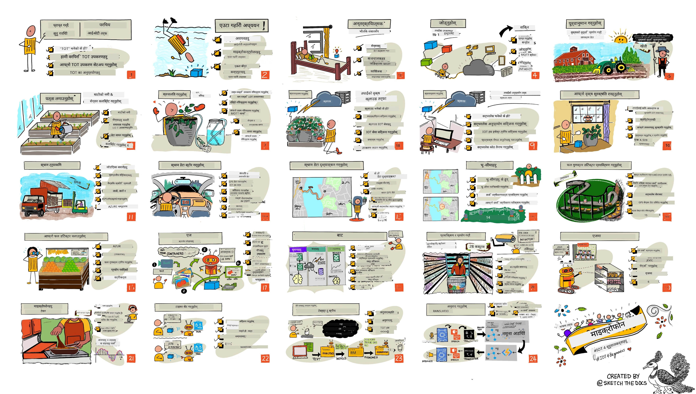

<!--
CO_OP_TRANSLATOR_METADATA:
{
  "original_hash": "6c354ec3487e4f6cfafbe44557996cd9",
  "translation_date": "2026-01-05T21:49:57+00:00",
  "source_file": "README.md",
  "language_code": "ne"
}
-->
[](https://github.com/microsoft/IoT-For-Beginners/blob/master/LICENSE)
[](https://GitHub.com/microsoft/IoT-For-Beginners/graphs/contributors/)
[](https://GitHub.com/microsoft/IoT-For-Beginners/issues/)
[](https://GitHub.com/microsoft/IoT-For-Beginners/pulls/)
[](http://makeapullrequest.com)

[](https://GitHub.com/microsoft/IoT-For-Beginners/watchers/)
[](https://GitHub.com/microsoft/IoT-For-Beginners/network/)
[](https://GitHub.com/microsoft/IoT-For-Beginners/stargazers/)

### Azure AI Foundry समुदायमा सामेल हुनुहोस्

यदि तपाईं अड्किनु भयो वा AI एपहरू निर्माण गर्दा कुनै प्रश्न छ भने। MCP सम्बन्धित छलफलहरूमा अरु सिक्नेहरू र अनुभवी विकासकर्ताहरूसँग सामेल हुनुहोस्। यो एउटा सहयोगी समुदाय हो जहाँ प्रश्नहरू स्वागतयोग्य छन् र ज्ञान स्वतन्त्र रूपमा साझा गरिन्छ।

[](https://discord.gg/nTYy5BXMWG)

यदि तपाईंलाई उत्पादन सम्बन्धी प्रतिक्रिया वा निर्माण गर्दा त्रुटिहरू छन् भने भ्रमण गर्नुहोस्:

[](https://aka.ms/foundry/forum)

यी स्रोतहरू प्रयोग गरेर सुरू गर्न यी चरणहरू पालना गर्नुहोस्:
1. **रिपोजिटरी फोर्क गर्नुहोस्**: क्लिक गर्नुहोस् [](https://GitHub.com/microsoft/IoT-For-Beginners/fork)
2. **रिपोजिटरी क्लोन गर्नुहोस्**:   `git clone https://github.com/microsoft/IoT-For-Beginners.git`
3. [**Microsoft Foundry Discord मा सामेल हुनुहोस् र विज्ञ र साथी विकासकर्ताहरूलाई भेट्नुहोस्**](https://discord.com/invite/ByRwuEEgH4)


### 🌐 बहुभाषी समर्थन

#### GitHub Action मार्फत समर्थित (स्वचालित र सधैं अद्यावधिक)

<!-- CO-OP TRANSLATOR LANGUAGES TABLE START -->
[Arabic](../ar/README.md) | [Bengali](../bn/README.md) | [Bulgarian](../bg/README.md) | [Burmese (Myanmar)](../my/README.md) | [Chinese (Simplified)](../zh/README.md) | [Chinese (Traditional, Hong Kong)](../hk/README.md) | [Chinese (Traditional, Macau)](../mo/README.md) | [Chinese (Traditional, Taiwan)](../tw/README.md) | [Croatian](../hr/README.md) | [Czech](../cs/README.md) | [Danish](../da/README.md) | [Dutch](../nl/README.md) | [Estonian](../et/README.md) | [Finnish](../fi/README.md) | [French](../fr/README.md) | [German](../de/README.md) | [Greek](../el/README.md) | [Hebrew](../he/README.md) | [Hindi](../hi/README.md) | [Hungarian](../hu/README.md) | [Indonesian](../id/README.md) | [Italian](../it/README.md) | [Japanese](../ja/README.md) | [Kannada](../kn/README.md) | [Korean](../ko/README.md) | [Lithuanian](../lt/README.md) | [Malay](../ms/README.md) | [Malayalam](../ml/README.md) | [Marathi](../mr/README.md) | [Nepali](./README.md) | [Nigerian Pidgin](../pcm/README.md) | [Norwegian](../no/README.md) | [Persian (Farsi)](../fa/README.md) | [Polish](../pl/README.md) | [Portuguese (Brazil)](../br/README.md) | [Portuguese (Portugal)](../pt/README.md) | [Punjabi (Gurmukhi)](../pa/README.md) | [Romanian](../ro/README.md) | [Russian](../ru/README.md) | [Serbian (Cyrillic)](../sr/README.md) | [Slovak](../sk/README.md) | [Slovenian](../sl/README.md) | [Spanish](../es/README.md) | [Swahili](../sw/README.md) | [Swedish](../sv/README.md) | [Tagalog (Filipino)](../tl/README.md) | [Tamil](../ta/README.md) | [Telugu](../te/README.md) | [Thai](../th/README.md) | [Turkish](../tr/README.md) | [Ukrainian](../uk/README.md) | [Urdu](../ur/README.md) | [Vietnamese](../vi/README.md)

> **स्थानीय रूपमा क्लोन गर्न चाहनुहुन्छ?**

> यो रिपोजिटरीमा ५० भन्दा बढी भाषा अनुवादहरू छन् जसले डाउनलोड आकारलाई उल्लेखनीय रूपमा बढाउँछ। अनुवादहरू बिना क्लोन गर्न, sparse checkout प्रयोग गर्नुहोस्:
> ```bash
> git clone --filter=blob:none --sparse https://github.com/microsoft/IoT-For-Beginners.git
> cd IoT-For-Beginners
> git sparse-checkout set --no-cone '/*' '!translations' '!translated_images'
> ```
> यसले तपाईंलाई कोर्स पूरा गर्न आवश्यक सबै कुरा दिन्छ, धेरै छिटो डाउनलोड सहित।
<!-- CO-OP TRANSLATOR LANGUAGES TABLE END -->

# IoT आरम्भकर्ताहरूका लागि - एक पाठ्यक्रम

Microsoft का Azure क्लाउड एड्भोकेटहरूले IoT आधारभूतबारे १२ हप्ताको, २४ पाठहरूको पाठ्यक्रम प्रस्तुत गर्न पाउँदा खुशी छन्। प्रत्येक पाठमा पूर्व र उत्तर पाठ क्विज, पाठ पूरा गर्न लिखित निर्देशनहरू, समाधान, गृहकार्य र थप समावेश छन्। हाम्रो परियोजना आधारित शिक्षणले तपाईंलाई सिक्दै जाने अवसर दिन्छ, जुन नयाँ कौशलहरू सिक्न प्रमाणित तरिका हो।

परियोजनाहरूले खाना खेतबाट टेबलसम्मको यात्रा समेट्छ। यसमा खेती, लॉजिस्टिक्स, उत्पादन, खुद्रा र उपभोक्ता क्षेत्रहरू समावेश छन् - सबै IoT उपकरणका लागि लोकप्रिय उद्योग क्षेत्रहरू।



> स्केच नोटः [Nitya Narasimhan](https://github.com/nitya)। ठूलो संस्करण हेर्न चित्रमा क्लिक गर्नुहोस्।

**हाम्रो लेखकहरू [Jen Fox](https://github.com/jenfoxbot), [Jen Looper](https://github.com/jlooper), [Jim Bennett](https://github.com/jimbobbennett), र हाम्रो स्केच नोट कलाकार [Nitya Narasimhan](https://github.com/nitya) लाई हार्दिक धन्यवाद।**

**हाम्रो [Microsoft Learn Student Ambassadors](https://studentambassadors.microsoft.com?WT.mc_id=academic-17441-jabenn) टोलीलाई पनि धन्यवाद, जसले यो पाठ्यक्रम समीक्षा र अनुवाद गरेका छन् - [Aditya Garg](https://github.com/AdityaGarg00), [Anurag Sharma](https://github.com/Anurag-0-1-A), [Arpita Das](https://github.com/Arpiiitaaa), [Aryan Jain](https://www.linkedin.com/in/aryan-jain-47a4a1145/), [Bhavesh Suneja](https://github.com/EliteWarrior315), [Faith Hunja](https://faithhunja.github.io/), [Lateefah Bello](https://www.linkedin.com/in/lateefah-bello/), [Manvi Jha](https://github.com/Severus-Matthew), [Mireille Tan](https://www.linkedin.com/in/mireille-tan-a4834819a/), [Mohammad Iftekher (Iftu) Ebne Jalal](https://github.com/Iftu119), [Mohammad Zulfikar](https://github.com/mohzulfikar), [Priyanshu Srivastav](https://www.linkedin.com/in/priyanshu-srivastav-b067241ba), [Thanmai Gowducheruvu](https://github.com/innovation-platform), र [Zina Kamel](https://www.linkedin.com/in/zina-kamel/)।**

टोलीसँग परिचय हुनुहोस्!

[](https://youtu.be/-wippUJRi5k)

**गिफ् बनाएको** [Mohit Jaisal](https://linkedin.com/in/mohitjaisal)

> 🎥 परियोजनाबारे भिडियोका लागि माथि चित्रमा क्लिक गर्नुहोस्!

> **शिक्षकहरूलाई**, यस पाठ्यक्रम प्रयोग गर्ने केही सुझावहरू हामीले [समावेश गरेका छौं](for-teachers.md)। यदि तपाईंले आफ्नै पाठहरू तयार गर्न चाहनुहुन्छ भने, हामीले [पाठ टेम्प्लेट](lesson-template/README.md) पनि समावेश गरेका छौं।

> **[विद्यार्थीहरू](https://aka.ms/student-page)**, यो पाठ्यक्रम आफैं प्रयोग गर्न, सम्पूर्ण रिपो फोर्क गरी आफ्नै अभ्यासहरू पूरा गर्नुहोस्, पूर्व-कक्षा क्विजबाट सुरु गरी व्याख्यान पढेर बाँकी गतिविधिहरू पूरा गर्नुहोस्। समाधान कोडको सट्टा पाठहरू बुझेर परियोजनाहरू सिर्जना गर्ने प्रयास गर्नुहोस्; तथापि त्यो कोड प्रत्येक परियोजना-केंद्रित पाठको /solutions फोल्डरमा उपलब्ध छ। अर्को विकल्प साथीहरूसँग अध्ययन समूह बनाउनु हो र सामग्रीसँगै जानु। थप अध्ययनको लागि, हामी [Microsoft Learn](https://docs.microsoft.com/users/jimbobbennett/collections/ke2ehd351jopwr?WT.mc_id=academic-17441-jabenn) सिफारिस गर्छौं।

यस कोर्सको भिडियो अवलोकनको लागि, यो भिडियो हेर्नुहोस्:

[](https://youtube.com/watch?v=bccEMm8gRuc "प्रमो भिडियो")

> 🎥 परियोजनाबारे भिडियोका लागि माथि चित्रमा क्लिक गर्नुहोस्!

## शिक्षण विधि

हामीले यो पाठ्यक्रम तयार गर्दा दुई शिक्षण सिद्धान्तहरू छनोट गरेका छौं: परियोजना आधारित हुनु र बारम्बार क्विजहरू समावेश गर्नु। श्रृंखलाको अन्त्यमा, विद्यार्थीहरूले बिरुवा निगरानी र पानी दिने प्रणाली, सवारी साधन ट्र्याकर, स्मार्ट कारखाना प्रणाली खाद्य ट्र्याक गर्न र जाँच गर्न, र आवाज-नियन्त्रित पकाउने टाइमर निर्माण गर्नेछन्, साथै इन्टरनेट अफ थिंग्सका आधारभूत कुरा सिक्नेछन् जसमा उपकरण कोड कसरी लेख्ने, क्लाउड सँग कनेक्ट हुने, टेलिमेट्री विश्लेषण गर्ने र एजमा AI चलाउने पर्दछन्।

सामग्री परियोजनासँग मेल खाने भएकोले विद्यार्थीहरूलाई यो प्रक्रिया अझ रमाइलो हुन्छ र अवधारणाहरू बढी राम्ररी सम्झिन्छन्।

थप रूपमा, कक्षाभन्दा पहिले गरिएको कम जोखिमपूर्ण क्विजले विद्यार्थीको विषय सिक्ने उद्देश्य सेट गर्छ, र कक्षाभन्दा पछिको दोस्रो क्विजले थप अवधारणाको सुनिश्चितता दिन्छ। यो पाठ्यक्रम लचिलो र रमाइलो हुन डिजाईन गरिएको छ र पूर्ण वा भागमा लिन सकिन्छ। परियोजनाहरू सानाबाट सुरु भएर १२ हप्ता चक्रको अन्त्यसम्म जटिल बन्छन्।

प्रत्येक परियोजना वास्तविक–विश्व हार्डवेयरमा आधारित छ जुन विद्यार्थी र शौकिय व्यक्तिहरूले पहुँच गर्न सक्छन्। प्रत्येक परियोजनाले सम्बन्धित पृष्ठभूमि ज्ञान प्रदान गर्दै परियोजना क्षेत्रलाई गहिरो रूपमा अध्ययन गर्छ। सफल विकासकर्ता बन्नका लागि तपाईंले समस्याहरू सुल्झाउने क्षेत्र बुझ्नुपर्छ, जसले विद्यार्थीहरूलाई उनीहरूको IoT समाधान र सिकाइलाई वास्तविक संसारका समस्याको सन्दर्भमा सोच्न मद्दत गर्छ। विद्यार्थीहरूले निर्माण गरिएका समाधानहरूको 'किन' सिक्छन् र अन्तिम प्रयोगकर्ताको कदर गर्छन्।

## हार्डवेयर

व्यक्तिगत प्राथमिकता, प्रोग्रामिङ भाषाको ज्ञान वा रुचि, सिकाइ लक्ष्य र उपलब्धताका आधारमा हामीसँग IoT परियोजनाका लागि दुई हार्डवेयर विकल्पहरू छन्। हार्डवेयर नभएकाहरू वा किनमेल गर्नु अघि थप सिक्न चाहनेहरूका लागि 'भर्चुअल हार्डवेयर' संस्करण पनि प्रदान गरिएको छ। तपाईं थप पढ्न र 'किनमेल सूची' पाउन सक्नुहुन्छ [hardware page](./hardware.md) मा, जसमा हाम्रो मित्र Seeed Studio बाट किटहरू किन्न लिङ्कहरू पनि छन्।
> 💁 हाम्रो [आचार संहिता](CODE_OF_CONDUCT.md), [योगदान गर्ने विधिहरू](CONTRIBUTING.md), र [अनुवाद](TRANSLATIONS.md) दिशानिर्देशनहरू पत्ता लगाउनुहोस्। हामी तपाईंको रचनात्मक प्रतिक्रिया स्वागत गर्छौं!
>
> 🔧 समस्या आएमा? सामान्य समस्याहरूका समाधानका लागि हाम्रो [समस्या समाधान मार्गदर्शन](TROUBLESHOOTING.md) हेर्नुहोस्।

## प्रत्येक पाठमा समावेश छ:

- स्केचनोट
- वैकल्पिक पूरक भिडियो
- पाठ पूर्व तताउने Quiz
- लेखिएको पाठ
- परियोजना-आधारित पाठहरूको लागि, परियोजना बनाउन चरण-द्वारा-चरण मार्गनिर्देशन
- ज्ञान जाँच
- चुनौती
- पूरक पठन
- असाइनमेन्ट
- [पाठ पछिको Quiz](https://ff-quizzes.netlify.app/en/)

> **Quiz सम्बन्धी एउटा नोट**: सबै Quiz हरू quiz-app फोल्डरमा समावेश छन्, जुन कुल ४८ Quiz हरू छन् र प्रत्येकमा तीन प्रश्नहरू छन्। तिनीहरू पाठहरूबाट लिंक गरिएको छन् तर quiz एप्लिकेसन स्थानीय रूपमा चलाउन वा Azure मा तैनात गर्न सकिन्छ; `quiz-app` फोल्डरमा दिइएको निर्देशनहरू पालना गर्नुहोस्। तिनीहरू क्रमशः स्थानीय भाषामा अनुवाद हुँदैछन्।

## पाठहरू

|       |              परियोजना नाम               |                       सिकाइने अवधारणाहरू                        | सिकाइ लक्ष्यहरू                                                                                                                                                      |                                                        लिंक गरिएको पाठ                                                         |
| :---: | :------------------------------------: | :--------------------------------------------------------------: | ------------------------------------------------------------------------------------------------------------------------------------------------------------------ | :----------------------------------------------------------------------------------------------------------------------------: |
|  01   | [शुरूवात](./1-getting-started/README.md) |                     IoT परिचय                      | IoT का आधारभूत सिद्धान्तहरू र IoT समाधानका आधारभूत निर्माण ब्लकहरू जस्तै सेन्सरहरू र क्लाउड सेवाहरू सिक्नुहोस् जबकि तपाईं पहिलो IoT उपकरण सेटअप गर्दै हुनुहुन्छ |                      [IoT परिचय](./1-getting-started/lessons/1-introduction-to-iot/README.md)                      |
|  02   | [शुरूवात](./1-getting-started/README.md) |                   IoT मा गहिरो अवलोकन                   | IoT प्रणालीका घटकहरू, माइक्रोकन्ट्रोलरहरू र सिंगल-बोर्ड कम्प्युटरहरूबारे थप जान्नुहोस्                                                            |                        [IoT मा गहिरो अवलोकन](./1-getting-started/lessons/2-deeper-dive/README.md)                         |
|  03   | [शुरूवात](./1-getting-started/README.md) | सेन्सरहरू र एक्ट्यूएटरहरूसँग भौतिक संसारसँग अन्तरक्रिया गर्नुहोस् | भौतिक संसारबाट डेटा सङ्कलन गर्न सेन्सरहरू र प्रतिक्रिया पठाउन एक्ट्यूएटरहरूबारे जान्नुहोस्, जबकि तपाईं एउटा रातको बत्ती बनाउनुभएको छ                                           | [सेन्सरहरू र एक्ट्यूएटरहरूसँग भौतिक संसारसँग अन्तरक्रिया गर्नुहोस्](./1-getting-started/lessons/3-sensors-and-actuators/README.md) |
|  04   | [शुरूवात](./1-getting-started/README.md) |             तपाईंको उपकरणलाई इन्टरनेटमा जडान गर्नुहोस्             | एउटा IoT उपकरण इन्टरनेटमा कसरी जडान गर्ने, सन्देशहरू पठाउने र प्राप्त गर्ने तरिका जान्नुहोस्, तपाईंको रातको बत्ती MQTT ब्रोकरमा जडान गर्दै                               |               [तपाईंको उपकरणलाई इन्टरनेटमा जडान गर्नुहोस्](./1-getting-started/lessons/4-connect-internet/README.md)                |
|  05   |            [खेती](./2-farm/README.md)            |                    बिरुवा विकास पूर्वानुमान गर्नुहोस्                     | IoT उपकरणले सङ्कलन गरेको तापमान डेटा प्रयोग गरी बिरुवा विकास कसरी पूर्वानुमान गर्ने सिक्नुहोस्                                                                                  |                          [बिरुवा विकास पूर्वानुमान गर्नुहोस्](./2-farm/lessons/1-predict-plant-growth/README.md)                           |
|  06   |            [खेती](./2-farm/README.md)            |                    माटोको जल सामग्री पत्ता लगाउनुहोस्                     | माटोको जल सामग्री कसरी पत्ता लगाउने र माटो जल सामग्री सेन्सर कसरी क्यालिब्रेट गर्ने सिक्नुहोस्                                                                                              |                          [माटोको जल सामग्री पत्ता लगाउनुहोस्](./2-farm/lessons/2-detect-soil-moisture/README.md)                           |
|  07   |            [खेती](./2-farm/README.md)            |                  स्वचालित बिरुवा पानी दिने                   | रिलेसँग र MQTT प्रयोग गरी पानी दिने स्वचालित र समय निर्धारण गर्ने तरिका सिक्नुहोस्                                                                                                      |                      [स्वचालित बिरुवा पानी दिने](./2-farm/lessons/3-automated-plant-watering/README.md)                       |
|  08   |            [खेती](./2-farm/README.md)            |               आफ्नो बिरुवालाई क्लाउडमा माइग्रेट गर्नुहोस्               | क्लाउड र क्लाउड-होस्ट गरिएको IoT सेवाहरू र कसरी तपाईंको बिरुवा सार्वजनिक MQTT ब्रोकरको सट्टा यी मध्ये एउटा सँग जडान गर्ने सिक्नुहोस्                                   |               [आफ्नो बिरुवालाई क्लाउडमा माइग्रेट गर्नुहोस्](./2-farm/lessons/4-migrate-your-plant-to-the-cloud/README.md)                |
|  09   |            [खेती](./2-farm/README.md)            |         आफ्नो आवेदन लॉजिकलाई क्लाउडमा माइग्रेट गर्नुहोस्         | IoT सन्देशहरूमा प्रतिक्रिया दिने क्लाउडमा आवेदन लॉजिक कसरी लेख्ने सिक्नुहोस्                                                                          |         [आवेदन लॉजिकलाई क्लाउडमा माइग्रेट गर्नुहोस्](./2-farm/lessons/5-migrate-application-to-the-cloud/README.md)         |
|  10   |            [खेती](./2-farm/README.md)            |                   आफ्नो बिरुवा सुरक्षित राख्नुहोस्                    | IoT सुरक्षा र कसरी कन्जी र प्रमाणपत्रहरू प्रयोग गरी आफ्नो बिरुवा सुरक्षित राख्ने सिक्नुहोस्                                                                          |                        [आफ्नो बिरुवा सुरक्षित राख्नुहोस्](./2-farm/lessons/6-keep-your-plant-secure/README.md)                         |
|  11   |       [परिवहन](./3-transport/README.md)       |                      स्थान ट्र्याकिङ                      | IoT उपकरणहरूका लागि GPS स्थान ट्र्याकिङ सिक्नुहोस्                                                                                                                   |                           [स्थान ट्र्याकिङ](./3-transport/lessons/1-location-tracking/README.md)                           |
|  12   |       [परिवहन](./3-transport/README.md)       |                     स्थान डेटा भण्डारण                     | पछि दृश्यतमक वा विश्लेषणका लागि IoT डेटा कसरी भण्डारण गर्ने सिक्नुहोस्                                                                                                      |                         [स्थान डेटा भण्डारण](./3-transport/lessons/2-store-location-data/README.md)                         |
|  13   |       [परिवहन](./3-transport/README.md)       |                   स्थान डेटा दृश्य बनाउने                   | नक्सामा स्थान डेटा कसरी दृश्य बनाउने र नक्शाहरूले वास्तविक 3D संसारलाई 2D मा कसरी प्रतिनिधित्व गर्छन् जान्नुहोस्                                                            |                     [स्थान डेटा दृश्य बनाउने](./3-transport/lessons/3-visualize-location-data/README.md)                     |
|  14   |       [परिवहन](./3-transport/README.md)       |                          जियोफेन्सेस                          | जियोफेन्सेस के हुन् र कसरी तिनीहरू आपूर्ति श्रृंखलाका सवारी साधनहरू आफ्नो गन्तव्य नजिक हुँदा सूचना दिने प्रयोग गर्न सकिन्छ जान्नुहोस्                                           |                                   [जियोफेन्सेस](./3-transport/lessons/4-geofences/README.md)                                   |
|  15   |   [निर्माण](./4-manufacturing/README.md)   |               फलफूल गुणस्तर पहिचान गर्ने ट्रेन गर्नुहोस्                | क्लाउडमा छवि वर्गीकरणकर्ता ट्रेन गरेर फलफूलको गुणस्तर कसरी पहिचान गर्ने सिक्नुहोस्                                                                                       |                 [फलफूल गुणस्तर पहिचान ट्रेन गर्नुहोस्](./4-manufacturing/lessons/1-train-fruit-detector/README.md)                 |
|  16   |   [निर्माण](./4-manufacturing/README.md)   |           IoT उपकरणबाट फलफूलको गुणस्तर जाँच गर्नुहोस्            | IoT उपकरणबाट आफ्नो फलफूल गुणस्तर पहिचान प्रयोग गर्ने तरिका सिक्नुहोस्                                                                                                    |           [IoT उपकरणबाट फलफूल गुणस्तर जाँच गर्नुहोस्](./4-manufacturing/lessons/2-check-fruit-from-device/README.md)            |
|  17   |   [निर्माण](./4-manufacturing/README.md)   |             एजमा आफ्नो फलफूल पहिचानकर्ता चलाउनुहोस्             | IoT उपकरणमा एजमा आफ्नो फलफूल पहिचानकर्ता कसरी चलाउने जान्नुहोस्                                                                                                |             [एजमा आफ्नो फलफूल पहिचानकर्ता चलाउनुहोस्](./4-manufacturing/lessons/3-run-fruit-detector-edge/README.md)             |
|  18   |   [निर्माण](./4-manufacturing/README.md)   |        सेन्सरबाट फलफूल गुणस्तर पहिचान ट्रिगर गर्नुहोस्        | सेन्सरबाट फलफूल गुणस्तर पहिचान कसरी ट्रिगर गर्ने जान्नुहोस्                                                                                                        |        [सेन्सरबाट फलफूल गुणस्तर पहिचान ट्रिगर गर्नुहोस्](./4-manufacturing/lessons/4-trigger-fruit-detector/README.md)         |
|  19   |          [रिटेल](./5-retail/README.md)          |                   स्टक डिटेक्टर ट्रेन गर्नुहोस्                    | वस्तु पहिचान प्रयोग गरी पसलमा स्टक गन्न स्टक डिटेक्टर कसरी ट्रेन गर्ने सिक्नुहोस्                                                                                |                        [स्टक डिटेक्टर ट्रेन गर्नुहोस्](./5-retail/lessons/1-train-stock-detector/README.md)                         |
|  20   |          [रिटेल](./5-retail/README.md)          |               IoT उपकरणबाट स्टक जाँच गर्नुहोस्                | वस्तु पहिचान मॉडल प्रयोग गरी IoT उपकरणबाट स्टक कसरी जाँच गर्ने सिक्नुहोस्                                                                                         |                     [IoT उपकरणबाट स्टक जाँच गर्नुहोस्](./5-retail/lessons/2-check-stock-device/README.md)                      |
|  21   |        [उपभोक्ता](./6-consumer/README.md)        |             IoT उपकरणबाट भाषण चिन्हित गर्नुहोस्             | IoT उपकरणबाट भाषण चिन्हित गरी स्मार्ट टाइमर बनाउन सिक्नुहोस्                                                                                             |                  [IoT उपकरणबाट भाषण चिन्हित गर्नुहोस्](./6-consumer/lessons/1-speech-recognition/README.md)                  |
|  22   |        [उपभोक्ता](./6-consumer/README.md)        |                     भाषा बुझ्नुहोस्                     | IoT उपकरणमा बोलेको वाक्यांशहरू कसरी बुझ्ने जान्नुहोस्                                                                                                           |                        [भाषा बुझ्नुहोस्](./6-consumer/lessons/2-language-understanding/README.md)                        |
|  23   |        [उपभोक्ता](./6-consumer/README.md)        |           टाइमर सेट गर्नुहोस् र बोलीमा प्रतिक्रिया दिनुहोस्           | IoT उपकरणमा टाइमर कसरी सेट गर्ने र टाइमर सेट हुँदा र समाप्त हुँदा बोलीमा प्रतिक्रिया कसरी दिने सिक्नुहोस्                                                    |                 [टाइमर सेट गर्नुहोस् र बोलीमा प्रतिक्रिया दिनुहोस्](./6-consumer/lessons/3-spoken-feedback/README.md)                  |
|  24   |        [उपभोक्ता](./6-consumer/README.md)        |                 धेरै भाषाहरूलाई समर्थन गर्नुहोस्                  | स्मार्ट टाइमरलाई बोलेर र जवाफ दिने दुवै तरिकाले धेरै भाषाहरूलाई समर्थन कसरी गर्ने सिक्नुहोस्                                                               |                   [धेरै भाषाहरूलाई समर्थन गर्नुहोस्](./6-consumer/lessons/4-multiple-language-support/README.md)                   |

## अफलाइन पहुँच

तपाईंले यो दस्तावेजीकरण अफलाइन [Docsify](https://docsify.js.org/#/) प्रयोग गरेर चलाउन सक्नुहुन्छ। यो रिपो फोर्क गर्नुहोस्, [Docsify स्थापना गर्नुहोस्](https://docsify.js.org/#/quickstart) आफ्नो स्थानीय मेसिनमा, अनि यस रिपोको रुट फोल्डरमा `docsify serve` टाइप गर्नुहोस्। वेबसाइट तपाईंको localhost मा पोर्ट 3000 मा सेवा हुनेछ: `localhost:3000`।

## Quiz

प्रत्येक अध्यायमा तपाईंको ज्ञान परीक्षण गर्ने अन्तरक्रियात्मक Quiz आयोजना गर्न सहयोग गरेको समुदायलाई धन्यवाद। तपाईं आफ्नो ज्ञान [यहाँ](https://ff-quizzes.netlify.app/en/) परीक्षण गर्न सक्नुहुन्छ। 

### PDF

यदि आवश्यक परेमा, तपाईं यो सामग्रीको PDF अफलाइन पहुँचका लागि उत्पन्न गर्न सक्नुहुन्छ। यसका लागि, पक्का गर्नुहोस् कि तपाईंसँग [npm स्थापना गरिएको](https://docs.npmjs.com/downloading-and-installing-node-js-and-npm) छ र यस रिपोको रुट फोल्डरमा निम्न आदेशहरू चलाउनुहोस्:

```sh
npm i
npm run convert
```

### स्लाइडहरू

केही पाठहरूको लागि स्लाइड डेकहरू [slides](../../slides) फोल्डरमा उपलब्ध छन्।

## अन्य पाठ्यक्रमहरू

हाम्रो टोलीले अन्य पाठ्यक्रमहरू पनि उत्पादन गर्छ! जाँच गर्नुहोस्:

<!-- CO-OP TRANSLATOR OTHER COURSES START -->
### LangChain
[](https://aka.ms/langchain4j-for-beginners)
[](https://aka.ms/langchainjs-for-beginners?WT.mc_id=m365-94501-dwahlin)

---

### Azure / Edge / MCP / Agents
[](https://github.com/microsoft/AZD-for-beginners?WT.mc_id=academic-105485-koreyst)
[](https://github.com/microsoft/edgeai-for-beginners?WT.mc_id=academic-105485-koreyst)
[](https://github.com/microsoft/mcp-for-beginners?WT.mc_id=academic-105485-koreyst)
[](https://github.com/microsoft/ai-agents-for-beginners?WT.mc_id=academic-105485-koreyst)

---
 
### जेनेरेटिभ AI सिरिज
[](https://github.com/microsoft/generative-ai-for-beginners?WT.mc_id=academic-105485-koreyst)
[-9333EA?style=for-the-badge&labelColor=E5E7EB&color=9333EA)](https://github.com/microsoft/Generative-AI-for-beginners-dotnet?WT.mc_id=academic-105485-koreyst)
[-C084FC?style=for-the-badge&labelColor=E5E7EB&color=C084FC)](https://github.com/microsoft/generative-ai-for-beginners-java?WT.mc_id=academic-105485-koreyst)
[-E879F9?style=for-the-badge&labelColor=E5E7EB&color=E879F9)](https://github.com/microsoft/generative-ai-with-javascript?WT.mc_id=academic-105485-koreyst)

---
 
### मुख्य सिकाइ
[](https://aka.ms/ml-beginners?WT.mc_id=academic-105485-koreyst)
[](https://aka.ms/datascience-beginners?WT.mc_id=academic-105485-koreyst)
[](https://aka.ms/ai-beginners?WT.mc_id=academic-105485-koreyst)
[](https://github.com/microsoft/Security-101?WT.mc_id=academic-96948-sayoung)
[](https://aka.ms/webdev-beginners?WT.mc_id=academic-105485-koreyst)
[](https://aka.ms/iot-beginners?WT.mc_id=academic-105485-koreyst)
[](https://github.com/microsoft/xr-development-for-beginners?WT.mc_id=academic-105485-koreyst)

---
 
### कापाइलट सिरिज
[](https://aka.ms/GitHubCopilotAI?WT.mc_id=academic-105485-koreyst)
[](https://github.com/microsoft/mastering-github-copilot-for-dotnet-csharp-developers?WT.mc_id=academic-105485-koreyst)
[](https://github.com/microsoft/CopilotAdventures?WT.mc_id=academic-105485-koreyst)
<!-- CO-OP TRANSLATOR OTHER COURSES END -->

## छवि श्रेयहरू

तपाईं यस पाठ्यक्रममा प्रयोग गरिएका सबै छविहरूका श्रेयहरू आवश्यक परेमा [Attributions](./attributions.md) मा फेला पार्न सक्नुहुन्छ।

---

<!-- CO-OP TRANSLATOR DISCLAIMER START -->
**अस्वीकरण**:
यस कागजातलाई AI अनुवाद सेवा [Co-op Translator](https://github.com/Azure/co-op-translator) को प्रयोग गरी अनुवाद गरिएको हो। हामी शुद्धतालाई प्राथमिकता दिन प्रयास गरिरहेका छौं, तर कृपया ध्यान दिनुहोस् कि स्वचालित अनुवादमा त्रुटि वा अशुद्धता हुन सक्छ। मूल कागजातलाई यसको मूल भाषामा आधिकारिक स्रोतको रूपमा मान्नुपर्छ। महत्वपूर्ण जानकारीका लागि व्यावसायिक मानवीय अनुवादको सिफारिश गरिन्छ। यस अनुवादको प्रयोगबाट उत्पन्न हुने कुनै पनि गलतफहमी वा गलत व्याख्याका लागि हामी जिम्मेवार हुने छैनौं।
<!-- CO-OP TRANSLATOR DISCLAIMER END -->