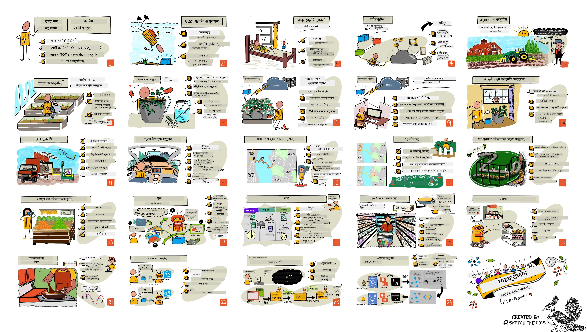

[](https://github.com/microsoft/IoT-For-Beginners/blob/master/LICENSE)
[](https://GitHub.com/microsoft/IoT-For-Beginners/graphs/contributors/)
[](https://GitHub.com/microsoft/IoT-For-Beginners/issues/)
[](https://GitHub.com/microsoft/IoT-For-Beginners/pulls/)
[](http://makeapullrequest.com)

[](https://GitHub.com/microsoft/IoT-For-Beginners/watchers/)
[](https://GitHub.com/microsoft/IoT-For-Beginners/network/)
[](https://GitHub.com/microsoft/IoT-For-Beginners/stargazers/)

### Azure AI Foundry समुदायमा सहभागी हुनुहोस्

यदि तपाईं अड्किनु भयो वा AI अनुप्रयोगहरू विकास गर्ने बारे कुनै प्रश्नहरू छन् भने। सहकर्मी सिक्नेहरू र अनुभव भएका विकासकर्ताहरूसँग MCP को बारेमा छलफलमा सहभागी हुनुहोस्। यो एक सहयोगी समुदाय हो जहाँ प्रश्नहरू स्वागतयोग्य हुन्छन् र ज्ञान स्वतन्त्र रूपमा साझा गरिन्छ।

[](https://discord.gg/nTYy5BXMWG)

यदि तपाईंलाई उत्पादन प्रतिक्रिया वा त्रुटिहरू छन् भने निर्माण गर्दा भ्रमण गर्नुहोस्:

[](https://aka.ms/foundry/forum)

यी स्रोतहरू प्रयोग गर्नका लागि यी चरणहरू पालना गर्नुहोस्:
1. **रेकपोजिटरी फोर्क गर्नुहोस्**: Click गर्नुहोस् [](https://GitHub.com/microsoft/IoT-For-Beginners/fork)
2. **रेकपोजिटरी क्लोन गर्नुहोस्**:   `git clone https://github.com/microsoft/IoT-For-Beginners.git`
3. [**Microsoft Foundry Discord मा सामेल हुनुहोस् र विशेषज्ञ र सहकर्मी विकासकर्ताहरूसँग भेट्नुहोस्**](https://discord.com/invite/ByRwuEEgH4)


### 🌐 बहुभाषी समर्थन

#### GitHub Action मार्फत समर्थन गरिएको (स्वचालित र सधैं अद्यावधिक)

<!-- CO-OP TRANSLATOR LANGUAGES TABLE START -->
[Arabic](../ar/README.md) | [Bengali](../bn/README.md) | [Bulgarian](../bg/README.md) | [Burmese (Myanmar)](../my/README.md) | [Chinese (Simplified)](../zh-CN/README.md) | [Chinese (Traditional, Hong Kong)](../zh-HK/README.md) | [Chinese (Traditional, Macau)](../zh-MO/README.md) | [Chinese (Traditional, Taiwan)](../zh-TW/README.md) | [Croatian](../hr/README.md) | [Czech](../cs/README.md) | [Danish](../da/README.md) | [Dutch](../nl/README.md) | [Estonian](../et/README.md) | [Finnish](../fi/README.md) | [French](../fr/README.md) | [German](../de/README.md) | [Greek](../el/README.md) | [Hebrew](../he/README.md) | [Hindi](../hi/README.md) | [Hungarian](../hu/README.md) | [Indonesian](../id/README.md) | [Italian](../it/README.md) | [Japanese](../ja/README.md) | [Kannada](../kn/README.md) | [Khmer](../km/README.md) | [Korean](../ko/README.md) | [Lithuanian](../lt/README.md) | [Malay](../ms/README.md) | [Malayalam](../ml/README.md) | [Marathi](../mr/README.md) | [Nepali](./README.md) | [Nigerian Pidgin](../pcm/README.md) | [Norwegian](../no/README.md) | [Persian (Farsi)](../fa/README.md) | [Polish](../pl/README.md) | [Portuguese (Brazil)](../pt-BR/README.md) | [Portuguese (Portugal)](../pt-PT/README.md) | [Punjabi (Gurmukhi)](../pa/README.md) | [Romanian](../ro/README.md) | [Russian](../ru/README.md) | [Serbian (Cyrillic)](../sr/README.md) | [Slovak](../sk/README.md) | [Slovenian](../sl/README.md) | [Spanish](../es/README.md) | [Swahili](../sw/README.md) | [Swedish](../sv/README.md) | [Tagalog (Filipino)](../tl/README.md) | [Tamil](../ta/README.md) | [Telugu](../te/README.md) | [Thai](../th/README.md) | [Turkish](../tr/README.md) | [Ukrainian](../uk/README.md) | [Urdu](../ur/README.md) | [Vietnamese](../vi/README.md)

> **स्थानीय रूपमा क्लोन गर्न प्राथमिकता दिनुहुन्छ?**
>
> यो रेकपोजिटरीमा ५०+ भाषा अनुवादहरू छन् जसले डाउनलोड साइज उल्लेखनीय रूपमा बढाउँछ। अनुवादहरू बिना क्लोन गर्न sparse checkout प्रयोग गर्नुहोस्:
>
> **Bash / macOS / Linux:**
> ```bash
> git clone --filter=blob:none --sparse https://github.com/microsoft/IoT-For-Beginners.git
> cd IoT-For-Beginners
> git sparse-checkout set --no-cone '/*' '!translations' '!translated_images'
> ```
>
> **CMD (Windows):**
> ```cmd
> git clone --filter=blob:none --sparse https://github.com/microsoft/IoT-For-Beginners.git
> cd IoT-For-Beginners
> git sparse-checkout set --no-cone "/*" "!translations" "!translated_images"
> ```
>
> यसले तपाईंलाई छिटो डाउनलोडको साथ कोर्स पूरा गर्न आवश्यक सबै कुरा दिन्छ।
<!-- CO-OP TRANSLATOR LANGUAGES TABLE END -->

# IoT शुरुवातकर्ताहरुका लागि - एक पाठ्यक्रम

माइक्रोसफ्टका Azure क्लाउड प्रवक्ताहरूले IoT आधारहरूबारे १२ हप्ता, २४ पाठहरूको पाठ्यक्रम प्रस्ताव गर्न पाउँदा खुशी छन्। प्रत्येक पाठमा पूर्व र उत्तर-पाठ क्विज़हरू, पाठ पूरा गर्न लेखिएको निर्देशनहरू, समाधान, असाइनमेन्ट र थप समावेश छन्। हाम्रो परियोजना-आधारित शिक्षण विधिले तपाईंलाई निर्माण गर्दै सिक्न अनुमति दिन्छ, जुन नयाँ कौशलहरू 'टिकाउने' एउटा प्रमाणित विधि हो।

परियोजनाहरूले खानालाई खेतबाट टेबुलसम्मको यात्रा समेट्छ। यसमा खेती, रसद, उत्पादन, खुद्रा र उपभोक्ता - सबै IoT उपकरणहरूको लोकप्रिय उद्योग क्षेत्रहरू समावेश छन्।



> स्केचनोट [Nitya Narasimhan](https://github.com/nitya) द्वारा। ठूलो संस्करणको लागि छवि क्लिक गर्नुहोस्।

**हाम्रो लेखकहरूलाई हार्दिक धन्यवाद [Jen Fox](https://github.com/jenfoxbot), [Jen Looper](https://github.com/jlooper), [Jim Bennett](https://github.com/jimbobbennett), र हाम्रो स्केचनोट कलाकार [Nitya Narasimhan](https://github.com/nitya) लाई।**

**हाम्रो [Microsoft Learn Student Ambassadors](https://studentambassadors.microsoft.com?WT.mc_id=academic-17441-jabenn) टोलीलाई पनि धन्यवाद, जसले यो पाठ्यक्रम समीक्षा र अनुवाद गरिरहेका छन् - [Aditya Garg](https://github.com/AdityaGarg00), [Anurag Sharma](https://github.com/Anurag-0-1-A), [Arpita Das](https://github.com/Arpiiitaaa), [Aryan Jain](https://www.linkedin.com/in/aryan-jain-47a4a1145/), [Bhavesh Suneja](https://github.com/EliteWarrior315), [Faith Hunja](https://faithhunja.github.io/), [Lateefah Bello](https://www.linkedin.com/in/lateefah-bello/), [Manvi Jha](https://github.com/Severus-Matthew), [Mireille Tan](https://www.linkedin.com/in/mireille-tan-a4834819a/), [Mohammad Iftekher (Iftu) Ebne Jalal](https://github.com/Iftu119), [Mohammad Zulfikar](https://github.com/mohzulfikar), [Priyanshu Srivastav](https://www.linkedin.com/in/priyanshu-srivastav-b067241ba), [Thanmai Gowducheruvu](https://github.com/innovation-platform), र [Zina Kamel](https://www.linkedin.com/in/zina-kamel/)।**

टोलीलाई भेट्नुहोस्!

[](https://youtu.be/-wippUJRi5k)

**Gif द्वारा** [Mohit Jaisal](https://linkedin.com/in/mohitjaisal)

> 🎥 माथि छवि क्लिक गर्नुहोस् परियोजनाको भिडियोका लागि!

> **शिक्षकहरू**, हामीले [यो पाठ्यक्रम प्रयोग गर्ने केही सुझावहरू](for-teachers.md) समावेश गरेका छौं। यदि तपाईंले आफ्नो स्वयम् पाठहरू बनाउन चाहानुहुन्छ भने, हामीले एक [पाठ टेम्प्लेट](lesson-template/README.md) पनि समावेश गरेका छौं।

> **[विद्यार्थीहरू](https://aka.ms/student-page)**, यो पाठ्यक्रम आफ्नै रूपमा प्रयोग गर्न, पूरै रेकपोजिटरी फोर्क गर्नुहोस् र आफ्नो अनुकूल अभ्यासहरू पूरा गर्नुहोस्, सुरुमा पूर्व-व्याख्यान क्विज दिएर, त्यसपछि व्याख्यान पढेर बाँकी गतिविधिहरू पूरा गर्नुहोस्। समाधान कोड प्रतिलिपि नगरीकन सिकाइका आधारमा परियोजनाहरू सिर्जना गर्ने प्रयास गर्नुहोस्; यद्यपि त्यो कोड प्रत्येक परियोजना-केन्द्रित पाठको /solutions फोल्डरमा उपलब्ध छ। अर्को विचार भनेको साथीहरूसँग अध्ययन समूह गठन गरेर सामग्री सँगै जानु हो। थप अध्ययनका लागि हामी [Microsoft Learn](https://docs.microsoft.com/users/jimbobbennett/collections/ke2ehd351jopwr?WT.mc_id=academic-17441-jabenn) सिफारिस गर्छौं।

यस कोर्सको भिडियो परिचय प्राप्त गर्न, यो भिडियो हेर्नुहोस्:

[](https://youtube.com/watch?v=bccEMm8gRuc "प्रमो भिडियो")

> 🎥 माथि छवि क्लिक गर्नुहोस् परियोजनाको भिडियोका लागि!

## शिक्षण पद्धति

हामीले यो पाठ्यक्रम बनाउँदा दुई शिक्षण सिद्धान्तहरू रोजेका छौं: यो परियोजना-आधारित हुनुपर्ने र यसमा बारम्बार क्विजहरू हुनुपर्ने। यो श्रृंखलाको अन्त्यसम्म, विद्यार्थीहरूले एउटा बिरुवा अनुगमन र पानी हाल्ने प्रणाली, वाहन ट्र्याकर, स्मार्ट कारखाना सेटअप जसले खाना ट्र्याक र जाँच गर्दछ, र आवाज नियन्त्रित खाना पकाउने टाइमर निर्माण गर्नेछन्, र IoT को आधारहरू सिक्नेछन् जसमा उपकरण कोड लेख्ने, क्लाउडसँग जडान गर्ने, टेलीमेट्री विश्लेषण गर्ने र एजमा AI चलाउने समावेश छ।

सामग्री परियोजनासँग मेल खान दिनेले विद्यार्थीहरूलाई आकर्षक र अवधारणाहरूको अवधारणालाई वृद्धि गर्ने बनाउँछ।

यसका अतिरिक्त, कक्षाको अघि एक कम जोखिमको क्विजले विद्यार्थीलाई विषय सिक्न प्रेरित गर्दछ भने कक्षापछि दोस्रो क्विजले अझ बढी अवधारण सुनिश्चित गर्दछ। यो पाठ्यक्रम लचिलो र रमाइलो बनाउन डिजाइन गरिएको छ र पूर्ण वा अंशमा लिन सकिन्छ। परियोजनाहरू सानोतिनोबाट सुरु भएर १२ हप्ताको अन्त्यतिर जटिल बन्दै जान्छन्।

प्रत्येक परियोजना विद्यार्थीहरू र शौकियहरूलाई उपलब्ध वास्तविक हार्डवेयरमा आधारित छ। प्रत्येक परियोजनाले सम्बन्धित पृष्ठभूमि ज्ञान प्रदान गर्दै परियोजना डोमेनमा हेर्छ। सफल विकासकर्ता बन्नका लागि तपाईंले समस्या समाधान गरिरहेको डोमेन बुझ्नु आवश्यक हुन्छ, जसले विद्यार्थीहरूलाई IoT समाधान र सिकाइलाई वास्तविक दुनियाँको समस्या सन्दर्भमा सोच्न मद्दत गर्दछ। विद्यार्थीहरूले उनीहरूले निर्माण गरिरहेको समाधानको 'किन' सिक्छन् र अन्तिम प्रयोगकर्ताको कदर प्राप्त गर्छन्।

## हार्डवेयर
हामीसँग परियोजनाहरूका लागि प्रयोग गर्न दुई किसिमका IoT हार्डवेयर छनोटहरू छन्, जुन व्यक्तिगत रुचि, प्रोग्रामिङ भाषा ज्ञान वा प्राथमिकताहरू, सिकाइ लक्ष्यहरू र उपलब्धतामा निर्भर गर्दछ। जसले हार्डवेयर पहुँच छैन वा खरिद गर्नुभन्दा पहिले थप सिक्न चाहन्छन् तीका लागि हामीले 'भर्चुअल हार्डवेयर' संस्करण पनि प्रदान गरेका छौं। तपाईं [hardware page](./hardware.md) मा थप पढ्न र 'शपिंग लिस्ट' पाउन सक्नुहुन्छ, जसमा Seeed Studio का साथीहरूले उपलब्ध गराएका पूरै किटहरू किन्न लिङ्कहरू पनि छन्।

> 💁 हाम्रो [कोड अफ कन्डक्ट](CODE_OF_CONDUCT.md), [योगदान](CONTRIBUTING.md), र [अनुवाद](..) दिशानिर्देशहरू फेला पार्नुहोस्। हामी तपाईंको रचनात्मक प्रतिक्रिया स्वागत गर्छौं!
>
> 🔧 समस्याहरू छन्? सामान्य समस्याहरूका समाधानहरूका लागि हाम्रो [समस्या समाधान मार्गदर्शन](TROUBLESHOOTING.md) जाँच गर्नुहोस्। 

## प्रत्येक पाठमा समावेश छन्:

- स्केच नोट
- वैकल्पिक पूरक भिडियो
- पूर्व-पाठ वार्मअप क्विज
- लिखित पाठ
- परियोजना आधारित पाठहरूका लागि, परियोजना कसरी निर्माण गर्ने चरण-दर-चरण मार्गनिर्देशन
- ज्ञान जाँचहरू
- एउटा चुनौती
- पूरक पढाइ
- कार्य 
- [पोस्ट-पाठ क्विज](https://ff-quizzes.netlify.app/en/)

> **क्विजहरू बारे एउटा नोट**: सबै क्विजहरू क्विज-एप फोल्डरमा छन्, जसले तीन प्रश्नहरूसहित जम्मा ४८ क्विजहरू समावेश गर्दछ। तिनीहरू पाठहरू भित्रबाट लिंक गरिएका छन् तर क्विज एप्लिकेसन स्थानीय रूपमा चलाउन सकिन्छ वा Azure मा डिप्लोय गर्न सकिन्छ; `quiz-app` फोल्डरमा दिइएको निर्देशन पालना गर्नुहोस्। यी क्रमिक रूपमा स्थानीयकरण भइरहेका छन्।

## पाठहरू

|       |              परियोजना नाम               |                       सिकाइ गराइएका अवधारणाहरू                        | सिकाइ उद्देश्यहरू                                                                                                                                                      |                                                        लिंक गरिएको पाठ                                                        |
| :---: | :------------------------------------: | :------------------------------------------------------------------: | --------------------------------------------------------------------------------------------------------------------------------------------------------------------- | :-------------------------------------------------------------------------------------------------------------------------: |
|  01   | [शुरु गर्दै](./1-getting-started/README.md) |                     IoT परिचय                                    | IoT का आधारभूत सिद्धान्तहरू र IoT समाधानका आधारभूत निर्माण खण्डहरू जस्तै सेन्सरहरू र क्लाउड सेवाहरू सिक्नुहोस्, जब तपाईं आफ्नो पहिलो IoT उपकरण सेटअप गर्दै हुनुहुन्छ |                     [IoT परिचय](./1-getting-started/lessons/1-introduction-to-iot/README.md)                     |
|  02   | [शुरु गर्दै](./1-getting-started/README.md) |                   IoT को गहिरो दृष्टिले अध्ययन                    | IoT प्रणालीका कम्पोनेन्टहरू, साथै माइक्रोकन्ट्रोलर र सिंगल-बोर्ड कम्प्युटरहरूबारे थप जान्नुहोस्                                                                    |                       [IoT गहिरो अध्ययन](./1-getting-started/lessons/2-deeper-dive/README.md)                        |
|  03   | [शुरु गर्दै](./1-getting-started/README.md) | सेन्सरहरू र एक्टुएटरहरूसँग भौतिक संसारसँग अन्तर्क्रिया गर्नुहोस्   | भौतिक संसारबाट डाटा सङ्कलन गर्न सेन्सरहरूको बारेमा जान्नुहोस्, र रातको बत्ती बनाउँदै फिडब्याक दिन एक्टुएटरहरू प्रयोग गर्न सिक्नुहोस्                                   | [सेन्सरहरू र एक्टुएटरहरूसँग भौतिक संसारसँग अन्तर्क्रिया](./1-getting-started/lessons/3-sensors-and-actuators/README.md) |
|  04   | [शुरु गर्दै](./1-getting-started/README.md) |             तपाईंको उपकरण इन्टरनेटसँग जडान गर्नुहोस्             | तपाईंको रातको बत्ती MQTT ब्रोकरमा जडान गरेर सन्देशहरू पठाउन र प्राप्त गर्न IoT उपकरणलाई इन्टरनेटमा कसरी जडान गर्ने भनेर जान्नुहोस्                                    |               [इंटरनेटमा उपकरण जडान](./1-getting-started/lessons/4-connect-internet/README.md)               |
|  05   |            [खेती](./2-farm/README.md)            |                 बिरुवा वृद्धिको पूर्वानुमान गर्नुहोस्                | IoT उपकरणबाट संकलित तापक्रम डाटाको प्रयोग गर्दै बिरुवा वृद्धिको पूर्वानुमान कसरी गर्ने जान्नुहोस्                                                                    |                         [बिरुवा वृद्धिको पूर्वानुमान](./2-farm/lessons/1-predict-plant-growth/README.md)                          |
|  06   |            [खेती](./2-farm/README.md)            |                  माटोमा नमी पत्ता लगाउनुहोस्                       | माटो नमी पत्ता लगाउन र एउटा माटो नमी सेन्सर क्यालिब्रेट कसरी गर्ने जान्नुहोस्                                                                                         |                         [माटो नमी पत्ता लगाउनुहोस्](./2-farm/lessons/2-detect-soil-moisture/README.md)                          |
|  07   |            [खेती](./2-farm/README.md)            |                बिरुवा सिँचाइलाई स्वचालित बनाउनुहोस्                 | रिले र MQTT को प्रयोग गरी सिँचाइलाई स्वचालित र समय निर्धारण गर्ने तरिका जान्नुहोस्                                                                                     |                     [स्वचालित बिरुवा सिँचाइ](./2-farm/lessons/3-automated-plant-watering/README.md)                      |
|  08   |            [खेती](./2-farm/README.md)            |                तपाईंको बिरुवालाई क्लाउडमा स्थानान्तरण गर्नुहोस्          | क्लाउड र क्लाउड-होस्टेड IoT सेवाहरूका विषयमा जान्नुहोस् र तपाईंको बिरुवा सार्वजनिक MQTT ब्रोकरको सट्टा यी मध्ये एकमा कसरी जडान गर्ने                                     |               [तपाईंको बिरुवा क्लाउडमा स्थानान्तरण](./2-farm/lessons/4-migrate-your-plant-to-the-cloud/README.md)                |
|  09   |            [खेती](./2-farm/README.md)            |             तपाईंको एप्लिकेसन तर्क क्लाउडमा स्थानान्तरण गर्नुहोस्        | IoT सन्देशहरूमा प्रतिक्रिया दिने एप्लिकेसन तर्क क्लाउडमा कसरी लेख्ने जान्नुहोस्                                                                                         |         [एप्लिकेसन तर्क क्लाउडमा स्थानान्तरण](./2-farm/lessons/5-migrate-application-to-the-cloud/README.md)         |
|  10   |            [खेती](./2-farm/README.md)            |                 तपाईंको बिरुवा सुरक्षित राख्नुहोस्                     | IoT सुरक्षा र की र प्रमाणपत्रहरूसँग तपाईंको बिरुवा कसरी सुरक्षित राख्ने जान्नुहोस्                                                                                       |                        [तपाईंको बिरुवा सुरक्षित राख्नुहोस्](./2-farm/lessons/6-keep-your-plant-secure/README.md)                        |
|  11   |       [परिवहन](./3-transport/README.md)       |                   स्थान ट्र्याकिंग                              | IoT उपकरणहरूका लागि GPS स्थान ट्र्याकिंगबारे जान्नुहोस्                                                                                                                 |                        [स्थान ट्र्याकिंग](./3-transport/lessons/1-location-tracking/README.md)                         |
|  12   |       [परिवहन](./3-transport/README.md)       |                      स्थान डाटा भण्डारण                        | पछि अवलोकन वा विश्लेषणका लागि IoT डाटा कसरी भण्डारण गर्ने जान्नुहोस्                                                                                                   |                         [स्थान डाटा भण्डारण](./3-transport/lessons/2-store-location-data/README.md)                          |
|  13   |       [परिवहन](./3-transport/README.md)       |                    स्थान डाटा प्रदर्शन                       | नक्सामा स्थान डाटा प्रदर्शन गर्ने र नक्सहरुले ३D संसारलाई २D मा कसरी प्रतिनिधित्व गर्छन् भनेर जान्नुहोस्                                                             |                     [स्थान डाटा प्रदर्शन](./3-transport/lessons/3-visualize-location-data/README.md)                      |
|  14   |       [परिवहन](./3-transport/README.md)       |                          जियोफेन्स                             | जियोफेन्सबारे जान्नुहोस्, र कसरी आपूर्ति श्रृंखलाका वाहनहरू आफ्नो गन्तव्य नजिक छ भनेर सुचित गर्न प्रयोग गर्न सकिन्छ                                                   |                                    [जियोफेन्स](./3-transport/lessons/4-geofences/README.md)                                    |
|  15   |   [निर्माण](./4-manufacturing/README.md)   |               फलफूल गुणस्तर डिटेक्टर प्रशिक्षण                 | क्लाउडमा छविहरू वर्गीकरण गर्ने प्रशिक्षित गर्नुहोस् ताकि फलफूलको गुणस्तर पत्ता लगाउन सकियोस्                                                                             |                 [फलफूल गुणस्तर डिटेक्टर प्रशिक्षण](./4-manufacturing/lessons/1-train-fruit-detector/README.md)                 |
|  16   |   [निर्माण](./4-manufacturing/README.md)   |            IoT उपकरणबाट फलफूल गुणस्तर जाँच                    | IoT उपकरणबाट तपाईंको फलफूल गुणस्तर डिटेक्टर प्रयोग गर्ने सामना गर्नुहोस्                                                                                               |           [IoT उपकरणबाट फलफूल गुणस्तर जाँच](./4-manufacturing/lessons/2-check-fruit-from-device/README.md)            |
|  17   |   [निर्माण](./4-manufacturing/README.md)   |             एजमा तपाईंको फलफूल डिटेक्टर चलाउनुहोस्            | एजमा IoT उपकरणमा तपाईंको फलफूल डिटेक्टर कसरी चलाउने जान्नुहोस्                                                                                                       |             [एजमा फलफूल डिटेक्टर चलाउनुहोस्](./4-manufacturing/lessons/3-run-fruit-detector-edge/README.md)              |
|  18   |   [निर्माण](./4-manufacturing/README.md)   |        सेन्सरबाट फलफूल गुणस्तर पत्ता लगाउने ट्रिगर गर्नुहोस्    | सेन्सरबाट फलफूल गुणस्तर पत्ता लगाउन ट्रिगर कसरी गर्ने जान्नुहोस्                                                                                                      |        [सेन्सरबाट फलफूल गुणस्तर पत्ता लगाउने ट्रिगर](./4-manufacturing/lessons/4-trigger-fruit-detector/README.md)         |
|  19   |          [खुद्रा कारोबार](./5-retail/README.md)          |                   स्टक डिटेक्टर प्रशिक्षण                       | पसलमा वस्तु गणना गर्नको लागि वस्तु पहिचान प्रयोग गरी स्टक डिटेक्टर प्रशिक्षण कसरी गर्ने जान्नुहोस्                                                                    |                        [स्टक डिटेक्टर प्रशिक्षण](./5-retail/lessons/1-train-stock-detector/README.md)                        |
|  20   |          [खुद्रा कारोबार](./5-retail/README.md)          |                   IoT उपकरणबाट स्टक जाँच                       | IoT उपकरणबाट वस्तु पहिचान मोडेल प्रयोग गरी स्टक कसरी जाँच गर्ने जान्नुहोस्                                                                                           |                     [IoT उपकरणबाट स्टक जाँच](./5-retail/lessons/2-check-stock-device/README.md)                     |
|  21   |        [उपभोक्ता](./6-consumer/README.md)        |             IoT उपकरणबाट भाषण चिन्हारी गर्नुहोस्                 | IoT उपकरणबाट भाषण चिन्हारी गरी स्मार्ट टाइमर निर्माण कसरी गर्ने जान्नुहोस्                                                                                            |                  [IoT उपकरणबाट भाषण चिन्हारी](./6-consumer/lessons/1-speech-recognition/README.md)                  |
|  22   |        [उपभोक्ता](./6-consumer/README.md)        |                   भाषा बुझ्नुहोस्                              | IoT उपकरणसँग बोलेका वाक्यहरू कसरी बुझ्ने जान्नुहोस्                                                                                                                 |                        [भाषा बुझ्नुहोस्](./6-consumer/lessons/2-language-understanding/README.md)                        |
|  23   |        [उपभोक्ता](./6-consumer/README.md)        |               टाइमर सेट गर्नुहोस् र बोली प्रतिक्रिया दिनुहोस्      | IoT उपकरणमा टाइमर कसरी सेट गर्ने र टाइमर सेट हुँदा र समाप्त हुँदा बोली प्रतिक्रिया कसरी दिन सिक्नुहोस्                                                                 |                 [टाइमर सेट र बोली प्रतिक्रिया](./6-consumer/lessons/3-spoken-feedback/README.md)                  |
|  24   |        [उपभोक्ता](./6-consumer/README.md)        |                बहुभाषी समर्थन गर्नुहोस्                       | स्मार्ट टाइमरसँग बोलिने र प्रतिक्रिया स्वरूप बहुभाषी कसरी समर्थन गर्ने जान्नुहोस्                                                                                       |                   [बहुभाषी समर्थन](./6-consumer/lessons/4-multiple-language-support/README.md)                   |

## अफलाइन पहुँच

तपाईं [Docsify](https://docsify.js.org/#/) प्रयोग गरी यो डकुमेन्टेसन अफलाइन चलाउन सक्नुहुन्छ। यस रिपोमा फोर्क गर्नुहोस्, आफ्नो स्थानीय मेसिनमा [Docsify स्थापना](https://docsify.js.org/#/quickstart) गर्नुहोस्, र त्यसपछि यस रिपोको मूल फोल्डरमा `docsify serve` टाइप गर्नुहोस्। वेबसाइट तपाईंका स्थानीयहोस्ट: पोर्ट ३००० मा सुरु हुनेछ: `localhost:3000`।

## क्विज

हरेक अध्यायमा तपाईंको ज्ञान परीक्षण गर्ने अन्तरक्रियात्मक क्विजको आयोजना गर्ने समुदायलाई धन्यवाद। तपाईं आफ्नो ज्ञान यहाँ [परीक्षण गर्न सक्नुहुन्छ](https://ff-quizzes.netlify.app/en/) 

### PDF

यदि आवश्यक परेमा अफलाइन पहुँचका लागि यो सामग्रीको PDF सिर्जना गर्न सक्नुहुन्छ। यसका लागि, सुनिश्चित गर्नुहोस् तपाईंले [npm इन्स्टल](https://docs.npmjs.com/downloading-and-installing-node-js-and-npm) गर्नुभएको छ र यस रिपोको मूल फोल्डरमा तलका आदेशहरू चलाउनुहोस्:

```sh
npm i
npm run convert
```

### स्लाइडहरू

केही पाठहरूका लागि स्लाइड डेकहरू [slides](../../slides) फोल्डरमा उपलब्ध छन्।

## अन्य पाठ्यक्रमहरू

हाम्रो टोलीले अन्य पाठ्यक्रमहरू पनि उत्पादन गर्छ! जाँच गर्नुहोस्:

<!-- CO-OP TRANSLATOR OTHER COURSES START -->
### LangChain
[](https://aka.ms/langchain4j-for-beginners)
[](https://aka.ms/langchainjs-for-beginners?WT.mc_id=m365-94501-dwahlin)
[](https://github.com/microsoft/langchain-for-beginners?WT.mc_id=m365-94501-dwahlin)
---

### Azure / Edge / MCP / Agents
[](https://github.com/microsoft/AZD-for-beginners?WT.mc_id=academic-105485-koreyst)
[](https://github.com/microsoft/edgeai-for-beginners?WT.mc_id=academic-105485-koreyst)
[](https://github.com/microsoft/mcp-for-beginners?WT.mc_id=academic-105485-koreyst)
[](https://github.com/microsoft/ai-agents-for-beginners?WT.mc_id=academic-105485-koreyst)

---
 
### जेनेरेटिभ एआई सिरिज
[](https://github.com/microsoft/generative-ai-for-beginners?WT.mc_id=academic-105485-koreyst)
[-9333EA?style=for-the-badge&labelColor=E5E7EB&color=9333EA)](https://github.com/microsoft/Generative-AI-for-beginners-dotnet?WT.mc_id=academic-105485-koreyst)
[-C084FC?style=for-the-badge&labelColor=E5E7EB&color=C084FC)](https://github.com/microsoft/generative-ai-for-beginners-java?WT.mc_id=academic-105485-koreyst)
[-E879F9?style=for-the-badge&labelColor=E5E7EB&color=E879F9)](https://github.com/microsoft/generative-ai-with-javascript?WT.mc_id=academic-105485-koreyst)

---
 
### मूल सिकाइ
[](https://aka.ms/ml-beginners?WT.mc_id=academic-105485-koreyst)
[](https://aka.ms/datascience-beginners?WT.mc_id=academic-105485-koreyst)
[](https://aka.ms/ai-beginners?WT.mc_id=academic-105485-koreyst)
[](https://github.com/microsoft/Security-101?WT.mc_id=academic-96948-sayoung)
[](https://aka.ms/webdev-beginners?WT.mc_id=academic-105485-koreyst)
[](https://aka.ms/iot-beginners?WT.mc_id=academic-105485-koreyst)
[](https://github.com/microsoft/xr-development-for-beginners?WT.mc_id=academic-105485-koreyst)

---
 
### कोपाइलट सिरिज
[](https://aka.ms/GitHubCopilotAI?WT.mc_id=academic-105485-koreyst)
[](https://github.com/microsoft/mastering-github-copilot-for-dotnet-csharp-developers?WT.mc_id=academic-105485-koreyst)
[](https://github.com/microsoft/CopilotAdventures?WT.mc_id=academic-105485-koreyst)
<!-- CO-OP TRANSLATOR OTHER COURSES END -->

## छवि श्रेयहरू

तपाईं यस पाठ्यक्रममा प्रयोग भएका सबै छविहरूका श्रेयहरू आवश्यक परेको ठाउँमा [Attributions](./attributions.md) मा फेला पार्न सक्नुहुन्छ।

---

<!-- CO-OP TRANSLATOR DISCLAIMER START -->
**अस्वीकरण**:  
यो दस्तावेज [Co-op Translator](https://github.com/Azure/co-op-translator) एआई अनुवाद सेवा प्रयोग गरी अनुवाद गरिएको हो। हामी शुद्धताका लागि प्रयासरत छौं, तर कृपया ध्यान दिनुहोस् कि स्वचालित अनुवादमा त्रुटिहरू वा गलतफहमीहरू हुन सक्छन्। मूल भाषा मा रहेको दस्तावेजलाई अधिकारिक स्रोतको रूपमा विचार गर्नुपर्छ। महत्वपूर्ण जानकारीका लागि व्यावसायिक मानव अनुवाद सिफारिस गरिन्छ। यस अनुवादको प्रयोगबाट उत्पन्न कुनै पनि गलतफहमी वा गलत व्याख्याको लागि हामी जिम्मेवार छैनौं।
<!-- CO-OP TRANSLATOR DISCLAIMER END -->