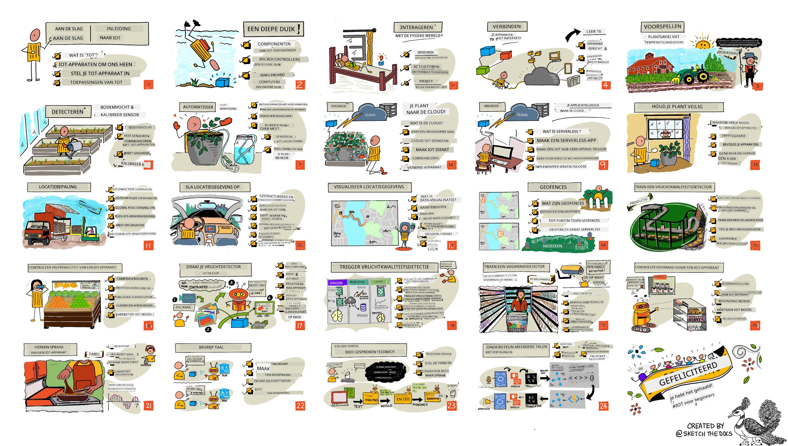

<!--
CO_OP_TRANSLATOR_METADATA:
{
  "original_hash": "6c354ec3487e4f6cfafbe44557996cd9",
  "translation_date": "2026-01-06T09:54:25+00:00",
  "source_file": "README.md",
  "language_code": "nl"
}
-->
[](https://github.com/microsoft/IoT-For-Beginners/blob/master/LICENSE)
[](https://GitHub.com/microsoft/IoT-For-Beginners/graphs/contributors/)
[](https://GitHub.com/microsoft/IoT-For-Beginners/issues/)
[](https://GitHub.com/microsoft/IoT-For-Beginners/pulls/)
[](http://makeapullrequest.com)

[](https://GitHub.com/microsoft/IoT-For-Beginners/watchers/)
[](https://GitHub.com/microsoft/IoT-For-Beginners/network/)
[](https://GitHub.com/microsoft/IoT-For-Beginners/stargazers/)

### Word lid van de Azure AI Foundry Community

Als je vastloopt of vragen hebt over het bouwen van AI-apps. Neem deel aan discussies met mede-lerenden en ervaren ontwikkelaars over MCP. Het is een ondersteunende community waar vragen welkom zijn en kennis vrij wordt gedeeld.

[](https://discord.gg/nTYy5BXMWG)

Als je productfeedback hebt of fouten tegenkomt tijdens het bouwen, bezoek dan:

[](https://aka.ms/foundry/forum)

Volg deze stappen om aan de slag te gaan met deze bronnen:
1. **Fork de repository**: Klik [](https://GitHub.com/microsoft/IoT-For-Beginners/fork)
2. **Clone de repository**:   `git clone https://github.com/microsoft/IoT-For-Beginners.git`
3. [**Word lid van de Microsoft Foundry Discord en ontmoet experts en mede-ontwikkelaars**](https://discord.com/invite/ByRwuEEgH4)


### 🌐 Meertalige ondersteuning

#### Ondersteund via GitHub Action (Automatisch & Altijd Up-to-Date)

<!-- CO-OP TRANSLATOR LANGUAGES TABLE START -->
[Arabic](../ar/README.md) | [Bengali](../bn/README.md) | [Bulgarian](../bg/README.md) | [Burmese (Myanmar)](../my/README.md) | [Chinese (Simplified)](../zh/README.md) | [Chinese (Traditional, Hong Kong)](../hk/README.md) | [Chinese (Traditional, Macau)](../mo/README.md) | [Chinese (Traditional, Taiwan)](../tw/README.md) | [Croatian](../hr/README.md) | [Czech](../cs/README.md) | [Danish](../da/README.md) | [Dutch](./README.md) | [Estonian](../et/README.md) | [Finnish](../fi/README.md) | [French](../fr/README.md) | [German](../de/README.md) | [Greek](../el/README.md) | [Hebrew](../he/README.md) | [Hindi](../hi/README.md) | [Hungarian](../hu/README.md) | [Indonesian](../id/README.md) | [Italian](../it/README.md) | [Japanese](../ja/README.md) | [Kannada](../kn/README.md) | [Korean](../ko/README.md) | [Lithuanian](../lt/README.md) | [Malay](../ms/README.md) | [Malayalam](../ml/README.md) | [Marathi](../mr/README.md) | [Nepali](../ne/README.md) | [Nigerian Pidgin](../pcm/README.md) | [Norwegian](../no/README.md) | [Persian (Farsi)](../fa/README.md) | [Polish](../pl/README.md) | [Portuguese (Brazil)](../br/README.md) | [Portuguese (Portugal)](../pt/README.md) | [Punjabi (Gurmukhi)](../pa/README.md) | [Romanian](../ro/README.md) | [Russian](../ru/README.md) | [Serbian (Cyrillic)](../sr/README.md) | [Slovak](../sk/README.md) | [Slovenian](../sl/README.md) | [Spanish](../es/README.md) | [Swahili](../sw/README.md) | [Swedish](../sv/README.md) | [Tagalog (Filipino)](../tl/README.md) | [Tamil](../ta/README.md) | [Telugu](../te/README.md) | [Thai](../th/README.md) | [Turkish](../tr/README.md) | [Ukrainian](../uk/README.md) | [Urdu](../ur/README.md) | [Vietnamese](../vi/README.md)

> **Bij voorkeur lokaal clonen?**

> Deze repository bevat meer dan 50 taalvertalingen die de downloadgrootte aanzienlijk vergroten. Om zonder vertalingen te clonen, gebruik sparse checkout:
> ```bash
> git clone --filter=blob:none --sparse https://github.com/microsoft/IoT-For-Beginners.git
> cd IoT-For-Beginners
> git sparse-checkout set --no-cone '/*' '!translations' '!translated_images'
> ```
> Hiermee heb je alles wat je nodig hebt om de cursus te voltooien met een veel snellere download.
<!-- CO-OP TRANSLATOR LANGUAGES TABLE END -->

# IoT voor Beginners - Een Curriculum

Azure Cloud Advocates bij Microsoft bieden met plezier een 12 weken durend curriculum aan bestaande uit 24 lessen, helemaal over de basis van IoT. Elke les bevat toetsen vooraf en achteraf, geschreven instructies om de les te voltooien, een oplossing, een opdracht en meer. Onze projectgerichte pedagogiek maakt het mogelijk om te leren terwijl je bouwt, een bewezen methode om nieuwe vaardigheden goed te laten beklijven.

De projecten bestrijken de reis van voedsel van boerderij tot tafel. Dit omvat landbouw, logistiek, productie, retail en consument - allemaal populaire industrieën voor IoT-apparaten.



> Sketchnote door [Nitya Narasimhan](https://github.com/nitya). Klik op de afbeelding voor een grotere versie.

**Hartelijke dank aan onze auteurs [Jen Fox](https://github.com/jenfoxbot), [Jen Looper](https://github.com/jlooper), [Jim Bennett](https://github.com/jimbobbennett), en onze sketchnote kunstenaar [Nitya Narasimhan](https://github.com/nitya).**

**Bedankt ook aan ons team van [Microsoft Learn Student Ambassadors](https://studentambassadors.microsoft.com?WT.mc_id=academic-17441-jabenn) die dit curriculum hebben beoordeeld en vertaald - [Aditya Garg](https://github.com/AdityaGarg00), [Anurag Sharma](https://github.com/Anurag-0-1-A), [Arpita Das](https://github.com/Arpiiitaaa), [Aryan Jain](https://www.linkedin.com/in/aryan-jain-47a4a1145/), [Bhavesh Suneja](https://github.com/EliteWarrior315), [Faith Hunja](https://faithhunja.github.io/), [Lateefah Bello](https://www.linkedin.com/in/lateefah-bello/), [Manvi Jha](https://github.com/Severus-Matthew), [Mireille Tan](https://www.linkedin.com/in/mireille-tan-a4834819a/), [Mohammad Iftekher (Iftu) Ebne Jalal](https://github.com/Iftu119), [Mohammad Zulfikar](https://github.com/mohzulfikar), [Priyanshu Srivastav](https://www.linkedin.com/in/priyanshu-srivastav-b067241ba), [Thanmai Gowducheruvu](https://github.com/innovation-platform), en [Zina Kamel](https://www.linkedin.com/in/zina-kamel/).**

Maak kennis met het team!

[](https://youtu.be/-wippUJRi5k)

**Gif door** [Mohit Jaisal](https://linkedin.com/in/mohitjaisal)

> 🎥 Klik op de afbeelding hierboven voor een video over het project!

> **Docenten**, we hebben [enkele suggesties toegevoegd](for-teachers.md) over het gebruik van dit curriculum. Als je je eigen lessen wilt maken, hebben we ook een [lessensjabloon](lesson-template/README.md) toegevoegd.

> **[Studenten](https://aka.ms/student-page)**, om dit curriculum zelfstandig te gebruiken, fork je de gehele repo en maak je de oefeningen zelfstandig, te beginnen met een quiz voorafgaand aan de les, dan de les lezen en de rest van de activiteiten voltooien. Probeer de projecten te maken door de lessen te begrijpen in plaats van de oplossing te kopiëren; die code is wel beschikbaar in de /solutions mappen bij elke projectgerichte les. Een ander idee is om een studiegroep te vormen met vrienden en samen de inhoud door te nemen. Voor verdere studie raden we [Microsoft Learn](https://docs.microsoft.com/users/jimbobbennett/collections/ke2ehd351jopwr?WT.mc_id=academic-17441-jabenn) aan.

Voor een video-overzicht van deze cursus, bekijk deze video:

[](https://youtube.com/watch?v=bccEMm8gRuc "Promo video")

> 🎥 Klik op de afbeelding hierboven voor een video over het project!

## Pedagogiek

We hebben gekozen voor twee pedagogische uitgangspunten bij het bouwen van dit curriculum: zorgen dat het projectgericht is en dat het frequente toetsen bevat. Aan het einde van deze reeks hebben studenten een plantbewakingssysteem en irrigatiesysteem gebouwd, een voertuigvolgsysteem, een slimme fabriek setup om voedsel te volgen en controleren, en een spraakgestuurde kookwekker, en hebben ze de basis geleerd van het Internet of Things, waaronder het schrijven van apparaatcode, verbinden met de cloud, het analyseren van telemetrie en het uitvoeren van AI aan de edge.

Door ervoor te zorgen dat de inhoud gericht is op projecten, wordt het proces voor studenten boeiender en wordt het onthouden van concepten verbeterd.

Daarnaast zet een laagdrempelige quiz voorafgaand aan een les de intentie van de student om een onderwerp te leren, terwijl een tweede quiz na de les zorgt voor verdere behoud. Dit curriculum is ontworpen om flexibel en leuk te zijn en kan in zijn geheel of gedeeltelijk worden gevolgd. De projecten beginnen klein en worden steeds complexer aan het einde van de 12 weken durende cyclus.

Elk project is gebaseerd op realistische hardware die beschikbaar is voor studenten en hobbyisten. Elk project onderzoekt het specifieke projectdomein en biedt relevante achtergrondkennis. Om een succesvolle ontwikkelaar te zijn, helpt het om het domein te begrijpen waarin je problemen oplost; deze achtergrondkennis stelt studenten in staat na te denken over hun IoT-oplossingen en leerervaringen in de context van het soort echte problemen dat zij als IoT-ontwikkelaar zouden kunnen tegenkomen. Studenten leren de 'waarom' van de oplossingen die ze bouwen en krijgen waardering voor de eindgebruiker.

## Hardware

We hebben twee keuzes voor IoT-hardware voor de projecten, afhankelijk van persoonlijke voorkeur, programmeerkennis of voorkeuren, leerdoelen en beschikbaarheid. We hebben ook een 'virtuele hardware' versie beschikbaar gesteld voor diegenen die geen toegang hebben tot hardware, of die meer willen leren voordat ze een aankoop doen. Je kunt meer lezen en een 'boodschappenlijst' vinden op de [hardwarepagina](./hardware.md), inclusief links om complete kits te kopen bij onze vrienden van Seeed Studio.
> 💁 Vind onze [Gedragscode](CODE_OF_CONDUCT.md), [Bijdragen](CONTRIBUTING.md), en [Vertaal](TRANSLATIONS.md) richtlijnen. We verwelkomen je constructieve feedback!
>
> 🔧 Problemen? Bekijk onze [Probleemoplossingsgids](TROUBLESHOOTING.md) voor oplossingen van veelvoorkomende problemen.

## Elke les bevat:

- sketchnote
- optionele aanvullende video
- warming-up quiz voor de les
- geschreven les
- voor projectgebaseerde lessen, stapsgewijze handleidingen over hoe het project te bouwen
- kenniscontroles
- een uitdaging
- aanvullende lectuur
- opdracht
- [quiz na de les](https://ff-quizzes.netlify.app/en/)

> **Een opmerking over quizzen**: Alle quizzen bevinden zich in de quiz-app map, voor in totaal 48 quizzen van elk drie vragen. Ze zijn gekoppeld vanuit de lessen maar de quiz-app kan lokaal worden uitgevoerd of worden gedeployed naar Azure; volg de instructie in de `quiz-app` map. Ze worden geleidelijk gelokaliseerd.

## Lessen

|       |              Projectnaam              |                       Geleerde concepten                       | Leerdoelen                                                                                                                                                 |                                                        Gekoppelde les                                                         |
| :---: | :-----------------------------------: | :-------------------------------------------------------------: | ---------------------------------------------------------------------------------------------------------------------------------------------------------- | :------------------------------------------------------------------------------------------------------------------------------: |
|  01   | [Aan de slag](./1-getting-started/README.md) |                     Introductie tot IoT                     | Leer de basisprincipes van IoT en de basiselementen van IoT-oplossingen zoals sensoren en clouddiensten terwijl je je eerste IoT-apparaat instelt          |                      [Introductie tot IoT](./1-getting-started/lessons/1-introduction-to-iot/README.md)                      |
|  02   | [Aan de slag](./1-getting-started/README.md) |                   Dieper in IoT duiken                    | Leer meer over de componenten van een IoT-systeem, evenals microcontrollers en single-board computers                                                        |                        [Dieper in IoT duiken](./1-getting-started/lessons/2-deeper-dive/README.md)                         |
|  03   | [Aan de slag](./1-getting-started/README.md) | Interactie met de fysieke wereld met sensoren en actuatoren | Leer over sensoren om gegevens uit de fysieke wereld te verzamelen, en actuatoren om feedback te geven, terwijl je een nachtlamp bouwt                    | [Interactie met de fysieke wereld met sensoren en actuatoren](./1-getting-started/lessons/3-sensors-and-actuators/README.md) |
|  04   | [Aan de slag](./1-getting-started/README.md) |             Verbind je apparaat met het internet             | Leer hoe je een IoT-apparaat met het internet verbindt om berichten te verzenden en ontvangen door je nachtlamp aan te sluiten op een MQTT-broker          |               [Verbind je apparaat met het internet](./1-getting-started/lessons/4-connect-internet/README.md)                |
|  05   |            [Boerderij](./2-farm/README.md)            |                  Voorspel plantengroei                     | Leer hoe je plantengroei voorspelt met behulp van temperatuurgegevens vastgelegd door een IoT-apparaat                                                       |                          [Voorspel plantengroei](./2-farm/lessons/1-predict-plant-growth/README.md)                           |
|  06   |            [Boerderij](./2-farm/README.md)            |                    Detecteer bodemvochtigheid                     | Leer hoe je bodemvochtigheid detecteert en een bodemvochtigheidssensor kalibreert                                                                             |                          [Detecteer bodemvochtigheid](./2-farm/lessons/2-detect-soil-moisture/README.md)                           |
|  07   |            [Boerderij](./2-farm/README.md)            |                  Geautomatiseerd planten water geven                   | Leer hoe je het bewateren automatiseert en timing instelt met een relais en MQTT                                                                             |                      [Geautomatiseerd planten water geven](./2-farm/lessons/3-automated-plant-watering/README.md)                       |
|  08   |            [Boerderij](./2-farm/README.md)            |               Migreer je plant naar de cloud               | Leer over de cloud en cloud-gehoste IoT-diensten en hoe je je plant daarop aansluit in plaats van op een publieke MQTT-broker                              |               [Migreer je plant naar de cloud](./2-farm/lessons/4-migrate-your-plant-to-the-cloud/README.md)                |
|  09   |            [Boerderij](./2-farm/README.md)            |         Migreer je applicatielogica naar de cloud         | Leer hoe je applicatielogica in de cloud schrijft die reageert op IoT-berichten                                                                             |         [Migreer je applicatielogica naar de cloud](./2-farm/lessons/5-migrate-application-to-the-cloud/README.md)         |
|  10   |            [Boerderij](./2-farm/README.md)            |                   Houd je plant veilig                    | Leer over beveiliging met IoT en hoe je je plant beveiligt met sleutels en certificaten                                                                     |                        [Houd je plant veilig](./2-farm/lessons/6-keep-your-plant-secure/README.md)                         |
|  11   |       [Transport](./3-transport/README.md)       |                      Locatie tracking                      | Leer over GPS-locatietracking voor IoT-apparaten                                                                                                           |                           [Locatie tracking](./3-transport/lessons/1-location-tracking/README.md)                           |
|  12   |       [Transport](./3-transport/README.md)       |                     Opslaan van locatiegegevens                     | Leer hoe je IoT-gegevens opslaat om later te visualiseren of analyseren                                                                                      |                         [Opslaan van locatiegegevens](./3-transport/lessons/2-store-location-data/README.md)                         |
|  13   |       [Transport](./3-transport/README.md)       |                   Visualiseer locatiegegevens                   | Leer over het visualiseren van locatiegegevens op een kaart en hoe kaarten de echte 3D-wereld in 2 dimensies weergeven                                      |                     [Visualiseer locatiegegevens](./3-transport/lessons/3-visualize-location-data/README.md)                     |
|  14   |       [Transport](./3-transport/README.md)       |                          Geofences                          | Leer over geofences en hoe die gebruikt kunnen worden om te waarschuwen wanneer voertuigen in de supply chain dicht bij hun bestemming zijn                  |                                   [Geofences](./3-transport/lessons/4-geofences/README.md)                                   |
|  15   |   [Productie](./4-manufacturing/README.md)   |               Train een detector voor fruitkwaliteit                | Leer over het trainen van een beeldclassificator in de cloud om fruitkwaliteit te detecteren                                                                |                 [Train een detector voor fruitkwaliteit](./4-manufacturing/lessons/1-train-fruit-detector/README.md)                 |
|  16   |   [Productie](./4-manufacturing/README.md)   |           Controleer fruitkwaliteit met een IoT-apparaat            | Leer over het gebruik van je fruitkwaliteitsdetector vanaf een IoT-apparaat                                                                                 |           [Controleer fruitkwaliteit met een IoT-apparaat](./4-manufacturing/lessons/2-check-fruit-from-device/README.md)            |
|  17   |   [Productie](./4-manufacturing/README.md)   |             Laat je fruitdetector draaien op de edge             | Leer over het draaien van je fruitdetector op een IoT-apparaat aan de edge                                                                                  |             [Laat je fruitdetector draaien op de edge](./4-manufacturing/lessons/3-run-fruit-detector-edge/README.md)             |
|  18   |   [Productie](./4-manufacturing/README.md)   |        Trigger fruitkwaliteitsdetectie vanaf een sensor        | Leer over het triggeren van fruitkwaliteitsdetectie vanaf een sensor                                                                                        |        [Trigger fruitkwaliteitsdetectie vanaf een sensor](./4-manufacturing/lessons/4-trigger-fruit-detector/README.md)         |
|  19   |          [Retail](./5-retail/README.md)          |                   Train een voorraaddetector                    | Leer hoe je objectdetectie gebruikt om een voorraaddetector te trainen die de voorraad in een winkel telt                                                  |                        [Train een voorraaddetector](./5-retail/lessons/1-train-stock-detector/README.md)                         |
|  20   |          [Retail](./5-retail/README.md)          |               Controleer voorraad vanaf een IoT-apparaat                | Leer hoe je voorraad controleert vanaf een IoT-apparaat met een objectdetectiemodel                                                                          |                     [Controleer voorraad vanaf een IoT-apparaat](./5-retail/lessons/2-check-stock-device/README.md)                      |
|  21   |        [Consument](./6-consumer/README.md)        |             Herken spraak met een IoT-apparaat             | Leer hoe je spraak herkent vanaf een IoT-apparaat om een slimme timer te bouwen                                                                              |                  [Herken spraak met een IoT-apparaat](./6-consumer/lessons/1-speech-recognition/README.md)                  |
|  22   |        [Consument](./6-consumer/README.md)        |                     Begrijp taal                     | Leer hoe je zinnen begrijpt die tegen een IoT-apparaat worden gesproken                                                                                    |                        [Begrijp taal](./6-consumer/lessons/2-language-understanding/README.md)                        |
|  23   |        [Consument](./6-consumer/README.md)        |           Stel een timer in en geef gesproken feedback           | Leer hoe je een timer instelt op een IoT-apparaat en gesproken feedback geeft wanneer de timer wordt ingesteld en wanneer deze afloopt                      |                 [Stel een timer in en geef gesproken feedback](./6-consumer/lessons/3-spoken-feedback/README.md)                  |
|  24   |        [Consument](./6-consumer/README.md)        |                 Ondersteun meerdere talen                  | Leer hoe je meerdere talen ondersteunt, zowel in het gesproken worden als in de reacties van je slimme timer                                                |                   [Ondersteun meerdere talen](./6-consumer/lessons/4-multiple-language-support/README.md)                   |

## Offline toegang

Je kunt deze documentatie offline gebruiken met [Docsify](https://docsify.js.org/#/). Fork deze repo, [installeer Docsify](https://docsify.js.org/#/quickstart) op je lokale machine en typ dan in de hoofdmap van deze repo `docsify serve`. De website wordt geserveerd op poort 3000 op je localhost: `localhost:3000`.

## Quiz

Dank aan de community voor het hosten van de interactieve quiz die je kennis test over elk hoofdstuk. Je test je kennis [hier](https://ff-quizzes.netlify.app/en/) 

### PDF

Je kunt een PDF van deze inhoud genereren voor offline gebruik indien gewenst. Zorg ervoor dat je [npm geïnstalleerd hebt](https://docs.npmjs.com/downloading-and-installing-node-js-and-npm) en voer de volgende opdrachten uit in de hoofdmap van deze repo:

```sh
npm i
npm run convert
```

### Slides

Er zijn slide decks voor sommige lessen te vinden in de [slides](../../slides) map.


## Andere curricula

Ons team produceert andere curricula! Bekijk:

<!-- CO-OP TRANSLATOR OTHER COURSES START -->
### LangChain
[](https://aka.ms/langchain4j-for-beginners)
[](https://aka.ms/langchainjs-for-beginners?WT.mc_id=m365-94501-dwahlin)

---

### Azure / Edge / MCP / Agents
[](https://github.com/microsoft/AZD-for-beginners?WT.mc_id=academic-105485-koreyst)
[](https://github.com/microsoft/edgeai-for-beginners?WT.mc_id=academic-105485-koreyst)
[](https://github.com/microsoft/mcp-for-beginners?WT.mc_id=academic-105485-koreyst)
[](https://github.com/microsoft/ai-agents-for-beginners?WT.mc_id=academic-105485-koreyst)

---
 
### Generatieve AI Serie
[](https://github.com/microsoft/generative-ai-for-beginners?WT.mc_id=academic-105485-koreyst)
[-9333EA?style=for-the-badge&labelColor=E5E7EB&color=9333EA)](https://github.com/microsoft/Generative-AI-for-beginners-dotnet?WT.mc_id=academic-105485-koreyst)
[-C084FC?style=for-the-badge&labelColor=E5E7EB&color=C084FC)](https://github.com/microsoft/generative-ai-for-beginners-java?WT.mc_id=academic-105485-koreyst)
[-E879F9?style=for-the-badge&labelColor=E5E7EB&color=E879F9)](https://github.com/microsoft/generative-ai-with-javascript?WT.mc_id=academic-105485-koreyst)

---
 
### Kernleren
[](https://aka.ms/ml-beginners?WT.mc_id=academic-105485-koreyst)
[](https://aka.ms/datascience-beginners?WT.mc_id=academic-105485-koreyst)
[](https://aka.ms/ai-beginners?WT.mc_id=academic-105485-koreyst)
[](https://github.com/microsoft/Security-101?WT.mc_id=academic-96948-sayoung)
[](https://aka.ms/webdev-beginners?WT.mc_id=academic-105485-koreyst)
[](https://aka.ms/iot-beginners?WT.mc_id=academic-105485-koreyst)
[](https://github.com/microsoft/xr-development-for-beginners?WT.mc_id=academic-105485-koreyst)

---
 
### Copilot Serie
[](https://aka.ms/GitHubCopilotAI?WT.mc_id=academic-105485-koreyst)
[](https://github.com/microsoft/mastering-github-copilot-for-dotnet-csharp-developers?WT.mc_id=academic-105485-koreyst)
[](https://github.com/microsoft/CopilotAdventures?WT.mc_id=academic-105485-koreyst)
<!-- CO-OP TRANSLATOR OTHER COURSES END -->

## Beeldattributies

Je kunt alle attributies voor de afbeeldingen die in deze leerlijn worden gebruikt waar nodig vinden in de [Attributies](./attributions.md).

---

<!-- CO-OP TRANSLATOR DISCLAIMER START -->
**Disclaimer**:
Dit document is vertaald met behulp van de AI-vertalingsservice [Co-op Translator](https://github.com/Azure/co-op-translator). Hoewel we streven naar nauwkeurigheid, dient u zich ervan bewust te zijn dat automatische vertalingen fouten of onnauwkeurigheden kunnen bevatten. Het oorspronkelijke document in de oorspronkelijke taal moet als de gezaghebbende bron worden beschouwd. Voor belangrijke informatie wordt professionele menselijke vertaling aanbevolen. Wij zijn niet aansprakelijk voor eventuele misverstanden of verkeerde interpretaties die voortvloeien uit het gebruik van deze vertaling.
<!-- CO-OP TRANSLATOR DISCLAIMER END -->