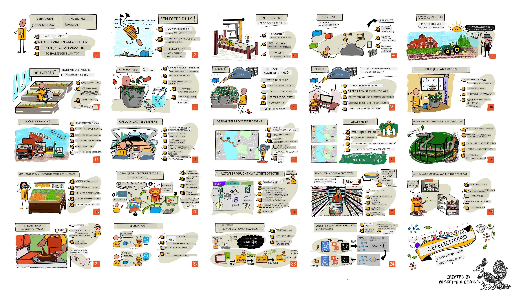

[](https://github.com/microsoft/IoT-For-Beginners/blob/master/LICENSE)
[](https://GitHub.com/microsoft/IoT-For-Beginners/graphs/contributors/)
[](https://GitHub.com/microsoft/IoT-For-Beginners/issues/)
[](https://GitHub.com/microsoft/IoT-For-Beginners/pulls/)
[](http://makeapullrequest.com)

[](https://GitHub.com/microsoft/IoT-For-Beginners/watchers/)
[](https://GitHub.com/microsoft/IoT-For-Beginners/network/)
[](https://GitHub.com/microsoft/IoT-For-Beginners/stargazers/)

### Doe mee met de Azure AI Foundry Community

Als je vastloopt of vragen hebt over het bouwen van AI-apps. Doe mee met medeleerlingen en ervaren ontwikkelaars in discussies over MCP. Het is een ondersteunende community waar vragen welkom zijn en kennis vrijelijk wordt gedeeld.

[](https://discord.gg/nTYy5BXMWG)

Als je productfeedback hebt of fouten tegenkomt tijdens het bouwen, bezoek:

[](https://aka.ms/foundry/forum)

Volg deze stappen om aan de slag te gaan met deze bronnen:
1. **Fork de Repository**: Klik [](https://GitHub.com/microsoft/IoT-For-Beginners/fork)
2. **Clone de Repository**:   `git clone https://github.com/microsoft/IoT-For-Beginners.git`
3. [**Word Lid van The Microsoft Foundry Discord en ontmoet experts en medeontwikkelaars**](https://discord.com/invite/ByRwuEEgH4)


### 🌐 Meertalige Ondersteuning

#### Ondersteund via GitHub Action (Geautomatiseerd & Altijd Up-to-Date)

<!-- CO-OP TRANSLATOR LANGUAGES TABLE START -->
[Arabisch](../ar/README.md) | [Bengaals](../bn/README.md) | [Bulgaars](../bg/README.md) | [Birmees (Myanmar)](../my/README.md) | [Chinees (Vereenvoudigd)](../zh-CN/README.md) | [Chinees (Traditioneel, Hongkong)](../zh-HK/README.md) | [Chinees (Traditioneel, Macau)](../zh-MO/README.md) | [Chinees (Traditioneel, Taiwan)](../zh-TW/README.md) | [Kroatisch](../hr/README.md) | [Tsjechisch](../cs/README.md) | [Deens](../da/README.md) | [Nederlands](./README.md) | [Ests](../et/README.md) | [Fins](../fi/README.md) | [Frans](../fr/README.md) | [Duits](../de/README.md) | [Grieks](../el/README.md) | [Hebreeuws](../he/README.md) | [Hindi](../hi/README.md) | [Hongaars](../hu/README.md) | [Indonesisch](../id/README.md) | [Italiaans](../it/README.md) | [Japans](../ja/README.md) | [Kannada](../kn/README.md) | [Khmer](../km/README.md) | [Koreaans](../ko/README.md) | [Litouws](../lt/README.md) | [Maleis](../ms/README.md) | [Malayalam](../ml/README.md) | [Marathi](../mr/README.md) | [Nepalees](../ne/README.md) | [Nigeriaans Pidgin](../pcm/README.md) | [Noors](../no/README.md) | [Perzisch (Farsi)](../fa/README.md) | [Pools](../pl/README.md) | [Portugees (Brazilië)](../pt-BR/README.md) | [Portugees (Portugal)](../pt-PT/README.md) | [Punjabi (Gurmukhi)](../pa/README.md) | [Roemeens](../ro/README.md) | [Russisch](../ru/README.md) | [Servisch (Cyrillisch)](../sr/README.md) | [Slowaaks](../sk/README.md) | [Sloveens](../sl/README.md) | [Spaans](../es/README.md) | [Swahili](../sw/README.md) | [Zweeds](../sv/README.md) | [Tagalog (Filipijns)](../tl/README.md) | [Tamil](../ta/README.md) | [Telugu](../te/README.md) | [Thai](../th/README.md) | [Turks](../tr/README.md) | [Oekraïens](../uk/README.md) | [Urdu](../ur/README.md) | [Vietnamees](../vi/README.md)

> **Voorkeur om lokaal te klonen?**
>
> Deze repository bevat meer dan 50 taalvertalingen, wat de downloadgrootte aanzienlijk verhoogt. Om te klonen zonder vertalingen, gebruik sparse checkout:
>
> **Bash / macOS / Linux:**
> ```bash
> git clone --filter=blob:none --sparse https://github.com/microsoft/IoT-For-Beginners.git
> cd IoT-For-Beginners
> git sparse-checkout set --no-cone '/*' '!translations' '!translated_images'
> ```
>
> **CMD (Windows):**
> ```cmd
> git clone --filter=blob:none --sparse https://github.com/microsoft/IoT-For-Beginners.git
> cd IoT-For-Beginners
> git sparse-checkout set --no-cone "/*" "!translations" "!translated_images"
> ```
>
> Hiermee heb je alles wat je nodig hebt om de cursus te voltooien met een veel snellere download.
<!-- CO-OP TRANSLATOR LANGUAGES TABLE END -->

# IoT voor Beginners - Een Curriculum

Azure Cloud Advocates bij Microsoft bieden met plezier een curriculum van 12 weken en 24 lessen aan over de basis van IoT. Elke les bevat voor- en naquizzen, schriftelijke instructies om de les te voltooien, een oplossing, een opdracht en meer. Onze projectgebaseerde didactiek stelt je in staat te leren door te bouwen, een bewezen manier om nieuwe vaardigheden echt te onthouden.

De projecten behandelen de reis van voedsel van boerderij tot tafel. Dit omvat landbouw, logistiek, productie, detailhandel en consument - allemaal populaire industriegebieden voor IoT-apparaten.



> Sketchnote door [Nitya Narasimhan](https://github.com/nitya). Klik op de afbeelding voor een grotere versie.

**Hartelijke dank aan onze auteurs [Jen Fox](https://github.com/jenfoxbot), [Jen Looper](https://github.com/jlooper), [Jim Bennett](https://github.com/jimbobbennett), en onze sketchnote kunstenaar [Nitya Narasimhan](https://github.com/nitya).**

**Ook dank aan ons team van [Microsoft Learn Student Ambassadors](https://studentambassadors.microsoft.com?WT.mc_id=academic-17441-jabenn) die dit curriculum hebben beoordeeld en vertaald - [Aditya Garg](https://github.com/AdityaGarg00), [Anurag Sharma](https://github.com/Anurag-0-1-A), [Arpita Das](https://github.com/Arpiiitaaa), [Aryan Jain](https://www.linkedin.com/in/aryan-jain-47a4a1145/), [Bhavesh Suneja](https://github.com/EliteWarrior315), [Faith Hunja](https://faithhunja.github.io/), [Lateefah Bello](https://www.linkedin.com/in/lateefah-bello/), [Manvi Jha](https://github.com/Severus-Matthew), [Mireille Tan](https://www.linkedin.com/in/mireille-tan-a4834819a/), [Mohammad Iftekher (Iftu) Ebne Jalal](https://github.com/Iftu119), [Mohammad Zulfikar](https://github.com/mohzulfikar), [Priyanshu Srivastav](https://www.linkedin.com/in/priyanshu-srivastav-b067241ba), [Thanmai Gowducheruvu](https://github.com/innovation-platform), en [Zina Kamel](https://www.linkedin.com/in/zina-kamel/).**

Ontmoet het team!

[](https://youtu.be/-wippUJRi5k)

**Gif door** [Mohit Jaisal](https://linkedin.com/in/mohitjaisal)

> 🎥 Klik op de bovenstaande afbeelding voor een video over het project!

> **Docenten**, we hebben [enkele suggesties opgenomen](for-teachers.md) over hoe u dit curriculum kunt gebruiken. Als u uw eigen lessen wilt maken, hebben we ook een [lessen template](lesson-template/README.md) bijgevoegd.

> **[Studenten](https://aka.ms/student-page)**, om dit curriculum zelfstandig te gebruiken, fork de gehele repo en maak de oefeningen zelf, beginnend met een quiz voor de les, lees daarna de les en voltooi de overige activiteiten. Probeer de projecten te maken door de lessen te begrijpen in plaats van de oplossingscode te kopiëren; die code is echter beschikbaar in de /solutions mappen bij elke projectgerichte les. Een andere optie is om een studiegroep te vormen met vrienden en samen door de inhoud te gaan. Voor verdere studie bevelen we [Microsoft Learn](https://docs.microsoft.com/users/jimbobbennett/collections/ke2ehd351jopwr?WT.mc_id=academic-17441-jabenn) aan.

Voor een video-overzicht van deze cursus, bekijk deze video:

[](https://youtube.com/watch?v=bccEMm8gRuc "Promo video")

> 🎥 Klik op de bovenstaande afbeelding voor een video over het project!

## Didactiek

We hebben twee didactische principes gekozen bij het bouwen van dit curriculum: ervoor zorgen dat het projectgebaseerd is en dat het frequente quizzen bevat. Aan het eind van deze serie zullen studenten een plantbewakingssysteem en bewateringssysteem gebouwd hebben, een voertuigenvolgsysteem, een slimme fabriek setup om voedsel te volgen en te controleren, en een spraakgestuurde kookwekker, en ze hebben de basis van het Internet of Things geleerd, inclusief hoe ze apparaatcode schrijven, verbinding maken met de cloud, telemetry analyseren en AI aan de rand uitvoeren.

Door ervoor te zorgen dat de inhoud aansluit bij projecten, wordt het proces boeiender voor studenten en wordt de kennis beter behouden.

Daarnaast zet een laagdrempelige quiz vóór een les de intentie van de student om een onderwerp te leren, terwijl een tweede quiz na de les verdere kennisborging waarborgt. Dit curriculum is ontworpen om flexibel en leuk te zijn en kan geheel of gedeeltelijk gevolgd worden. De projecten beginnen klein en worden steeds complexer gedurende de 12 weken durende cyclus.

Elk project is gebaseerd op echte hardware die beschikbaar is voor studenten en hobbyisten. Elk project kijkt naar het specifieke projectdomein en geeft relevante achtergrondinformatie. Om een succesvolle ontwikkelaar te zijn, helpt het domein te begrijpen waarin je problemen oplost. Deze achtergrondinformatie stelt studenten in staat na te denken over hun IoT-oplossingen en leerervaringen in de context van het soort echte wereld probleem dat ze misschien moeten oplossen als IoT-ontwikkelaar. Studenten leren het 'waarom' van de oplossingen die ze bouwen en krijgen waardering voor de eindgebruiker.

## Hardware
We hebben twee keuzes voor IoT-hardware die voor de projecten kunnen worden gebruikt, afhankelijk van persoonlijke voorkeur, programmeertaalkennis of voorkeuren, leerdoelen en beschikbaarheid. We hebben ook een 'virtuele hardware'-versie aangeboden voor degenen die geen toegang hebben tot hardware of die meer willen leren voordat ze een aankoop doen. Je kunt meer lezen en een 'boodschappenlijst' vinden op de [hardwarepagina](./hardware.md), inclusief links om complete kits te kopen bij onze vrienden van Seeed Studio.

> 💁 Vind onze [Gedragscode](CODE_OF_CONDUCT.md), [Bijdragen](CONTRIBUTING.md) en [Vertalingen](..) richtlijnen. We verwelkomen je constructieve feedback!
>
> 🔧 Problemen? Bekijk onze [Probleemoplossingsgids](TROUBLESHOOTING.md) voor oplossingen van veelvoorkomende problemen.

## Elke les bevat:

- sketchnote
- optionele aanvullende video
- opwarmquiz voorafgaand aan de les
- geschreven les
- voor projectgebaseerde lessen, stapsgewijze handleidingen over hoe het project te bouwen
- kenniscontroles
- een uitdaging
- aanvullende lectuur
- opdracht
- [quiz na de les](https://ff-quizzes.netlify.app/en/)

> **Een opmerking over quizzes**: Alle quizzes bevinden zich in de quiz-app map, voor in totaal 48 quizzes van elk drie vragen. Ze zijn gelinkt vanuit de lessen maar de quiz-app kan lokaal worden uitgevoerd of worden gedeployed naar Azure; volg de instructies in de `quiz-app` map. Ze worden geleidelijk gelokaliseerd.

## Lessen

|       |              Projectnaam              |                       Behandelde Concepten                       | Leerdoelen                                                                                                                                                 |                                                        Gelinkte Les                                                         |
| :---: | :----------------------------------: | :----------------------------------------------------------------: | ---------------------------------------------------------------------------------------------------------------------------------------------------------- | :---------------------------------------------------------------------------------------------------------------------------: |
|  01   | [Aan de slag](./1-getting-started/README.md) |                     Introductie tot IoT                      | Leer de basisprincipes van IoT en de basisbouwstenen van IoT-oplossingen zoals sensoren en clouddiensten terwijl je je eerste IoT-apparaat instelt           |                      [Introductie tot IoT](./1-getting-started/lessons/1-introduction-to-iot/README.md)                      |
|  02   | [Aan de slag](./1-getting-started/README.md) |                   Diepere duik in IoT                     | Leer meer over de componenten van een IoT-systeem, evenals microcontrollers en single-board computers                                                        |                        [Diepere duik in IoT](./1-getting-started/lessons/2-deeper-dive/README.md)                         |
|  03   | [Aan de slag](./1-getting-started/README.md) | Interactie met de fysieke wereld met sensoren en actuatoren | Leer over sensoren om gegevens uit de fysieke wereld te verzamelen en actuatoren om feedback te geven, terwijl je een nachtlamp bouwt                       | [Interactie met fysiek wereld met sensoren en actuatoren](./1-getting-started/lessons/3-sensors-and-actuators/README.md)      |
|  04   | [Aan de slag](./1-getting-started/README.md) |             Verbind je apparaat met het internet             | Leer hoe je een IoT-apparaat verbindt met het internet om berichten te versturen en te ontvangen door je nachtlamp te verbinden met een MQTT-broker           |               [Verbind je apparaat met het internet](./1-getting-started/lessons/4-connect-internet/README.md)              |
|  05   |            [Boerderij](./2-farm/README.md)            |                   Voorspel plantengroei                      | Leer hoe je plantengroei voorspelt met behulp van temperatuurgegevens vastgelegd door een IoT-apparaat                                                       |                          [Voorspel plantengroei](./2-farm/lessons/1-predict-plant-growth/README.md)                          |
|  06   |            [Boerderij](./2-farm/README.md)            |                   Detecteer bodemvochtigheid                 | Leer hoe je bodemvochtigheid detecteert en een bodemvochtigheidssensor kalibreert                                                                             |                          [Detecteer bodemvochtigheid](./2-farm/lessons/2-detect-soil-moisture/README.md)                   |
|  07   |            [Boerderij](./2-farm/README.md)            |                  Geautomatiseerd plantenbewatering           | Leer hoe je het bewateren automatiseert en timet met een relais en MQTT                                                                                      |                      [Geautomatiseerd plantenbewatering](./2-farm/lessons/3-automated-plant-watering/README.md)             |
|  08   |            [Boerderij](./2-farm/README.md)            |               Migreer je plant naar de cloud                 | Leer over de cloud en cloud-gehoste IoT-diensten en hoe je je plant verbindt met een daarvan in plaats van een publieke MQTT-broker                         |               [Migreer je plant naar de cloud](./2-farm/lessons/4-migrate-your-plant-to-the-cloud/README.md)               |
|  09   |            [Boerderij](./2-farm/README.md)            |         Migreer je applicatielogica naar de cloud            | Leer hoe je applicatielogica in de cloud schrijft die reageert op IoT-berichten                                                                              |         [Migreer je applicatielogica naar de cloud](./2-farm/lessons/5-migrate-application-to-the-cloud/README.md)          |
|  10   |            [Boerderij](./2-farm/README.md)            |                      Houd je plant veilig                      | Leer over beveiliging met IoT en hoe je je plant veilig houdt met sleutels en certificaten                                                                   |                        [Houd je plant veilig](./2-farm/lessons/6-keep-your-plant-secure/README.md)                          |
|  11   |       [Transport](./3-transport/README.md)       |                      Locatiebepaling                          | Leer over GPS-locatiebepaling voor IoT-apparaten                                                                                                            |                           [Locatiebepaling](./3-transport/lessons/1-location-tracking/README.md)                            |
|  12   |       [Transport](./3-transport/README.md)       |                     Opslaan van locatiegegevens              | Leer hoe je IoT-gegevens opslaat om later te visualiseren of te analyseren                                                                                   |                         [Opslaan van locatiegegevens](./3-transport/lessons/2-store-location-data/README.md)                 |
|  13   |       [Transport](./3-transport/README.md)       |                   Visualiseer locatiegegevens                | Leer over het visualiseren van locatiegegevens op een kaart en hoe kaarten de echte 3D-wereld in 2 dimensies weergeven                                        |                     [Visualiseer locatiegegevens](./3-transport/lessons/3-visualize-location-data/README.md)                |
|  14   |       [Transport](./3-transport/README.md)       |                          Geofence                             | Leer over geofences en hoe ze kunnen worden gebruikt om te waarschuwen wanneer voertuigen in de toeleveringsketen dicht bij hun bestemming zijn              |                                   [Geofence](./3-transport/lessons/4-geofences/README.md)                                   |
|  15   |   [Productie](./4-manufacturing/README.md)   |               Train een fruitkwaliteitsdetector              | Leer over het trainen van een beeldclassificator in de cloud om fruitkwaliteit te detecteren                                                                  |                 [Train een fruitkwaliteitsdetector](./4-manufacturing/lessons/1-train-fruit-detector/README.md)             |
|  16   |   [Productie](./4-manufacturing/README.md)   |           Controleer fruitkwaliteit vanaf een IoT-apparaat   | Leer over het gebruiken van je fruitkwaliteitsdetector vanaf een IoT-apparaat                                                                                |           [Controleer fruitkwaliteit vanaf een IoT-apparaat](./4-manufacturing/lessons/2-check-fruit-from-device/README.md)  |
|  17   |   [Productie](./4-manufacturing/README.md)   |             Voer je fruitdetector uit aan de edge            | Leer over het uitvoeren van je fruitdetector op een IoT-apparaat aan de edge                                                                                 |             [Voer je fruitdetector uit aan de edge](./4-manufacturing/lessons/3-run-fruit-detector-edge/README.md)          |
|  18   |   [Productie](./4-manufacturing/README.md)   |        Start fruitkwaliteitsdetectie vanaf een sensor        | Leer over het starten van fruitkwaliteitsdetectie vanaf een sensor                                                                                           |        [Start fruitkwaliteitsdetectie vanaf een sensor](./4-manufacturing/lessons/4-trigger-fruit-detector/README.md)       |
|  19   |          [Detailhandel](./5-retail/README.md)          |                   Train een voorraaddetector                 | Leer hoe je objectdetectie gebruikt om een voorraaddetector te trainen die voorraad telt in een winkel                                                     |                        [Train een voorraaddetector](./5-retail/lessons/1-train-stock-detector/README.md)                    |
|  20   |          [Detailhandel](./5-retail/README.md)          |               Controleer voorraad vanaf een IoT-apparaat      | Leer hoe je voorraad controleert vanaf een IoT-apparaat met een objectdetectiemodel                                                                         |                     [Controleer voorraad vanaf een IoT-apparaat](./5-retail/lessons/2-check-stock-device/README.md)        |
|  21   |        [Consument](./6-consumer/README.md)        |             Herken spraak met een IoT-apparaat               | Leer hoe je spraak herkent vanaf een IoT-apparaat om een slimme timer te bouwen                                                                             |                  [Herken spraak met een IoT-apparaat](./6-consumer/lessons/1-speech-recognition/README.md)                  |
|  22   |        [Consument](./6-consumer/README.md)        |                     Begrijp taal                              | Leer hoe je zinnen die tegen een IoT-apparaat worden gesproken begrijpt                                                                                    |                        [Begrijp taal](./6-consumer/lessons/2-language-understanding/README.md)                               |
|  23   |        [Consument](./6-consumer/README.md)        |           Stel een timer in en geef gesproken feedback       | Leer hoe je een timer instelt op een IoT-apparaat en gesproken feedback geeft over wanneer de timer is ingesteld en wanneer hij afloopt                    |                 [Stel een timer in en geef gesproken feedback](./6-consumer/lessons/3-spoken-feedback/README.md)            |
|  24   |        [Consument](./6-consumer/README.md)        |                 Ondersteun meerdere talen                     | Leer hoe je meerdere talen ondersteunt, zowel bij het aanspreken als in de reacties van je slimme timer                                                    |                   [Ondersteun meerdere talen](./6-consumer/lessons/4-multiple-language-support/README.md)                   |

## Offline toegang

Je kunt deze documentatie offline uitvoeren met behulp van [Docsify](https://docsify.js.org/#/). Fork deze repo, [installeer Docsify](https://docsify.js.org/#/quickstart) op je lokale machine, en typ vervolgens in de hoofdmap van deze repo `docsify serve`. De website wordt dan geserveerd op poort 3000 op je localhost: `localhost:3000`.

## Quiz

Dank aan de community voor het hosten van de interactieve quiz die je kennis test over elk van de hoofdstukken. Je test je kennis [hier](https://ff-quizzes.netlify.app/en/).

### PDF

Je kunt een PDF van deze inhoud genereren voor offline toegang indien nodig. Zorg ervoor dat je [npm geïnstalleerd hebt](https://docs.npmjs.com/downloading-and-installing-node-js-and-npm) en voer dan de volgende opdrachten uit in de hoofdmap van deze repo:

```sh
npm i
npm run convert
```

### Presentaties

Er zijn presentatie decks voor sommige van de lessen in de [slides](../../slides) map.

## Andere lesprogramma's

Ons team produceert ook andere lesprogramma's! Bekijk:

<!-- CO-OP TRANSLATOR OTHER COURSES START -->
### LangChain
[](https://aka.ms/langchain4j-for-beginners)
[](https://aka.ms/langchainjs-for-beginners?WT.mc_id=m365-94501-dwahlin)
[](https://github.com/microsoft/langchain-for-beginners?WT.mc_id=m365-94501-dwahlin)
---

### Azure / Edge / MCP / Agents
[](https://github.com/microsoft/AZD-for-beginners?WT.mc_id=academic-105485-koreyst)
[](https://github.com/microsoft/edgeai-for-beginners?WT.mc_id=academic-105485-koreyst)
[](https://github.com/microsoft/mcp-for-beginners?WT.mc_id=academic-105485-koreyst)
[](https://github.com/microsoft/ai-agents-for-beginners?WT.mc_id=academic-105485-koreyst)

---
 
### Generatieve AI-serie
[](https://github.com/microsoft/generative-ai-for-beginners?WT.mc_id=academic-105485-koreyst)
[-9333EA?style=for-the-badge&labelColor=E5E7EB&color=9333EA)](https://github.com/microsoft/Generative-AI-for-beginners-dotnet?WT.mc_id=academic-105485-koreyst)
[-C084FC?style=for-the-badge&labelColor=E5E7EB&color=C084FC)](https://github.com/microsoft/generative-ai-for-beginners-java?WT.mc_id=academic-105485-koreyst)
[-E879F9?style=for-the-badge&labelColor=E5E7EB&color=E879F9)](https://github.com/microsoft/generative-ai-with-javascript?WT.mc_id=academic-105485-koreyst)

---
 
### Kernleren
[](https://aka.ms/ml-beginners?WT.mc_id=academic-105485-koreyst)
[](https://aka.ms/datascience-beginners?WT.mc_id=academic-105485-koreyst)
[](https://aka.ms/ai-beginners?WT.mc_id=academic-105485-koreyst)
[](https://github.com/microsoft/Security-101?WT.mc_id=academic-96948-sayoung)
[](https://aka.ms/webdev-beginners?WT.mc_id=academic-105485-koreyst)
[](https://aka.ms/iot-beginners?WT.mc_id=academic-105485-koreyst)
[](https://github.com/microsoft/xr-development-for-beginners?WT.mc_id=academic-105485-koreyst)

---
 
### Copilot-serie
[](https://aka.ms/GitHubCopilotAI?WT.mc_id=academic-105485-koreyst)
[](https://github.com/microsoft/mastering-github-copilot-for-dotnet-csharp-developers?WT.mc_id=academic-105485-koreyst)
[](https://github.com/microsoft/CopilotAdventures?WT.mc_id=academic-105485-koreyst)
<!-- CO-OP TRANSLATOR OTHER COURSES END -->

## Beeldvermeldingen

Je kunt alle vermeldingen voor de gebruikte afbeeldingen in deze leerstof vinden waar nodig in de [Attributions](./attributions.md).

---

<!-- CO-OP TRANSLATOR DISCLAIMER START -->
**Disclaimer**:
Dit document is vertaald met behulp van de AI vertaaldienst [Co-op Translator](https://github.com/Azure/co-op-translator). Hoewel we streven naar nauwkeurigheid, dient u er rekening mee te houden dat geautomatiseerde vertalingen fouten of onnauwkeurigheden kunnen bevatten. Het oorspronkelijke document in de oorspronkelijke taal moet als de gezaghebbende bron worden beschouwd. Voor cruciale informatie wordt professionele menselijke vertaling aanbevolen. Wij zijn niet aansprakelijk voor misverstanden of verkeerde interpretaties die voortvloeien uit het gebruik van deze vertaling.
<!-- CO-OP TRANSLATOR DISCLAIMER END -->