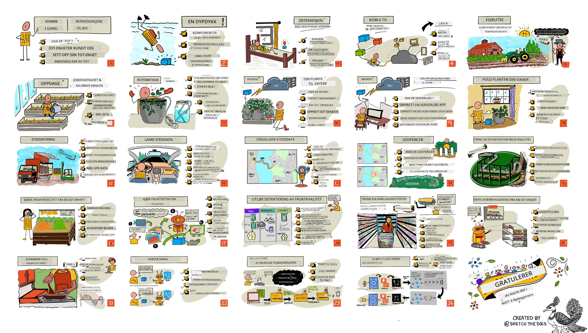

<!--
CO_OP_TRANSLATOR_METADATA:
{
  "original_hash": "6c354ec3487e4f6cfafbe44557996cd9",
  "translation_date": "2026-01-06T06:26:28+00:00",
  "source_file": "README.md",
  "language_code": "no"
}
-->
[](https://github.com/microsoft/IoT-For-Beginners/blob/master/LICENSE)
[](https://GitHub.com/microsoft/IoT-For-Beginners/graphs/contributors/)
[](https://GitHub.com/microsoft/IoT-For-Beginners/issues/)
[](https://GitHub.com/microsoft/IoT-For-Beginners/pulls/)
[](http://makeapullrequest.com)

[](https://GitHub.com/microsoft/IoT-For-Beginners/watchers/)
[](https://GitHub.com/microsoft/IoT-For-Beginners/network/)
[](https://GitHub.com/microsoft/IoT-For-Beginners/stargazers/)

### Bli med i Azure AI Foundry Community

Hvis du setter deg fast eller har spørsmål om å bygge AI-apper. Bli med andre lærende og erfarne utviklere i diskusjoner om MCP. Det er et støttende fellesskap hvor spørsmål er velkomne og kunnskap deles fritt.

[](https://discord.gg/nTYy5BXMWG)

Hvis du har produktfeedback eller feil under bygging, besøk:

[](https://aka.ms/foundry/forum)

Følg disse trinnene for å komme i gang med å bruke disse ressursene:
1. **Lag en fork av depotet**: Klikk [](https://GitHub.com/microsoft/IoT-For-Beginners/fork)
2. **Klon depotet**:   `git clone https://github.com/microsoft/IoT-For-Beginners.git`
3. [**Bli med i Microsoft Foundry Discord og møt eksperter og andre utviklere**](https://discord.com/invite/ByRwuEEgH4)


### 🌐 Støtte for flere språk

#### Støttes via GitHub Action (Automatisert og alltid oppdatert)

<!-- CO-OP TRANSLATOR LANGUAGES TABLE START -->
[Arabic](../ar/README.md) | [Bengali](../bn/README.md) | [Bulgarian](../bg/README.md) | [Burmese (Myanmar)](../my/README.md) | [Chinese (Simplified)](../zh/README.md) | [Chinese (Traditional, Hong Kong)](../hk/README.md) | [Chinese (Traditional, Macau)](../mo/README.md) | [Chinese (Traditional, Taiwan)](../tw/README.md) | [Croatian](../hr/README.md) | [Czech](../cs/README.md) | [Danish](../da/README.md) | [Dutch](../nl/README.md) | [Estonian](../et/README.md) | [Finnish](../fi/README.md) | [French](../fr/README.md) | [German](../de/README.md) | [Greek](../el/README.md) | [Hebrew](../he/README.md) | [Hindi](../hi/README.md) | [Hungarian](../hu/README.md) | [Indonesian](../id/README.md) | [Italian](../it/README.md) | [Japanese](../ja/README.md) | [Kannada](../kn/README.md) | [Korean](../ko/README.md) | [Lithuanian](../lt/README.md) | [Malay](../ms/README.md) | [Malayalam](../ml/README.md) | [Marathi](../mr/README.md) | [Nepali](../ne/README.md) | [Nigerian Pidgin](../pcm/README.md) | [Norwegian](./README.md) | [Persian (Farsi)](../fa/README.md) | [Polish](../pl/README.md) | [Portuguese (Brazil)](../br/README.md) | [Portuguese (Portugal)](../pt/README.md) | [Punjabi (Gurmukhi)](../pa/README.md) | [Romanian](../ro/README.md) | [Russian](../ru/README.md) | [Serbian (Cyrillic)](../sr/README.md) | [Slovak](../sk/README.md) | [Slovenian](../sl/README.md) | [Spanish](../es/README.md) | [Swahili](../sw/README.md) | [Swedish](../sv/README.md) | [Tagalog (Filipino)](../tl/README.md) | [Tamil](../ta/README.md) | [Telugu](../te/README.md) | [Thai](../th/README.md) | [Turkish](../tr/README.md) | [Ukrainian](../uk/README.md) | [Urdu](../ur/README.md) | [Vietnamese](../vi/README.md)

> **Foretrekker du å klone lokalt?**

> Dette depotet inkluderer over 50 språkoversettelser som betydelig øker nedlastingsstørrelsen. For å klone uten oversettelser, bruk sparsjekontroll:
> ```bash
> git clone --filter=blob:none --sparse https://github.com/microsoft/IoT-For-Beginners.git
> cd IoT-For-Beginners
> git sparse-checkout set --no-cone '/*' '!translations' '!translated_images'
> ```
> Dette gir deg alt du trenger for å fullføre kurset med en mye raskere nedlasting.
<!-- CO-OP TRANSLATOR LANGUAGES TABLE END -->

# IoT for nybegynnere - En læreplan

Azure Cloud Advocates hos Microsoft er glade for å tilby en 12-ukers, 24-leksjons læreplan som handler om IoT-grunnleggende. Hver leksjon inkluderer quiz før og etter leksjonen, skrevne instruksjoner for å fullføre leksjonen, en løsning, en oppgave og mer. Vår prosjektbaserte pedagogikk lar deg lære mens du bygger, en bevist metode for at nye ferdigheter skal 'feste seg'.

Prosjektene dekker reisen til mat fra gård til bord. Dette inkluderer landbruk, logistikk, produksjon, detaljhandel og forbruker – alle populære bransjeområder for IoT-enheter.



> Sketchnote av [Nitya Narasimhan](https://github.com/nitya). Klikk på bildet for en større versjon.

**Stor takk til våre forfattere [Jen Fox](https://github.com/jenfoxbot), [Jen Looper](https://github.com/jlooper), [Jim Bennett](https://github.com/jimbobbennett), og vår sketchnote-kunstner [Nitya Narasimhan](https://github.com/nitya).**

**Takk også til vårt team av [Microsoft Learn Student Ambassadors](https://studentambassadors.microsoft.com?WT.mc_id=academic-17441-jabenn) som har gjennomgått og oversatt denne læreplanen – [Aditya Garg](https://github.com/AdityaGarg00), [Anurag Sharma](https://github.com/Anurag-0-1-A), [Arpita Das](https://github.com/Arpiiitaaa), [Aryan Jain](https://www.linkedin.com/in/aryan-jain-47a4a1145/), [Bhavesh Suneja](https://github.com/EliteWarrior315), [Faith Hunja](https://faithhunja.github.io/), [Lateefah Bello](https://www.linkedin.com/in/lateefah-bello/), [Manvi Jha](https://github.com/Severus-Matthew), [Mireille Tan](https://www.linkedin.com/in/mireille-tan-a4834819a/), [Mohammad Iftekher (Iftu) Ebne Jalal](https://github.com/Iftu119), [Mohammad Zulfikar](https://github.com/mohzulfikar), [Priyanshu Srivastav](https://www.linkedin.com/in/priyanshu-srivastav-b067241ba), [Thanmai Gowducheruvu](https://github.com/innovation-platform), og [Zina Kamel](https://www.linkedin.com/in/zina-kamel/).**

Møt teamet!

[](https://youtu.be/-wippUJRi5k)

**Gif av** [Mohit Jaisal](https://linkedin.com/in/mohitjaisal)

> 🎥 Klikk på bildet ovenfor for en video om prosjektet!

> **Lærere**, vi har [inkludert noen forslag](for-teachers.md) om hvordan dere kan bruke denne læreplanen. Hvis dere ønsker å lage deres egne leksjoner, har vi også inkludert en [leksjonsmal](lesson-template/README.md).

> **[Studenter](https://aka.ms/student-page)**, for å bruke denne læreplanen på egenhånd, lag en fork av hele repoet og fullfør oppgavene selv, start med en quiz før forelesningen, les så forelesningen og fullfør resten av aktivitetene. Prøv å lage prosjektene ved å forstå leksjonene framfor å kopiere løsningskode; denne koden er likevel tilgjengelig i /solutions-mappene i hver prosjektorienterte leksjon. En annen idé kan være å danne studiegrupper med venner og gå gjennom innholdet sammen. For videre studier anbefaler vi [Microsoft Learn](https://docs.microsoft.com/users/jimbobbennett/collections/ke2ehd351jopwr?WT.mc_id=academic-17441-jabenn).

For en videooversikt av dette kurset, se denne videoen:

[](https://youtube.com/watch?v=bccEMm8gRuc "Promo video")

> 🎥 Klikk på bildet ovenfor for en video om prosjektet!

## Pedagogikk

Vi har valgt to pedagogiske prinsipper under byggingen av denne læreplanen: å sikre at den er prosjektbasert og at den inkluderer hyppige quizzer. Ved slutten av denne serien vil studentene ha bygd et system for overvåking og vanning av planter, en kjøretøysporer, en smart fabrikkoppsett for å spore og sjekke mat, og en stemmestyrt matlagings-tidtaker, og ha lært det grunnleggende om tingenes internett, inkludert hvordan man skriver enhetskode, kobler til skyen, analyserer telemetri og kjører AI i kanten.

Ved å sørge for at innholdet samsvarer med prosjekter, blir prosessen mer engasjerende for studentene og opprettholdelsen av konsepter vil bli forbedret.

I tillegg setter en lavterskel-quiz før timen studentens intensjon mot å lære et emne, mens en andre quiz etter timen sikrer ytterligere opprettholdelse. Denne læreplanen er designet for å være fleksibel og morsom og kan tas helt eller delvis. Prosjektene starter smått og blir stadig mer komplekse mot slutten av den 12 ukers syklusen.

Hvert prosjekt er basert på ekte maskinvare tilgjengelig for studenter og hobbyister. Hvert prosjekt ser på det spesifikke prosjektområdet, og gir relevant bakgrunnskunnskap. For å bli en vellykket utvikler hjelper det å forstå domenet du løser problemer i, og ved å gi denne bakgrunnskunnskapen kan studentene tenke på sine IoT-løsninger og lærdommer i konteksten av den typen virkelige problem de kan bli bedt om å løse som IoT-utvikler. Studentene lærer 'hvorfor' for løsningene de bygger, og får forståelse for sluttbrukeren.

## Maskinvare

Vi har to valg av IoT-maskinvare å bruke for prosjektene, avhengig av personlig preferanse, kunnskap om programmeringsspråk eller preferanser, læringsmål og tilgjengelighet. Vi har også tilbudt en 'virtuell maskinvare'-versjon for de som ikke har tilgang til maskinvare, eller ønsker å lære mer før de forplikter seg til et kjøp. Du kan lese mer og finne en 'handleliste' på [maskinvare-siden](./hardware.md), inkludert lenker for å kjøpe komplette sett fra våre venner hos Seeed Studio.
> 💁 Finn vår [Adferdskodeks](CODE_OF_CONDUCT.md), [Bidrag](CONTRIBUTING.md), og [Oversettelse](TRANSLATIONS.md) retningslinjer. Vi setter pris på dine konstruktive tilbakemeldinger!
>
> 🔧 Har du problemer? Sjekk ut vår [Feilsøkingsguide](TROUBLESHOOTING.md) for løsninger på vanlige problemer.

## Hver leksjon inkluderer:

- sketchnote
- valgfri tilleggsvideo
- oppvarmingsquiz før leksjonen
- skrevet leksjon
- for prosjektbaserte leksjoner, steg-for-steg guider om hvordan bygge prosjektet
- kunnskapssjekker
- en utfordring
- tilleggslesning
- oppgave
- [quiz etter leksjonen](https://ff-quizzes.netlify.app/en/)

> **En notis om quizzer**: Alle quizzer finnes i quiz-app-mappen, med totalt 48 quizzer med tre spørsmål hver. De er linket fra leksjonene, men quiz-appen kan kjøres lokalt eller distribueres til Azure; følg instruksjonen i `quiz-app` mappen. De blir gradvis lokalisert.

## Leksjoner

|       |              Prosjektnavn              |                       Konsepter som læres                       | Læringsmål                                                                                                                                                 |                                                        Linket leksjon                                                         |
| :---: | :------------------------------------: | :-------------------------------------------------------------: | ---------------------------------------------------------------------------------------------------------------------------------------------------------- | :---------------------------------------------------------------------------------------------------------------------------: |
|  01   | [Kom i gang](./1-getting-started/README.md) |                     Introduksjon til IoT                       | Lær grunnleggende prinsipper for IoT og de grunnleggende byggeklossene i IoT-løsninger slik som sensorer og skyløsninger mens du setter opp din første IoT-enhet |                      [Introduksjon til IoT](./1-getting-started/lessons/1-introduction-to-iot/README.md)                      |
|  02   | [Kom i gang](./1-getting-started/README.md) |                   En dypere dykk inn i IoT                     | Lær mer om komponentene i et IoT-system, samt mikrocontrollere og enkortsdatamaskiner                                                                      |                        [En dypere dykk inn i IoT](./1-getting-started/lessons/2-deeper-dive/README.md)                         |
|  03   | [Kom i gang](./1-getting-started/README.md) | Samhandle med den fysiske verden med sensorer og aktuatorer    | Lær om sensorer for å samle data fra den fysiske verden, og aktuatorer for å sende tilbakemelding, mens du bygger en nattlampe                               | [Samhandle med den fysiske verden med sensorer og aktuatorer](./1-getting-started/lessons/3-sensors-and-actuators/README.md) |
|  04   | [Kom i gang](./1-getting-started/README.md) |              Koble enheten din til Internett                    | Lær hvordan du kobler en IoT-enhet til Internett for å sende og motta meldinger ved å koble nattlampen til en MQTT-mekler                                  |               [Koble enheten din til Internett](./1-getting-started/lessons/4-connect-internet/README.md)                |
|  05   |            [Gård](./2-farm/README.md)            |                   Forutsi plantevekst                          | Lær hvordan du forutsier plantevekst ved bruk av temperaturdata innhentet av en IoT-enhet                                                                  |                          [Forutsi plantevekst](./2-farm/lessons/1-predict-plant-growth/README.md)                           |
|  06   |            [Gård](./2-farm/README.md)            |                    Oppdage jordfuktighet                       | Lær hvordan du oppdager jordfuktighet og kalibrerer en jordfuktighetssensor                                                                                 |                          [Oppdage jordfuktighet](./2-farm/lessons/2-detect-soil-moisture/README.md)                           |
|  07   |            [Gård](./2-farm/README.md)            |                 Automatisert plantevanning                     | Lær hvordan du automatiserer og tidsstyrer vanning ved hjelp av rele og MQTT                                                                               |                      [Automatisert plantevanning](./2-farm/lessons/3-automated-plant-watering/README.md)                       |
|  08   |            [Gård](./2-farm/README.md)            |               Migrer planten din til skyen                      | Lær om skyen og skybaserte IoT-tjenester og hvordan du kobler planten din til en av disse i stedet for en offentlig MQTT-mekler                           |               [Migrer planten din til skyen](./2-farm/lessons/4-migrate-your-plant-to-the-cloud/README.md)                |
|  09   |            [Gård](./2-farm/README.md)            |           Migrer applikasjonslogikken til skyen                | Lær hvordan du kan skrive applikasjonslogikk i skyen som reagerer på IoT-meldinger                                                                         |         [Migrer applikasjonslogikken til skyen](./2-farm/lessons/5-migrate-application-to-the-cloud/README.md)         |
|  10   |            [Gård](./2-farm/README.md)            |                   Hold planten din sikker                        | Lær om sikkerhet med IoT og hvordan du holder planten din sikker med nøkler og sertifikater                                                                |                        [Hold planten din sikker](./2-farm/lessons/6-keep-your-plant-secure/README.md)                         |
|  11   |       [Transport](./3-transport/README.md)       |                      Stedssporing                              | Lær om GPS-lokasjonssporing for IoT-enheter                                                                                                              |                           [Stedssporing](./3-transport/lessons/1-location-tracking/README.md)                           |
|  12   |       [Transport](./3-transport/README.md)       |                     Lagre lokasjonsdata                         | Lær hvordan du lagrer IoT-data for senere visualisering eller analyse                                                                                       |                         [Lagre lokasjonsdata](./3-transport/lessons/2-store-location-data/README.md)                         |
|  13   |       [Transport](./3-transport/README.md)       |                 Visualisere lokasjonsdata                      | Lær om å visualisere lokasjonsdata på et kart, og hvordan kart representerer den virkelige tredimensjonale verden i to dimensjoner                         |                     [Visualisere lokasjonsdata](./3-transport/lessons/3-visualize-location-data/README.md)                     |
|  14   |       [Transport](./3-transport/README.md)       |                          Geogjerder                             | Lær om geofences, og hvordan de kan brukes for å varsle når kjøretøy i forsyningskjeden nærmer seg deres destinasjon                                       |                                   [Geogjerder](./3-transport/lessons/4-geofences/README.md)                                   |
|  15   |   [Produksjon](./4-manufacturing/README.md)   |               Tren en fruktkvalitetsdetektor                   | Lær om å trene en bildeklassifiserer i skyen for å oppdage fruktkvalitet                                                                                   |                 [Tren en fruktkvalitetsdetektor](./4-manufacturing/lessons/1-train-fruit-detector/README.md)                 |
|  16   |   [Produksjon](./4-manufacturing/README.md)   |           Sjekk fruktkvalitet fra en IoT-enhet                 | Lær om bruk av fruktkvalitetsdetektoren fra en IoT-enhet                                                                                                  |           [Sjekk fruktkvalitet fra en IoT-enhet](./4-manufacturing/lessons/2-check-fruit-from-device/README.md)            |
|  17   |   [Produksjon](./4-manufacturing/README.md)   |             Kjør fruktdetektoren din på kanten                 | Lær om å kjøre fruktdetektoren på en IoT-enhet på kanten                                                                                                   |             [Kjør fruktdetektoren din på kanten](./4-manufacturing/lessons/3-run-fruit-detector-edge/README.md)             |
|  18   |   [Produksjon](./4-manufacturing/README.md)   |        Utløse fruktkvalitetsdeteksjon fra en sensor            | Lær om å utløse fruktkvalitetsdeteksjon fra en sensor                                                                                                     |        [Utløse fruktkvalitetsdeteksjon fra en sensor](./4-manufacturing/lessons/4-trigger-fruit-detector/README.md)         |
|  19   |          [Detaljhandel](./5-retail/README.md)          |                   Tren en lagerdetektor                        | Lær hvordan bruke objektdeteksjon for å trene en lagerdetektor for å telle lager i en butikk                                                               |                        [Tren en lagerdetektor](./5-retail/lessons/1-train-stock-detector/README.md)                         |
|  20   |          [Detaljhandel](./5-retail/README.md)          |               Sjekk lager fra en IoT-enhet                      | Lær hvordan sjekke lager fra en IoT-enhet ved hjelp av en objektdeteksjonsmodell                                                                            |                     [Sjekk lager fra en IoT-enhet](./5-retail/lessons/2-check-stock-device/README.md)                      |
|  21   |        [Forbruker](./6-consumer/README.md)        |             Gjenkjenn tale med en IoT-enhet                    | Lær hvordan gjenkjenne tale fra en IoT-enhet for å bygge en smart timer                                                                                    |                  [Gjenkjenn tale med en IoT-enhet](./6-consumer/lessons/1-speech-recognition/README.md)                  |
|  22   |        [Forbruker](./6-consumer/README.md)        |                   Forstå språk                                 | Lær hvordan forstå setninger som blir sagt til en IoT-enhet                                                                                                |                        [Forstå språk](./6-consumer/lessons/2-language-understanding/README.md)                        |
|  23   |        [Forbruker](./6-consumer/README.md)        |           Sett en timer og gi muntlig tilbakemelding          | Lær hvordan sette en timer på en IoT-enhet og gi muntlig tilbakemelding om når timeren startes og når den er ferdig                                      |                 [Sett en timer og gi muntlig tilbakemelding](./6-consumer/lessons/3-spoken-feedback/README.md)                  |
|  24   |        [Forbruker](./6-consumer/README.md)        |                 Støtte flere språk                             | Lær hvordan støtte flere språk, både ved å bli snakket til og gjennom svar fra din smarte timer                                                             |                   [Støtte flere språk](./6-consumer/lessons/4-multiple-language-support/README.md)                   |

## Offline tilgang

Du kan kjøre denne dokumentasjonen offline ved å bruke [Docsify](https://docsify.js.org/#/). Fork denne repoen, [installer Docsify](https://docsify.js.org/#/quickstart) på din lokale maskin, og deretter i rotmappen på denne repoen, skriv `docsify serve`. Nettstedet vil serveres på port 3000 på din localhost: `localhost:3000`.

## Quiz

Takk til fellesskapet for å hoste den interaktive quizen som tester kunnskapen din i hvert kapittel. Du kan teste kunnskapen din [her](https://ff-quizzes.netlify.app/en/) 

### PDF

Du kan generere en PDF av dette innholdet for offline tilgang om nødvendig. For å gjøre dette, sørg for at du har [npm installert](https://docs.npmjs.com/downloading-and-installing-node-js-and-npm) og kjør følgende kommandoer i rotmappen på denne repoen:

```sh
npm i
npm run convert
```

### Presentasjoner

Det finnes presentasjonsbilder for noen av leksjonene i [slides](../../slides) mappen.


## Andre læreplaner

Vårt team produserer flere læreplaner! Sjekk ut:

<!-- CO-OP TRANSLATOR OTHER COURSES START -->
### LangChain
[](https://aka.ms/langchain4j-for-beginners)
[](https://aka.ms/langchainjs-for-beginners?WT.mc_id=m365-94501-dwahlin)

---

### Azure / Edge / MCP / Agenter
[](https://github.com/microsoft/AZD-for-beginners?WT.mc_id=academic-105485-koreyst)
[](https://github.com/microsoft/edgeai-for-beginners?WT.mc_id=academic-105485-koreyst)
[](https://github.com/microsoft/mcp-for-beginners?WT.mc_id=academic-105485-koreyst)
[](https://github.com/microsoft/ai-agents-for-beginners?WT.mc_id=academic-105485-koreyst)

---
 
### Generative AI-serie
[](https://github.com/microsoft/generative-ai-for-beginners?WT.mc_id=academic-105485-koreyst)
[-9333EA?style=for-the-badge&labelColor=E5E7EB&color=9333EA)](https://github.com/microsoft/Generative-AI-for-beginners-dotnet?WT.mc_id=academic-105485-koreyst)
[-C084FC?style=for-the-badge&labelColor=E5E7EB&color=C084FC)](https://github.com/microsoft/generative-ai-for-beginners-java?WT.mc_id=academic-105485-koreyst)
[-E879F9?style=for-the-badge&labelColor=E5E7EB&color=E879F9)](https://github.com/microsoft/generative-ai-with-javascript?WT.mc_id=academic-105485-koreyst)

---
 
### Grunnleggende læring
[](https://aka.ms/ml-beginners?WT.mc_id=academic-105485-koreyst)
[](https://aka.ms/datascience-beginners?WT.mc_id=academic-105485-koreyst)
[](https://aka.ms/ai-beginners?WT.mc_id=academic-105485-koreyst)
[](https://github.com/microsoft/Security-101?WT.mc_id=academic-96948-sayoung)
[](https://aka.ms/webdev-beginners?WT.mc_id=academic-105485-koreyst)
[](https://aka.ms/iot-beginners?WT.mc_id=academic-105485-koreyst)
[](https://github.com/microsoft/xr-development-for-beginners?WT.mc_id=academic-105485-koreyst)

---
 
### Copilot-serie
[](https://aka.ms/GitHubCopilotAI?WT.mc_id=academic-105485-koreyst)
[](https://github.com/microsoft/mastering-github-copilot-for-dotnet-csharp-developers?WT.mc_id=academic-105485-koreyst)
[](https://github.com/microsoft/CopilotAdventures?WT.mc_id=academic-105485-koreyst)
<!-- CO-OP TRANSLATOR OTHER COURSES END -->

## Bildehenvisninger

Du kan finne alle henvisninger for bildene som brukes i dette læreplanen der det er nødvendig i [Attributions](./attributions.md).

---

<!-- CO-OP TRANSLATOR DISCLAIMER START -->
**Ansvarsfraskrivelse**:  
Dette dokumentet er oversatt ved hjelp av AI-oversettelsestjenesten [Co-op Translator](https://github.com/Azure/co-op-translator). Selv om vi streber etter nøyaktighet, vennligst vær oppmerksom på at automatiske oversettelser kan inneholde feil eller unøyaktigheter. Originaldokumentet på det opprinnelige språket bør betraktes som den autoritative kilden. For kritisk informasjon anbefales profesjonell menneskelig oversettelse. Vi er ikke ansvarlige for eventuelle misforståelser eller feiltolkninger som oppstår ved bruk av denne oversettelsen.
<!-- CO-OP TRANSLATOR DISCLAIMER END -->