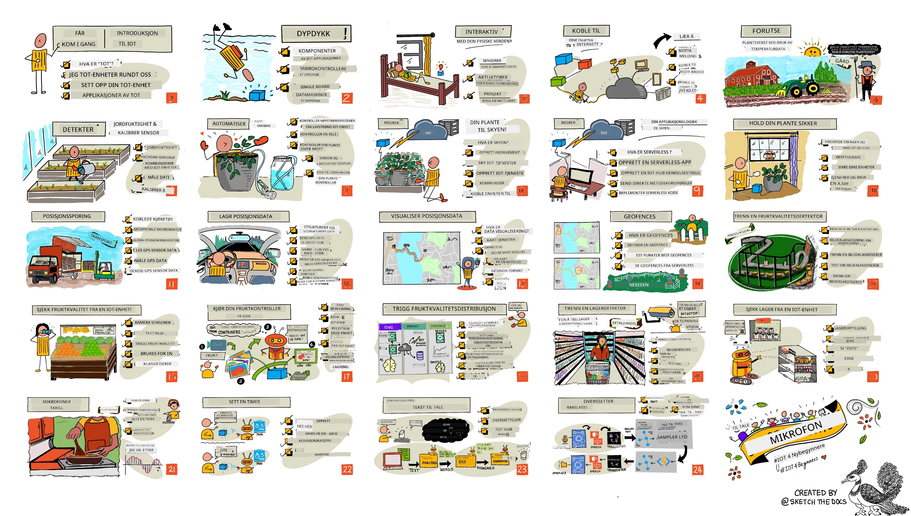

[](https://github.com/microsoft/IoT-For-Beginners/blob/master/LICENSE)
[](https://GitHub.com/microsoft/IoT-For-Beginners/graphs/contributors/)
[](https://GitHub.com/microsoft/IoT-For-Beginners/issues/)
[](https://GitHub.com/microsoft/IoT-For-Beginners/pulls/)
[](http://makeapullrequest.com)

[](https://GitHub.com/microsoft/IoT-For-Beginners/watchers/)
[](https://GitHub.com/microsoft/IoT-For-Beginners/network/)
[](https://GitHub.com/microsoft/IoT-For-Beginners/stargazers/)

### Bli med i Azure AI Foundry Community

Hvis du sitter fast eller har spørsmål om å bygge AI-apper. Bli med andre elever og erfarne utviklere i diskusjoner om MCP. Det er et støttende fellesskap hvor spørsmål er velkomne og kunnskap deles fritt.

[](https://discord.gg/nTYy5BXMWG)

Hvis du har produkttilbakemelding eller opplever feil under bygging, besøk:

[](https://aka.ms/foundry/forum)

Følg disse trinnene for å komme i gang med å bruke disse ressursene:
1. **Fork depotet**: Klikk [](https://GitHub.com/microsoft/IoT-For-Beginners/fork)
2. **Klon depotet**:   `git clone https://github.com/microsoft/IoT-For-Beginners.git`
3. [**Bli med i Microsoft Foundry Discord og møt eksperter og andre utviklere**](https://discord.com/invite/ByRwuEEgH4)


### 🌐 Flerspråklig støtte

#### Støttes via GitHub Action (Automatisk og alltid oppdatert)

<!-- CO-OP TRANSLATOR LANGUAGES TABLE START -->
[Arabic](../ar/README.md) | [Bengali](../bn/README.md) | [Bulgarian](../bg/README.md) | [Burmese (Myanmar)](../my/README.md) | [Chinese (Simplified)](../zh-CN/README.md) | [Chinese (Traditional, Hong Kong)](../zh-HK/README.md) | [Chinese (Traditional, Macau)](../zh-MO/README.md) | [Chinese (Traditional, Taiwan)](../zh-TW/README.md) | [Croatian](../hr/README.md) | [Czech](../cs/README.md) | [Danish](../da/README.md) | [Dutch](../nl/README.md) | [Estonian](../et/README.md) | [Finnish](../fi/README.md) | [French](../fr/README.md) | [German](../de/README.md) | [Greek](../el/README.md) | [Hebrew](../he/README.md) | [Hindi](../hi/README.md) | [Hungarian](../hu/README.md) | [Indonesian](../id/README.md) | [Italian](../it/README.md) | [Japanese](../ja/README.md) | [Kannada](../kn/README.md) | [Khmer](../km/README.md) | [Korean](../ko/README.md) | [Lithuanian](../lt/README.md) | [Malay](../ms/README.md) | [Malayalam](../ml/README.md) | [Marathi](../mr/README.md) | [Nepali](../ne/README.md) | [Nigerian Pidgin](../pcm/README.md) | [Norwegian](./README.md) | [Persian (Farsi)](../fa/README.md) | [Polish](../pl/README.md) | [Portuguese (Brazil)](../pt-BR/README.md) | [Portuguese (Portugal)](../pt-PT/README.md) | [Punjabi (Gurmukhi)](../pa/README.md) | [Romanian](../ro/README.md) | [Russian](../ru/README.md) | [Serbian (Cyrillic)](../sr/README.md) | [Slovak](../sk/README.md) | [Slovenian](../sl/README.md) | [Spanish](../es/README.md) | [Swahili](../sw/README.md) | [Swedish](../sv/README.md) | [Tagalog (Filipino)](../tl/README.md) | [Tamil](../ta/README.md) | [Telugu](../te/README.md) | [Thai](../th/README.md) | [Turkish](../tr/README.md) | [Ukrainian](../uk/README.md) | [Urdu](../ur/README.md) | [Vietnamese](../vi/README.md)

> **Foretrekker å klone lokalt?**
>
> Dette depotet inkluderer 50+ språkoversettelser som betydelig øker nedlastingsstørrelsen. For å klone uten oversettelser, bruk sparsomme utsjekking:
>
> **Bash / macOS / Linux:**
> ```bash
> git clone --filter=blob:none --sparse https://github.com/microsoft/IoT-For-Beginners.git
> cd IoT-For-Beginners
> git sparse-checkout set --no-cone '/*' '!translations' '!translated_images'
> ```
>
> **CMD (Windows):**
> ```cmd
> git clone --filter=blob:none --sparse https://github.com/microsoft/IoT-For-Beginners.git
> cd IoT-For-Beginners
> git sparse-checkout set --no-cone "/*" "!translations" "!translated_images"
> ```
>
> Dette gir deg alt du trenger for å fullføre kurset med en mye raskere nedlasting.
<!-- CO-OP TRANSLATOR LANGUAGES TABLE END -->

# IoT for nybegynnere - Et pensum

Azure Cloud Advocates hos Microsoft tilbyr med glede et 12-ukers, 24-leksjons pensum som handler om grunnleggende IoT. Hver leksjon inkluderer quiz før og etter leksjonen, skriftlige instruksjoner for å fullføre leksjonen, en løsning, en oppgave og mer. Vår prosjektbaserte pedagogikk lar deg lære mens du bygger, en bevist metode for at nye ferdigheter skal «sette seg».

Prosjektene dekker reisen til mat fra gård til bord. Dette inkluderer jordbruk, logistikk, produksjon, detaljhandel og forbruker – alle populære bransjeområder for IoT-enheter.



> Sketchnote av [Nitya Narasimhan](https://github.com/nitya). Klikk på bildet for en større versjon.

**Hjertelig takk til våre forfattere [Jen Fox](https://github.com/jenfoxbot), [Jen Looper](https://github.com/jlooper), [Jim Bennett](https://github.com/jimbobbennett), og vår sketchnote-kunstner [Nitya Narasimhan](https://github.com/nitya).**

**Takk også til vårt team av [Microsoft Learn Student Ambassadors](https://studentambassadors.microsoft.com?WT.mc_id=academic-17441-jabenn) som har gjennomgått og oversatt dette pensumet – [Aditya Garg](https://github.com/AdityaGarg00), [Anurag Sharma](https://github.com/Anurag-0-1-A), [Arpita Das](https://github.com/Arpiiitaaa), [Aryan Jain](https://www.linkedin.com/in/aryan-jain-47a4a1145/), [Bhavesh Suneja](https://github.com/EliteWarrior315), [Faith Hunja](https://faithhunja.github.io/), [Lateefah Bello](https://www.linkedin.com/in/lateefah-bello/), [Manvi Jha](https://github.com/Severus-Matthew), [Mireille Tan](https://www.linkedin.com/in/mireille-tan-a4834819a/), [Mohammad Iftekher (Iftu) Ebne Jalal](https://github.com/Iftu119), [Mohammad Zulfikar](https://github.com/mohzulfikar), [Priyanshu Srivastav](https://www.linkedin.com/in/priyanshu-srivastav-b067241ba), [Thanmai Gowducheruvu](https://github.com/innovation-platform), og [Zina Kamel](https://www.linkedin.com/in/zina-kamel/).**

Møt teamet!

[](https://youtu.be/-wippUJRi5k)

**Gif av** [Mohit Jaisal](https://linkedin.com/in/mohitjaisal)

> 🎥 Klikk på bildet over for en video om prosjektet!

> **Lærere**, vi har [inkludert noen forslag](for-teachers.md) om hvordan bruke dette pensumet. Hvis du ønsker å lage dine egne leksjoner, har vi også inkludert en [leksjonsmal](lesson-template/README.md).

> **[Studenter](https://aka.ms/student-page)**, for å bruke dette pensumet på egenhånd, forke hele repoet og gjennomfør øvelsene på egen hånd, start med en quiz før forelesning, les forelesningen og fullfør resten av aktivitetene. Prøv å lage prosjektene ved å forstå leksjonene i stedet for å kopiere løsningskoden; denne koden er likevel tilgjengelig i /solutions-mappene i hver prosjektorienterte leksjon. En annen idé kan være å danne en studiegruppe med venner og gå gjennom innholdet sammen. For videre studier anbefaler vi [Microsoft Learn](https://docs.microsoft.com/users/jimbobbennett/collections/ke2ehd351jopwr?WT.mc_id=academic-17441-jabenn).

For en videooversikt over dette kurset, sjekk ut denne videoen:

[](https://youtube.com/watch?v=bccEMm8gRuc "Promo video")

> 🎥 Klikk på bildet over for en video om prosjektet!

## Pedagogikk

Vi har valgt to pedagogiske prinsipper mens vi bygde dette pensumet: å sikre at det er prosjektbasert og at det inkluderer hyppige quizzer. Ved slutten av denne serien vil studentene ha bygget et system for overvåking og vanning av planter, en kjøretøysporing, et smart fabrikkoppsett for å spore og sjekke mat, og en stemmestyrt matlagingsklokke, og de vil ha lært det grunnleggende om tingenes internett inkludert hvordan skrive enhetskode, koble til skyen, analysere telemetri og kjøre AI på kanten.

Ved å sikre at innholdet samsvarer med prosjekter, blir prosessen mer engasjerende for studentene og opprettholdelsen av konsepter vil forbedres.

I tillegg setter en lavterskel-quiz før timen studentens intensjon mot å lære et tema, mens en andre quiz etter timen sikrer ytterligere opprettholdelse. Dette pensumet er designet for å være fleksibelt og morsomt og kan tas i sin helhet eller deler. Prosjektene begynner smått og blir gradvis mer komplekse ved slutten av 12-ukersperioden.

Hvert prosjekt er basert på ekte maskinvare tilgjengelig for studenter og hobbyister. Hvert prosjekt undersøker den spesifikke prosjekt-domenet, og gir relevant bakgrunnskunnskap. For å bli en vellykket utvikler hjelper det å forstå domenet du løser problemer i, og denne bakgrunnskunnskapen lar studentene tenke på sine IoT-løsninger og lærdommer i konteksten av den typen virkelige problemer som de kan bli bedt om å løse som IoT-utvikler. Studentene lærer 'hvorfor' av løsningene de bygger, og får en forståelse for sluttbrukeren.

## Maskinvare
Vi har to valg av IoT-maskinvare å bruke for prosjektene, avhengig av personlig preferanse, kunnskap om programmeringsspråk eller preferanser, læringsmål og tilgjengelighet. Vi har også gitt en 'virtuell maskinvare'-versjon for de som ikke har tilgang til maskinvare, eller som ønsker å lære mer før de forplikter seg til et kjøp. Du kan lese mer og finne en 'handleliste' på [maskinvaresiden](./hardware.md), inkludert lenker til å kjøpe komplette sett fra våre venner hos Seeed Studio.

> 💁 Finn våre [Regler for oppførsel](CODE_OF_CONDUCT.md), [Bidrag](CONTRIBUTING.md) og [Oversettelser](..) retningslinjer. Vi ønsker dine konstruktive tilbakemeldinger velkommen!
>
> 🔧 Har du problemer? Sjekk ut vår [Feilsøkingsguide](TROUBLESHOOTING.md) for løsninger på vanlige problemer.

## Hver leksjon inkluderer:

- sketchnote
- valgfri supplerende video
- quiz før leksjonen som oppvarming
- skriftlig leksjon
- for prosjektbaserte leksjoner, trinnvise guider for hvordan bygge prosjektet
- kunnskapstester
- en utfordring
- supplerende lesing
- oppgave
- [quiz etter leksjon](https://ff-quizzes.netlify.app/en/)

> **En merknad om quizzer**: Alle quizzer finnes i quiz-app mappen, totalt 48 quizzer med tre spørsmål hver. De er lenket fra innenfor leksjonene, men quiz-appen kan kjøres lokalt eller distribueres til Azure; følg instruksjonene i `quiz-app` mappen. De blir gradvis oversatt.

## Leksjoner

|       |              Prosjektnavn               |                       Konsepter som læres                       | Læringsmål                                                                                                                                                  |                                                        Lenket leksjon                                                        |
| :---: | :------------------------------------: | :--------------------------------------------------------------: | ----------------------------------------------------------------------------------------------------------------------------------------------------------- | :--------------------------------------------------------------------------------------------------------------------------: |
|  01   | [Kom i gang](./1-getting-started/README.md) |                     Introduksjon til IoT                        | Lær grunnprinsippene for IoT og de grunnleggende byggeklossene i IoT-løsninger som sensorer og skytjenester mens du setter opp din første IoT-enhet           |                      [Introduksjon til IoT](./1-getting-started/lessons/1-introduction-to-iot/README.md)                      |
|  02   | [Kom i gang](./1-getting-started/README.md) |                   En dypere utforskning av IoT                  | Lær mer om komponentene i et IoT-system, i tillegg til mikrokontrollere og enkeltkortdatamaskiner                                                              |                        [En dypere utforskning av IoT](./1-getting-started/lessons/2-deeper-dive/README.md)                     |
|  03   | [Kom i gang](./1-getting-started/README.md) | Samhandle med den fysiske verden med sensorer og aktuatorer     | Lær om sensorer for å samle data fra den fysiske verden, og aktuatorer for å sende tilbakemelding, mens du bygger et nattlys                                  | [Samhandle med den fysiske verden med sensorer og aktuatorer](./1-getting-started/lessons/3-sensors-and-actuators/README.md) |
|  04   | [Kom i gang](./1-getting-started/README.md) |             Koble enheten din til Internett                      | Lær om hvordan du kobler en IoT-enhet til Internett for å sende og motta meldinger ved å koble nattlyset ditt til en MQTT-melder                             |               [Koble enheten din til Internett](./1-getting-started/lessons/4-connect-internet/README.md)                      |
|  05   |            [Gård](./2-farm/README.md)            |                    Forutsi plantevekst                          | Lær hvordan du kan forutsi plantevekst ved hjelp av temperaturdata samlet av en IoT-enhet                                                                    |                          [Forutsi plantevekst](./2-farm/lessons/1-predict-plant-growth/README.md)                             |
|  06   |            [Gård](./2-farm/README.md)            |                    Oppdag jordfuktighet                         | Lær hvordan du oppdager jordfuktighet og kalibrerer en jordfuktighetssensor                                                                                   |                          [Oppdag jordfuktighet](./2-farm/lessons/2-detect-soil-moisture/README.md)                             |
|  07   |            [Gård](./2-farm/README.md)            |                  Automatisert plantevanning                     | Lær hvordan du automatiserer og timer vanningen ved hjelp av en relé og MQTT                                                                                 |                      [Automatisert plantevanning](./2-farm/lessons/3-automated-plant-watering/README.md)                      |
|  08   |            [Gård](./2-farm/README.md)            |               Migrer planten din til skyen                      | Lær om skyen og skythostede IoT-tjenester og hvordan du kobler planten din til en av disse i stedet for en offentlig MQTT-melder                            |               [Migrer planten din til skyen](./2-farm/lessons/4-migrate-your-plant-to-the-cloud/README.md)                    |
|  09   |            [Gård](./2-farm/README.md)            |         Migrer applikasjonslogikken din til skyen              | Lær om hvordan du kan skrive applikasjonslogikk i skyen som reagerer på IoT-meldinger                                                                        |         [Migrer applikasjonslogikken din til skyen](./2-farm/lessons/5-migrate-application-to-the-cloud/README.md)           |
|  10   |            [Gård](./2-farm/README.md)            |                   Hold planten din sikker                         | Lær om sikkerhet med IoT og hvordan du sikrer planten din med nøkler og sertifikater                                                                          |                        [Hold planten din sikker](./2-farm/lessons/6-keep-your-plant-secure/README.md)                          |
|  11   |       [Transport](./3-transport/README.md)       |                      Stedssporing                               | Lær om GPS-stedssporing for IoT-enheter                                                                                                                     |                           [Stedssporing](./3-transport/lessons/1-location-tracking/README.md)                                 |
|  12   |       [Transport](./3-transport/README.md)       |                     Lagre steddata                              | Lær hvordan du lagrer IoT-data som kan visualiseres eller analyseres senere                                                                                   |                         [Lagre steddata](./3-transport/lessons/2-store-location-data/README.md)                                 |
|  13   |       [Transport](./3-transport/README.md)       |                   Visualiser steddata                           | Lær om visualisering av steddata på et kart, og hvordan kart representerer den virkelige 3D-verden i 2 dimensjoner                                            |                     [Visualiser steddata](./3-transport/lessons/3-visualize-location-data/README.md)                          |
|  14   |       [Transport](./3-transport/README.md)       |                          Geofences                               | Lær om geofences, og hvordan de kan brukes til å varsle når kjøretøy i forsyningskjeden er nær deres destinasjon                                            |                                   [Geofences](./3-transport/lessons/4-geofences/README.md)                                   |
|  15   |   [Fabrikk](./4-manufacturing/README.md)   |               Tren en fruktkvalitetsdetektor                    | Lær om å trene en bildegjenkjenner i skyen for å oppdage fruktkvalitet                                                                                        |                 [Tren en fruktkvalitetsdetektor](./4-manufacturing/lessons/1-train-fruit-detector/README.md)                  |
|  16   |   [Fabrikk](./4-manufacturing/README.md)   |           Sjekk fruktkvalitet fra en IoT-enhet                 | Lær om bruk av din fruktkvalitetsdetektor fra en IoT-enhet                                                                                                   |           [Sjekk fruktkvalitet fra en IoT-enhet](./4-manufacturing/lessons/2-check-fruit-from-device/README.md)             |
|  17   |   [Fabrikk](./4-manufacturing/README.md)   |             Kjør fruktdetektoren din på kanten                  | Lær om å kjøre fruktdetektoren din på en IoT-enhet i kanten                                                                                                  |             [Kjør fruktdetektoren din på kanten](./4-manufacturing/lessons/3-run-fruit-detector-edge/README.md)               |
|  18   |   [Fabrikk](./4-manufacturing/README.md)   |        Utløse fruktkvalitetsdeteksjon fra en sensor             | Lær om å utløse fruktkvalitetsdeteksjon fra en sensor                                                                                                       |        [Utløse fruktkvalitetsdeteksjon fra en sensor](./4-manufacturing/lessons/4-trigger-fruit-detector/README.md)           |
|  19   |          [Detaljhandel](./5-retail/README.md)          |                   Tren en lagerdetektor                         | Lær hvordan du bruker objektdeteksjon for å trene en lagerdetektor til å telle lager i en butikk                                                             |                        [Tren en lagerdetektor](./5-retail/lessons/1-train-stock-detector/README.md)                           |
|  20   |          [Detaljhandel](./5-retail/README.md)          |               Sjekk lager fra en IoT-enhet                      | Lær hvordan du sjekker lager fra en IoT-enhet ved hjelp av en objektdeteksjonsmodell                                                                         |                     [Sjekk lager fra en IoT-enhet](./5-retail/lessons/2-check-stock-device/README.md)                        |
|  21   |        [Forbruker](./6-consumer/README.md)        |             Gjenkjenn tale med en IoT-enhet                    | Lær hvordan du gjenkjenner tale fra en IoT-enhet for å bygge en smart tidtaker                                                                              |                  [Gjenkjenn tale med en IoT-enhet](./6-consumer/lessons/1-speech-recognition/README.md)                      |
|  22   |        [Forbruker](./6-consumer/README.md)        |                     Forstå språk                                | Lær hvordan du forstår setninger som blir sagt til en IoT-enhet                                                                                              |                        [Forstå språk](./6-consumer/lessons/2-language-understanding/README.md)                                |
|  23   |        [Forbruker](./6-consumer/README.md)        |           Sett en timer og gi muntlig tilbakemelding           | Lær hvordan du setter en timer på en IoT-enhet og gir muntlig tilbakemelding om når timeren settes og når den er ferdig                                    |                 [Sett en timer og gi muntlig tilbakemelding](./6-consumer/lessons/3-spoken-feedback/README.md)              |
|  24   |        [Forbruker](./6-consumer/README.md)        |                 Støtte flere språk                             | Lær hvordan du støtter flere språk, både når det snakkes til enheten og ved svarene fra din smart timer                                                    |                   [Støtte flere språk](./6-consumer/lessons/4-multiple-language-support/README.md)                           |

## Frakoblet tilgang

Du kan kjøre denne dokumentasjonen frakoblet ved bruk av [Docsify](https://docsify.js.org/#/). Fork dette repoet, [installer Docsify](https://docsify.js.org/#/quickstart) på din lokale maskin, og skriv deretter `docsify serve` i rotmappen til dette repoet. Nettstedet vil bli servert på port 3000 på din localhost: `localhost:3000`.

## Quiz

Takk til fellesskapet for å være vert for den interaktive quizen som tester kunnskapen din om hvert av kapitlene. Du kan teste kunnskapen din [her](https://ff-quizzes.netlify.app/en/)

### PDF

Du kan generere en PDF av dette innholdet for frakoblet tilgang om ønskelig. For å gjøre dette, sørg for at du har [npm installert](https://docs.npmjs.com/downloading-and-installing-node-js-and-npm) og kjør følgende kommandoer i rotmappen til dette repoet:

```sh
npm i
npm run convert
```

### Lysbilder

Det finnes lysbildefremvisninger for noen av leksjonene i [slides](../../slides)-mappen.


## Andre læreplaner

Vårt team produserer andre læreplaner! Sjekk ut:

<!-- CO-OP TRANSLATOR OTHER COURSES START -->
### LangChain
[](https://aka.ms/langchain4j-for-beginners)
[](https://aka.ms/langchainjs-for-beginners?WT.mc_id=m365-94501-dwahlin)
[](https://github.com/microsoft/langchain-for-beginners?WT.mc_id=m365-94501-dwahlin)
---

### Azure / Edge / MCP / Agents
[](https://github.com/microsoft/AZD-for-beginners?WT.mc_id=academic-105485-koreyst)
[](https://github.com/microsoft/edgeai-for-beginners?WT.mc_id=academic-105485-koreyst)
[](https://github.com/microsoft/mcp-for-beginners?WT.mc_id=academic-105485-koreyst)
[](https://github.com/microsoft/ai-agents-for-beginners?WT.mc_id=academic-105485-koreyst)

---
 
### Generativ AI-serie
[](https://github.com/microsoft/generative-ai-for-beginners?WT.mc_id=academic-105485-koreyst)
[-9333EA?style=for-the-badge&labelColor=E5E7EB&color=9333EA)](https://github.com/microsoft/Generative-AI-for-beginners-dotnet?WT.mc_id=academic-105485-koreyst)
[-C084FC?style=for-the-badge&labelColor=E5E7EB&color=C084FC)](https://github.com/microsoft/generative-ai-for-beginners-java?WT.mc_id=academic-105485-koreyst)
[-E879F9?style=for-the-badge&labelColor=E5E7EB&color=E879F9)](https://github.com/microsoft/generative-ai-with-javascript?WT.mc_id=academic-105485-koreyst)

---
 
### Kjerneopplæring
[](https://aka.ms/ml-beginners?WT.mc_id=academic-105485-koreyst)
[](https://aka.ms/datascience-beginners?WT.mc_id=academic-105485-koreyst)
[](https://aka.ms/ai-beginners?WT.mc_id=academic-105485-koreyst)
[](https://github.com/microsoft/Security-101?WT.mc_id=academic-96948-sayoung)
[](https://aka.ms/webdev-beginners?WT.mc_id=academic-105485-koreyst)
[](https://aka.ms/iot-beginners?WT.mc_id=academic-105485-koreyst)
[](https://github.com/microsoft/xr-development-for-beginners?WT.mc_id=academic-105485-koreyst)

---
 
### Copilot-serie
[](https://aka.ms/GitHubCopilotAI?WT.mc_id=academic-105485-koreyst)
[](https://github.com/microsoft/mastering-github-copilot-for-dotnet-csharp-developers?WT.mc_id=academic-105485-koreyst)
[](https://github.com/microsoft/CopilotAdventures?WT.mc_id=academic-105485-koreyst)
<!-- CO-OP TRANSLATOR OTHER COURSES END -->

## Bildehenvisninger

Du kan finne alle henvisninger for bildene brukt i dette læreplanen der det er nødvendig i [Attributions](./attributions.md).

---

<!-- CO-OP TRANSLATOR DISCLAIMER START -->
**Ansvarsfraskrivelse**:  
Dette dokumentet er oversatt ved hjelp av AI-oversettelsestjenesten [Co-op Translator](https://github.com/Azure/co-op-translator). Selv om vi streber etter nøyaktighet, vennligst vær oppmerksom på at automatiske oversettelser kan inneholde feil eller unøyaktigheter. Det originale dokumentet på dets opprinnelige språk bør anses som den autoritative kilden. For kritisk informasjon anbefales profesjonell menneskelig oversettelse. Vi er ikke ansvarlige for eventuelle misforståelser eller feiltolkninger som oppstår ved bruk av denne oversettelsen.
<!-- CO-OP TRANSLATOR DISCLAIMER END -->